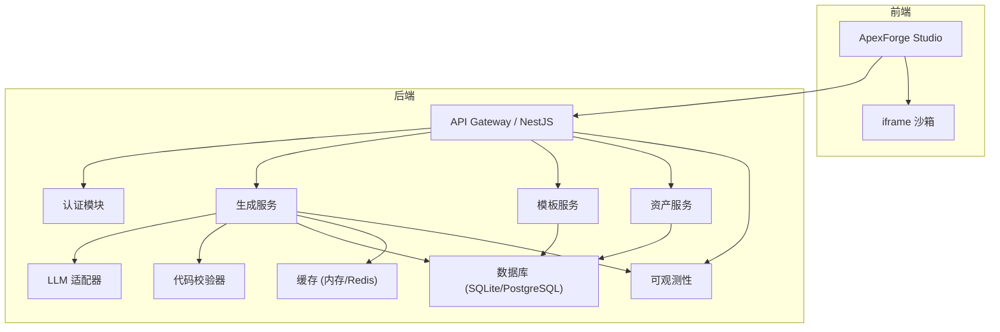
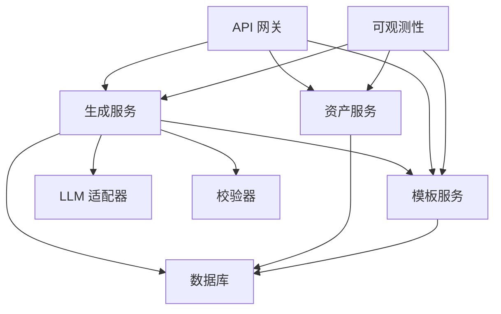

# API 接口文档

<cite>
**本文引用的文件**
- [产品技术设计文档](file://tech/product-technical-design.md)
- [产品需求文档](file://prd.md)
</cite>

## 目录
1. [简介](#简介)
2. [项目结构](#项目结构)
3. [核心组件](#核心组件)
4. [架构总览](#架构总览)
5. [详细组件分析](#详细组件分析)
6. [依赖关系分析](#依赖关系分析)
7. [性能考虑](#性能考虑)
8. [故障排查指南](#故障排查指南)
9. [结论](#结论)
10. [附录](#附录)

## 简介
本文件为 ApexForge 平台的 API 接口文档，覆盖 RESTful API、SSE（Server-Sent Events）事件流以及前端沙箱与后端交互的协议约定。重点包括：
- 生成任务管理：创建、查询、保存资产、版本管理等
- 资产管理：资产列表、版本查询、导出等
- 模板服务：模板列表、详情、渲染、版本发布等
- 认证与安全：JWT、API Key、限流、输入输出安全
- 错误处理策略、速率限制、版本信息
- 常见用例、客户端实现指南、性能优化技巧
- 调试工具与监控方法、弃用功能迁移与兼容性说明

## 项目结构
平台采用前后端分离与模块化架构，MVP 阶段使用单体后端（NestJS + SQLite），逐步演进到微服务化与云原生部署。



图表来源
- [产品技术设计文档:38-100](file://tech/product-technical-design.md#L38-L100)

章节来源
- [产品技术设计文档:34-100](file://tech/product-technical-design.md#L34-L100)
- [产品需求文档:33-53](file://prd.md#L33-L53)

## 核心组件
- 认证模块：负责用户 JWT 鉴权与开放平台 API Key 管理
- 生成服务：编排 Prompt、选择模式（模板/代码/混合）、调用 LLM、执行校验与评分、持久化结果
- 模板服务：维护模板与版本、参数 Schema、默认参数与渲染函数
- 资产服务：管理模型资产与版本、截图与指标、导出能力
- 可观测性：traceId、日志、指标、告警

章节来源
- [产品技术设计文档:574-630](file://tech/product-technical-design.md#L574-L630)
- [产品技术设计文档:868-908](file://tech/product-technical-design.md#L868-L908)

## 架构总览
整体数据流从前端发起请求，经网关鉴权与限流后进入对应服务；生成链路包含缓存命中、模板匹配、LLM 生成、AST 校验、质量评分与结果持久化；前端通过 SSE 或轮询获取状态，并在 iframe 沙箱中执行生成的代码以渲染模型。

```mermaid
sequenceDiagram
participant FE as "前端"
participant GW as "API 网关"
participant GEN as "生成服务"
participant TPL as "模板服务"
participant LLM as "LLM 适配器"
participant VAL as "校验器"
participant DB as "数据库"
participant BOX as "iframe 沙箱"
FE->>GW : "POST /api/v1/generations"
GW->>GEN : "创建生成任务"
GEN->>DB : "写入任务记录"
alt "缓存命中"
GEN-->>FE : "返回已缓存结果"
else "未命中"
GEN->>TPL : "候选模板匹配"
TPL-->>GEN : "模板候选"
GEN->>LLM : "生成代码或参数"
LLM-->>GEN : "输出"
GEN->>VAL : "AST 与黑名单校验"
VAL-->>GEN : "校验报告"
GEN->>DB : "持久化结果"
GEN-->>FE : "返回结果"
end
FE->>BOX : "在 iframe 执行代码并序列化模型"
BOX-->>FE : "返回模型 JSON"
```

图表来源
- [产品技术设计文档:361-390](file://tech/product-technical-design.md#L361-L390)

章节来源
- [产品技术设计文档:327-390](file://tech/product-technical-design.md#L327-L390)

## 详细组件分析

### 通用规范与版本
- Base URL：/api/v1
- 认证方式：
  - 用户侧：JWT（Header Authorization: Bearer <token>）
  - 开放平台：API Key（Header X-API-Key 或 Query 参数，具体由网关配置）
- 响应统一包含 traceId
- 错误响应统一结构：{ traceId, error: { code, message, details } }

章节来源
- [产品技术设计文档:632-652](file://tech/product-technical-design.md#L632-L652)

### 生成任务管理 API

#### 创建生成任务
- 方法：POST
- 路径：/api/v1/generations
- 认证：JWT 或 API Key
- 请求体字段：
  - projectId：字符串，必填
  - prompt：字符串，必填，长度限制见“输入安全”
  - category：字符串，可选
  - mode：枚举 auto|template|code|hybrid，默认 auto
  - contextVersionId：字符串，可选，上下文 Prompt 版本
  - preferences：对象，可选，如 style、quality
- 响应体字段：
  - traceId：字符串
  - data.taskId：字符串
  - data.status：queued|generating|validating|renderable|failed
  - data.mode：template|code|hybrid
  - data.templateId：字符串，可选
  - data.params：对象，可选
  - data.code：字符串，可选
  - data.validationReport：对象，可选
  - data.qualityScore：对象，可选

示例请求体与响应体参考：
- 请求体示例路径：[产品技术设计文档:660-672](file://tech/product-technical-design.md#L660-L672)
- 响应体示例路径：[产品技术设计文档:676-695](file://tech/product-technical-design.md#L676-L695)

章节来源
- [产品技术设计文档:654-695](file://tech/product-technical-design.md#L654-L695)

#### 查询生成任务
- 方法：GET
- 路径：/api/v1/generations/{taskId}
- 认证：JWT 或 API Key
- 响应：任务状态、生成结果、错误信息与质量评分

章节来源
- [产品技术设计文档:697-701](file://tech/product-technical-design.md#L697-L701)

#### 保存为资产
- 方法：POST
- 路径：/api/v1/assets
- 认证：JWT 或 API Key
- 请求体字段：
  - projectId：字符串，必填
  - generationTaskId：字符串，必填
  - name：字符串，必填
  - tags：字符串数组，可选

示例请求体参考：
- [产品技术设计文档:709-716](file://tech/product-technical-design.md#L709-L716)

章节来源
- [产品技术设计文档:703-716](file://tech/product-technical-design.md#L703-L716)

#### 查询资产版本
- 方法：GET
- 路径：/api/v1/assets/{assetId}/versions
- 认证：JWT 或 API Key
- 响应：该资产的全部版本、Prompt、参数、截图与指标

章节来源
- [产品技术设计文档:718-722](file://tech/product-technical-design.md#L718-L722)

#### SSE 事件流
- 方法：GET
- 路径：/api/v1/generations/{taskId}/events
- 认证：JWT 或 API Key
- 事件类型：queued、generating、validating、repairing、renderable、failed
- 事件体字段：event、traceId、taskId、message

事件示例参考：
- [产品技术设计文档:747-756](file://tech/product-technical-design.md#L747-L756)

章节来源
- [产品技术设计文档:734-756](file://tech/product-technical-design.md#L734-L756)

### 模板服务 API

#### 模板列表
- 方法：GET
- 路径：/api/v1/templates
- 认证：JWT 或 API Key
- 响应：模板列表（名称、分类、标签、状态等）

章节来源
- [产品技术设计文档:726-733](file://tech/product-technical-design.md#L726-L733)

#### 模板详情
- 方法：GET
- 路径：/api/v1/templates/{id}
- 认证：JWT 或 API Key
- 响应：模板元数据、参数 Schema、默认参数、渲染函数等

章节来源
- [产品技术设计文档:726-733](file://tech/product-technical-design.md#L726-L733)

#### 模板渲染
- 方法：POST
- 路径：/api/v1/templates/{id}/render
- 认证：JWT 或 API Key
- 请求体：模板 ID 与参数对象
- 响应：生成的模型代码或参数化结果

章节来源
- [产品技术设计文档:726-733](file://tech/product-technical-design.md#L726-L733)

#### 创建模板（管理端）
- 方法：POST
- 路径：/api/v1/templates
- 权限：管理端
- 请求体：模板元数据、参数 Schema、渲染函数、示例 Prompt 等

章节来源
- [产品技术设计文档:726-733](file://tech/product-technical-design.md#L726-L733)

#### 发布模板版本
- 方法：POST
- 路径：/api/v1/templates/{id}/versions
- 权限：管理端
- 请求体：语义化版本、参数 Schema、默认参数、渲染函数、校验规则等

章节来源
- [产品技术设计文档:726-733](file://tech/product-technical-design.md#L726-L733)

### 认证与安全

#### 认证方式
- 用户侧：JWT（Authorization: Bearer <token>）
- 开放平台：API Key（建议 Header X-API-Key，或网关配置的 Query 参数）
- 鉴权失败返回统一错误结构

章节来源
- [产品技术设计文档:632-652](file://tech/product-technical-design.md#L632-L652)

#### 输入安全
- Prompt 长度限制：MVP 建议不超过 2000 字符
- 敏感词过滤与合规检查
- 品牌与侵权内容拦截

章节来源
- [产品技术设计文档:910-930](file://tech/product-technical-design.md#L910-L930)

#### 输出安全
- 服务端输出协议校验、文本黑名单扫描、AST 白名单校验
- 模型不得包含违规符号或侵权标识
- 开放 API 生成结果默认私有

章节来源
- [产品技术设计文档:910-930](file://tech/product-technical-design.md#L910-L930)

#### 速率限制
- 令牌桶限流：每用户每分钟请求数限制（例如 10 req/min）
- 并发任务上限与配额维度（每日生成次数、API 调用量等）

章节来源
- [产品需求文档:131-132](file://prd.md#L131-L132)
- [产品技术设计文档:856-865](file://tech/product-technical-design.md#L856-L865)

### 错误处理策略

#### 统一错误结构
- 字段：traceId、error.code、error.message、error.details

示例参考：
- [产品技术设计文档:643-652](file://tech/product-technical-design.md#L643-L652)

#### 沙箱错误码
- SANDBOX_TIMEOUT：执行超时
- SANDBOX_RUNTIME_ERROR：运行时报错
- MODEL_JSON_INVALID：返回结构非法
- MODEL_TOO_COMPLEX：复杂度超限
- MODEL_EMPTY：未生成有效对象

章节来源
- [产品技术设计文档:508-517](file://tech/product-technical-design.md#L508-L517)

### 实时交互模式（SSE）
- 连接建立：GET /api/v1/generations/{taskId}/events
- 事件类型：queued、generating、validating、repairing、renderable、failed
- 事件体包含 event、traceId、taskId、message

章节来源
- [产品技术设计文档:734-756](file://tech/product-technical-design.md#L734-L756)

### 前端沙箱与 Three.js 集成
- 执行流程：主线程 postMessage 发送执行指令 → iframe 执行 buildModel(params, THREE) → group.toJSON() 序列化 → 主线程 ObjectLoader 反序列化并挂载场景
- 超时销毁与错误映射
- 模型居中与缩放、复杂度统计

章节来源
- [产品技术设计文档:478-507](file://tech/product-technical-design.md#L478-L507)

### 常见用例与客户端实现指南

#### 用例一：自然语言生成 3D 模型
- 步骤：
  1) 前端 POST /api/v1/generations 提交 prompt 与偏好
  2) 订阅 SSE 事件流获取进度
  3) 收到 renderable 事件后拉取任务详情
  4) 将 code 或 params 传入 iframe 沙箱执行
  5) 加载模型并展示
- 参考路径：
  - 创建任务与响应示例：[产品技术设计文档:654-695](file://tech/product-technical-design.md#L654-L695)
  - SSE 事件定义：[产品技术设计文档:734-756](file://tech/product-technical-design.md#L734-L756)
  - 沙箱执行流程：[产品技术设计文档:478-507](file://tech/product-technical-design.md#L478-L507)

#### 用例二：基于模板的参数化生成
- 步骤：
  1) GET /api/v1/templates 获取模板列表
  2) GET /api/v1/templates/{id} 查看参数 Schema
  3) POST /api/v1/templates/{id}/render 提交参数
  4) 渲染结果直接用于前端展示或保存为资产
- 参考路径：
  - 模板接口定义：[产品技术设计文档:726-733](file://tech/product-technical-design.md#L726-L733)

#### 用例三：保存与版本管理
- 步骤：
  1) POST /api/v1/assets 保存为资产
  2) GET /api/v1/assets/{assetId}/versions 查看版本历史
- 参考路径：
  - 保存资产示例：[产品技术设计文档:703-716](file://tech/product-technical-design.md#L703-L716)
  - 版本查询接口：[产品技术设计文档:718-722](file://tech/product-technical-design.md#L718-L722)

章节来源
- [产品技术设计文档:654-756](file://tech/product-technical-design.md#L654-L756)

### 性能优化技巧
- 前端：
  - 动态加载 Three.js 与沙箱 runtime
  - 大模型解析放入 Worker
  - 重复几何体使用 InstancedMesh
  - 释放旧模型 geometry/material/texture
- 后端：
  - 相似 Prompt 缓存复用
  - 模板模式跳过 LLM 代码生成
  - 异步队列化生成任务
  - Redis 缓存热门模板与参数 Schema

章节来源
- [产品技术设计文档:933-958](file://tech/product-technical-design.md#L933-L958)

### 调试工具与监控方法
- Trace 链路：每个请求携带 traceId，贯穿前端、网关、生成服务、LLM、校验、数据库与沙箱
- 日志字段：traceId、userId、workspaceId、taskId、provider、promptVersion、generationMode、latencyMs、status、errorCode、qualityScore
- 告警规则：生成失败率过高、LLM 延迟过高、校验失败突增、沙箱超时突增、API 错误率过高

章节来源
- [产品技术设计文档:868-908](file://tech/product-technical-design.md#L868-L908)

### 弃用功能与向后兼容
- 版本前缀：/api/v1，后续新增接口遵循 v2 前缀
- 弃用策略：保留旧接口至少一个主要版本周期，返回 Deprecation 头与迁移指引
- 兼容性：保持错误结构与 traceId 不变，便于客户端升级

章节来源
- [产品技术设计文档:632-652](file://tech/product-technical-design.md#L632-L652)

## 依赖关系分析
- 生成服务依赖模板服务进行候选匹配，依赖 LLM 适配器进行代码或参数生成，依赖校验器进行 AST 与黑名单校验，最终持久化至数据库
- 资产服务与模板服务共享数据库，支持版本管理与导出
- 可观测性贯穿各服务，提供日志、指标与告警



图表来源
- [产品技术设计文档:594-630](file://tech/product-technical-design.md#L594-L630)

章节来源
- [产品技术设计文档:574-630](file://tech/product-technical-design.md#L574-L630)

## 性能考虑
- 前端渲染优化：按需加载、Worker 解析、InstancedMesh、LOD、相机与控制器解耦
- 后端优化：缓存、模板模式、异步队列、供应商路由与熔断、Redis 热点缓存
- 数据库优化：索引设计、大字段迁移对象存储、历史归档

章节来源
- [产品技术设计文档:933-958](file://tech/product-technical-design.md#L933-L958)

## 故障排查指南
- 常见问题定位：
  - 生成失败：检查 traceId 与错误码，关注校验失败原因与 LLM 供应商延迟
  - 沙箱异常：根据错误码判断超时、运行时错误或模型复杂度过高
  - 资源占用：确认旧模型是否正确释放，避免内存泄漏
- 监控与告警：
  - 失败率与延迟阈值告警
  - 校验失败与沙箱超时突增告警
  - API 错误率告警

章节来源
- [产品技术设计文档:898-908](file://tech/product-technical-design.md#L898-L908)
- [产品技术设计文档:508-517](file://tech/product-technical-design.md#L508-L517)

## 结论
本 API 文档围绕生成任务管理、资产管理与模板服务等核心能力，提供了完整的 REST/SSE 接口规范、认证与安全策略、错误处理与性能优化建议，并给出调试与监控方法。建议在实施过程中严格遵循统一错误结构与 traceId 体系，结合模板优先与缓存策略提升稳定性与性能。

## 附录

### 数据模型概览（与 API 相关）
- 生成任务：任务 ID、状态、模式、模板 ID、生成代码/参数、校验报告、质量评分
- 资产与版本：资产 ID、当前版本、代码/参数、模型 JSON 地址、截图与指标
- 模板与版本：模板 ID、参数 Schema、默认参数、渲染函数、示例 Prompt、校验规则

章节来源
- [产品技术设计文档:215-324](file://tech/product-technical-design.md#L215-L324)