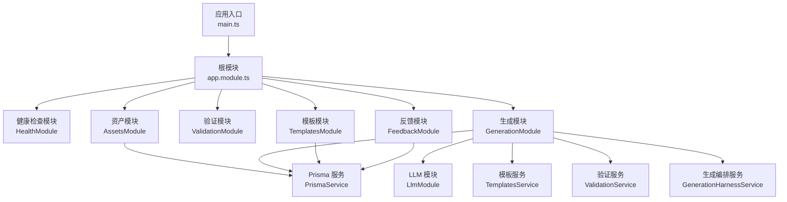
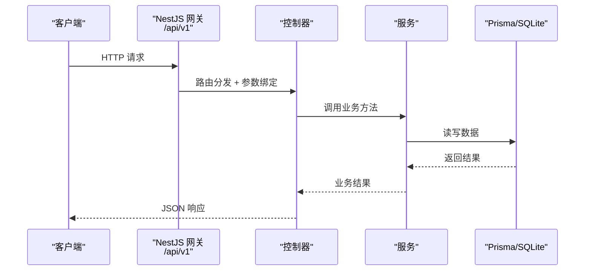
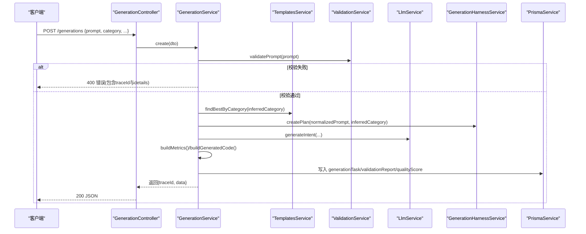
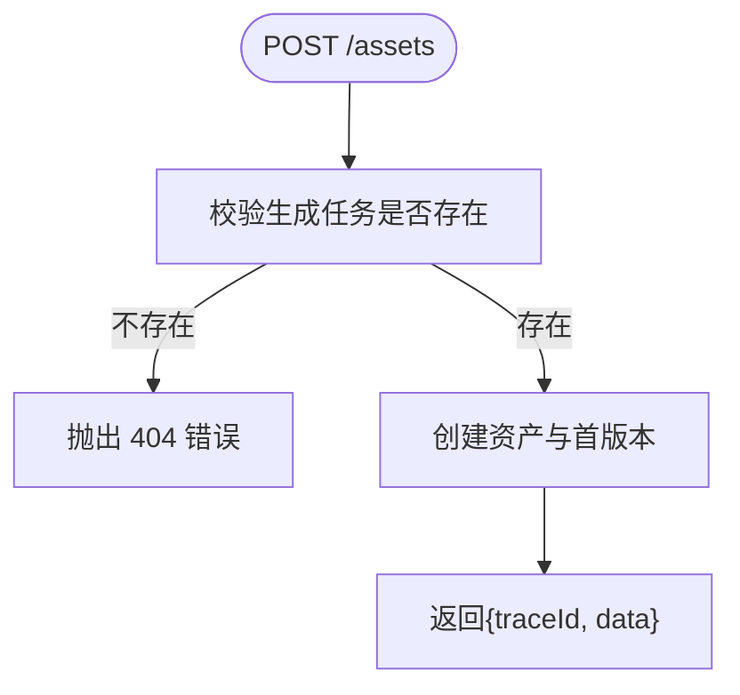
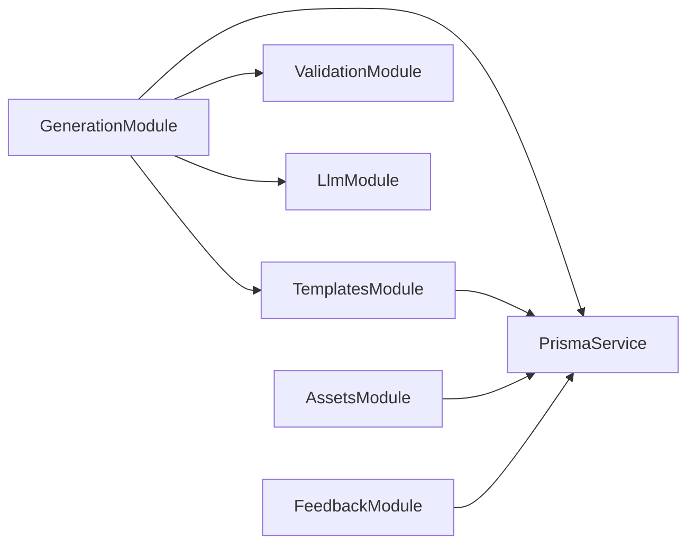

# RESTful API 接口

<cite>
**本文引用的文件**   
- [main.ts](file://apps/api/src/main.ts)
- [app.module.ts](file://apps/api/src/app.module.ts)
- [assets.controller.ts](file://apps/api/src/modules/assets/assets.controller.ts)
- [assets.service.ts](file://apps/api/src/modules/assets/assets.service.ts)
- [create-asset.dto.ts](file://apps/api/src/modules/assets/dto/create-asset.dto.ts)
- [feedback.controller.ts](file://apps/api/src/modules/feedback/feedback.controller.ts)
- [create-feedback.dto.ts](file://apps/api/src/modules/feedback/dto/create-feedback.dto.ts)
- [generation.controller.ts](file://apps/api/src/modules/generation/generation.controller.ts)
- [generation.service.ts](file://apps/api/src/modules/generation/generation.service.ts)
- [create-generation.dto.ts](file://apps/api/src/modules/generation/dto/create-generation.dto.ts)
- [templates.controller.ts](file://apps/api/src/modules/templates/templates.controller.ts)
- [templates.service.ts](file://apps/api/src/modules/templates/templates.service.ts)
- [health.controller.ts](file://apps/api/src/modules/health/health.controller.ts)
- [json.ts](file://apps/api/src/common/json.ts)
- [schema.prisma](file://prisma/schema.prisma)
- [prisma.service.ts](file://apps/api/src/prisma/prisma.service.ts)
</cite>

## 目录
1. [简介](#简介)
2. [项目结构](#项目结构)
3. [核心组件](#核心组件)
4. [架构总览](#架构总览)
5. [详细组件分析](#详细组件分析)
6. [依赖分析](#依赖分析)
7. [性能考虑](#性能考虑)
8. [故障排查指南](#故障排查指南)
9. [结论](#结论)
10. [附录](#附录)

## 简介
本文件面向开发者与使用者，系统化梳理 ApexForge 后端 RESTful API 的接口定义、数据模型、处理流程与错误约定。API 基于 NestJS 构建，统一前缀为 /api/v1，采用全局校验管道进行入参白名单与类型转换，并通过 Prisma 访问 SQLite 数据库。生成任务支持 SSE（Server-Sent Events）事件流，便于前端实时感知渲染就绪状态。

## 项目结构
- 应用入口与全局配置：统一前缀、CORS、全局校验管道
- 模块划分：按领域拆分控制器与服务（资产、反馈、生成、模板、健康检查等）
- 数据层：Prisma 服务封装与 schema 定义
- 通用工具：ID 与 TraceId 生成、JSON 序列化/解析



图示来源
- [main.ts:1-23](file://apps/api/src/main.ts#L1-L23)
- [app.module.ts:1-24](file://apps/api/src/app.module.ts#L1-L24)
- [generation.module.ts:1-16](file://apps/api/src/modules/generation/generation.module.ts#L1-L16)
- [assets.module.ts:1-10](file://apps/api/src/modules/assets/assets.module.ts#L1-L10)
- [prisma.service.ts:1-14](file://apps/api/src/prisma/prisma.service.ts#L1-L14)

章节来源
- [main.ts:1-23](file://apps/api/src/main.ts#L1-L23)
- [app.module.ts:1-24](file://apps/api/src/app.module.ts#L1-L24)

## 核心组件
- 全局配置
  - 统一路径前缀：/api/v1
  - CORS 启用
  - 全局 ValidationPipe：白名单、自动转换、拒绝未声明字段
- 控制器与 DTO
  - 资产：创建、列表、版本查询
  - 反馈：提交评分与备注
  - 生成：创建任务、列表、详情、SSE 事件
  - 模板：按分类查询
  - 健康：服务存活与健康信息
- 服务与数据层
  - 模板服务：种子初始化、分类归一化、最佳模板选择
  - 生成服务：提示词校验、意图推断、参数合成、指标计算、持久化
  - 资产服务：从生成任务创建资产与版本、版本列表
  - Prisma 服务：连接与生命周期管理
- 通用工具
  - ID/TraceId 生成、JSON 安全序列化/解析

章节来源
- [main.ts:6-18](file://apps/api/src/main.ts#L6-L18)
- [assets.controller.ts:1-24](file://apps/api/src/modules/assets/assets.controller.ts#L1-L24)
- [assets.service.ts:1-91](file://apps/api/src/modules/assets/assets.service.ts#L1-L91)
- [feedback.controller.ts:1-14](file://apps/api/src/modules/feedback/feedback.controller.ts#L1-L14)
- [generation.controller.ts:1-36](file://apps/api/src/modules/generation/generation.controller.ts#L1-L36)
- [generation.service.ts:1-309](file://apps/api/src/modules/generation/generation.service.ts#L1-L309)
- [templates.controller.ts:1-17](file://apps/api/src/modules/templates/templates.controller.ts#L1-L17)
- [templates.service.ts:1-99](file://apps/api/src/modules/templates/templates.service.ts#L1-L99)
- [health.controller.ts:1-17](file://apps/api/src/modules/health/health.controller.ts#L1-L17)
- [json.ts:1-24](file://apps/api/src/common/json.ts#L1-L24)
- [prisma.service.ts:1-14](file://apps/api/src/prisma/prisma.service.ts#L1-L14)

## 架构总览
RESTful API 遵循分层设计：Controller 负责路由与入参绑定，Service 承载业务逻辑，PrismaService 提供数据访问。DTO 通过 class-validator 约束输入，全局 ValidationPipe 在请求进入 Controller 前完成校验与转换。



图示来源
- [main.ts:6-18](file://apps/api/src/main.ts#L6-L18)
- [generation.controller.ts:1-36](file://apps/api/src/modules/generation/generation.controller.ts#L1-L36)
- [generation.service.ts:1-309](file://apps/api/src/modules/generation/generation.service.ts#L1-L309)
- [prisma.service.ts:1-14](file://apps/api/src/prisma/prisma.service.ts#L1-L14)

## 详细组件分析

### 健康检查接口
- 端点
  - GET /api/v1/health
- 行为
  - 返回服务标识、状态与时间戳，并附带 traceId
- 响应示例字段
  - traceId: string
  - data.status: string
  - data.service: string
  - data.timestamp: string (ISO)

章节来源
- [health.controller.ts:1-17](file://apps/api/src/modules/health/health.controller.ts#L1-L17)

### 模板接口
- 端点
  - GET /api/v1/templates?category=...
- 行为
  - 可选按分类过滤；返回模板列表，标签已解析为数组
- 响应字段
  - traceId: string
  - data: Template[]
    - id, name, category, description, tags[], defaultPrompt, complexity, status, createdAt, updatedAt

章节来源
- [templates.controller.ts:1-17](file://apps/api/src/modules/templates/templates.controller.ts#L1-L17)
- [templates.service.ts:1-99](file://apps/api/src/modules/templates/templates.service.ts#L1-L99)

### 生成任务接口
- 端点
  - POST /api/v1/generations
  - GET /api/v1/generations
  - GET /api/v1/generations/:id
  - GET /api/v1/generations/:id/events (SSE)
- 入参（POST）
  - prompt: string（必填，长度限制）
  - category: string（必填，长度限制）
  - llmProvider?: string（可选，枚举值）
  - mode?: string（可选，枚举值）
  - llmApiKeys?: Record<string, string>（可选）
  - projectId?: string（可选）
- 行为
  - 提示词与代码校验、意图推断、参数合成、质量评分与指标计算、持久化
  - SSE 用于推送“可渲染”事件（当前为模拟实现）
- 响应字段（POST/GET 列表/详情）
  - traceId: string
  - data: GenerationResult
    - id, prompt, category, templateId, status, createdAt, traceId, metrics, explanation, generatedCode, generatedParams, validationReport, qualityScore



图示来源
- [generation.controller.ts:1-36](file://apps/api/src/modules/generation/generation.controller.ts#L1-L36)
- [generation.service.ts:1-309](file://apps/api/src/modules/generation/generation.service.ts#L1-L309)
- [templates.service.ts:1-99](file://apps/api/src/modules/templates/templates.service.ts#L1-L99)
- [prisma.service.ts:1-14](file://apps/api/src/prisma/prisma.service.ts#L1-L14)

章节来源
- [generation.controller.ts:1-36](file://apps/api/src/modules/generation/generation.controller.ts#L1-L36)
- [generation.service.ts:1-309](file://apps/api/src/modules/generation/generation.service.ts#L1-L309)
- [create-generation.dto.ts:1-31](file://apps/api/src/modules/generation/dto/create-generation.dto.ts#L1-L31)

### 资产接口
- 端点
  - POST /api/v1/assets
  - GET /api/v1/assets
  - GET /api/v1/assets/:id/versions
- 入参（POST）
  - generationTaskId: string（必填）
  - name: string（必填，最大长度）
- 行为
  - 根据生成任务创建资产与首个版本，返回资产详情与版本列表
- 响应字段
  - traceId: string
  - data: Asset
    - id, name, category, prompt, currentVersionId, tags[], versions[], createdAt, updatedAt



图示来源
- [assets.controller.ts:1-24](file://apps/api/src/modules/assets/assets.controller.ts#L1-L24)
- [assets.service.ts:1-91](file://apps/api/src/modules/assets/assets.service.ts#L1-L91)
- [create-asset.dto.ts:1-11](file://apps/api/src/modules/assets/dto/create-asset.dto.ts#L1-L11)

章节来源
- [assets.controller.ts:1-24](file://apps/api/src/modules/assets/assets.controller.ts#L1-L24)
- [assets.service.ts:1-91](file://apps/api/src/modules/assets/assets.service.ts#L1-L91)
- [create-asset.dto.ts:1-11](file://apps/api/src/modules/assets/dto/create-asset.dto.ts#L1-L11)

### 反馈接口
- 端点
  - POST /api/v1/feedback
- 入参
  - generationTaskId: string（必填）
  - rating: string（必填，枚举：satisfied/unsatisfied/violation）
  - comment?: string（可选，最大长度）
- 行为
  - 将用户反馈关联到对应生成任务

章节来源
- [feedback.controller.ts:1-14](file://apps/api/src/modules/feedback/feedback.controller.ts#L1-L14)
- [create-feedback.dto.ts:1-15](file://apps/api/src/modules/feedback/dto/create-feedback.dto.ts#L1-L15)

### 数据模型概览
```mermaid
erDiagram
TEMPLATE {
string id PK
string name
string category
string description
string tags
string defaultPrompt
string complexity
string status
datetime created_at
datetime updated_at
}
GENERATION_TASK {
string id PK
string traceId UK
string prompt
string normalized_prompt
string category
string mode
string status
string template_id FK
string generated_code
string generated_params
string explanation
string metrics
string error_code
string error_message
datetime started_at
datetime completed_at
datetime created_at
datetime updated_at
}
VALIDATION_REPORT {
string id PK
string generation_task_id UK FK
boolean passed
string blocked_reasons
string warnings
string complexity
string ast_summary
datetime created_at
}
QUALITY_SCORE {
string id PK
string generation_task_id UK FK
int total_score
int renderability_score
int structure_score
int prompt_match_score
int performance_score
string details
datetime created_at
}
MODEL_ASSET {
string id PK
string name
string category
string prompt
string thumbnail_url
string current_version_id
string tags
string status
datetime created_at
datetime updated_at
}
MODEL_VERSION {
string id PK
string asset_id FK
string generation_task_id FK
int version_no
string code
string params
string model_json_url
string screenshot_url
string metrics
datetime created_at
}
FEEDBACK {
string id PK
string generation_task_id FK
string rating
string comment
datetime created_at
}
TEMPLATE ||--o{ GENERATION_TASK : "被引用"
GENERATION_TASK ||--o| VALIDATION_REPORT : "拥有"
GENERATION_TASK ||--o| QUALITY_SCORE : "拥有"
MODEL_ASSET ||--o{ MODEL_VERSION : "包含版本"
GENERATION_TASK ||--o{ MODEL_VERSION : "作为来源"
GENERATION_TASK ||--o{ FEEDBACK : "接收反馈"
```

图示来源
- [schema.prisma:1-122](file://prisma/schema.prisma#L1-L122)

## 依赖分析
- 模块耦合
  - GenerationModule 依赖 TemplatesModule、ValidationModule、LlmModule，并导出 GenerationService
  - AssetsModule 仅依赖 PrismaService
  - TemplatesModule 依赖 PrismaService 并在启动时执行种子数据
- 外部依赖
  - PrismaClient 通过 PrismaService 管理连接与断开
  - SQLite 作为数据存储提供者



图示来源
- [generation.module.ts:1-16](file://apps/api/src/modules/generation/generation.module.ts#L1-L16)
- [assets.module.ts:1-10](file://apps/api/src/modules/assets/assets.module.ts#L1-L10)
- [prisma.service.ts:1-14](file://apps/api/src/prisma/prisma.service.ts#L1-L14)

章节来源
- [generation.module.ts:1-16](file://apps/api/src/modules/generation/generation.module.ts#L1-L16)
- [assets.module.ts:1-10](file://apps/api/src/modules/assets/assets.module.ts#L1-L10)
- [prisma.service.ts:1-14](file://apps/api/src/prisma/prisma.service.ts#L1-L14)

## 性能考虑
- 批量与分页
  - 生成任务列表默认取最近 50 条，建议在生产环境增加分页参数以控制响应体积
- 索引优化
  - 对 category、status、createdAt、assetId、generation_task_id 建立索引以提升查询效率
- JSON 存储
  - 多数字段使用 JSON 字符串存储，读取时需解析；建议在高频查询字段上保留规范化列或物化视图
- SSE 事件
  - 当前 SSE 为模拟实现，生产应接入真实事件总线或任务队列以支撑高并发

[本节为通用指导，不直接分析具体文件]

## 故障排查指南
- 常见错误
  - 400 参数校验失败：由全局 ValidationPipe 与 DTO 装饰器触发，响应体包含 traceId 与 details
  - 404 资源不存在：如生成任务或资产不存在时抛出
- 定位手段
  - 使用响应中的 traceId 进行链路追踪
  - 检查 DTO 字段是否符合最小/最大长度与枚举约束
  - 确认数据库连接是否正常（PrismaService 生命周期）

章节来源
- [main.ts:9-15](file://apps/api/src/main.ts#L9-L15)
- [generation.service.ts:143-170](file://apps/api/src/modules/generation/generation.service.ts#L143-L170)
- [assets.service.ts:25-30](file://apps/api/src/modules/assets/assets.service.ts#L25-L30)
- [prisma.service.ts:1-14](file://apps/api/src/prisma/prisma.service.ts#L1-L14)

## 结论
该 API 以清晰的模块化与分层设计实现了模板、生成、资产与反馈的核心能力，结合全局校验与统一的 traceId 机制，具备良好的可维护性与可观测性。后续可在 SSE 事件、分页与缓存方面进一步优化，以满足更高吞吐与更低延迟的需求。

## 附录

### 接口清单与规范
- 基础约定
  - 基础路径：/api/v1
  - 成功响应格式：{ traceId, data }
  - 错误响应格式：包含 code、message/details 等字段
- 健康检查
  - GET /api/v1/health
- 模板
  - GET /api/v1/templates?category=...
- 生成任务
  - POST /api/v1/generations
  - GET /api/v1/generations
  - GET /api/v1/generations/:id
  - GET /api/v1/generations/:id/events (SSE)
- 资产
  - POST /api/v1/assets
  - GET /api/v1/assets
  - GET /api/v1/assets/:id/versions
- 反馈
  - POST /api/v1/feedback

章节来源
- [main.ts:6-18](file://apps/api/src/main.ts#L6-L18)
- [health.controller.ts:1-17](file://apps/api/src/modules/health/health.controller.ts#L1-L17)
- [templates.controller.ts:1-17](file://apps/api/src/modules/templates/templates.controller.ts#L1-L17)
- [generation.controller.ts:1-36](file://apps/api/src/modules/generation/generation.controller.ts#L1-L36)
- [assets.controller.ts:1-24](file://apps/api/src/modules/assets/assets.controller.ts#L1-L24)
- [feedback.controller.ts:1-14](file://apps/api/src/modules/feedback/feedback.controller.ts#L1-L14)