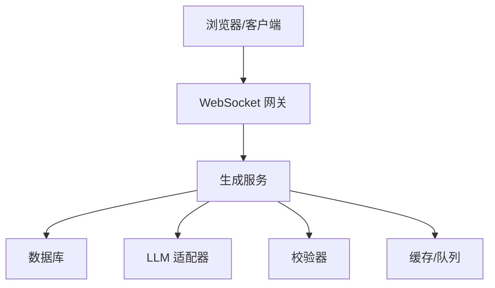
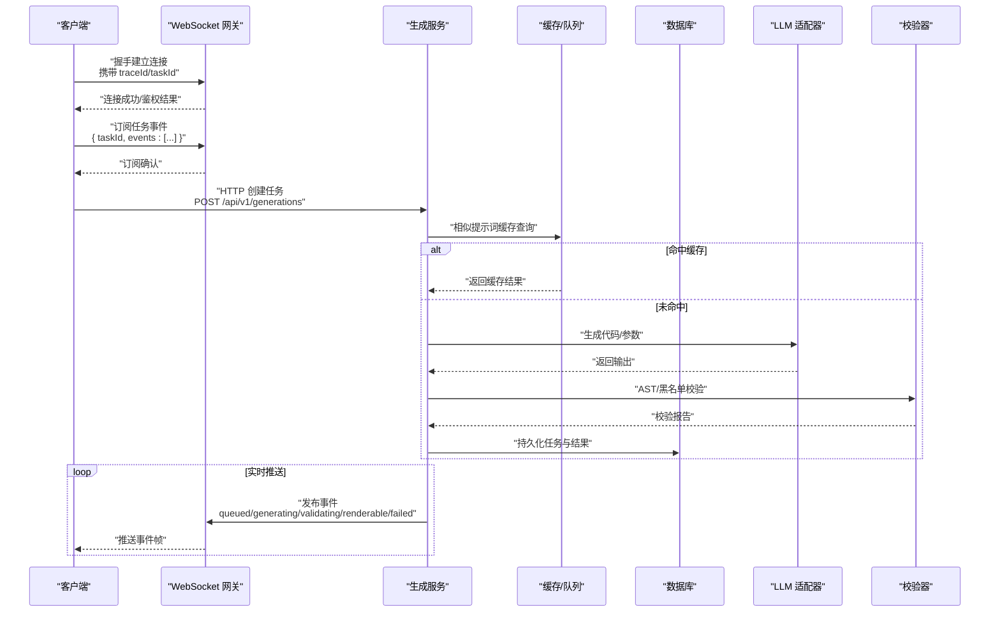
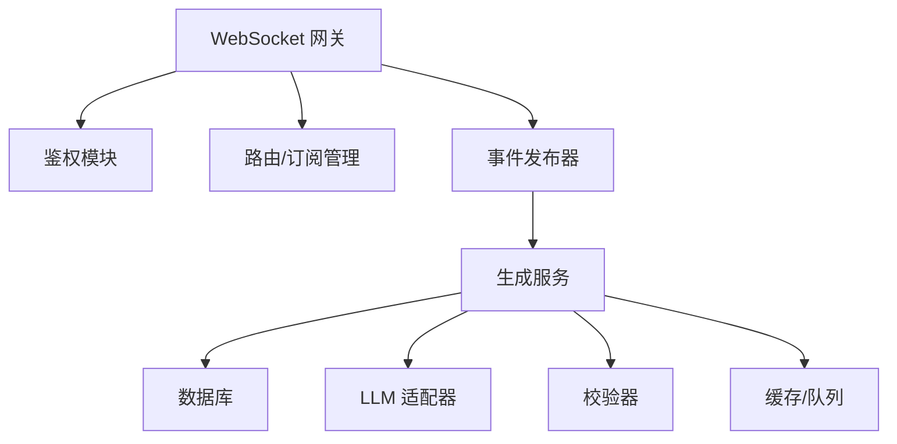

# WebSocket 实时通信 API

<cite>
**本文引用的文件**
- [产品技术设计文档](file://tech/product-technical-design.md)
- [产品需求文档](file://prd.md)
</cite>

## 目录
1. [简介](#简介)
2. [项目结构](#项目结构)
3. [核心组件](#核心组件)
4. [架构总览](#架构总览)
5. [详细组件分析](#详细组件分析)
6. [依赖关系分析](#依赖关系分析)
7. [性能考虑](#性能考虑)
8. [故障排查指南](#故障排查指南)
9. [结论](#结论)
10. [附录](#附录)

## 简介
本文件为 ApexForge 平台的 WebSocket 实时通信 API 接口规范，聚焦于连接建立、消息格式、事件类型与实时交互模式，覆盖生成任务状态更新、进度推送、错误通知等关键场景。同时提供连接管理、重连策略、心跳机制与性能优化建议，并给出客户端集成示例与调试工具使用方法，帮助前端与第三方系统快速接入平台能力。

## 项目结构
本项目仓库包含产品与技术设计文档，用于定义平台整体架构、数据模型、API 契约与安全策略。其中：
- 产品需求文档定义了“通过 WebSocket 或 SSE 推送结果”的交互方式与端到端流程。
- 产品技术设计文档给出了完整的领域模型、生成链路、SSE 事件类型与通用错误结构，可作为 WebSocket 协议设计的依据与扩展点。

图表来源
- [产品技术设计文档:36-100](file://tech/product-technical-design.md#L36-L100)
- [产品需求文档:126-140](file://prd.md#L126-L140)

章节来源
- [产品技术设计文档:36-100](file://tech/product-technical-design.md#L36-L100)
- [产品需求文档:126-140](file://prd.md#L126-L140)

## 核心组件
- 客户端（ApexForge Studio 或第三方应用）
  - 负责发起 WebSocket 连接、订阅任务事件、处理状态变更与错误通知。
- WebSocket 网关
  - 负责鉴权、路由、限流、心跳检测、断线重连协调与消息广播。
- 生成服务
  - 编排 Prompt、调用 LLM、执行校验、持久化结果，并通过网关向客户端推送实时事件。
- 沙箱运行时（前端 iframe）
  - 在浏览器侧执行生成的代码，将渲染结果序列化后回传主线程。

章节来源
- [产品技术设计文档:574-610](file://tech/product-technical-design.md#L574-L610)
- [产品技术设计文档:472-518](file://tech/product-technical-design.md#L472-L518)
- [产品需求文档:59-83](file://prd.md#L59-L83)

## 架构总览
下图展示从创建生成任务到实时推送结果的端到端流程，以及 WebSocket 在其中的作用位置。

图表来源
- [产品技术设计文档:359-390](file://tech/product-technical-design.md#L359-L390)
- [产品需求文档:126-140](file://prd.md#L126-L140)

## 详细组件分析

### 连接建立与鉴权
- 连接地址
  - 开发环境：ws://host:port/ws
  - 生产环境：wss://host/ws
- 鉴权方式
  - 建议在 URL 查询参数中携带一次性 token 或会话标识，并在握手阶段由网关校验；或在首次消息中携带鉴权信息。
- 握手响应
  - 成功：返回连接 ID、服务端时间戳、支持的版本列表。
  - 失败：返回错误码与原因，客户端应终止连接并重试。

章节来源
- [产品技术设计文档:632-652](file://tech/product-technical-design.md#L632-L652)
- [产品需求文档:126-140](file://prd.md#L126-L140)

### 消息格式与编解码
- 传输编码
  - 文本 JSON 帧，UTF-8 编码。
- 统一信封
  - 所有消息均包裹在统一信封中，便于网关路由与审计。
- 字段约定
  - type：消息类型（如 subscribe、event、heartbeat、error）。
  - payload：业务负载，按具体消息类型定义。
  - meta：元数据，包含 traceId、taskId、timestamp、version 等。
- 大小限制
  - 单条消息最大长度建议不超过 256KB，避免内存压力。

章节来源
- [产品技术设计文档:632-652](file://tech/product-technical-design.md#L632-L652)

### 事件类型与语义
以下事件与生成任务状态机一致，用于实时反馈任务进展与结果。

- queued：任务已入队，等待调度
- generating：正在生成（调用 LLM 或模板渲染）
- validating：正在进行安全与质量校验
- repairing：尝试自动修复（可选）
- renderable：可渲染，结果可用
- failed：失败，附带错误码与原因
- saved：已保存为资产（可选）
- discarded：被丢弃（可选）

事件载荷示例字段
- event：事件名
- traceId：链路追踪 ID
- taskId：任务 ID
- message：人类可读描述
- details：结构化详情（如校验报告摘要、质量评分、错误堆栈片段）

章节来源
- [产品技术设计文档:340-357](file://tech/product-technical-design.md#L340-L357)
- [产品技术设计文档:734-756](file://tech/product-technical-design.md#L734-L756)

### 实时交互模式
- 订阅模式
  - 客户端发送订阅请求，指定 taskId 与感兴趣的事件集合。
  - 服务端仅推送相关事件，降低带宽消耗。
- 批量推送
  - 对于高频中间状态，服务端可合并推送，减少帧数。
- 幂等性
  - 客户端对同一 taskId 的事件进行去重，防止重复渲染。

章节来源
- [产品技术设计文档:359-390](file://tech/product-technical-design.md#L359-L390)

### 连接管理与重连策略
- 心跳机制
  - 客户端与服务端每 N 秒互发心跳帧，超时则判定断开。
- 指数退避重连
  - 初始间隔 1s，最大间隔 30s，抖动范围 ±20%。
- 断线恢复
  - 重连成功后，客户端重新订阅最近一次已知状态的任务事件。
- 优雅关闭
  - 客户端主动关闭时发送 close 帧，服务端清理资源。

章节来源
- [产品技术设计文档:632-652](file://tech/product-technical-design.md#L632-L652)

### 错误通知与处理
- 错误结构
  - 统一错误对象包含 code、message、details，便于前端分类处理。
- 常见错误码
  - GENERATION_VALIDATION_FAILED：校验失败
  - SANDBOX_TIMEOUT：沙箱执行超时
  - MODEL_JSON_INVALID：模型 JSON 非法
  - MODEL_TOO_COMPLEX：模型复杂度超限
  - MODEL_EMPTY：未生成有效对象
- 处理建议
  - 根据错误码提示用户重试或调整描述。
  - 记录 traceId 与 details，便于问题定位。

章节来源
- [产品技术设计文档:643-652](file://tech/product-technical-design.md#L643-L652)
- [产品技术设计文档:508-517](file://tech/product-technical-design.md#L508-L517)

### 客户端集成示例（步骤说明）
- 初始化连接
  - 使用 wss 协议建立连接，携带鉴权参数。
- 订阅任务
  - 发送订阅帧，包含 taskId 与事件白名单。
- 处理事件
  - 监听 queued/generating/validating/renderable/failed 等事件，更新 UI。
- 错误处理
  - 捕获网络异常与业务错误，触发重连或降级策略。
- 资源释放
  - 页面卸载或任务结束时主动关闭连接。

章节来源
- [产品技术设计文档:359-390](file://tech/product-technical-design.md#L359-L390)
- [产品需求文档:126-140](file://prd.md#L126-L140)

### 调试工具使用方法
- 本地调试
  - 使用浏览器开发者工具的 Network/WebSocket 面板查看帧内容与时序。
- 抓包与回放
  - 使用 Wireshark 或 Charles 抓取流量，导出为 JSON 以便复现。
- 日志关联
  - 结合 traceId 在服务端日志中检索完整链路。
- 模拟事件
  - 编写脚本向网关发送测试事件，验证前端处理逻辑。

章节来源
- [产品技术设计文档:868-907](file://tech/product-technical-design.md#L868-L907)

## 依赖关系分析
WebSocket 网关与后端服务的依赖关系如下：

图表来源
- [产品技术设计文档:574-610](file://tech/product-technical-design.md#L574-L610)

章节来源
- [产品技术设计文档:574-610](file://tech/product-technical-design.md#L574-L610)

## 性能考虑
- 前端
  - 按需加载 Three.js 与沙箱运行时，避免首屏阻塞。
  - 大模型 JSON 解析放入 Worker，主线程专注渲染挂载。
  - 使用 InstancedMesh 与 LOD 降低绘制开销。
- 后端
  - 相似提示词缓存复用，模板模式跳过 LLM 调用。
  - 生成任务异步化，避免长连接占用。
  - Redis 缓存热门模板与参数 Schema。
- 网络
  - 压缩与增量更新，减少传输体积。
  - 合理设置心跳间隔与消息合并策略。

章节来源
- [产品技术设计文档:933-958](file://tech/product-technical-design.md#L933-L958)
- [产品需求文档:155-164](file://prd.md#L155-L164)

## 故障排查指南
- 常见问题
  - 连接频繁断开：检查心跳配置与网络稳定性。
  - 事件丢失：确认订阅是否生效，核对 taskId 与事件白名单。
  - 渲染失败：查看 sandbox 错误码与模型 JSON 合法性。
- 定位方法
  - 基于 traceId 检索全链路日志。
  - 对比服务端事件与客户端接收事件的时间差。
  - 使用沙箱错误码映射表快速定位原因。

章节来源
- [产品技术设计文档:868-907](file://tech/product-technical-design.md#L868-L907)
- [产品技术设计文档:508-517](file://tech/product-technical-design.md#L508-L517)

## 结论
本规范以现有产品与技术设计为依据，明确了 WebSocket 实时通信的连接、消息、事件与交互模式，并与生成任务状态机保持一致。通过心跳、重连与错误处理机制，保障实时体验的稳定性与可观测性。建议在生产环境中结合限流、缓存与异步化策略，进一步提升性能与可扩展性。

## 附录

### 事件与状态对照表
- queued → 任务入队
- generating → 生成中
- validating → 校验中
- repairing → 修复中（可选）
- renderable → 可渲染
- failed → 失败
- saved → 已保存（可选）
- discarded → 已丢弃（可选）

章节来源
- [产品技术设计文档:340-357](file://tech/product-technical-design.md#L340-L357)

### 通用错误结构
- 字段
  - traceId：链路追踪 ID
  - error.code：错误码
  - error.message：错误描述
  - error.details：详细信息数组

章节来源
- [产品技术设计文档:643-652](file://tech/product-technical-design.md#L643-L652)