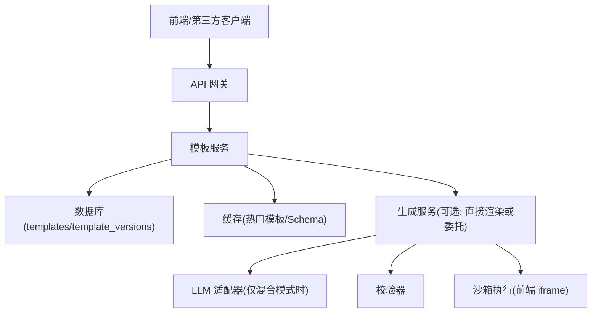
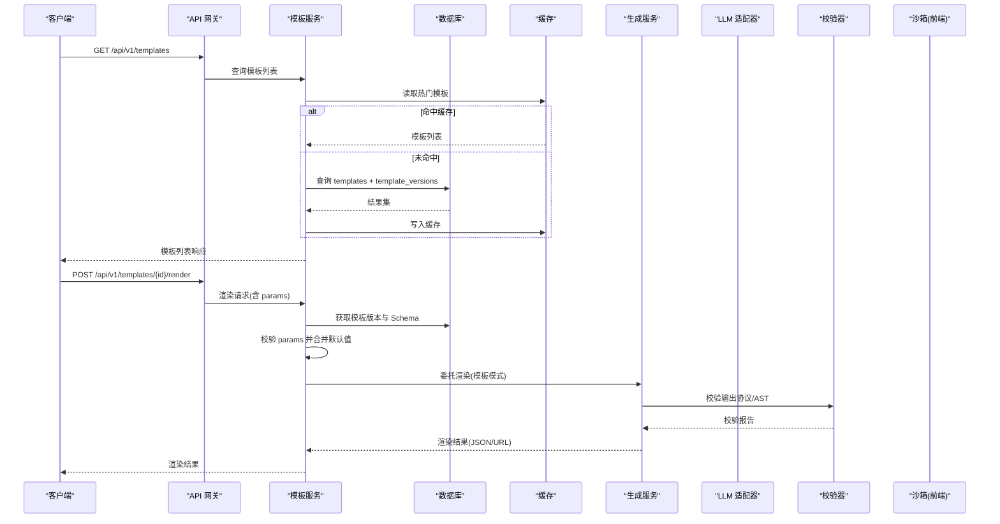
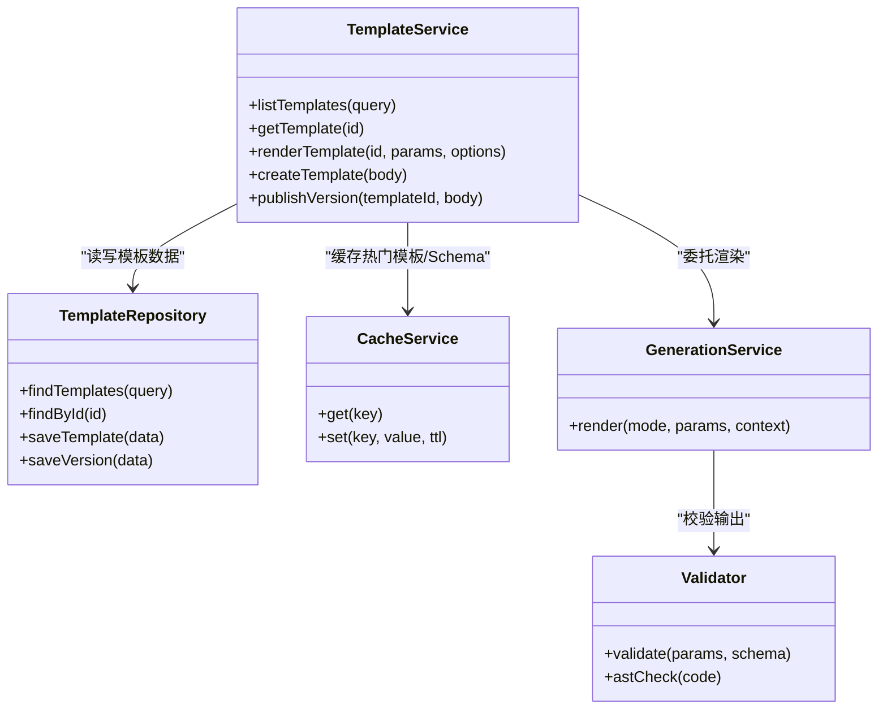
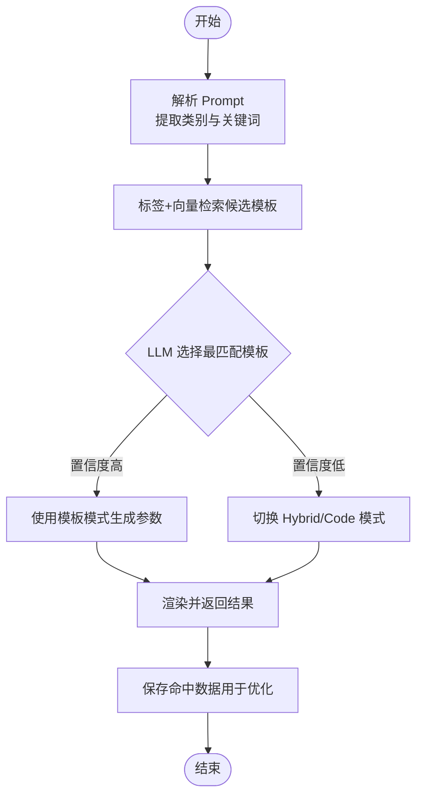

# 模板服务 API

<cite>
**本文引用的文件**   
- [产品技术设计文档](file://tech/product-technical-design.md)
- [产品需求文档](file://prd.md)
</cite>

## 目录
1. [简介](#简介)
2. [项目结构](#项目结构)
3. [核心组件](#核心组件)
4. [架构总览](#架构总览)
5. [详细接口规范](#详细接口规范)
6. [依赖关系分析](#依赖关系分析)
7. [性能与可用性](#性能与可用性)
8. [故障排查指南](#故障排查指南)
9. [结论](#结论)
10. [附录：模板匹配算法与最佳实践](#附录模板匹配算法与最佳实践)

## 简介
本文件为 ApexForge 平台“模板服务”的 RESTful API 接口文档，覆盖以下能力：
- 模板查询（GET /api/v1/templates）
- 模板详情（GET /api/v1/templates/{id}）
- 模板渲染（POST /api/v1/templates/{id}/render）
- 模板创建与管理（POST /api/v1/templates、POST /api/v1/templates/{id}/versions）

同时包含：
- 模板参数 Schema 验证与默认参数处理
- 版本管理策略
- 渲染结果格式
- 模板匹配算法的使用示例与最佳实践

## 项目结构
从系统视角看，模板服务是后端模块之一，对外暴露 REST 接口，对内与数据库、缓存、生成编排等模块交互。MVP 阶段可部署在单体 NestJS 中，平台化后作为独立微服务。

图表来源
- [产品技术设计文档:38-100](file://tech/product-technical-design.md#L38-L100)

章节来源
- [产品技术设计文档:38-100](file://tech/product-technical-design.md#L38-L100)

## 核心组件
- 模板服务（Template Service）
  - 提供模板列表、详情、渲染、创建与版本发布接口
  - 负责参数 Schema 解析与校验、默认参数合并
  - 维护模板与模板版本的关联关系
- 模板数据模型
  - templates：模板元信息（名称、分类、描述、标签、状态等）
  - template_versions：模板版本（语义化版本、参数 Schema、默认参数、渲染函数代码、示例 Prompt、校验规则等）
- 生成服务（Generation Service）
  - 在模板模式下接收模板 ID 与参数，调用渲染逻辑并返回渲染结果
- 安全与沙箱
  - 服务端进行输出协议与 AST 校验；前端在 iframe 沙箱中执行渲染函数

章节来源
- [产品技术设计文档:174-325](file://tech/product-technical-design.md#L174-L325)
- [产品技术设计文档:594-610](file://tech/product-technical-design.md#L594-L610)
- [产品技术设计文档:472-518](file://tech/product-technical-design.md#L472-L518)

## 架构总览
模板服务在整体系统中的位置与交互如下：

图表来源
- [产品技术设计文档:362-390](file://tech/product-technical-design.md#L362-L390)
- [产品技术设计文档:724-733](file://tech/product-technical-design.md#L724-L733)

## 详细接口规范

### 通用约定
- Base URL：/api/v1
- 认证：用户侧 JWT 或开放平台 API Key（由网关统一鉴权）
- 响应体必须包含 traceId
- 错误响应统一结构：{ traceId, error: { code, message, details } }

章节来源
- [产品技术设计文档:634-652](file://tech/product-technical-design.md#L634-L652)

---

### 模板列表
- 方法：GET
- 路径：/api/v1/templates
- 说明：分页/筛选/排序返回模板列表，支持按分类、标签、状态过滤
- 请求参数（Query）
  - page：页码，默认 1
  - size：每页数量，默认 20，最大 100
  - category：分类过滤
  - tag：标签过滤（可多选）
  - status：状态过滤（draft/published/deprecated）
  - sort：排序字段与方向，如 created_at:desc
- 响应体（data）
  - items：模板条目数组
    - id：模板 ID
    - name：模板名称
    - category：分类
    - description：描述
    - tags：标签
    - status：状态
    - latestVersion：最新版本号（字符串）
    - updatedAt：更新时间
  - total：总数
  - page：当前页
  - size：每页大小
- 错误码
  - INVALID_QUERY：查询参数非法
  - AUTH_FAILED：鉴权失败
  - RATE_LIMITED：限流触发

章节来源
- [产品技术设计文档:724-733](file://tech/product-technical-design.md#L724-L733)

---

### 模板详情
- 方法：GET
- 路径：/api/v1/templates/{id}
- 说明：返回指定模板及其最新版本的详细信息
- 路径参数
  - id：模板 ID（必填）
- 响应体（data）
  - id：模板 ID
  - name：模板名称
  - category：分类
  - description：描述
  - tags：标签
  - status：状态
  - versions：版本数组（至少包含最新版本）
    - id：版本 ID
    - version：语义化版本
    - paramSchema：参数 Schema（JSON Schema 风格）
    - defaultParams：默认参数
    - rendererCode：渲染函数代码（受权限控制可见）
    - examplePrompts：示例 Prompt
    - validationRules：参数校验规则
    - createdAt：创建时间
  - latestVersion：最新版本号
- 错误码
  - NOT_FOUND：模板不存在
  - AUTH_FAILED：鉴权失败

章节来源
- [产品技术设计文档:270-296](file://tech/product-technical-design.md#L270-L296)
- [产品技术设计文档:724-733](file://tech/product-technical-design.md#L724-L733)

---

### 模板渲染
- 方法：POST
- 路径：/api/v1/templates/{id}/render
- 说明：使用模板及参数进行渲染，返回可直接加载的模型数据或资源地址
- 路径参数
  - id：模板 ID（必填）
- 请求体（body）
  - params：对象，键名需符合模板版本的 paramSchema
  - mode：渲染模式，默认 template（可选：template/hybrid/code），当为 hybrid/code 时可能触发 LLM 参与
  - contextVersionId：上下文版本 ID（可选，用于二次编辑）
  - preferences：偏好设置（可选，如 style、quality）
- 参数 Schema 验证与默认参数处理
  - 服务端依据 paramSchema 对 params 进行严格校验
  - 若某参数缺失且存在 defaultParams，则自动合并默认值
  - 校验失败返回 INVALID_PARAMS，附带具体字段错误
- 响应体（data）
  - taskId：任务 ID（异步场景下）
  - status：renderable/saved/failed 等
  - mode：实际使用的模式（template/hybrid/code）
  - templateId：命中的模板 ID
  - templateVersionId：命中的模板版本 ID
  - params：最终生效的参数（已合并默认值）
  - modelJsonUrl：模型 JSON 地址（ObjectLoader 可直接加载）
  - screenshotUrl：预览截图地址（可选）
  - metrics：复杂度指标（mesh 数、顶点数、材质数等）
  - validationReport：校验报告（passed、warnings、blockedReasons）
  - qualityScore：质量评分（totalScore 及各维度分）
- 错误码
  - INVALID_PARAMS：参数校验失败
  - TEMPLATE_NOT_FOUND：模板不存在
  - VERSION_NOT_FOUND：版本不存在
  - RENDER_FAILED：渲染失败（含超时、运行时错误、模型为空等）
  - AUTH_FAILED：鉴权失败
  - RATE_LIMITED：限流触发

章节来源
- [产品技术设计文档:724-733](file://tech/product-technical-design.md#L724-L733)
- [产品技术设计文档:284-296](file://tech/product-technical-design.md#L284-L296)
- [产品技术设计文档:472-518](file://tech/product-technical-design.md#L472-L518)

---

### 创建模板（管理端）
- 方法：POST
- 路径：/api/v1/templates
- 说明：创建新模板（需要管理端权限）
- 请求体（body）
  - name：模板名称（必填）
  - category：分类（必填）
  - description：描述（可选）
  - tags：标签（可选）
  - status：初始状态（默认 draft）
- 响应体（data）
  - id：模板 ID
  - name、category、description、tags、status、createdAt、updatedAt
- 错误码
  - AUTH_FAILED：鉴权失败
  - INVALID_BODY：请求体不合法
  - DUPLICATE_NAME：同名模板冲突

章节来源
- [产品技术设计文档:724-733](file://tech/product-technical-design.md#L724-L733)

---

### 发布模板版本（管理端）
- 方法：POST
- 路径：/api/v1/templates/{id}/versions
- 说明：为模板创建新版本并发布（需要管理端权限）
- 路径参数
  - id：模板 ID（必填）
- 请求体（body）
  - version：语义化版本号（必填）
  - paramSchema：参数 Schema（必填）
  - defaultParams：默认参数（可选）
  - rendererCode：渲染函数代码（必填）
  - examplePrompts：示例 Prompt（可选）
  - validationRules：参数校验规则（可选）
- 响应体（data）
  - id：版本 ID
  - templateId：模板 ID
  - version：版本号
  - paramSchema、defaultParams、rendererCode、examplePrompts、validationRules、createdAt
- 错误码
  - AUTH_FAILED：鉴权失败
  - INVALID_VERSION：版本号不合法或重复
  - INVALID_SCHEMA：参数 Schema 不合法
  - RENDERER_CODE_INVALID：渲染函数代码不合法

章节来源
- [产品技术设计文档:724-733](file://tech/product-technical-design.md#L724-L733)
- [产品技术设计文档:284-296](file://tech/product-technical-design.md#L284-L296)

---

### 通用错误结构
- 所有错误响应遵循统一结构：
  - traceId：链路追踪 ID
  - error.code：错误码
  - error.message：人类可读的错误信息
  - error.details：附加细节（如字段级错误）

章节来源
- [产品技术设计文档:643-652](file://tech/product-technical-design.md#L643-L652)

## 依赖关系分析
- 模板服务依赖
  - 数据库：templates、template_versions 表
  - 缓存：热门模板与 Schema 缓存（Redis）
  - 生成服务：在模板模式下委托渲染，或在混合/代码模式下协调 LLM 与校验器
  - 前端沙箱：最终渲染在浏览器 iframe 中执行，服务端返回结构化结果
- 耦合与内聚
  - 模板服务与数据库高内聚，通过 Repository 抽象
  - 与生成服务的交互通过明确接口契约（mode、params、result）
  - 与缓存的交互降低热点访问延迟

图表来源
- [产品技术设计文档:594-610](file://tech/product-technical-design.md#L594-L610)
- [产品技术设计文档:270-296](file://tech/product-technical-design.md#L270-L296)

章节来源
- [产品技术设计文档:594-610](file://tech/product-technical-design.md#L594-L610)
- [产品技术设计文档:270-296](file://tech/product-technical-design.md#L270-L296)

## 性能与可用性
- 缓存策略
  - 热门模板与 Schema 缓存至 Redis，减少数据库压力
  - 相似 Prompt 缓存复用结果（适用于混合/代码模式）
- 渲染优化
  - 模板模式跳过 LLM，仅参数生成，耗时显著降低
  - 前端沙箱执行，避免后端 3D 计算
- 数据库优化
  - 针对常用查询字段建立索引
  - 大字段（代码、模型 JSON、截图）建议迁移对象存储，仅保存 URL 与摘要

章节来源
- [产品技术设计文档:944-958](file://tech/product-technical-design.md#L944-L958)
- [产品技术设计文档:933-958](file://tech/product-technical-design.md#L933-L958)

## 故障排查指南
- 常见错误定位
  - INVALID_PARAMS：检查 paramSchema 与传入 params 是否一致，确认默认参数合并逻辑
  - RENDER_FAILED：查看 validationReport 与质量评分，关注 sandbox 错误码（超时、运行时错误、模型为空等）
  - AUTH_FAILED/RATE_LIMITED：检查网关鉴权与限流配置
- 日志与追踪
  - 每个请求携带 traceId，贯穿网关、模板服务、生成服务、校验器、数据库与沙箱
  - 记录关键指标：耗时、状态、错误码、质量分、复杂度指标

章节来源
- [产品技术设计文档:472-518](file://tech/product-technical-design.md#L472-L518)
- [产品技术设计文档:870-907](file://tech/product-technical-design.md#L870-L907)

## 结论
模板服务通过清晰的 REST 接口与严格的参数 Schema 校验，结合版本管理与渲染结果标准化，为 AI 驱动的 3D 模型生成提供了稳定可控的基础设施。配合模板匹配算法与最佳实践，可在保证质量的同时显著提升生成效率与可维护性。

## 附录：模板匹配算法与最佳实践

### 模板匹配流程
- 步骤
  1. 对用户 Prompt 做类别识别与关键词抽取
  2. 基于标签与向量检索找出候选模板
  3. 让 LLM 在候选模板中选择最匹配的模板并生成参数
  4. 若置信度低于阈值，切换 Hybrid 或 Code Mode
  5. 保存模板命中数据，用于优化模板覆盖率
- 适用场景
  - 常见类别、高稳定性要求优先使用模板模式
  - 复杂或新颖需求采用混合/代码模式

图表来源
- [产品技术设计文档:797-804](file://tech/product-technical-design.md#L797-L804)

### 参数 Schema 与默认参数处理
- Schema 定义
  - type：参数类型（string、number、boolean、object、array 等）
  - format：特定格式（如 color）
  - min/max：数值范围约束
  - default：默认值
  - required：是否必填
- 默认参数合并
  - 若 params 缺少某字段且 defaultParams 中存在默认值，则自动合并
  - 校验失败时返回字段级错误，便于客户端提示修正

章节来源
- [产品技术设计文档:284-296](file://tech/product-technical-design.md#L284-L296)

### 渲染结果格式
- 成功响应
  - modelJsonUrl：Three.js ObjectLoader 可直接加载的 JSON 地址
  - screenshotUrl：预览截图（可选）
  - metrics：复杂度指标（mesh 数、顶点数、材质数等）
  - validationReport：校验报告（passed、warnings、blockedReasons）
  - qualityScore：质量评分（totalScore 及各维度分）
- 失败响应
  - 错误码与消息遵循统一结构，details 包含字段级错误

章节来源
- [产品技术设计文档:634-652](file://tech/product-technical-design.md#L634-L652)
- [产品技术设计文档:472-518](file://tech/product-technical-design.md#L472-L518)

### 最佳实践
- 模板分层
  - Skeleton：主体比例与关键部件位置
  - Style Variant：风格变体（科幻、复古、工业、卡通）
  - Detail Pack：装饰件（灯带、轮毂、天线、纹理）
  - Material Preset：材质预设（金属、玻璃、塑料、发光）
  - Param Schema：参数范围、默认值与校验
- 生成模式优先级
  - 推荐顺序：Cache Mode → Template Mode → Hybrid Mode → Code Mode
- 安全与沙箱
  - 服务端进行协议校验与 AST 白名单校验
  - 前端在 iframe 沙箱中执行，限制网络与 DOM 访问，设置超时销毁
- 质量闭环
  - 自动评分与用户反馈驱动 Prompt、模板与模型选择策略持续优化

章节来源
- [产品技术设计文档:787-796](file://tech/product-technical-design.md#L787-L796)
- [产品技术设计文档:329-338](file://tech/product-technical-design.md#L329-L338)
- [产品技术设计文档:428-470](file://tech/product-technical-design.md#L428-L470)
- [产品技术设计文档:807-840](file://tech/product-technical-design.md#L807-L840)