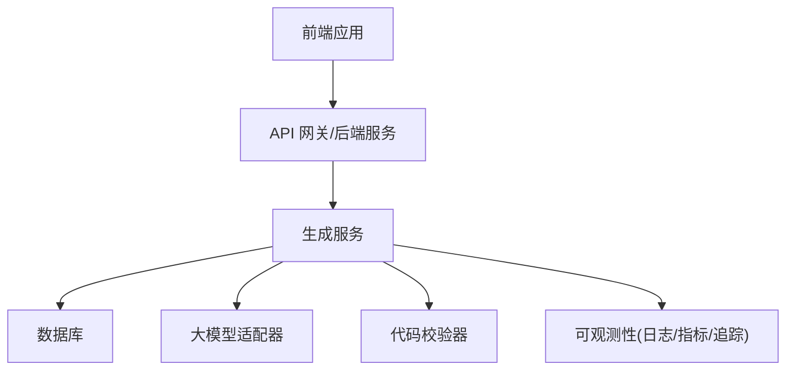
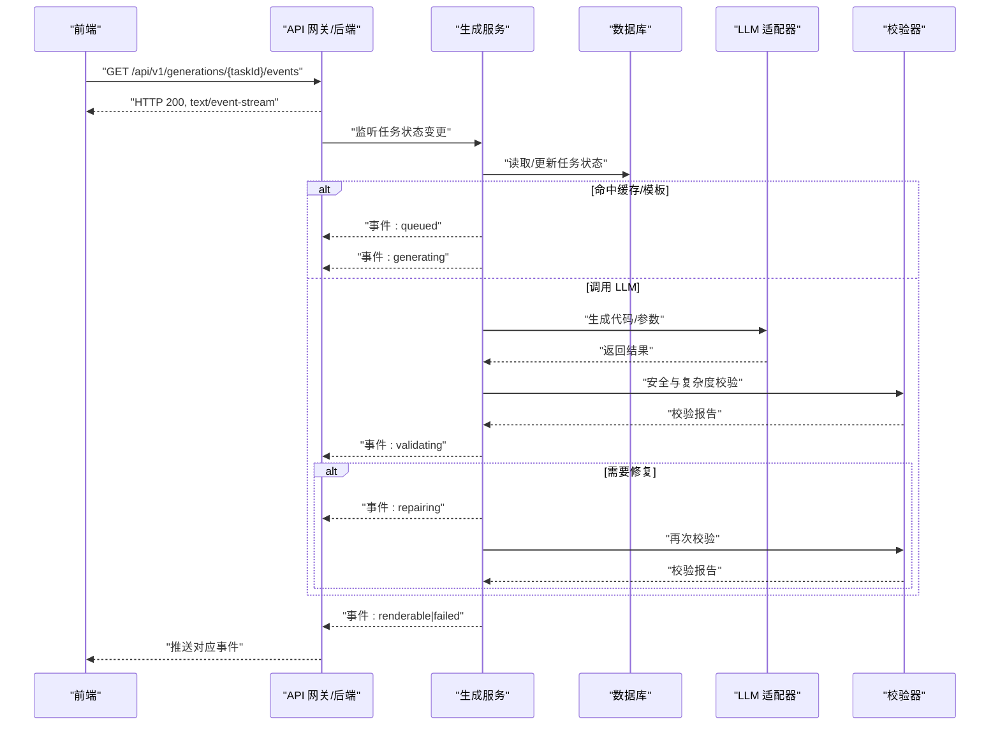
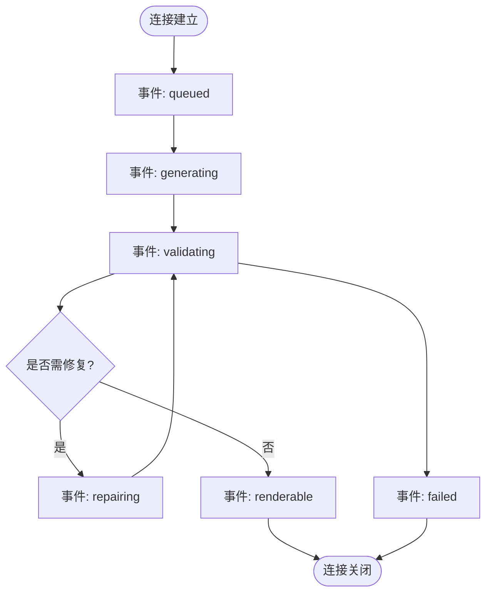

# SSE 实时事件流

<cite>
**本文引用的文件**   
- [产品技术设计文档](file://tech/product-technical-design.md)
- [产品需求文档](file://prd.md)
</cite>

## 目录
1. [简介](#简介)
2. [项目结构](#项目结构)
3. [核心组件](#核心组件)
4. [架构总览](#架构总览)
5. [详细组件分析](#详细组件分析)
6. [依赖关系分析](#依赖关系分析)
7. [性能考虑](#性能考虑)
8. [故障排查指南](#故障排查指南)
9. [结论](#结论)
10. [附录](#附录)

## 简介
本章节面向前端与后端工程师，定义 ApexForge 平台中基于 Server-Sent Events（SSE）的实时事件流接口规范。重点说明 GET /api/v1/generations/{taskId}/events 的连接建立、消息格式、事件类型与触发时机，并提供客户端连接管理、断线重连与错误处理策略，以及前端集成示例与最佳实践建议。

## 项目结构
本项目为设计与规划阶段仓库，包含产品需求与技术设计文档。SSE 事件流相关约定位于“API 设计”章节的“SSE 事件”小节，同时生成任务状态机与链路追踪字段在数据模型与可观测性章节有明确定义，可作为事件字段扩展的依据。

图表来源
- [产品技术设计文档:38-62](file://tech/product-technical-design.md#L38-L62)
- [产品技术设计文档:594-610](file://tech/product-technical-design.md#L594-L610)

章节来源
- [产品技术设计文档:38-62](file://tech/product-technical-design.md#L38-L62)
- [产品技术设计文档:594-610](file://tech/product-technical-design.md#L594-L610)

## 核心组件
- SSE 事件端点：GET /api/v1/generations/{taskId}/events
- 事件类型：queued、generating、validating、repairing、renderable、failed
- 通用字段：event、traceId、taskId、message
- 关联状态机：queued → generating → validating → (repairing → validating)* → renderable | failed

章节来源
- [产品技术设计文档:734-758](file://tech/product-technical-design.md#L734-L758)
- [产品技术设计文档:342-357](file://tech/product-technical-design.md#L342-L357)

## 架构总览
SSE 用于将生成任务的阶段性进展以单向长连接方式推送给前端。后端在任务状态流转时向对应 taskId 的事件通道推送事件；前端通过 EventSource 或原生 fetch + ReadableStream 订阅并消费事件。

图表来源
- [产品技术设计文档:361-390](file://tech/product-technical-design.md#L361-L390)
- [产品技术设计文档:734-758](file://tech/product-technical-design.md#L734-L758)

## 详细组件分析

### 接口定义：GET /api/v1/generations/{taskId}/events
- 协议：Server-Sent Events（text/event-stream）
- 鉴权：沿用平台统一认证（JWT/API Key），与创建任务一致
- 路径参数：
  - taskId：字符串，唯一标识一次生成任务
- 响应头：
  - Content-Type: text/event-stream
  - Cache-Control: no-cache
  - Connection: keep-alive
- 生命周期：
  - 连接建立后，服务端按任务状态机顺序推送事件
  - 当任务达到终态（renderable 或 failed）后，服务端关闭连接

章节来源
- [产品技术设计文档:734-758](file://tech/product-technical-design.md#L734-L758)

### 事件类型与触发时机
- queued：任务已入队，等待调度执行
- generating：开始生成（可能来自缓存/模板或直接调用 LLM）
- validating：进入安全与复杂度校验阶段
- repairing：校验未通过，进入自动修复并重试校验
- renderable：校验通过且可渲染，任务成功完成
- failed：不可恢复的错误，任务失败

章节来源
- [产品技术设计文档:734-758](file://tech/product-technical-design.md#L734-L758)
- [产品技术设计文档:342-357](file://tech/product-technical-design.md#L342-L357)

### 事件消息格式
每条事件为 JSON 文本，至少包含以下字段：
- event：事件类型（枚举见上）
- traceId：全链路追踪 ID
- taskId：当前任务 ID
- message：人类可读的消息摘要

可选扩展字段（建议遵循平台可观测性与数据模型约定）：
- status：与任务状态机一致的当前状态
- errorCode：错误码（仅在 failed 事件中提供）
- details：结构化详情（如校验报告摘要、质量评分等）
- timestamp：事件时间戳（ISO 8601）
- progress：进度百分比（0-100，可选）

完整示例（仅展示结构，不包含具体实现细节）：
- 示例一（validating）
  {
    "event": "validating",
    "traceId": "tr_123",
    "taskId": "gen_123",
    "message": "正在进行安全校验",
    "status": "validating",
    "timestamp": "2026-07-08T12:34:56Z"
  }
- 示例二（failed）
  {
    "event": "failed",
    "traceId": "tr_123",
    "taskId": "gen_123",
    "message": "生成结果未通过安全校验",
    "status": "failed",
    "errorCode": "GENERATION_VALIDATION_FAILED",
    "details": [],
    "timestamp": "2026-07-08T12:35:01Z"
  }

章节来源
- [产品技术设计文档:734-758](file://tech/product-technical-design.md#L734-L758)
- [产品技术设计文档:643-652](file://tech/product-technical-design.md#L643-L652)

### 连接建立与心跳保活
- 连接建立：前端发起 GET 请求，后端返回 text/event-stream 并保持长连接
- 心跳保活：服务端定期发送空事件或注释行，防止中间设备超时断开
- 幂等订阅：同一 taskId 的多连接应各自独立推送相同事件序列

章节来源
- [产品技术设计文档:734-758](file://tech/product-technical-design.md#L734-L758)

### 断线重连机制
- 指数退避：首次重连延迟 1s，随后每次翻倍，上限至 30s
- 去抖合并：短时间内多次重连合并为一次
- 状态对齐：重连后若缺失历史事件，可通过查询任务接口补齐状态
- 最大重试次数：超过阈值则提示用户刷新页面或重试任务

章节来源
- [产品技术设计文档:734-758](file://tech/product-technical-design.md#L734-L758)

### 错误处理策略
- 网络层错误：捕获连接中断，触发重连逻辑
- 业务层错误：收到 failed 事件后停止重连，展示错误信息与重试入口
- 鉴权错误：返回 401/403 时终止连接，引导重新登录或刷新令牌
- 限流错误：返回 429 时延长重连间隔并提示稍后重试

章节来源
- [产品技术设计文档:734-758](file://tech/product-technical-design.md#L734-L758)

### 前端集成示例与最佳实践
- 使用 EventSource 或 fetch + ReadableStream 建立 SSE 连接
- 解析 JSON 事件，根据 event 字段驱动 UI 状态（排队中、生成中、校验中、可渲染、失败）
- 维护本地任务状态缓存，避免重复渲染
- 对 failed 事件提供“重试”按钮，复用原 taskId 或创建新任务
- 记录 traceId 与 taskId 到日志，便于问题定位
- 在页面卸载时主动关闭连接，释放资源

章节来源
- [产品技术设计文档:734-758](file://tech/product-technical-design.md#L734-L758)

## 依赖关系分析
SSE 事件流与生成任务状态机紧密耦合，事件推送由生成服务在状态变更时触发，并通过 API 网关转发至前端。

图表来源
- [产品技术设计文档:342-357](file://tech/product-technical-design.md#L342-L357)
- [产品技术设计文档:734-758](file://tech/product-technical-design.md#L734-L758)

章节来源
- [产品技术设计文档:342-357](file://tech/product-technical-design.md#L342-L357)
- [产品技术设计文档:734-758](file://tech/product-technical-design.md#L734-L758)

## 性能考虑
- 服务端：事件推送采用异步队列，避免阻塞主流程；对热点任务进行事件批量化与节流
- 前端：事件处理尽量轻量，复杂计算放入 Web Worker；避免在事件回调中进行 DOM 频繁操作
- 网络：启用 gzip/brotli 压缩；合理设置心跳间隔，平衡带宽与稳定性

[本节为通用指导，不直接分析具体文件]

## 故障排查指南
- 无法建立连接：检查鉴权、跨域配置与防火墙规则
- 长时间无事件：确认任务是否存在、是否处于终态；必要时通过查询任务接口获取最新状态
- 频繁断线：检查心跳配置与中间代理（Nginx/CDN）的超时设置
- 事件丢失：结合 traceId 与 taskId 拉取服务端日志，核对事件推送时序

章节来源
- [产品技术设计文档:734-758](file://tech/product-technical-design.md#L734-L758)

## 结论
SSE 事件流为 ApexForge 提供了低开销、易集成的实时通知能力。通过明确的事件类型、统一的 JSON 结构与完善的连接管理策略，前端可稳定地感知生成任务的全生命周期，提升用户体验与可观测性。

[本节为总结性内容，不直接分析具体文件]

## 附录

### 事件类型与触发时机对照表
- queued：任务入队，等待调度
- generating：开始生成（含缓存/模板快速路径）
- validating：进入安全与复杂度校验
- repairing：校验失败，进入自动修复并重试
- renderable：校验通过，可渲染
- failed：不可恢复错误，任务失败

章节来源
- [产品技术设计文档:734-758](file://tech/product-technical-design.md#L734-L758)
- [产品技术设计文档:342-357](file://tech/product-technical-design.md#L342-L357)

### 事件消息字段参考
- 必填：event、traceId、taskId、message
- 建议：status、errorCode、details、timestamp、progress

章节来源
- [产品技术设计文档:734-758](file://tech/product-technical-design.md#L734-L758)
- [产品技术设计文档:643-652](file://tech/product-technical-design.md#L643-L652)