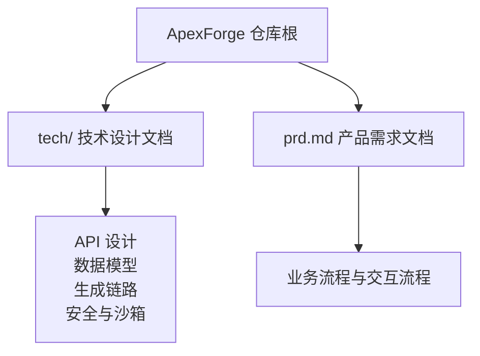
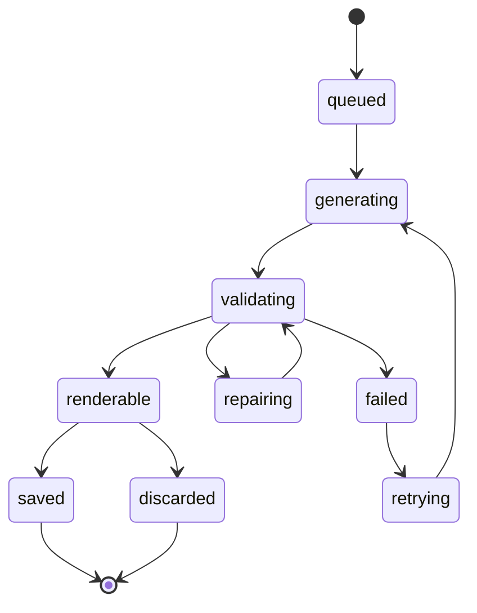
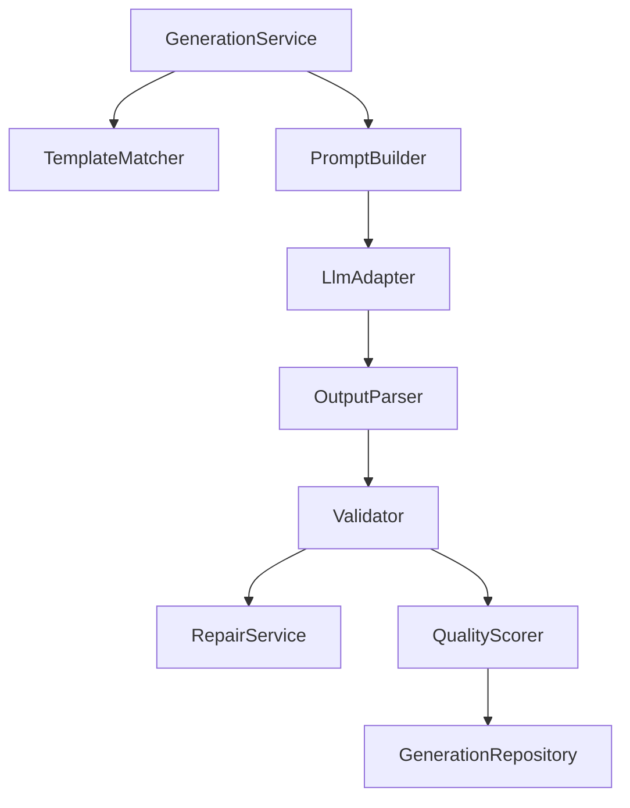

# 创建生成任务

<cite>
**本文引用的文件**   
- [产品技术设计文档](file://tech/product-technical-design.md)
- [产品需求文档](file://prd.md)
</cite>

## 目录
1. [简介](#简介)
2. [项目结构](#项目结构)
3. [核心组件](#核心组件)
4. [架构总览](#架构总览)
5. [详细接口规范：POST /api/v1/generations](#详细接口规范post-apiv1generations)
6. [依赖与关系分析](#依赖与关系分析)
7. [性能与可观测性](#性能与可观测性)
8. [故障排查指南](#故障排查指南)
9. [结论](#结论)

## 简介
本章节面向使用 ApexForge 平台的开发者，提供“创建生成任务”接口的完整 API 文档。该接口用于提交一次 3D 模型生成请求，支持多种生成模式（auto、template、code、hybrid），返回任务 ID、状态、生成结果、验证报告和质量评分等关键信息，并定义错误码与异常处理策略，帮助调用方稳定集成。

## 项目结构
本项目为平台级设计与说明文档集合，包含产品需求与技术设计两部分，未包含具体后端实现代码。API 契约、数据模型、状态机、质量评分与安全策略均在技术设计文档中明确定义。



**图表来源** 
- [产品技术设计文档:1-120](file://tech/product-technical-design.md#L1-L120)
- [产品需求文档:1-40](file://prd.md#L1-L40)

**章节来源**
- [产品技术设计文档:1-120](file://tech/product-technical-design.md#L1-L120)
- [产品需求文档:1-40](file://prd.md#L1-L40)

## 核心组件
围绕“创建生成任务”的核心能力包括：
- 生成任务编排服务：负责接收请求、选择模式、构建 Prompt、调用 LLM、校验与评分、持久化结果。
- 模板匹配器：根据类别与语义检索候选模板，决定 template/hybrid/code 分支。
- 代码校验器：对输出进行协议校验、黑名单扫描与 AST 白名单校验。
- 质量评分器：从可渲染性、Prompt 匹配度、结构完整性、性能表现、可编辑性等维度打分。
- 沙箱执行器（前端）：在 iframe 中执行生成的 JS 代码，序列化模型 JSON 并回传主线程。

**章节来源**
- [产品技术设计文档:574-630](file://tech/product-technical-design.md#L574-L630)
- [产品技术设计文档:428-470](file://tech/product-technical-design.md#L428-L470)
- [产品技术设计文档:807-841](file://tech/product-technical-design.md#L807-L841)
- [产品技术设计文档:472-518](file://tech/product-technical-design.md#L472-L518)

## 架构总览
下图展示了从客户端发起创建生成任务到服务端完成校验与评分的整体流程，以及前后端协作的关键环节。

```mermaid
sequenceDiagram
participant FE as "前端"
participant GW as "API 网关"
participant GEN as "生成服务"
participant TPL as "模板服务"
participant LLM as "LLM 适配器"
participant VAL as "校验器"
participant DB as "数据库"
participant BOX as "沙箱(iframe)"
FE->>GW : "POST /api/v1/generations"
GW->>GEN : "鉴权/限流后转发"
GEN->>TPL : "查找候选模板"
TPL-->>GEN : "候选模板列表"
GEN->>LLM : "按模式生成参数或代码"
LLM-->>GEN : "结构化输出(mode, params, code...)"
GEN->>VAL : "协议/黑名单/AST 校验"
VAL-->>GEN : "验证报告"
GEN->>DB : "持久化任务与结果"
GEN-->>GW : "返回任务ID/状态/结果摘要"
GW-->>FE : "响应体(data + traceId)"
FE->>BOX : "在 iframe 中执行代码"
BOX-->>FE : "返回模型JSON或错误"
```

**图表来源** 
- [产品技术设计文档:359-390](file://tech/product-technical-design.md#L359-L390)
- [产品技术设计文档:632-695](file://tech/product-technical-design.md#L632-L695)

## 详细接口规范：POST /api/v1/generations

### 接口概览
- 方法：POST
- 路径：/api/v1/generations
- 认证：用户侧 JWT 或开放平台 API Key
- 通用要求：
  - Base URL：/api/v1
  - 响应必须包含 traceId
  - 错误响应采用统一结构

**章节来源**
- [产品技术设计文档:632-652](file://tech/product-technical-design.md#L632-L652)

### 请求体字段定义
| 字段 | 类型 | 必填 | 约束与说明 |
|------|------|------|------------|
| projectId | string | 是 | 所属项目 ID，字符串标识 |
| prompt | string | 是 | 自然语言描述；建议长度不超过 2000 字符 |
| category | string | 否 | 模型类别，如 vehicle、building、prop 等，用于模板匹配与路由 |
| mode | string | 否 | 生成模式，枚举值：auto、template、code、hybrid。默认 auto 由系统自动选择最优模式 |
| contextVersionId | string | 否 | 上下文版本 ID，用于关联历史 Prompt 或模板版本，保证可追溯与回滚 |
| preferences | object | 否 | 偏好设置对象，常见键：style（风格）、quality（质量档位）等，具体以模板 Schema 为准 |

注意：
- 当 mode=template 时，category 应指向已发布的模板类别；若未命中模板，系统将降级至 hybrid 或 code。
- 当 mode=code 时，AI 将生成完整 Three.js 函数；需满足安全白名单与复杂度限制。
- 当 mode=hybrid 时，AI 选择模板并补充局部代码，兼顾可控性与灵活性。
- 当 mode=auto 时，系统优先尝试缓存命中，其次模板模式，再 hybrid，最后 code。

**章节来源**
- [产品技术设计文档:654-695](file://tech/product-technical-design.md#L654-L695)
- [产品技术设计文档:329-338](file://tech/product-technical-design.md#L329-L338)
- [产品技术设计文档:910-922](file://tech/product-technical-design.md#L910-L922)

### 请求示例
以下为标准请求体示例（不含敏感信息）：
```json
{
  "projectId": "proj_123",
  "prompt": "生成一辆未来感跑车，黑色车身，蓝色灯带",
  "category": "vehicle",
  "mode": "auto",
  "contextVersionId": "ver_001",
  "preferences": {
    "style": "sci-fi",
    "quality": "balanced"
  }
}
```

**章节来源**
- [产品技术设计文档:654-695](file://tech/product-technical-design.md#L654-L695)

### 响应体结构
成功响应包含 data 与 traceId，data 中包含任务 ID、状态、实际使用的模式、模板 ID（如有）、生成参数、生成代码、验证报告与质量评分等。

| 字段 | 类型 | 说明 |
|------|------|------|
| traceId | string | 全链路追踪 ID，便于问题定位 |
| data.taskId | string | 本次生成任务 ID |
| data.status | string | 任务状态，见“状态机”小节 |
| data.mode | string | 实际采用的生成模式（template、code、hybrid） |
| data.templateId | string | 命中的模板 ID（仅模板或混合模式有效） |
| data.params | object | 生成参数（模板模式或混合模式） |
| data.code | string | 生成的 Three.js 代码（代码模式或混合模式） |
| data.validationReport | object | 验证报告，包含是否通过、警告、阻断原因等 |
| data.qualityScore | object | 质量评分，包含总分及各维度得分 |

**章节来源**
- [产品技术设计文档:654-695](file://tech/product-technical-design.md#L654-L695)

### 响应示例
```json
{
  "traceId": "tr_123",
  "data": {
    "taskId": "gen_123",
    "status": "renderable",
    "mode": "template",
    "templateId": "vehicle.sport_car",
    "params": {},
    "code": "function buildModel(params, THREE) { return new THREE.Group(); }",
    "validationReport": {
      "passed": true,
      "warnings": []
    },
    "qualityScore": {
      "totalScore": 86
    }
  }
}
```

**章节来源**
- [产品技术设计文档:654-695](file://tech/product-technical-design.md#L654-L695)

### 生成模式差异与使用场景
- auto：系统自动选择最佳模式，优先缓存命中，其次模板，再次混合，最后代码。适合大多数通用场景。
- template：AI 仅生成模板参数，稳定性高、速度快，适用于常见类别与批量变体。
- code：AI 生成完整 Three.js 函数，灵活度高但风险与成本更高，适用于新类别或探索性生成。
- hybrid：AI 选择模板并补充局部代码，平衡可控性与创造力，适用于复杂但仍需可控的资产。

推荐优先级：cache → template → hybrid → code。

**章节来源**
- [产品技术设计文档:329-338](file://tech/product-technical-design.md#L329-L338)

### 状态机与生命周期
任务状态流转如下：
- queued → generating → validating → renderable → saved/discard
- validating 失败可进入 repairing，修复后重新验证
- failed 可进入 retrying，重试后回到 generating



**图表来源** 
- [产品技术设计文档:340-357](file://tech/product-technical-design.md#L340-L357)

**章节来源**
- [产品技术设计文档:340-357](file://tech/product-technical-design.md#L340-L357)

### 错误码与异常处理
- 统一错误结构包含 traceId、error.code、error.message、error.details。
- 常见错误码（示例）：
  - GENERATION_VALIDATION_FAILED：生成结果未通过安全校验
  - SANDBOX_TIMEOUT：执行超时
  - SANDBOX_RUNTIME_ERROR：运行时报错
  - MODEL_JSON_INVALID：返回结构非法
  - MODEL_TOO_COMPLEX：模型复杂度超限
  - MODEL_EMPTY：未生成有效对象

处理策略：
- 客户端收到错误后，依据 error.code 提示用户或触发重试逻辑。
- 对于可重试错误（如运行时错误、超时），建议指数退避重试，最多 2 次。
- 对于不可重试错误（如输入违规、模板不匹配），引导用户修改 prompt 或切换模式。

**章节来源**
- [产品技术设计文档:632-652](file://tech/product-technical-design.md#L632-L652)
- [产品技术设计文档:508-518](file://tech/product-technical-design.md#L508-L518)

### 相关查询与事件订阅
- 查询任务：GET /api/v1/generations/{taskId}
- SSE 事件：GET /api/v1/generations/{taskId}/events
  - 事件类型：queued、generating、validating、repairing、renderable、failed

**章节来源**
- [产品技术设计文档:697-756](file://tech/product-technical-design.md#L697-L756)

## 依赖与关系分析
- 生成服务依赖模板服务进行候选模板匹配，依赖 LLM 适配器进行参数或代码生成，依赖校验器进行安全与复杂度检查，最终持久化任务与结果。
- 前端依赖沙箱 iframe 执行生成代码，并通过 postMessage 获取模型 JSON。



**图表来源** 
- [产品技术设计文档:594-609](file://tech/product-technical-design.md#L594-L609)

**章节来源**
- [产品技术设计文档:594-609](file://tech/product-technical-design.md#L594-L609)

## 性能与可观测性
- 相似 Prompt 缓存：向量相似度大于阈值时直接复用结果，降低 LLM 调用成本。
- 模板模式跳过代码生成，改为参数生成，显著缩短耗时。
- 异步化生成任务，避免 HTTP 长连接占用。
- 每个请求携带 traceId，贯穿前端、网关、生成服务、LLM、校验、数据库与沙箱执行。

**章节来源**
- [产品技术设计文档:933-958](file://tech/product-technical-design.md#L933-L958)
- [产品技术设计文档:868-907](file://tech/product-technical-design.md#L868-L907)

## 故障排查指南
- 输入安全：检查 prompt 长度与内容合规，避免触发拦截。
- 输出安全：确认生成代码通过协议校验、黑名单扫描与 AST 白名单校验。
- 沙箱执行：关注超时与运行时报错，必要时降低复杂度或切换模式。
- 日志与指标：利用 traceId 定位问题，结合告警规则（失败率、延迟突增等）快速发现异常。

**章节来源**
- [产品技术设计文档:910-930](file://tech/product-technical-design.md#L910-L930)
- [产品技术设计文档:898-907](file://tech/product-technical-design.md#L898-L907)

## 结论
POST /api/v1/generations 提供了统一的生成任务入口，支持多模式与偏好配置，返回完整的任务信息与质量评估。通过严格的安全校验与沙箱隔离，平台在保证灵活性的同时确保执行安全与稳定性。建议调用方结合状态机与 SSE 事件实现可靠的任务跟踪与用户体验优化。