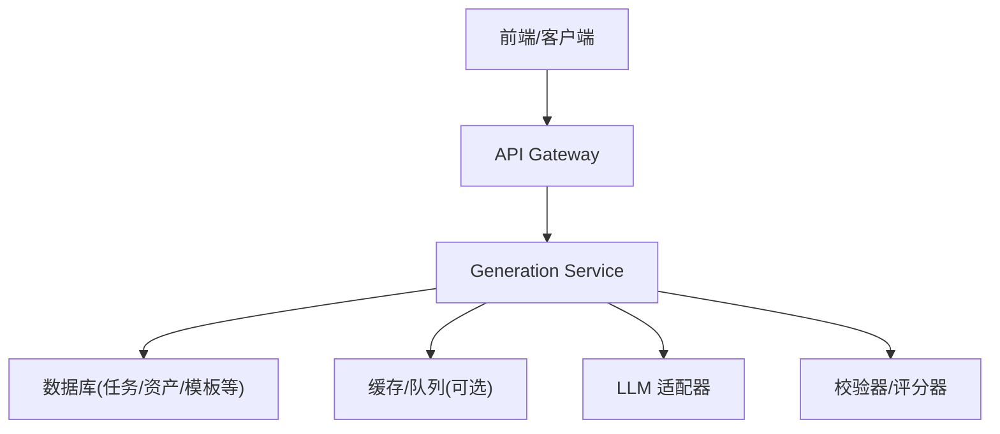
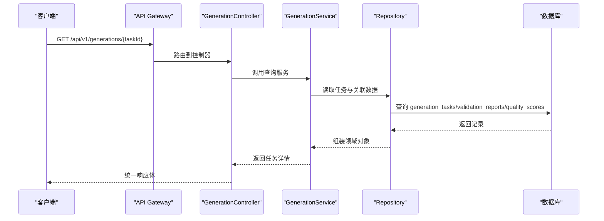
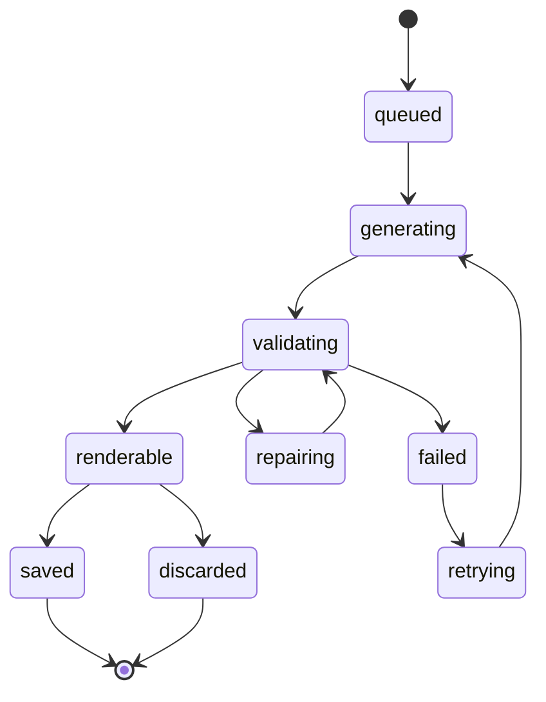
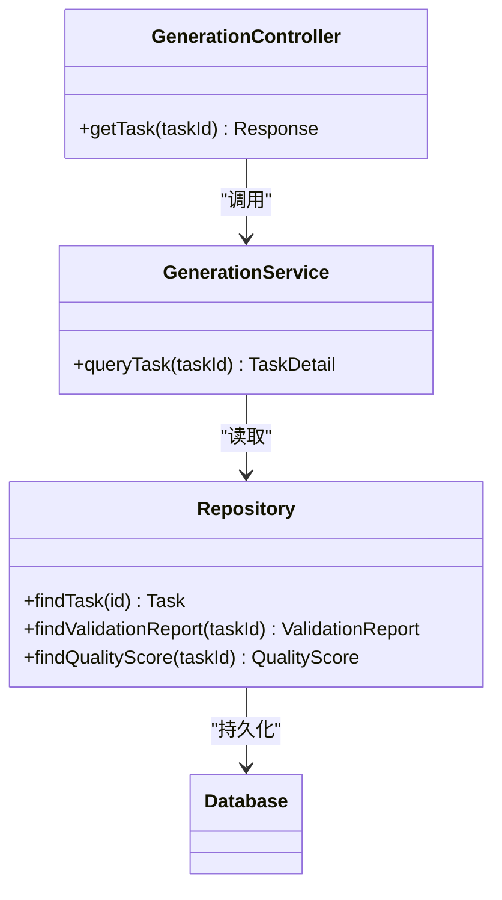

# 查询生成任务

<cite>
**本文引用的文件**   
- [产品技术设计文档](file://tech/product-technical-design.md)
- [产品需求文档](file://prd.md)
</cite>

## 目录
1. [简介](#简介)
2. [项目结构](#项目结构)
3. [核心组件](#核心组件)
4. [架构总览](#架构总览)
5. [详细组件分析](#详细组件分析)
6. [依赖分析](#依赖分析)
7. [性能考虑](#性能考虑)
8. [故障排查指南](#故障排查指南)
9. [结论](#结论)
10. [附录](#附录)

## 简介
本章节为 ApexForge 平台“查询生成任务”的 API 文档，聚焦于 GET /api/v1/generations/{taskId} 接口的实现规范与使用方式。内容涵盖：
- 路径参数 taskId 的格式要求与校验规则
- 任务状态机流转（queued、generating、validating、renderable、failed、cancelled）及各状态下返回字段差异
- 任务详情、生成代码、参数对象、验证报告、评分结果的响应结构说明
- 分页查询、过滤条件与排序选项的支持说明
- 错误码与通用响应约定

## 项目结构
本项目包含产品与技术设计文档，API 契约与数据模型定义位于技术设计文档中。当前仓库未提供后端源码实现，本文档以设计文档为依据进行接口规范说明。

图表来源
- [产品技术设计文档:34-100](file://tech/product-technical-design.md#L34-L100)

章节来源
- [产品技术设计文档:34-100](file://tech/product-technical-design.md#L34-L100)

## 核心组件
- GenerationController：负责路由与请求解析，包括获取单个生成任务的查询接口。
- GenerationService：编排任务查询逻辑，聚合任务、验证报告、质量评分等数据。
- Repository/ORM：读取 generation_tasks、validation_reports、quality_scores 等表。
- 认证与鉴权：JWT/API Key 校验，确保调用方具备访问权限。
- 可观测性：traceId 贯穿请求链路，便于问题定位。

章节来源
- [产品技术设计文档:574-610](file://tech/product-technical-design.md#L574-L610)

## 架构总览
GET /api/v1/generations/{taskId} 的典型调用流程如下：

图表来源
- [产品技术设计文档:574-610](file://tech/product-technical-design.md#L574-L610)
- [产品技术设计文档:697-702](file://tech/product-technical-design.md#L697-L702)

## 详细组件分析

### 接口定义
- 方法：GET
- 路径：/api/v1/generations/{taskId}
- 功能：根据任务 ID 查询生成任务详情，包括状态、结果、错误信息、质量评分等。

章节来源
- [产品技术设计文档:697-702](file://tech/product-technical-design.md#L697-L702)

### 路径参数
- taskId
  - 类型：字符串
  - 必填：是
  - 格式要求：采用系统生成的唯一标识（如 UUID/CUID），长度与字符集由服务端校验；不允许为空或非法字符。
  - 校验规则：在服务端进行存在性与合法性校验，若不存在则返回对应错误。

章节来源
- [产品技术设计文档:215-236](file://tech/product-technical-design.md#L215-L236)

### 认证与鉴权
- 认证方式：用户侧 JWT 或开放平台 API Key（依据调用场景）。
- 鉴权范围：需具备对应空间/项目的访问权限。
- 限流策略：按用户或 API Key 维度限制请求频率。

章节来源
- [产品技术设计文档:634-640](file://tech/product-technical-design.md#L634-L640)

### 响应结构
- 通用包装
  - traceId：本次请求链路追踪 ID，用于日志与排障。
  - data：任务详情对象（见下节）。
  - error：当发生错误时返回的错误对象（见错误结构）。

- data 字段说明（随状态变化而不同）
  - taskId：任务 ID
  - status：任务状态（queued、generating、validating、renderable、failed、cancelled）
  - mode：生成模式（code、template、hybrid）
  - templateId/templateVersionId：命中的模板及版本（在模板或混合模式下出现）
  - prompt/normalizedPrompt：原始与归一化 Prompt
  - generatedCode：生成的 Three.js 代码（仅在生成完成且通过校验后返回）
  - generatedParams：生成的参数对象（模板或混合模式）
  - errorCode/errorMessage：失败时的错误码与消息
  - startedAt/completedAt/createdAt：时间戳
  - validationReport：验证报告（含是否通过、警告、复杂度等）
  - qualityScore：质量评分（总分与分项分）

- 各状态下的返回差异
  - queued：仅包含基础元信息与状态，无 code/params/report/score。
  - generating：同上，可能包含 startedAt。
  - validating：可能包含部分中间指标，但通常仍无最终 code/params。
  - renderable：返回 generatedCode、generatedParams（视模式）、validationReport、qualityScore。
  - failed：返回 errorCode、errorMessage，可能附带部分诊断信息。
  - cancelled：返回取消原因与时间戳，不包含生成产物。

章节来源
- [产品技术设计文档:215-236](file://tech/product-technical-design.md#L215-L236)
- [产品技术设计文档:697-702](file://tech/product-technical-design.md#L697-L702)

### 错误结构
- 统一错误体
  - traceId：链路追踪 ID
  - error.code：错误码（例如 GENERATION_VALIDATION_FAILED）
  - error.message：人类可读的错误描述
  - error.details：附加细节（数组）

章节来源
- [产品技术设计文档:634-652](file://tech/product-technical-design.md#L634-L652)

### 状态机与流转
- 状态集合：queued → generating → validating → renderable/failed，支持 repairing 自修复循环，以及保存/丢弃/重试等终态分支。
- 查询接口应反映当前持久化的状态，并在不同阶段返回相应字段。

图表来源
- [产品技术设计文档:340-357](file://tech/product-technical-design.md#L340-L357)

章节来源
- [产品技术设计文档:340-357](file://tech/product-technical-design.md#L340-L357)

### 分页、过滤与排序
- 当前设计文档未对 GET /api/v1/generations/{taskId} 提供分页、过滤与排序参数定义。该接口为单条任务查询，通常不涉及分页与复杂筛选。
- 如需批量查询或列表能力，建议新增独立列表接口（例如 GET /api/v1/generations），并在此接口上支持：
  - 分页：page、pageSize
  - 过滤：status、mode、projectId、workspaceId、时间范围等
  - 排序：createdAt、completedAt、score 等
- 若后续扩展，请遵循统一的查询参数命名与校验规范，并与现有认证、限流、可观测性保持一致。

章节来源
- [产品技术设计文档:697-702](file://tech/product-technical-design.md#L697-L702)

### 示例响应（示意）
以下为基于设计文档字段约定的响应示例（不含具体代码内容，仅展示结构与取值范围）：

- 成功响应（任务已完成并可渲染）
{
  "traceId": "tr_xxx",
  "data": {
    "taskId": "gen_xxx",
    "status": "renderable",
    "mode": "template",
    "templateId": "vehicle.sport_car",
    "prompt": "未来感跑车...",
    "normalizedPrompt": "...",
    "generatedCode": "function buildModel(params, THREE) { ... }",
    "generatedParams": { "bodyColor": "#111827", "accentColor": "#2563eb" },
    "validationReport": { "passed": true, "warnings": [], "complexity": {} },
    "qualityScore": { "totalScore": 86, "renderabilityScore": 90, "structureScore": 85, "promptMatchScore": 88, "performanceScore": 82, "details": {} },
    "startedAt": "2026-07-08T10:00:00Z",
    "completedAt": "2026-07-08T10:00:45Z",
    "createdAt": "2026-07-08T10:00:00Z"
  }
}

- 失败响应（校验未通过）
{
  "traceId": "tr_xxx",
  "error": {
    "code": "GENERATION_VALIDATION_FAILED",
    "message": "生成结果未通过安全校验",
    "details": []
  }
}

章节来源
- [产品技术设计文档:634-652](file://tech/product-technical-design.md#L634-L652)
- [产品技术设计文档:697-702](file://tech/product-technical-design.md#L697-L702)
- [产品技术设计文档:215-236](file://tech/product-technical-design.md#L215-L236)

## 依赖分析
- 控制器与服务层解耦：控制器仅处理 HTTP 协议相关逻辑，业务编排下沉至服务层。
- 数据访问抽象：通过 Repository 屏蔽底层存储差异（SQLite/PostgreSQL），便于演进。
- 外部依赖：LLM 适配器、校验器、评分器均为可插拔模块，便于替换供应商与策略。

图表来源
- [产品技术设计文档:574-610](file://tech/product-technical-design.md#L574-L610)

章节来源
- [产品技术设计文档:574-610](file://tech/product-technical-design.md#L574-L610)

## 性能考虑
- 缓存命中：相似 Prompt 可直接复用结果，减少 LLM 调用与校验开销。
- 异步与队列：高并发场景下可通过队列削峰填谷，提升吞吐。
- 只读优化：查询接口为只读，建议开启数据库索引（id、status、projectId、createdAt 等）以提升检索效率。
- 压缩与传输：大体积代码与 JSON 建议使用 gzip/brotli 压缩。

章节来源
- [产品技术设计文档:155-165](file://tech/product-technical-design.md#L155-L165)

## 故障排查指南
- 常见错误码
  - GENERATION_VALIDATION_FAILED：生成结果未通过安全校验
  - SANDBOX_TIMEOUT：沙箱执行超时
  - SANDBOX_RUNTIME_ERROR：运行时报错
  - MODEL_JSON_INVALID：返回结构非法
  - MODEL_TOO_COMPLEX：模型复杂度超限
  - MODEL_EMPTY：未生成有效对象
- 排查步骤
  - 通过 traceId 定位全链路日志
  - 检查任务状态与错误码，确认处于 failed 或异常分支
  - 查看 validationReport 与 qualityScore 的详细信息
  - 核对输入 Prompt 与模板匹配情况，必要时调整模式或参数

章节来源
- [产品技术设计文档:634-652](file://tech/product-technical-design.md#L634-L652)
- [产品技术设计文档:508-517](file://tech/product-technical-design.md#L508-L517)

## 结论
GET /api/v1/generations/{taskId} 作为任务查询的核心入口，提供了从创建到完成的全生命周期状态与结果数据。结合统一错误结构、traceId 与质量评分体系，可有效支撑前端轮询、SSE 推送与自动化流水线集成。后续可在列表接口上补充分页、过滤与排序能力，以满足更丰富的查询场景。

## 附录
- SSE 事件接口（辅助实时状态更新）
  - GET /api/v1/generations/{taskId}/events
  - 事件类型：queued、generating、validating、repairing、renderable、failed
  - 事件示例包含 event、traceId、taskId、message 等字段

章节来源
- [产品技术设计文档:734-756](file://tech/product-technical-design.md#L734-L756)