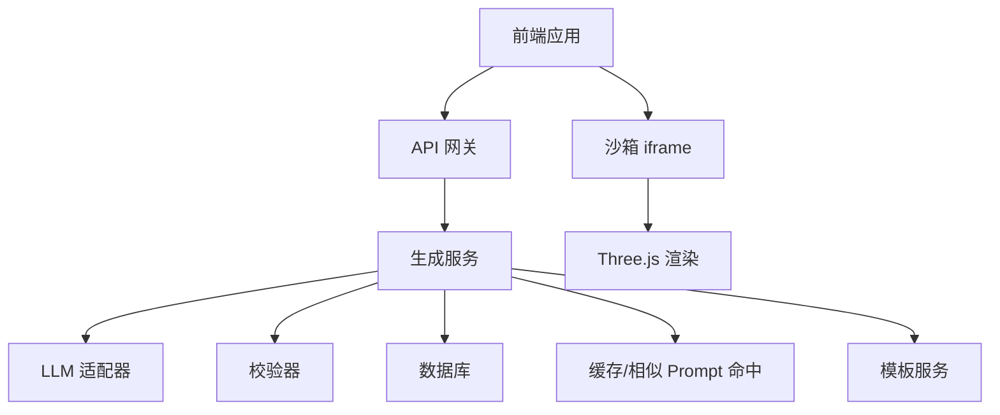
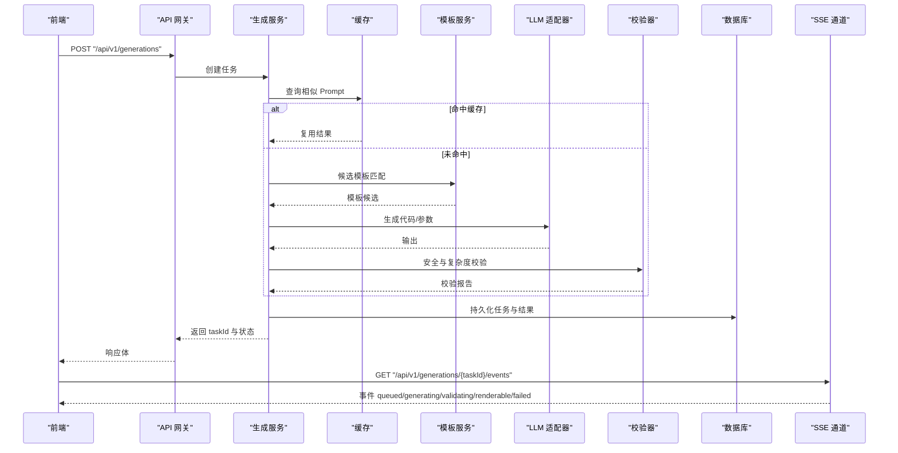
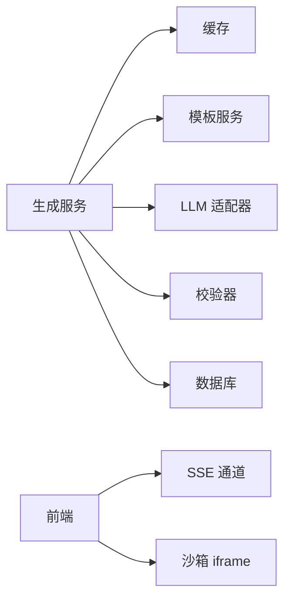
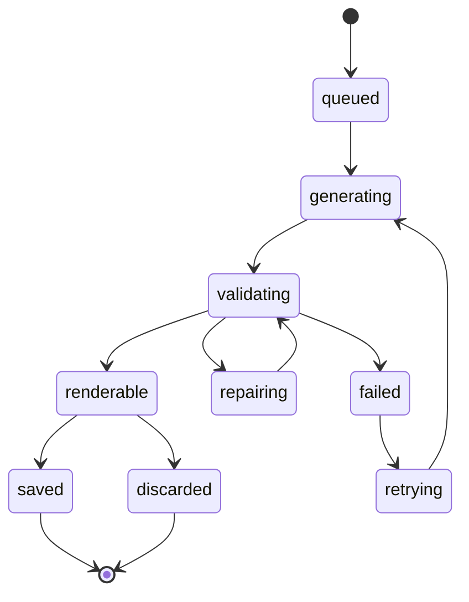

# 生成任务 API

<cite>
**本文引用的文件**   
- [产品技术设计文档](file://tech/product-technical-design.md)
- [产品需求文档](file://prd.md)
</cite>

## 目录
1. [简介](#简介)
2. [项目结构](#项目结构)
3. [核心组件](#核心组件)
4. [架构总览](#架构总览)
5. [详细接口规范](#详细接口规范)
6. [依赖关系分析](#依赖关系分析)
7. [性能与扩展性](#性能与扩展性)
8. [故障排查指南](#故障排查指南)
9. [结论](#结论)
10. [附录](#附录)

## 简介
本文件为 ApexForge 平台的“生成任务管理”RESTful API 接口规范，覆盖以下核心能力：
- 创建生成任务（POST /api/v1/generations）
- 查询任务状态（GET /api/v1/generations/{taskId}）
- SSE 实时事件流（GET /api/v1/generations/{taskId}/events）
并明确不同生成模式（template、code、hybrid）的参数差异与质量评估结果格式。

## 项目结构
本项目仓库包含产品与技术设计文档，API 契约与数据模型定义均来源于该设计文档。本节仅做概念性说明，不直接分析具体代码文件。

[本图为概念性架构图，未映射到具体源码文件]

## 核心组件
- 生成控制器：负责接收创建任务请求、返回任务 ID 与初始状态。
- 生成编排服务：协调缓存、模板匹配、Prompt 构建、LLM 调用、校验与评分、持久化。
- 模板服务：提供模板列表、详情与参数 Schema。
- 校验器：对输出协议、AST、复杂度进行校验。
- 质量评分器：计算可渲染性、结构完整性、性能表现等维度得分。
- 沙箱执行器：在 iframe 中执行生成的代码或模板渲染函数，返回序列化模型数据。

**章节来源**
- [产品技术设计文档:632-758](file://tech/product-technical-design.md#L632-L758)
- [产品需求文档:126-140](file://prd.md#L126-L140)

## 架构总览
下图展示一次完整生成请求的端到端流程，包括创建任务、状态流转、SSE 推送与前端沙箱执行。

**图表来源**
- [产品技术设计文档:361-390](file://tech/product-technical-design.md#L361-L390)
- [产品技术设计文档:734-757](file://tech/product-technical-design.md#L734-L757)

**章节来源**
- [产品技术设计文档:361-390](file://tech/product-technical-design.md#L361-L390)
- [产品技术设计文档:734-757](file://tech/product-technical-design.md#L734-L757)

## 详细接口规范

### 通用约定
- Base URL：/api/v1
- 认证：用户侧 JWT；开放平台使用 API Key
- 所有响应需包含 traceId
- 错误响应统一结构

错误响应结构字段：
- traceId：链路追踪 ID
- error.code：错误码
- error.message：人类可读的错误信息
- error.details：附加细节数组

**章节来源**
- [产品技术设计文档:632-652](file://tech/product-technical-design.md#L632-L652)

---

### 创建生成任务
- 方法：POST
- 路径：/api/v1/generations
- 鉴权：JWT 或 API Key
- 限流：按用户配额与速率限制控制

请求体字段（部分）：
- projectId：所属项目 ID
- prompt：自然语言描述
- category：类别（如 vehicle）
- mode：auto | template | code | hybrid
- contextVersionId：上下文版本 ID（可选）
- preferences：风格、质量偏好等（可选）

响应体字段（部分）：
- traceId：链路追踪 ID
- data.taskId：任务 ID
- data.status：初始状态（queued 或 renderable，取决于是否命中缓存）
- data.mode：实际采用的生成模式
- data.templateId：命中的模板 ID（若采用模板模式）
- data.params：模板参数对象（若采用模板模式）
- data.code：生成的 Three.js 代码（若采用 code/hybrid 模式）
- data.validationReport：校验报告（passed、warnings）
- data.qualityScore：质量评分（totalScore 及子项）

注意：
- 当命中相似 Prompt 缓存时，可能直接返回 renderable 状态与结果。
- 当需要异步处理时，返回 queued 状态，并通过 SSE 推送后续状态变更。

**章节来源**
- [产品技术设计文档:654-695](file://tech/product-technical-design.md#L654-L695)

---

### 查询任务状态
- 方法：GET
- 路径：/api/v1/generations/{taskId}
- 鉴权：JWT 或 API Key

响应体字段（部分）：
- traceId
- data.taskId
- data.status：当前状态（queued、generating、validating、renderable、failed、saved、discarded、retrying）
- data.mode：生成模式
- data.prompt：原始输入
- data.normalizedPrompt：归一化后的 Prompt
- data.templateId/templateVersionId：模板相关标识
- data.generatedCode/generatedParams：生成产物
- data.errorCode/errorMessage：失败原因
- data.startedAt/completedAt/createdAt：时间戳

状态机流转参考：
- queued → generating → validating → renderable/saved/discard/failed
- validating 失败可进入 repairing → retrying → generating 循环
- renderable 后可保存为 saved 或直接 discarded

**章节来源**
- [产品技术设计文档:215-236](file://tech/product-technical-design.md#L215-L236)
- [产品技术设计文档:342-357](file://tech/product-technical-design.md#L342-L357)
- [产品技术设计文档:697-701](file://tech/product-technical-design.md#L697-L701)

---

### SSE 实时事件流
- 方法：GET
- 路径：/api/v1/generations/{taskId}/events
- 鉴权：JWT 或 API Key
- 连接类型：Server-Sent Events

事件类型：
- queued：任务入队
- generating：开始生成
- validating：安全与复杂度校验
- repairing：自动修复中
- renderable：可渲染结果就绪
- failed：生成失败

事件体字段（示例）：
- event：事件名
- traceId：链路追踪 ID
- taskId：任务 ID
- message：简要消息

客户端建议：
- 建立长连接后监听事件，根据事件更新 UI 状态
- 断线重连策略：指数退避 + 最大重试次数
- 收到 renderable 事件后，可再次调用查询接口获取完整结果

**章节来源**
- [产品技术设计文档:734-757](file://tech/product-technical-design.md#L734-L757)

---

### 保存为资产（辅助接口）
- 方法：POST
- 路径：/api/v1/assets
- 鉴权：JWT 或 API Key

请求体字段（部分）：
- projectId：所属项目 ID
- generationTaskId：来源任务 ID
- name：资产名称
- tags：标签数组

**章节来源**
- [产品技术设计文档:704-716](file://tech/product-technical-design.md#L704-L716)

---

### 查询资产版本（辅助接口）
- 方法：GET
- 路径：/api/v1/assets/{assetId}/versions
- 鉴权：JWT 或 API Key

返回内容：
- 该资产的全部版本列表，含 Prompt、参数、截图与指标

**章节来源**
- [产品技术设计文档:718-722](file://tech/product-technical-design.md#L718-L722)

---

### 模板接口（辅助接口）
- GET /api/v1/templates：查询模板列表
- GET /api/v1/templates/{id}：查询模板详情
- POST /api/v1/templates/{id}/render：使用模板与参数生成模型
- POST /api/v1/templates：创建模板（管理端权限）
- POST /api/v1/templates/{id}/versions：发布模板版本

**章节来源**
- [产品技术设计文档:724-733](file://tech/product-technical-design.md#L724-L733)

---

### 生成模式与参数差异
- template 模式
  - AI 仅生成模板参数对象 params
  - 服务端选择模板并调用模板渲染函数
  - 适用于常见类别、高稳定性要求
- code 模式
  - AI 生成完整的 Three.js 函数代码
  - 适用于新类别、探索性生成
- hybrid 模式
  - AI 选择模板并补充局部代码
  - 复杂但仍需可控的资产

模式优先级建议：Cache Mode > Template Mode > Hybrid Mode > Code Mode

**章节来源**
- [产品技术设计文档:329-338](file://tech/product-technical-design.md#L329-L338)

---

### 质量评估结果格式
质量评分对象字段（示例）：
- totalScore：总分
- renderabilityScore：可渲染分
- structureScore：结构分
- promptMatchScore：Prompt 匹配分
- performanceScore：性能分
- details：评分详情（JSON）

评分维度权重（参考）：
- 可渲染性：30%
- Prompt 匹配度：25%
- 结构完整性：20%
- 性能表现：15%
- 可编辑性：10%

**章节来源**
- [产品技术设计文档:311-324](file://tech/product-technical-design.md#L311-L324)
- [产品技术设计文档:807-826](file://tech/product-technical-design.md#L807-L826)

---

### 错误码定义（节选）
- GENERATION_VALIDATION_FAILED：生成结果未通过安全校验
- SANDBOX_TIMEOUT：执行超时
- SANDBOX_RUNTIME_ERROR：运行时报错
- MODEL_JSON_INVALID：返回结构非法
- MODEL_TOO_COMPLEX：模型复杂度超限
- MODEL_EMPTY：未生成有效对象

**章节来源**
- [产品技术设计文档:643-652](file://tech/product-technical-design.md#L643-L652)
- [产品技术设计文档:508-517](file://tech/product-technical-design.md#L508-L517)

---

### 使用示例（示意）
- 创建任务
  - 请求：POST /api/v1/generations，携带 projectId、prompt、mode 等
  - 响应：返回 taskId 与初始状态
- 查询状态
  - 请求：GET /api/v1/generations/{taskId}
  - 响应：返回最新状态与结果摘要
- SSE 事件
  - 请求：GET /api/v1/generations/{taskId}/events
  - 事件：queued → generating → validating → renderable/failed

以上示例结构与字段定义参见各接口规范小节。

**章节来源**
- [产品技术设计文档:654-757](file://tech/product-technical-design.md#L654-L757)

## 依赖关系分析
- 生成服务依赖：
  - 缓存：相似 Prompt 命中，减少 LLM 调用
  - 模板服务：模板候选与参数 Schema
  - LLM 适配器：多供应商路由与降级
  - 校验器：协议、黑名单、AST 白名单与复杂度
  - 数据库：任务、资产、版本、校验报告、质量评分
- 前端依赖：
  - SSE 客户端：订阅任务事件
  - 沙箱 iframe：隔离执行生成代码或模板渲染函数
  - Three.js 渲染：加载与展示模型

**图表来源**
- [产品技术设计文档:38-62](file://tech/product-technical-design.md#L38-L62)
- [产品技术设计文档:594-609](file://tech/product-technical-design.md#L594-L609)

**章节来源**
- [产品技术设计文档:38-62](file://tech/product-technical-design.md#L38-L62)
- [产品技术设计文档:594-609](file://tech/product-technical-design.md#L594-L609)

## 性能与扩展性
- 后端优化
  - 相似 Prompt 缓存命中，避免重复 LLM 调用
  - 模板模式跳过代码生成，仅生成参数
  - 生成任务异步化，结合队列与 Worker 提升吞吐
  - LLM 并发与熔断控制
- 前端优化
  - 按需加载 Three.js 与沙箱 runtime
  - 大模型 JSON 解析放入 Worker
  - 旧模型释放 geometry/material/texture
- 数据库优化
  - 关键索引：traceId、workspaceId、createdAt
  - 大字段迁移至对象存储，仅保留 URL 与摘要
  - 历史任务归档

**章节来源**
- [产品技术设计文档:933-958](file://tech/product-technical-design.md#L933-L958)

## 故障排查指南
- 常见问题定位
  - 生成失败率过高：检查 LLM 延迟、校验失败突增、沙箱超时突增
  - 校验失败：查看 validationReport 的 blockedReasons 与 warnings
  - 沙箱异常：关注 SANDBOX_* 错误码与执行日志
- 观测与告警
  - 全链路 traceId 贯穿前后端与服务
  - 关键告警规则：失败率、延迟、错误率阈值
- 日志关键字段
  - traceId、userId、workspaceId、taskId、provider、generationMode、latencyMs、status、errorCode、qualityScore

**章节来源**
- [产品技术设计文档:868-907](file://tech/product-technical-design.md#L868-L907)
- [产品技术设计文档:882-897](file://tech/product-technical-design.md#L882-L897)

## 结论
本规范定义了 ApexForge 生成任务管理的 RESTful API 与 SSE 事件流，明确了不同生成模式的参数差异与质量评估结果格式。通过统一的错误结构、状态机与可观测体系，确保从创建任务到渲染展示的端到端可追踪与可维护。

## 附录

### 状态机图示

**图表来源**
- [产品技术设计文档:342-357](file://tech/product-technical-design.md#L342-L357)