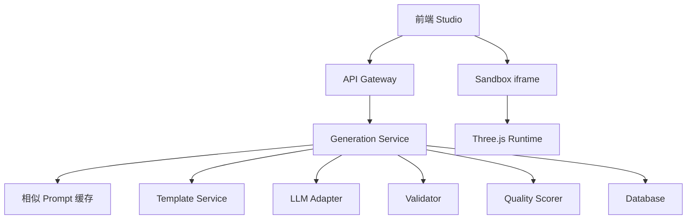
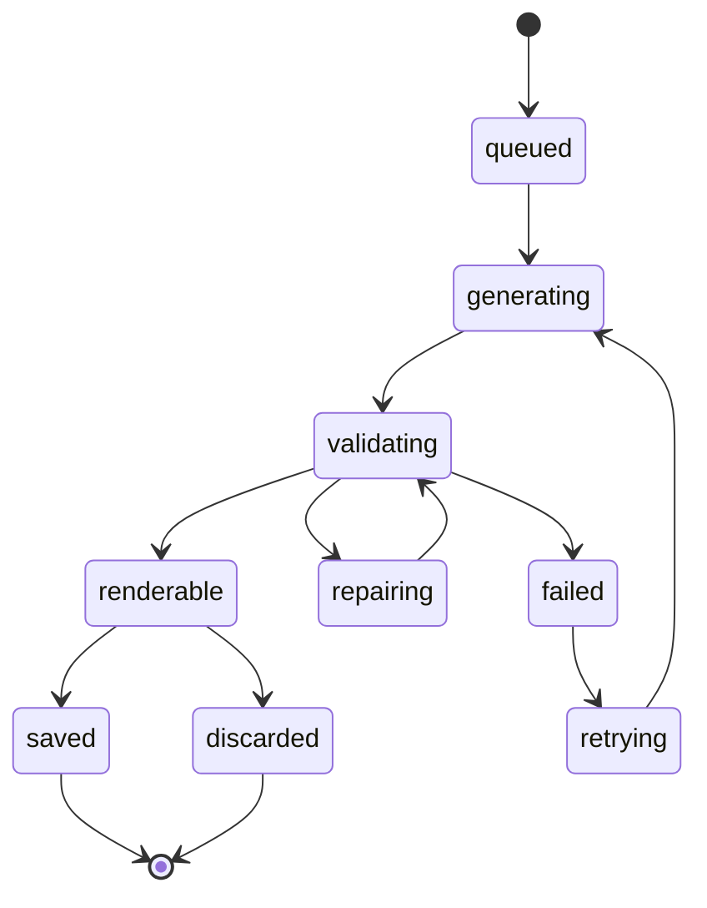
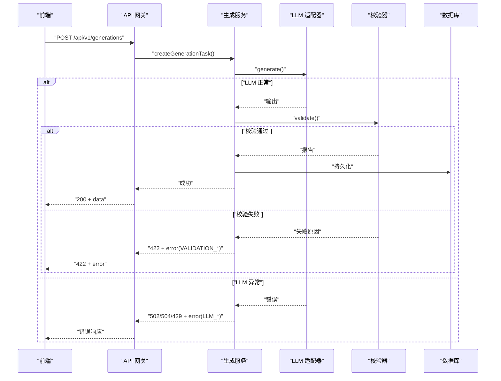
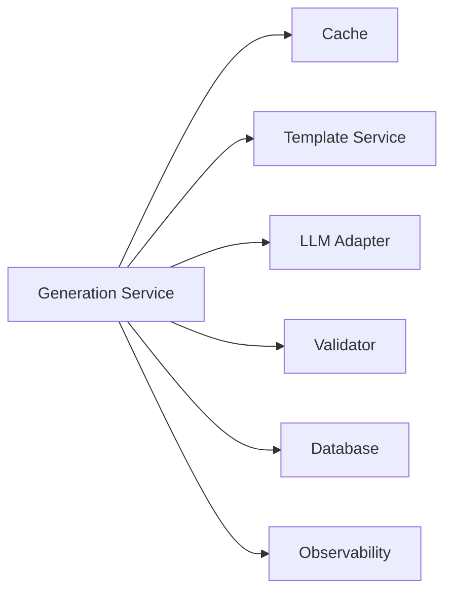

# 错误处理与状态码

<cite>
**本文引用的文件**
- [产品技术设计文档](file://tech/product-technical-design.md)
- [产品需求文档](file://prd.md)
</cite>

## 目录
1. [引言](#引言)
2. [项目结构](#项目结构)
3. [核心组件](#核心组件)
4. [架构总览](#架构总览)
5. [详细组件分析](#详细组件分析)
6. [依赖分析](#依赖分析)
7. [性能考虑](#性能考虑)
8. [故障排查指南](#故障排查指南)
9. [结论](#结论)
10. [附录](#附录)

## 引言
本规范面向 ApexForge 平台的“生成任务”全链路，统一错误分类、错误码、HTTP 状态码语义以及错误响应格式。目标是在网络层、业务层、安全校验层与 LLM 调用层建立一致的错误表达与可观测性，确保前端、网关、服务与沙箱执行端对错误具备一致的解析与处理策略。

## 项目结构
本规范基于平台级技术设计与产品需求文档进行抽象，覆盖以下关键域：
- 生成任务编排（创建、路由、缓存、模板匹配、LLM 调用、校验、评分）
- 代码安全校验（协议校验、黑名单、AST 白名单）
- 沙箱运行时（iframe 隔离、超时销毁、结果序列化）
- 可观测性（traceId、日志字段、告警规则）



图表来源
- [产品技术设计文档:38-62](file://tech/product-technical-design.md#L38-L62)
- [产品技术设计文档:361-390](file://tech/product-technical-design.md#L361-L390)

章节来源
- [产品技术设计文档:38-62](file://tech/product-technical-design.md#L38-L62)
- [产品技术设计文档:361-390](file://tech/product-technical-design.md#L361-L390)

## 核心组件
- 统一错误响应体：所有接口返回必须包含 traceId 与 error 对象；成功时不包含 error 字段。
- 错误码体系：按网络错误、业务逻辑错误、安全校验失败、LLM 调用异常、沙箱执行异常等维度划分。
- HTTP 状态码约定：明确 2xx/4xx/5xx 的使用场景与对应错误类型。
- 可观测性：traceId 贯穿全链路，日志记录 errorCode、errorMessage、details 等关键字段。

章节来源
- [产品技术设计文档:634-652](file://tech/product-technical-design.md#L634-L652)
- [产品技术设计文档:882-907](file://tech/product-technical-design.md#L882-L907)

## 架构总览
生成任务从前端发起，经网关鉴权限流后进入 Generation Service，依次经过缓存命中、模板匹配、LLM 调用、输出解析、安全校验、质量评分与持久化，最终通过 SSE/WebSocket 推送或轮询返回给前端。前端在 iframe 沙箱中执行生成的代码并渲染模型。

```mermaid
sequenceDiagram
participant FE as "前端"
participant GW as "API 网关"
participant GEN as "生成服务"
participant CACHE as "缓存"
participant TPL as "模板服务"
participant LLM as "LLM 适配器"
participant VAL as "校验器"
participant DB as "数据库"
participant BOX as "沙箱 iframe"
FE->>GW : "POST /api/v1/generations"
GW->>GEN : "createGenerationTask()"
GEN->>CACHE : "querySimilarPrompt()"
alt "命中缓存"
CACHE-->>GEN : "缓存结果"
else "未命中"
GEN->>TPL : "findCandidateTemplate()"
TPL-->>GEN : "候选模板"
GEN->>LLM : "generate(code|params)"
LLM-->>GEN : "生成输出"
GEN->>VAL : "validate(output)"
VAL-->>GEN : "校验报告"
end
GEN->>DB : "持久化任务与结果"
GEN-->>GW : "结果"
GW-->>FE : "生成载荷"
FE->>BOX : "execute in iframe"
BOX-->>FE : "模型 JSON 或错误"
```

图表来源
- [产品技术设计文档:361-390](file://tech/product-technical-design.md#L361-L390)

## 详细组件分析

### 统一错误响应格式
- 成功响应：包含 data 与 traceId，不出现 error 字段。
- 错误响应：包含 traceId 与 error 对象，error 包含 code、message、details。
- details 为结构化数组，便于前端展示与后端聚合统计。

示例路径参考
- [通用错误结构定义:641-652](file://tech/product-technical-design.md#L641-L652)

章节来源
- [产品技术设计文档:634-652](file://tech/product-technical-design.md#L634-L652)

### HTTP 状态码使用规范
- 2xx：请求成功。常见于创建任务成功、查询任务成功、保存资产成功。
- 4xx：客户端错误或权限不足。常见于鉴权失败、参数校验失败、配额超限、资源不存在。
- 5xx：服务端或第三方异常。常见于 LLM 调用失败、校验服务异常、数据库写入失败、内部系统错误。

建议映射
- 400：参数校验失败、输入长度超限、模式非法
- 401：认证失败或缺失
- 403：无权限访问空间/项目/资产
- 404：任务/资产/模板不存在
- 408：请求超时（如 LLM 长耗时）
- 429：限流触发（令牌桶/配额）
- 422：业务校验失败（如 Prompt 敏感词拦截、模板参数不合法）
- 500：内部错误（未知异常、依赖不可用）
- 502：上游网关或 LLM 网关错误
- 503：服务不可用（队列满、依赖降级）
- 504：网关超时（LLM 或下游服务超时）

章节来源
- [产品技术设计文档:634-652](file://tech/product-technical-design.md#L634-L652)

### 错误码体系与含义
说明
- 错误码采用“域_子域_原因”的命名风格，便于分类与检索。
- 每个错误码需配套 message（用户可读）与 details（结构化信息）。

分类与示例
- 网络与网关
  - NETWORK_TIMEOUT：请求超时（网关/上游）
  - NETWORK_UNAVAILABLE：上游不可用
  - GATEWAY_ERROR：网关转发异常
- 鉴权与授权
  - AUTH_MISSING：缺少认证信息
  - AUTH_INVALID：认证信息无效
  - AUTH_EXPIRED：认证过期
  - PERMISSION_DENIED：无权限访问资源
- 参数与业务
  - PARAM_INVALID：参数不合法
  - PROMPT_TOO_LONG：Prompt 超长
  - PROMPT_SENSITIVE：Prompt 含敏感内容
  - MODE_INVALID：生成模式非法
  - TEMPLATE_NOT_FOUND：模板不存在
  - TASK_NOT_FOUND：任务不存在
  - ASSET_SAVE_FAILED：资产保存失败
- LLM 调用
  - LLM_PROVIDER_ERROR：供应商错误
  - LLM_RATE_LIMITED：供应商限流
  - LLM_RESPONSE_INVALID：响应不符合协议
  - LLM_TIMEOUT：供应商超时
- 安全校验
  - VALIDATION_PROTOCOL_FAIL：输出协议校验失败
  - VALIDATION_BLACKLIST_HIT：命中黑名单
  - VALIDATION_AST_VIOLATION：AST 白名单违规
  - VALIDATION_COMPLEXITY_EXCEEDED：复杂度超限
- 沙箱执行
  - SANDBOX_TIMEOUT：执行超时
  - SANDBOX_RUNTIME_ERROR：运行时报错
  - MODEL_JSON_INVALID：返回结构非法
  - MODEL_TOO_COMPLEX：模型复杂度超限
  - MODEL_EMPTY：未生成有效对象
- 系统与基础设施
  - DATABASE_WRITE_ERROR：数据库写入失败
  - QUEUE_FULL：队列已满
  - SERVICE_UNAVAILABLE：服务不可用
  - INTERNAL_ERROR：内部未知错误

注意
- 以上为推荐集合，实际实现可在各模块内扩展，但需遵循统一结构与命名规范。

章节来源
- [产品技术设计文档:508-517](file://tech/product-technical-design.md#L508-L517)
- [产品技术设计文档:634-652](file://tech/product-technical-design.md#L634-L652)

### 生成任务状态机与错误关联
状态流转
- queued → generating → validating → renderable/saved/discard/failed
- validating 分支可能进入 repairing，修复后再次验证
- failed 可进入 retrying，重试后回到 generating

错误注入点
- generating：LLM 调用失败、超时、响应非法
- validating：协议校验失败、黑名单命中、AST 违规、复杂度超限
- sandbox：执行超时、运行时报错、模型数据非法或为空



图表来源
- [产品技术设计文档:342-357](file://tech/product-technical-design.md#L342-L357)

章节来源
- [产品技术设计文档:342-357](file://tech/product-technical-design.md#L342-L357)

### 关键流程时序与错误处理
以“创建生成任务”为例，展示错误在各阶段的处理与上报。



图表来源
- [产品技术设计文档:361-390](file://tech/product-technical-design.md#L361-L390)
- [产品技术设计文档:634-652](file://tech/product-technical-design.md#L634-L652)

章节来源
- [产品技术设计文档:361-390](file://tech/product-technical-design.md#L361-L390)
- [产品技术设计文档:634-652](file://tech/product-technical-design.md#L634-L652)

### 沙箱执行错误处理
- 错误分类与提示已在设计中给出，包括超时、运行时报错、模型 JSON 非法、复杂度超限、空模型等。
- 前端 SandboxClient 应负责将 iframe 错误映射为标准错误码，并通过统一错误响应返回。

章节来源
- [产品技术设计文档:508-517](file://tech/product-technical-design.md#L508-L517)

## 依赖分析
- 生成服务依赖缓存、模板服务、LLM 适配器、校验器、数据库与可观测性组件。
- 错误传播路径：LLM/校验/数据库/沙箱异常均会向上抛出，由 Generation Service 转换为标准错误响应。
- 可观测性贯穿全链路，traceId 用于关联错误上下文。



图表来源
- [产品技术设计文档:596-609](file://tech/product-technical-design.md#L596-L609)

章节来源
- [产品技术设计文档:596-609](file://tech/product-technical-design.md#L596-L609)

## 性能考虑
- 错误快速失败：在鉴权、限流、参数校验阶段尽早返回，避免进入 LLM 与校验链路。
- 重试与熔断：对 LLM 调用实施指数退避与熔断，避免雪崩。
- 缓存命中优先：相似 Prompt 直接返回，减少错误面与延迟。
- 沙箱超时保护：严格限制执行时间，防止长时间阻塞。

[本节为通用指导，无需源码引用]

## 故障排查指南
- 定位 traceId：在错误响应与日志中查找 traceId，串联前后端与下游服务日志。
- 检查错误码：根据错误码分类快速定位问题域（网络、鉴权、业务、LLM、校验、沙箱）。
- 查看 details：关注结构化详情，如黑名单命中项、AST 违规节点、LLM 返回片段等。
- 观察状态机：结合任务状态机判断错误发生阶段（generating/validating/sandbox）。
- 监控告警：关注失败率、LLM 延迟、校验失败突增、沙箱超时突增、API 错误率等指标。

章节来源
- [产品技术设计文档:882-907](file://tech/product-technical-design.md#L882-L907)

## 结论
通过统一的错误响应格式、清晰的错误码体系与明确的 HTTP 状态码语义，ApexForge 能在多组件协作的复杂链路中提供一致的错误表达与可观测能力。配合状态机与监控告警，可显著提升问题定位效率与系统稳定性。

[本节为总结，无需源码引用]

## 附录

### 接口契约与错误示例
- 创建生成任务
  - 路径：POST /api/v1/generations
  - 成功响应：包含 data 与 traceId
  - 错误响应：包含 traceId 与 error（code、message、details）
- 查询生成任务
  - 路径：GET /api/v1/generations/{taskId}
  - 返回任务状态、结果、错误信息与质量评分
- 保存为资产
  - 路径：POST /api/v1/assets
- 查询资产版本
  - 路径：GET /api/v1/assets/{assetId}/versions
- SSE 事件
  - 路径：GET /api/v1/generations/{taskId}/events
  - 事件类型：queued、generating、validating、repairing、renderable、failed

章节来源
- [产品技术设计文档:654-756](file://tech/product-technical-design.md#L654-L756)

### 日志与可观测性字段
- 关键字段：traceId、userId、workspaceId、taskId、provider、promptVersion、generationMode、latencyMs、status、errorCode、qualityScore
- 告警规则：生成失败率过高、LLM 延迟过高、校验失败突增、沙箱超时突增、API 错误率过高

章节来源
- [产品技术设计文档:882-907](file://tech/product-technical-design.md#L882-L907)