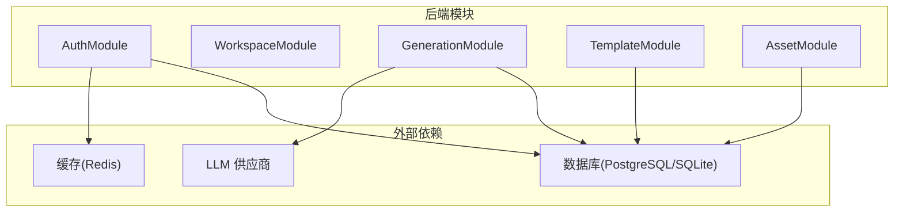
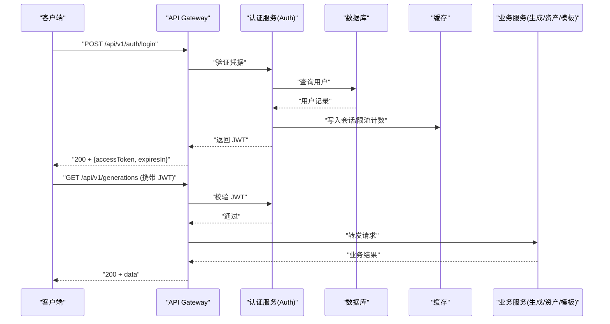

# 认证与授权 API

<cite>
**本文引用的文件**   
- [产品技术设计文档](file://tech/product-technical-design.md)
- [产品需求文档](file://prd.md)
</cite>

## 目录
1. [简介](#简介)
2. [项目结构](#项目结构)
3. [核心组件](#核心组件)
4. [架构总览](#架构总览)
5. [详细接口规范](#详细接口规范)
6. [依赖关系分析](#依赖关系分析)
7. [性能与安全考虑](#性能与安全考虑)
8. [故障排查指南](#故障排查指南)
9. [结论](#结论)

## 简介
本文件为 ApexForge 平台的“认证与授权”API 接口规范，覆盖用户登录、注册、JWT Token 管理、API Key 管理等核心能力。文档基于仓库中的产品与技术设计资料整理，明确 HTTP 方法、URL 模式、请求/响应结构、错误处理与安全性策略，并提供典型调用流程与时序说明，帮助前后端与集成方快速落地实现。

## 项目结构
从仓库可见，当前阶段以设计与规划为主，尚未包含具体代码实现。认证与授权相关的设计要点集中在后端模块划分、领域模型与通用 API 规范中：
- 后端采用 NestJS 模块化架构，其中 AuthModule 负责用户认证、JWT 与 API Key 管理。
- 领域模型包含 User、ApiKey、Workspace 等实体，用于支撑多租户与开放平台场景。
- 通用 API 规范定义 Base URL、统一错误结构与 traceId 要求。



图表来源
- [产品技术设计文档:574-593](file://tech/product-technical-design.md#L574-L593)
- [产品技术设计文档:104-130](file://tech/product-technical-design.md#L104-L130)

章节来源
- [产品技术设计文档:574-593](file://tech/product-technical-design.md#L574-L593)
- [产品技术设计文档:104-130](file://tech/product-technical-design.md#L104-L130)

## 核心组件
- 认证服务（Auth）
  - 职责：用户注册/登录、JWT 签发与校验、API Key 生命周期管理、权限与配额校验入口。
  - 关键对象：User、ApiKey、Workspace。
- 网关与鉴权中间件
  - 职责：在 API Gateway 层进行 JWT 校验与 API Key 校验、限流、traceId 注入。
- 数据与缓存
  - 职责：持久化用户与密钥信息；缓存会话/令牌状态与限流计数。

章节来源
- [产品技术设计文档:574-593](file://tech/product-technical-design.md#L574-L593)
- [产品技术设计文档:132-171](file://tech/product-technical-design.md#L132-L171)

## 架构总览
认证与授权在整体系统中的位置如下：客户端通过 API Gateway 访问业务接口，Gateway 将鉴权前置到 Auth 服务完成；业务服务仅关注资源访问控制与配额校验。



图表来源
- [产品技术设计文档:34-100](file://tech/product-technical-design.md#L34-L100)
- [产品技术设计文档:632-652](file://tech/product-technical-design.md#L632-L652)

## 详细接口规范

### 通用约定
- Base URL：/api/v1
- 认证方式：
  - 用户侧：HTTP Header Authorization: Bearer <JWT>
  - 开放平台：HTTP Header X-API-Key: <apiKey>
- 响应必须包含 traceId；错误响应使用统一结构。

错误结构示例字段
- traceId：链路追踪 ID
- error.code：错误码
- error.message：人类可读消息
- error.details：附加详情（可选）

章节来源
- [产品技术设计文档:632-652](file://tech/product-technical-design.md#L632-L652)

---

### 用户注册
- 方法：POST
- 路径：/api/v1/auth/register
- 鉴权：无需
- 请求体字段
  - email：邮箱（必填）
  - password：密码（必填，服务端需加盐哈希存储）
  - name：昵称（可选）
- 成功响应
  - 201 Created
  - 响应体包含用户基础信息与首次分配的 workspaceId（如适用）
- 失败响应
  - 400 Bad Request：参数校验失败
  - 409 Conflict：邮箱已存在
  - 422 Unprocessable Entity：密码强度不满足策略

安全建议
- 密码使用强哈希算法（如 bcrypt/scrypt/argon2）。
- 输入长度限制与敏感词过滤。
- 注册后发送邮箱确认链接（可选）。

章节来源
- [产品技术设计文档:178-190](file://tech/product-technical-design.md#L178-L190)
- [产品技术设计文档:924-930](file://tech/product-technical-design.md#L924-L930)

---

### 用户登录
- 方法：POST
- 路径：/api/v1/auth/login
- 鉴权：无需
- 请求体字段
  - email：邮箱（必填）
  - password：密码（必填）
- 成功响应
  - 200 OK
  - 响应体包含 accessToken、expiresIn、tokenType（Bearer）
- 失败响应
  - 401 Unauthorized：邮箱或密码错误
  - 403 Forbidden：账号被禁用
  - 429 Too Many Requests：触发限流

安全建议
- 登录失败次数限制与账户锁定策略。
- 强制 HTTPS，设置 Cookie Secure/HttpOnly（若使用 Cookie 方案）。
- 记录登录审计日志（脱敏）。

章节来源
- [产品技术设计文档:632-652](file://tech/product-technical-design.md#L632-L652)
- [产品技术设计文档:924-930](file://tech/product-technical-design.md#L924-L930)

---

### 刷新 Token
- 方法：POST
- 路径：/api/v1/auth/token/refresh
- 鉴权：无需（使用 refresh token 或会话凭证）
- 请求体字段
  - refreshToken：刷新令牌（必填）
- 成功响应
  - 200 OK
  - 返回新的 accessToken 与新的 expiresIn
- 失败响应
  - 401 Unauthorized：refreshToken 无效或过期
  - 403 Forbidden：账号异常
  - 429 Too Many Requests：刷新频率超限

安全建议
- Refresh Token 短期有效且可撤销。
- 绑定设备指纹或 IP 白名单（企业版）。
- 记录刷新审计日志。

章节来源
- [产品技术设计文档:632-652](file://tech/product-technical-design.md#L632-L652)

---

### 退出登录
- 方法：POST
- 路径：/api/v1/auth/logout
- 鉴权：需要（Bearer JWT）
- 请求体字段：无
- 成功响应
  - 204 No Content
- 失败响应
  - 401 Unauthorized：未提供或无效令牌
  - 403 Forbidden：账号异常

安全建议
- 服务端维护黑名单或使旧令牌失效。
- 清理本地会话与缓存。

章节来源
- [产品技术设计文档:632-652](file://tech/product-technical-design.md#L632-L652)

---

### 获取当前用户信息
- 方法：GET
- 路径：/api/v1/auth/me
- 鉴权：需要（Bearer JWT）
- 成功响应
  - 200 OK
  - 返回用户基本信息（不包含敏感字段）
- 失败响应
  - 401 Unauthorized
  - 403 Forbidden

章节来源
- [产品技术设计文档:178-190](file://tech/product-technical-design.md#L178-L190)

---

### 修改密码
- 方法：PUT
- 路径：/api/v1/auth/password
- 鉴权：需要（Bearer JWT）
- 请求体字段
  - oldPassword：原密码（必填）
  - newPassword：新密码（必填，满足强度策略）
- 成功响应
  - 200 OK
- 失败响应
  - 400 Bad Request：参数校验失败
  - 401 Unauthorized：原密码错误
  - 422 Unprocessable Entity：新密码不符合策略

安全建议
- 修改成功后使所有活跃会话失效（可选）。
- 记录变更审计日志。

章节来源
- [产品技术设计文档:924-930](file://tech/product-technical-design.md#L924-L930)

---

### 创建 API Key
- 方法：POST
- 路径：/api/v1/api-keys
- 鉴权：需要（Bearer JWT）
- 请求体字段
  - name：Key 名称（必填）
  - scopes：权限范围（可选，默认最小集）
  - expiresAt：过期时间（可选）
- 成功响应
  - 201 Created
  - 返回 keyId、keyPrefix、rawKey（仅展示一次）、expiresAt
- 失败响应
  - 400 Bad Request：参数校验失败
  - 403 Forbidden：超出配额或无权限
  - 429 Too Many Requests：创建频率超限

安全建议
- rawKey 仅返回一次，服务端只保存哈希值。
- 支持按空间维度隔离与配额限制。
- 记录创建与使用审计日志。

章节来源
- [产品技术设计文档:149-171](file://tech/product-technical-design.md#L149-L171)
- [产品技术设计文档:924-930](file://tech/product-technical-design.md#L924-L930)

---

### 列出 API Key
- 方法：GET
- 路径：/api/v1/api-keys
- 鉴权：需要（Bearer JWT）
- 查询参数
  - page/pageSize：分页（可选）
- 成功响应
  - 200 OK
  - 返回 keyId、name、scopes、status、createdAt、expiresAt（不返回完整 key）
- 失败响应
  - 401 Unauthorized
  - 403 Forbidden

章节来源
- [产品技术设计文档:149-171](file://tech/product-technical-design.md#L149-L171)

---

### 删除 API Key
- 方法：DELETE
- 路径：/api/v1/api-keys/{keyId}
- 鉴权：需要（Bearer JWT）
- 成功响应
  - 204 No Content
- 失败响应
  - 401 Unauthorized
  - 403 Forbidden
  - 404 Not Found

章节来源
- [产品技术设计文档:149-171](file://tech/product-technical-design.md#L149-L171)

---

### 使用 API Key 调用业务接口
- 鉴权方式：Header X-API-Key: <apiKey>
- 适用范围：开放平台接口（例如生成任务、模板、资产等）
- 行为
  - 校验 apiKey 有效性、配额与权限范围
  - 注入 traceId 并记录审计日志
  - 命中配额上限时返回 429

章节来源
- [产品技术设计文档:632-652](file://tech/product-technical-design.md#L632-L652)
- [产品技术设计文档:844-866](file://tech/product-technical-design.md#L844-L866)

---

### 统一错误响应
- 结构
  - traceId：链路追踪 ID
  - error.code：错误码
  - error.message：错误描述
  - error.details：附加信息（可选）
- 常见错误码
  - AUTH_INVALID_CREDENTIALS：凭据无效
  - AUTH_TOKEN_EXPIRED：令牌过期
  - AUTH_FORBIDDEN：无权限
  - RATE_LIMIT_EXCEEDED：触发限流
  - API_KEY_INVALID：API Key 无效
  - API_KEY_EXPIRED：API Key 已过期

章节来源
- [产品技术设计文档:632-652](file://tech/product-technical-design.md#L632-L652)

## 依赖关系分析
- 模块耦合
  - AuthModule 与 WorkspaceModule 解耦，通过 userId/workspaceId 关联。
  - 业务服务（Generation/Template/Asset）依赖 Auth 的鉴权结果，不再重复校验凭据。
- 外部依赖
  - 数据库：用户、工作区、API Key 持久化。
  - 缓存：限流计数、令牌黑名单、热点配置。
  - 审计与可观测：记录鉴权事件与 traceId。

```mermaid
classDiagram
class User {
+id
+email
+name
+plan
+status
+createdAt
+updatedAt
}
class ApiKey {
+id
+workspaceId
+name
+scopes
+status
+createdAt
+expiresAt
}
class Workspace {
+id
+ownerId
+name
+type
+createdAt
+updatedAt
}
User ||--o{ Workspace : "拥有"
Workspace ||--o{ ApiKey : "持有"
```

图表来源
- [产品技术设计文档:178-200](file://tech/product-technical-design.md#L178-L200)
- [产品技术设计文档:149-171](file://tech/product-technical-design.md#L149-L171)

章节来源
- [产品技术设计文档:178-200](file://tech/product-technical-design.md#L178-L200)
- [产品技术设计文档:149-171](file://tech/product-technical-design.md#L149-L171)

## 性能与安全考虑
- 性能
  - 登录/注册接口需配合缓存与索引优化，避免热点键放大。
  - API Key 校验走内存缓存（如 Redis），降低数据库压力。
  - 限流采用令牌桶/滑动窗口，结合用户与 Key 维度。
- 安全
  - 全链路 HTTPS，严格 CSP 与同源策略。
  - 密码加盐哈希存储，禁止明文落盘。
  - API Key 仅展示一次，数据库保存哈希；支持吊销与过期。
  - 敏感日志脱敏，不记录完整密钥与鉴权头。
  - 审计日志记录登录、Key 创建/使用/删除等关键事件。

章节来源
- [产品技术设计文档:924-930](file://tech/product-technical-design.md#L924-L930)
- [产品技术设计文档:632-652](file://tech/product-technical-design.md#L632-L652)

## 故障排查指南
- 常见问题
  - 401 Unauthorized：检查 Authorization 头格式与令牌是否过期。
  - 403 Forbidden：检查用户角色与资源归属（workspaceId）。
  - 429 Too Many Requests：检查限流阈值与配额配置。
  - API Key 无效：确认 Key 是否存在、是否过期、是否被吊销。
- 定位手段
  - 通过 traceId 串联网关、认证服务与业务服务的日志。
  - 查看认证审计日志与 Key 使用日志。
  - 核对限流计数器与缓存命中率。

章节来源
- [产品技术设计文档:632-652](file://tech/product-technical-design.md#L632-L652)
- [产品技术设计文档:868-907](file://tech/product-technical-design.md#L868-L907)

## 结论
本文档基于仓库中的产品与技术设计资料，梳理了 ApexForge 认证与授权的总体架构与接口规范，涵盖用户注册/登录、JWT 管理、API Key 管理与统一错误结构。建议在实现中优先落实鉴权中间件、限流与审计能力，并以 traceId 贯穿全链路，确保可观测性与问题定位效率。后续可按 Beta/Scale 里程碑逐步完善多租户、配额与开放平台能力。