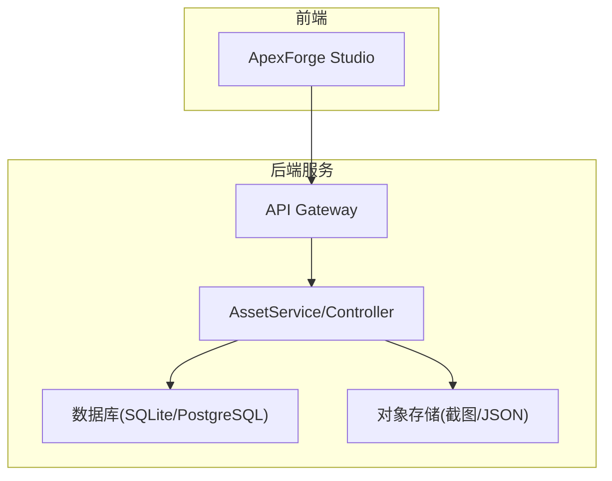
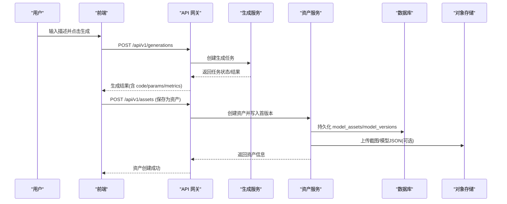
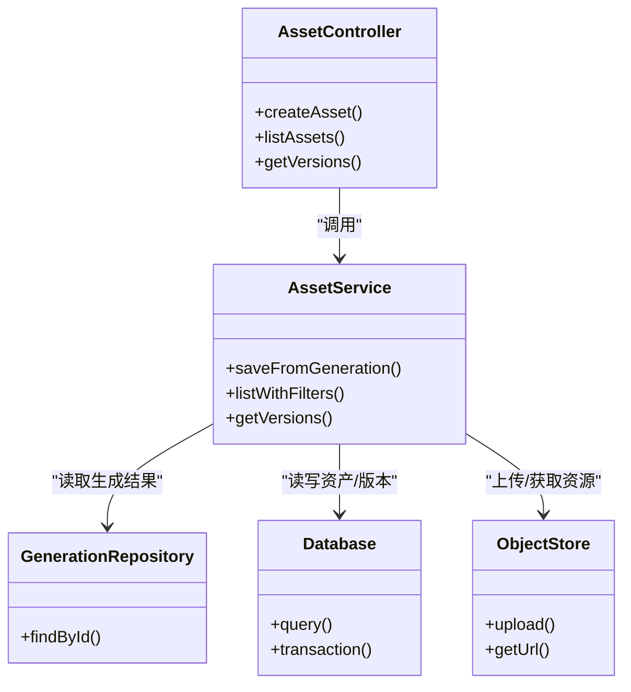

# 资产管理 API

<cite>
**本文引用的文件**   
- [产品需求文档](file://prd.md)
- [产品技术设计文档](file://tech/product-technical-design.md)
</cite>

## 目录
1. [简介](#简介)
2. [项目结构](#项目结构)
3. [核心组件](#核心组件)
4. [架构总览](#架构总览)
5. [详细接口规范](#详细接口规范)
6. [依赖关系分析](#依赖关系分析)
7. [性能与扩展性](#性能与扩展性)
8. [故障排查指南](#故障排查指南)
9. [结论](#结论)
10. [附录：数据模型与字段说明](#附录数据模型与字段说明)

## 简介
本文件为 ApexForge 平台的“模型资产管理”RESTful API 提供完整规范，覆盖资产创建、版本查询、列表管理、标签系统与搜索过滤等能力。API 基于平台统一规范（Base URL、认证、错误结构、traceId）进行设计，并与生成链路、模板系统、权限与计费体系协同工作。

## 项目结构
从工程视角，资产管理属于后端模块之一，位于 NestJS 的 AssetModule 中，对外暴露 REST 接口；在 MVP 阶段使用 SQLite，平台化后迁移至 PostgreSQL，并配合对象存储保存截图与模型 JSON。

图表来源
- [产品技术设计文档:574-593](file://tech/product-technical-design.md#L574-L593)
- [产品技术设计文档:238-269](file://tech/product-technical-design.md#L238-L269)

章节来源
- [产品技术设计文档:574-593](file://tech/product-technical-design.md#L574-L593)
- [产品技术设计文档:238-269](file://tech/product-technical-design.md#L238-L269)

## 核心组件
- AssetModule：负责模型资产的 CRUD、版本关联、标签管理与检索。
- GenerationModule：负责生成任务编排，产出可保存为资产的代码与参数。
- TemplateModule：提供模板与参数 Schema，辅助资产快速构建。
- ObservabilityModule：记录 traceId、耗时、状态与错误码，支撑问题定位。

章节来源
- [产品技术设计文档:574-593](file://tech/product-technical-design.md#L574-L593)
- [产品技术设计文档:868-907](file://tech/product-technical-design.md#L868-L907)

## 架构总览
资产管理与生成链路的关系如下：用户通过前端发起生成任务，成功后将结果保存为资产，并自动创建首个版本；后续迭代通过二次生成或模板渲染产生新版本，形成版本链。

图表来源
- [产品技术设计文档:632-722](file://tech/product-technical-design.md#L632-L722)
- [产品技术设计文档:238-269](file://tech/product-technical-design.md#L238-L269)

## 详细接口规范

### 通用规范
- Base URL：/api/v1
- 认证：用户侧 JWT，开放平台 API Key
- 响应必须包含 traceId
- 错误响应统一结构

错误结构示例（字段说明见后文）：
{
  "traceId": "tr_123",
  "error": {
    "code": "GENERATION_VALIDATION_FAILED",
    "message": "生成结果未通过安全校验",
    "details": []
  }
}

章节来源
- [产品技术设计文档:632-652](file://tech/product-technical-design.md#L632-L652)

---

### 资产创建
- 方法：POST
- 路径：/api/v1/assets
- 鉴权：JWT 或 API Key
- 请求体字段：
  - projectId：字符串，必填
  - generationTaskId：字符串，必填
  - name：字符串，必填
  - tags：字符串数组，可选
  - category：字符串，可选
  - thumbnailUrl：字符串，可选
- 响应体字段：
  - id：资产 ID
  - workspaceId：所属空间
  - projectId：所属项目
  - name：资产名称
  - category：分类
  - currentVersionId：当前版本 ID
  - tags：标签列表
  - status：active/deleted/archived
  - createdBy：创建者
  - createdAt：创建时间
  - updatedAt：更新时间
- 业务逻辑：
  - 校验 projectId 与 generationTaskId 存在且归属当前用户/空间
  - 若 assets 已存在同名同项目资产，按策略处理（建议允许重复命名但唯一 ID）
  - 根据 generationTaskId 拉取生成结果，写入 model_assets 表
  - 自动生成首个 model_versions 记录（versionNo=1），并设置 currentVersionId
  - 可选：上传缩略图到对象存储，更新 thumbnailUrl
- 错误码参考：
  - INVALID_PROJECT_ID：项目不存在或无权限
  - TASK_NOT_FOUND：生成任务不存在或未完成
  - DUPLICATE_ASSET_NAME：同名冲突（如启用）
  - STORAGE_ERROR：对象存储异常
- 请求示例：
  {
    "projectId": "proj_123",
    "generationTaskId": "gen_123",
    "name": "未来感跑车",
    "tags": ["vehicle", "sci-fi"],
    "category": "vehicle",
    "thumbnailUrl": "https://cdn.example.com/thumb.png"
  }
- 响应示例：
  {
    "traceId": "tr_123",
    "data": {
      "id": "asset_001",
      "workspaceId": "ws_001",
      "projectId": "proj_123",
      "name": "未来感跑车",
      "category": "vehicle",
      "currentVersionId": "ver_001",
      "tags": ["vehicle", "sci-fi"],
      "status": "active",
      "createdBy": "user_001",
      "createdAt": "2026-07-08T10:00:00Z",
      "updatedAt": "2026-07-08T10:00:00Z"
    }
  }

章节来源
- [产品技术设计文档:703-716](file://tech/product-technical-design.md#L703-L716)
- [产品技术设计文档:238-269](file://tech/product-technical-design.md#L238-L269)

---

### 资产版本查询
- 方法：GET
- 路径：/api/v1/assets/{assetId}/versions
- 鉴权：JWT 或 API Key
- 路径参数：
  - assetId：资产 ID
- 查询参数（可选）：
  - versionNo：指定版本号，不传则返回全部版本
  - includeCode：是否包含 Three.js 源码（默认 false）
  - includeParams：是否包含参数对象（默认 true）
  - includeMetrics：是否包含指标（默认 true）
  - includeScreenshot：是否包含截图地址（默认 true）
- 响应体字段（版本项）：
  - id：版本 ID
  - assetId：资产 ID
  - generationTaskId：来源任务
  - versionNo：版本号
  - code：Three.js 代码（按需）
  - params：参数对象
  - modelJsonUrl：模型 JSON 地址
  - screenshotUrl：截图地址
  - metrics：几何体、顶点、材质等指标
  - createdAt：创建时间
- 业务逻辑：
  - 校验 assetId 归属当前用户/空间
  - 若指定 versionNo，仅返回该版本；否则返回按 versionNo 升序的全部版本
  - 大字段（code、modelJsonUrl、screenshotUrl）可按 include* 控制返回
- 错误码参考：
  - ASSET_NOT_FOUND：资产不存在或无权限
  - VERSION_NOT_FOUND：指定版本不存在
- 请求示例：
  GET /api/v1/assets/asset_001/versions?includeCode=true&includeParams=true&includeMetrics=true&includeScreenshot=true
- 响应示例：
  {
    "traceId": "tr_123",
    "data": [
      {
        "id": "ver_001",
        "assetId": "asset_001",
        "generationTaskId": "gen_123",
        "versionNo": 1,
        "code": "function buildModel(params, THREE) { ... }",
        "params": {},
        "modelJsonUrl": "https://cdn.example.com/model.json",
        "screenshotUrl": "https://cdn.example.com/screenshot.png",
        "metrics": {
          "meshCount": 12,
          "vertexCount": 4500,
          "materialCount": 3
        },
        "createdAt": "2026-07-08T10:00:00Z"
      }
    ]
  }

章节来源
- [产品技术设计文档:718-722](file://tech/product-technical-design.md#L718-L722)
- [产品技术设计文档:255-269](file://tech/product-technical-design.md#L255-L269)

---

### 资产列表管理
- 方法：GET
- 路径：/api/v1/assets
- 鉴权：JWT 或 API Key
- 查询参数（可选）：
  - projectId：按项目筛选
  - category：按分类筛选
  - tags：逗号分隔的标签列表，支持多标签交集或并集（由实现定义）
  - status：active/deleted/archived
  - keyword：关键词模糊匹配（名称、描述等）
  - sort：排序字段（createdAt、updatedAt、name）
  - order：asc/desc
  - page：页码（默认 1）
  - pageSize：每页数量（默认 20，最大 100）
- 响应体字段：
  - items：资产列表项（字段同资产创建响应）
  - total：总数
  - page：当前页
  - pageSize：每页大小
- 业务逻辑：
  - 权限校验：仅返回当前用户/空间下的资产
  - 索引优化：workspaceId、projectId、updatedAt 建索引
  - 分页游标：大数据量建议使用游标分页（可选）
- 错误码参考：
  - INVALID_QUERY_PARAM：查询参数非法
  - DATABASE_ERROR：数据库异常
- 请求示例：
  GET /api/v1/assets?projectId=proj_123&category=vehicle&tags=vehicle,sci-fi&keyword=跑车&sort=updatedAt&order=desc&page=1&pageSize=20
- 响应示例：
  {
    "traceId": "tr_123",
    "data": {
      "items": [
        {
          "id": "asset_001",
          "workspaceId": "ws_001",
          "projectId": "proj_123",
          "name": "未来感跑车",
          "category": "vehicle",
          "currentVersionId": "ver_001",
          "tags": ["vehicle", "sci-fi"],
          "status": "active",
          "createdBy": "user_001",
          "createdAt": "2026-07-08T10:00:00Z",
          "updatedAt": "2026-07-08T10:00:00Z"
        }
      ],
      "total": 1,
      "page": 1,
      "pageSize": 20
    }
  }

章节来源
- [产品技术设计文档:238-269](file://tech/product-technical-design.md#L238-L269)
- [产品技术设计文档:952-958](file://tech/product-technical-design.md#L952-L958)

---

### 标签系统与搜索过滤
- 标签：
  - 类型：字符串数组
  - 用途：分类、风格、场景等多维度标记
  - 约束：长度限制、去重、大小写不敏感（建议）
- 搜索过滤：
  - 关键词：对名称、分类、标签进行模糊匹配
  - 多条件组合：支持 AND/OR 语义（由实现定义）
  - 性能：对常用过滤字段建立索引，避免全表扫描
- 最佳实践：
  - 标签标准化：维护标签字典，避免同义不同词
  - 分页+排序：确保大数据量下稳定性能
  - 缓存热点查询：对高频过滤条件做短期缓存

章节来源
- [产品技术设计文档:238-269](file://tech/product-technical-design.md#L238-L269)
- [产品技术设计文档:952-958](file://tech/product-technical-design.md#L952-L958)

---

### 错误处理方案
- 统一错误结构：
  {
    "traceId": "tr_123",
    "error": {
      "code": "INVALID_PROJECT_ID",
      "message": "项目不存在或无权限",
      "details": []
    }
  }
- 常见错误码：
  - INVALID_PROJECT_ID：项目不存在或无权限
  - TASK_NOT_FOUND：生成任务不存在或未完成
  - ASSET_NOT_FOUND：资产不存在或无权限
  - VERSION_NOT_FOUND：指定版本不存在
  - DUPLICATE_ASSET_NAME：同名冲突（如启用）
  - STORAGE_ERROR：对象存储异常
  - DATABASE_ERROR：数据库异常
  - INVALID_QUERY_PARAM：查询参数非法
- 处理建议：
  - 客户端根据 error.code 展示友好提示
  - 服务端记录 traceId 与上下文日志，便于排查
  - 对幂等接口（如创建资产）做好重试保护

章节来源
- [产品技术设计文档:632-652](file://tech/product-technical-design.md#L632-L652)

## 依赖关系分析
资产管理与相关模块的依赖关系如下：

图表来源
- [产品技术设计文档:574-593](file://tech/product-technical-design.md#L574-L593)
- [产品技术设计文档:238-269](file://tech/product-technical-design.md#L238-L269)

章节来源
- [产品技术设计文档:574-593](file://tech/product-technical-design.md#L574-L593)
- [产品技术设计文档:238-269](file://tech/product-technical-design.md#L238-L269)

## 性能与扩展性
- 数据库索引：
  - model_assets.workspaceId、projectId、updatedAt 建索引
  - model_versions.assetId、versionNo 建索引
- 对象存储：
  - 大字段（代码、模型 JSON、截图）优先存对象存储，数据库仅保留 URL 与摘要
- 缓存：
  - 热门资产与版本元数据短期缓存
  - 标签字典与分类映射缓存
- 分页与排序：
  - 默认 20 条/页，最大 100 条/页
  - 支持按时间倒序排序，提升最近资产可见性
- 异步与队列：
  - 生成任务异步化，避免 HTTP 长连接占用
  - 批量导入/导出走队列

章节来源
- [产品技术设计文档:952-958](file://tech/product-technical-design.md#L952-L958)
- [产品技术设计文档:944-951](file://tech/product-technical-design.md#L944-L951)

## 故障排查指南
- 常见问题：
  - 资产创建失败：检查 projectId 与 generationTaskId 权限与状态
  - 版本查询为空：确认 assetId 是否存在且未被删除
  - 列表分页异常：检查 page/pageSize 边界值与排序字段合法性
- 定位手段：
  - 查看 traceId 对应日志，确认各阶段耗时与错误码
  - 核对数据库索引与慢查询
  - 检查对象存储访问权限与网络连通性
- 告警规则：
  - API 错误率过高：5xx 比例大于 5%
  - 数据库延迟突增：慢查询占比上升
  - 对象存储超时：上传/下载失败率升高

章节来源
- [产品技术设计文档:868-907](file://tech/product-technical-design.md#L868-L907)

## 结论
本规范定义了 ApexForge 平台资产管理的核心 RESTful 接口，涵盖资产创建、版本查询、列表管理与标签搜索过滤，并提供统一的错误结构与可观测性要求。结合数据库索引、对象存储与缓存策略，可在保证功能完备的同时兼顾性能与可扩展性。

## 附录：数据模型与字段说明

### 模型资产（model_assets）
- id：资产 ID
- workspaceId：所属空间
- projectId：所属项目
- name：资产名称
- category：分类
- thumbnailUrl：缩略图
- currentVersionId：当前版本
- tags：标签列表
- status：active、deleted、archived
- createdBy：创建者
- createdAt：创建时间
- updatedAt：更新时间

### 模型版本（model_versions）
- id：版本 ID
- assetId：资产 ID
- generationTaskId：来源任务
- versionNo：版本号
- code：Three.js 代码
- params：参数对象
- modelJsonUrl：Three.js Object JSON 地址
- screenshotUrl：截图地址
- metrics：几何体、顶点、材质等指标
- createdAt：创建时间

章节来源
- [产品技术设计文档:238-269](file://tech/product-technical-design.md#L238-L269)