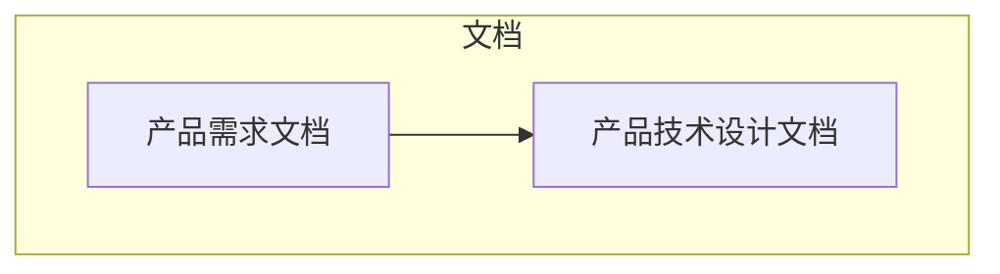
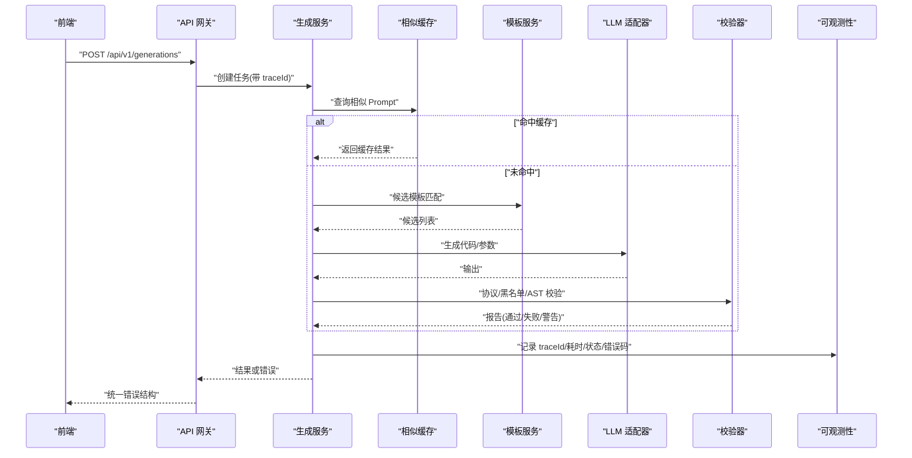
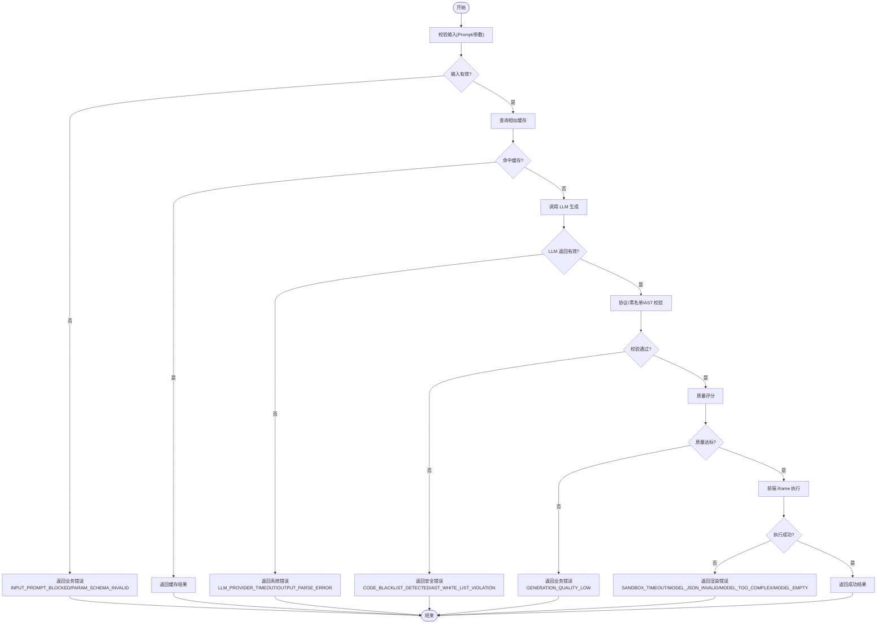
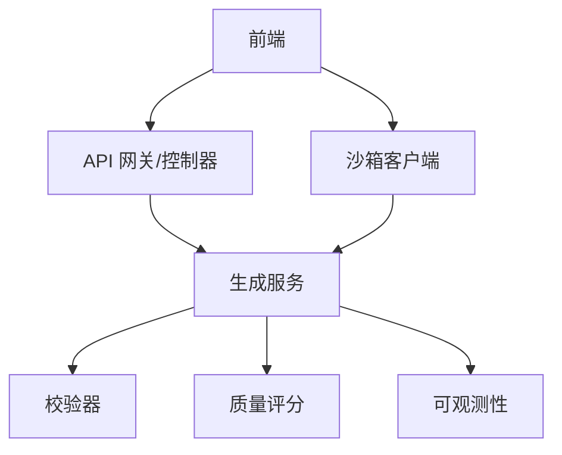

# 错误码与异常处理

<cite>
**本文引用的文件**   
- [产品技术设计文档](file://tech/product-technical-design.md)
- [产品需求文档](file://prd.md)
</cite>

## 目录
1. [引言](#引言)
2. [项目结构](#项目结构)
3. [核心组件](#核心组件)
4. [架构总览](#架构总览)
5. [详细组件分析](#详细组件分析)
6. [依赖关系分析](#依赖关系分析)
7. [性能考虑](#性能考虑)
8. [故障排查指南](#故障排查指南)
9. [结论](#结论)
10. [附录](#附录)

## 引言
本规范为 ApexForge 平台建立统一的错误码与异常处理体系，覆盖 API 返回的错误码定义、错误信息格式、异常分类体系（业务错误、系统错误、安全错误等），并给出错误处理最佳实践、日志记录与监控告警配置指南，以及前端错误处理策略与用户友好的错误提示设计。目标是确保从生成链路到沙箱执行的全链路可观测、可定位、可恢复，并提供一致的用户体验。

## 项目结构
本项目当前仓库包含产品与技术设计文档，未包含具体实现代码。因此，本规范基于设计文档中的接口契约、状态机、校验与安全策略进行抽象与落地建议，便于后续在 NestJS 后端与 React/Three.js 前端中统一实施。

图表来源
- [产品需求文档](file://prd.md)
- [产品技术设计文档](file://tech/product-technical-design.md)

章节来源
- [产品需求文档](file://prd.md)
- [产品技术设计文档](file://tech/product-technical-design.md)

## 核心组件
围绕错误码与异常处理，以下组件承担关键职责：
- API 网关与控制器：统一鉴权、限流、错误包装与响应结构。
- 生成服务：编排 Prompt、模板匹配、LLM 调用、校验与修复、质量评分。
- 校验模块：协议校验、黑名单扫描、AST 白名单校验。
- 沙箱客户端与服务端：iframe 隔离执行、超时控制、错误映射。
- 可观测性模块：traceId、日志、指标、告警。

章节来源
- [产品技术设计文档:576-610](file://tech/product-technical-design.md#L576-L610)
- [产品技术设计文档:632-758](file://tech/product-technical-design.md#L632-L758)
- [产品技术设计文档:428-470](file://tech/product-technical-design.md#L428-L470)
- [产品技术设计文档:472-518](file://tech/product-technical-design.md#L472-L518)
- [产品技术设计文档:868-908](file://tech/product-technical-design.md#L868-L908)

## 架构总览
下图展示错误在系统中的流转路径：从前端发起请求，经网关鉴权与限流，进入生成服务，依次经过缓存、模板匹配、LLM 调用、校验与修复、质量评分，最终返回结果或错误；同时贯穿 traceId 与可观测性采集。

图表来源
- [产品技术设计文档:361-391](file://tech/product-technical-design.md#L361-L391)
- [产品技术设计文档:632-758](file://tech/product-technical-design.md#L632-L758)
- [产品技术设计文档:868-908](file://tech/product-technical-design.md#L868-L908)

## 详细组件分析

### 统一错误响应结构
- 所有 API 错误响应必须包含 traceId 与 error 对象，error 至少包含 code、message，可选 details。
- 成功响应同样需携带 traceId，便于全链路追踪。

章节来源
- [产品技术设计文档:632-653](file://tech/product-technical-design.md#L632-L653)

### 错误分类体系
- 业务错误：由业务流程规则触发，如权限不足、配额超限、任务状态非法、模板不匹配等。
- 系统错误：基础设施或第三方依赖问题，如数据库不可用、队列异常、LLM 供应商超时/限流等。
- 安全错误：输入/输出安全拦截，如敏感词、危险 API、AST 违规、CSP/sandbox 限制等。
- 渲染/沙箱错误：前端 iframe 执行异常、模型 JSON 无效、复杂度超限、空模型等。

章节来源
- [产品技术设计文档:428-470](file://tech/product-technical-design.md#L428-L470)
- [产品技术设计文档:472-518](file://tech/product-technical-design.md#L472-L518)

### 错误码命名与范围
- 采用“域_子域_原因”的命名风格，例如 GENERATION_VALIDATION_FAILED、SANDBOX_TIMEOUT、MODEL_TOO_COMPLEX、AUTH_RATE_LIMIT_EXCEEDED、LLM_PROVIDER_TIMEOUT 等。
- 错误码应稳定且具可读性，避免使用数字编码。

章节来源
- [产品技术设计文档:632-653](file://tech/product-technical-design.md#L632-L653)
- [产品技术设计文档:508-518](file://tech/product-technical-design.md#L508-L518)

### 错误码清单（示例）
以下为面向前后端的统一错误码清单，按类别组织，便于快速定位与处理。

- 认证与授权
  - AUTH_INVALID_TOKEN：令牌无效或过期
  - AUTH_INSUFFICIENT_PERMISSION：权限不足
  - AUTH_RATE_LIMIT_EXCEEDED：频率限制超过配额

- 生成任务
  - GENERATION_TASK_NOT_FOUND：任务不存在
  - GENERATION_TASK_STATUS_INVALID：任务状态不合法
  - GENERATION_VALIDATION_FAILED：生成结果未通过安全校验
  - GENERATION_REPAIR_FAILED：自动修复失败
  - GENERATION_QUALITY_LOW：质量评分低于阈值

- 模板与参数
  - TEMPLATE_NOT_FOUND：模板不存在
  - TEMPLATE_VERSION_MISMATCH：版本不匹配
  - PARAM_SCHEMA_INVALID：参数 Schema 校验失败
  - PARAM_VALUE_OUT_OF_RANGE：参数值超出范围

- LLM 与外部依赖
  - LLM_PROVIDER_TIMEOUT：供应商超时
  - LLM_PROVIDER_RATE_LIMITED：供应商限流
  - LLM_OUTPUT_PARSE_ERROR：输出解析失败
  - EXTERNAL_SERVICE_UNAVAILABLE：外部服务不可用

- 数据与存储
  - DB_CONNECTION_ERROR：数据库连接错误
  - STORAGE_UPLOAD_FAILED：对象存储上传失败
  - DATA_INTEGRITY_VIOLATION：数据完整性约束违反

- 安全与合规
  - INPUT_PROMPT_BLOCKED：Prompt 被内容安全策略拦截
  - CODE_BLACKLIST_DETECTED：检测到黑名单 API
  - AST_WHITE_LIST_VIOLATION：AST 白名单违规
  - CSP_SANDBOX_VIOLATION：CSP/sandbox 限制触发

- 沙箱与渲染
  - SANDBOX_TIMEOUT：执行超时
  - SANDBOX_RUNTIME_ERROR：运行时报错
  - MODEL_JSON_INVALID：返回结构非法
  - MODEL_TOO_COMPLEX：模型复杂度超限
  - MODEL_EMPTY：未生成有效对象

章节来源
- [产品技术设计文档:632-653](file://tech/product-technical-design.md#L632-L653)
- [产品技术设计文档:508-518](file://tech/product-technical-design.md#L508-L518)

### 错误信息格式与详情
- message：面向用户的简明提示，中文为主，必要时提供英文对照。
- details：结构化字段，用于调试与自动化处理，例如：
  - validationReport：校验报告（passed、warnings、blockedReasons）
  - qualityScore：质量评分（totalScore、维度分）
  - metrics：模型指标（Mesh 数量、顶点数、材质数）
  - retryPolicy：重试策略（maxRetries、backoffMs）

章节来源
- [产品技术设计文档:632-653](file://tech/product-technical-design.md#L632-L653)
- [产品技术设计文档:298-324](file://tech/product-technical-design.md#L298-L324)

### 异常分类与处理策略
- 业务错误：返回明确错误码与 message，details 提供上下文；支持幂等重试（如任务查询）。
- 系统错误：返回通用错误码，details 包含上游错误摘要；触发降级与熔断策略。
- 安全错误：立即阻断，记录审计日志，details 包含拦截原因与命中规则；必要时通知风控。
- 渲染/沙箱错误：前端捕获并友好提示，支持自动重试或回退到模板模式。

章节来源
- [产品技术设计文档:428-470](file://tech/product-technical-design.md#L428-L470)
- [产品技术设计文档:472-518](file://tech/product-technical-design.md#L472-L518)

### 生成链路错误处理流程

图表来源
- [产品技术设计文档:361-391](file://tech/product-technical-design.md#L361-L391)
- [产品技术设计文档:428-470](file://tech/product-technical-design.md#L428-L470)
- [产品技术设计文档:508-518](file://tech/product-technical-design.md#L508-L518)

### 前端错误处理策略与用户提示
- 统一错误拦截：在 ApiClient 层捕获 HTTP 与网络错误，映射为统一错误对象。
- 用户提示：根据错误码选择友好文案，避免暴露内部细节；对可重试错误提供“重试”按钮。
- 沙箱错误：当出现 SANDBOX_TIMEOUT、MODEL_JSON_INVALID、MODEL_TOO_COMPLEX、MODEL_EMPTY 时，提示用户简化描述或切换模板模式。
- 降级策略：优先模板模式，其次混合模式，最后自由代码模式；失败时自动回退。
- 反馈闭环：收集用户“满意/不满意/违规”反馈，结合质量评分优化 Prompt 与模板。

章节来源
- [产品技术设计文档:508-518](file://tech/product-technical-design.md#L508-L518)
- [产品技术设计文档:118-123](file://tech/product-technical-design.md#L118-L123)

### 日志记录与可观测性
- 必记字段：traceId、userId、workspaceId、taskId、provider、promptVersion、generationMode、latencyMs、status、errorCode、qualityScore。
- 日志脱敏：禁止记录完整密钥、鉴权头与敏感输入。
- 指标与告警：设置失败率、延迟、校验失败突增、沙箱超时突增、API 错误率等阈值。

章节来源
- [产品技术设计文档:868-908](file://tech/product-technical-design.md#L868-L908)

### 监控告警配置指南
- 生成失败率过高：5 分钟内失败率大于 30%。
- LLM 延迟过高：P95 大于 60 秒。
- 校验失败突增：10 分钟内校验失败率翻倍。
- 沙箱超时突增：10 分钟内超时率大于 10%。
- API 错误率过高：5xx 比例大于 5%。

章节来源
- [产品技术设计文档:898-908](file://tech/product-technical-design.md#L898-L908)

### 最佳实践
- 错误码唯一且稳定，避免频繁变更。
- 错误消息分层：对外简洁友好，对内详细可诊断。
- 重试与回退：对瞬时错误启用指数退避重试；对持续失败触发降级。
- 全链路追踪：每个请求携带 traceId，贯穿前后端与第三方服务。
- 安全前置：输入校验与内容安全策略尽早拦截，减少下游风险。
- 可观测性先行：在 MVP 阶段即实现 traceId、错误码与基础告警。

章节来源
- [产品技术设计文档:632-653](file://tech/product-technical-design.md#L632-L653)
- [产品技术设计文档:868-908](file://tech/product-technical-design.md#L868-L908)

## 依赖关系分析
错误处理涉及的模块耦合关系如下：
- 网关与控制器负责统一错误包装与响应结构。
- 生成服务依赖校验器与质量评分，决定错误类型与是否重试。
- 沙箱客户端与服务端共同处理运行时错误，映射为统一错误码。
- 可观测性模块贯穿各层，采集错误指标与告警。

图表来源
- [产品技术设计文档:576-610](file://tech/product-technical-design.md#L576-L610)
- [产品技术设计文档:868-908](file://tech/product-technical-design.md#L868-L908)

章节来源
- [产品技术设计文档:576-610](file://tech/product-technical-design.md#L576-L610)
- [产品技术设计文档:868-908](file://tech/product-technical-design.md#L868-L908)

## 性能考虑
- 错误处理应避免阻塞主流程，采用异步日志与指标上报。
- 对高频错误（如 LLM 超时）启用熔断与降级，降低雪崩风险。
- 前端沙箱错误尽量本地化，避免频繁网络重试。
- 使用缓存命中减少重复生成，降低错误面。

[本节为通用指导，无需引用具体文件]

## 故障排查指南
- 定位步骤：
  - 通过 traceId 检索全链路日志，确认错误发生阶段。
  - 检查错误码与 details，判断属于业务、系统、安全还是渲染错误。
  - 针对安全错误，查看黑名单与 AST 白名单命中规则。
  - 针对渲染错误，检查模型复杂度与 JSON 结构。
- 常见场景：
  - LLM 超时：检查供应商健康度与配额，启用备用供应商。
  - 校验失败：调整 Prompt 或模板，完善白名单规则。
  - 沙箱超时：降低模型复杂度或切换模板模式。
  - 权限不足：检查角色与 API Key 权限。

章节来源
- [产品技术设计文档:868-908](file://tech/product-technical-design.md#L868-L908)
- [产品技术设计文档:428-470](file://tech/product-technical-design.md#L428-L470)
- [产品技术设计文档:508-518](file://tech/product-technical-design.md#L508-L518)

## 结论
本规范为 ApexForge 平台提供了统一的错误码与异常处理框架，涵盖错误分类、错误码清单、响应结构、处理策略、日志与告警配置，以及前端错误处理与用户提示设计。建议在 MVP 阶段即落地 traceId、错误码与基础告警，逐步完善模板与参数化能力，形成稳定的生成链路与安全边界。

[本节为总结，无需引用具体文件]

## 附录

### API 错误响应示例（结构）
- 成功响应包含 traceId 与 data。
- 错误响应包含 traceId 与 error，error 包含 code、message、details。

章节来源
- [产品技术设计文档:632-653](file://tech/product-technical-design.md#L632-L653)

### SSE 事件与错误
- 事件类型包括 queued、generating、validating、repairing、renderable、failed。
- failed 事件应附带 errorCode 与 message，便于前端展示与重试。

章节来源
- [产品技术设计文档:734-758](file://tech/product-technical-design.md#L734-L758)