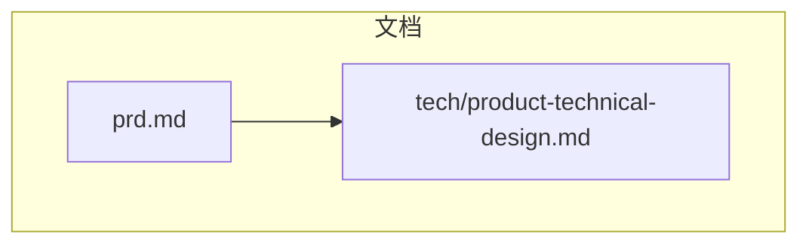
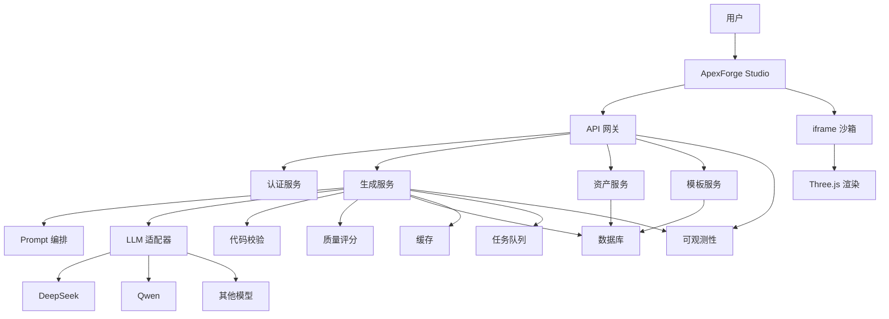
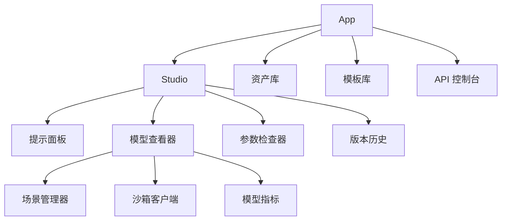
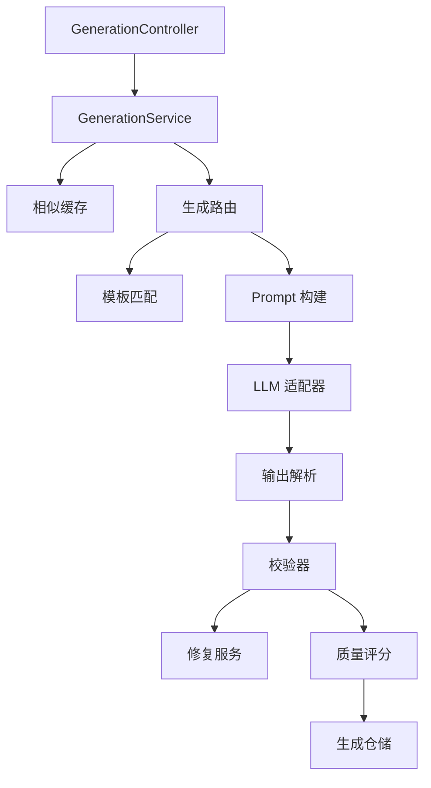
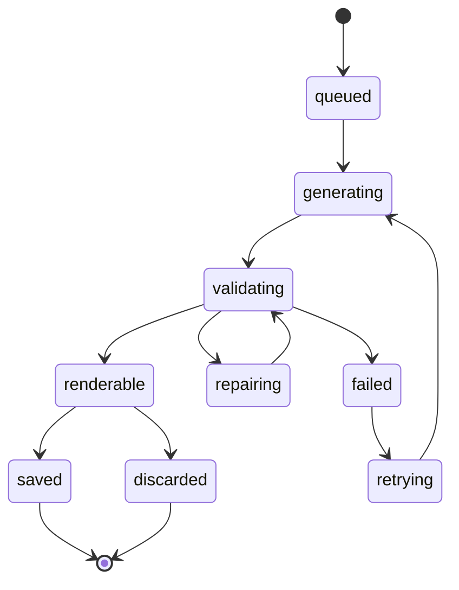
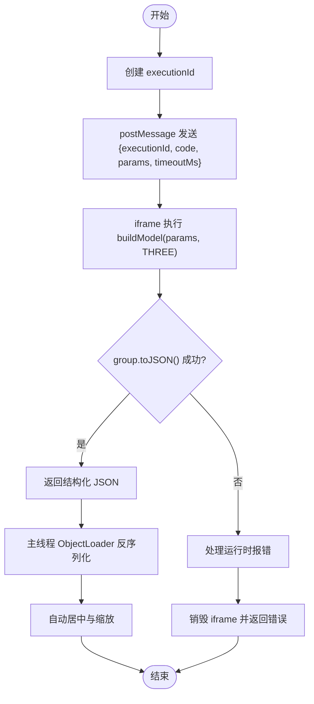
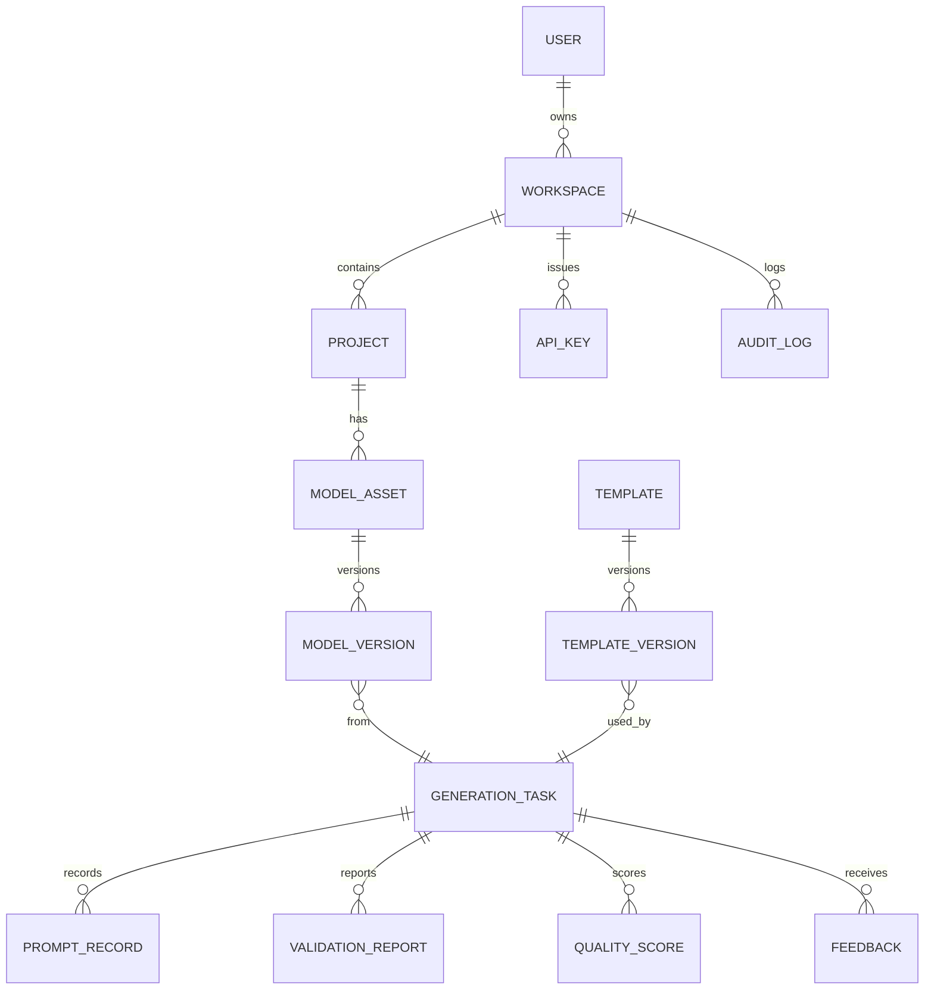
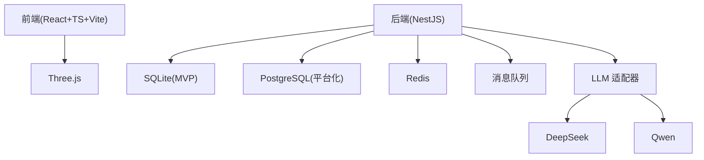

# 开发指南

<cite>
**本文引用的文件**   
- [prd.md](file://prd.md)
- [tech/product-technical-design.md](file://tech/product-technical-design.md)
</cite>

## 目录
1. [简介](#简介)
2. [项目结构](#项目结构)
3. [核心组件](#核心组件)
4. [架构总览](#架构总览)
5. [详细组件分析](#详细组件分析)
6. [依赖分析](#依赖分析)
7. [性能考虑](#性能考虑)
8. [故障排查指南](#故障排查指南)
9. [结论](#结论)
10. [附录](#附录)

## 简介
本指南面向新贡献者与维护者，提供 ApexForge 平台的完整开发说明。内容涵盖：
- 前端开发环境搭建（React + TypeScript + Vite）
- 后端开发环境配置（NestJS + SQLite/PostgreSQL）
- 数据库设计与迁移策略
- 代码风格与 Git 工作流
- 测试策略与质量保证流程
- 本地开发环境配置步骤（环境变量、依赖管理、启动脚本）
- 常见开发问题排查与性能调优建议
- 参与路径与最佳实践

平台目标是将自然语言描述转化为可交互的 Three.js 模型代码，并在浏览器端高性能渲染；服务端负责 AI 推理、安全校验与持久化。

章节来源
- [prd.md:1-168](file://prd.md#L1-L168)
- [tech/product-technical-design.md:1-120](file://tech/product-technical-design.md#L1-L120)

## 项目结构
当前仓库包含产品需求与技术设计文档，用于指导后续工程落地。MVP 阶段推荐采用“单体后端 + 模块化代码”的结构，便于快速迭代与部署。



图表来源
- [prd.md:1-168](file://prd.md#L1-L168)
- [tech/product-technical-design.md:1-120](file://tech/product-technical-design.md#L1-L120)

章节来源
- [prd.md:1-168](file://prd.md#L1-L168)
- [tech/product-technical-design.md:1-120](file://tech/product-technical-design.md#L1-L120)

## 核心组件
- 前端（ApexForge Studio）
  - 基于 React 18 + TypeScript + Vite 构建 SPA
  - 使用 Three.js 进行 3D 场景渲染与交互
  - 通过 iframe 沙箱执行 AI 生成的 JS 代码，确保主线程安全
- 后端（NestJS）
  - 提供 REST API 与 SSE/WebSocket 事件推送
  - 编排生成任务、Prompt 构建、LLM 调用、代码校验与质量评分
  - MVP 使用 SQLite，平台化演进至 PostgreSQL
- 模板库与参数化系统
  - 分层模板（骨架、风格变体、细节包、材质预设）
  - 支持 AI 选择模板并输出参数对象，提升稳定性与速度
- 代码安全与沙箱
  - 多层校验：协议校验、文本黑名单、AST 白名单、运行时隔离、超时销毁
  - iframe 完全隔离执行，CSP 限制资源加载

章节来源
- [prd.md:33-123](file://prd.md#L33-L123)
- [tech/product-technical-design.md:104-130](file://tech/product-technical-design.md#L104-L130)
- [tech/product-technical-design.md:428-518](file://tech/product-technical-design.md#L428-L518)
- [tech/product-technical-design.md:520-572](file://tech/product-technical-design.md#L520-L572)
- [tech/product-technical-design.md:574-630](file://tech/product-technical-design.md#L574-L630)

## 架构总览
下图展示逻辑架构与数据流向，包括前端、网关、服务层、LLM 适配器、校验器、存储与可观测性。



图表来源
- [tech/product-technical-design.md:38-62](file://tech/product-technical-design.md#L38-L62)

章节来源
- [tech/product-technical-design.md:34-101](file://tech/product-technical-design.md#L34-L101)

## 详细组件分析

### 前端模块与关键服务
- 模块划分
  - App、Studio、Asset Library、Template Library、API Console
  - Studio 内分 Prompt Panel、Model Viewer、Param Inspector、Version History
  - Model Viewer 集成 Scene Manager、Sandbox Client、Model Metrics
- 关键服务职责
  - ApiClient：REST/SSE/WebSocket 请求管理
  - GenerationStore：生成任务状态与结果管理
  - SceneManager：场景初始化、模型挂载、视角适配、截图与释放
  - SandboxClient：iframe 通信、超时控制、错误映射
  - ModelNormalizer：模型居中、缩放、复杂度统计
  - AssetStore / TemplateStore：资产与模板数据管理



图表来源
- [tech/product-technical-design.md:524-537](file://tech/product-technical-design.md#L524-L537)

章节来源
- [tech/product-technical-design.md:520-572](file://tech/product-technical-design.md#L520-L572)

### 后端模块与生成链路
- NestJS 模块划分
  - Auth、Workspace、Project、Generation、Prompt、Llm、Validation、Template、Asset、Feedback、Export、Billing、Observability
- Generation Service 内部结构
  - Controller -> Service -> Cache -> Router -> TemplateMatcher/PromptBuilder -> LlmAdapter -> OutputParser -> Validator -> RepairService -> QualityScorer -> Repository



图表来源
- [tech/product-technical-design.md:596-609](file://tech/product-technical-design.md#L596-L609)

章节来源
- [tech/product-technical-design.md:574-630](file://tech/product-technical-design.md#L574-L630)

### 生成时序与状态机
- 完整时序
  - 前端发起创建任务 -> 网关鉴权限流 -> 生成服务编排 -> 缓存命中或 LLM 生成 -> 校验与评分 -> 持久化 -> 返回结果 -> 前端在 iframe 中执行并渲染
- 状态机
  - queued -> generating -> validating -> renderable/saved/discarded/failed/repairing/retrying

```mermaid
sequenceDiagram
participant FE as "前端"
participant API as "API 网关"
participant GEN as "生成服务"
participant CACHE as "缓存"
participant TPL as "模板服务"
participant LLM as "LLM 适配器"
participant VAL as "校验器"
participant DB as "数据库"
participant BOX as "沙箱"
FE->>API : "POST /api/v1/generations"
API->>GEN : "createGenerationTask"
GEN->>CACHE : "querySimilarPrompt"
alt "缓存命中"
CACHE-->>GEN : "缓存结果"
else "缓存未命中"
GEN->>TPL : "findCandidateTemplate"
TPL-->>GEN : "候选模板"
GEN->>LLM : "generate code or params"
LLM-->>GEN : "生成输出"
GEN->>VAL : "validate output"
VAL-->>GEN : "校验报告"
end
GEN->>DB : "持久化任务与结果"
GEN-->>API : "结果"
API-->>FE : "生成载荷"
FE->>BOX : "在 iframe 中执行"
BOX-->>FE : "模型 JSON 或错误"
```

图表来源
- [tech/product-technical-design.md:361-390](file://tech/product-technical-design.md#L361-L390)



图表来源
- [tech/product-technical-design.md:342-357](file://tech/product-technical-design.md#L342-L357)

章节来源
- [tech/product-technical-design.md:327-390](file://tech/product-technical-design.md#L327-L390)

### 代码安全与沙箱执行
- 多层校验
  - 输出协议校验、文本黑名单、AST 白名单、运行时沙箱、超时销毁、结果校验
- iframe 配置
  - sandbox="allow-scripts"、CSP 限制、每次执行带 executionId、超时销毁
- 执行流程
  - 主页面发送 execute -> iframe 包装并执行 buildModel(params, THREE) -> group.toJSON() -> 主页面 ObjectLoader 反序列化 -> 自动居中缩放 -> 异常则销毁并返回错误



图表来源
- [tech/product-technical-design.md:478-506](file://tech/product-technical-design.md#L478-L506)

章节来源
- [tech/product-technical-design.md:428-518](file://tech/product-technical-design.md#L428-L518)

### 数据模型与关系
- 领域对象
  - User、Workspace、Project、GenerationTask、ModelAsset、ModelVersion、Template、TemplateVersion、PromptRecord、ValidationReport、QualityScore、Feedback、ApiKey、AuditLog
- 核心关系
  - Workspace 下包含 Project，Project 关联 ModelAsset，ModelAsset 有 ModelVersion，ModelVersion 来源于 GenerationTask，GenerationTask 关联 PromptRecord、ValidationReport、QualityScore、Feedback；Template 与 TemplateVersion 被 GenerationTask 引用；Workspace 关联 ApiKey 与 AuditLog



图表来源
- [tech/product-technical-design.md:155-170](file://tech/product-technical-design.md#L155-L170)

章节来源
- [tech/product-technical-design.md:132-170](file://tech/product-technical-design.md#L132-L170)

## 依赖分析
- 技术栈依赖
  - 前端：React 18、TypeScript、Vite、Three.js、Tailwind/Radix/Ant Design
  - 后端：NestJS、SQLite（MVP）、PostgreSQL（平台化）、Redis（缓存）、BullMQ/RabbitMQ/Kafka（队列）、OpenTelemetry（可观测）
  - LLM：DeepSeek、Qwen 等多供应商适配
- 演进策略
  - MVP 使用 SQLite，平台化迁移到 PostgreSQL
  - 统一 ORM 抽象，避免方言差异
  - 所有 ID 使用 UUID/CUID，避免自增依赖



图表来源
- [tech/product-technical-design.md:104-130](file://tech/product-technical-design.md#L104-L130)

章节来源
- [tech/product-technical-design.md:104-130](file://tech/product-technical-design.md#L104-L130)

## 性能考虑
- 前端优化
  - 动态加载 Three.js 与沙箱 runtime，降低首屏体积
  - 模型 JSON 解析放入 Worker，主线程仅做渲染挂载
  - 重复几何体优先 InstancedMesh
  - 加载前统计复杂度，超限提示降级
  - 释放旧模型时遍历 dispose geometry/material/texture
  - requestAnimationFrame 控制渲染循环，不可见页暂停
- 服务端优化
  - 相似 Prompt 缓存直接复用
  - 模板模式参数化生成仅需 10～50ms，避免 LLM 调用
- 网络优化
  - CDN 静态资源缓存、Gzip/Brotli 压缩、增量更新

章节来源
- [tech/product-technical-design.md:563-572](file://tech/product-technical-design.md#L563-L572)
- [prd.md:155-168](file://prd.md#L155-L168)

## 故障排查指南
- 常见问题定位
  - 生成失败：检查 traceId、错误码与错误信息，确认校验报告与质量评分详情
  - 沙箱执行异常：关注 SANDBOX_TIMEOUT、SANDBOX_RUNTIME_ERROR、MODEL_JSON_INVALID、MODEL_TOO_COMPLEX、MODEL_EMPTY
  - 性能问题：监控模型复杂度、顶点数、材质数量，必要时切换模板模式或启用 LOD
- 调试技巧
  - 前端：打开控制台日志与网络面板，观察 SSE/WebSocket 事件流
  - 后端：开启 Pino/OpenTelemetry 追踪，记录 LLM 调用耗时与 token 用量
  - 数据库：检查任务状态流转与持久化完整性
- 恢复策略
  - 自动重试（最多 2 次），失败记录审计日志
  - 模板回退与 Prompt 版本回滚

章节来源
- [tech/product-technical-design.md:508-518](file://tech/product-technical-design.md#L508-L518)
- [tech/product-technical-design.md:632-757](file://tech/product-technical-design.md#L632-L757)

## 结论
本指南为 ApexForge 的开发与贡献提供了从环境搭建、架构理解、组件分析到性能与排障的全景视图。遵循模板优先与安全优先原则，结合渐进式演进策略，可在保证稳定性的同时持续提升生成质量与用户体验。

## 附录

### 贡献代码规范
- 命名与类型
  - 使用 TypeScript 严格模式，明确接口与类型定义
  - 变量与函数使用小驼峰，类名使用大驼峰
- 提交规范
  - 使用约定式提交（feat/fix/docs/chore/test/refactor/build/ci/perf）
  - 提交信息简洁明了，关联 Issue 编号
- 代码审查
  - 至少一名维护者审查通过后合并
  - 关注安全性（AST 白名单、黑名单、CSP）与性能（复杂度阈值）

### 开发环境配置
- 前置要求
  - Node.js LTS、pnpm/yarn/npm 任一包管理器
  - 可选：PostgreSQL（平台化）、Redis、消息队列
- 前端环境
  - 安装依赖后启动开发服务器（Vite）
  - 配置代理指向后端 API
- 后端环境
  - 配置 SQLite 或 PostgreSQL 连接
  - 设置 LLM Provider 密钥与环境变量
  - 启动 NestJS 应用与服务监听端口
- 环境变量
  - 数据库连接串、缓存地址、队列配置、LLM 密钥、CORS 与限流策略

### 数据库设计与迁移策略
- 设计要点
  - 使用 UUID/CUID 作为主键，避免 SQLite 自增依赖
  - JSON 字段在 SQLite 以 TEXT 存储，PostgreSQL 使用 JSONB
  - 通过 ORM 抽象访问层，屏蔽方言差异
- 迁移策略
  - Beta 阶段提供迁移脚本，将历史数据导入 PostgreSQL
  - 保留版本化能力，支持回滚与对比

### 测试策略与质量保证
- 单元测试与集成测试
  - 覆盖生成路由、校验器、模板渲染、沙箱客户端
- 端到端测试
  - 模拟完整生成流程，验证状态机与事件推送
- 质量门禁
  - 代码覆盖率阈值、AST 复杂度阈值、安全扫描

### 发布流程
- 分支策略
  - main 保护分支，develop 集成分支，feature/* 功能分支
- 构建与部署
  - 前端静态资源 CDN 分发
  - 后端容器化部署，灰度发布与回滚策略
- 监控与告警
  - OpenTelemetry 全链路追踪，Prometheus/Grafana 指标看板

### 常见开发问题排查
- 无法连接数据库
  - 检查连接串、权限与防火墙规则
- LLM 调用失败
  - 核对密钥、配额与网络连通性，启用降级与重试
- 沙箱执行超时
  - 降低模型复杂度，启用模板模式或 LOD

### 新贡献者参与路径
- 阅读产品需求与技术设计文档，理解业务目标与架构
- 从 issue 标签为 good first issue 的任务入手
- 遵循代码规范与提交流程，主动参与评审与讨论