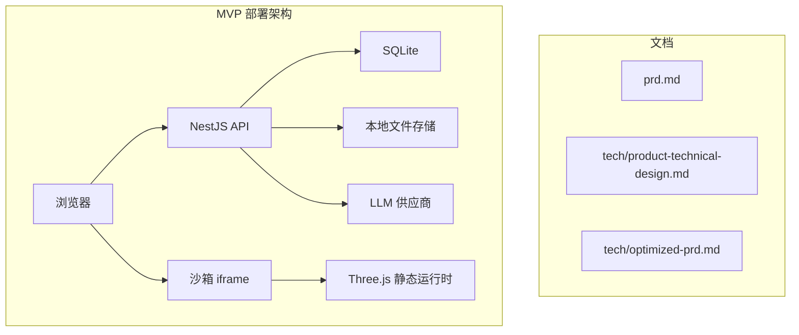
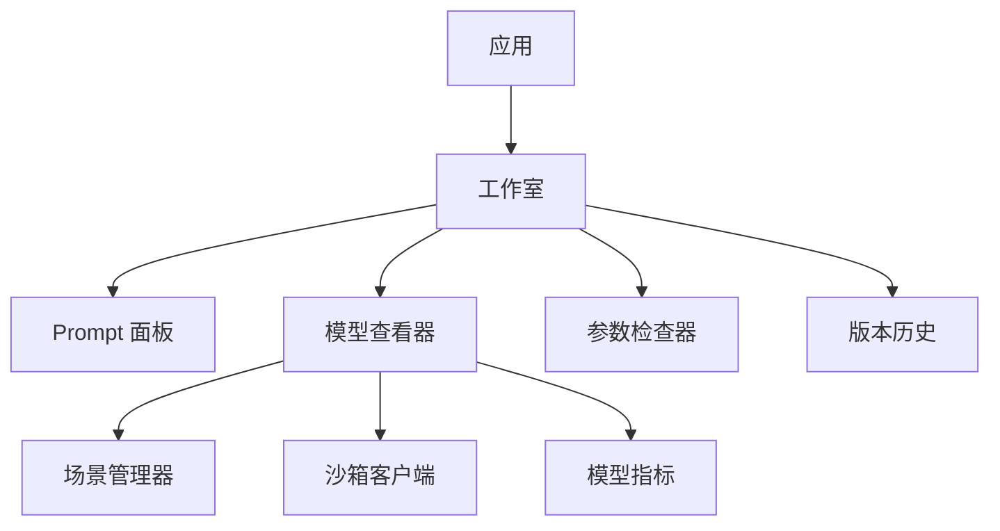
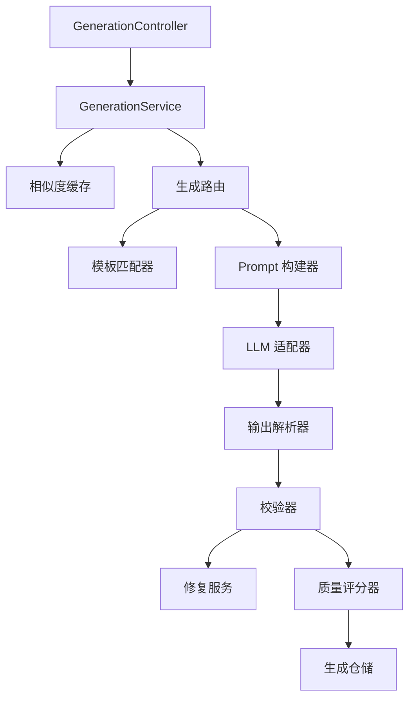
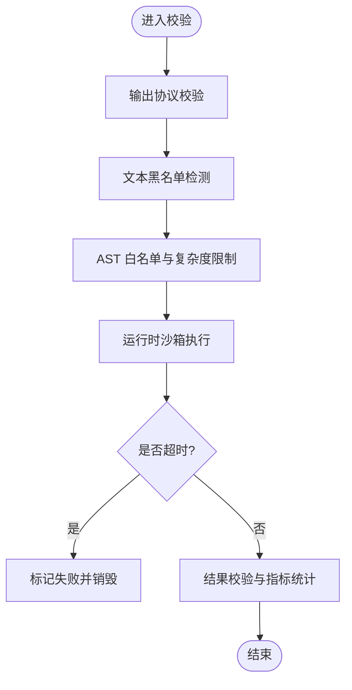
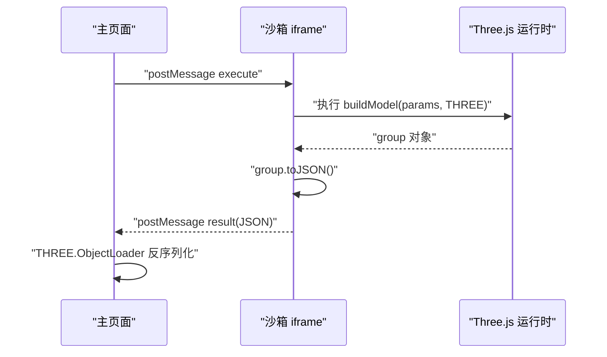
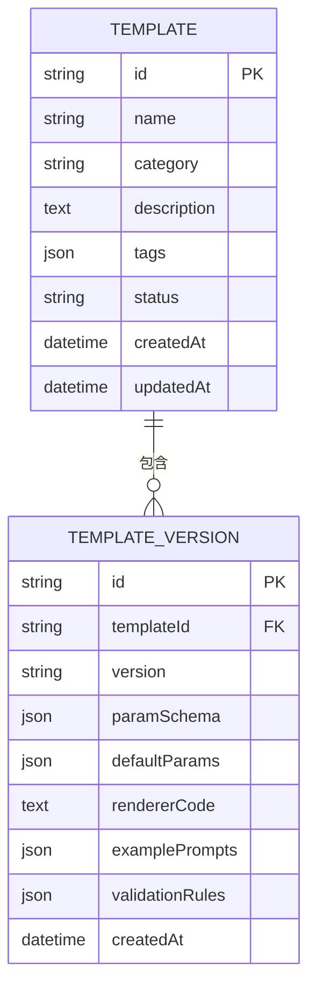
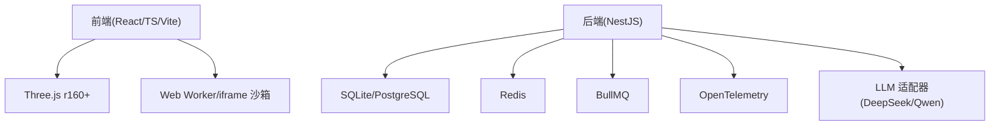

# 快速开始

<cite>
**本文引用的文件**   
- [prd.md](file://prd.md)
- [product-technical-design.md](file://tech/product-technical-design.md)
- [optimized-prd.md](file://tech/optimized-prd.md)
</cite>

## 目录
1. [简介](#简介)
2. [项目结构](#项目结构)
3. [核心组件](#核心组件)
4. [架构总览](#架构总览)
5. [详细组件分析](#详细组件分析)
6. [依赖分析](#依赖分析)
7. [性能考虑](#性能考虑)
8. [故障排除指南](#故障排除指南)
9. [结论](#结论)
10. [附录](#附录)

## 简介
ApexForge 是一个基于 Web 的实时 3D 模型生成与展示平台，核心能力是将用户的自然语言描述转化为可交互的 Three.js 程序化代码，并在浏览器端高性能渲染。平台采用“固定 HTML 渲染框架 + AI 动态生成 JS 模型代码”的技术范式，强调零后端 3D 计算、代码即模型与企业级安全与稳定。

本快速开始指南面向新用户，帮助你在最短时间内完成从环境准备到第一个 3D 模型生成的完整闭环体验，涵盖基础概念（程序化建模、Three.js 基础、AI 提示工程）、安装与运行步骤、常见问题排查等。

## 项目结构
当前仓库包含产品需求与技术设计文档，用于指导后续前端、后端与 AI 服务的落地实现。MVP 阶段建议采用单体后端加模块化代码结构，降低工程复杂度；平台化阶段再演进为服务化架构。



图表来源
- [product-technical-design.md:64-76](file://tech/product-technical-design.md#L64-L76)

章节来源
- [prd.md:1-168](file://prd.md#L1-L168)
- [product-technical-design.md:1-120](file://tech/product-technical-design.md#L1-L120)
- [optimized-prd.md:1-120](file://tech/optimized-prd.md#L1-L120)

## 核心组件
- 前端（ApexForge Studio）：React SPA + Three.js 渲染引擎，负责交互、渲染与执行生成的 JS 代码。
- 后端（NestJS）：提供 API 网关、鉴权、限流、任务编排与结果持久化。
- AI 生成服务：构建 Prompt，调用大语言模型（如 deepseek、千问），对返回代码进行安全过滤后持久化。
- 模板库：存储经过人工验证的高质量程序化模板，支持参数化变体与版本管理。
- 代码执行沙箱：基于 iframe 隔离执行 AI 代码，确保主线程安全与稳定性。

章节来源
- [prd.md:33-123](file://prd.md#L33-L123)
- [product-technical-design.md:34-101](file://tech/product-technical-design.md#L34-L101)
- [optimized-prd.md:83-108](file://tech/optimized-prd.md#L83-L108)

## 架构总览
下图展示了从用户输入到 3D 模型渲染的端到端流程，包括缓存命中、模板匹配、LLM 生成、安全校验、结果持久化与前端沙箱执行。

```mermaid
sequenceDiagram
participant FE as "前端"
participant API as "API 网关"
participant GEN as "生成服务"
participant CACHE as "缓存"
participant TPL as "模板服务"
participant LLM as "LLM 适配器"
participant VAL as "校验器"
participant DB as "数据库"
participant BOX as "沙箱 iframe"
FE->>API : "POST /api/v1/generations"
API->>GEN : "创建生成任务"
GEN->>CACHE : "查询相似 Prompt"
alt "缓存命中"
CACHE-->>GEN : "返回缓存结果"
else "缓存未命中"
GEN->>TPL : "查找候选模板"
TPL-->>GEN : "返回候选模板"
GEN->>LLM : "生成代码或参数"
LLM-->>GEN : "返回输出"
GEN->>VAL : "安全校验"
VAL-->>GEN : "校验报告"
end
GEN->>DB : "持久化任务与结果"
GEN-->>API : "返回结果"
API-->>FE : "生成载荷"
FE->>BOX : "在 iframe 中执行"
BOX-->>FE : "模型 JSON 或错误"
```

图表来源
- [product-technical-design.md:361-390](file://tech/product-technical-design.md#L361-L390)

章节来源
- [product-technical-design.md:327-390](file://tech/product-technical-design.md#L327-L390)

## 详细组件分析

### 前端模块与 SceneManager
- 模块划分：Studio、Asset Library、Template Library、API Console。
- 关键服务：ApiClient、GenerationStore、SceneManager、SandboxClient、ModelNormalizer、AssetStore、TemplateStore。
- SceneManager 对外能力：初始化场景、加载模型、清空模型、适配视角、切换背景、截图、释放资源。



图表来源
- [product-technical-design.md:524-537](file://tech/product-technical-design.md#L524-L537)

章节来源
- [product-technical-design.md:520-571](file://tech/product-technical-design.md#L520-L571)

### 后端模块与 Generation Service
- NestJS 模块：Auth、Workspace、Project、Generation、Prompt、Llm、Validation、Template、Asset、Feedback、Export、Billing、Observability。
- Generation Service 内部结构：控制器、路由、缓存、模板匹配、Prompt 构建、LLM 适配器、输出解析、校验、修复、质量评分、仓储。



图表来源
- [product-technical-design.md:596-609](file://tech/product-technical-design.md#L596-L609)

章节来源
- [product-technical-design.md:574-630](file://tech/product-technical-design.md#L574-L630)

### 代码安全校验与 AST 白名单
- 校验分层：输出协议校验、文本黑名单、AST 校验、运行时沙箱、超时销毁、结果校验。
- 黑名单 API：动态执行、网络访问、DOM 访问、动态加载、原型污染、计算风险。
- AST 白名单策略：允许语法、限制策略（长度、深度、循环层数、Mesh 数量、顶点估算、全局变量）。



图表来源
- [product-technical-design.md:428-470](file://tech/product-technical-design.md#L428-L470)

章节来源
- [product-technical-design.md:428-470](file://tech/product-technical-design.md#L428-L470)

### 沙箱运行时设计与错误分类
- iframe 隔离方案：隐藏或可控 iframe 执行 AI 代码，仅暴露受限 API。
- 执行流程：主页面发送执行指令，iframe 包装并执行 buildModel，序列化 group.toJSON，主页面反序列化并居中缩放。
- 错误分类：超时、运行时报错、模型 JSON 非法、模型过于复杂、未生成有效对象。



图表来源
- [product-technical-design.md:478-506](file://tech/product-technical-design.md#L478-L506)

章节来源
- [product-technical-design.md:472-518](file://tech/product-technical-design.md#L472-L518)

### 模板系统与参数化生成
- 模板结构：templateId、version、category、paramSchema、defaultParams、renderer。
- 模板分层：Skeleton、Style Variant、Detail Pack、Material Preset、Param Schema。
- 模板匹配策略：类别识别、关键词抽取、标签与向量检索候选模板。



图表来源
- [product-technical-design.md:270-296](file://tech/product-technical-design.md#L270-L296)

章节来源
- [product-technical-design.md:760-800](file://tech/product-technical-design.md#L760-L800)

## 依赖分析
- 前端依赖：React 18、TypeScript、Vite、Three.js r160+、Web Worker/iframe 沙箱。
- 后端依赖：NestJS、SQLite（MVP）、PostgreSQL（平台化）、Redis（缓存）、BullMQ（队列）、OpenTelemetry（可观测性）。
- AI 依赖：DeepSeek、Qwen 等多供应商适配器，统一接口与选择策略。



图表来源
- [product-technical-design.md:104-129](file://tech/product-technical-design.md#L104-L129)

章节来源
- [product-technical-design.md:104-129](file://tech/product-technical-design.md#L104-L129)

## 性能考虑
- 前端：几何体实例化与 LOD、Worker 反序列化、InstancedMesh 批量渲染、首屏动态加载、requestAnimationFrame 控制。
- 服务端：相似 Prompt 缓存、模板模式参数化生成、CDN 与压缩、增量更新。
- 目标指标：普通生成耗时 P80 小于 30 秒（MVP），模板生成耗时 P80 小于 5 秒（MVP），渲染帧率大于 45 FPS（MVP）。

章节来源
- [product-technical-design.md:155-165](file://tech/product-technical-design.md#L155-L165)
- [optimized-prd.md:248-280](file://tech/optimized-prd.md#L248-L280)

## 故障排除指南
- 常见错误码与处理：
  - SANDBOX_TIMEOUT：执行超时，终止渲染，建议降低细节或使用模板模式。
  - SANDBOX_RUNTIME_ERROR：运行时报错，可重试或调整 Prompt。
  - MODEL_JSON_INVALID：返回结构非法，系统将重新生成。
  - MODEL_TOO_COMPLEX：模型复杂度超限，请降低细节或使用模板模式。
  - MODEL_EMPTY：未生成有效对象，补充模型主体描述。
- 调试建议：
  - 查看生成任务的 traceId 与状态流转。
  - 检查校验报告中的阻断原因与警告信息。
  - 确认 iframe CSP 配置与 sandbox 权限。
  - 监控 LLM 调用耗时与错误码，必要时切换供应商或降级模板模式。

章节来源
- [product-technical-design.md:508-518](file://tech/product-technical-design.md#L508-L518)
- [product-technical-design.md:632-757](file://tech/product-technical-design.md#L632-L757)

## 结论
通过本快速开始指南，你已了解 ApexForge 的核心概念、架构与关键组件，并掌握了从自然语言输入到 3D 模型渲染的完整闭环。建议在 MVP 阶段优先走“模板加代码生成”的混合路线，强化安全与质量保障，逐步扩展模板库与协作能力，最终形成平台化与生态化。

## 附录

### 环境准备要求
- Node.js：建议使用 LTS 版本（例如 v18 或更高）。
- npm/yarn：任选其一，用于依赖管理与脚本执行。
- 浏览器兼容性：现代桌面浏览器（Chrome、Edge、Firefox、Safari），需支持 WebGL 与 iframe sandbox。
- 可选：本地 SQLite 与 Redis（用于缓存与任务状态），生产环境推荐 PostgreSQL。

章节来源
- [product-technical-design.md:104-129](file://tech/product-technical-design.md#L104-L129)
- [optimized-prd.md:248-280](file://tech/optimized-prd.md#L248-L280)

### 项目克隆与安装步骤
- 克隆仓库：
  - git clone https://github.com/ApexForge/ApexForge.git
  - cd ApexForge
- 安装依赖：
  - npm install 或 yarn install
- 启动开发服务器（示例命令，具体以实际脚本为准）：
  - npm run dev 或 yarn dev
- 访问地址：
  - http://localhost:3000（默认端口，可在配置中修改）

说明：以上命令为通用示例，若仓库中包含 package.json 与 scripts，请以实际定义为准。

章节来源
- [optimized-prd.md:83-108](file://tech/optimized-prd.md#L83-L108)

### 第一个 3D 模型生成的完整流程演示
- 打开 ApexForge Studio，进入“生成工作台”。
- 输入自然语言描述，例如：“生成一辆未来感跑车，黑色车身，蓝色灯带”。
- 点击“生成”，系统创建任务并通过 SSE/WebSocket 推送状态。
- 等待生成完成，前端将代码交给 iframe 沙箱执行，返回模型 JSON。
- 使用 SceneManager 加载模型，自动居中与缩放，即可旋转、缩放、重置视角。
- 如需二次编辑，继续输入微调描述，系统将保留上下文并生成新版本。

章节来源
- [prd.md:126-140](file://prd.md#L126-L140)
- [product-technical-design.md:361-390](file://tech/product-technical-design.md#L361-L390)

### 基础概念介绍
- 程序化建模：通过代码与参数控制几何体组合与材质，实现可复用与可编辑的 3D 资产。
- Three.js 基础：理解 Scene、Camera、Renderer、OrbitControls、Object3D、Geometry、Material 等核心概念。
- AI 提示工程：设计 System Prompt、Few-shot 示例与约束条件，提升生成代码的质量与稳定性。

章节来源
- [prd.md:13-31](file://prd.md#L13-L31)
- [product-technical-design.md:392-425](file://tech/product-technical-design.md#L392-L425)

### API 参考（常用接口）
- 创建生成任务：POST /api/v1/generations
- 查询生成任务：GET /api/v1/generations/{taskId}
- 保存为资产：POST /api/v1/assets
- 查询资产版本：GET /api/v1/assets/{assetId}/versions
- 模板接口：
  - GET /api/v1/templates
  - GET /api/v1/templates/{id}
  - POST /api/v1/templates/{id}/render
  - POST /api/v1/templates
  - POST /api/v1/templates/{id}/versions
- SSE 事件：GET /api/v1/generations/{taskId}/events

章节来源
- [product-technical-design.md:632-757](file://tech/product-technical-design.md#L632-L757)

### 配置说明（示例）
- 环境变量（示例键名，具体以实际实现为准）：
  - NODE_ENV=development
  - DATABASE_URL=sqlite://./apexforge.db（MVP）
  - REDIS_URL=redis://localhost:6379
  - LLM_PROVIDER=deepseek 或 qwen
  - LLM_API_KEY=你的密钥
  - CORS_ORIGIN=http://localhost:3000
- 前端配置：
  - VITE_API_BASE_URL=/api/v1
  - VITE_SANDBOX_IFRAME_SRC=/sandbox.html
  - VITE_THREE_CDN=https://cdn.example.com/three.min.js

说明：上述键名为通用示例，实际配置请参考项目配置文件与环境变量清单。

章节来源
- [product-technical-design.md:104-129](file://tech/product-technical-design.md#L104-L129)