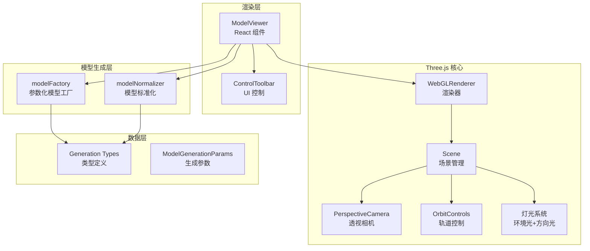
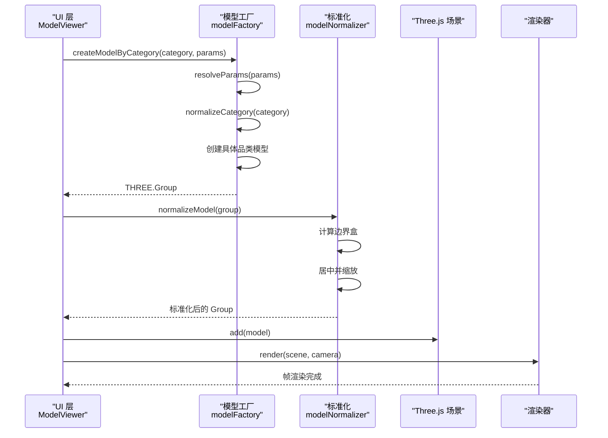
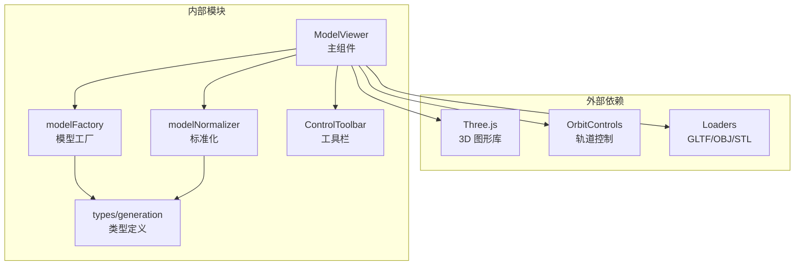

# 3D 渲染系统

<cite>
**本文引用的文件**   
- [ModelViewer.tsx](file://src/modules/viewer/components/ModelViewer.tsx)
- [modelFactory.ts](file://src/modules/viewer/utils/modelFactory.ts)
- [modelNormalizer.ts](file://src/modules/viewer/utils/modelNormalizer.ts)
- [ControlToolbar.tsx](file://src/modules/viewer/components/ControlToolbar.tsx)
- [generation.ts](file://src/shared/types/generation.ts)
</cite>

## 更新摘要
**变更内容**   
- 新增完整的 Three.js 3D 渲染引擎实现
- 添加参数化模型工厂系统，支持多种产品类别的自动生成
- 实现高级材质系统和纹理管理
- 集成模型标准化处理流程
- 构建复杂几何体生成能力
- 完善渲染管线和性能优化

## 目录
1. [简介](#简介)
2. [项目结构](#项目结构)
3. [核心组件](#核心组件)
4. [架构总览](#架构总览)
5. [详细组件分析](#详细组件分析)
6. [依赖关系分析](#依赖关系分析)
7. [性能与内存管理](#性能与内存管理)
8. [故障排查指南](#故障排查指南)
9. [结论](#结论)
10. [附录：配置、参数与返回约定](#附录配置参数与返回约定)

## 简介
ApexForge 的 3D 渲染系统是一个基于 Three.js 的完整渲染引擎，实现了从参数化模型生成到高质量渲染的全流程解决方案。系统采用 React + TypeScript 技术栈，提供灵活的模型工厂、先进的材质系统、智能的几何体生成和优化的渲染管线。通过参数化设计，系统能够根据输入参数动态生成各种类型的 3D 模型，包括车辆、建筑、家具、珠宝等多种品类。

## 项目结构
当前实现采用模块化架构，主要包含以下核心模块：

**章节来源**
- [ModelViewer.tsx:1-307](file://src/modules/viewer/components/ModelViewer.tsx#L1-L307)
- [modelFactory.ts:1-1467](file://src/modules/viewer/utils/modelFactory.ts#L1-L1467)
- [modelNormalizer.ts:1-17](file://src/modules/viewer/utils/modelNormalizer.ts#L1-L17)

## 核心组件

### ModelViewer 组件
ModelViewer 是整个渲染系统的核心 React 组件，负责 Three.js 场景的初始化和生命周期管理。

**主要功能：**
- WebGL 渲染器初始化与配置
- 场景、相机、控制器设置
- 多光源照明系统
- 模型加载与渲染循环
- 响应式窗口适配
- 资源清理与内存管理

### 参数化模型工厂 (modelFactory)
强大的模型生成引擎，支持多种产品类别的参数化建模：

**支持的品类：**
- vehicle（车辆）- 跑车、越野车等
- architecture（建筑）- 现代建筑、塔楼等  
- furniture（家具）- 椅子、沙发等
- jewelry（珠宝）- 项链、手镯等
- watch（手表）- 机械表、智能表等
- aircraft（飞行器）- 无人机、飞机等
- 以及多种产品模型：收音机、镜子、耳机、相机、鞋子、包等

### 模型标准化处理 (modelNormalizer)
确保生成的模型具有统一的坐标系统和尺寸比例：
- 自动居中 XZ 平面
- 底部贴地对齐 Y=0
- 统一缩放比例
- 边界盒计算

**章节来源**
- [ModelViewer.tsx:82-307](file://src/modules/viewer/components/ModelViewer.tsx#L82-L307)
- [modelFactory.ts:404-446](file://src/modules/viewer/utils/modelFactory.ts#L404-L446)
- [modelNormalizer.ts:3-16](file://src/modules/viewer/utils/modelNormalizer.ts#L3-L16)

## 架构总览
系统采用分层架构设计，从 UI 层到渲染层逐层抽象：

**图表来源**
- [ModelViewer.tsx:201-243](file://src/modules/viewer/components/ModelViewer.tsx#L201-L243)
- [modelFactory.ts:404-446](file://src/modules/viewer/utils/modelFactory.ts#L404-L446)
- [modelNormalizer.ts:3-16](file://src/modules/viewer/utils/modelNormalizer.ts#L3-L16)

## 详细组件分析

### 高级材质系统
系统实现了基于 MeshPhysicalMaterial 的高级材质系统，支持多种预设材质：

**材质预设：**
- `matte-polymer` - 哑光聚合物，低金属度，高粗糙度
- `brushed-metal` - 拉丝金属，中等金属度和粗糙度
- `anodized-metal` - 阳极氧化金属，高金属度，低粗糙度
- `ceramic` - 陶瓷材质，低金属度，中等粗糙度
- `carbon-fiber` - 碳纤维，中等金属度，中高粗糙度
- `glass` - 玻璃材质，极低金属度，极低粗糙度，半透明

**材质特性：**
- 支持清漆涂层 (clearcoat)
- 环境贴图强度控制
- 透明度支持
- 纹理映射集成
- 各向异性过滤

**章节来源**
- [modelFactory.ts:43-66](file://src/modules/viewer/utils/modelFactory.ts#L43-L66)

### 复杂几何体生成
系统提供了丰富的基础几何体构建函数：

**基础几何体：**
- `box()` - 带圆角的盒子，支持自定义半径
- `cylinder()` - 圆柱体，可配置分段数
- `sphere()` - 球体，支持不同分段精度
- `torus()` - 环形体，径向和管状分段可调

**高级几何体：**
- `createRoundedBoxGeometry()` - 使用 Shape 和 ExtrudeGeometry 创建圆角盒子
- `connectorBetween()` - 在两点间创建连接杆件
- `addSymmetricBox()` - 对称添加盒子元素

**几何体优化：**
- 自适应分段数控制
- 最小尺寸保护机制
- 圆角半径安全限制
- 性能友好的默认值

**章节来源**
- [modelFactory.ts:103-163](file://src/modules/viewer/utils/modelFactory.ts#L103-L163)

### 品类专属模型生成
每个品类都有专门的生成函数，体现该品类的典型特征：

**车辆模型 (vehicle)：**
- 单体壳车身结构
- 低座舱设计
- 前后扰流板
- 轮毂和悬挂系统
- 进气口和散热格栅

**建筑模型 (architecture)：**
- 多层结构设计
- 玻璃幕墙效果
- 结构框架
- 装饰性鳍片
- 顶部冠冕

**家具模型 (furniture)：**
- 座椅主体
- 靠背和头枕
- 金属框架
- 软垫细节
- 缝线装饰

**章节来源**
- [modelFactory.ts:466-594](file://src/modules/viewer/utils/modelFactory.ts#L466-L594)
- [modelFactory.ts:596-642](file://src/modules/viewer/utils/modelFactory.ts#L596-L642)
- [modelFactory.ts:698-744](file://src/modules/viewer/utils/modelFactory.ts#L698-L744)

### 连续性和技能增强
系统提供模型结构的连续性增强和技能标记功能：

**连续性增强：**
- 局部网格连接器网络
- 脊柱和桥梁结构
- 关节平滑处理
- 品类特定的连接策略

**技能增强：**
- 检查底座平台
- 导轨和标记点
- 技能标签显示
- 可视化质量评估

**章节来源**
- [modelFactory.ts:267-368](file://src/modules/viewer/utils/modelFactory.ts#L267-L368)

### 纹理系统
支持动态纹理加载和应用：

**纹理管理：**
- 纹理缓存机制
- 重复模式控制
- 强度调节
- 颜色空间处理

**应用方式：**
- 材质纹理映射
- 各向异性过滤
- 重复平铺
- 动态强度调整

**章节来源**
- [modelFactory.ts:22-41](file://src/modules/viewer/utils/modelFactory.ts#L22-L41)

## 依赖关系分析
系统采用清晰的依赖层次结构：

**图表来源**
- [ModelViewer.tsx:1-10](file://src/modules/viewer/components/ModelViewer.tsx#L1-L10)
- [modelFactory.ts:1-2](file://src/modules/viewer/utils/modelFactory.ts#L1-L2)

**章节来源**
- [ModelViewer.tsx:1-10](file://src/modules/viewer/components/ModelViewer.tsx#L1-L10)
- [modelFactory.ts:1-2](file://src/modules/viewer/utils/modelFactory.ts#L1-L2)

## 性能与内存管理
系统实现了全面的性能优化策略：

### 渲染优化
- **像素比控制**：限制最大像素比为 2，平衡清晰度与性能
- **阴影优化**：使用 PCFSoftShadowMap，2048×2048 阴影贴图
- **色调映射**：ACES Filmic Tone Mapping，专业级色彩表现
- **抗锯齿**：启用抗锯齿提升画面质量

### 内存管理
- **资源释放**：组件卸载时正确释放 geometry、material、texture
- **纹理缓存**：避免重复加载相同纹理
- **对象池**：复用常用几何体和材质实例
- **垃圾回收**：及时清理不再使用的对象引用

### 几何体优化
- **分段数控制**：根据距离和重要性调整几何体复杂度
- **合并策略**：相近几何体合并减少 draw call
- **LOD 支持**：远距离物体使用简化版本
- **实例化渲染**：重复元素使用 InstancedMesh

**章节来源**
- [ModelViewer.tsx:107-115](file://src/modules/viewer/components/ModelViewer.tsx#L107-L115)
- [modelFactory.ts:448-464](file://src/modules/viewer/utils/modelFactory.ts#L448-L464)

## 故障排查指南

### 常见问题及解决方案

**渲染问题：**
- **黑屏或空白**：检查 WebGL 上下文是否成功创建，确认 canvas 尺寸正常
- **模型不显示**：验证模型是否正确添加到场景，检查相机位置和视锥体
- **材质异常**：确认材质属性设置正确，检查纹理路径和格式

**性能问题：**
- **帧率过低**：降低几何体复杂度，减少阴影计算，优化纹理大小
- **内存泄漏**：确保组件卸载时正确释放所有 Three.js 资源
- **卡顿现象**：检查渲染循环，避免在主线程执行耗时操作

**模型生成问题：**
- **模型变形**：检查参数范围限制，验证归一化处理逻辑
- **材质错误**：确认材质预设名称正确，检查纹理加载状态
- **几何体异常**：验证几何体参数合理性，检查边界条件处理

### 调试建议
- 使用浏览器开发者工具的 Performance 面板分析渲染性能
- 利用 Three.js Inspector 插件检查场景结构和资源使用情况
- 添加详细的日志输出跟踪模型生成过程
- 监控 WebGL 状态和内存占用变化

**章节来源**
- [ModelViewer.tsx:187-199](file://src/modules/viewer/components/ModelViewer.tsx#L187-L199)
- [modelFactory.ts:448-464](file://src/modules/viewer/utils/modelFactory.ts#L448-L464)

## 结论
ApexForge 的 3D 渲染系统是一个功能完整、性能优秀的 Three.js 集成方案。通过参数化模型工厂、高级材质系统、智能几何体生成和完善的渲染管线，系统能够实现高质量的 3D 模型展示。系统的模块化设计和良好的性能优化策略确保了在各种设备上的稳定运行。未来可以在 WebXR、光线追踪和云渲染等方面进一步扩展功能。

## 附录：配置、参数与返回约定

### 模型生成参数 (ModelGenerationParams)

**基础外观参数：**
- `bodyColor`: 主体颜色，默认 '#f5f5f5'
- `accentColor`: 强调色，默认 '#111111'  
- `secondaryColor`: 次要颜色，默认 '#8a8a8a'
- `scale`: 整体缩放比例，范围 0.7-1.4，默认 1

**复杂度控制：**
- `detailLevel`: 细节等级，1-5，默认 4
- `complexity`: 复杂度，1-5，默认 4
- `panelDensity`: 面板密度，1-5，默认 4

**材质与纹理：**
- `materialPreset`: 材质预设，支持 'matte-polymer', 'brushed-metal', 'anodized-metal', 'ceramic', 'carbon-fiber', 'glass'
- `mainTextureDataUrl`: 主纹理数据 URL
- `textureRepeatX/Y`: 纹理重复次数，范围 0.5-4
- `textureStrength`: 纹理强度，范围 0.1-1

**几何体样式：**
- `edgeStyle`: 边缘样式，'sharp' | 'soft' | 'chamfered' | 'filleted'
- `chamferRadius`: 倒角半径，范围 0.01-0.14
- `curveIntensity`: 曲线强度，范围 0-1
- `smoothJoints`: 平滑关节，布尔值

**导入模型支持：**
- `importedModelDataUrl`: 导入模型数据 URL
- `importedModelName`: 导入模型名称
- `importedModelFormat`: 模型格式，'glb' | 'gltf' | 'obj' | 'stl'

### 渲染指标 (ModelMetrics)
- `meshes`: 网格数量
- `vertices`: 顶点总数
- `materials`: 材质数量
- `score`: 质量评分 (72-96)

**章节来源**
- [generation.ts:32-65](file://src/shared/types/generation.ts#L32-L65)
- [generation.ts:5-10](file://src/shared/types/generation.ts#L5-L10)