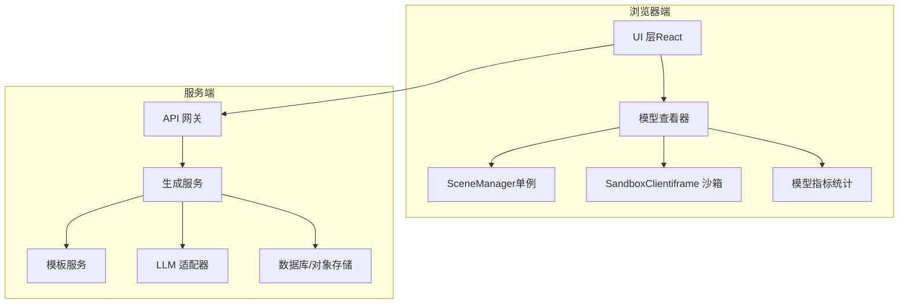
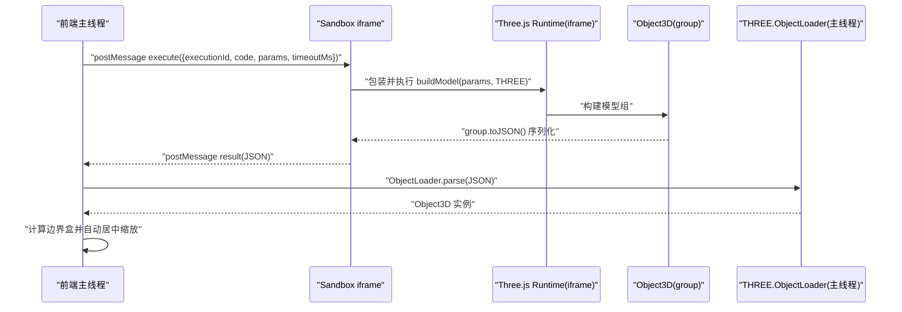
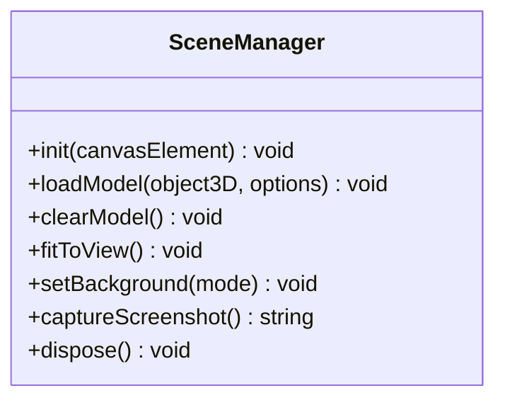
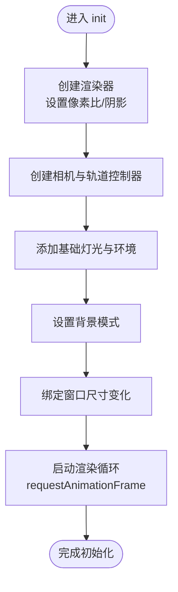
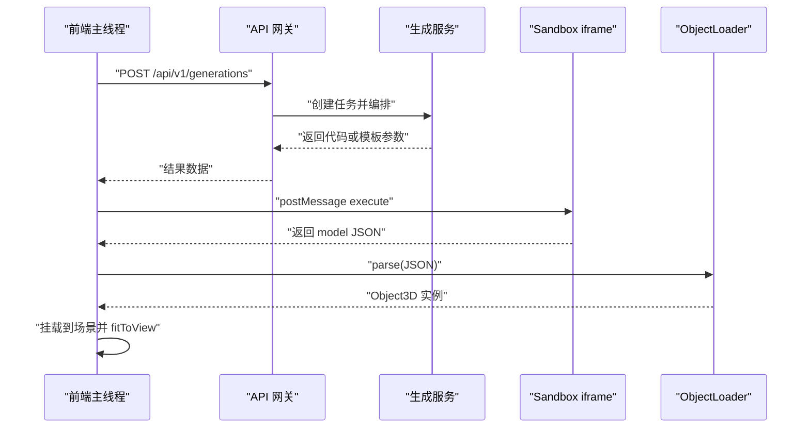
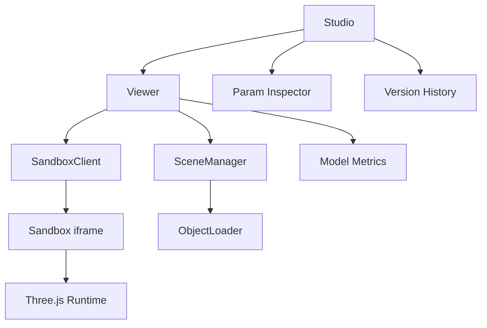

# 3D 渲染系统

<cite>
**本文引用的文件**   
- [产品技术设计文档](file://tech/product-technical-design.md)
- [产品需求文档](file://prd.md)
</cite>

## 目录
1. [简介](#简介)
2. [项目结构](#项目结构)
3. [核心组件](#核心组件)
4. [架构总览](#架构总览)
5. [详细组件分析](#详细组件分析)
6. [依赖关系分析](#依赖关系分析)
7. [性能与内存管理](#性能与内存管理)
8. [故障排查指南](#故障排查指南)
9. [结论](#结论)
10. [附录：配置、参数与返回约定](#附录配置参数与返回约定)

## 简介
本文件面向 ApexForge 的 3D 渲染子系统，聚焦 Three.js 集成方案、SceneManager 单例设计、场景初始化流程、灯光与轨道控制、模型加载与渲染管线、ObjectLoader 使用、几何体优化与材质管理。文档基于仓库中的产品与技术设计说明进行系统化整理，提供从入门到进阶的完整知识路径，并给出可落地的性能优化策略、内存管理与渲染循环控制要点。

## 项目结构
当前仓库包含产品与技术设计文档，未包含前端源码实现。因此本节以“概念性结构”呈现，帮助读者理解模块职责与交互边界。

[此图为概念性结构图，不直接映射具体源码文件]

## 核心组件
- SceneManager（单例）
  - 负责 Three.js 场景、相机、渲染器、灯光、控制器、背景、截图等生命周期管理。
  - 对外暴露 init、loadModel、clearModel、fitToView、setBackground、captureScreenshot、dispose 等方法。
- SandboxClient（iframe 沙箱）
  - 通过 postMessage 向 iframe 发送执行指令，接收序列化后的模型 JSON，交由主线程 ObjectLoader 反序列化。
  - 负责超时控制、错误分类与隔离安全。
- ModelNormalizer（模型归一化）
  - 计算边界盒、自动居中缩放、复杂度统计，辅助 fitToView 与质量评估。
- 模板与参数系统
  - 支持模板选择与参数化渲染，减少全代码生成的不稳定性和成本。

章节来源
- [产品技术设计文档:551-571](file://tech/product-technical-design.md#L551-L571)
- [产品需求文档:68-70](file://prd.md#L68-L70)

## 架构总览
整体采用“固定 HTML 渲染框架 + AI 动态生成 JS 模型代码”的技术范式。前端维护稳定的 Three.js 场景，AI 生成受控的 Three.js 程序化代码或模板参数，在 iframe 中执行后返回结构化 JSON，再由主线程加载到场景中展示。

图表来源
- [产品技术设计文档:498-506](file://tech/product-technical-design.md#L498-L506)

章节来源
- [产品技术设计文档:478-506](file://tech/product-technical-design.md#L478-L506)
- [产品需求文档:105-116](file://prd.md#L105-L116)

## 详细组件分析

### SceneManager 单例设计与能力
- 单例模式确保全局唯一场景上下文，避免重复创建导致的资源浪费与状态不一致。
- 关键方法
  - init(canvasElement)：初始化场景、相机、渲染器、灯光、控制器、背景等。
  - loadModel(object3D, options)：将模型挂载到场景，必要时触发 fitToView。
  - clearModel()：清空当前模型，释放相关资源。
  - fitToView()：根据模型边界盒调整相机位置与 FOV，使模型适配视口。
  - setBackground(mode)：切换背景模式（纯色/渐变/环境贴图）。
  - captureScreenshot()：导出当前帧为图片。
  - dispose()：遍历释放 geometry、material、texture 等资源。

图表来源
- [产品技术设计文档:551-561](file://tech/product-technical-design.md#L551-L561)

章节来源
- [产品技术设计文档:551-561](file://tech/product-technical-design.md#L551-L561)

### 场景初始化流程
- 初始化顺序建议：创建渲染器 -> 设置像素比与阴影 -> 创建相机与控制器 -> 添加基础灯光与环境 -> 设置背景 -> 绑定 resize 事件 -> 启动渲染循环。
- 渲染循环使用 requestAnimationFrame，并在页面不可见时暂停，降低能耗。

[此图为概念性流程图，不直接映射具体源码文件]

### 灯光配置与轨道控制
- 灯光配置
  - 建议使用环境光 + 方向光组合，开启 castShadow/receiveShadow，保证模型立体感与阴影一致性。
  - 可根据背景模式调整光源强度与色温。
- 轨道控制
  - 使用 OrbitControls 提供旋转、平移、缩放交互。
  - 默认启用阻尼与最小/最大距离限制，提升用户体验。

章节来源
- [产品需求文档:68-70](file://prd.md#L68-L70)

### 模型加载与渲染管线
- 生成链路
  - 前端发起生成请求，后端编排 Prompt、调用 LLM、校验与评分，返回代码或模板参数。
  - 前端通过 SandboxClient 在 iframe 中执行代码，得到 group 并序列化 JSON。
  - 主线程使用 ObjectLoader 反序列化并挂载到场景。
- ObjectLoader 使用
  - 仅允许返回结构化 JSON，禁止回传函数或 DOM 引用。
  - 反序列化后可进行二次处理（如统一材质、合并几何体、应用 LOD）。

图表来源
- [产品技术设计文档:362-390](file://tech/product-technical-design.md#L362-L390)
- [产品技术设计文档:498-506](file://tech/product-technical-design.md#L498-L506)

章节来源
- [产品技术设计文档:362-390](file://tech/product-technical-design.md#L362-L390)
- [产品技术设计文档:498-506](file://tech/product-technical-design.md#L498-L506)
- [产品需求文档:105-116](file://prd.md#L105-L116)

### 几何体优化与材质管理
- 几何体优化
  - 优先使用 InstancedMesh 批量渲染重复元素（如轮毂螺丝），减少 draw call。
  - 对远距离物体使用 LOD，降低面数。
  - 合并相近几何体，减少顶点缓冲数量。
- 材质管理
  - 限定使用 MeshStandardMaterial 或 MeshPhysicalMaterial，便于光照与阴影表现。
  - 复用材质实例，避免重复创建。
  - 纹理按需加载与缓存，及时释放不再使用的纹理。

章节来源
- [产品需求文档:155-164](file://prd.md#L155-L164)
- [产品需求文档:85-92](file://prd.md#L85-L92)

### 模板系统与参数化渲染
- 模板分层
  - Skeleton：主体比例与关键部件位置。
  - Style Variant：风格变体（科幻、复古、工业、卡通）。
  - Detail Pack：装饰件（灯带、轮毂、天线、纹理）。
  - Material Preset：材质预设（金属、玻璃、塑料、发光）。
  - Param Schema：参数范围、默认值与校验。
- 执行方式
  - 模板渲染函数 render(params, THREE)，返回 group。
  - 前端可直接执行模板渲染，无需每次生成全新代码。

章节来源
- [产品技术设计文档:760-795](file://tech/product-technical-design.md#L760-L795)
- [产品需求文档:94-103](file://prd.md#L94-L103)

## 依赖关系分析
- 前端模块依赖
  - Studio 依赖 View、ParamInspector、History。
  - Viewer 依赖 SceneManager、SandboxClient、ModelMetrics。
- 运行时依赖
  - iframe 内仅暴露 THREE、安全构建函数与 params。
  - 主线程依赖 ObjectLoader 进行反序列化。

图表来源
- [产品技术设计文档:524-537](file://tech/product-technical-design.md#L524-L537)

章节来源
- [产品技术设计文档:524-537](file://tech/product-technical-design.md#L524-L537)

## 性能与内存管理
- 渲染循环控制
  - 使用 requestAnimationFrame 驱动渲染，页面不可见时暂停循环，降低 CPU/GPU 占用。
- 资源释放
  - 释放旧模型时必须遍历 dispose geometry、material、texture，避免内存泄漏。
- 复杂度过载保护
  - 加载前统计复杂度（面数、顶点数、材质数），超过阈值提示用户降级或使用模板模式。
- 并行与异步
  - 模型 JSON 解析放入 Worker，主线程只做渲染挂载，避免阻塞。
- 批渲染与细节层级
  - 重复元素使用 InstancedMesh；远距离使用 LOD。

章节来源
- [产品技术设计文档:563-571](file://tech/product-technical-design.md#L563-L571)
- [产品需求文档:155-164](file://prd.md#L155-L164)

## 故障排查指南
- 常见错误分类与处理
  - SANDBOX_TIMEOUT：执行超时，终止渲染，检查模型复杂度或增加超时时间。
  - SANDBOX_RUNTIME_ERROR：运行时报错，检查生成代码语法与白名单 API。
  - MODEL_JSON_INVALID：返回结构非法，重新生成或修正模板参数。
  - MODEL_TOO_COMPLEX：复杂度超限，降低细节或使用模板模式。
  - MODEL_EMPTY：未生成有效对象，补充描述或选择更具体的模板。
- 调试建议
  - 记录 traceId，定位全链路耗时与失败点。
  - 在 iframe 中打印关键步骤日志（注意 CSP 限制）。
  - 使用浏览器开发者工具监控 WebGL 状态与内存占用。

章节来源
- [产品技术设计文档:508-516](file://tech/product-technical-design.md#L508-L516)

## 结论
ApexForge 的 3D 渲染系统以 SceneManager 为核心，结合 iframe 沙箱与 ObjectLoader 的反序列化机制，实现了安全可控的程序化模型生成与高性能渲染。通过模板与参数化体系，平台在稳定性与创造力之间取得平衡；配合严格的 AST 校验、复杂度限制与资源管理策略，确保了大规模使用下的性能与安全性。后续可在 React Three Fiber、WebGPU 与云原生架构上持续演进。

## 附录：配置、参数与返回约定
- 生成任务接口
  - POST /api/v1/generations
  - 请求字段示例：projectId、prompt、category、mode、contextVersionId、preferences。
  - 响应字段示例：traceId、taskId、status、mode、templateId、params、code、validationReport、qualityScore。
- SSE 事件
  - GET /api/v1/generations/{taskId}/events
  - 事件类型：queued、generating、validating、repairing、renderable、failed。
- 模板接口
  - GET /api/v1/templates
  - GET /api/v1/templates/{id}
  - POST /api/v1/templates/{id}/render
  - POST /api/v1/templates
  - POST /api/v1/templates/{id}/versions

章节来源
- [产品技术设计文档:654-756](file://tech/product-technical-design.md#L654-L756)