# AI 生成引擎

<cite>
**本文引用的文件**   
- [prd.md](file://prd.md)
- [product-technical-design.md](file://tech/product-technical-design.md)
- [llm.service.ts](file://apps/api/src/modules/llm/llm.service.ts)
- [generation-harness.service.ts](file://apps/api/src/modules/generation/generation-harness.service.ts)
- [generation.service.ts](file://apps/api/src/modules/generation/generation.service.ts)
- [generation.ts](file://src/shared/types/generation.ts)
- [AgentOrchestrationPanel.tsx](file://src/modules/studio/components/AgentOrchestrationPanel.tsx)
- [PromptInput.tsx](file://src/modules/studio/components/PromptInput.tsx)
</cite>

## 更新摘要
**变更内容**   
- 增强了多供应商 LLM 适配器实现，新增 Kimi 和 Qwen 提供商支持
- 完善了代理编排系统，实现了完整的多 Agent 协作框架
- 增强了质量评分机制，集成详细的评分维度和渲染策略配置
- 优化了前端用户界面，支持在线 API Key 配置和供应商选择

## 目录
1. [引言](#引言)
2. [项目结构](#项目结构)
3. [核心组件](#核心组件)
4. [架构总览](#架构总览)
5. [详细组件分析](#详细组件分析)
6. [依赖关系分析](#依赖关系分析)
7. [性能考量](#性能考量)
8. [故障排查指南](#故障排查指南)
9. [结论](#结论)
10. [附录](#附录)

## 引言
本文件面向 ApexForge 的 AI 生成引擎，聚焦多模式生成（模板、代码、混合）的实现原理与工程落地。内容涵盖 Prompt 编排策略、多供应商 LLM 适配器设计、生成质量控制与缓存机制、生成链路状态机流转、Prompt 版本管理、输出协议规范、错误处理策略，以及与前后端各模块的关系。文档同时提供来自仓库技术设计文档的具体示例路径，帮助初学者快速上手，并为有经验的开发者提供深入的技术细节。

**更新** 本次更新重点反映了多供应商 LLM 适配器的增强实现，特别是 Kimi 和 Qwen 提供商的支持，以及完善的代理编排系统和质量评分机制。

## 项目结构
当前仓库包含产品需求与技术设计文档，用于定义平台级 AI 生成 3D 模型系统的目标、架构、数据模型、接口契约与安全策略等。MVP 阶段采用单体后端加模块化代码结构，后续演进为服务化架构；前端基于 React + Three.js，服务端使用 NestJS，数据库从 SQLite 平滑迁移到 PostgreSQL。

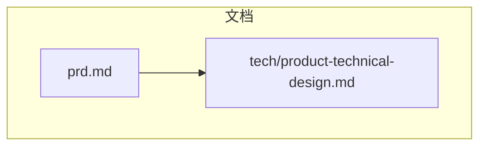

图表来源
- [prd.md:1-168](file://prd.md#L1-L168)
- [product-technical-design.md:1-120](file://tech/product-technical-design.md#L1-L120)

章节来源
- [prd.md:1-168](file://prd.md#L1-L168)
- [product-technical-design.md:1-120](file://tech/product-technical-design.md#L1-L120)

## 核心组件
AI 生成引擎由以下关键组件构成：
- 生成路由与编排：负责选择生成模式（模板/代码/混合）、构建 Prompt、协调缓存与 LLM 调用。
- 多供应商 LLM 适配器：统一抽象不同大模型的调用接口，支持 DeepSeek、Kimi、Qwen 等多供应商，支持失败重试与降级。
- 代理编排系统：实现多 Agent 协作，包括 Prompt Architect、Structure Agent、Surface Detail Agent、Material Agent、Quality Agent。
- 校验器与修复器：对输出进行协议校验、黑名单扫描、AST 白名单检查，必要时触发自动修复。
- 质量评分器：从可渲染性、匹配度、结构完整性、性能表现、可编辑性等维度评估结果。
- 沙箱执行器：在 iframe 中隔离执行生成的代码，返回序列化模型数据。
- 模板系统：分层模板（骨架、风格变体、细节包、材质预设），参数 Schema 驱动渲染。
- 缓存层：相似 Prompt 向量相似度命中直接复用结果，降低 LLM 成本与延迟。
- 任务队列与持久化：记录任务状态、Prompt 版本、校验报告、质量评分与资产版本。

**更新** 新增了代理编排系统和增强的多供应商支持，现在支持三个主要的 LLM 提供商。

章节来源
- [product-technical-design.md:327-426](file://tech/product-technical-design.md#L327-L426)
- [product-technical-design.md:428-518](file://tech/product-technical-design.md#L428-L518)
- [product-technical-design.md:594-630](file://tech/product-technical-design.md#L594-L630)
- [product-technical-design.md:760-804](file://tech/product-technical-design.md#L760-L804)
- [product-technical-design.md:807-841](file://tech/product-technical-design.md#L807-L841)

## 架构总览
整体逻辑架构将前端 Studio、API 网关、生成服务、模板服务、LLM 适配、校验与评分、数据库与缓存串联起来，形成端到端的生成流水线。

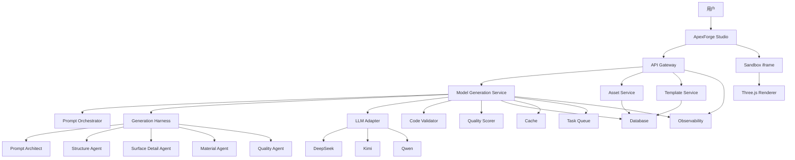

**更新** 架构图新增了 Generation Harness 服务和五个专门的 Agent，以及 Kimi 和 Qwen 提供商支持。

图表来源
- [product-technical-design.md:38-62](file://tech/product-technical-design.md#L38-L62)

章节来源
- [product-technical-design.md:38-62](file://tech/product-technical-design.md#L38-L62)

## 详细组件分析

### 多模式生成与 Prompt 编排
- 生成模式优先级：缓存命中优先，其次模板模式，再次混合模式，最后代码模式。
- Prompt 编排要点：
  - System Prompt 明确角色、约束与输出协议。
  - Few-shot 示例提升稳定性。
  - 根据模式动态注入模板摘要或编码规范。
  - 通过 Generation Harness 进行智能优化和结构化处理。
- 输出协议：统一 JSON 结构，包含 mode、templateId、params、code、explanation、warnings 等字段。
- Prompt 版本管理：每次生成记录 promptVersion，便于回滚与回归测试。

**更新** 新增了智能 Prompt 优化功能，通过 Generation Harness 自动压缩复杂需求并补充商业级 CAD 约束。

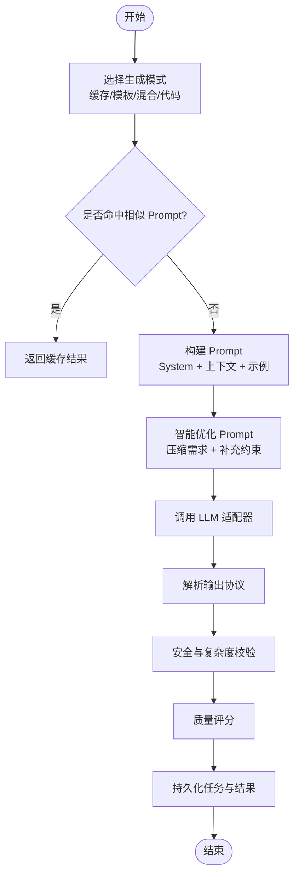

图表来源
- [product-technical-design.md:327-426](file://tech/product-technical-design.md#L327-L426)

章节来源
- [product-technical-design.md:327-426](file://tech/product-technical-design.md#L327-L426)

### 多供应商 LLM 适配器设计
- 统一接口：provider、generate、可选 stream。
- 支持供应商：DeepSeek、Kimi、Qwen，每个供应商都有独立的配置和默认模型。
- 选择策略：按任务类型、成本与响应速度选择供应商；支持失败重试与降级。
- 在线 API Key 支持：用户可在前端直接输入各供应商的 API Key，优先于环境变量。
- 观测指标：token 用量、耗时、错误码、输出质量。

**更新** 新增了 Kimi 和 Qwen 提供商支持，实现了统一的 OpenAI-compatible 请求格式和错误处理。

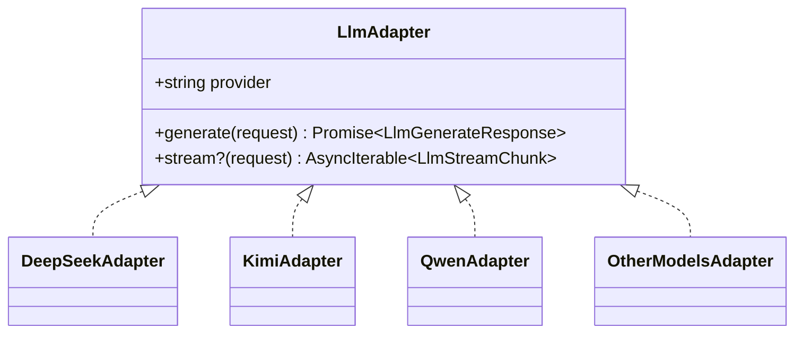

**更新** 类图新增了 KimiAdapter 和 QwenAdapter 实现。

图表来源
- [product-technical-design.md:611-630](file://tech/product-technical-design.md#L611-L630)

章节来源
- [product-technical-design.md:611-630](file://tech/product-technical-design.md#L611-L630)

### 代理编排系统与多 Agent 协作
- 五 Agent 协作框架：
  - Prompt Architect：需求澄清与提示词优化
  - Structure Agent：主体结构与比例规划  
  - Surface Detail Agent：硬表面细节与面板分层
  - Material Agent：材质与渲染策略
  - Quality Agent：结构一致性与渲染可用性质检
- 技能链系统：根据类别动态调整技能顺序，如手表和珠宝类优先材质分层。
- 渲染策略配置：灯光、材质管线、细节策略的标准化配置。
- 前端可视化：AgentOrchestrationPanel 展示各 Agent 状态和技能链执行情况。

**更新** 新增了完整的代理编排系统，实现了多 Agent 协作和可视化的技能链展示。

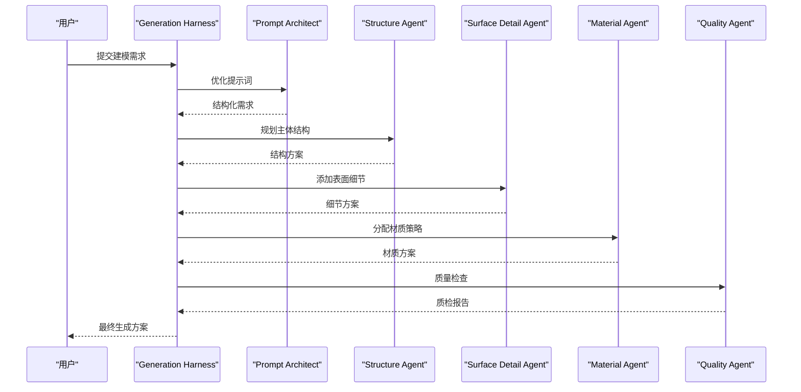

图表来源
- [generation-harness.service.ts:52-93](file://apps/api/src/modules/generation/generation-harness.service.ts#L52-L93)

章节来源
- [generation-harness.service.ts:1-147](file://apps/api/src/modules/generation/generation-harness.service.ts#L1-L147)
- [AgentOrchestrationPanel.tsx:1-95](file://src/modules/studio/components/AgentOrchestrationPanel.tsx#L1-L95)

### 生成质量控制与质量评分体系
- 评分维度：可渲染性、Prompt 匹配度、结构完整性、性能表现、可编辑性。
- 自动评分输入：模式与模板命中、AST 校验结果、几何体数量、顶点数、材质数、沙箱执行成功与否、边界盒尺寸、空模型检测、用户反馈与保存行为。
- 质量闭环：评分结果驱动 Prompt 优化、模板优化与回归数据集建设。
- 渲染策略集成：评分包含 lighting、materialPipeline、detailStrategy 等渲染配置信息。

**更新** 质量评分体系现在集成了渲染策略配置和详细的评分维度，支持更精确的质量评估。

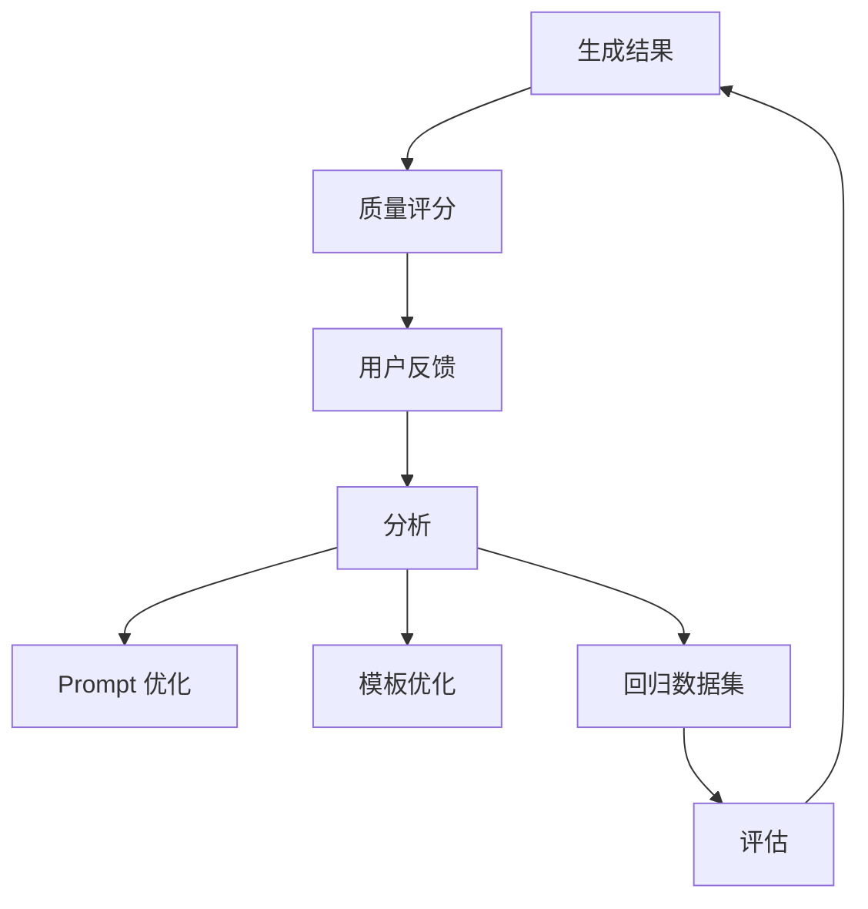

图表来源
- [product-technical-design.md:807-841](file://tech/product-technical-design.md#L807-L841)

章节来源
- [product-technical-design.md:807-841](file://tech/product-technical-design.md#L807-L841)

### 缓存机制与相似 Prompt 复用
- 缓存键：归一化 Prompt 的向量表示。
- 阈值：相似度大于阈值时直接复用结果。
- 收益：显著降低 LLM 调用成本与延迟，提高批量变体生成效率。

章节来源
- [product-technical-design.md:327-339](file://tech/product-technical-design.md#L327-L339)
- [product-technical-design.md:944-951](file://tech/product-technical-design.md#L944-L951)

### 生成链路的状态机流转
- 状态：queued、generating、validating、renderable、repairing、failed、retrying、saved、discarded。
- 流转：生成后进入校验，失败可修复并重试，最终保存或丢弃。

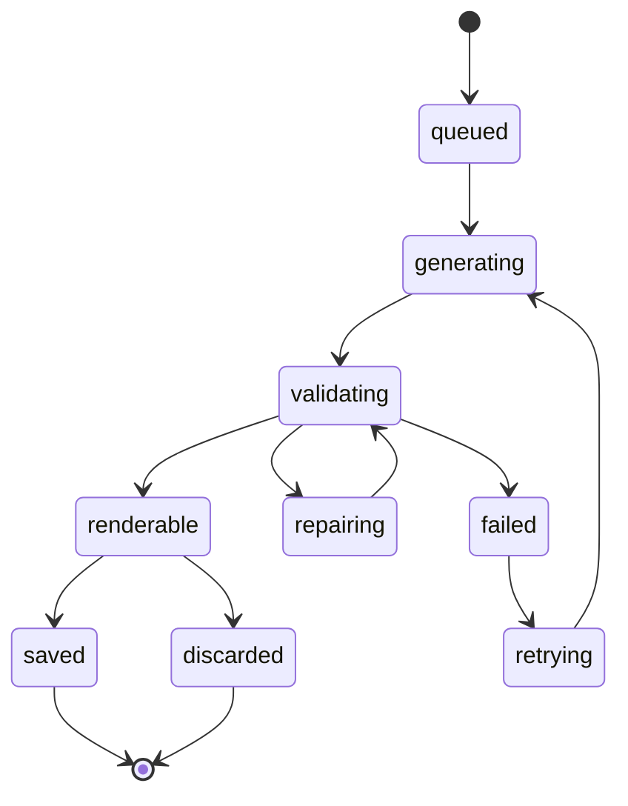

图表来源
- [product-technical-design.md:342-357](file://tech/product-technical-design.md#L342-L357)

章节来源
- [product-technical-design.md:342-357](file://tech/product-technical-design.md#L342-L357)

### Prompt 版本管理与输出协议规范
- 版本管理：每次生成记录 promptVersion，System Prompt、Few-shot 示例、模板摘要均版本化，支持快速回滚。
- 输出协议：统一 JSON 结构，包含 mode、templateId、params、code、explanation、warnings 等字段，确保下游解析一致。

章节来源
- [product-technical-design.md:419-426](file://tech/product-technical-design.md#L419-L426)
- [product-technical-design.md:403-418](file://tech/product-technical-design.md#L403-L418)

### 代码安全校验与 AST 白名单
- 校验分层：输出协议校验、文本黑名单、AST 白名单、运行时沙箱、超时销毁、结果校验。
- 黑名单 API：动态执行、网络访问、DOM 访问、动态加载、原型污染、计算风险。
- 白名单策略：允许基础语法、Math 白名单方法、THREE 白名单构造器与安全方法；限制代码长度、AST 深度、循环层数、Mesh 数量与顶点估算。

章节来源
- [product-technical-design.md:428-470](file://tech/product-technical-design.md#L428-L470)

### 沙箱运行时设计与执行流程
- 方案：隐藏 iframe 完全隔离，CSP 限制脚本来源，sandbox 属性控制权限。
- 执行流程：主线程发送 execute 指令，iframe 包装并执行 buildModel(params, THREE)，成功后 group.toJSON() 返回结构化 JSON，主线程用 ObjectLoader 反序列化并挂载。
- 错误分类：超时、运行时报错、模型 JSON 非法、模型过于复杂、未生成有效对象。

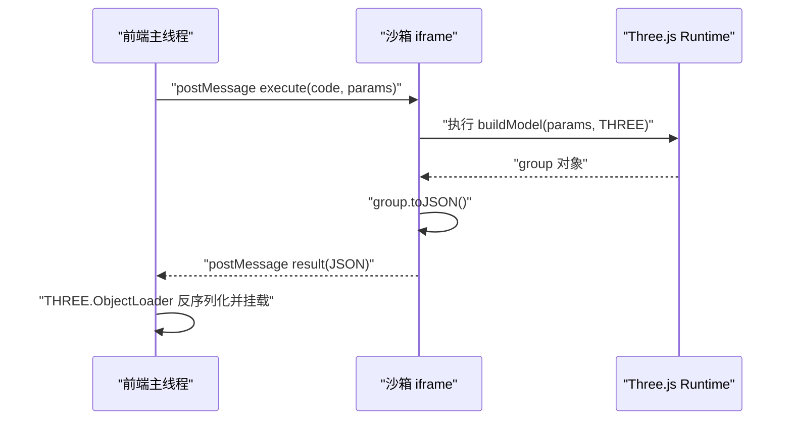

图表来源
- [product-technical-design.md:478-507](file://tech/product-technical-design.md#L478-L507)

章节来源
- [product-technical-design.md:478-518](file://tech/product-technical-design.md#L478-L518)

### 模板系统与程序化建模
- 模板分层：Skeleton（骨架）、Style Variant（风格变体）、Detail Pack（细节包）、Material Preset（材质预设）、Param Schema（参数 Schema）。
- 匹配策略：类别识别与关键词抽取、标签与向量检索候选模板、LLM 选择最匹配模板并生成参数；置信度低则切换 Hybrid 或 Code Mode。
- 渲染函数：renderer 接收 params 与 THREE，返回 Group 或序列化数据。

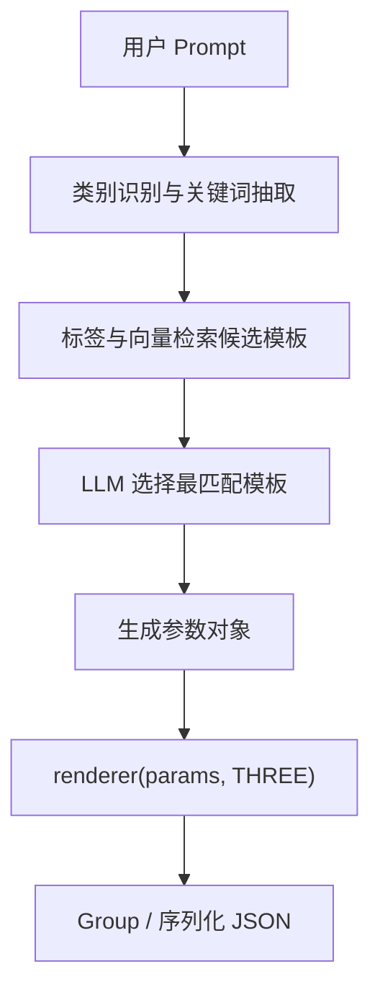

图表来源
- [product-technical-design.md:760-804](file://tech/product-technical-design.md#L760-L804)

章节来源
- [product-technical-design.md:760-804](file://tech/product-technical-design.md#L760-L804)

### 完整时序与 API 交互
- 创建生成任务：POST /api/v1/generations，请求包含 projectId、prompt、category、mode、contextVersionId、preferences。
- 查询生成任务：GET /api/v1/generations/{taskId}。
- 保存为资产：POST /api/v1/assets。
- SSE 事件：/api/v1/generations/{taskId}/events，推送 queued、generating、validating、repairing、renderable、failed。

**更新** 新增了多供应商选择和在线 API Key 支持的时序流程。

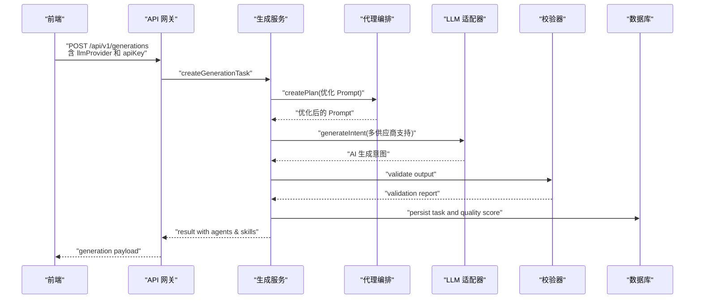

图表来源
- [product-technical-design.md:361-390](file://tech/product-technical-design.md#L361-L390)

章节来源
- [product-technical-design.md:632-757](file://tech/product-technical-design.md#L632-L757)
- [product-technical-design.md:361-390](file://tech/product-technical-design.md#L361-L390)

## 依赖关系分析
- 生成服务依赖缓存、模板服务、LLM 适配器、校验器、评分器与数据库。
- 代理编排系统依赖 LLM 服务，提供多 Agent 协作能力。
- 前端依赖沙箱 iframe 与 Three.js 渲染器，新增 AgentOrchestrationPanel 展示编排过程。
- 模板服务与数据库关联，存储模板与版本信息。
- 可观测性贯穿全链路，记录 traceId、耗时、状态与错误码。

**更新** 新增了代理编排系统和增强的前端可视化组件依赖关系。

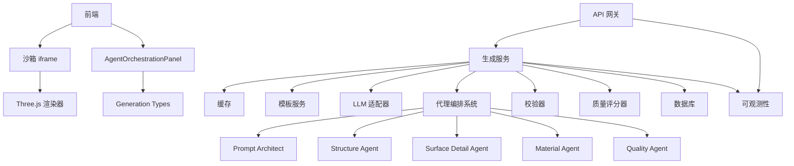

图表来源
- [product-technical-design.md:38-62](file://tech/product-technical-design.md#L38-L62)

章节来源
- [product-technical-design.md:38-62](file://tech/product-technical-design.md#L38-L62)

## 性能考量
- 前端优化：按需加载 Three.js runtime、Worker 解析大模型 JSON、InstancedMesh 批量渲染、旧模型释放 geometry/material/texture、LOD 与相机状态解耦。
- 后端优化：相似 Prompt 缓存、模板模式跳过 LLM 代码生成、异步任务队列、供应商并发与熔断、热门模板与 Schema 缓存。
- 数据库优化：索引 traceId/workspaceId/createdAt、大字段迁移至对象存储、历史任务归档。

章节来源
- [product-technical-design.md:933-958](file://tech/product-technical-design.md#L933-L958)

## 故障排查指南
- 常见错误码与提示：
  - SANDBOX_TIMEOUT：执行超时，建议降低复杂度或使用模板模式。
  - SANDBOX_RUNTIME_ERROR：运行时报错，可重试或调整 Prompt。
  - MODEL_JSON_INVALID：返回结构非法，系统将重新生成。
  - MODEL_TOO_COMPLEX：模型复杂度超限，请降低细节或使用模板模式。
  - MODEL_EMPTY：未生成有效对象，补充描述主体。
  - LLM_API_KEY_MISSING：未配置对应供应商的 API Key。
  - LLM_REQUEST_FAILED：LLM 请求失败，检查网络连接和 API Key。
- 日志与追踪：每个请求携带 traceId，记录 userId、workspaceId、taskId、provider、promptVersion、generationMode、latencyMs、status、errorCode、qualityScore。
- 告警规则：生成失败率过高、LLM 延迟过高、校验失败突增、沙箱超时突增、API 错误率过高。

**更新** 新增了 LLM 相关的错误码和处理策略。

章节来源
- [product-technical-design.md:508-518](file://tech/product-technical-design.md#L508-L518)
- [product-technical-design.md:882-907](file://tech/product-technical-design.md#L882-L907)

## 结论
ApexForge 的 AI 生成引擎以"模板优先、代码为辅"的策略实现稳定可控的程序化建模。通过统一的 Prompt 编排、多供应商 LLM 适配器（支持 DeepSeek、Kimi、Qwen）、严格的代理编排系统、多 Agent 协作机制、严格的安全校验与质量评分体系，以及高效的缓存与沙箱执行机制，系统在灵活性与安全性之间取得平衡。结合完整的状态机流转、版本管理与可观测性设计，平台具备从 MVP 到企业级部署的演进能力。

**更新** 本次更新显著增强了系统的多供应商支持和智能化程度，通过代理编排系统和多 Agent 协作机制，提升了生成质量和用户体验。

## 附录

### 配置选项与参数参考
- 生成模式：auto/template/code/hybrid/cache。
- 偏好设置：style、quality。
- 上下文版本：contextVersionId。
- 模板参数：依据 Param Schema 动态生成表单，支持默认值与范围校验。
- LLM 供应商：deepseek、kimi、qwen，每个都支持在线 API Key 配置。
- 代理编排：支持自定义 Agent 列表和技能链配置。

**更新** 新增了 LLM 供应商配置和代理编排相关参数。

章节来源
- [product-technical-design.md:654-695](file://tech/product-technical-design.md#L654-L695)
- [product-technical-design.md:760-785](file://tech/product-technical-design.md#L760-L785)

### 与其他组件的关系
- 前端 Studio：负责 Prompt 输入、历史展示、沙箱执行与渲染，新增 AgentOrchestrationPanel 展示编排过程。
- API 网关：鉴权、限流、路由。
- 资产服务：保存模型资产与版本。
- 模板服务：管理模板与版本，提供匹配与渲染。
- 可观测性：记录全链路指标与告警。

**更新** 新增了前端 Agent 编排面板与后端代理系统的集成关系。

章节来源
- [product-technical-design.md:38-62](file://tech/product-technical-design.md#L38-L62)
- [product-technical-design.md:574-593](file://tech/product-technical-design.md#L574-L593)

### 多供应商 LLM 适配器实现细节
- 统一供应商标识：normalizeProvider 将前端传入值归一化为 deepseek、kimi、qwen 等内部供应商标识。
- 解析 Provider Config：resolveProviderConfig 根据供应商获取 baseURL、模型名、环境变量名和展示名称。
- API Key 优先级：先使用 apiKeyOverride，也就是用户在线填写的 Key；如果没有，才读取服务端环境变量。
- OpenAI-compatible 请求：后端向 /chat/completions 发送 messages、temperature 和 response_format json_object，要求模型返回结构化 JSON。
- 错误信息产品化：缺少 Key 时给出可操作提示：在左侧在线配置填写，或在项目环境变量中设置对应变量名。

**更新** 新增了 Kimi 和 Qwen 提供商的具体实现细节。

章节来源
- [llm.service.ts:79-115](file://apps/api/src/modules/llm/llm.service.ts#L79-L115)
- [PromptInput.tsx:21-25](file://src/modules/studio/components/PromptInput.tsx#L21-L25)

### 代理编排系统技术实现
- 智能 Prompt 优化：compactPrompt 压缩多余空格，extractTarget 提取目标物体，buildOptimizedPrompt 补充商业级 CAD 约束。
- 五 Agent 协作：每个 Agent 有明确的职责分工和输出格式，支持状态管理和结果聚合。
- 技能链系统：根据类别动态调整技能顺序，如手表和珠宝类优先材质分层。
- 渲染策略配置：标准化的 lighting、materialPipeline、detailStrategy 配置。

**更新** 新增了代理编排系统的完整技术实现说明。

章节来源
- [generation-harness.service.ts:31-50](file://apps/api/src/modules/generation/generation-harness.service.ts#L31-L50)
- [generation-harness.service.ts:52-93](file://apps/api/src/modules/generation/generation-harness.service.ts#L52-L93)
- [generation-harness.service.ts:95-109](file://apps/api/src/modules/generation/generation-harness.service.ts#L95-L109)