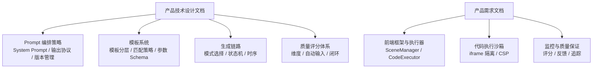
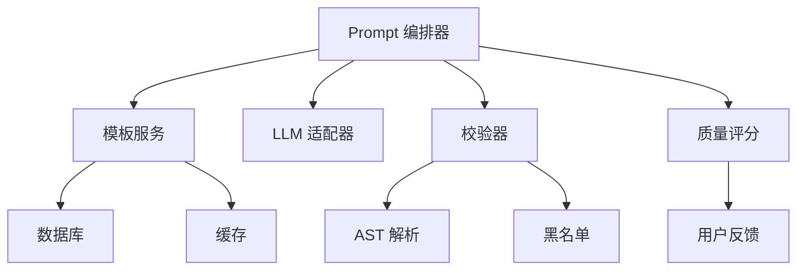
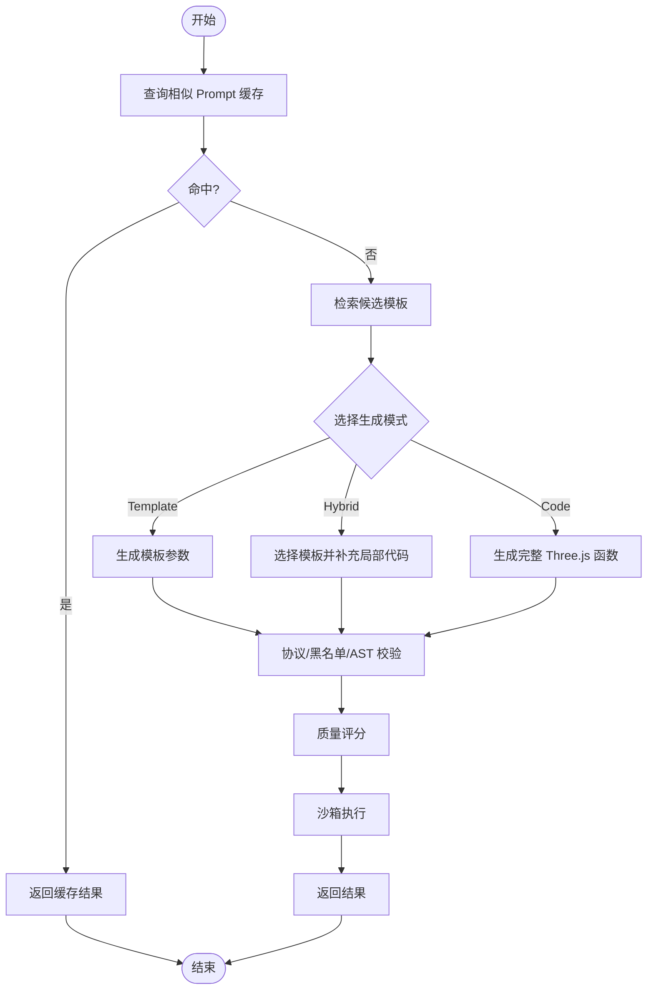

# Prompt 工程与编排

<cite>
**本文引用的文件**   
- [产品技术设计文档](file://tech/product-technical-design.md)
- [产品需求文档](file://prd.md)
</cite>

## 目录
1. [引言](#引言)
2. [项目结构](#项目结构)
3. [核心组件](#核心组件)
4. [架构总览](#架构总览)
5. [详细组件分析](#详细组件分析)
6. [依赖关系分析](#依赖关系分析)
7. [性能考量](#性能考量)
8. [故障排查指南](#故障排查指南)
9. [结论](#结论)
10. [附录](#附录)

## 引言
本文件聚焦 ApexForge 的 Prompt 工程与编排系统，围绕 System Prompt 设计原则、角色设定与输出协议规范展开，并给出构建有效的 Three.js 程序化建模提示词的方法。同时覆盖 Prompt 版本管理、Few-shot 示例管理、上下文组装策略与动态参数注入；记录模板库的组织结构与检索算法；结合生成模式（Template/Code/Hybrid/Cache）展示不同场景下的 Prompt 构造方法；解释与校验、沙箱、评分等组件的关系，以及质量评估与回滚机制。文末提供多模态 Prompt 设计思路、安全约束嵌入与性能优化技巧，兼顾初学者可读性与资深开发者的技术深度。

## 项目结构
从仓库可见，当前包含两份关键文档：产品技术设计与产品需求。它们共同定义了 ApexForge 的架构、数据模型、生成链路、Prompt 编排策略、模板系统与质量闭环，为 Prompt 工程提供了完整蓝图。



图表来源
- [产品技术设计文档:392-425](file://tech/product-technical-design.md#L392-L425)
- [产品技术设计文档:797-804](file://tech/product-technical-design.md#L797-L804)
- [产品技术设计文档:807-841](file://tech/product-technical-design.md#L807-L841)
- [产品需求文档:59-84](file://prd.md#L59-L84)
- [产品需求文档:105-123](file://prd.md#L105-L123)

章节来源
- [产品技术设计文档:392-425](file://tech/product-technical-design.md#L392-L425)
- [产品需求文档:59-84](file://prd.md#L59-L84)

## 核心组件
- Prompt 编排器：负责根据任务上下文、模板候选与用户偏好，组装 System Prompt、Few-shot 示例与结构化输出协议，驱动 LLM 生成。
- 模板系统：维护模板元数据、参数 Schema、默认参数、渲染函数与示例 Prompt，支持分层与语义化版本。
- 生成路由：按优先级（Cache → Template → Hybrid → Code）选择生成路径，并在低置信度时降级。
- 校验与修复：对 LLM 输出进行协议校验、文本黑名单扫描与 AST 白名单校验，必要时触发修复或重试。
- 质量评分：基于可渲染性、Prompt 匹配度、结构完整性、性能表现与可编辑性等维度打分，形成持续优化闭环。
- 沙箱运行时：在 iframe 中执行生成的 Three.js 代码，序列化结果并返回主线程渲染。

章节来源
- [产品技术设计文档:392-425](file://tech/product-technical-design.md#L392-L425)
- [产品技术设计文档:797-804](file://tech/product-technical-design.md#L797-L804)
- [产品技术设计文档:807-841](file://tech/product-technical-design.md#L807-L841)
- [产品需求文档:59-84](file://prd.md#L59-L84)
- [产品需求文档:105-123](file://prd.md#L105-L123)

## 架构总览
下图展示了从用户输入到最终渲染的全链路，突出 Prompt 编排在各环节中的作用以及与模板、校验、评分和沙箱的协作关系。

```mermaid
sequenceDiagram
participant FE as "前端"
participant API as "API 网关"
participant GEN as "生成服务"
participant CACHE as "相似缓存"
participant TPL as "模板服务"
participant PROMPT as "Prompt 编排器"
participant LLM as "LLM 适配器"
participant VAL as "校验器"
participant SCORE as "质量评分"
participant BOX as "沙箱运行"
FE->>API : "创建生成任务"
API->>GEN : "createGenerationTask"
GEN->>CACHE : "查询相似 Prompt"
alt "命中缓存"
CACHE-->>GEN : "复用结果"
else "未命中"
GEN->>TPL : "查找候选模板"
TPL-->>GEN : "候选模板列表"
GEN->>PROMPT : "组装 System Prompt + Few-shot + 输出协议"
PROMPT->>LLM : "调用 LLM 生成"
LLM-->>GEN : "结构化输出"
GEN->>VAL : "协议/黑名单/AST 校验"
VAL-->>GEN : "校验报告"
GEN->>SCORE : "计算质量分"
SCORE-->>GEN : "评分详情"
end
GEN-->>API : "返回任务结果"
API-->>FE : "结果载荷"
FE->>BOX : "在 iframe 中执行代码"
BOX-->>FE : "模型 JSON 或错误"
```

图表来源
- [产品技术设计文档:361-390](file://tech/product-technical-design.md#L361-L390)
- [产品技术设计文档:392-425](file://tech/product-technical-design.md#L392-L425)
- [产品技术设计文档:807-841](file://tech/product-technical-design.md#L807-L841)

## 详细组件分析

### System Prompt 设计原则与角色设定
- 角色定位：将 LLM 设定为“资深 Three.js 程序化建模工程师”，强调程序化建模与参数化能力。
- 输出协议：强制固定 JSON 结构，包含 mode、templateId、params、code、explanation、warnings 等字段，便于解析与后续处理。
- 安全约束：禁止访问网络、DOM、全局对象与浏览器存储；几何体与材质限定在白名单内；限制复杂度、循环、递归与动态执行。
- 稳定性策略：通过 Few-shot 示例与强约束协议降低不稳定风险，配合温度控制与重试机制提升成功率。

章节来源
- [产品技术设计文档:392-402](file://tech/product-technical-design.md#L392-L402)
- [产品技术设计文档:403-417](file://tech/product-technical-design.md#L403-L417)
- [产品需求文档:85-92](file://prd.md#L85-L92)

### 输出协议规范与解析
- 协议字段说明：
  - mode：template | code | hybrid，决定生成路径。
  - templateId：命中的模板 ID，用于参数化渲染。
  - params：参数对象，遵循模板参数 Schema。
  - code：当 mode=code/hybrid 时，提供 buildModel(params, THREE) 函数。
  - explanation：模型结构说明，辅助调试与质量评估。
  - warnings：潜在问题与建议。
- 解析流程：服务端先做协议校验，再进入 AST 白名单校验与复杂度限制，最后进入沙箱执行与结果校验。

章节来源
- [产品技术设计文档:403-417](file://tech/product-technical-design.md#L403-L417)
- [产品技术设计文档:428-469](file://tech/product-technical-design.md#L428-L469)

### Prompt 版本管理与回滚机制
- 版本化要素：每次生成记录保存 promptVersion；System Prompt、Few-shot 示例、模板摘要均版本化。
- 回归测试：按 Prompt 版本执行质量回归，比较成功率、质量分与耗时。
- 快速回滚：当生成质量下降时，可快速回滚至历史稳定版本，保障线上稳定性。

章节来源
- [产品技术设计文档:419-425](file://tech/product-technical-design.md#L419-L425)
- [产品技术设计文档:807-841](file://tech/product-technical-design.md#L807-L841)

### Few-shot 示例管理
- 示例来源：模板版本中的 examplePrompts 字段，以及平台沉淀的高质量 Prompt 集。
- 组织方式：按类别（车辆、建筑、飞行器、家具、道具）与风格（科幻、复古、工业、卡通）分类，便于检索与注入。
- 使用策略：在 System Prompt 中注入与当前任务最相关的 Few-shot 示例，提升 LLM 输出一致性与可渲染性。

章节来源
- [产品技术设计文档:284-296](file://tech/product-technical-design.md#L284-L296)
- [产品技术设计文档:807-841](file://tech/product-technical-design.md#L807-L841)

### 上下文组装策略与动态参数注入
- 上下文来源：用户原始 Prompt、项目与空间信息、历史生成记录、模板候选与参数 Schema、用户偏好（风格、质量）。
- 组装步骤：
  1) 识别类别与关键词，检索候选模板；
  2) 注入 System Prompt 与安全约束；
  3) 注入 Few-shot 示例与输出协议；
  4) 动态注入模板参数 Schema 与默认值；
  5) 附加用户偏好与历史反馈，引导 LLM 生成更贴合的结果。
- 动态参数注入：根据模板 paramSchema 与 defaultParams，生成参数表单与校验规则，减少自由生成带来的不稳定性。

章节来源
- [产品技术设计文档:797-804](file://tech/product-technical-design.md#L797-L804)
- [产品技术设计文档:284-296](file://tech/product-technical-design.md#L284-L296)
- [产品需求文档:94-104](file://prd.md#L94-L104)

### 模板库组织结构与检索算法
- 模板分层：Skeleton（骨架）、Style Variant（风格变体）、Detail Pack（细节包）、Material Preset（材质预设）、Param Schema（参数 Schema）。
- 检索算法：
  1) 对用户 Prompt 做类别识别与关键词抽取；
  2) 使用标签与向量检索找出候选模板；
  3) 让 LLM 在候选中选择最匹配模板并生成参数；
  4) 若置信度低于阈值，切换 Hybrid 或 Code Mode；
  5) 保存命中数据以优化覆盖率。
- 版本管理：模板采用语义化版本，记录 rendererCode、examplePrompts、validationRules 等。

章节来源
- [产品技术设计文档:787-804](file://tech/product-technical-design.md#L787-L804)
- [产品技术设计文档:284-296](file://tech/product-technical-design.md#L284-L296)

### 不同生成模式下的 Prompt 构造方法
- Cache Mode：优先命中相似 Prompt 缓存，直接复用结果，避免 LLM 调用。
- Template Mode：AI 仅生成模板参数，由 render(templateId, params) 执行，稳定性高、速度快。
- Hybrid Mode：AI 选择模板并补充局部代码，适用于复杂但仍需可控的场景。
- Code Mode：AI 生成完整 Three.js 函数，适用于新类别与探索性生成。
- 构造要点：
  - 明确 mode 与 templateId；
  - 注入参数 Schema 与默认值；
  - 强化安全约束与输出协议；
  - 注入 Few-shot 示例与用户偏好。

章节来源
- [产品技术设计文档:329-338](file://tech/product-technical-design.md#L329-L338)
- [产品技术设计文档:392-425](file://tech/product-technical-design.md#L392-L425)

### 与其他组件的关系
- 与校验器：输出协议校验、文本黑名单、AST 白名单校验确保安全性与可执行性。
- 与沙箱：iframe 隔离执行，postMessage 通信，超时销毁与错误映射。
- 与评分：基于可渲染性、Prompt 匹配度、结构完整性、性能表现与可编辑性打分，形成质量闭环。
- 与模板：模板命中与参数生成降低不确定性，提高成功率与速度。

章节来源
- [产品技术设计文档:428-469](file://tech/product-technical-design.md#L428-L469)
- [产品技术设计文档:472-517](file://tech/product-technical-design.md#L472-L517)
- [产品技术设计文档:807-841](file://tech/product-technical-design.md#L807-L841)

### 多模态 Prompt 设计
- 多模态输入：除自然语言外，可引入图像草图、参考模型或参数化配置作为上下文，增强意图理解。
- 多模态输出：除代码与参数外，可附带结构说明、可视化截图与指标摘要，辅助调试与评估。
- 设计建议：
  - 在 System Prompt 中明确多模态输入/输出的格式与约束；
  - 在 Few-shot 中展示典型多模态用例；
  - 在输出协议中扩展 image_url、screenshot_url、metrics 等字段。

[本节为概念性内容，不直接分析具体文件]

### 安全约束嵌入
- 输入安全：长度限制、敏感词过滤、品牌与侵权内容拦截。
- 输出安全：协议校验、黑名单扫描、AST 白名单、复杂度限制。
- 运行时安全：iframe sandbox、CSP、无同源权限、超时销毁。
- 数据安全：密钥管理、日志脱敏、企业版数据隔离与审计。

章节来源
- [产品技术设计文档:910-930](file://tech/product-technical-design.md#L910-L930)
- [产品技术设计文档:428-469](file://tech/product-technical-design.md#L428-L469)
- [产品技术设计文档:472-517](file://tech/product-technical-design.md#L472-L517)

### 性能优化技巧
- 前端：按需加载 Three.js runtime、Worker 解析大模型、InstancedMesh 批量渲染、释放旧模型资源。
- 后端：相似 Prompt 缓存、模板模式跳过 LLM 代码生成、异步任务、供应商并发与熔断、热门模板缓存。
- 数据库：索引优化、大字段迁移对象存储、历史归档。

章节来源
- [产品技术设计文档:933-958](file://tech/product-technical-design.md#L933-L958)
- [产品需求文档:155-165](file://prd.md#L155-L165)

## 依赖关系分析
Prompt 编排器依赖模板服务、LLM 适配器、校验器与评分模块；模板服务依赖数据库与缓存；校验器依赖 AST 解析与黑名单；评分模块依赖生成结果与用户反馈。



图表来源
- [产品技术设计文档:392-425](file://tech/product-technical-design.md#L392-L425)
- [产品技术设计文档:797-804](file://tech/product-technical-design.md#L797-L804)
- [产品技术设计文档:807-841](file://tech/product-technical-design.md#L807-L841)

章节来源
- [产品技术设计文档:392-425](file://tech/product-technical-design.md#L392-L425)
- [产品技术设计文档:797-804](file://tech/product-technical-design.md#L797-L804)
- [产品技术设计文档:807-841](file://tech/product-technical-design.md#L807-L841)

## 性能考量
- 生成路径优先级：Cache → Template → Hybrid → Code，最大化命中率与最小化 LLM 调用。
- 模板命中与参数生成：显著降低延迟与成本，提高稳定性。
- 缓存策略：相似 Prompt 向量相似度阈值命中，复用结果。
- 资源释放：旧模型 geometry、material、texture 必须释放，避免内存泄漏。
- 并发与熔断：LLM 供应商并发控制与失败降级，保障整体可用性。

章节来源
- [产品技术设计文档:329-338](file://tech/product-technical-design.md#L329-L338)
- [产品技术设计文档:933-958](file://tech/product-technical-design.md#L933-L958)

## 故障排查指南
- 常见错误码与提示：
  - SANDBOX_TIMEOUT：执行超时，模型过于复杂，已终止渲染。
  - SANDBOX_RUNTIME_ERROR：运行时报错，生成代码存在执行问题，可重试。
  - MODEL_JSON_INVALID：返回结构非法，模型数据无效，系统将重新生成。
  - MODEL_TOO_COMPLEX：模型复杂度超限，请降低细节或使用模板模式。
  - MODEL_EMPTY：未生成有效对象，描述过于模糊，请补充模型主体。
- 排查步骤：
  1) 检查 traceId 与日志，确认 Prompt 版本与生成模式；
  2) 查看校验报告与质量评分，定位失败原因；
  3) 验证模板命中与参数 Schema 是否合理；
  4) 在沙箱中复现执行，观察错误堆栈与超时情况；
  5) 必要时回滚 Prompt 版本或调整 Few-shot 示例。

章节来源
- [产品技术设计文档:508-517](file://tech/product-technical-design.md#L508-L517)
- [产品技术设计文档:882-907](file://tech/product-technical-design.md#L882-L907)

## 结论
ApexForge 的 Prompt 工程与编排系统以强约束的输出协议、清晰的 System Prompt 角色设定与严格的版本管理为核心，结合模板分层与检索算法、Few-shot 示例注入与动态参数注入，实现了高稳定性与可扩展性的程序化建模生成。通过多层校验与沙箱执行、质量评分与用户反馈闭环，系统在安全性、性能与用户体验之间取得良好平衡。未来在多模态 Prompt 与企业级部署方面仍有持续演进空间。

## 附录

### 生成模式流程图


图表来源
- [产品技术设计文档:329-338](file://tech/product-technical-design.md#L329-L338)
- [产品技术设计文档:392-425](file://tech/product-technical-design.md#L392-L425)
- [产品技术设计文档:807-841](file://tech/product-technical-design.md#L807-L841)