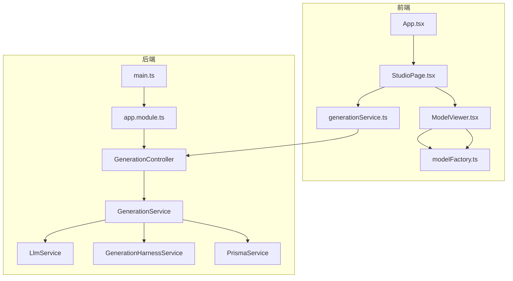
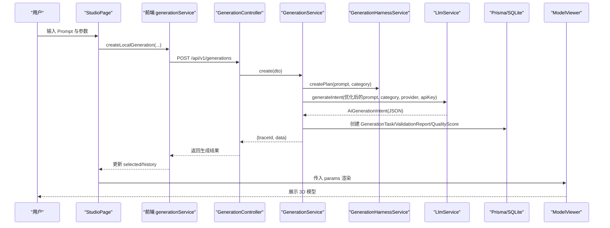
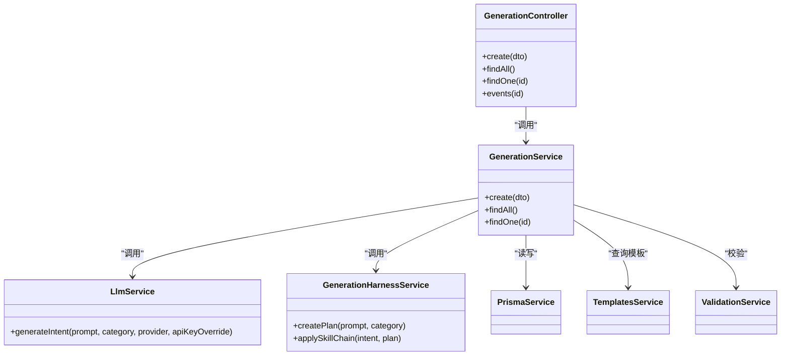
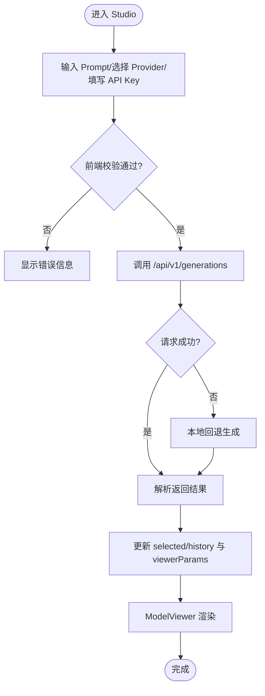
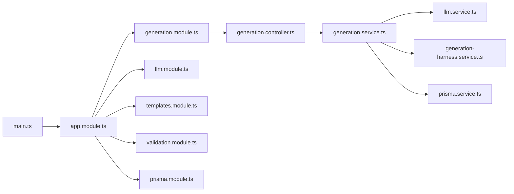

# 多代理编排系统

<cite>
**本文引用的文件**   
- [README.md](file://README.md)
- [package.json](file://package.json)
- [apps/api/src/main.ts](file://apps/api/src/main.ts)
- [apps/api/src/app.module.ts](file://apps/api/src/app.module.ts)
- [apps/api/src/modules/generation/generation.controller.ts](file://apps/api/src/modules/generation/generation.controller.ts)
- [apps/api/src/modules/generation/generation.service.ts](file://apps/api/src/modules/generation/generation.service.ts)
- [apps/api/src/modules/llm/llm.service.ts](file://apps/api/src/modules/llm/llm.service.ts)
- [apps/api/src/modules/generation/generation-harness.service.ts](file://apps/api/src/modules/generation/generation-harness.service.ts)
- [apps/api/src/common/json.ts](file://apps/api/src/common/json.ts)
- [prisma/schema.prisma](file://prisma/schema.prisma)
- [src/App.tsx](file://src/App.tsx)
- [src/modules/studio/pages/StudioPage.tsx](file://src/modules/studio/pages/StudioPage.tsx)
- [src/modules/studio/services/generationService.ts](file://src/modules/studio/services/generationService.ts)
- [src/modules/viewer/components/ModelViewer.tsx](file://src/modules/viewer/components/ModelViewer.tsx)
- [src/modules/viewer/utils/modelFactory.ts](file://src/modules/viewer/utils/modelFactory.ts)
</cite>

## 目录
1. [简介](#简介)
2. [项目结构](#项目结构)
3. [核心组件](#核心组件)
4. [架构总览](#架构总览)
5. [详细组件分析](#详细组件分析)
6. [依赖关系分析](#依赖关系分析)
7. [性能考量](#性能考量)
8. [故障排查指南](#故障排查指南)
9. [结论](#结论)
10. [附录](#附录)

## 简介
本仓库实现了一个“AI 驱动的实时 3D CAD / 参数化建模工作台”，通过自然语言生成可交互的 Three.js 商业级 3D 模型，支持多模型供应商、在线 API Key、模型导入与实时属性编辑。其关键特性包括：
- 多模型供应商（DeepSeek、Kimi、千问）统一适配 OpenAI-compatible 协议
- Harness 多 Agent 编排：提示词优化、结构规划、硬表面分件、材质分层、渲染质检
- 前端 Studio 工作台 + Three.js 实时预览
- 后端 NestJS 模块化服务 + Prisma/SQLite 持久化
- 在线 API Key 配置与本地回退机制

## 项目结构
整体采用前后端分离与模块化组织：
- 前端：React + TypeScript + Vite，包含 Studio 页面、Three.js 预览、共享组件与类型
- 后端：NestJS 应用，按功能划分模块（generation、llm、templates、validation、assets、feedback、health），Prisma 管理数据模型
- 文档：tech/doc 下提供多页 HTML 技术文档



图表来源
- [src/App.tsx:1-6](file://src/App.tsx#L1-L6)
- [src/modules/studio/pages/StudioPage.tsx:1-445](file://src/modules/studio/pages/StudioPage.tsx#L1-L445)
- [src/modules/studio/services/generationService.ts:1-132](file://src/modules/studio/services/generationService.ts#L1-L132)
- [src/modules/viewer/components/ModelViewer.tsx:1-307](file://src/modules/viewer/components/ModelViewer.tsx#L1-L307)
- [src/modules/viewer/utils/modelFactory.ts:1-800](file://src/modules/viewer/utils/modelFactory.ts#L1-L800)
- [apps/api/src/main.ts:1-23](file://apps/api/src/main.ts#L1-L23)
- [apps/api/src/app.module.ts:1-24](file://apps/api/src/app.module.ts#L1-L24)
- [apps/api/src/modules/generation/generation.controller.ts:1-36](file://apps/api/src/modules/generation/generation.controller.ts#L1-L36)
- [apps/api/src/modules/generation/generation.service.ts:1-309](file://apps/api/src/modules/generation/generation.service.ts#L1-L309)
- [apps/api/src/modules/llm/llm.service.ts:1-177](file://apps/api/src/modules/llm/llm.service.ts#L1-L177)
- [apps/api/src/modules/generation/generation-harness.service.ts:1-147](file://apps/api/src/modules/generation/generation-harness.service.ts#L1-L147)

章节来源
- [README.md:1-330](file://README.md#L1-L330)
- [package.json:1-65](file://package.json#L1-L65)

## 核心组件
- 前端入口与页面
  - App.tsx：挂载 Studio 页面
  - StudioPage.tsx：状态中枢，负责生成调用、历史记录、参数传递、主题与编排展示
- 生成链路
  - generationService.ts：前端请求封装与本地回退逻辑
  - GenerationController：REST 路由（POST/GET/:id/SSE）
  - GenerationService：品类推断、模板匹配、校验、LLM 调用、Harness 编排、结果持久化
  - LlmService：多供应商适配与 JSON 意图解析
  - GenerationHarnessService：多 Agent 计划与技能链增强
- 3D 渲染
  - ModelViewer.tsx：场景初始化、导入模型加载、OrbitControls、生命周期管理
  - modelFactory.ts：参数化模型工厂（车辆、建筑、飞行器、家具、首饰、手表等）
- 数据层
  - schema.prisma：模板、生成任务、验证报告、质量评分、资产版本、反馈等实体

章节来源
- [src/App.tsx:1-6](file://src/App.tsx#L1-L6)
- [src/modules/studio/pages/StudioPage.tsx:1-445](file://src/modules/studio/pages/StudioPage.tsx#L1-L445)
- [src/modules/studio/services/generationService.ts:1-132](file://src/modules/studio/services/generationService.ts#L1-L132)
- [apps/api/src/modules/generation/generation.controller.ts:1-36](file://apps/api/src/modules/generation/generation.controller.ts#L1-L36)
- [apps/api/src/modules/generation/generation.service.ts:1-309](file://apps/api/src/modules/generation/generation.service.ts#L1-L309)
- [apps/api/src/modules/llm/llm.service.ts:1-177](file://apps/api/src/modules/llm/llm.service.ts#L1-L177)
- [apps/api/src/modules/generation/generation-harness.service.ts:1-147](file://apps/api/src/modules/generation/generation-harness.service.ts#L1-L147)
- [src/modules/viewer/components/ModelViewer.tsx:1-307](file://src/modules/viewer/components/ModelViewer.tsx#L1-L307)
- [src/modules/viewer/utils/modelFactory.ts:1-800](file://src/modules/viewer/utils/modelFactory.ts#L1-L800)
- [prisma/schema.prisma:1-122](file://prisma/schema.prisma#L1-L122)

## 架构总览
系统由前端 Studio 工作台驱动，用户输入 Prompt 后，前端调用后端 /api/v1/generations，后端执行品类推断、模板选择、Prompt 优化、多 Agent 编排、LLM 结构化输出、指标计算与质量评分，并持久化到 SQLite；前端根据返回参数驱动 Three.js 渲染或优先显示导入模型。



图表来源
- [src/modules/studio/pages/StudioPage.tsx:163-190](file://src/modules/studio/pages/StudioPage.tsx#L163-L190)
- [src/modules/studio/services/generationService.ts:108-126](file://src/modules/studio/services/generationService.ts#L108-L126)
- [apps/api/src/modules/generation/generation.controller.ts:10-13](file://apps/api/src/modules/generation/generation.controller.ts#L10-L13)
- [apps/api/src/modules/generation/generation.service.ts:143-278](file://apps/api/src/modules/generation/generation.service.ts#L143-L278)
- [apps/api/src/modules/generation/generation-harness.service.ts:117-132](file://apps/api/src/modules/generation/generation-harness.service.ts#L117-L132)
- [apps/api/src/modules/llm/llm.service.ts:123-175](file://apps/api/src/modules/llm/llm.service.ts#L123-L175)
- [src/modules/viewer/components/ModelViewer.tsx:201-243](file://src/modules/viewer/components/ModelViewer.tsx#L201-L243)

## 详细组件分析

### 生成控制器与服务（后端）
- GenerationController
  - 暴露 REST 接口：POST 创建、GET 列表、GET/:id 详情、SSE 事件占位
- GenerationService
  - 职责：Prompt 校验、品类推断、模板匹配、代码占位与校验、LLM 调用、Harness 编排、指标与质量评分计算、持久化
  - 关键流程：
    - 校验 Prompt 与生成的占位代码
    - 基于 Prompt 与类别推断品类
    - 构建 Harness 计划并注入变体种子
    - 调用 LLM 获取结构化 AiGenerationIntent
    - 计算 metrics 与 qualityScore，写入数据库
    - 返回标准化结果对象
- LlmService
  - 职责：根据 provider 选择 baseUrl/model/key，发起 OpenAI-compatible 请求，解析 JSON 意图并做数值范围钳制与字段归一化
- GenerationHarnessService
  - 职责：压缩/优化 Prompt、构建多 Agent 执行记录、定义 3D 技能链步骤、对意图进行复杂度/密度提升与风格标注



图表来源
- [apps/api/src/modules/generation/generation.controller.ts:1-36](file://apps/api/src/modules/generation/generation.controller.ts#L1-L36)
- [apps/api/src/modules/generation/generation.service.ts:133-141](file://apps/api/src/modules/generation/generation.service.ts#L133-L141)
- [apps/api/src/modules/llm/llm.service.ts:117-121](file://apps/api/src/modules/llm/llm.service.ts#L117-L121)
- [apps/api/src/modules/generation/generation-harness.service.ts:115-146](file://apps/api/src/modules/generation/generation-harness.service.ts#L115-L146)

章节来源
- [apps/api/src/modules/generation/generation.controller.ts:1-36](file://apps/api/src/modules/generation/generation.controller.ts#L1-L36)
- [apps/api/src/modules/generation/generation.service.ts:1-309](file://apps/api/src/modules/generation/generation.service.ts#L1-L309)
- [apps/api/src/modules/llm/llm.service.ts:1-177](file://apps/api/src/modules/llm/llm.service.ts#L1-L177)
- [apps/api/src/modules/generation/generation-harness.service.ts:1-147](file://apps/api/src/modules/generation/generation-harness.service.ts#L1-L147)

### 前端 Studio 与渲染管线
- StudioPage
  - 维护 Prompt、类别、Provider、API Key、状态、历史、选中项与颜色主题
  - 触发生成流程，将结果写入 history 与 selected，并传递给 ModelViewer
- generationService
  - 尝试调用后端 /generations，失败时回退到本地模板生成，构造等效的 agents/skills/renderProfile 等字段
- ModelViewer
  - 初始化 Three.js 场景、灯光、网格、地面、OrbitControls
  - 若存在导入模型则优先加载 GLB/GLTF/OBJ/STL，否则使用 modelFactory 按类别生成参数化模型
  - 监听参数变化，动态重建模型并归一化坐标
- modelFactory
  - 提供多种品类模型构建函数（车辆、建筑、飞行器、家具、首饰、手表、道具、通用产品）
  - 支持材质预设、纹理贴图、倒角/圆角、连接件网络、技能可视化标记等



图表来源
- [src/modules/studio/pages/StudioPage.tsx:163-190](file://src/modules/studio/pages/StudioPage.tsx#L163-L190)
- [src/modules/studio/services/generationService.ts:108-126](file://src/modules/studio/services/generationService.ts#L108-L126)
- [src/modules/viewer/components/ModelViewer.tsx:201-243](file://src/modules/viewer/components/ModelViewer.tsx#L201-L243)
- [src/modules/viewer/utils/modelFactory.ts:404-446](file://src/modules/viewer/utils/modelFactory.ts#L404-L446)

章节来源
- [src/modules/studio/pages/StudioPage.tsx:1-445](file://src/modules/studio/pages/StudioPage.tsx#L1-L445)
- [src/modules/studio/services/generationService.ts:1-132](file://src/modules/studio/services/generationService.ts#L1-L132)
- [src/modules/viewer/components/ModelViewer.tsx:1-307](file://src/modules/viewer/components/ModelViewer.tsx#L1-L307)
- [src/modules/viewer/utils/modelFactory.ts:1-800](file://src/modules/viewer/utils/modelFactory.ts#L1-L800)

### 数据模型与持久化
- 模板 Template：用于品类匹配的默认提示词与复杂度策略
- 生成任务 GenerationTask：保存原始/规范化 Prompt、类别、模式、状态、生成代码与参数、解释、指标、时间戳等
- 验证报告 ValidationReport：是否通过、阻断原因、警告、复杂度摘要、AST 摘要
- 质量评分 QualityScore：总分、可渲染性、结构、提示词匹配、性能及细节
- 资产与版本 ModelAsset/ModelVersion：资产元信息与版本快照
- 反馈 Feedback：用户对任务的评分与评论

```mermaid
erDiagram
TEMPLATE {
string id PK
string name
string category
string description
string tags
string defaultPrompt
string complexity
string status
datetime createdAt
datetime updatedAt
}
GENERATION_TASK {
string id PK
string traceId UK
string prompt
string normalizedPrompt
string category
string mode
string status
string templateId FK
string generatedCode
string generatedParams
string explanation
string metrics
string validationReportId FK
string qualityScoreId FK
datetime startedAt
datetime completedAt
datetime createdAt
datetime updatedAt
}
VALIDATION_REPORT {
string id PK
string generationTaskId UK FK
boolean passed
string blockedReasons
string warnings
string complexity
string astSummary
datetime createdAt
}
QUALITY_SCORE {
string id PK
string generationTaskId UK FK
int totalScore
int renderabilityScore
int structureScore
int promptMatchScore
int performanceScore
string details
datetime createdAt
}
MODEL_ASSET {
string id PK
string name
string category
string prompt
string thumbnailUrl
string currentVersionId
string tags
string status
datetime createdAt
datetime updatedAt
}
MODEL_VERSION {
string id PK
string assetId FK
string generationTaskId FK
int versionNo
string code
string params
string modelJsonUrl
string screenshotUrl
string metrics
datetime createdAt
}
FEEDBACK {
string id PK
string generationTaskId FK
string rating
string comment
datetime createdAt
}
GENERATION_TASK ||--o| VALIDATION_REPORT : "has one"
GENERATION_TASK ||--o| QUALITY_SCORE : "has one"
MODEL_ASSET ||--o{ MODEL_VERSION : "contains"
GENERATION_TASK ||--o{ MODEL_VERSION : "produces"
```

图表来源
- [prisma/schema.prisma:10-122](file://prisma/schema.prisma#L10-L122)

章节来源
- [prisma/schema.prisma:1-122](file://prisma/schema.prisma#L1-L122)

## 依赖关系分析
- 模块装配
  - main.ts 设置全局前缀与校验管道，启动 AppModule
  - AppModule 注册 ConfigModule、PrismaModule 与各业务模块
- 运行时依赖
  - 前端依赖 React、Three.js、lucide-react、Tailwind 风格组件
  - 后端依赖 NestJS、@nestjs/config、class-validator/class-transformer、Prisma Client
- 外部集成
  - LLM 供应商通过环境变量或在线 API Key 注入，统一走 /chat/completions



图表来源
- [apps/api/src/main.ts:1-23](file://apps/api/src/main.ts#L1-L23)
- [apps/api/src/app.module.ts:1-24](file://apps/api/src/app.module.ts#L1-L24)
- [apps/api/src/modules/generation/generation.controller.ts:1-36](file://apps/api/src/modules/generation/generation.controller.ts#L1-L36)
- [apps/api/src/modules/generation/generation.service.ts:1-309](file://apps/api/src/modules/generation/generation.service.ts#L1-L309)
- [apps/api/src/modules/llm/llm.service.ts:1-177](file://apps/api/src/modules/llm/llm.service.ts#L1-L177)
- [apps/api/src/modules/generation/generation-harness.service.ts:1-147](file://apps/api/src/modules/generation/generation-harness.service.ts#L1-L147)

章节来源
- [apps/api/src/main.ts:1-23](file://apps/api/src/main.ts#L1-L23)
- [apps/api/src/app.module.ts:1-24](file://apps/api/src/app.module.ts#L1-L24)
- [package.json:1-65](file://package.json#L1-L65)

## 性能考量
- 渲染性能
  - 使用 PCFSoftShadowMap、ACES 色调映射与像素比限制，平衡画质与帧率
  - 模型归一化减少异常包围盒导致的相机定位问题
  - 纹理缓存避免重复加载
- 生成链路
  - 前端在 API 不可用时快速回退，保障体验
  - 后端对数值型参数进行钳制，降低极端值带来的几何爆炸风险
- 资源释放
  - 视图切换时主动 dispose 几何与材质，防止内存泄漏

[本节为通用指导，不直接分析具体文件]

## 故障排查指南
- 未配置 API Key
  - 现象：LLM 调用抛出未配置 Key 的错误
  - 处理：在前端左侧面板填写对应 Provider 的 Key，或在 .env 中配置
- 网络或鉴权失败
  - 现象：请求返回非 2xx，日志打印失败片段
  - 处理：检查 Key、baseUrl、模型名称与网络连通性
- 生成任务不存在
  - 现象：GET /:id 返回未找到
  - 处理：确认任务 ID 是否正确
- 前端回退
  - 现象：后端不可用，控制台打印回退日志
  - 处理：检查后端端口与跨域配置，或继续使用本地回退模式

章节来源
- [apps/api/src/modules/llm/llm.service.ts:123-175](file://apps/api/src/modules/llm/llm.service.ts#L123-L175)
- [apps/api/src/modules/generation/generation.service.ts:293-307](file://apps/api/src/modules/generation/generation.service.ts#L293-L307)
- [src/modules/studio/services/generationService.ts:118-126](file://src/modules/studio/services/generationService.ts#L118-L126)

## 结论
该系统以“多 Agent 编排 + 结构化 LLM 输出 + 参数化 3D 建模”为核心，实现了从自然语言到可交互 3D 原型的端到端工作流。通过模块化设计与稳健的回退机制，既保证了生产可用性与可观测性，也为后续扩展更多品类与渲染能力提供了良好基础。

[本节为总结性内容，不直接分析具体文件]

## 附录
- 快速开始与脚本说明见 package.json scripts
- 开发者文档位于 tech/doc 下的多页 HTML

章节来源
- [package.json:6-18](file://package.json#L6-L18)
- [README.md:256-268](file://README.md#L256-L268)