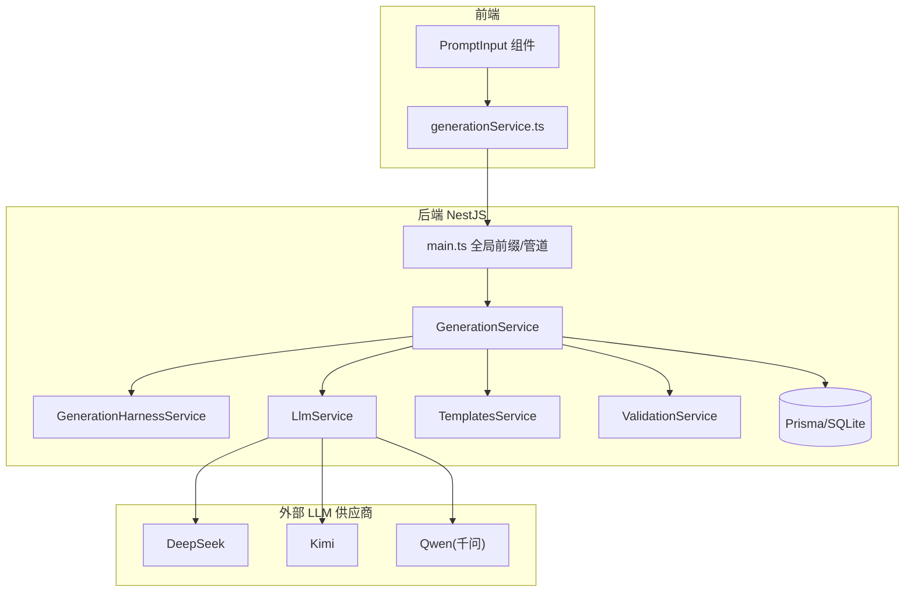
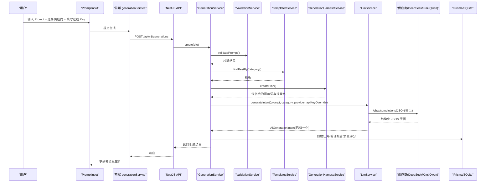
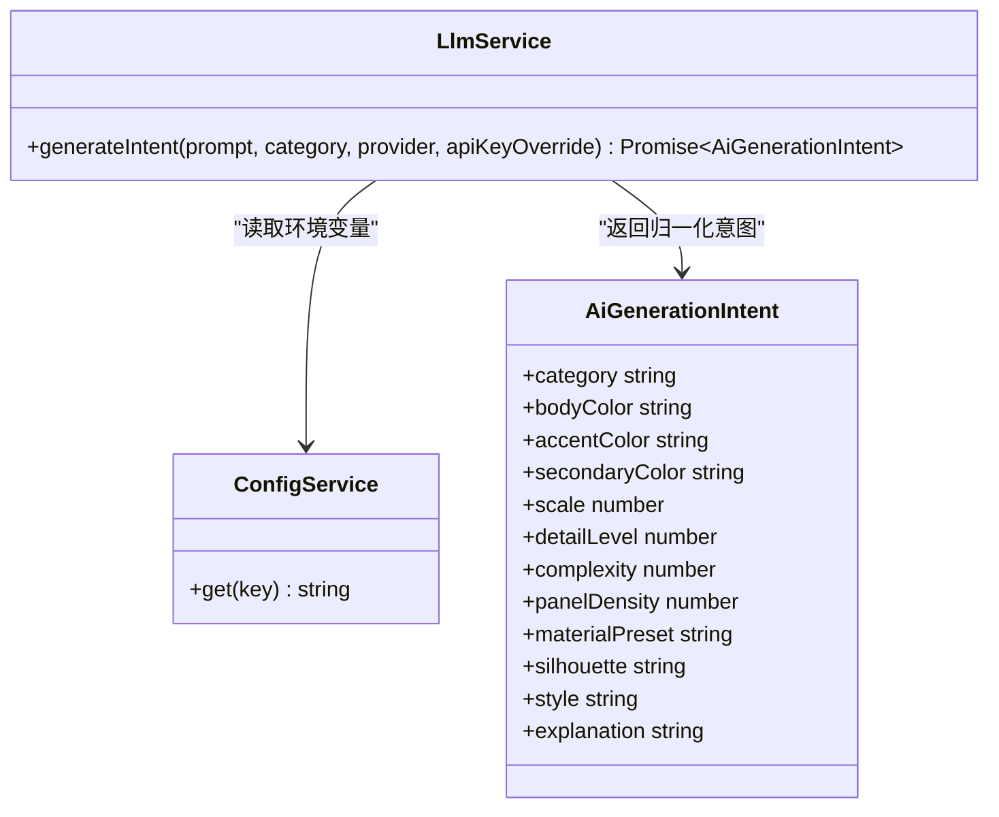
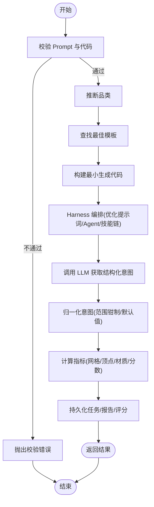
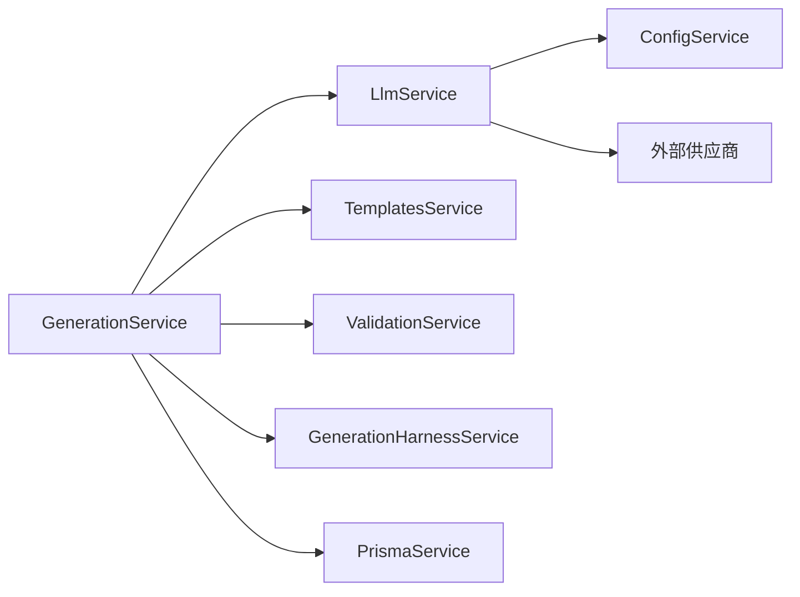

# 多供应商 LLM 集成

<cite>
**本文引用的文件**   
- [README.md](file://README.md)
- [apps/api/src/main.ts](file://apps/api/src/main.ts)
- [apps/api/src/modules/llm/llm.service.ts](file://apps/api/src/modules/llm/llm.service.ts)
- [apps/api/src/modules/llm/llm.module.ts](file://apps/api/src/modules/llm/llm.module.ts)
- [apps/api/src/modules/generation/generation.service.ts](file://apps/api/src/modules/generation/generation.service.ts)
- [apps/api/src/modules/generation/generation-harness.service.ts](file://apps/api/src/modules/generation/generation-harness.service.ts)
- [apps/api/src/modules/generation/dto/create-generation.dto.ts](file://apps/api/src/modules/generation/dto/create-generation.dto.ts)
- [apps/api/src/modules/templates/templates.service.ts](file://apps/api/src/modules/templates/templates.service.ts)
- [apps/api/src/modules/validation/validation.service.ts](file://apps/api/src/modules/validation/validation.service.ts)
- [src/modules/studio/services/generationService.ts](file://src/modules/studio/services/generationService.ts)
- [src/modules/studio/components/PromptInput.tsx](file://src/modules/studio/components/PromptInput.tsx)
- [prisma/schema.prisma](file://prisma/schema.prisma)
- [package.json](file://package.json)
</cite>

## 目录
1. [简介](#简介)
2. [项目结构](#项目结构)
3. [核心组件](#核心组件)
4. [架构总览](#架构总览)
5. [详细组件分析](#详细组件分析)
6. [依赖关系分析](#依赖关系分析)
7. [性能与可扩展性](#性能与可扩展性)
8. [故障排查指南](#故障排查指南)
9. [结论](#结论)
10. [附录](#附录)

## 简介
本项目为“AI 驱动的实时 3D CAD / 参数化建模工作台”，后端通过统一的 OpenAI-compatible 协议对接多个大模型供应商（DeepSeek、Kimi、千问），前端提供在线 API Key 配置，支持自然语言生成可交互的 Three.js 商业级 3D 模型。本技术文档聚焦于“多供应商 LLM 集成”的设计与实现，涵盖请求路由、供应商适配、提示词编排、结果归一化、错误处理与前后端协作流程。

## 项目结构
围绕多供应商 LLM 集成的关键路径：
- 前端 Studio 选择供应商与在线 Key，调用后端生成接口
- 后端 Generation 服务负责校验、模板匹配、Harness 编排、LLM 调用、结果持久化
- LLM 服务统一封装各供应商 baseURL、model、API Key 与 JSON 输出协议
- Prisma 持久化任务、验证报告、质量评分等元数据

图表来源
- [apps/api/src/main.ts:1-23](file://apps/api/src/main.ts#L1-L23)
- [apps/api/src/modules/generation/generation.service.ts:133-278](file://apps/api/src/modules/generation/generation.service.ts#L133-L278)
- [apps/api/src/modules/llm/llm.service.ts:117-176](file://apps/api/src/modules/llm/llm.service.ts#L117-L176)
- [src/modules/studio/services/generationService.ts:108-126](file://src/modules/studio/services/generationService.ts#L108-L126)
- [src/modules/studio/components/PromptInput.tsx:76-172](file://src/modules/studio/components/PromptInput.tsx#L76-L172)

章节来源
- [README.md:84-118](file://README.md#L84-L118)
- [package.json:6-18](file://package.json#L6-L18)

## 核心组件
- LlmService：统一 DeepSeek/Kimi/Qwen 的 OpenAI-compatible 调用，解析结构化 JSON 意图并做数值范围钳制与默认值回退
- GenerationService：端到端生成主流程，包含输入校验、类别推断、模板匹配、Harness 编排、LLM 调用、指标计算、结果持久化
- GenerationHarnessService：提示词优化、多 Agent 执行说明与技能链增强，提升最终参数的细节密度与渲染可用性
- TemplatesService：按品类匹配最佳模板，保障不同品类有合适的默认结构与复杂度
- ValidationService：Prompt 长度限制与代码安全扫描（关键词黑名单）
- 前端 PromptInput/generationService：在线 Key 收集、供应商选择、失败回退到本地模板

章节来源
- [apps/api/src/modules/llm/llm.service.ts:117-176](file://apps/api/src/modules/llm/llm.service.ts#L117-L176)
- [apps/api/src/modules/generation/generation.service.ts:133-278](file://apps/api/src/modules/generation/generation.service.ts#L133-L278)
- [apps/api/src/modules/generation/generation-harness.service.ts:115-146](file://apps/api/src/modules/generation/generation-harness.service.ts#L115-L146)
- [apps/api/src/modules/templates/templates.service.ts:40-98](file://apps/api/src/modules/templates/templates.service.ts#L40-L98)
- [apps/api/src/modules/validation/validation.service.ts:20-61](file://apps/api/src/modules/validation/validation.service.ts#L20-L61)
- [src/modules/studio/components/PromptInput.tsx:76-172](file://src/modules/studio/components/PromptInput.tsx#L76-L172)
- [src/modules/studio/services/generationService.ts:108-126](file://src/modules/studio/services/generationService.ts#L108-L126)

## 架构总览
下图展示一次完整的“多供应商 LLM 集成”调用序列，包括在线 Key 优先、失败回退、结果归一化与持久化。

图表来源
- [apps/api/src/main.ts:6-18](file://apps/api/src/main.ts#L6-L18)
- [apps/api/src/modules/generation/generation.service.ts:143-278](file://apps/api/src/modules/generation/generation.service.ts#L143-L278)
- [apps/api/src/modules/llm/llm.service.ts:123-176](file://apps/api/src/modules/llm/llm.service.ts#L123-L176)
- [src/modules/studio/services/generationService.ts:108-126](file://src/modules/studio/services/generationService.ts#L108-L126)
- [src/modules/studio/components/PromptInput.tsx:76-172](file://src/modules/studio/components/PromptInput.tsx#L76-L172)

## 详细组件分析

### LlmService：多供应商适配与 JSON 意图归一化
- 供应商解析：根据传入 provider 或默认 deepseek，映射至具体 baseUrl/model/keyName
- Key 优先级：前端在线 Key 优先，未提供则回退环境变量
- 请求构造：OpenAI-compatible /chat/completions，强制 response_format=JSON，系统提示词约束字段与取值范围
- 响应解析：从 choices[0].message.content 提取 JSON（支持 fenced 或首尾括号定位），再归一化为 AiGenerationIntent
- 容错策略：网络/鉴权失败抛出 BadRequestException；解析异常记录日志并抛错

图表来源
- [apps/api/src/modules/llm/llm.service.ts:117-176](file://apps/api/src/modules/llm/llm.service.ts#L117-L176)
- [apps/api/src/modules/llm/llm.service.ts:4-32](file://apps/api/src/modules/llm/llm.service.ts#L4-L32)

章节来源
- [apps/api/src/modules/llm/llm.service.ts:77-115](file://apps/api/src/modules/llm/llm.service.ts#L77-L115)
- [apps/api/src/modules/llm/llm.service.ts:123-176](file://apps/api/src/modules/llm/llm.service.ts#L123-L176)

### GenerationService：生成主流程与多 Agent 编排
- 输入校验：Prompt 长度与内容安全检查
- 类别推断：基于关键词与短语抽取，得到目标品类
- 模板匹配：按品类选择最佳模板，构建最小可用生成代码
- Harness 编排：优化提示词、定义 Agent 执行步骤与技能链
- LLM 调用：注入变体种子，确保同目标的不同结构/材质/细节组合
- 指标计算：按品类与复杂度估算网格数、顶点数、材质数与质量分
- 持久化：保存任务、验证报告、质量评分，并返回标准化结果

图表来源
- [apps/api/src/modules/generation/generation.service.ts:143-278](file://apps/api/src/modules/generation/generation.service.ts#L143-L278)
- [apps/api/src/modules/generation/generation-harness.service.ts:115-146](file://apps/api/src/modules/generation/generation-harness.service.ts#L115-L146)
- [apps/api/src/modules/validation/validation.service.ts:20-61](file://apps/api/src/modules/validation/validation.service.ts#L20-L61)

章节来源
- [apps/api/src/modules/generation/generation.service.ts:10-85](file://apps/api/src/modules/generation/generation.service.ts#L10-L85)
- [apps/api/src/modules/generation/generation.service.ts:133-278](file://apps/api/src/modules/generation/generation.service.ts#L133-L278)

### GenerationHarnessService：提示词优化与技能链增强
- 提示词压缩与目标锁定：去除多余空白，抽取目标对象，必要时补充“商业级硬表面 CAD”约束
- Agent 执行说明：Prompt Architect、Structure Agent、Surface Detail Agent、Material Agent、Quality Agent
- 技能链：轮廓粗模→硬表面分件→倒角可读性→材质分层→渲染质检（珠宝/手表调整顺序）
- 应用增强：在 detailLevel/complexity/panelDensity 上适度提升，并在 style/explanation 中标注 multi-agent-skill-chain

章节来源
- [apps/api/src/modules/generation/generation-harness.service.ts:31-109](file://apps/api/src/modules/generation/generation-harness.service.ts#L31-L109)
- [apps/api/src/modules/generation/generation-harness.service.ts:115-146](file://apps/api/src/modules/generation/generation-harness.service.ts#L115-L146)

### TemplatesService：模板库与品类匹配
- 启动时 upsert 种子模板，保证数据库存在基础模板
- 按品类关键字归一化，查询发布状态的最佳模板，兜底返回任意已发布模板

章节来源
- [apps/api/src/modules/templates/templates.service.ts:40-98](file://apps/api/src/modules/templates/templates.service.ts#L40-L98)

### ValidationService：Prompt 与代码安全校验
- Prompt 校验：空值、超长警告
- 代码校验：关键词黑名单（eval、Function、fetch、XMLHttpRequest 等），避免不安全执行

章节来源
- [apps/api/src/modules/validation/validation.service.ts:20-61](file://apps/api/src/modules/validation/validation.service.ts#L20-L61)

### 前端协作：在线 Key 与回退机制
- PromptInput：提供供应商下拉、在线 Key 输入框、模型导入入口
- generationService：优先调用后端 /generations；若网络不可用，回退到本地模板生成，模拟完整结果结构

章节来源
- [src/modules/studio/components/PromptInput.tsx:76-172](file://src/modules/studio/components/PromptInput.tsx#L76-L172)
- [src/modules/studio/services/generationService.ts:108-126](file://src/modules/studio/services/generationService.ts#L108-L126)

## 依赖关系分析
- 模块耦合
  - GenerationService 依赖 LlmService、TemplatesService、ValidationService、GenerationHarnessService、PrismaService
  - LlmModule 仅暴露 LlmService，便于跨模块复用
- 外部依赖
  - 供应商通过 fetch 访问 OpenAI-compatible 接口
  - Prisma 使用 SQLite 作为存储后端
- 潜在循环依赖
  - 当前未见循环引用；GenerationService 单向依赖其他服务

图表来源
- [apps/api/src/modules/generation/generation.service.ts:133-141](file://apps/api/src/modules/generation/generation.service.ts#L133-L141)
- [apps/api/src/modules/llm/llm.module.ts:1-9](file://apps/api/src/modules/llm/llm.module.ts#L1-L9)
- [apps/api/src/modules/llm/llm.service.ts:117-121](file://apps/api/src/modules/llm/llm.service.ts#L117-L121)

章节来源
- [apps/api/src/modules/llm/llm.module.ts:1-9](file://apps/api/src/modules/llm/llm.module.ts#L1-L9)
- [apps/api/src/modules/generation/generation.service.ts:133-141](file://apps/api/src/modules/generation/generation.service.ts#L133-L141)

## 性能与可扩展性
- 并发与超时
  - 当前使用原生 fetch 同步等待，建议在网关或服务层增加超时与重试策略
- 缓存
  - 对相同 prompt+provider+apiKey 的意图可考虑短期缓存，减少重复 LLM 调用
- 批处理
  - 批量生成时可合并模板匹配与指标计算逻辑，降低 I/O 次数
- 扩展新供应商
  - 在 resolveProviderConfig 中新增分支，注册 keyName/baseUrl/model，并在 DTO 校验白名单中添加
- 资源控制
  - 结合 metrics 估算网格/顶点上限，避免极端复杂度过高导致前端卡顿

[本节为通用建议，无需源码引用]

## 故障排查指南
- 未配置 API Key
  - 现象：后端抛出未配置供应商 Key 的错误
  - 处理：在前端在线 Key 面板填写对应供应商 Key，或在 .env 设置相应变量
- 供应商请求失败
  - 现象：HTTP 非 2xx 或网络异常
  - 处理：检查 key、baseUrl、model 名称与网络连通性；查看后端日志中的错误片段
- JSON 解析失败
  - 现象：choices.message.content 无法解析为 JSON
  - 处理：确认供应商返回格式；必要时放宽 extractJson 策略或要求供应商启用 strict JSON 模式
- 前端回退
  - 现象：后端不可用时前端自动回退本地模板
  - 处理：确认后端端口与 CORS 配置；检查浏览器控制台错误信息

章节来源
- [apps/api/src/modules/llm/llm.service.ts:123-176](file://apps/api/src/modules/llm/llm.service.ts#L123-L176)
- [src/modules/studio/services/generationService.ts:108-126](file://src/modules/studio/services/generationService.ts#L108-L126)

## 结论
本项目在多供应商 LLM 集成方面采用“统一适配器 + 结构化 JSON 输出 + 归一化意图”的模式，配合 Harness 多 Agent 编排与模板库，实现了稳定、可解释且可扩展的生成链路。前端在线 Key 提升了易用性与安全性，后端的校验与持久化保障了可观测性与可追溯性。后续可在并发控制、缓存、限流与更多供应商接入方面持续演进。

## 附录

### API 契约与 DTO
- 请求体 CreateGenerationDto
  - prompt: 字符串，必填，1-2000 字符
  - category: 字符串，必填，1-80 字符
  - llmProvider: 可选，枚举 deepseek/kimi/qwen
  - mode: 可选，枚举 auto/template/code/hybrid
  - llmApiKeys: 可选，Record<string,string>，键名与供应商一致
  - projectId: 可选，字符串

章节来源
- [apps/api/src/modules/generation/dto/create-generation.dto.ts:1-31](file://apps/api/src/modules/generation/dto/create-generation.dto.ts#L1-L31)

### 数据模型（Prisma）
- Template：模板库
- GenerationTask：生成任务主表
- ValidationReport：验证报告
- QualityScore：质量评分
- ModelAsset/ModelVersion：资产与版本
- Feedback：用户反馈

章节来源
- [prisma/schema.prisma:10-122](file://prisma/schema.prisma#L10-L122)

### 运行与脚本
- 开发：同时启动 Web 与 API
- 构建：分别构建 Web 与 API
- Prisma：生成客户端、推送 schema、打开 Studio

章节来源
- [package.json:6-18](file://package.json#L6-L18)