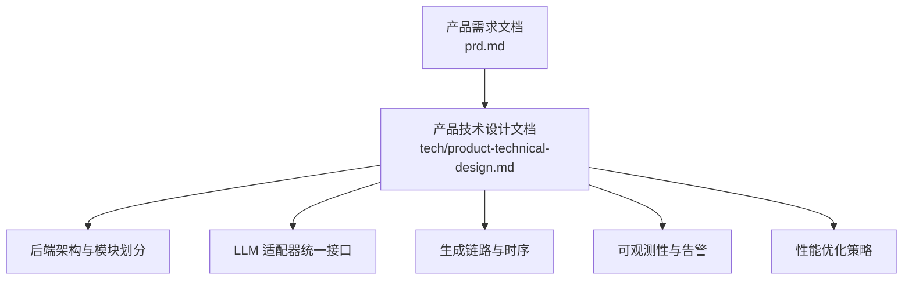
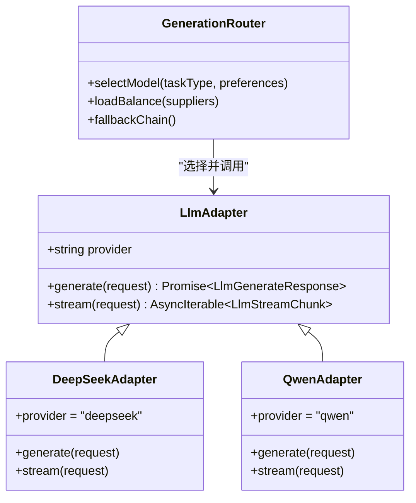
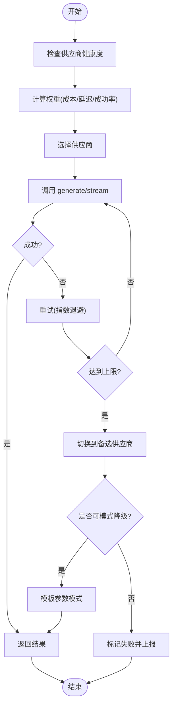
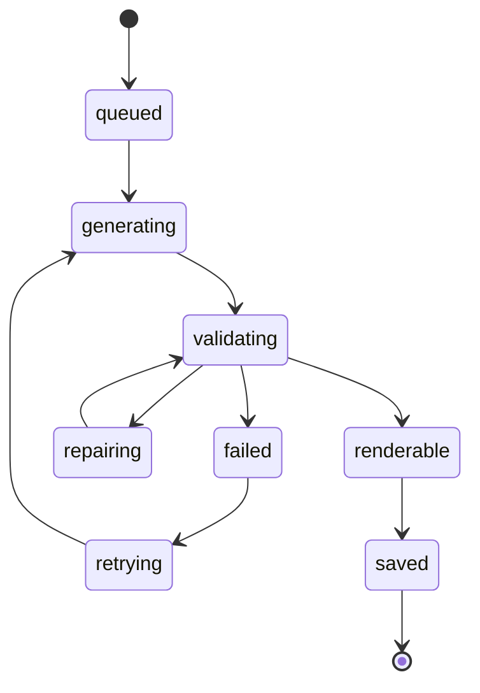
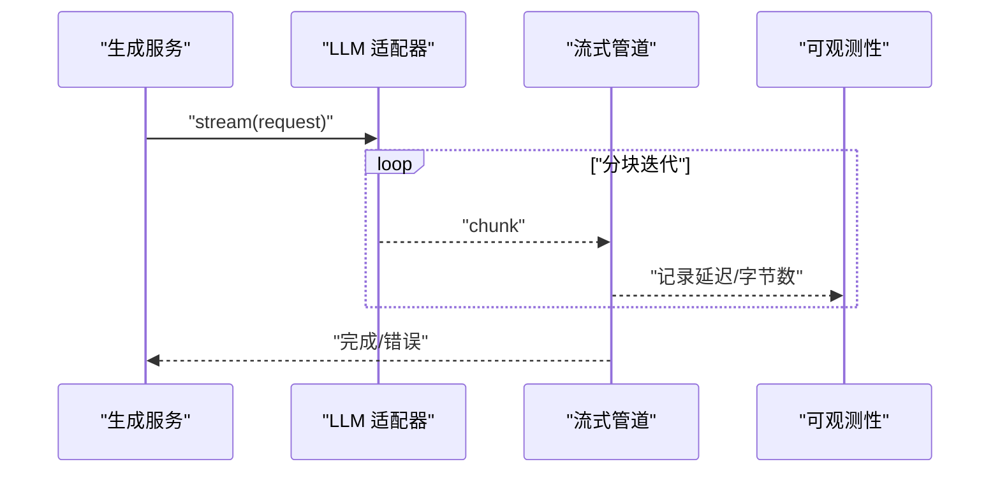
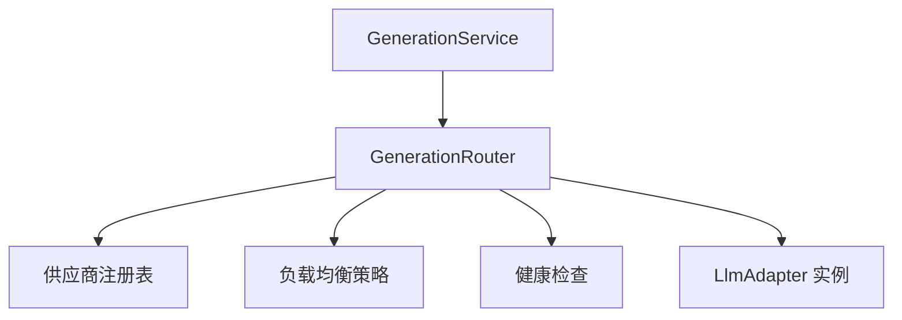
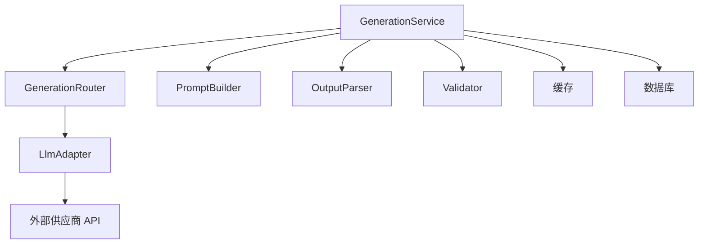
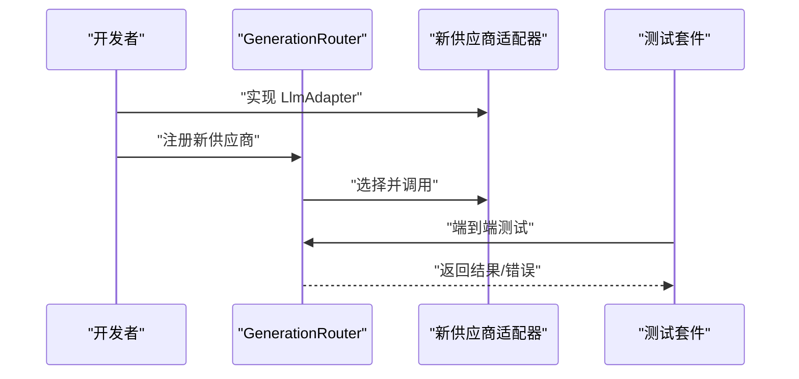

# 多模型适配器

<cite>
**本文引用的文件**
- [产品技术设计文档](file://tech/product-technical-design.md)
- [产品需求文档](file://prd.md)
</cite>

## 目录
1. [引言](#引言)
2. [项目结构](#项目结构)
3. [核心组件](#核心组件)
4. [架构总览](#架构总览)
5. [详细组件分析](#详细组件分析)
6. [依赖关系分析](#依赖关系分析)
7. [性能与成本优化](#性能与成本优化)
8. [故障排查指南](#故障排查指南)
9. [结论](#结论)
10. [附录：新增供应商接入示例](#附录新增供应商接入示例)

## 引言
本文件围绕 ApexForge 的多模型适配器系统，系统化阐述 LlmAdapter 接口设计与统一调用协议，覆盖 DeepSeek、Qwen 等供应商适配思路；说明模型选择策略、负载均衡算法、失败重试机制与降级策略；记录各模型的配置参数、能力差异与最佳使用场景；并结合生成路由器的集成方式，解释流式响应与错误映射。同时给出面向初学者的渐进式理解路径，以及为有经验的开发者提供的深度实现建议，重点聚焦成本优化、延迟控制与并发管理。

## 项目结构
当前仓库包含两份关键文档：
- 产品需求文档：描述业务目标、数据流与安全策略等整体背景。
- 产品技术设计文档：定义总体架构、模块划分、LLM Adapter 统一接口、生成链路、可观测性与性能优化等。



**图表来源**
- [产品技术设计文档:1-120](file://tech/product-technical-design.md#L1-L120)
- [产品需求文档:1-168](file://prd.md#L1-L168)

**章节来源**
- [产品需求文档:1-168](file://prd.md#L1-L168)
- [产品技术设计文档:1-120](file://tech/product-technical-design.md#L1-L120)

## 核心组件
- LlmAdapter 统一接口：抽象不同供应商的生成与流式能力，屏蔽底层差异。
- GenerationRouter（生成路由器）：根据任务类型、成本与延迟偏好选择具体模型或供应商。
- PromptBuilder：组装 System Prompt、Few-shot 示例与模板上下文。
- OutputParser：将 LLM 输出解析为结构化协议（模式、模板、参数、代码）。
- Validator/RepairService/QualityScorer：安全校验、修复与质量评分闭环。
- Observability：traceId、日志字段、指标与告警贯穿全链路。

**章节来源**
- [产品技术设计文档:574-631](file://tech/product-technical-design.md#L574-L631)
- [产品技术设计文档:327-426](file://tech/product-technical-design.md#L327-L426)
- [产品技术设计文档:868-908](file://tech/product-technical-design.md#L868-L908)

## 架构总览
下图展示了从前端到 LLM 适配器的端到端流程，包括缓存命中、模板匹配、生成、校验与结果持久化。

```mermaid
sequenceDiagram
participant FE as "前端"
participant API as "API 网关"
participant GEN as "生成服务"
participant CACHE as "相似提示词缓存"
participant TPL as "模板服务"
participant ROUTER as "生成路由器"
participant PROMPT as "Prompt 编排器"
participant ADAPTER as "LLM 适配器"
participant PARSER as "输出解析器"
participant VAL as "校验器"
participant DB as "数据库"
participant BOX as "沙箱执行"
FE->>API : "POST /api/v1/generations"
API->>GEN : "创建生成任务"
GEN->>CACHE : "查询相似提示词"
alt "缓存命中"
CACHE-->>GEN : "返回缓存结果"
else "缓存未命中"
GEN->>TPL : "查找候选模板"
TPL-->>GEN : "候选模板列表"
GEN->>ROUTER : "选择模型/供应商"
ROUTER-->>PROMPT : "返回选择结果"
PROMPT->>ADAPTER : "generate/stream"
ADAPTER-->>PARSER : "原始输出"
PARSER-->>VAL : "结构化协议"
VAL-->>GEN : "校验报告"
end
GEN->>DB : "持久化任务与结果"
GEN-->>API : "返回结果"
API-->>FE : "生成载荷"
FE->>BOX : "在 iframe 中执行"
BOX-->>FE : "模型 JSON 或错误"
```

**图表来源**
- [产品技术设计文档:359-390](file://tech/product-technical-design.md#L359-L390)

**章节来源**
- [产品技术设计文档:327-426](file://tech/product-technical-design.md#L327-L426)
- [产品技术设计文档:359-390](file://tech/product-technical-design.md#L359-L390)

## 详细组件分析

### LlmAdapter 接口与统一调用协议
- 统一接口定义：
  - provider：标识供应商名称。
  - generate(request)：同步生成，返回标准化响应。
  - stream?(request)：可选流式接口，返回分块迭代器。
- 请求/响应契约：
  - 输入包含任务类型、上下文、温度、最大 token 等。
  - 输出遵循结构化协议（模式、模板 ID、参数、代码、解释与警告）。
- 供应商扩展点：
  - 每个供应商实现 LlmAdapter，封装鉴权、限流、重试、超时与错误映射。
  - 通过注册表暴露给 GenerationRouter 进行动态选择。



**图表来源**
- [产品技术设计文档:611-631](file://tech/product-technical-design.md#L611-L631)

**章节来源**
- [产品技术设计文档:611-631](file://tech/product-technical-design.md#L611-L631)

### 模型选择策略与负载均衡
- 选择维度：
  - 任务类型：代码生成、参数生成、Prompt 改写。
  - 成本与延迟：优先低成本低延迟模型，必要时回退高质量模型。
  - 可用性：健康检查与熔断状态影响选择权重。
- 负载均衡算法：
  - 加权轮询：按供应商配额与历史成功率计算权重。
  - 延迟感知：对高延迟供应商降权，避免雪崩。
  - 失败率自适应：连续失败触发快速回退与冷却时间。
- 降级策略：
  - 主备链：首选模型失败后自动切换备选供应商。
  - 模式降级：从“代码模式”降级为“模板参数模式”，减少 LLM 调用。
  - 结果降级：当校验失败时进入 RepairService 尝试修复并重试。



**图表来源**
- [产品技术设计文档:611-631](file://tech/product-technical-design.md#L611-L631)

**章节来源**
- [产品技术设计文档:611-631](file://tech/product-technical-design.md#L611-L631)

### 失败重试机制与错误映射
- 重试策略：
  - 指数退避：初始间隔短，逐步增加，避免拥塞。
  - 最大重试次数：受套餐与配额限制。
  - 条件重试：仅对瞬态错误（网络抖动、限流）重试。
- 错误映射：
  - 供应商错误码映射为平台统一错误码。
  - 记录 traceId、provider、errorCode、errorMessage 便于追踪。
- 状态机联动：
  - 失败进入 retrying 状态，成功后继续 validating 流程。



**图表来源**
- [产品技术设计文档:340-357](file://tech/product-technical-design.md#L340-L357)

**章节来源**
- [产品技术设计文档:340-357](file://tech/product-technical-design.md#L340-L357)

### 流式响应处理
- 流式接口：
  - LlmAdapter.stream 返回分块迭代器，支持增量拼接与中断。
- 前端集成：
  - SSE/WebSocket 推送事件，前端实时展示进度与中间结果。
- 错误处理：
  - 流中断时触发重试或降级，保证用户体验。



**图表来源**
- [产品技术设计文档:611-631](file://tech/product-technical-design.md#L611-L631)

**章节来源**
- [产品技术设计文档:611-631](file://tech/product-technical-design.md#L611-L631)

### 与生成路由器的集成
- 路由器职责：
  - 根据任务类型与偏好选择供应商。
  - 维护供应商注册表与健康状态。
  - 协调重试与降级。
- 集成点：
  - GenerationService 调用 GenerationRouter 获取具体 LlmAdapter。
  - Router 注入负载均衡与熔断策略。



**图表来源**
- [产品技术设计文档:594-610](file://tech/product-technical-design.md#L594-L610)

**章节来源**
- [产品技术设计文档:594-610](file://tech/product-technical-design.md#L594-L610)

### 配置参数、能力差异与最佳使用场景
- 配置参数（通用）：
  - temperature：控制创造性与稳定性。
  - maxTokens：限制输出长度。
  - timeoutMs：调用超时阈值。
  - rateLimit：并发与速率限制。
- 供应商能力差异（概念性说明）：
  - DeepSeek：代码生成能力强，适合复杂 Three.js 函数生成。
  - Qwen：中文语义理解好，适合参数生成与 Prompt 改写。
- 最佳使用场景：
  - 模板参数生成：优先 Qwen，成本低、速度快。
  - 自由代码生成：优先 DeepSeek，质量更高但成本较高。
  - 混合模式：先模板再局部代码补充，平衡质量与成本。

**章节来源**
- [产品技术设计文档:611-631](file://tech/product-technical-design.md#L611-L631)
- [产品技术设计文档:327-426](file://tech/product-technical-design.md#L327-L426)

## 依赖关系分析
- 模块耦合：
  - GenerationService 依赖 GenerationRouter、PromptBuilder、LlmAdapter、OutputParser、Validator。
  - LlmAdapter 与外部供应商解耦，通过统一接口访问。
- 外部依赖：
  - 缓存（Redis）、数据库（PostgreSQL/SQLite）、对象存储（S3/MinIO/OSS）。
- 潜在循环依赖：
  - 通过接口与注册表降低直接耦合，避免循环引用。



**图表来源**
- [产品技术设计文档:594-610](file://tech/product-technical-design.md#L594-L610)

**章节来源**
- [产品技术设计文档:594-610](file://tech/product-technical-design.md#L594-L610)

## 性能与成本优化
- 前端优化：
  - 按需加载 Three.js runtime，大模型解析移至 Worker。
  - 旧模型释放 geometry/material/texture，避免内存泄漏。
- 后端优化：
  - 相似 Prompt 缓存复用，减少 LLM 调用。
  - 模板模式跳过代码生成，改为参数生成，显著降低成本与延迟。
  - 异步化生成任务，避免长连接占用。
  - 供应商并发与熔断控制，防止雪崩。
- 数据库优化：
  - 索引优化与大字段迁移至对象存储，提升查询与写入性能。

**章节来源**
- [产品技术设计文档:933-960](file://tech/product-technical-design.md#L933-L960)

## 故障排查指南
- 可观测性：
  - 全链路 traceId 贯穿前端、网关、生成服务、适配器、校验器、数据库与沙箱。
  - 日志字段包含 provider、promptVersion、generationMode、latencyMs、status、errorCode、qualityScore。
- 告警规则：
  - 生成失败率过高、LLM 延迟过高、校验失败突增、沙箱超时突增、API 错误率过高。
- 常见错误分类：
  - SANDBOX_TIMEOUT、SANDBOX_RUNTIME_ERROR、MODEL_JSON_INVALID、MODEL_TOO_COMPLEX、MODEL_EMPTY。

**章节来源**
- [产品技术设计文档:868-908](file://tech/product-technical-design.md#L868-L908)
- [产品技术设计文档:508-517](file://tech/product-technical-design.md#L508-L517)

## 结论
ApexForge 的多模型适配器系统通过 LlmAdapter 统一接口与 GenerationRouter 智能选择，实现了多供应商的灵活接入与稳定运行。结合缓存、模板模式、异步化与熔断策略，系统在成本、延迟与可靠性之间取得良好平衡。完善的可观测性与告警体系为生产环境提供了强有力的保障。

## 附录：新增供应商接入示例
以下以“添加一个新的 LLM 供应商”为例，说明如何基于现有接口与路由器扩展新供应商。

步骤概览：
- 实现 LlmAdapter 接口：
  - 定义 provider 标识。
  - 实现 generate 与可选 stream 方法。
  - 封装鉴权、限流、超时与错误映射。
- 注册到供应商注册表：
  - 在启动时向 GenerationRouter 注册新供应商实例。
- 配置选择策略：
  - 在路由器中选择逻辑中加入新供应商的权重与降级顺序。
- 测试与验证：
  - 单元测试覆盖 generate/stream、重试与降级。
  - 集成测试验证端到端流程与可观测性。



**图表来源**
- [产品技术设计文档:611-631](file://tech/product-technical-design.md#L611-L631)

**章节来源**
- [产品技术设计文档:611-631](file://tech/product-technical-design.md#L611-L631)