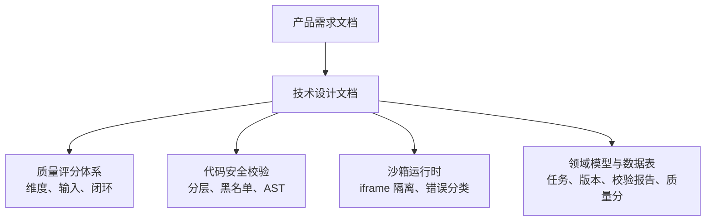
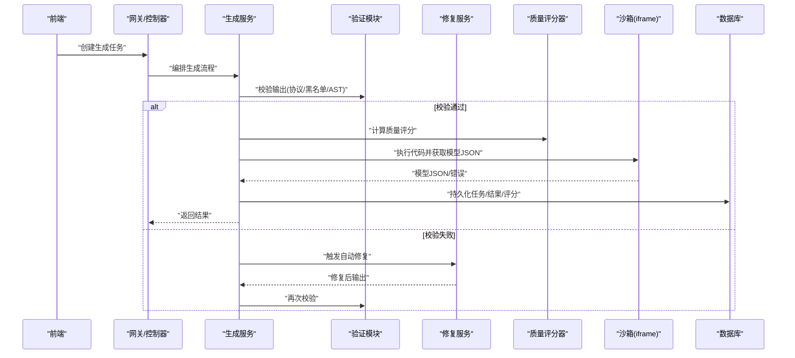
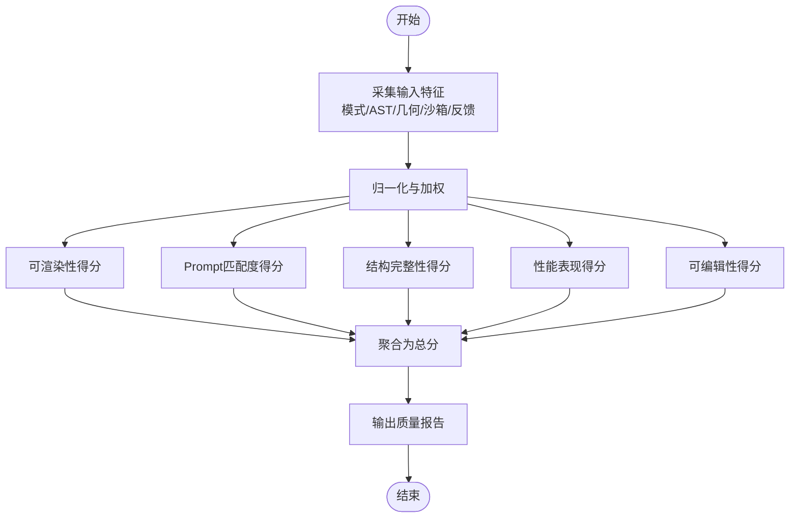
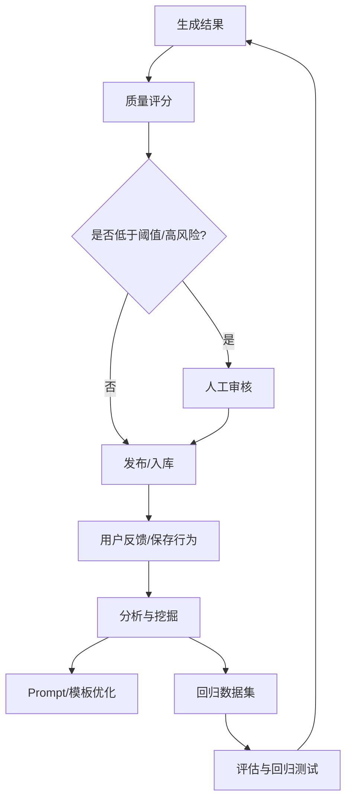
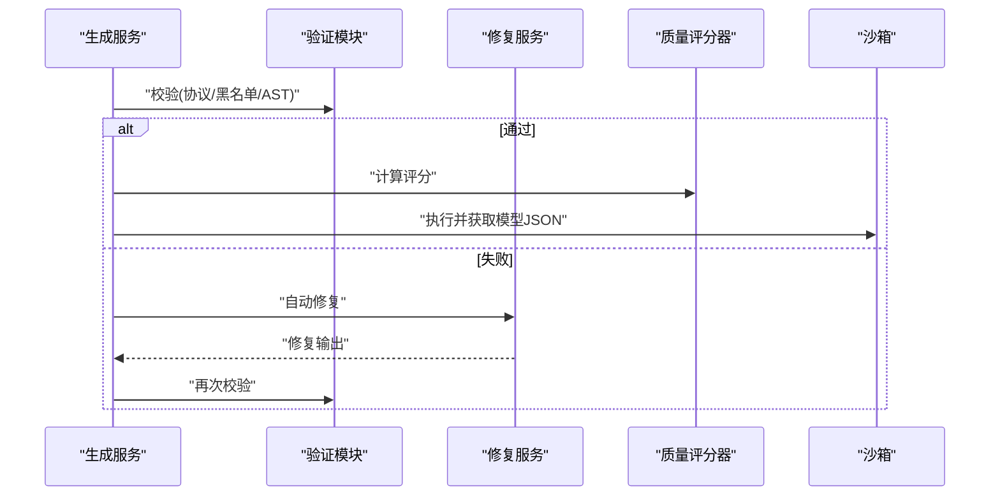
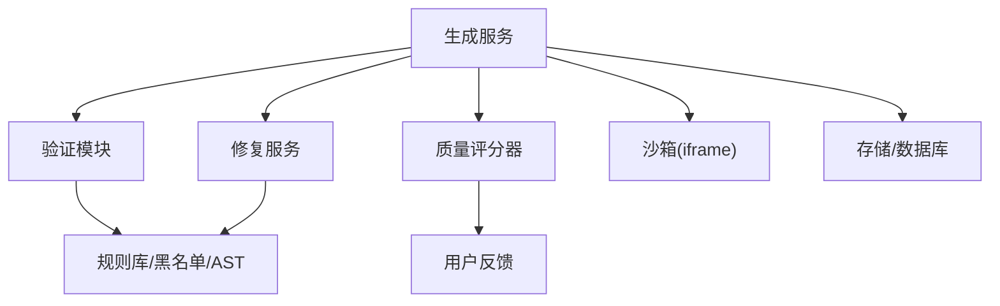

# 生成质量控制

<cite>
**本文引用的文件**   
- [产品需求文档](file://prd.md)
- [产品技术设计文档](file://tech/product-technical-design.md)
</cite>

## 目录
1. [引言](#引言)
2. [项目结构](#项目结构)
3. [核心组件](#核心组件)
4. [架构总览](#架构总览)
5. [详细组件分析](#详细组件分析)
6. [依赖关系分析](#依赖关系分析)
7. [性能考量](#性能考量)
8. [故障排查指南](#故障排查指南)
9. [结论](#结论)
10. [附录](#附录)

## 引言
本文件围绕 ApexForge 的“生成质量控制体系”展开，聚焦多维度质量评分算法、自动评分规则、人工审核流程与反馈闭环、质量阈值配置、权重调整策略、回归检测机制，以及与验证模块、修复服务的协作。同时给出质量报告结构与分析方法，并说明持续学习、A/B 测试支持与质量趋势分析的实现思路。内容兼顾初学者可读性与资深开发者的技术深度。

## 项目结构
仓库当前包含两份关键文档：
- 产品需求文档：定义平台目标、核心能力、前端/后端/沙箱方案、Prompt 设计原则、监控与质量保证要点等。
- 产品技术设计文档：给出总体架构、领域模型、数据表、状态机、时序图、API 契约、模板系统、安全校验、沙箱运行时、可观测性、工程落地计划与验收标准等。

图表来源
- [产品技术设计文档:807-841](file://tech/product-technical-design.md#L807-L841)
- [产品技术设计文档:428-470](file://tech/product-technical-design.md#L428-L470)
- [产品技术设计文档:472-518](file://tech/product-technical-design.md#L472-L518)
- [产品技术设计文档:174-324](file://tech/product-technical-design.md#L174-L324)

章节来源
- [产品需求文档:1-168](file://prd.md#L1-L168)
- [产品技术设计文档:1-1149](file://tech/product-technical-design.md#L1-L1149)

## 核心组件
- 质量评分器：基于多维度指标计算总分与分项得分，输出结构化质量报告。
- 验证模块：对 LLM 输出进行协议、文本黑名单与 AST 白名单校验，产出校验报告。
- 修复服务：在验证失败或渲染异常时触发自动修复（如参数修正、局部代码补全），再回卷至验证。
- 沙箱执行器：在 iframe 中执行生成代码，返回序列化模型 JSON，用于可渲染性判定与复杂度统计。
- 反馈与评估：收集用户反馈与保存行为，驱动 Prompt/模板优化与回归数据集构建。

章节来源
- [产品技术设计文档:807-841](file://tech/product-technical-design.md#L807-L841)
- [产品技术设计文档:428-470](file://tech/product-technical-design.md#L428-L470)
- [产品技术设计文档:472-518](file://tech/product-technical-design.md#L472-L518)
- [产品需求文档:118-123](file://prd.md#L118-L123)

## 架构总览
下图展示从生成到质量评估的关键交互，包括验证、评分、修复与沙箱执行的协作关系。

图表来源
- [产品技术设计文档:359-391](file://tech/product-technical-design.md#L359-L391)
- [产品技术设计文档:428-470](file://tech/product-technical-design.md#L428-L470)
- [产品技术设计文档:472-518](file://tech/product-technical-design.md#L472-L518)
- [产品技术设计文档:807-841](file://tech/product-technical-design.md#L807-L841)

## 详细组件分析

### 多维度质量评分算法
- 评分维度与权重
  - 可渲染性（30%）：能否成功生成 Object3D 并在沙箱加载。
  - Prompt 匹配度（25%）：输出是否符合用户描述。
  - 结构完整性（20%）：主体、关键部件、比例是否合理。
  - 性能表现（15%）：Mesh/顶点/材质数量是否可控。
  - 可编辑性（10%）：参数是否清晰、代码是否结构化。
- 自动评分输入
  - 生成模式与模板命中情况
  - AST 校验结果
  - 几何体数量、顶点数、材质数
  - 沙箱执行是否成功
  - 模型边界盒尺寸与空模型检测
  - 用户反馈与保存行为
- 评分输出
  - 总分与各维度分数
  - 详情字段（各子项指标、依据与证据）
  - 关联任务 ID，便于追溯

图表来源
- [产品技术设计文档:807-841](file://tech/product-technical-design.md#L807-L841)

章节来源
- [产品技术设计文档:807-841](file://tech/product-technical-design.md#L807-L841)

### 自动评分规则与阈值配置
- 规则来源
  - 可渲染性：沙箱执行成功、Object3D 非空、边界盒有效。
  - Prompt 匹配度：类别识别、关键词覆盖、模板命中置信度。
  - 结构完整性：主体/关键部件存在性、比例约束、对称性检查。
  - 性能表现：Mesh 数量、顶点估算、材质数量、循环/递归限制。
  - 可编辑性：参数 Schema 完备性、代码结构清晰度。
- 阈值与权重
  - 默认权重见上节；可按业务阶段调整（MVP/Beta/Scale）。
  - 阈值建议：
    - Mesh 上限：MVP 80，Beta 可配置。
    - AST 深度上限：< 30。
    - 最大循环层数：2。
    - 代码长度上限：MVP 20KB，Beta 可配置。
- 动态调整
  - 支持按套餐/空间维度差异化阈值。
  - 结合用户反馈与保存行为进行权重微调。

章节来源
- [产品技术设计文档:452-470](file://tech/product-technical-design.md#L452-L470)
- [产品技术设计文档:807-841](file://tech/product-technical-design.md#L807-L841)

### 人工审核流程与反馈闭环
- 人工审核
  - 首次生成结果标记待审；低分或高风险结果进入审核队列。
  - 审核通过后入库并提升模板/示例库质量。
- 反馈闭环
  - 用户反馈（满意/不满意/违规）与保存行为纳入评分输入。
  - 分析驱动 Prompt/模板优化与回归数据集构建。
  - 评估结果反哺生成链路，形成持续改进。

图表来源
- [产品技术设计文档:828-841](file://tech/product-technical-design.md#L828-L841)
- [产品需求文档:118-123](file://prd.md#L118-L123)

章节来源
- [产品技术设计文档:828-841](file://tech/product-technical-design.md#L828-L841)
- [产品需求文档:118-123](file://prd.md#L118-L123)

### 与验证模块、修复服务的协作
- 验证模块
  - 三层校验：输出协议校验、文本黑名单、AST 白名单。
  - 产出校验报告（通过/阻断原因/警告/复杂度/AST摘要）。
- 修复服务
  - 针对常见失败模式（语法错误、危险调用、复杂度过高）进行自动修复。
  - 修复后重新进入验证，直至通过或达到重试上限。
- 协作顺序
  - 生成 → 验证 → 若失败则修复 → 再验证 → 评分 → 沙箱执行 → 持久化。

图表来源
- [产品技术设计文档:428-470](file://tech/product-technical-design.md#L428-L470)
- [产品技术设计文档:472-518](file://tech/product-technical-design.md#L472-L518)
- [产品技术设计文档:807-841](file://tech/product-technical-design.md#L807-L841)

章节来源
- [产品技术设计文档:428-470](file://tech/product-technical-design.md#L428-L470)
- [产品技术设计文档:472-518](file://tech/product-technical-design.md#L472-L518)

### 质量报告的结构与分析方法
- 报告结构
  - 总分与各维度分数
  - 详情字段（各子项指标、依据与证据）
  - 关联任务 ID、时间戳
- 分析方法
  - 定位低分项：优先关注可渲染性与性能表现。
  - 结合校验报告：查看阻断原因与警告信息。
  - 结合沙箱执行结果：确认模型 JSON 有效性、边界盒与空模型检测。
  - 结合用户反馈：将“不满意/违规”作为负样本加入回归集。

章节来源
- [产品技术设计文档:311-324](file://tech/product-technical-design.md#L311-L324)
- [产品技术设计文档:807-841](file://tech/product-technical-design.md#L807-L841)

### 回归检测策略
- 回归数据集
  - 固定 Prompt 集（车辆/建筑/道具/飞行器/边界与恶意输入）。
- 回归指标
  - 生成成功率、质量分、耗时、校验失败率、沙箱超时率。
- 触发时机
  - Prompt/模板/模型供应商调整后执行回归。
  - 阈值告警（失败率突增、延迟过高、校验失败翻倍等）。

章节来源
- [产品技术设计文档:1064-1075](file://tech/product-technical-design.md#L1064-L1075)
- [产品技术设计文档:898-907](file://tech/product-technical-design.md#L898-L907)

### 持续学习与 A/B 测试支持
- 持续学习
  - 以反馈与评估数据驱动 Prompt/模板优化。
  - 将典型失败案例沉淀为回归用例，持续评估改进效果。
- A/B 测试
  - 按 Prompt 版本、模板版本、模型供应商进行分流对比。
  - 以质量分、成功率、耗时为核心指标，选择更优策略上线。

章节来源
- [产品技术设计文档:828-841](file://tech/product-technical-design.md#L828-L841)
- [产品技术设计文档:419-425](file://tech/product-technical-design.md#L419-L425)

### 质量趋势分析
- 指标看板
  - 每日/每周质量分均值与分布、各维度趋势。
  - 失败原因占比、沙箱超时占比、LLM 延迟 P95。
- 告警联动
  - 失败率/延迟/超时/校验失败等阈值告警。
  - 与回归测试联动，快速定位回归点。

章节来源
- [产品技术设计文档:868-907](file://tech/product-technical-design.md#L868-L907)

## 依赖关系分析
- 组件耦合
  - 生成服务依赖验证、修复、评分、沙箱与存储。
  - 评分器依赖校验报告、沙箱执行结果与用户反馈。
  - 修复服务依赖验证结果与规则库。
- 外部依赖
  - LLM 供应商（多适配）、缓存/队列、对象存储、数据库。
- 潜在风险
  - 循环依赖需避免（服务间单向依赖）。
  - 外部服务降级与熔断策略需完善。

图表来源
- [产品技术设计文档:594-610](file://tech/product-technical-design.md#L594-L610)
- [产品技术设计文档:428-470](file://tech/product-technical-design.md#L428-L470)
- [产品技术设计文档:472-518](file://tech/product-technical-design.md#L472-L518)
- [产品技术设计文档:807-841](file://tech/product-technical-design.md#L807-L841)

章节来源
- [产品技术设计文档:594-610](file://tech/product-technical-design.md#L594-L610)
- [产品技术设计文档:428-470](file://tech/product-technical-design.md#L428-L470)
- [产品技术设计文档:472-518](file://tech/product-technical-design.md#L472-L518)
- [产品技术设计文档:807-841](file://tech/product-technical-design.md#L807-L841)

## 性能考量
- 前端
  - 按需加载 Three.js 与沙箱 runtime；大模型解析放入 Worker；旧模型释放 geometry/material/texture。
- 后端
  - 相似 Prompt 缓存；模板模式跳过 LLM 代码生成；异步化生成任务；并发与熔断控制。
- 数据库
  - 索引优化与大字段迁移对象存储；历史任务归档。

章节来源
- [产品技术设计文档:933-958](file://tech/product-technical-design.md#L933-L958)

## 故障排查指南
- 常见问题
  - 沙箱超时：模型过于复杂或死循环，需降低复杂度或切换模板模式。
  - 运行时报错：生成代码存在执行问题，可重试或触发修复。
  - 模型 JSON 非法：返回结构非法，系统将重新生成。
  - 模型为空：描述模糊，引导补充主体信息。
- 排查步骤
  - 根据 traceId 拉取全链路日志与事件流。
  - 查看校验报告中的阻断原因与警告。
  - 检查质量评分详情与沙箱执行结果。
  - 结合用户反馈与保存行为定位根因。

章节来源
- [产品技术设计文档:508-518](file://tech/product-technical-design.md#L508-L518)
- [产品技术设计文档:868-907](file://tech/product-technical-design.md#L868-L907)

## 结论
ApexForge 的质量控制体系以“多维评分 + 严格校验 + 自动修复 + 反馈闭环”为核心，贯穿从生成到渲染的全链路。通过回归检测、A/B 测试与趋势分析，持续优化 Prompt、模板与模型选择策略，保障生成质量稳定提升。

## 附录

### 数据模型与关键字段（与质量相关）
- generation_tasks：任务状态、模式、错误码/信息等。
- validation_reports：校验通过与否、阻断原因、警告、复杂度、AST 摘要。
- quality_scores：总分与各维度分数、详情、关联任务 ID。
- model_versions：模型 JSON URL、截图、指标等。

章节来源
- [产品技术设计文档:215-324](file://tech/product-technical-design.md#L215-L324)