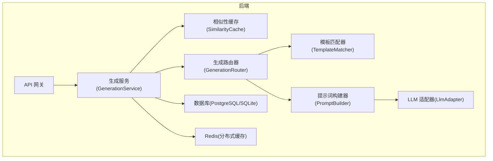
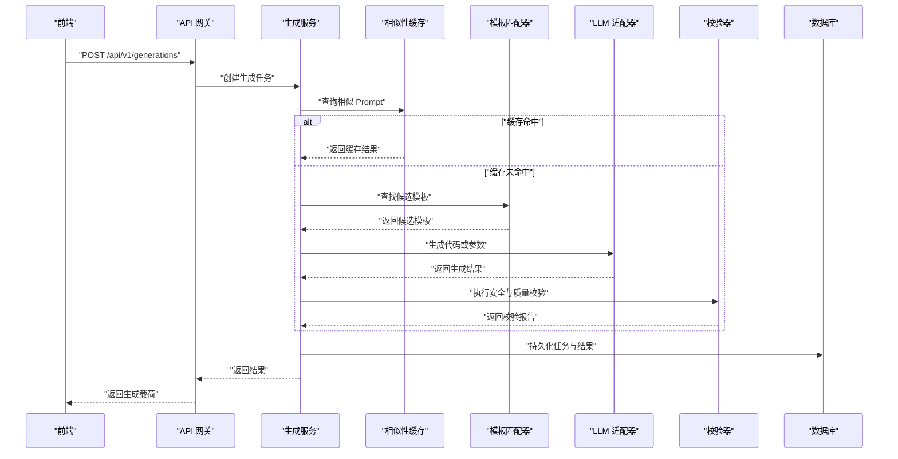
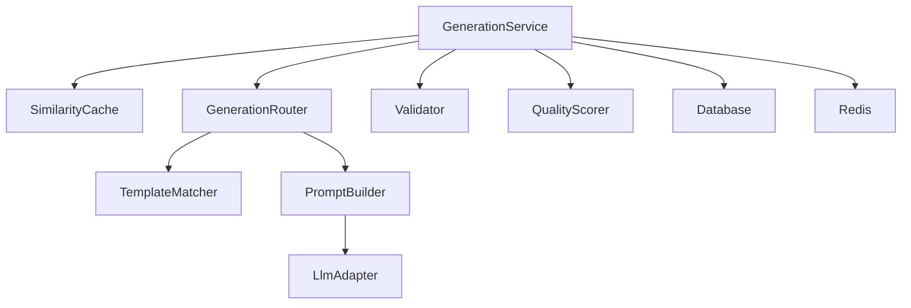

# 缓存策略与优化

<cite>
**本文引用的文件**
- [产品技术设计文档](file://tech/product-technical-design.md)
- [产品需求文档](file://prd.md)
</cite>

## 目录
1. [引言](#引言)
2. [项目结构](#项目结构)
3. [核心组件](#核心组件)
4. [架构总览](#架构总览)
5. [详细组件分析](#详细组件分析)
6. [依赖分析](#依赖分析)
7. [性能考虑](#性能考虑)
8. [故障排查指南](#故障排查指南)
9. [结论](#结论)
10. [附录](#附录)

## 引言
本文件聚焦 ApexForge 的生成缓存系统，围绕相似 Prompt 识别、缓存键生成策略、多级缓存架构（内存缓存 + Redis）、命中率监控、容量管理与清理策略展开。同时说明与生成路由器的集成方式，以及缓存穿透与雪崩防护方案，兼顾初学者可读性与资深开发者的技术深度。

## 项目结构
从仓库现有文档可知，ApexForge 在平台化阶段采用服务化架构，其中 Generation Service 负责生成任务编排，并与缓存层交互；Redis 用于相似 Prompt 结果、任务状态和限流等场景。MVP 阶段使用内存缓存，后续演进到 Redis。

图表来源
- [产品技术设计文档:36-100](file://tech/product-technical-design.md#L36-L100)
- [产品技术设计文档:594-609](file://tech/product-technical-design.md#L594-L609)

章节来源
- [产品技术设计文档:36-100](file://tech/product-technical-design.md#L36-L100)
- [产品技术设计文档:594-609](file://tech/product-technical-design.md#L594-L609)

## 核心组件
- 相似性缓存(SimilarityCache)：提供“查询相似 Prompt”的能力，命中则直接返回缓存结果，未命中则走生成链路并回填缓存。
- 生成路由器(GenerationRouter)：根据模式优先级选择 Cache Mode、Template Mode、Hybrid Mode、Code Mode。
- 模板匹配器(TemplateMatcher)：基于标签与向量检索候选模板，辅助降低 LLM 调用成本。
- 提示词构建器(PromptBuilder)：组装 System Prompt、Few-shot 示例与上下文，驱动 LLM 生成。
- LLM 适配器(LlmAdapter)：统一多供应商接口，支持重试与降级。
- 校验器(Validator)：对输出进行协议、黑名单与 AST 白名单校验。
- 质量评分器(QualityScorer)：计算可渲染性、Prompt 匹配度、结构完整性、性能表现、可编辑性等维度得分。
- 存储层：PostgreSQL/SQLite 持久化任务与资产；Redis 作为分布式缓存。

章节来源
- [产品技术设计文档:594-609](file://tech/product-technical-design.md#L594-L609)
- [产品技术设计文档:338-390](file://tech/product-technical-design.md#L338-L390)

## 架构总览
下图展示一次完整生成请求中缓存参与的关键路径：先查相似缓存，命中即返回；未命中再进入模板匹配与 LLM 生成流程，最终落库并回填缓存。

图表来源
- [产品技术设计文档:362-390](file://tech/product-technical-design.md#L362-L390)

## 详细组件分析

### 相似 Prompt 识别算法
- 目标：在用户输入相近语义时复用历史生成结果，显著降低 LLM 调用与校验开销。
- 关键步骤：
  - 文本归一化：去除多余空白、标准化标点、大小写统一、同义词替换（可选）。
  - 特征提取：将归一化后的 Prompt 转换为向量表示（如 Sentence-BERT），或使用轻量级关键词+TF-IDF 近似方案。
  - 相似度计算：余弦相似度或内积，设定阈值（例如 >0.95）判定为“相似”。
  - 候选集检索：结合标签/类别过滤，缩小候选范围，提升召回精度。
  - 结果回退：若相似度低于阈值但存在高相关模板，可优先走 Template/Hybrid 模式。
- 复杂度分析：
  - 向量检索时间复杂度近似 O(k log n)（k 为候选数，n 为索引规模），空间复杂度取决于向量维度与索引结构。
  - 若使用倒排索引+关键词加权，检索更快但召回略低，适合 MVP。
- 优化建议：
  - 分层检索：先用标签/类别粗筛，再用向量细筛。
  - 增量更新：新结果入库后异步更新向量索引。
  - 冷启动：初期可用关键词+规则兜底，逐步引入向量模型。

章节来源
- [产品技术设计文档:338-390](file://tech/product-technical-design.md#L338-L390)
- [产品需求文档:155-168](file://prd.md#L155-L168)

### 缓存键生成策略
- 键组成要素：
  - 归一化 Prompt 指纹（哈希值）
  - 生成模式(mode)：template/code/hybrid/cache
  - 模板版本(templateVersionId)：若命中模板
  - 参数摘要(paramsHash)：模板参数的规范化摘要
  - 上下文版本(contextVersionId)：Prompt 版本或系统提示版本
  - 质量阈值与策略标识：如 strict/relaxed
- 键格式示例（概念）：
  - cache:{mode}:{promptFingerprint}:{templateVersionId}:{paramsHash}:{contextVersionId}
- 设计要点：
  - 幂等性：相同输入必产生相同键。
  - 隔离性：不同模式/版本/参数组合严格区分。
  - 可扩展性：新增字段不影响既有键空间。

章节来源
- [产品技术设计文档:338-390](file://tech/product-technical-design.md#L338-L390)

### 缓存失效机制
- 失效触发条件：
  - 模板或参数 Schema 变更导致旧结果不可用。
  - Prompt 版本升级影响生成策略。
  - 质量评分低于阈值或用户反馈标记为不合格。
  - 定时清理：按 TTL 过期或后台扫描回收长期未访问条目。
- 失效策略：
  - 软失效：保留键但标记 stale，读时回源刷新。
  - 硬失效：删除键，强制重算。
  - 批量失效：按模板版本或类别批量清理。
- 一致性保障：
  - 写扩散：更新模板/Schema 时主动清理相关缓存。
  - 版本号：键中包含版本信息，避免脏读。

章节来源
- [产品技术设计文档:338-390](file://tech/product-technical-design.md#L338-L390)

### 多级缓存架构（内存缓存 + Redis）
- 层级划分：
  - L1 内存缓存：进程内 Map/LRU，极低延迟，适合热点数据与短生命周期。
  - L2 Redis 缓存：跨进程共享，承载相似 Prompt 结果、任务状态、限流计数等。
- 读写路径：
  - 读：先查 L1，未命中查 L2，仍未命中回源生成并回填 L1/L2。
  - 写：先写 L2，再异步写入 L1（或按热点动态提升）。
- 配置项（概念）：
  - L1：最大容量、TTL、淘汰策略（LRU/LFU）。
  - L2：TTL、序列化格式、连接池、超时与重试。
- 适用场景：
  - 高频重复 Prompt、热门模板参数组合、限流计数。

章节来源
- [产品技术设计文档:114-120](file://tech/product-technical-design.md#L114-L120)
- [产品技术设计文档:97-100](file://tech/product-technical-design.md#L97-L100)

### 缓存命中率监控、容量管理与清理策略
- 指标采集：
  - 命中率、平均延迟、P95/P99 延迟、错误率。
  - 各模式命中率（cache/template/hybrid/code）。
  - 热点 Key 分布与 TopN 访问频率。
- 容量管理：
  - L1：设置上限与淘汰策略，防止内存泄漏。
  - L2：设置 key 数量上限与内存水位告警，配合 TTL 控制。
- 清理策略：
  - 基于 TTL 的自动过期。
  - 后台任务定期扫描低频/长尾 Key 并清理。
  - 事件驱动的批量失效（模板/Schema 变更）。

章节来源
- [产品技术设计文档:944-958](file://tech/product-technical-design.md#L944-L958)

### 与生成路由器的集成
- 模式优先级：Cache Mode → Template Mode → Hybrid Mode → Code Mode。
- 集成点：
  - 生成入口先查相似缓存，命中直接返回。
  - 未命中进入模板匹配，若置信度高则走 Template/Hybrid，否则走 Code。
  - 生成完成后写入数据库并回填缓存。
- 时序参考：见“架构总览”中的序列图。

章节来源
- [产品技术设计文档:338-390](file://tech/product-technical-design.md#L338-L390)

### 缓存穿透与雪崩防护
- 穿透防护：
  - 布隆过滤器：对不存在或极冷的 Prompt 指纹快速拒绝。
  - 空值缓存：对明确不存在的键设置短 TTL，避免反复回源。
- 雪崩防护：
  - 随机抖动：TTL 增加随机偏移，避免集中过期。
  - 限流与熔断：对 LLM 调用进行并发限制与失败降级。
  - 预热：对热门模板与常见 Prompt 提前加载至缓存。
- 一致性：
  - 写扩散与版本号保证缓存与模板/Schema 的一致性。

章节来源
- [产品技术设计文档:944-958](file://tech/product-technical-design.md#L944-L958)

### 热点数据优化与缓存预热
- 热点识别：
  - 统计 TopN 模板与参数组合，结合用户行为与历史命中率。
- 预热策略：
  - 定时任务在低峰期预加载热门模板与参数组合。
  - 新模板发布后，基于示例 Prompt 自动生成种子结果并预热。
- 动态调整：
  - 根据实时指标动态提升热点数据的 L1 驻留时间与 L2 TTL。

章节来源
- [产品技术设计文档:944-958](file://tech/product-technical-design.md#L944-L958)

### 分布式缓存一致性
- 版本化键：键中包含模板版本、上下文版本与参数摘要，确保变更可见。
- 写扩散：模板/Schema 更新时主动清理相关缓存键。
- 软失效：读取时发现 stale 标志则回源刷新并更新缓存。
- 观测与回滚：记录每次回源原因与耗时，便于定位一致性问题。

章节来源
- [产品技术设计文档:338-390](file://tech/product-technical-design.md#L338-L390)

### 实际代码库中的缓存查询与存储示例（路径引用）
- 相似缓存查询与命中分支：
  - 参见生成时序图中“查询相似 Prompt”与“缓存命中/未命中”分支。
- 生成服务内部结构与缓存依赖：
  - 参见 GenerationService 与 SimilarityCache 的依赖关系图。
- 平台化部署中的 Redis 集成：
  - 参见平台化部署架构图中的 Redis 节点。

章节来源
- [产品技术设计文档:362-390](file://tech/product-technical-design.md#L362-L390)
- [产品技术设计文档:594-609](file://tech/product-technical-design.md#L594-L609)
- [产品技术设计文档:97-100](file://tech/product-technical-design.md#L97-L100)

## 依赖分析
- 模块耦合：
  - GenerationService 强依赖 SimilarityCache 与 GenerationRouter。
  - GenerationRouter 依赖 TemplateMatcher 与 PromptBuilder。
  - PromptBuilder 依赖 LlmAdapter。
  - Validator 与 QualityScorer 位于生成链路下游。
- 外部依赖：
  - Redis 用于分布式缓存与限流。
  - PostgreSQL/SQLite 用于持久化。
- 潜在循环依赖：
  - 通过职责分离与接口抽象避免循环依赖。

图表来源
- [产品技术设计文档:594-609](file://tech/product-technical-design.md#L594-L609)

章节来源
- [产品技术设计文档:594-609](file://tech/product-technical-design.md#L594-L609)

## 性能考虑
- 后端优化：
  - 相似 Prompt 缓存命中可跳过 LLM 调用，显著降低延迟与成本。
  - 模板模式仅需参数生成，响应更快。
  - 任务异步化与并发控制，避免 HTTP 长连接占用。
- 数据库优化：
  - 针对 traceId、workspaceId、createdAt 等字段建立索引。
  - 大字段迁移至对象存储，仅保存 URL 与摘要。
- 网络优化：
  - 静态资源 CDN 缓存与压缩。

章节来源
- [产品技术设计文档:944-958](file://tech/product-technical-design.md#L944-L958)
- [产品需求文档:155-168](file://prd.md#L155-L168)

## 故障排查指南
- 常见问题：
  - 缓存命中率低：检查归一化与相似度阈值是否合理；确认键生成是否包含必要上下文版本。
  - 缓存不一致：核对模板/Schema 版本是否与键中版本一致；检查写扩散是否生效。
  - 雪崩现象：检查 TTL 是否缺少随机抖动；评估限流与熔断配置。
- 定位方法：
  - 查看 traceId 关联日志，确认缓存命中/未命中分支。
  - 监控指标：命中率、延迟分位、错误率、TopN 热点 Key。
  - 回溯最近模板/Schema 变更，评估影响范围。

章节来源
- [产品技术设计文档:944-958](file://tech/product-technical-design.md#L944-L958)

## 结论
ApexForge 的生成缓存系统以“相似 Prompt 识别 + 多级缓存 + 严格失效与一致性策略”为核心，结合生成路由器的模式优先级，有效降低 LLM 调用成本并提升用户体验。通过完善的监控、容量管理与防护机制，系统在稳定性与扩展性之间取得平衡。未来可进一步引入更精细的热点识别与自适应 TTL，持续优化命中率与资源利用率。

## 附录
- 术语表：
  - 相似 Prompt：语义相近的用户输入，经归一化与向量检索判定。
  - 缓存键：由多种上下文信息组合生成的唯一标识。
  - 软失效：保留键但标记 stale，读时回源刷新。
  - 写扩散：更新时主动清理相关缓存键。
- 参考实现路径：
  - 相似缓存查询与命中分支：[产品技术设计文档:362-390](file://tech/product-technical-design.md#L362-L390)
  - 生成服务内部结构与缓存依赖：[产品技术设计文档:594-609](file://tech/product-technical-design.md#L594-L609)
  - 平台化部署中的 Redis 集成：[产品技术设计文档:97-100](file://tech/product-technical-design.md#L97-L100)