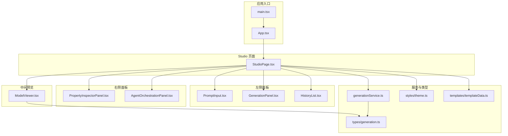
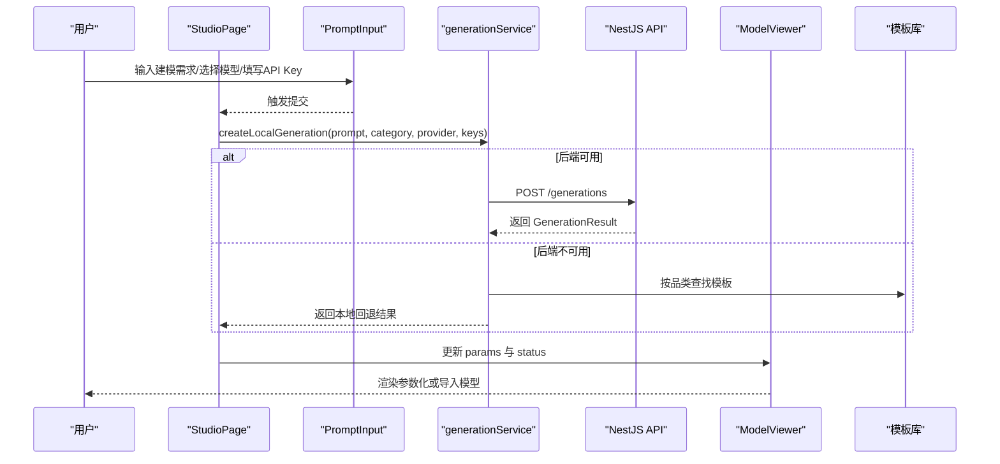
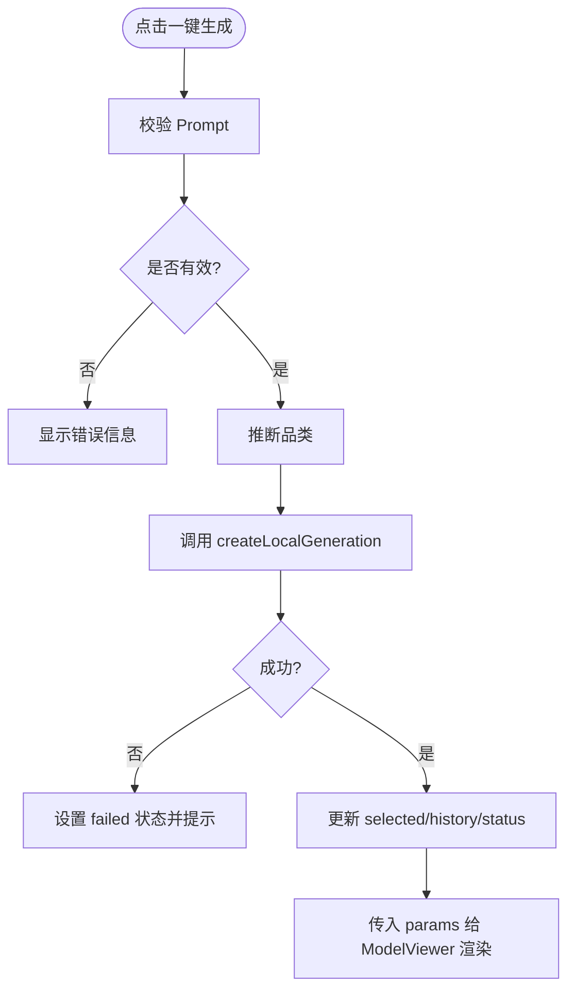
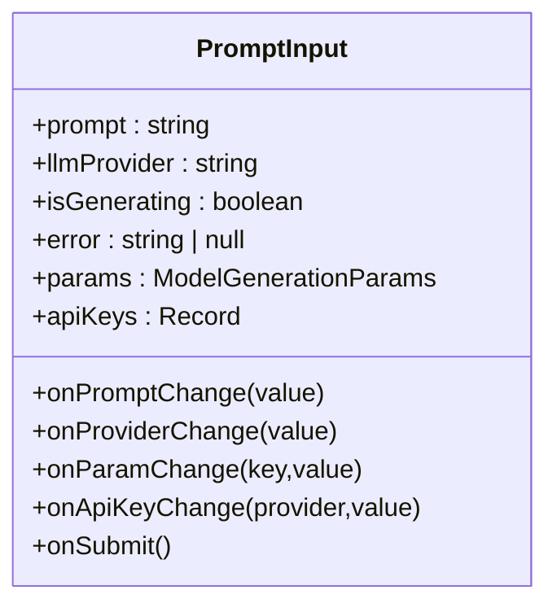
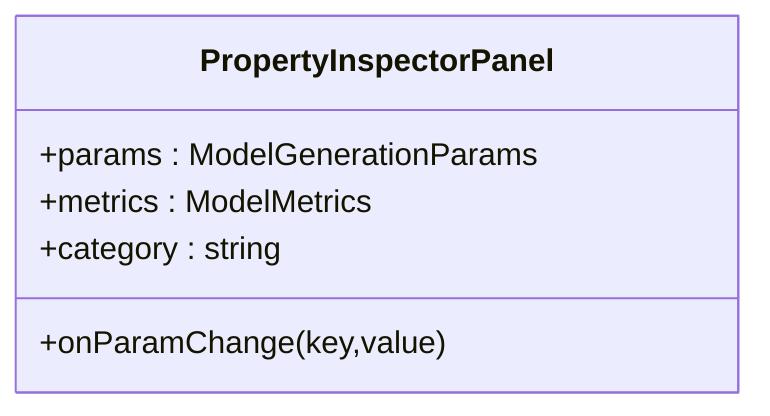
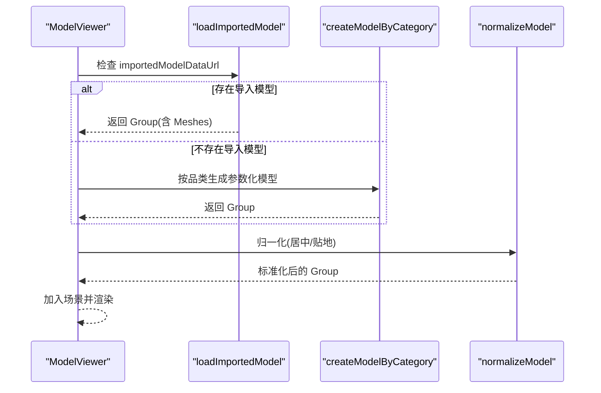
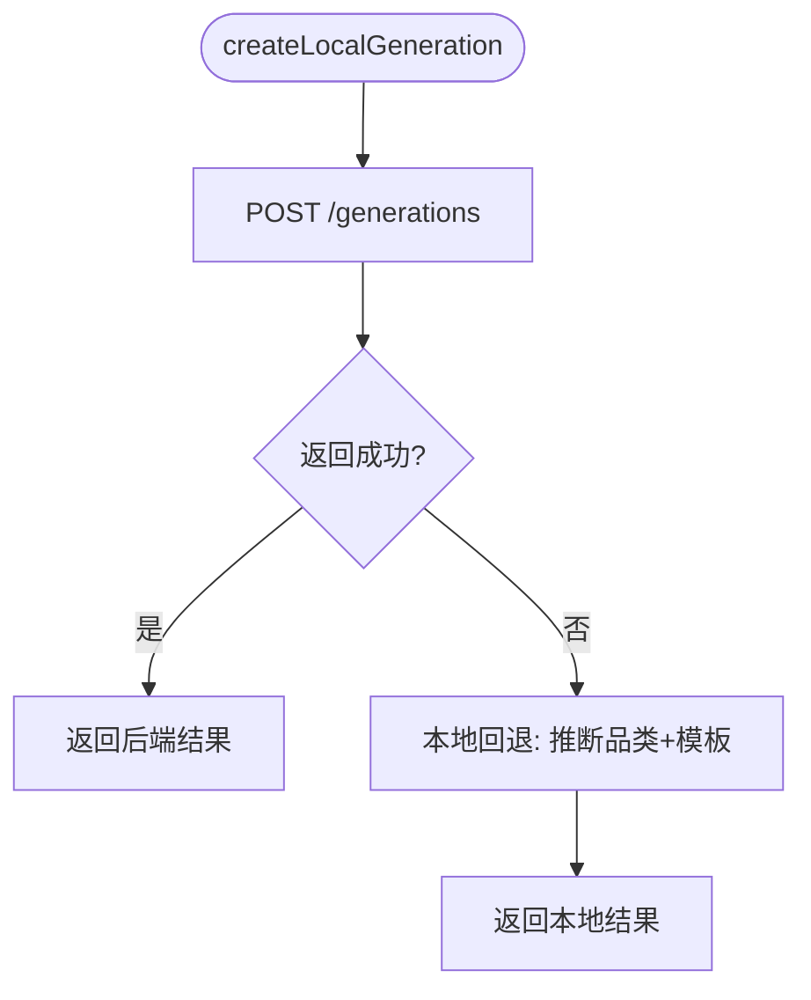
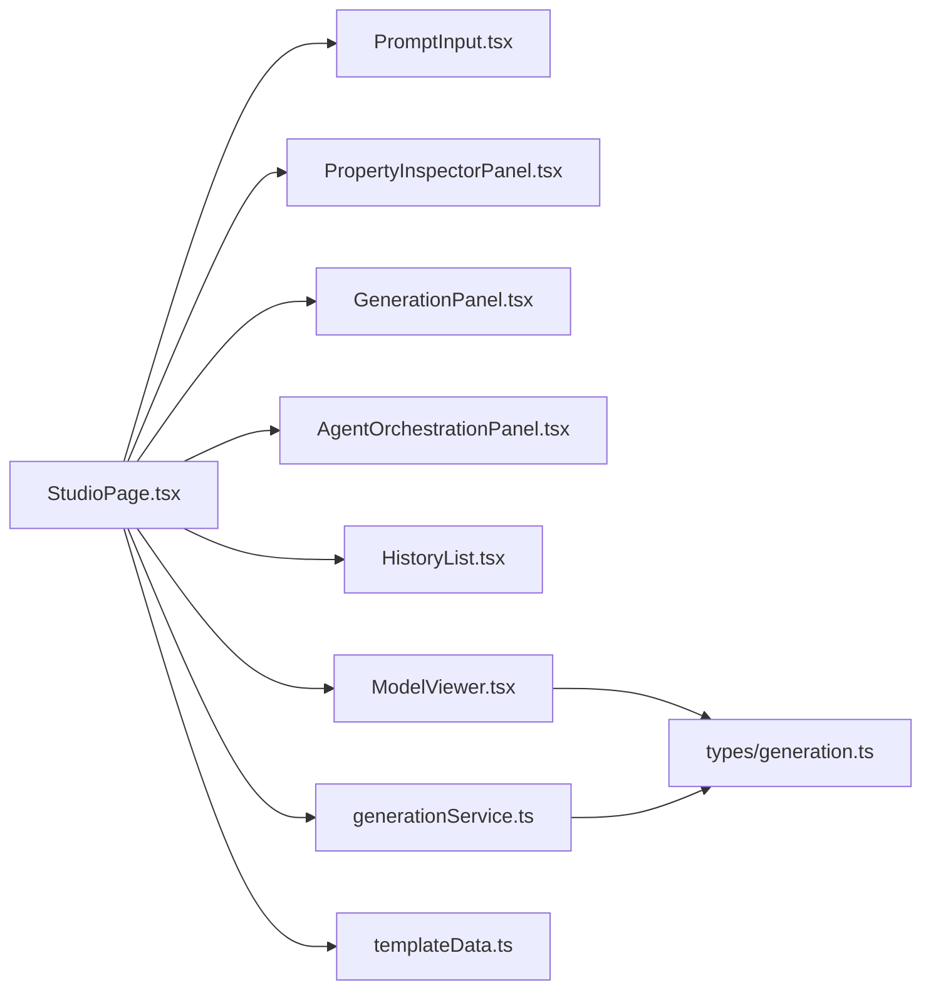

# Studio 用户界面

<cite>
**本文引用的文件**   
- [README.md](file://README.md)
- [package.json](file://package.json)
- [src/main.tsx](file://src/main.tsx)
- [src/App.tsx](file://src/App.tsx)
- [src/modules/studio/pages/StudioPage.tsx](file://src/modules/studio/pages/StudioPage.tsx)
- [src/modules/studio/components/PromptInput.tsx](file://src/modules/studio/components/PromptInput.tsx)
- [src/modules/studio/components/PropertyInspectorPanel.tsx](file://src/modules/studio/components/PropertyInspectorPanel.tsx)
- [src/modules/studio/components/GenerationPanel.tsx](file://src/modules/studio/components/GenerationPanel.tsx)
- [src/modules/studio/components/AgentOrchestrationPanel.tsx](file://src/modules/studio/components/AgentOrchestrationPanel.tsx)
- [src/modules/studio/components/HistoryList.tsx](file://src/modules/studio/components/HistoryList.tsx)
- [src/modules/studio/services/generationService.ts](file://src/modules/studio/services/generationService.ts)
- [src/modules/viewer/components/ModelViewer.tsx](file://src/modules/viewer/components/ModelViewer.tsx)
- [src/shared/types/generation.ts](file://src/shared/types/generation.ts)
- [src/shared/styles/theme.ts](file://src/shared/styles/theme.ts)
- [src/modules/templates/templateData.ts](file://src/modules/templates/templateData.ts)
</cite>

## 目录
1. [简介](#简介)
2. [项目结构](#项目结构)
3. [核心组件](#核心组件)
4. [架构总览](#架构总览)
5. [详细组件分析](#详细组件分析)
6. [依赖关系分析](#依赖关系分析)
7. [性能与体验优化](#性能与体验优化)
8. [故障排查指南](#故障排查指南)
9. [结论](#结论)
10. [附录](#附录)

## 简介
本文件聚焦于 ApexForge 的 Studio 用户界面，围绕“自然语言生成可交互 3D 模型”的工作流，系统梳理前端页面、组件职责、数据流转与渲染管线。文档面向产品、设计与开发者，既提供高层概览，也给出代码级结构与关键流程说明，帮助快速上手与二次开发。

## 项目结构
Studio 工作台采用 React + TypeScript + Vite 构建，整体布局为三栏：左侧建模控制（Prompt、模型选择、在线 API Key、导入本地模型），中央 Three.js 预览区，右侧属性编辑与 Agent 编排面板。

图表来源
- [src/main.tsx:1-11](file://src/main.tsx#L1-L11)
- [src/App.tsx:1-6](file://src/App.tsx#L1-L6)
- [src/modules/studio/pages/StudioPage.tsx:1-445](file://src/modules/studio/pages/StudioPage.tsx#L1-L445)
- [src/modules/studio/components/PromptInput.tsx:1-173](file://src/modules/studio/components/PromptInput.tsx#L1-L173)
- [src/modules/studio/components/GenerationPanel.tsx:1-38](file://src/modules/studio/components/GenerationPanel.tsx#L1-L38)
- [src/modules/studio/components/HistoryList.tsx:1-44](file://src/modules/studio/components/HistoryList.tsx#L1-L44)
- [src/modules/studio/components/PropertyInspectorPanel.tsx:1-204](file://src/modules/studio/components/PropertyInspectorPanel.tsx#L1-L204)
- [src/modules/studio/components/AgentOrchestrationPanel.tsx:1-95](file://src/modules/studio/components/AgentOrchestrationPanel.tsx#L1-L95)
- [src/modules/studio/services/generationService.ts:1-132](file://src/modules/studio/services/generationService.ts#L1-L132)
- [src/modules/viewer/components/ModelViewer.tsx:1-307](file://src/modules/viewer/components/ModelViewer.tsx#L1-L307)
- [src/shared/types/generation.ts:1-100](file://src/shared/types/generation.ts#L1-L100)
- [src/shared/styles/theme.ts:1-59](file://src/shared/styles/theme.ts#L1-L59)
- [src/modules/templates/templateData.ts:1-116](file://src/modules/templates/templateData.ts#L1-L116)

章节来源
- [README.md:56-103](file://README.md#L56-L103)
- [package.json:6-18](file://package.json#L6-L18)
- [src/main.tsx:1-11](file://src/main.tsx#L1-L11)
- [src/App.tsx:1-6](file://src/App.tsx#L1-L6)

## 核心组件
- StudioPage：页面状态中枢，负责生成调用、顶部导航、历史记录、参数传递和联系作者弹窗；维护主题色、类别、状态机与 viewerParams 合并策略。
- PromptInput：建模指令输入、多模型供应商选择、在线 API Key 表单、本地 3D 模型导入（GLB/GLTF/OBJ/STL）。
- PropertyInspectorPanel：右侧属性编辑器，控制颜色、材质、细节、复杂度、曲线、连接与贴图。
- GenerationPanel：生成状态可视化（排队、生成、校验、可预览、失败）与追踪编号展示。
- AgentOrchestrationPanel：展示多 Agent 编排、3D 技能链与渲染策略摘要。
- HistoryList：本地历史列表，支持回看最近 20 条记录。
- ModelViewer：Three.js 场景初始化、导入模型加载、OrbitControls、渲染生命周期与网格统计。
- generationService：封装后端请求与本地回退逻辑，包含品类推断与模板匹配。
- types/generation：统一的数据契约，包括状态、参数、结果、指标等。
- theme：主题预设与三色体系，驱动外观与材质风格。
- templateData：按品类匹配的模板库，用于回退模式下的默认生成。

章节来源
- [src/modules/studio/pages/StudioPage.tsx:33-190](file://src/modules/studio/pages/StudioPage.tsx#L33-L190)
- [src/modules/studio/components/PromptInput.tsx:76-173](file://src/modules/studio/components/PromptInput.tsx#L76-L173)
- [src/modules/studio/components/PropertyInspectorPanel.tsx:131-204](file://src/modules/studio/components/PropertyInspectorPanel.tsx#L131-L204)
- [src/modules/studio/components/GenerationPanel.tsx:19-38](file://src/modules/studio/components/GenerationPanel.tsx#L19-L38)
- [src/modules/studio/components/AgentOrchestrationPanel.tsx:35-95](file://src/modules/studio/components/AgentOrchestrationPanel.tsx#L35-L95)
- [src/modules/studio/components/HistoryList.tsx:12-44](file://src/modules/studio/components/HistoryList.tsx#L12-L44)
- [src/modules/studio/services/generationService.ts:108-132](file://src/modules/studio/services/generationService.ts#L108-L132)
- [src/modules/viewer/components/ModelViewer.tsx:82-307](file://src/modules/viewer/components/ModelViewer.tsx#L82-L307)
- [src/shared/types/generation.ts:1-100](file://src/shared/types/generation.ts#L1-L100)
- [src/shared/styles/theme.ts:12-59](file://src/shared/styles/theme.ts#L12-L59)
- [src/modules/templates/templateData.ts:112-116](file://src/modules/templates/templateData.ts#L112-L116)

## 架构总览
Studio 工作流从用户输入到 3D 渲染的关键路径如下：

图表来源
- [src/modules/studio/pages/StudioPage.tsx:163-190](file://src/modules/studio/pages/StudioPage.tsx#L163-L190)
- [src/modules/studio/services/generationService.ts:108-132](file://src/modules/studio/services/generationService.ts#L108-L132)
- [src/modules/templates/templateData.ts:112-116](file://src/modules/templates/templateData.ts#L112-L116)
- [src/modules/viewer/components/ModelViewer.tsx:228-243](file://src/modules/viewer/components/ModelViewer.tsx#L228-L243)

## 详细组件分析

### StudioPage 页面
- 职责：集中管理 prompt、类别、LLM 供应商、在线 API Key、生成状态、历史、选中项、主题与 viewerParams 合并；处理生成流程与错误提示。
- 关键行为：
  - 状态机推进：queued → generating → validating → renderable/failed。
  - 主题预设一键切换，同步更新 body/accent/secondary 颜色与 selected.generatedParams。
  - 通过 updateViewerParam 将属性变更同时写入 paramOverrides 与 selected.generatedParams，保证实时预览与历史一致性。
  - 在线 API Key 持久化至 localStorage，生成时随请求发送。
  - 使用 inferCategoryFromPrompt 自动推断品类并选择模板。

图表来源
- [src/modules/studio/pages/StudioPage.tsx:163-190](file://src/modules/studio/pages/StudioPage.tsx#L163-L190)
- [src/modules/studio/services/generationService.ts:108-132](file://src/modules/studio/services/generationService.ts#L108-L132)

章节来源
- [src/modules/studio/pages/StudioPage.tsx:33-190](file://src/modules/studio/pages/StudioPage.tsx#L33-L190)
- [src/modules/studio/pages/StudioPage.tsx:86-146](file://src/modules/studio/pages/StudioPage.tsx#L86-L146)
- [src/modules/studio/pages/StudioPage.tsx:199-405](file://src/modules/studio/pages/StudioPage.tsx#L199-L405)

### PromptInput 组件
- 职责：接收 Prompt、选择 LLM 供应商、在线 API Key 配置、本地 3D 模型导入，触发提交。
- 关键点：
  - 支持 GLB/GLTF/OBJ/STL 导入，读取为 Data URL 后写入 params.importedModel* 字段。
  - 在线 API Key 保存在浏览器本地，并在提交时随请求发送到后端。
  - 下拉菜单选择供应商，当前选中项高亮。

图表来源
- [src/modules/studio/components/PromptInput.tsx:7-19](file://src/modules/studio/components/PromptInput.tsx#L7-L19)
- [src/modules/studio/components/PromptInput.tsx:27-74](file://src/modules/studio/components/PromptInput.tsx#L27-L74)
- [src/modules/studio/components/PromptInput.tsx:76-173](file://src/modules/studio/components/PromptInput.tsx#L76-L173)

章节来源
- [src/modules/studio/components/PromptInput.tsx:76-173](file://src/modules/studio/components/PromptInput.tsx#L76-L173)

### PropertyInspectorPanel 组件
- 职责：右侧属性编辑，覆盖几何体、材质通道、轮廓风格、外观贴图、曲线与连接、网格统计等。
- 关键点：
  - 使用 RangeRow/ColorRow/OptionGrid 等子控件统一交互。
  - 贴图上传以 Data URL 形式保存，支持移除。
  - 所有变更通过 onParamChange 回调向上层聚合，影响 viewerParams。

图表来源
- [src/modules/studio/components/PropertyInspectorPanel.tsx:4-9](file://src/modules/studio/components/PropertyInspectorPanel.tsx#L4-L9)
- [src/modules/studio/components/PropertyInspectorPanel.tsx:131-204](file://src/modules/studio/components/PropertyInspectorPanel.tsx#L131-L204)

章节来源
- [src/modules/studio/components/PropertyInspectorPanel.tsx:131-204](file://src/modules/studio/components/PropertyInspectorPanel.tsx#L131-L204)

### GenerationPanel 组件
- 职责：根据状态映射显示图标、标签与 Badge，展示 traceId。
- 关键点：
  - 状态枚举映射到视觉样式（等待、排队、生成、校验、可预览、失败）。
  - 加载中图标旋转动画。

章节来源
- [src/modules/studio/components/GenerationPanel.tsx:10-38](file://src/modules/studio/components/GenerationPanel.tsx#L10-L38)

### AgentOrchestrationPanel 组件
- 职责：展示多 Agent 编排、3D 技能链与渲染策略摘要，以及优化后的建模需求。
- 关键点：
  - 若未提供 agents/skills/renderProfile，则使用默认占位数据。
  - 支持滚动查看优化后的 Prompt。

章节来源
- [src/modules/studio/components/AgentOrchestrationPanel.tsx:35-95](file://src/modules/studio/components/AgentOrchestrationPanel.tsx#L35-L95)

### HistoryList 组件
- 职责：展示最近 20 条本地历史，支持点击恢复选中项。
- 关键点：
  - 时间相对格式化与评分展示。
  - 按钮仅做提示，当前版本禁用持久化操作。

章节来源
- [src/modules/studio/components/HistoryList.tsx:12-44](file://src/modules/studio/components/HistoryList.tsx#L12-L44)

### ModelViewer 组件
- 职责：Three.js 场景初始化、灯光与阴影、网格与地面、OrbitControls、导入模型加载、参数化模型创建与归一化、渲染循环与资源释放。
- 关键点：
  - 优先加载导入模型（GLB/GLTF/OBJ/STL），失败则回退到参数化模型。
  - normalizeModel 进行 XZ 居中与底部贴地，避免“只看到半个模型”。
  - 响应式尺寸调整与像素比限制，提升性能与清晰度。
  - 清理旧模型与渲染器资源，防止内存泄漏。

图表来源
- [src/modules/viewer/components/ModelViewer.tsx:45-76](file://src/modules/viewer/components/ModelViewer.tsx#L45-L76)
- [src/modules/viewer/components/ModelViewer.tsx:228-243](file://src/modules/viewer/components/ModelViewer.tsx#L228-L243)

章节来源
- [src/modules/viewer/components/ModelViewer.tsx:82-307](file://src/modules/viewer/components/ModelViewer.tsx#L82-L307)

### generationService 服务
- 职责：封装后端请求与本地回退逻辑，包含品类推断与模板匹配。
- 关键点：
  - 优先调用后端 /generations，失败且为 TypeError 时启用本地回退。
  - 本地回退基于模板库生成结构化 GenerationResult，包含 agents/skills/renderProfile 等元数据。
  - 提供 fetchGenerationHistory 接口（当前主要用于扩展）。

图表来源
- [src/modules/studio/services/generationService.ts:108-132](file://src/modules/studio/services/generationService.ts#L108-L132)
- [src/modules/studio/services/generationService.ts:59-106](file://src/modules/studio/services/generationService.ts#L59-L106)
- [src/modules/templates/templateData.ts:112-116](file://src/modules/templates/templateData.ts#L112-L116)

章节来源
- [src/modules/studio/services/generationService.ts:1-132](file://src/modules/studio/services/generationService.ts#L1-L132)

### 类型与主题
- types/generation：定义 GenerationStatus、ModelGenerationParams、GenerationResult、ModelMetrics 等核心契约，贯穿前后端与组件。
- styles/theme：提供 modelThemePresets 主题预设，驱动颜色与材质风格。

章节来源
- [src/shared/types/generation.ts:1-100](file://src/shared/types/generation.ts#L1-L100)
- [src/shared/styles/theme.ts:12-59](file://src/shared/styles/theme.ts#L12-L59)

## 依赖关系分析
- 组件耦合：
  - StudioPage 作为中枢，向下分发 props 给各面板与 Viewer，向上收集状态与事件。
  - PromptInput 与 PropertyInspectorPanel 通过 onParamChange 与父级双向同步 viewerParams。
  - ModelViewer 依赖 types/generation 中的参数与状态，独立管理 Three.js 生命周期。
- 外部依赖：
  - Three.js 及其加载器（GLTFLoader/OBJLoader/STLLoader）、OrbitControls。
  - lucide-react 图标库。
  - TailwindCSS 与 shadcn/ui 风格组件。
- 潜在循环依赖：
  - 当前结构清晰，未见直接循环引用；建议保持 Service 与 UI 解耦，避免在 Service 中引入 UI 组件。

图表来源
- [src/modules/studio/pages/StudioPage.tsx:1-16](file://src/modules/studio/pages/StudioPage.tsx#L1-L16)
- [src/modules/studio/services/generationService.ts:1-4](file://src/modules/studio/services/generationService.ts#L1-L4)
- [src/modules/viewer/components/ModelViewer.tsx:1-11](file://src/modules/viewer/components/ModelViewer.tsx#L1-L11)

章节来源
- [src/modules/studio/pages/StudioPage.tsx:1-16](file://src/modules/studio/pages/StudioPage.tsx#L1-L16)
- [src/modules/studio/services/generationService.ts:1-4](file://src/modules/studio/services/generationService.ts#L1-L4)
- [src/modules/viewer/components/ModelViewer.tsx:1-11](file://src/modules/viewer/components/ModelViewer.tsx#L1-L11)

## 性能与体验优化
- 渲染性能：
  - 限制像素比为设备像素比的较小值，避免高分屏过度消耗 GPU。
  - 使用 requestAnimationFrame 驱动渲染循环，确保平滑帧率。
  - 资源释放：在卸载或替换模型时显式 dispose geometry/materials，减少内存占用。
- 用户体验：
  - 生成状态机提供明确反馈，避免误触与重复提交。
  - 导入模型失败时自动回退到参数化模型，保障可用性。
  - 主题预设一键切换，降低手动调参成本。
- 网络与容错：
  - 后端不可用时自动回退本地模板，保证离线体验。
  - 在线 API Key 本地存储，减少重复配置。

[本节为通用指导，不直接分析具体文件]

## 故障排查指南
- 无法连接到后端：
  - 现象：控制台出现“ApexForge API unavailable, using local fallback.”警告。
  - 处理：确认后端服务已启动；如无需后端，本地回退仍可正常工作。
  - 参考路径：[src/modules/studio/services/generationService.ts:118-125](file://src/modules/studio/services/generationService.ts#L118-L125)
- 导入模型无显示：
  - 现象：选择文件后预览区空白。
  - 排查：确认文件格式为 GLB/GLTF/OBJ/STL；检查 Data URL 解析与加载器分支；查看 console 是否有异常。
  - 参考路径：[src/modules/viewer/components/ModelViewer.tsx:45-76](file://src/modules/viewer/components/ModelViewer.tsx#L45-L76)
- 模型只显示一半：
  - 现象：模型被网格穿过中心，导致只看到下半部分。
  - 处理：确保 normalizeModel 执行了 XZ 居中与 Y 轴贴地。
  - 参考路径：[src/modules/viewer/components/ModelViewer.tsx:221-226](file://src/modules/viewer/components/ModelViewer.tsx#L221-L226)
- 在线 API Key 未生效：
  - 现象：生成失败或回退到本地。
  - 处理：确认 Key 已保存到 localStorage；检查 Provider 选择是否正确；必要时清除缓存重试。
  - 参考路径：[src/modules/studio/pages/StudioPage.tsx:148-157](file://src/modules/studio/pages/StudioPage.tsx#L148-L157)

章节来源
- [src/modules/studio/services/generationService.ts:118-125](file://src/modules/studio/services/generationService.ts#L118-L125)
- [src/modules/viewer/components/ModelViewer.tsx:45-76](file://src/modules/viewer/components/ModelViewer.tsx#L45-L76)
- [src/modules/viewer/components/ModelViewer.tsx:221-226](file://src/modules/viewer/components/ModelViewer.tsx#L221-L226)
- [src/modules/studio/pages/StudioPage.tsx:148-157](file://src/modules/studio/pages/StudioPage.tsx#L148-L157)

## 结论
Studio 用户界面以清晰的三栏布局与模块化组件组织，实现了从自然语言到 3D 模型的端到端工作流。通过类型契约与服务层抽象，UI 与渲染、网络、模板能力解耦，具备良好的可扩展性与容错性。建议在后续迭代中继续完善资产导出、压缩与云端能力，并持续优化渲染质量与交互体验。

[本节为总结性内容，不直接分析具体文件]

## 附录
- 快速开始与脚本：
  - 开发环境：同时启动 Web 与 API 服务。
  - 构建：分别构建 Web 与 API。
  - 参考路径：[package.json:6-18](file://package.json#L6-L18)
- 技术栈概览：
  - React 18、TypeScript、Vite、TailwindCSS、lucide-react、Three.js、NestJS、Prisma。
  - 参考路径：[README.md:19-26](file://README.md#L19-L26)

章节来源
- [package.json:6-18](file://package.json#L6-L18)
- [README.md:19-26](file://README.md#L19-L26)