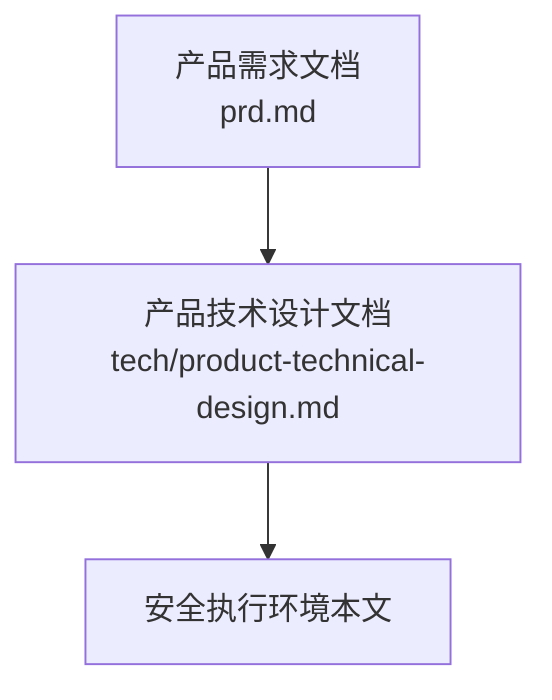
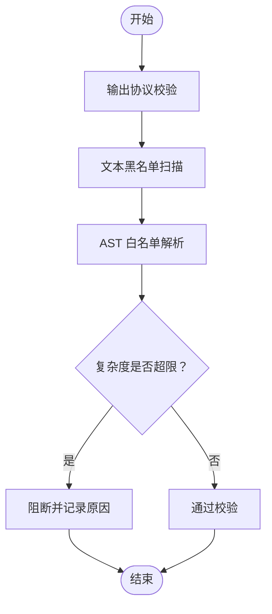
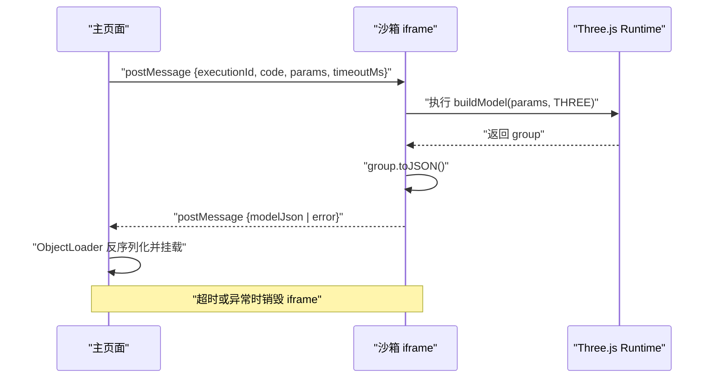
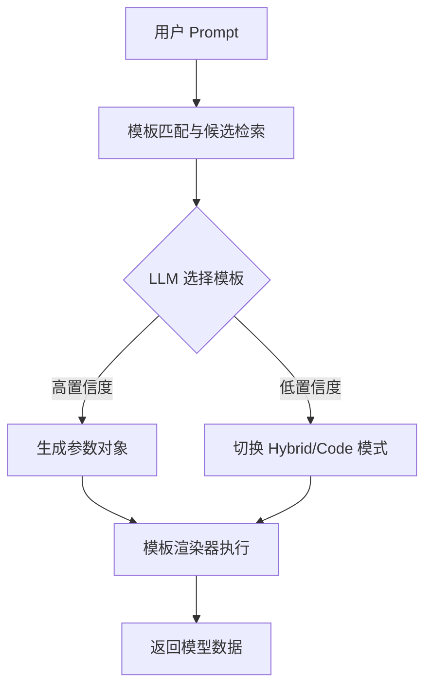
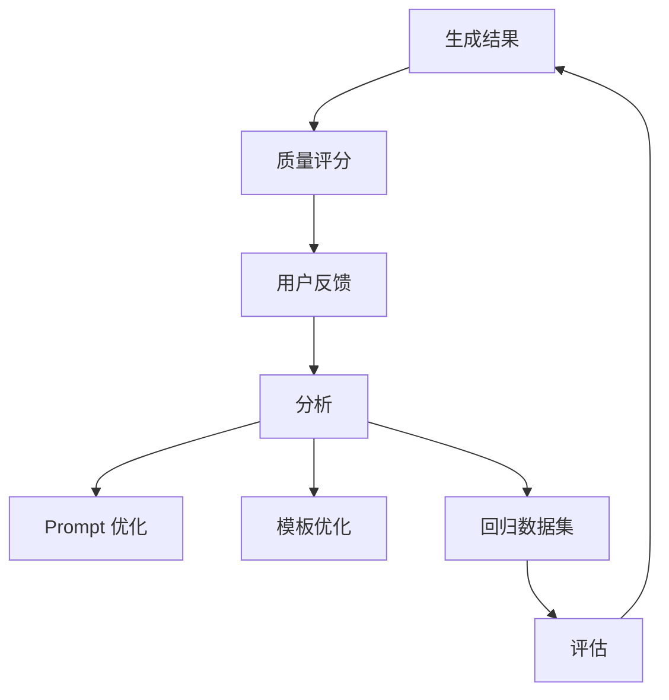
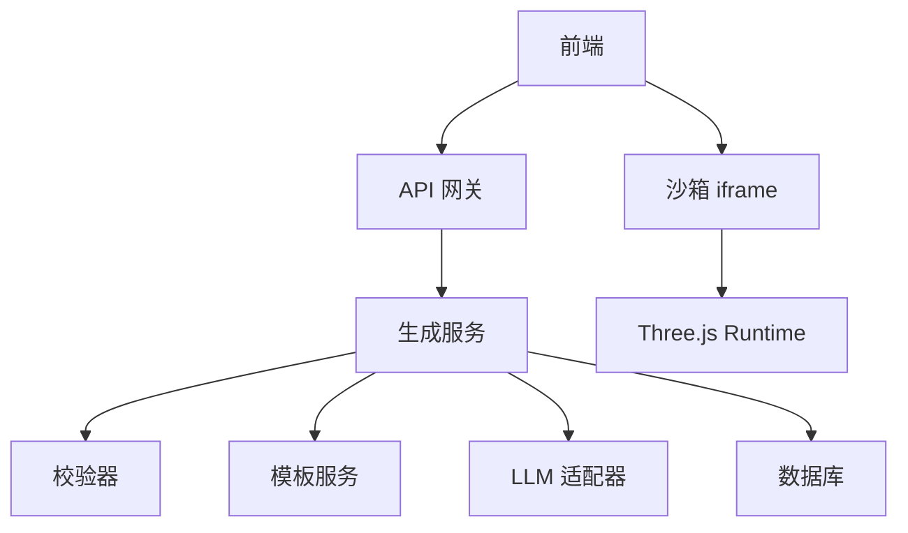

# 安全执行环境

<cite>
**本文引用的文件**
- [产品需求文档](file://prd.md)
- [产品技术设计文档](file://tech/product-technical-design.md)
</cite>

## 目录
1. [引言](#引言)
2. [项目结构](#项目结构)
3. [核心组件](#核心组件)
4. [架构总览](#架构总览)
5. [详细组件分析](#详细组件分析)
6. [依赖关系分析](#依赖关系分析)
7. [性能与容量规划](#性能与容量规划)
8. [故障排查指南](#故障排查指南)
9. [结论](#结论)
10. [附录：配置项与错误码](#附录配置项与错误码)

## 引言
本章节聚焦 ApexForge 的安全执行环境，围绕“多层安全防护体系”展开，涵盖 AST 语法树分析、代码白名单策略、iframe 沙箱隔离与运行时保护。文档同时说明黑名单 API 检测、复杂度限制、超时控制与错误分类机制，并给出来自仓库文档中的具体示例与路径引用，帮助初学者快速上手，也为有经验的开发者提供深入的技术细节。

## 项目结构
当前仓库包含产品与技术设计文档，用于指导后续工程落地。安全执行环境的设计在技术设计文档中进行了系统化阐述，包括生成链路、校验分层、沙箱运行时、错误分类等关键内容。



图表来源
- [产品需求文档](file://prd.md)
- [产品技术设计文档](file://tech/product-technical-design.md)

章节来源
- [产品需求文档:1-168](file://prd.md#L1-L168)
- [产品技术设计文档:1-1149](file://tech/product-technical-design.md#L1-L1149)

## 核心组件
- 代码安全校验层
  - 输出协议校验：确保 LLM 返回的结构符合约定，便于后续处理与审计。
  - 文本黑名单：快速阻断明显危险代码片段。
  - AST 白名单：精确限制可使用的 API、语法与复杂度。
- 沙箱运行时
  - iframe 隔离：通过 sandbox 与 CSP 限制能力面，仅暴露受控的 Three.js 运行环境与参数。
  - 超时销毁：对异常或超时的执行进行自动回收，避免主线程阻塞。
- 结果校验与质量评分
  - 模型 JSON 合法性检查与复杂度评估，结合用户反馈形成质量闭环。

章节来源
- [产品技术设计文档:428-470](file://tech/product-technical-design.md#L428-L470)
- [产品技术设计文档:472-518](file://tech/product-technical-design.md#L472-L518)
- [产品技术设计文档:807-841](file://tech/product-technical-design.md#L807-L841)

## 架构总览
下图展示了从前端到后端再到沙箱执行的端到端流程，以及安全校验与质量评分在链路中的位置。

```mermaid
sequenceDiagram
participant FE as "前端"
participant API as "API 网关/服务"
participant GEN as "生成服务"
participant VAL as "校验器"
participant BOX as "沙箱 iframe"
participant DB as "数据库"
FE->>API : "创建生成任务"
API->>GEN : "编排生成流程"
GEN->>VAL : "AST/黑名单/复杂度校验"
VAL-->>GEN : "校验报告"
GEN->>DB : "持久化任务与结果"
GEN-->>FE : "返回可渲染结果"
FE->>BOX : "postMessage 执行代码"
BOX-->>FE : "返回序列化模型数据或错误"
```

图表来源
- [产品技术设计文档:359-391](file://tech/product-technical-design.md#L359-L391)
- [产品技术设计文档:472-518](file://tech/product-technical-design.md#L472-L518)

## 详细组件分析

### 代码安全校验层（AST 与白名单）
- 校验分层
  - 输出协议校验：约束 mode、templateId、params、code 等字段结构与类型。
  - 文本黑名单：拦截 eval、Function、fetch、WebSocket、import 等危险调用。
  - AST 白名单：允许基础变量声明、函数声明、对象/数组字面量、Math 白名单方法、Three.js 白名单构造器与安全方法。
- 复杂度限制
  - 最大代码长度、AST 深度、循环嵌套层数、Mesh 数量、几何体顶点估算等阈值。
- 违规处理
  - 记录阻断原因与警告信息，支持自动修复与重试策略。



图表来源
- [产品技术设计文档:428-470](file://tech/product-technical-design.md#L428-L470)

章节来源
- [产品技术设计文档:428-470](file://tech/product-technical-design.md#L428-L470)

### 沙箱运行时（iframe 隔离与超时控制）
- 隔离方案
  - 隐藏 iframe，sandbox="allow-scripts"，CSP 仅允许加载预构建 runtime。
  - 仅暴露 THREE、安全构建函数与 params，禁止网络、DOM、同源访问。
- 执行流程
  - 主页面生成 executionId，向 iframe 发送执行指令与超时时间。
  - iframe 内执行 buildModel(params, THREE)，成功后调用 group.toJSON() 返回结构化 JSON。
  - 主页面使用 ObjectLoader 反序列化并挂载场景；若超时或异常则销毁 iframe 并返回错误。
- 错误分类
  - 定义 SANDBOX_TIMEOUT、SANDBOX_RUNTIME_ERROR、MODEL_JSON_INVALID、MODEL_TOO_COMPLEX、MODEL_EMPTY 等错误码及用户提示。



图表来源
- [产品技术设计文档:472-518](file://tech/product-technical-design.md#L472-L518)

章节来源
- [产品技术设计文档:472-518](file://tech/product-technical-design.md#L472-L518)

### 模板系统与参数化生成
- 模板分层
  - Skeleton（骨架）、Style Variant（风格变体）、Detail Pack（装饰件）、Material Preset（材质预设）、Param Schema（参数 Schema）。
- 匹配策略
  - 类别识别与关键词抽取，向量检索候选模板，LLM 选择最匹配模板并生成参数；置信度低时切换 Hybrid 或 Code Mode。
- 优势
  - 降低安全风险与复杂度，提升稳定性与生成速度。



图表来源
- [产品技术设计文档:760-804](file://tech/product-technical-design.md#L760-L804)

章节来源
- [产品技术设计文档:760-804](file://tech/product-technical-design.md#L760-L804)

### 质量评分与合规审核
- 评分维度
  - 可渲染性、Prompt 匹配度、结构完整性、性能表现、可编辑性。
- 数据来源
  - AST 校验结果、几何体数量、顶点数、材质数、沙箱执行成功与否、边界盒尺寸、空模型检测、用户反馈与保存行为。
- 闭环优化
  - 基于评分与反馈持续优化 Prompt、模板与模型选择策略。



图表来源
- [产品技术设计文档:807-841](file://tech/product-technical-design.md#L807-L841)

章节来源
- [产品技术设计文档:807-841](file://tech/product-technical-design.md#L807-L841)

## 依赖关系分析
- 模块耦合
  - 生成服务依赖校验器、模板服务、LLM 适配器与数据库。
  - 前端依赖沙箱客户端与 SceneManager，负责 UI 交互与渲染。
- 外部依赖
  - LLM 供应商（DeepSeek、Qwen 等），缓存与队列（Redis、BullMQ 等），对象存储（S3/MinIO/OSS）。
- 潜在风险
  - 多供应商路由与降级需稳健实现；AST 白名单与黑名单需持续维护；沙箱逃逸防护需定期安全测试。



图表来源
- [产品技术设计文档:359-391](file://tech/product-technical-design.md#L359-L391)
- [产品技术设计文档:472-518](file://tech/product-technical-design.md#L472-L518)

章节来源
- [产品技术设计文档:359-391](file://tech/product-technical-design.md#L359-L391)
- [产品技术设计文档:472-518](file://tech/product-technical-design.md#L472-L518)

## 性能与容量规划
- 前端
  - 动态加载 Three.js 与沙箱 runtime，模型 JSON 解析放入 Worker，InstancedMesh 批量渲染重复元素，释放旧模型资源。
- 后端
  - 相似 Prompt 缓存复用，模板模式跳过 LLM 直接生成参数，异步化生成任务，并发与熔断控制。
- 数据库
  - 合理索引 traceId、workspaceId、createdAt 等字段，大字段迁移至对象存储，历史任务归档。

章节来源
- [产品技术设计文档:933-958](file://tech/product-technical-design.md#L933-L958)

## 故障排查指南
- 常见问题定位
  - 生成失败率过高：检查 LLM 延迟、校验失败突增、沙箱超时突增等告警指标。
  - 沙箱超时：确认模型复杂度是否超过阈值，必要时引导用户使用模板模式或降低细节。
  - 校验失败：查看阻断原因与警告信息，调整 Prompt 或模板覆盖范围。
- 日志与追踪
  - 全链路 traceId 贯穿前端、网关、生成服务、校验器、数据库与沙箱执行。
  - 记录耗时、状态、错误码、质量分等关键字段，便于问题回溯。

章节来源
- [产品技术设计文档:868-908](file://tech/product-technical-design.md#L868-L908)
- [产品技术设计文档:472-518](file://tech/product-technical-design.md#L472-L518)

## 结论
ApexForge 的安全执行环境以“校验分层 + 沙箱隔离 + 结果校验 + 质量闭环”为核心，兼顾灵活性与安全性。通过 AST 白名单与黑名单、复杂度限制、iframe 沙箱与超时销毁，有效降低恶意代码与不稳定输出的风险；配合模板系统与质量评分，持续提升生成成功率与用户体验。建议在工程落地阶段优先完成 MVP 技术验证，建立回归集与高质量模板库，尽早实现 traceId 与错误码体系，为后续平台化演进奠定基础。

## 附录：配置项与错误码

- 配置项（建议值）
  - 最大代码长度：MVP 20KB，Beta 可配置。
  - 最大 AST 深度：小于 30。
  - 最大循环层数：2。
  - 最大 Mesh 数量：MVP 80，Beta 按套餐配置。
  - 最大几何体顶点估算：依据几何参数预估。
  - 输入长度限制：Prompt < 2000 字符。
  - 沙箱超时：根据任务复杂度设定，默认建议 5～15 秒。

- 错误码与用户提示
  - SANDBOX_TIMEOUT：执行超时，提示模型过于复杂，已终止渲染。
  - SANDBOX_RUNTIME_ERROR：运行时报错，提示生成代码存在执行问题，可重试。
  - MODEL_JSON_INVALID：返回结构非法，提示模型数据无效，系统将重新生成。
  - MODEL_TOO_COMPLEX：模型复杂度超限，提示降低细节或使用模板模式。
  - MODEL_EMPTY：未生成有效对象，提示描述过于模糊，请补充模型主体。

章节来源
- [产品技术设计文档:428-470](file://tech/product-technical-design.md#L428-L470)
- [产品技术设计文档:472-518](file://tech/product-technical-design.md#L472-L518)
- [产品技术设计文档:910-931](file://tech/product-technical-design.md#L910-L931)