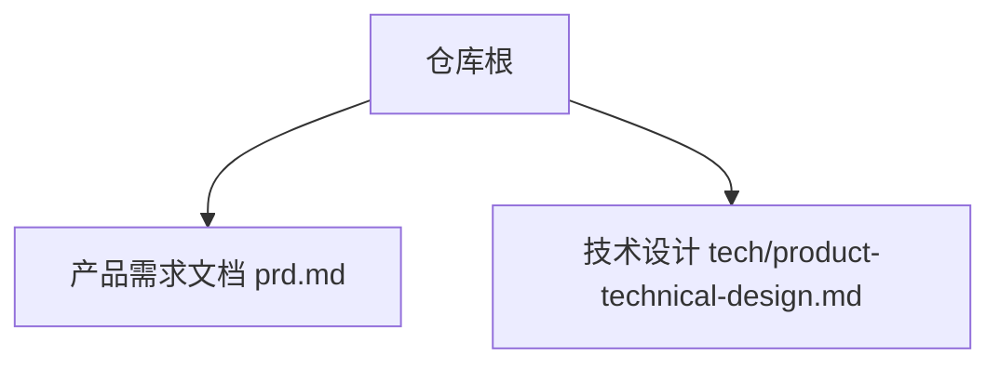
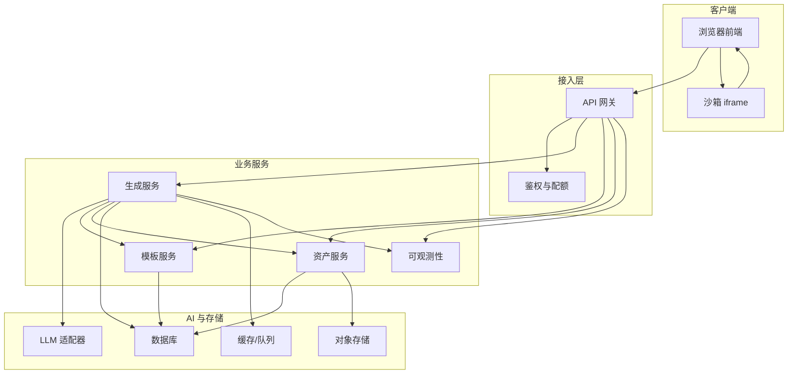
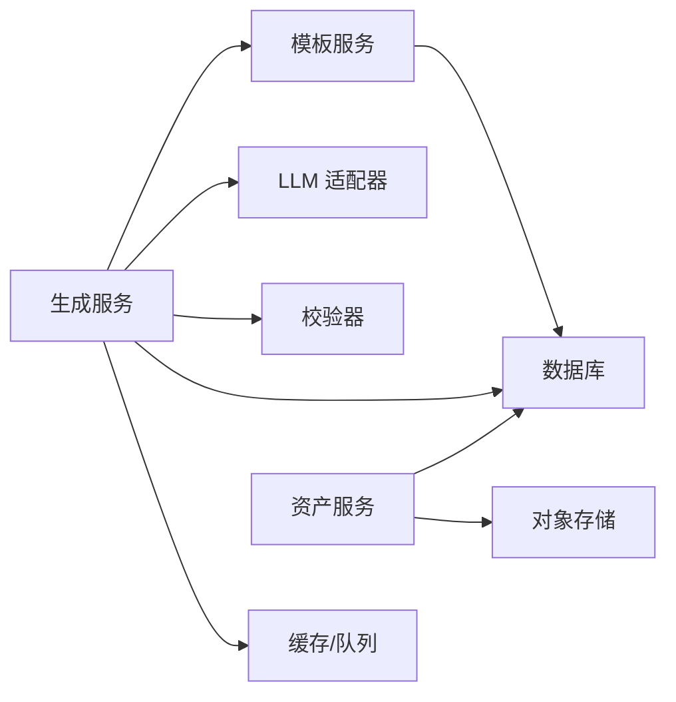

# 开放 API 生态

<cite>
**本文引用的文件**   
- [产品需求文档](file://prd.md)
- [产品技术设计文档](file://tech/product-technical-design.md)
</cite>

## 目录
1. [引言](#引言)
2. [项目结构](#项目结构)
3. [核心组件](#核心组件)
4. [架构总览](#架构总览)
5. [详细组件分析](#详细组件分析)
6. [依赖关系分析](#依赖关系分析)
7. [性能与稳定性](#性能与稳定性)
8. [故障排查指南](#故障排查指南)
9. [结论](#结论)
10. [附录](#附录)

## 引言
本文件面向开发者与合作伙伴，系统化阐述 ApexForge 的开放 API 生态。内容覆盖 RESTful API 设计规范、实时通信（SSE/WebSocket）、认证授权机制、限流熔断策略，以及生成任务管理、资产操作、模板服务与事件订阅等核心接口使用方法。文档同时给出错误码定义、请求/响应格式约定、最佳实践、SDK 开发指南、API 版本管理与第三方集成案例，帮助初学者快速上手，并为有经验的工程师提供深入的技术细节。

## 项目结构
仓库当前包含产品与技术设计文档，用于指导平台化落地与开放 API 生态建设：
- 产品需求文档：明确业务目标、系统架构概览、安全与性能策略、数据流与交互流程等。
- 产品技术设计文档：定义总体架构、领域模型、数据模型、生成链路、代码安全校验、沙箱运行时、前后端模块划分、API 规范、模板系统、质量评分、权限计费、可观测性、工程计划与验收标准等。



章节来源
- [产品需求文档:1-168](file://prd.md#L1-L168)
- [产品技术设计文档:1-1149](file://tech/product-technical-design.md#L1-L1149)

## 核心组件
围绕开放 API 生态，以下组件构成关键能力边界：
- API 网关与鉴权：统一入口、JWT/API Key 鉴权、限流与审计。
- 生成服务：编排 Prompt、选择模式（缓存/模板/混合/代码）、调用 LLM、执行校验与修复、产出结果。
- 模板服务：模板列表、详情、渲染与版本管理。
- 资产服务：创建资产、查询版本、导出与元数据管理。
- 事件通道：SSE/WebSocket 推送任务状态与中间结果。
- 可观测与质量评估：traceId、日志、指标、告警与质量评分闭环。

章节来源
- [产品技术设计文档:574-630](file://tech/product-technical-design.md#L574-L630)
- [产品技术设计文档:632-758](file://tech/product-technical-design.md#L632-L758)
- [产品技术设计文档:760-804](file://tech/product-technical-design.md#L760-L804)
- [产品技术设计文档:807-841](file://tech/product-technical-design.md#L807-L841)
- [产品技术设计文档:868-908](file://tech/product-technical-design.md#L868-L908)

## 架构总览
整体采用“前端 SPA + NestJS 后端 + 多供应商 LLM + 模板/资产/校验/可观测”的分层架构。MVP 阶段使用 SQLite 与本地存储，平台化后演进为微服务、消息队列、对象存储与 Redis 缓存。



图表来源
- [产品技术设计文档:34-101](file://tech/product-technical-design.md#L34-L101)
- [产品技术设计文档:574-630](file://tech/product-technical-design.md#L574-L630)

章节来源
- [产品技术设计文档:34-101](file://tech/product-technical-design.md#L34-L101)

## 详细组件分析

### 1) RESTful API 设计规范
- 基础路径：/api/v1
- 认证方式：用户侧 JWT；开放平台 API Key
- 通用响应：包含 traceId；错误体统一结构
- 分页与过滤：按资源维度支持 page/pageSize、排序字段
- 幂等与重试：对创建类接口建议幂等键；客户端在 429/5xx 时指数退避重试

错误响应结构示例（字段说明见下）：
- traceId：链路追踪 ID
- error.code：错误码
- error.message：人类可读信息
- error.details：结构化详情（可选）

章节来源
- [产品技术设计文档:632-652](file://tech/product-technical-design.md#L632-L652)

### 2) 认证与授权
- 用户登录：JWT 令牌，携带用户身份与工作空间上下文
- 开放 API：API Key 作为凭证，绑定工作空间与配额
- 权限模型：Owner/Admin/Editor/Viewer/API Client，细粒度到工作空间与资源
- 配额维度：每日次数、每分钟请求、并发任务数、最大复杂度、存储空间、API 调用量、高级模型额度

章节来源
- [产品技术设计文档:844-865](file://tech/product-technical-design.md#L844-L865)

### 3) 限流与熔断
- 限流策略：令牌桶或滑动窗口，按用户/工作空间/密钥维度控制
- 熔断降级：LLM 供应商失败率/延迟阈值触发熔断，自动切换备用供应商或回退模板模式
- 重试与退避：对瞬时错误进行有限次重试，指数退避并记录 traceId

章节来源
- [产品技术设计文档:944-951](file://tech/product-technical-design.md#L944-L951)

### 4) 生成任务管理
- 创建任务：POST /api/v1/generations
  - 请求关键字段：projectId、prompt、category、mode、contextVersionId、preferences
  - 返回关键字段：taskId、status、mode、templateId、params、code、validationReport、qualityScore
- 查询任务：GET /api/v1/generations/{taskId}
  - 返回任务状态、结果、错误信息与质量评分
- 保存为资产：POST /api/v1/assets
  - 请求关键字段：projectId、generationTaskId、name、tags

章节来源
- [产品技术设计文档:654-723](file://tech/product-technical-design.md#L654-L723)

### 5) 资产操作
- 查询资产版本：GET /api/v1/assets/{assetId}/versions
  - 返回该资产全部版本、Prompt、参数、截图与指标
- 导出能力：JS、JSON、截图、glTF（Beta+）
- 版本回滚：基于 ModelVersion 的切换与快照

章节来源
- [产品技术设计文档:718-723](file://tech/product-technical-design.md#L718-L723)
- [产品技术设计文档:976-987](file://tech/product-technical-design.md#L976-L987)

### 6) 模板服务
- 模板列表：GET /api/v1/templates
- 模板详情：GET /api/v1/templates/{id}
- 模板渲染：POST /api/v1/templates/{id}/render
- 模板发布：POST /api/v1/templates/{id}/versions
- 模板创建（管理端）：POST /api/v1/templates

模板结构与匹配策略：
- 模板分层：骨架、风格变体、细节包、材质预设、参数 Schema
- 匹配流程：类别识别与关键词抽取 → 标签/向量检索候选 → LLM 选择模板并生成参数 → 置信度不足则切换 Hybrid/Code 模式

章节来源
- [产品技术设计文档:724-733](file://tech/product-technical-design.md#L724-L733)
- [产品技术设计文档:760-804](file://tech/product-technical-design.md#L760-L804)

### 7) 事件订阅（SSE/WebSocket）
- SSE 事件端点：GET /api/v1/generations/{taskId}/events
- 事件类型：queued、generating、validating、repairing、renderable、failed
- 事件体包含 event、traceId、taskId、message 等字段

章节来源
- [产品技术设计文档:734-757](file://tech/product-technical-design.md#L734-L757)

### 8) 生成链路与时序
```mermaid
sequenceDiagram
participant FE as "前端"
participant API as "API 网关"
participant GEN as "生成服务"
participant CACHE as "缓存"
participant TPL as "模板服务"
participant LLM as "LLM 适配器"
participant VAL as "校验器"
participant DB as "数据库"
participant BOX as "沙箱"
FE->>API : "POST /api/v1/generations"
API->>GEN : "createGenerationTask"
GEN->>CACHE : "querySimilarPrompt"
alt "命中缓存"
CACHE-->>GEN : "复用结果"
else "未命中"
GEN->>TPL : "findCandidateTemplate"
TPL-->>GEN : "候选模板"
GEN->>LLM : "generate code or params"
LLM-->>GEN : "生成输出"
GEN->>VAL : "validate output"
VAL-->>GEN : "校验报告"
end
GEN->>DB : "持久化任务与结果"
GEN-->>API : "结果"
API-->>FE : "生成载荷"
FE->>BOX : "iframe 中执行"
BOX-->>FE : "模型 JSON 或错误"
```

图表来源
- [产品技术设计文档:361-390](file://tech/product-technical-design.md#L361-L390)

章节来源
- [产品技术设计文档:361-390](file://tech/product-technical-design.md#L361-L390)

### 9) 代码安全与沙箱
- 校验分层：协议校验 → 文本黑名单 → AST 白名单 → 运行时沙箱 → 超时销毁 → 结果校验
- 黑名单 API：动态执行、网络访问、DOM 访问、动态加载、原型污染、计算风险
- 白名单语法：变量/函数声明、基础运算、受限 Three.js API、安全方法
- 限制策略：代码长度、AST 深度、循环层数、Mesh 数量、顶点估算、全局变量白名单
- 沙箱方案：隐藏 iframe + CSP + sandbox 属性，postMessage 传递执行指令与结果
- 错误分类：SANDBOX_TIMEOUT、SANDBOX_RUNTIME_ERROR、MODEL_JSON_INVALID、MODEL_TOO_COMPLEX、MODEL_EMPTY

章节来源
- [产品技术设计文档:428-518](file://tech/product-technical-design.md#L428-L518)

### 10) 质量评分体系
- 评分维度：可渲染性、Prompt 匹配度、结构完整性、性能表现、可编辑性
- 自动评分输入：模式与模板命中、AST 校验、几何/材质统计、沙箱执行结果、边界盒与空模型检测、用户反馈
- 质量闭环：生成结果 → 评分 → 用户反馈 → 分析与优化 → 回归数据集 → 评估

章节来源
- [产品技术设计文档:807-841](file://tech/product-technical-design.md#L807-L841)

### 11) 错误码与异常处理
- 统一错误体：traceId、error.code、error.message、error.details
- 常见服务端错误码（示例）：
  - GENERATION_VALIDATION_FAILED：生成结果未通过安全校验
  - LLM_PROVIDER_ERROR：供应商不可用或超时
  - TEMPLATE_NOT_FOUND：模板不存在或未发布
  - ASSET_SAVE_FAILED：资产持久化失败
  - QUOTA_EXCEEDED：超出配额
- 沙箱错误码：
  - SANDBOX_TIMEOUT：执行超时
  - SANDBOX_RUNTIME_ERROR：运行时报错
  - MODEL_JSON_INVALID：返回结构非法
  - MODEL_TOO_COMPLEX：复杂度超限
  - MODEL_EMPTY：未生成有效对象

章节来源
- [产品技术设计文档:632-652](file://tech/product-technical-design.md#L632-L652)
- [产品技术设计文档:508-518](file://tech/product-technical-design.md#L508-L518)

### 12) SDK 开发指南
- 语言与工具：TypeScript/JavaScript SDK 优先，配套 OpenAPI/Swagger 自动生成
- 初始化：配置 Base URL、鉴权（JWT 或 API Key）、traceId 注入
- 客户端能力：
  - 生成任务：create、get、list、cancel
  - 资产：create、listVersions、export
  - 模板：list、get、render
  - 事件：SSE 连接与重连、断线恢复
- 重试与退避：对 429/5xx 指数退避，带 jitter
- 错误映射：将服务端错误码映射为 SDK 异常类型，附带 traceId 与 details
- 测试：Mock LLM 与模板渲染，覆盖成功/失败/超时/复杂度过限场景

章节来源
- [产品技术设计文档:632-758](file://tech/product-technical-design.md#L632-L758)
- [产品技术设计文档:944-951](file://tech/product-technical-design.md#L944-L951)

### 13) API 版本管理
- 版本前缀：/api/v1
- 兼容策略：新增字段向后兼容，删除字段需废弃期公告
- 变更流程：提案 → 评审 → 灰度 → 全量 → 下线
- 迁移指南：提供新旧版本对照表与迁移脚本

章节来源
- [产品技术设计文档:632-652](file://tech/product-technical-design.md#L632-L652)

### 14) 第三方集成案例
- 游戏引擎导入：通过资产导出接口获取 JS/JSON/glTF，结合引擎管线加载
- 工业 CAD 联动：以模板模式批量生成参数化变体，结合 PLM 系统进行版本管理
- 低代码平台：嵌入模板渲染与预览，驱动可视化搭建
- 自动化流水线：CI/CD 中调用生成与导出接口，完成构建与发布

章节来源
- [产品技术设计文档:976-987](file://tech/product-technical-design.md#L976-L987)

## 依赖关系分析
- 模块耦合：
  - 生成服务依赖模板服务、LLM 适配器、校验器、缓存与数据库
  - 资产服务依赖数据库与对象存储
  - 模板服务依赖数据库与缓存
- 外部依赖：
  - LLM 供应商（DeepSeek、Qwen 等）
  - 数据库（SQLite/PostgreSQL）
  - 缓存/队列（Redis/BullMQ/RabbitMQ/Kafka）
  - 对象存储（S3/MinIO/OSS）
- 潜在循环依赖：应避免生成服务直接反向依赖资产服务，通过事件或异步任务解耦



图表来源
- [产品技术设计文档:594-630](file://tech/product-technical-design.md#L594-L630)

章节来源
- [产品技术设计文档:594-630](file://tech/product-technical-design.md#L594-L630)

## 性能与稳定性
- 前端优化：按需加载 Three.js runtime、Worker 解析大模型、InstancedMesh、LOD、释放旧模型资源
- 后端优化：相似 Prompt 缓存、模板模式跳过 LLM、异步任务、供应商并发与熔断、热门模板缓存
- 数据库优化：索引设计、大字段迁移至对象存储、历史归档
- 可观测性：traceId 贯穿全链路，日志字段标准化，告警规则覆盖失败率、延迟、错误率

章节来源
- [产品技术设计文档:933-958](file://tech/product-technical-design.md#L933-L958)
- [产品技术设计文档:868-908](file://tech/product-technical-design.md#L868-L908)

## 故障排查指南
- 常见问题定位步骤：
  1) 根据 traceId 拉取全链路日志，确认请求在各服务的耗时分布
  2) 检查鉴权与配额是否通过，确认 API Key/JWT 有效且未过期
  3) 查看生成任务状态机流转，定位卡在 queued/generating/validating/retrying 的原因
  4) 核对模板匹配与参数 Schema 校验结果，必要时切换到 Code/Hybrid 模式
  5) 审查校验报告与质量评分，关注 AST 阻断原因与复杂度指标
  6) 检查沙箱执行错误码，区分超时、运行时报错、模型无效或过于复杂
- 典型错误码与处置：
  - GENERATION_VALIDATION_FAILED：调整 Prompt 或模板，增加 Few-shot 示例
  - LLM_PROVIDER_ERROR：启用熔断与降级，切换备用供应商
  - SANDBOX_TIMEOUT：降低复杂度或改用模板模式
  - MODEL_TOO_COMPLEX：减少 Mesh/几何体数量，启用 LOD/实例化
  - QUOTA_EXCEEDED：提升套餐或申请临时配额

章节来源
- [产品技术设计文档:632-652](file://tech/product-technical-design.md#L632-L652)
- [产品技术设计文档:508-518](file://tech/product-technical-design.md#L508-L518)
- [产品技术设计文档:898-908](file://tech/product-technical-design.md#L898-L908)

## 结论
ApexForge 的开放 API 生态以“模板优先、安全可控、可观测可度量”为核心原则，通过统一的 REST 接口与事件通道，为第三方提供稳定高效的 AI 3D 模型生成能力。配合完善的鉴权、限流熔断、质量评分与版本管理，平台可在 MVP 阶段快速落地，并在 Beta/Scale 阶段平滑演进为企业级云原生架构。

## 附录

### A. 数据模型摘要
- 用户、工作空间、项目、生成任务、模型资产、模板与版本、校验报告、质量评分、反馈、API Key、审计日志等实体及其关系，详见数据模型设计。

章节来源
- [产品技术设计文档:132-171](file://tech/product-technical-design.md#L132-L171)
- [产品技术设计文档:174-325](file://tech/product-technical-design.md#L174-L325)

### B. 生成模式与状态机
- 模式优先级：Cache Mode → Template Mode → Hybrid Mode → Code Mode
- 状态机：queued → generating → validating → renderable/saved/failed/repairing/retrying

章节来源
- [产品技术设计文档:327-357](file://tech/product-technical-design.md#L327-L357)

### C. 模板结构示例（字段说明）
- templateId、version、category、paramSchema、defaultParams、renderer 等字段定义模板的结构与行为。

章节来源
- [产品技术设计文档:760-785](file://tech/product-technical-design.md#L760-L785)

### D. 推荐目录结构
- apps/web、apps/api、packages/shared-types/prompt-kit/template-runtime/code-validator、tech、docs 等目录组织，便于模块化开发与扩展。

章节来源
- [产品技术设计文档:1001-1036](file://tech/product-technical-design.md#L1001-L1036)