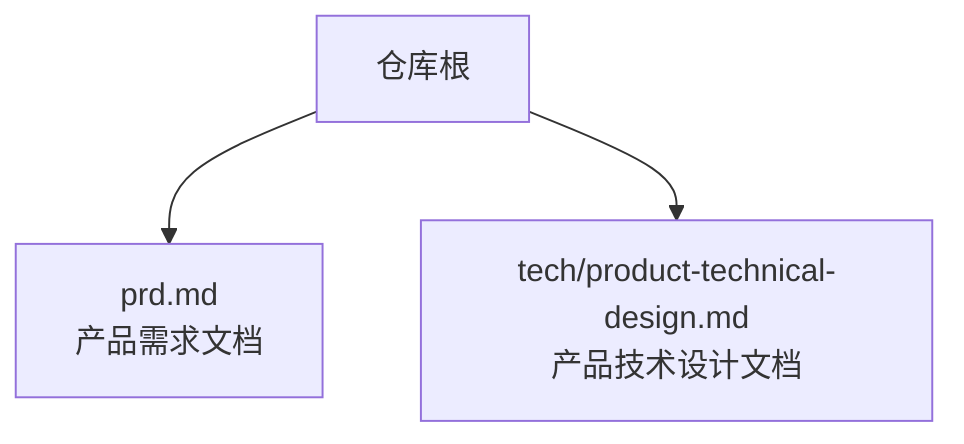
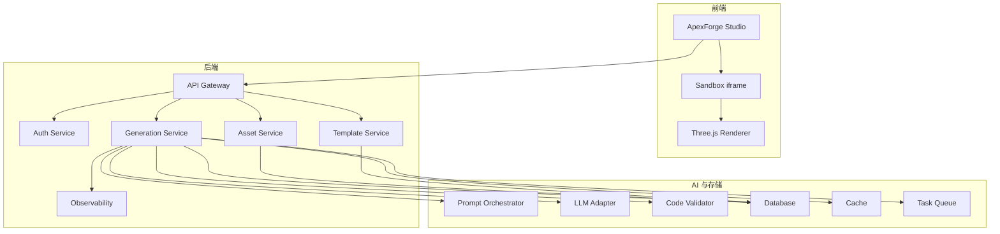
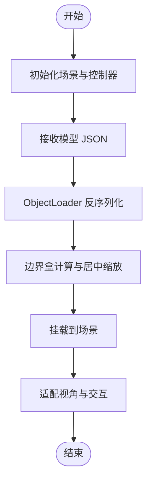
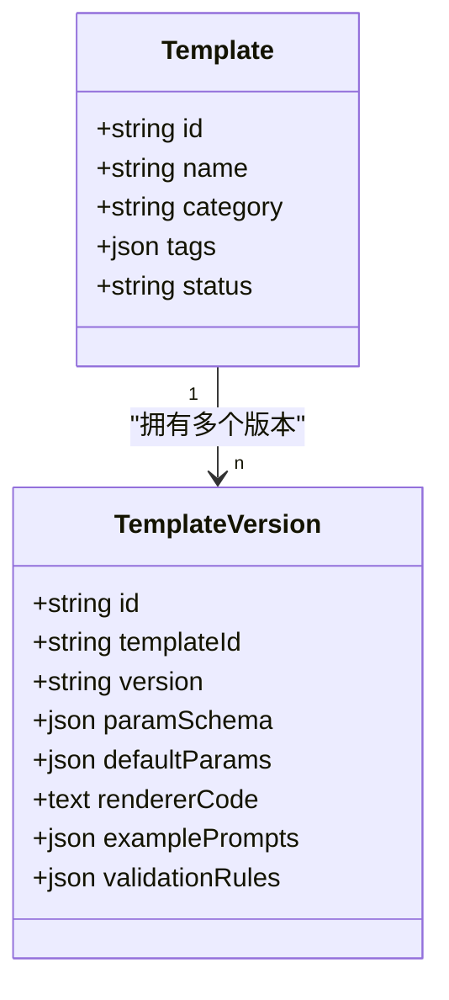
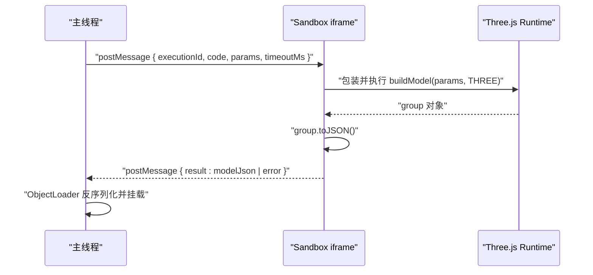
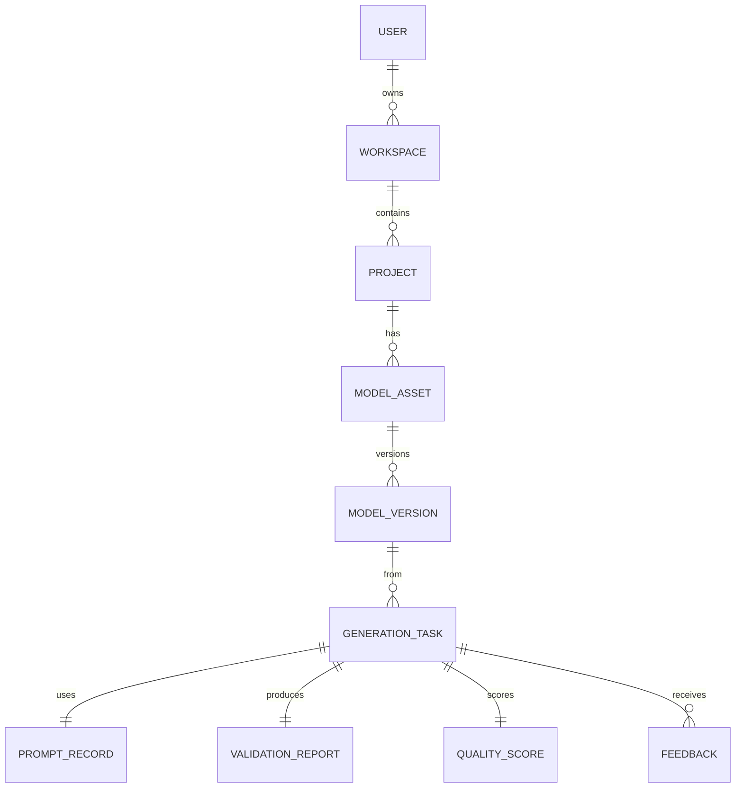
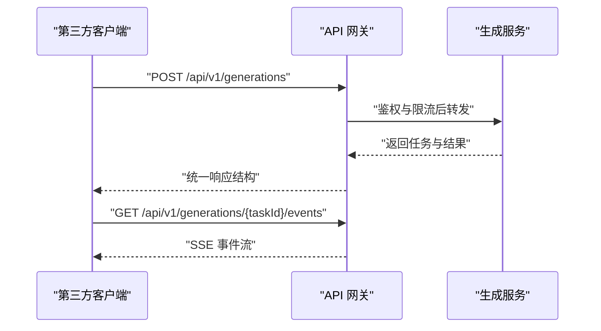
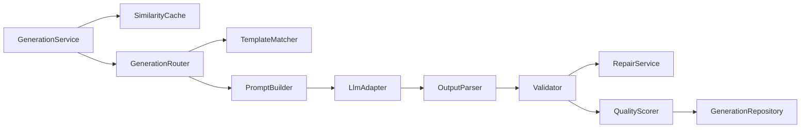

# 核心功能模块

<cite>
**本文引用的文件**   
- [产品需求文档](file://prd.md)
- [产品技术设计文档](file://tech/product-technical-design.md)
</cite>

## 目录
1. [引言](#引言)
2. [项目结构](#项目结构)
3. [核心组件](#核心组件)
4. [架构总览](#架构总览)
5. [详细组件分析](#详细组件分析)
6. [依赖关系分析](#依赖关系分析)
7. [性能考量](#性能考量)
8. [故障排查指南](#故障排查指南)
9. [结论](#结论)
10. [附录：接口与数据模型](#附录接口与数据模型)

## 引言
本文件面向 ApexForge 平台的核心功能模块，聚焦以下能力：AI 驱动的智能生成、Three.js 驱动的 3D 预览与交互、模板系统与参数化、安全执行环境（沙箱）、资产管理与版本控制、开放 API 生态。文档基于仓库中的产品需求与技术设计文档进行系统化梳理，提供从高层架构到关键实现细节的说明，并给出调用关系、接口定义、使用模式、常见问题与解决方案，帮助初学者快速上手，同时为有经验的开发者提供足够的技术深度。

## 项目结构
仓库当前包含两份核心文档：
- 产品需求文档：阐述平台目标、差异化价值、系统架构概览、前端/后端/AI 服务职责划分、Prompt 策略、模板库、代码沙箱、监控与质量保障等。
- 产品技术设计文档：面向可扩展平台化落地，定义逻辑架构、MVP 与平台化部署方案、领域模型、数据表结构、生成链路与时序、Prompt 编排、代码安全校验、iframe 沙箱运行时、前后端模块划分、API 契约、模板系统设计、质量评分体系、权限与计费、可观测性、工程里程碑与目录结构建议、测试策略、关键技术决策与风险预案、验收标准与下一步建议。



**章节来源**
- [产品需求文档:1-168](file://prd.md#L1-L168)
- [产品技术设计文档:1-1149](file://tech/product-technical-design.md#L1-L1149)

## 核心组件
- AI 智能生成与编排：负责 Prompt 构建、多供应商 LLM 适配、输出协议解析、模板匹配与混合模式路由、结果修复与质量评分。
- 3D 渲染与交互：基于 Three.js 的前端场景管理、模型加载、相机与控制器、截图与导出。
- 模板系统与参数化：分层模板（骨架、风格变体、细节包、材质预设）、参数 Schema、默认参数与示例 Prompt。
- 安全执行环境：服务端 AST 白名单与黑名单校验、客户端 iframe 沙箱隔离、超时销毁与错误分类。
- 资产管理与版本控制：任务、资产、版本、校验报告、质量评分、用户反馈的全生命周期管理。
- 开放 API 生态：REST/SSE/WebSocket 接口、鉴权与限流、事件推送与状态查询。

**章节来源**
- [产品需求文档:58-123](file://prd.md#L58-L123)
- [产品技术设计文档:34-101](file://tech/product-technical-design.md#L34-L101)
- [产品技术设计文档:574-630](file://tech/product-technical-design.md#L574-L630)
- [产品技术设计文档:632-758](file://tech/product-technical-design.md#L632-L758)

## 架构总览
整体采用“前端 SPA + 后端 NestJS + AI 生成服务”的分层架构，支持 MVP 单体与平台化微服务两种部署形态。前端通过 iframe 沙箱执行生成的 Three.js 代码，服务端完成 Prompt 编排、LLM 调用、安全校验与持久化，并通过 SSE/WebSocket 将结果实时推送至前端。



**图表来源**
- [产品技术设计文档:38-62](file://tech/product-technical-design.md#L38-L62)
- [产品技术设计文档:69-100](file://tech/product-technical-design.md#L69-L100)

**章节来源**
- [产品技术设计文档:34-101](file://tech/product-technical-design.md#L34-L101)

## 详细组件分析

### AI 驱动的智能生成
- 生成模式优先级：缓存命中 > 模板模式 > 混合模式 > 纯代码模式。
- Prompt 编排：角色设定、强制约束、Few-shot 示例、输出协议 JSON。
- 多供应商 LLM 适配：统一接口、按类型/成本/速度选择、失败重试与降级。
- 输出解析与修复：协议校验、AST 白名单、自动修复与重试。
- 质量评分：可渲染性、Prompt 匹配度、结构完整性、性能表现、可编辑性。

```mermaid
sequenceDiagram
participant FE as "前端"
participant API as "API 网关"
participant GEN as "生成服务"
participant CACHE as "相似缓存"
participant TPL as "模板服务"
participant LLM as "LLM 适配器"
participant VAL as "校验器"
participant DB as "数据库"
participant BOX as "沙箱"
FE->>API : "POST /api/v1/generations"
API->>GEN : "创建生成任务"
GEN->>CACHE : "查询相似 Prompt"
alt "命中缓存"
CACHE-->>GEN : "返回缓存结果"
else "未命中"
GEN->>TPL : "候选模板检索"
TPL-->>GEN : "候选模板列表"
GEN->>LLM : "生成代码或参数"
LLM-->>GEN : "结构化输出"
GEN->>VAL : "AST 与黑名单校验"
VAL-->>GEN : "校验报告"
end
GEN->>DB : "持久化任务与结果"
GEN-->>API : "返回结果"
API-->>FE : "生成载荷"
FE->>BOX : "在 iframe 中执行"
BOX-->>FE : "模型 JSON 或错误"
```

**图表来源**
- [产品技术设计文档:361-390](file://tech/product-technical-design.md#L361-L390)

**章节来源**
- [产品需求文档:73-93](file://prd.md#L73-L93)
- [产品技术设计文档:327-426](file://tech/product-technical-design.md#L327-L426)
- [产品技术设计文档:594-630](file://tech/product-technical-design.md#L594-L630)

### 3D 模型预览与交互（Three.js 集成）
- SceneManager 对外能力：初始化场景、加载模型、清空模型、适配视角、切换背景、截图、释放资源。
- 模型加载流程：接收序列化 JSON，使用 ObjectLoader 反序列化，计算边界盒并居中缩放，挂载到场景。
- 性能策略：动态加载 Three.js、Worker 解析大模型、InstancedMesh 批量渲染、LOD 与复杂度阈值提示、不可见时暂停渲染循环。



**图表来源**
- [产品技术设计文档:551-571](file://tech/product-technical-design.md#L551-L571)

**章节来源**
- [产品需求文档:67-71](file://prd.md#L67-L71)
- [产品技术设计文档:551-571](file://tech/product-technical-design.md#L551-L571)

### 模板系统与参数化
- 模板分层：骨架（主体比例与关键部件位置）、风格变体（曲线与装饰）、细节包（灯带、轮毂等）、材质预设（金属、玻璃、塑料、发光）。
- 参数 Schema：字段类型、格式、范围、默认值与校验规则；默认参数与示例 Prompt。
- 匹配策略：类别识别与关键词抽取、标签与向量检索候选模板、LLM 选择最匹配模板并生成参数；置信度低则切换混合或代码模式。



**图表来源**
- [产品技术设计文档:270-296](file://tech/product-technical-design.md#L270-L296)

**章节来源**
- [产品需求文档:94-104](file://prd.md#L94-L104)
- [产品技术设计文档:760-804](file://tech/product-technical-design.md#L760-L804)

### 安全执行环境（代码沙箱）
- 服务端校验：输出协议校验、文本黑名单、AST 白名单、复杂度限制（最大长度、AST 深度、循环层数、Mesh 数量、顶点估算）。
- 客户端沙箱：隐藏 iframe 仅暴露 THREE 与安全构建函数，postMessage 传递执行指令与参数，执行成功后 group.toJSON() 返回序列化数据；CSP 与 sandbox 属性限制网络与 DOM 访问；超时自动销毁。
- 错误分类：超时、运行时报错、模型 JSON 非法、模型过于复杂、空模型等。



**图表来源**
- [产品技术设计文档:478-506](file://tech/product-technical-design.md#L478-L506)

**章节来源**
- [产品需求文档:105-117](file://prd.md#L105-L117)
- [产品技术设计文档:428-518](file://tech/product-technical-design.md#L428-L518)

### 资产管理与版本控制
- 领域对象：User、Workspace、Project、GenerationTask、ModelAsset、ModelVersion、Template、TemplateVersion、PromptRecord、ValidationReport、QualityScore、Feedback、ApiKey、AuditLog。
- 关系图：空间下项目，项目下资产，资产有多个版本，版本来源于生成任务，任务关联 Prompt、校验报告、质量评分与用户反馈。



**图表来源**
- [产品技术设计文档:155-170](file://tech/product-technical-design.md#L155-L170)

**章节来源**
- [产品技术设计文档:132-170](file://tech/product-technical-design.md#L132-L170)

### 开放 API 生态
- 通用规范：Base URL、认证方式（JWT/API Key）、traceId 响应、统一错误结构。
- 主要接口：创建生成任务、查询任务、保存为资产、查询资产版本、模板 CRUD 与渲染、SSE 事件订阅。
- 事件类型：queued、generating、validating、repairing、renderable、failed。



**图表来源**
- [产品技术设计文档:632-758](file://tech/product-technical-design.md#L632-L758)

**章节来源**
- [产品技术设计文档:632-758](file://tech/product-technical-design.md#L632-L758)

## 依赖关系分析
- 模块耦合与内聚：
  - GenerationService 内部高内聚：缓存、路由、Prompt 构建、LLM 适配、解析、校验、修复、评分、仓储。
  - 前端模块清晰划分：Studio、Assets、Templates、API Console，Viewer 依赖 Scene Manager、Sandbox Client、Metrics。
- 外部依赖与集成点：
  - LLM 多供应商适配，降低绑定风险。
  - 数据库与对象存储分离，大字段迁移至对象存储。
  - 队列与缓存用于异步与热点数据优化。



**图表来源**
- [产品技术设计文档:596-609](file://tech/product-technical-design.md#L596-L609)

**章节来源**
- [产品技术设计文档:574-630](file://tech/product-technical-design.md#L574-L630)

## 性能考量
- 前端：
  - 动态加载 Three.js 与沙箱 runtime，降低首屏体积。
  - 模型 JSON 解析放入 Worker，主线程只做渲染挂载。
  - 重复几何体优先 InstancedMesh，LOD 与复杂度阈值提示。
  - 页面不可见时暂停渲染循环，及时释放 geometry/material/texture。
- 后端：
  - 相似 Prompt 缓存复用，模板模式跳过 LLM 直接参数生成。
  - 生成任务异步化，避免长连接占用。
  - LLM 并发与熔断控制，热门模板与 Schema 缓存。
- 数据库：
  - traceId、workspaceId、createdAt 建索引。
  - 大字段迁移对象存储，历史任务归档。

[本节为通用指导，不直接分析具体文件]

## 故障排查指南
- 常见错误码与处理：
  - SANDBOX_TIMEOUT：执行超时，终止渲染，提示用户降低复杂度或重试。
  - SANDBOX_RUNTIME_ERROR：运行时报错，检查生成代码与参数，允许重试。
  - MODEL_JSON_INVALID：返回结构非法，系统重新生成或回退模板。
  - MODEL_TOO_COMPLEX：复杂度超限，建议使用模板模式或简化描述。
  - MODEL_EMPTY：未生成有效对象，补充模型主体描述。
- 可观测性与告警：
  - 全链路 traceId 贯穿前端、网关、生成服务、LLM、校验、数据库、沙箱。
  - 日志字段包含 userId、workspaceId、taskId、provider、promptVersion、generationMode、latencyMs、status、errorCode、qualityScore。
  - 告警规则：生成失败率过高、LLM 延迟过高、校验失败突增、沙箱超时突增、API 错误率过高。

**章节来源**
- [产品技术设计文档:508-518](file://tech/product-technical-design.md#L508-L518)
- [产品技术设计文档:868-908](file://tech/product-technical-design.md#L868-L908)

## 结论
ApexForge 以“程序化建模 + 模板优先 + 安全沙箱”为核心路径，结合 AI 智能生成与 Three.js 高性能渲染，形成从自然语言到可交互 3D 模型的完整闭环。通过分层模板、参数化、严格的安全校验与可观测体系，平台在保证稳定性的同时兼顾创造力与扩展性。后续演进方向包括多供应商 LLM 路由、团队权限与配额、队列化异步生成与企业私有化部署。

[本节为总结性内容，不直接分析具体文件]

## 附录：接口与数据模型

### 接口定义与使用模式
- 创建生成任务：POST /api/v1/generations
  - 请求字段：projectId、prompt、category、mode、contextVersionId、preferences。
  - 响应字段：traceId、data.taskId、data.status、data.mode、data.templateId、data.params、data.code、validationReport、qualityScore。
- 查询生成任务：GET /api/v1/generations/{taskId}
- 保存为资产：POST /api/v1/assets
- 查询资产版本：GET /api/v1/assets/{assetId}/versions
- 模板接口：
  - GET /api/v1/templates
  - GET /api/v1/templates/{id}
  - POST /api/v1/templates/{id}/render
  - POST /api/v1/templates
  - POST /api/v1/templates/{id}/versions
- SSE 事件：GET /api/v1/generations/{taskId}/events
  - 事件类型：queued、generating、validating、repairing、renderable、failed。

**章节来源**
- [产品技术设计文档:654-758](file://tech/product-technical-design.md#L654-L758)

### 数据模型摘要
- generation_tasks：任务 ID、traceId、workspaceId、projectId、userId、mode、status、prompt、normalizedPrompt、templateId、templateVersionId、generatedCode、generatedParams、errorCode、errorMessage、时间戳。
- model_assets：资产 ID、workspaceId、projectId、name、category、thumbnailUrl、currentVersionId、tags、status、创建者、时间戳。
- model_versions：版本 ID、assetId、generationTaskId、versionNo、code、params、modelJsonUrl、screenshotUrl、metrics、时间戳。
- templates/template_versions：模板元信息、参数 Schema、默认参数、渲染函数代码、示例 Prompt、校验规则、版本语义化。

**章节来源**
- [产品技术设计文档:215-296](file://tech/product-technical-design.md#L215-L296)