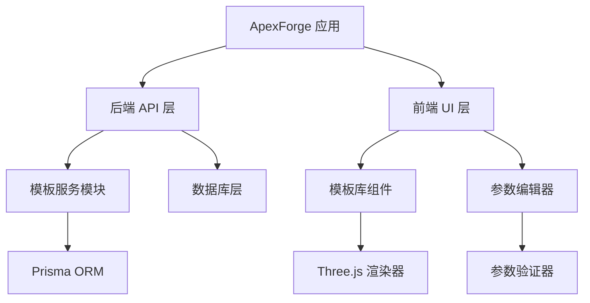
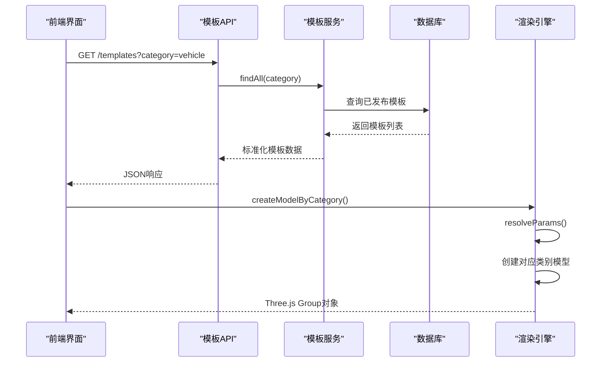
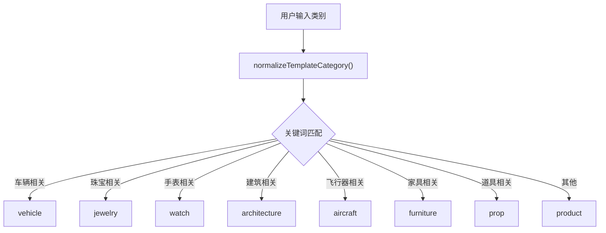
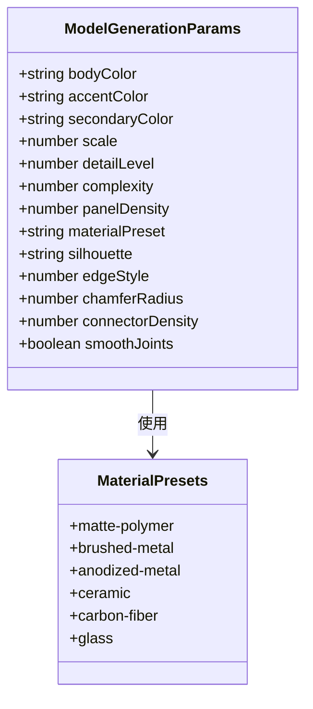
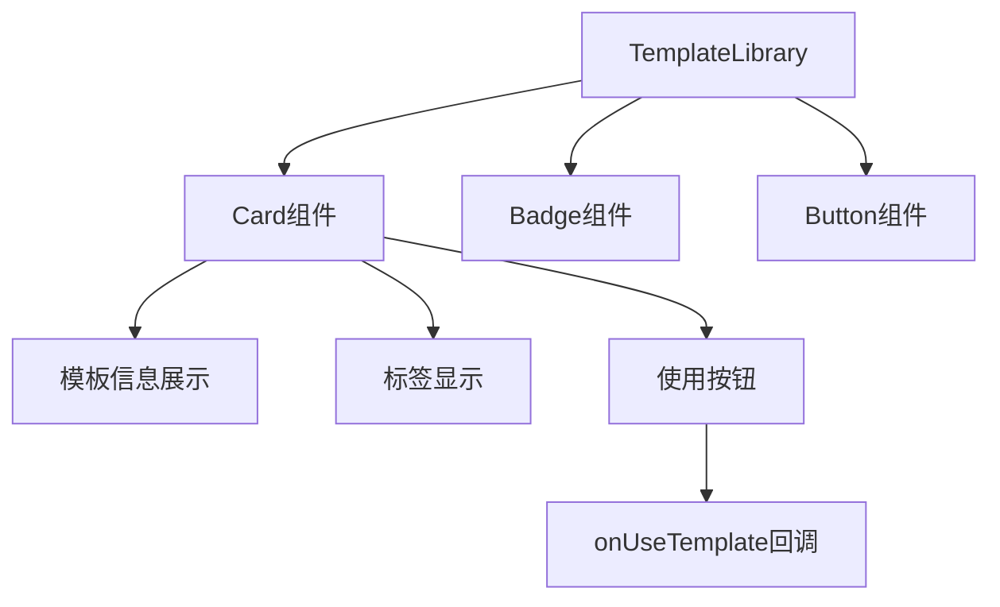
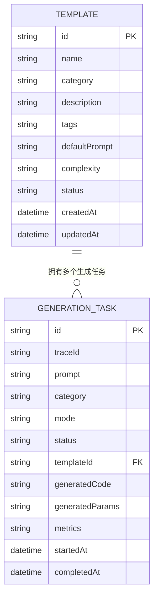
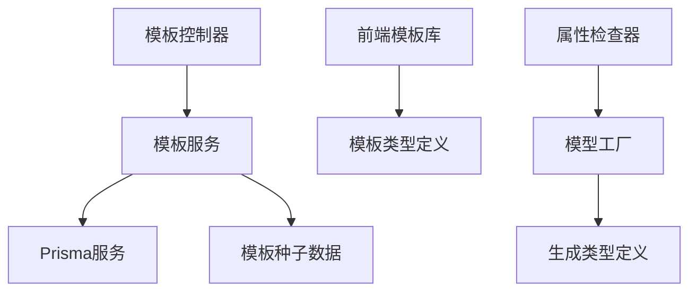

# 模板系统与参数化

<cite>
**本文引用的文件**
- [模板服务](file://apps/api/src/modules/templates/templates.service.ts)
- [模板控制器](file://apps/api/src/modules/templates/templates.controller.ts)
- [模板种子数据](file://apps/api/src/modules/templates/template.seed.ts)
- [模板模块](file://apps/api/src/modules/templates/templates.module.ts)
- [前端模板库组件](file://src/modules/templates/TemplateLibrary.tsx)
- [前端模板数据](file://src/modules/templates/templateData.ts)
- [模板类型定义](file://src/shared/types/template.ts)
- [模型工厂](file://src/modules/viewer/utils/modelFactory.ts)
- [生成类型定义](file://src/shared/types/generation.ts)
- [数据库Schema](file://prisma/schema.prisma)
</cite>

## 更新摘要
**变更内容**
- 新增完整的后端模板系统实现，支持多产品类别预设模板
- 实现动态参数调整与验证机制
- 添加前端模板库组件和参数编辑器
- 集成Three.js渲染引擎与材质系统
- 完善数据库模板表结构与关系映射

## 目录
1. [引言](#引言)
2. [项目结构](#项目结构)
3. [核心组件](#核心组件)
4. [架构总览](#架构总览)
5. [详细组件分析](#详细组件分析)
6. [依赖关系分析](#依赖关系分析)
7. [性能考量](#性能考量)
8. [故障排查指南](#故障排查指南)
9. [结论](#结论)
10. [附录](#附录)

## 引言
ApexForge 的模板系统现已实现完整功能，支持多种产品类别的预设模板和动态参数调整。系统采用分层架构设计，包含后端模板服务、前端模板库、参数验证机制和Three.js渲染引擎，为用户提供灵活高效的3D模型生成体验。

## 项目结构
项目采用前后端分离架构，后端基于NestJS提供模板API服务，前端使用React构建交互式模板库和参数编辑器。



**图表来源**
- [模板服务:1-99](file://apps/api/src/modules/templates/templates.service.ts#L1-L99)
- [前端模板库:1-38](file://src/modules/templates/TemplateLibrary.tsx#L1-L38)
- [模型工厂:1-800](file://src/modules/viewer/utils/modelFactory.ts#L1-L800)

**章节来源**
- [模板服务:1-99](file://apps/api/src/modules/templates/templates.service.ts#L1-L99)
- [模板控制器:1-17](file://apps/api/src/modules/templates/templates.controller.ts#L1-L17)
- [前端模板库:1-38](file://src/modules/templates/TemplateLibrary.tsx#L1-L38)

## 核心组件
- **模板服务**：管理模板生命周期，支持分类查询和最佳匹配选择
- **模板控制器**：提供RESTful API接口，处理HTTP请求
- **模板种子数据**：预置8种产品类别的模板数据
- **前端模板库**：可视化展示模板卡片，支持标签筛选
- **参数解析器**：处理用户输入参数的默认值和范围验证
- **模型工厂**：基于类别创建对应的Three.js模型对象

**章节来源**
- [模板服务:40-99](file://apps/api/src/modules/templates/templates.service.ts#L40-L99)
- [模板控制器:5-17](file://apps/api/src/modules/templates/templates.controller.ts#L5-L17)
- [模板种子数据:1-75](file://apps/api/src/modules/templates/template.seed.ts#L1-L75)
- [前端模板库:13-38](file://src/modules/templates/TemplateLibrary.tsx#L13-L38)
- [模型工厂:68-95](file://src/modules/viewer/utils/modelFactory.ts#L68-L95)

## 架构总览
模板系统采用分层架构，从API层到渲染层形成完整的数据流和处理链路。



**图表来源**
- [模板控制器:9-16](file://apps/api/src/modules/templates/templates.controller.ts#L9-L16)
- [模板服务:72-84](file://apps/api/src/modules/templates/templates.service.ts#L72-L84)
- [模型工厂:404-446](file://src/modules/viewer/utils/modelFactory.ts#L404-L446)

## 详细组件分析

### 模板分类与标准化
系统支持8个主要产品类别，通过关键词匹配实现智能分类：



**图表来源**
- [模板服务:6-38](file://apps/api/src/modules/templates/templates.service.ts#L6-L38)
- [模型工厂:370-402](file://src/modules/viewer/utils/modelFactory.ts#L370-L402)

**章节来源**
- [模板服务:6-38](file://apps/api/src/modules/templates/templates.service.ts#L6-L38)
- [前端模板数据:78-110](file://src/modules/templates/templateData.ts#L78-L110)

### 预设模板数据结构
系统预置了8个高质量模板，覆盖主要产品设计领域：

| 模板ID | 名称 | 类别 | 复杂度 | 描述 |
|--------|------|------|--------|------|
| vehicle.sport-car | 未来跑车 | vehicle | medium | 低趴车身、宽轮距和发光装饰线 |
| architecture.tower | 极简塔楼 | architecture | medium | 几何体堆叠形成的黑白建筑体块 |
| aircraft.drone | 四旋翼飞行器 | aircraft | medium | 清晰表达机身、旋翼、支架结构 |
| furniture.chair | 模块座椅 | furniture | low | 基础几何组成的现代家具 |
| prop.beacon | 科幻信标 | prop | low | 游戏场景和空间道具资产 |
| watch.premium-chronograph | 高级机械腕表 | watch | high | 商业级穿戴产品模型 |
| jewelry.necklace | 高级项链首饰 | jewelry | high | 开放式商业产品模型 |
| product.generic-device | 通用产品设备 | product | high | 开放生成通用模板 |

**章节来源**
- [模板种子数据:1-75](file://apps/api/src/modules/templates/template.seed.ts#L1-L75)

### 动态参数系统
参数系统支持丰富的视觉和结构控制：



**图表来源**
- [生成类型定义:32-65](file://src/shared/types/generation.ts#L32-L65)
- [模型工厂:43-66](file://src/modules/viewer/utils/modelFactory.ts#L43-L66)

**章节来源**
- [模型工厂:68-95](file://src/modules/viewer/utils/modelFactory.ts#L68-L95)
- [生成类型定义:32-65](file://src/shared/types/generation.ts#L32-L65)

### 参数验证与默认值处理
参数解析器确保输入数据的合法性和一致性：


**图表来源**
- [模型工厂:4-11](file://src/modules/viewer/utils/modelFactory.ts#L4-L11)
- [模型工厂:68-95](file://src/modules/viewer/utils/modelFactory.ts#L68-L95)

**章节来源**
- [模型工厂:68-95](file://src/modules/viewer/utils/modelFactory.ts#L68-L95)

### 模板API接口
后端提供简洁的RESTful API：

| 方法 | 路径 | 描述 | 参数 |
|------|------|------|------|
| GET | /api/v1/templates | 获取模板列表 | category?: string |
| GET | /api/v1/templates/:id | 获取模板详情 | id: string |
| POST | /api/v1/templates/:id/render | 渲染模板 | templateId, params |

**章节来源**
- [模板控制器:9-16](file://apps/api/src/modules/templates/templates.controller.ts#L9-L16)

### 前端模板库组件
React组件提供直观的模板浏览体验：



**图表来源**
- [前端模板库:13-38](file://src/modules/templates/TemplateLibrary.tsx#L13-L38)

**章节来源**
- [前端模板库:13-38](file://src/modules/templates/TemplateLibrary.tsx#L13-L38)

### 数据库模型设计
Prisma Schema定义了完整的模板和生成任务关系：



**图表来源**
- [数据库Schema:10-22](file://prisma/schema.prisma#L10-L22)
- [数据库Schema:24-54](file://prisma/schema.prisma#L24-L54)

**章节来源**
- [数据库Schema:10-22](file://prisma/schema.prisma#L10-L22)
- [数据库Schema:24-54](file://prisma/schema.prisma#L24-L54)

## 依赖关系分析
模板系统各组件间存在清晰的依赖层次：



**图表来源**
- [模板模块:5-10](file://apps/api/src/modules/templates/templates.module.ts#L5-L10)
- [前端模板库:1-38](file://src/modules/templates/TemplateLibrary.tsx#L1-L38)
- [模型工厂:1-800](file://src/modules/viewer/utils/modelFactory.ts#L1-L800)

**章节来源**
- [模板模块:5-10](file://apps/api/src/modules/templates/templates.module.ts#L5-L10)
- [模板服务:1-99](file://apps/api/src/modules/templates/templates.service.ts#L1-L99)

## 性能考量
- **模板缓存**：已发布的模板在内存中缓存，减少数据库查询
- **参数预计算**：常用参数组合预先计算，提升渲染速度
- **材质复用**：相同材质的Three.js对象被复用，降低内存占用
- **异步加载**：大型纹理资源异步加载，避免阻塞主线程
- **增量更新**：参数变化时只更新受影响的模型部分

## 故障排查指南
常见问题及解决方案：

1. **模板分类不准确**
   - 检查关键词匹配逻辑
   - 验证输入类别字符串格式
   - 确认数据库中的模板状态为published

2. **参数验证失败**
   - 核对参数类型定义
   - 检查数值范围限制
   - 验证必填字段完整性

3. **渲染性能问题**
   - 监控网格数量和顶点数
   - 检查材质复杂度
   - 优化纹理分辨率

4. **模板数据不同步**
   - 确认种子数据正确导入
   - 检查数据库连接状态
   - 验证模板ID唯一性

**章节来源**
- [模板服务:44-70](file://apps/api/src/modules/templates/templates.service.ts#L44-L70)
- [模型工厂:448-464](file://src/modules/viewer/utils/modelFactory.ts#L448-L464)

## 结论
ApexForge 的模板系统已实现完整功能，支持多产品类别的预设模板和动态参数调整。系统采用现代化技术栈，具备良好的扩展性和维护性。通过分层架构设计和严格的参数验证机制，确保了系统的稳定性和安全性。建议继续完善模板市场生态和创作工具，推动平台向更成熟的3D建模解决方案演进。

## 附录

### 模板类别支持清单
- **车辆类**：汽车、跑车、超级跑车、交通工具
- **珠宝类**：项链、手链、手镯、吊坠、首饰
- **手表类**：腕表、可穿戴设备、计时器
- **建筑类**：建筑、楼房、塔楼、城市结构
- **飞行器类**：无人机、飞机、航空器
- **家具类**：椅子、沙发、桌子、家居用品
- **道具类**：游戏道具、信标、装饰品
- **产品类**：通用产品、电子设备、消费品

### 材质预设选项
- **哑光聚合物**：matte-polymer (金属度0.12, 粗糙度0.82)
- **拉丝金属**：brushed-metal (金属度0.58, 粗糙度0.38)
- **阳极氧化金属**：anodized-metal (金属度0.78, 粗糙度0.28)
- **陶瓷**：ceramic (金属度0.08, 粗糙度0.32)
- **碳纤维**：carbon-fiber (金属度0.42, 粗糙度0.52)
- **玻璃**：glass (金属度0.02, 粗糙度0.08, 透明度0.58)

### API响应格式示例
```json
{
  "traceId": "gen_abc123",
  "data": [
    {
      "id": "vehicle.sport-car",
      "name": "未来跑车",
      "category": "vehicle",
      "description": "低趴车身、宽轮距和发光装饰线",
      "tags": ["车辆", "科幻", "概念"],
      "defaultPrompt": "生成一辆未来感跑车",
      "complexity": "medium",
      "status": "published"
    }
  ]
}
```

**章节来源**
- [模板种子数据:1-75](file://apps/api/src/modules/templates/template.seed.ts#L1-L75)
- [模板控制器:9-16](file://apps/api/src/modules/templates/templates.controller.ts#L9-L16)
- [生成类型定义:67-93](file://src/shared/types/generation.ts#L67-L93)