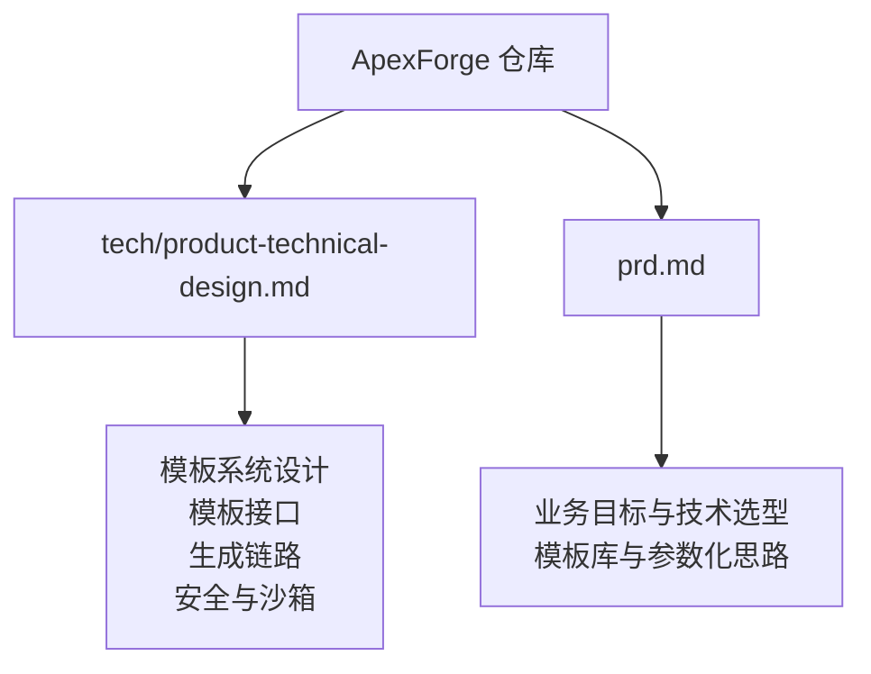
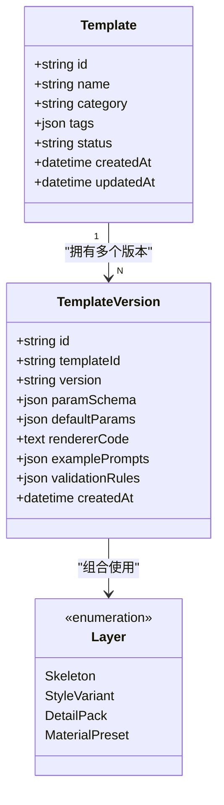
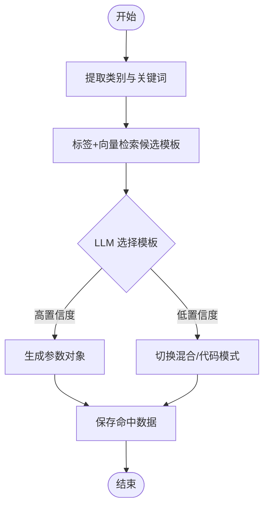
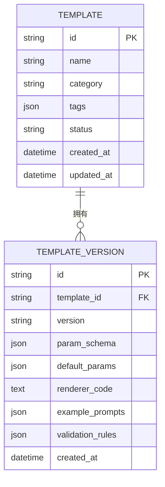
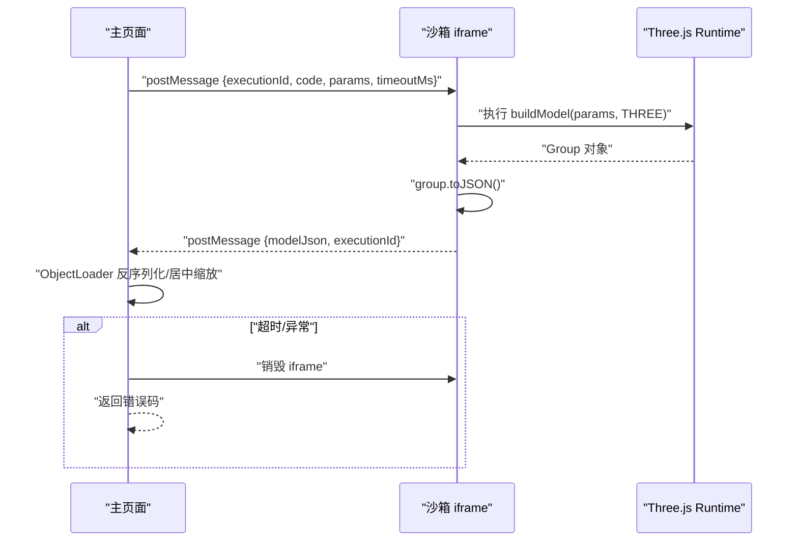
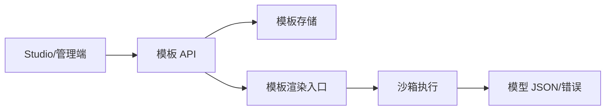
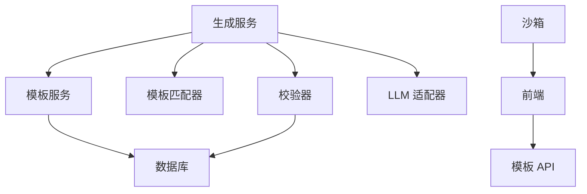

# 模板系统与参数化

<cite>
**本文引用的文件**   
- [产品技术设计文档](file://tech/product-technical-design.md)
- [产品需求文档](file://prd.md)
</cite>

## 目录
1. [引言](#引言)
2. [项目结构](#项目结构)
3. [核心组件](#核心组件)
4. [架构总览](#架构总览)
5. [详细组件分析](#详细组件分析)
6. [依赖关系分析](#依赖关系分析)
7. [性能考量](#性能考量)
8. [故障排查指南](#故障排查指南)
9. [结论](#结论)
10. [附录](#附录)

## 引言
本文件聚焦 ApexForge 的模板系统与参数化能力，围绕模板分层（Skeleton、Style Variant、Detail Pack、Material Preset）、模板匹配策略、版本管理、参数 Schema 定义与默认值处理、渲染函数执行流程展开。同时结合生成链路、安全校验、沙箱执行、质量评分与可观测性，给出从入门到进阶的系统化说明，并附带来自仓库文档的具体示例路径，帮助读者快速理解与落地。

## 项目结构
本项目为设计与规划阶段文档集合，包含产品技术设计与产品需求两份核心文档，覆盖系统架构、数据模型、API、模板系统、安全与性能等关键主题。



图表来源
- [产品技术设计文档:1-120](file://tech/product-technical-design.md#L1-L120)
- [产品需求文档:1-60](file://prd.md#L1-L60)

章节来源
- [产品技术设计文档:1-120](file://tech/product-technical-design.md#L1-L120)
- [产品需求文档:1-60](file://prd.md#L1-L60)

## 核心组件
- 模板服务（Template Service）：负责模板列表、详情、版本管理与渲染入口。
- 生成服务（Generation Service）：编排 Prompt、选择模式（模板/代码/混合/缓存）、调用 LLM、校验与评分。
- 模板匹配器（TemplateMatcher）：基于标签与向量检索候选模板，交由 LLM 做最终选择与参数生成。
- 校验器（Validator）：对输出协议、AST、复杂度进行校验，产出验证报告。
- 沙箱运行时（Sandbox iframe）：在受限环境中执行生成的代码或模板渲染函数，返回结构化模型数据。
- 前端模块：Studio、模板库、参数编辑器、模型查看器、历史与版本管理等。

章节来源
- [产品技术设计文档:574-610](file://tech/product-technical-design.md#L574-L610)
- [产品技术设计文档:520-571](file://tech/product-technical-design.md#L520-L571)

## 架构总览
模板系统在整体生成链路中承担“稳定可控”的关键角色：优先通过模板+参数的方式生成结果，必要时回退到混合或自由代码模式。

```mermaid
sequenceDiagram
participant FE as "前端"
participant API as "API 网关"
participant GEN as "生成服务"
participant TPL as "模板服务"
participant MATCH as "模板匹配器"
participant LLM as "LLM 适配器"
participant VAL as "校验器"
participant BOX as "沙箱"
participant DB as "数据库"
FE->>API : "POST /api/v1/generations"
API->>GEN : "创建任务"
GEN->>TPL : "查找候选模板"
TPL-->>GEN : "候选模板集"
GEN->>MATCH : "标签+向量检索"
MATCH-->>GEN : "候选模板"
GEN->>LLM : "选择模板并生成参数/代码"
LLM-->>GEN : "输出(模式, 模板ID, 参数/代码)"
GEN->>VAL : "协议/AST/复杂度校验"
VAL-->>GEN : "验证报告"
GEN->>DB : "持久化任务与结果"
GEN-->>API : "返回结果"
API-->>FE : "生成载荷"
FE->>BOX : "iframe 执行渲染"
BOX-->>FE : "模型 JSON 或错误"
```

图表来源
- [产品技术设计文档:359-390](file://tech/product-technical-design.md#L359-L390)
- [产品技术设计文档:724-732](file://tech/product-technical-design.md#L724-L732)

## 详细组件分析

### 模板分层与数据结构
模板采用分层组织，便于组合与复用：
- Skeleton：控制主体比例、关键部件位置与结构骨架。
- Style Variant：风格变体，如科幻、复古、工业、卡通等。
- Detail Pack：装饰件包，如灯带、轮毂、天线、纹理等。
- Material Preset：材质预设，如金属、玻璃、塑料、发光等。
- Param Schema：参数范围、类型、格式、默认值与校验规则。

模板版本记录包含参数 Schema、默认参数、渲染函数代码、示例 Prompt 与校验规则等元信息。



图表来源
- [产品技术设计文档:270-296](file://tech/product-technical-design.md#L270-L296)
- [产品技术设计文档:787-795](file://tech/product-technical-design.md#L787-L795)

章节来源
- [产品技术设计文档:270-296](file://tech/product-technical-design.md#L270-L296)
- [产品技术设计文档:787-795](file://tech/product-technical-design.md#L787-L795)

### 模板匹配策略
匹配流程强调“先检索后决策”，提高命中率与稳定性：
1. 对用户 Prompt 进行类别识别与关键词抽取。
2. 使用标签与向量检索找出候选模板。
3. 让 LLM 在候选模板中选择最匹配的模板并生成参数。
4. 若置信度低于阈值，切换 Hybrid 或 Code Mode。
5. 保存命中数据用于优化模板覆盖率。



图表来源
- [产品技术设计文档:797-804](file://tech/product-technical-design.md#L797-L804)

章节来源
- [产品技术设计文档:797-804](file://tech/product-technical-design.md#L797-L804)

### 模板版本管理与参数 Schema
- 版本字段：语义化版本号，确保向后兼容与可回滚。
- 参数 Schema：定义每个参数的类型、格式、取值范围、默认值与校验规则。
- 默认参数：当用户未提供时，按 Schema 合并默认值。
- 渲染函数：以统一签名接收参数与 Three.js 环境，返回 Group 或序列化数据。



图表来源
- [产品技术设计文档:270-296](file://tech/product-technical-design.md#L270-L296)

章节来源
- [产品技术设计文档:270-296](file://tech/product-technical-design.md#L270-L296)

### 渲染函数执行与沙箱隔离
渲染执行遵循严格的安全边界：
- 主线程生成 executionId，向 iframe 发送执行指令（含代码/参数/超时）。
- iframe 内仅暴露安全的 THREE 环境与构建函数，执行 buildModel(params, THREE)。
- 成功后调用 group.toJSON() 返回结构化 JSON。
- 主线程反序列化并自动居中缩放；异常或超时时销毁 iframe 并上报错误。



图表来源
- [产品技术设计文档:498-516](file://tech/product-technical-design.md#L498-L516)

章节来源
- [产品技术设计文档:498-516](file://tech/product-technical-design.md#L498-L516)

### 模板 API 与集成点
模板相关接口包括查询、渲染、创建与发布版本等，供 Studio 与管理端使用：
- GET /api/v1/templates：查询模板列表
- GET /api/v1/templates/{id}：查询模板详情
- POST /api/v1/templates/{id}/render：使用模板和参数生成模型
- POST /api/v1/templates：创建模板（管理端权限）
- POST /api/v1/templates/{id}/versions：发布模板版本



图表来源
- [产品技术设计文档:724-732](file://tech/product-technical-design.md#L724-L732)

章节来源
- [产品技术设计文档:724-732](file://tech/product-technical-design.md#L724-L732)

### 模板市场生态与创作工具
- 模板市场：沉淀高质量模板与变体，支持分类、标签与搜索，配合向量检索提升匹配效率。
- 创作工具：提供参数 Schema 可视化编辑、默认参数配置、示例 Prompt 维护与预览渲染。
- 审核与发布：模板版本需经过校验与回归测试，通过后发布上线。
- 反馈闭环：收集用户满意度与失败原因，驱动模板迭代与覆盖度提升。

章节来源
- [产品技术设计文档:787-804](file://tech/product-technical-design.md#L787-L804)
- [产品技术设计文档:807-841](file://tech/product-technical-design.md#L807-L841)

### 参数验证机制
- 输入侧：根据 paramSchema 对参数进行类型、格式、范围与必填校验。
- 输出侧：结合 AST 白名单与黑名单限制危险 API 与复杂度。
- 运行时：沙箱隔离与超时保护，避免恶意或死循环代码影响主线程。
- 质量评估：将校验结果纳入质量评分体系，形成持续优化闭环。

章节来源
- [产品技术设计文档:428-469](file://tech/product-technical-design.md#L428-L469)
- [产品技术设计文档:807-841](file://tech/product-technical-design.md#L807-L841)

## 依赖关系分析
模板系统与生成链路、校验、沙箱、前端模块之间存在紧密耦合：
- 生成服务依赖模板服务与匹配器完成候选筛选与参数生成。
- 校验器贯穿模板参数与生成代码的全链路。
- 沙箱运行时无侵入地执行渲染逻辑，保障主线程安全。
- 前端模板库与参数编辑器直接消费模板 API 与 Schema。



图表来源
- [产品技术设计文档:594-610](file://tech/product-technical-design.md#L594-L610)
- [产品技术设计文档:724-732](file://tech/product-technical-design.md#L724-L732)

章节来源
- [产品技术设计文档:594-610](file://tech/product-technical-design.md#L594-L610)
- [产品技术设计文档:724-732](file://tech/product-technical-design.md#L724-L732)

## 性能考量
- 模板模式优先：减少 LLM 调用与代码生成开销，显著提升响应速度。
- 相似 Prompt 缓存：命中相似度阈值时直接复用结果。
- 热门模板与 Schema 缓存：降低数据库压力。
- 前端按需加载：Three.js 与沙箱 runtime 动态加载，复杂模型解析放入 Worker。
- 资源释放：旧模型 geometry、material、texture 必须 dispose。

章节来源
- [产品技术设计文档:933-958](file://tech/product-technical-design.md#L933-L958)
- [产品技术设计文档:563-571](file://tech/product-technical-design.md#L563-L571)

## 故障排查指南
常见问题与定位要点：
- 模板命中率低：检查类别识别与关键词抽取是否准确，优化标签与向量索引。
- 参数校验失败：核对 paramSchema 的 type/format/min/max/default 配置。
- 渲染失败或超时：查看沙箱错误码（SANDBOX_TIMEOUT/SANDBOX_RUNTIME_ERROR），确认模型复杂度与几何体数量。
- 质量评分偏低：结合 ValidationReport 与 QualityScore 定位问题维度（可渲染性、Prompt 匹配度、结构完整性、性能表现、可编辑性）。
- 日志与追踪：利用 traceId 串联全链路，关注耗时、状态与错误码分布。

章节来源
- [产品技术设计文档:498-516](file://tech/product-technical-design.md#L498-L516)
- [产品技术设计文档:807-841](file://tech/product-technical-design.md#L807-L841)
- [产品技术设计文档:868-907](file://tech/product-technical-design.md#L868-L907)

## 结论
ApexForge 的模板系统以分层结构与参数化为核心，通过模板匹配策略与严格的校验沙箱机制，在保证稳定与安全的前提下实现高效生成。结合版本管理、质量评分与可观测性，平台具备持续优化的能力与可扩展的生态基础。建议优先沉淀高质量模板与回归数据集，逐步完善模板市场与创作工具，推动从 MVP 到平台化的演进。

## 附录

### 模板结构示例路径
- 模板结构定义与字段说明参见：[模板结构:760-785](file://tech/product-technical-design.md#L760-L785)
- 模板版本表字段说明参见：[template_versions:284-296](file://tech/product-technical-design.md#L284-L296)

### 模板接口清单
- 模板 API 方法与路径参见：[模板接口:724-732](file://tech/product-technical-design.md#L724-L732)

### 生成模式与优先级
- 生成模式与推荐优先级参见：[生成模式:327-338](file://tech/product-technical-design.md#L327-L338)

### 质量评分体系
- 评分维度与权重参见：[评分维度:807-818](file://tech/product-technical-design.md#L807-L818)
- 自动评分输入与闭环参见：[质量闭环:819-841](file://tech/product-technical-design.md#L819-L841)