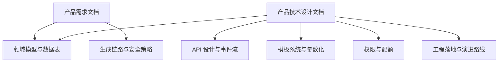
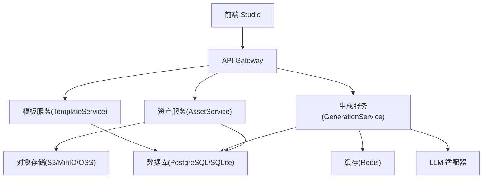
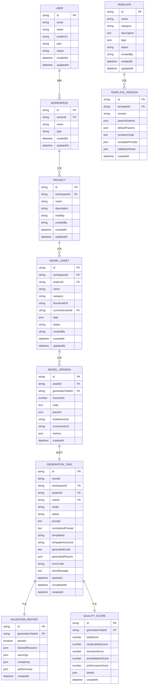
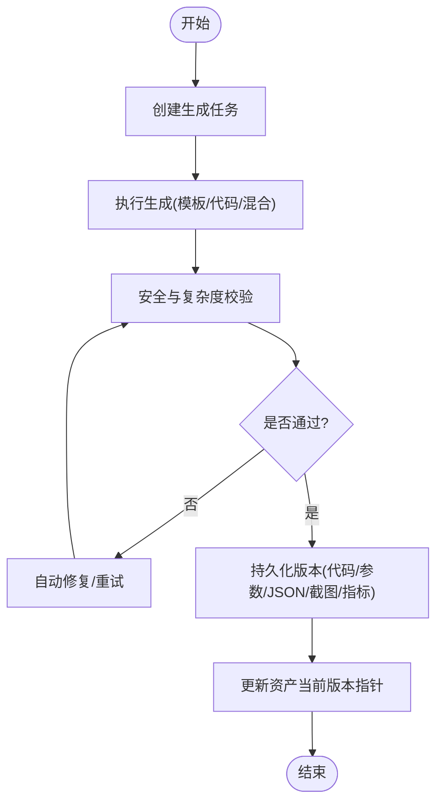
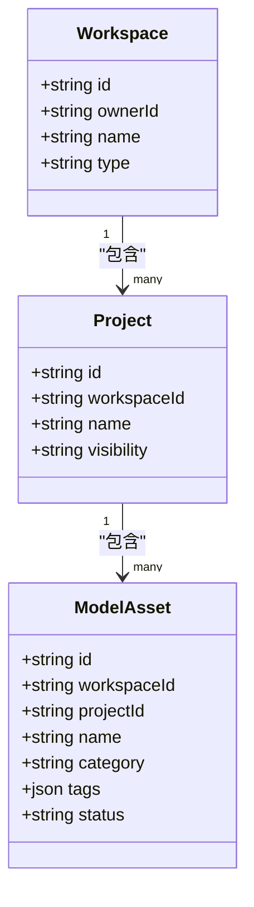
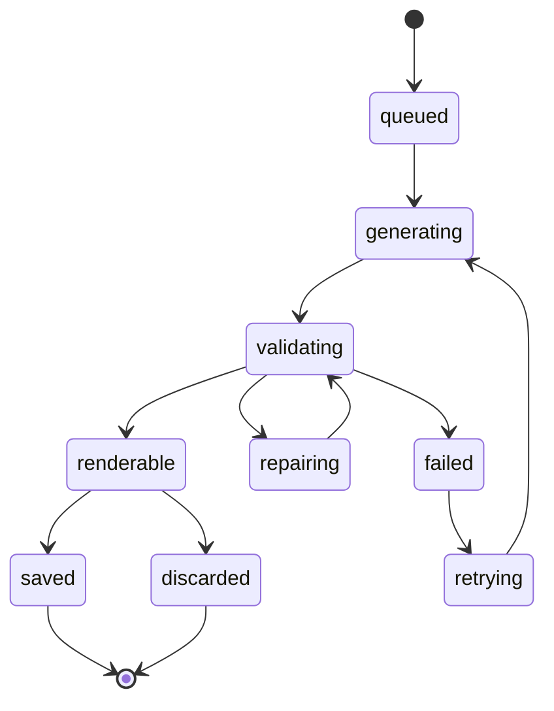
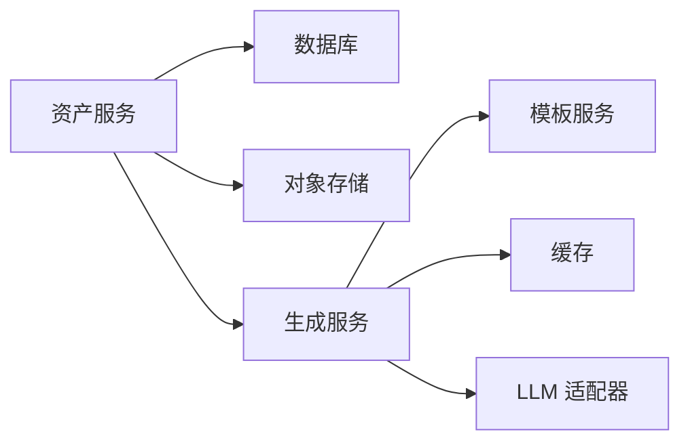

# 资产管理与版本控制

<cite>
**本文引用的文件**
- [产品需求文档](file://prd.md)
- [产品技术设计文档](file://tech/product-technical-design.md)
</cite>

## 目录
1. [引言](#引言)
2. [项目结构](#项目结构)
3. [核心组件](#核心组件)
4. [架构总览](#架构总览)
5. [详细组件分析](#详细组件分析)
6. [依赖关系分析](#依赖关系分析)
7. [性能考量](#性能考量)
8. [故障排查指南](#故障排查指南)
9. [结论](#结论)
10. [附录](#附录)

## 引言
本文件面向 ApexForge 的“资产管理与版本控制”能力，围绕模型资产的数据结构设计、版本管理机制、项目空间组织与权限控制展开。同时覆盖资产生命周期管理、元数据维护、搜索索引构建思路、批量操作接口、数据迁移策略、备份恢复方案以及协作开发支持等关键技术点。内容基于仓库中的产品与技术设计文档进行系统化梳理，既便于初学者理解，也为有经验的开发者提供足够的技术深度。

## 项目结构
当前仓库包含产品需求与设计文档，用于定义平台级能力与落地路径。其中：
- 产品需求文档明确了平台目标、核心差异化、前后端架构、安全与性能优化要点。
- 产品技术设计文档给出了领域模型、数据表结构、生成链路、模板系统、API 契约、权限与计费、可观测性、工程里程碑与目录结构建议等。

图表来源
- [产品需求文档:1-168](file://prd.md#L1-L168)
- [产品技术设计文档:1-1149](file://tech/product-technical-design.md#L1-L1149)

章节来源
- [产品需求文档:1-168](file://prd.md#L1-L168)
- [产品技术设计文档:1-1149](file://tech/product-technical-design.md#L1-L1149)

## 核心组件
围绕资产管理与版本控制，以下组件构成核心能力：
- 工作区（Workspace）：团队或个人空间，作为资源隔离与权限边界。
- 项目（Project）：在空间内组织模型资产的集合。
- 模型资产（ModelAsset）：一次或多次生成结果的聚合实体，承载名称、分类、标签、缩略图、当前版本等元数据。
- 模型版本（ModelVersion）：具体某次生成的产物快照，包括代码、参数、模型 JSON、截图、指标等。
- 生成任务（GenerationTask）：驱动一次从 Prompt 到产物的完整流程，贯穿状态机与质量评估。
- 模板与模板版本（Template/TemplateVersion）：参数化渲染器与 Schema，支撑快速稳定生成。
- 校验报告（ValidationReport）与质量评分（QualityScore）：保障输出安全与质量。
- 审计日志（AuditLog）与 API Key：记录关键操作与开放调用凭证。

章节来源
- [产品技术设计文档:132-171](file://tech/product-technical-design.md#L132-L171)
- [产品技术设计文档:174-325](file://tech/product-technical-design.md#L174-L325)

## 架构总览
资产管理与版本控制处于后端服务层，与生成服务、模板服务、数据库和对象存储交互。前端通过 API 完成资产创建、版本查询、保存为资产等操作。

图表来源
- [产品技术设计文档:34-101](file://tech/product-technical-design.md#L34-L101)
- [产品技术设计文档:574-630](file://tech/product-technical-design.md#L574-L630)

## 详细组件分析

### 数据模型与关系
- 用户与工作区：用户属于工作区，工作区拥有多个项目。
- 项目与资产：项目下包含多个模型资产。
- 资产与版本：一个资产对应多个版本，当前版本指向最新可用版本。
- 版本与任务：每个版本来源于一次生成任务，并携带代码、参数、模型 JSON、截图与指标。
- 模板与版本：模板存在多版本，版本包含参数 Schema、默认参数、渲染函数与示例 Prompt。
- 校验与质量：每次生成产生校验报告与质量评分，用于回溯与优化。

图表来源
- [产品技术设计文档:178-325](file://tech/product-technical-design.md#L178-L325)

章节来源
- [产品技术设计文档:174-325](file://tech/product-technical-design.md#L174-L325)

### 版本管理机制
- 版本号递增：每新增一次有效生成结果即创建新版本，versionNo 自增。
- 当前版本指针：model_assets.currentVersionId 指向最新版本，保证读取一致性。
- 版本快照：每个版本保留代码、参数、模型 JSON URL、截图与指标，确保可回滚与可追溯。
- 版本关联任务：通过 generationTaskId 关联生成上下文，便于复盘与质量分析。

图表来源
- [产品技术设计文档:327-391](file://tech/product-technical-design.md#L327-L391)
- [产品技术设计文档:238-269](file://tech/product-technical-design.md#L238-L269)

章节来源
- [产品技术设计文档:238-269](file://tech/product-technical-design.md#L238-L269)
- [产品技术设计文档:327-391](file://tech/product-technical-design.md#L327-L391)

### 项目空间组织与权限控制
- 空间类型：personal、team、enterprise，决定成员管理与可见性范围。
- 项目可见性：private、shared、public，控制跨空间访问策略。
- 角色与权限：Owner/Admin/Editor/Viewer/API Client，分别具备不同操作能力。
- 配额维度：每日生成次数、并发任务数、最大模型复杂度、存储空间、API 调用量等。

图表来源
- [产品技术设计文档:191-214](file://tech/product-technical-design.md#L191-L214)
- [产品技术设计文档:238-254](file://tech/product-technical-design.md#L238-L254)

章节来源
- [产品技术设计文档:191-214](file://tech/product-technical-design.md#L191-L214)
- [产品技术设计文档:844-866](file://tech/product-technical-design.md#L844-L866)

### 资产生命周期管理
- 状态流转：queued → generating → validating → renderable/saved/discarded/failed/repairing/retrying。
- 失败处理：根据错误码与质量评分触发自动修复或人工审核。
- 归档策略：历史任务按时间归档，大字段迁移至对象存储，仅保留 URL 与摘要。

图表来源
- [产品技术设计文档:340-357](file://tech/product-technical-design.md#L340-L357)

章节来源
- [产品技术设计文档:340-357](file://tech/product-technical-design.md#L340-L357)

### 元数据维护
- 资产元数据：名称、分类、标签、缩略图、当前版本、状态、创建者、时间戳。
- 版本元数据：代码、参数、模型 JSON URL、截图 URL、几何体/顶点/材质等指标。
- 任务元数据：traceId、模式、状态、Prompt、模板信息、错误码与信息、时间戳。

章节来源
- [产品技术设计文档:215-269](file://tech/product-technical-design.md#L215-L269)
- [产品技术设计文档:238-269](file://tech/product-technical-design.md#L238-L269)

### 搜索索引构建
- 检索维度：workspaceId、projectId、category、tags、status、updatedAt、name。
- 索引策略：对高频查询字段建立索引；大文本字段使用全文检索或外部搜索引擎（如 Elasticsearch）。
- 向量检索：结合模板匹配与相似 Prompt 缓存，提升命中效率。

章节来源
- [产品技术设计文档:952-958](file://tech/product-technical-design.md#L952-L958)
- [产品技术设计文档:797-804](file://tech/product-technical-design.md#L797-L804)

### 批量操作接口
- 保存为资产：POST /api/v1/assets，将成功生成的任务保存为资产，附带名称与标签。
- 查询资产版本：GET /api/v1/assets/{assetId}/versions，返回该资产全部版本详情。
- 批量导出：结合对象存储与导出服务，支持 JS、JSON、截图、glTF 等格式批量打包下载。

章节来源
- [产品技术设计文档:703-723](file://tech/product-technical-design.md#L703-L723)

### 与其他组件的关系
- 与生成服务：资产版本来源于生成任务，需等待任务进入 renderable/saved 状态。
- 与模板服务：模板模式优先，减少 LLM 调用成本，提高稳定性。
- 与对象存储：模型 JSON、截图等大文件落盘，数据库仅存 URL 与摘要。
- 与可观测性：traceId 贯穿全链路，便于定位问题与性能分析。

章节来源
- [产品技术设计文档:574-630](file://tech/product-technical-design.md#L574-L630)
- [产品技术设计文档:868-908](file://tech/product-technical-design.md#L868-L908)

## 依赖关系分析
- 直接依赖：资产服务依赖数据库与对象存储；版本创建依赖生成服务产出。
- 间接依赖：模板服务影响生成模式选择；缓存服务影响相似 Prompt 命中率。
- 潜在循环：应避免资产服务与生成服务之间的强耦合，采用事件或消息队列解耦。

图表来源
- [产品技术设计文档:574-630](file://tech/product-technical-design.md#L574-L630)

章节来源
- [产品技术设计文档:574-630](file://tech/product-technical-design.md#L574-L630)

## 性能考量
- 前端：按需加载 Three.js runtime，复杂模型解析放入 Worker，避免主线程阻塞。
- 服务端：相似 Prompt 缓存、模板模式跳过 LLM、异步任务队列、热点缓存。
- 数据库：关键字段建索引，大字段迁移对象存储，历史任务归档。

章节来源
- [产品技术设计文档:933-958](file://tech/product-technical-design.md#L933-L958)

## 故障排查指南
- 常见错误码：SANDBOX_TIMEOUT、SANDBOX_RUNTIME_ERROR、MODEL_JSON_INVALID、MODEL_TOO_COMPLEX、MODEL_EMPTY。
- 排查步骤：
  - 检查 traceId 与任务状态，确认是否卡在 validating 或 rendering。
  - 查看 ValidationReport 与 QualityScore，定位安全或质量失败原因。
  - 核对沙箱执行日志与超时配置，必要时降低模型复杂度或切换模板模式。
- 告警规则：生成失败率过高、LLM 延迟过高、校验失败突增、沙箱超时突增、API 错误率过高。

章节来源
- [产品技术设计文档:508-517](file://tech/product-technical-design.md#L508-L517)
- [产品技术设计文档:898-907](file://tech/product-technical-design.md#L898-L907)

## 结论
ApexForge 的资产管理与版本控制以“模板优先、结构化保存、可观测闭环”为核心原则，通过清晰的数据模型与状态机实现稳定的版本管理与协作能力。配合权限与配额体系、对象存储与索引策略，既能满足 MVP 快速落地，也能平滑演进至企业级平台化部署。

## 附录

### 配置选项与参数
- 生成模式：template、code、hybrid、cache，优先级推荐 cache > template > hybrid > code。
- 沙箱配置：iframe sandbox 属性、CSP 白名单、执行超时阈值。
- 校验策略：黑名单 API、AST 白名单、复杂度上限（代码长度、AST 深度、Mesh 数量、顶点估算）。
- 配额限制：每日生成次数、并发任务数、最大模型复杂度、存储空间、API 调用量。

章节来源
- [产品技术设计文档:329-338](file://tech/product-technical-design.md#L329-L338)
- [产品技术设计文档:472-517](file://tech/product-technical-design.md#L472-L517)
- [产品技术设计文档:856-866](file://tech/product-technical-design.md#L856-L866)

### 数据迁移策略
- ORM 抽象：统一 Repository 访问层，避免 SQLite 特性绑定。
- ID 规范：使用 UUID/CUID，不依赖自增特性。
- JSON 兼容：SQLite TEXT 与 PostgreSQL JSONB 兼容设计。
- 迁移脚本：Beta 阶段提供导入脚本，将历史生成记录、模板与资产迁移至 PostgreSQL。

章节来源
- [产品技术设计文档:122-129](file://tech/product-technical-design.md#L122-L129)

### 备份恢复方案
- 数据库备份：定期全量与增量备份，保留多版本快照。
- 对象存储备份：模型 JSON、截图与导出文件异地容灾。
- 恢复演练：制定 RTO/RPO 目标，定期进行恢复演练与验证。

章节来源
- [产品技术设计文档:952-958](file://tech/product-technical-design.md#L952-L958)

### 协作开发支持
- 工作区与项目：支持个人与团队协作，明确所有者与管理员职责。
- 角色与权限：Owner/Admin/Editor/Viewer 分级授权，审计日志记录关键操作。
- 开放 API：API Key 鉴权与限流，支持第三方集成与自动化流水线。

章节来源
- [产品技术设计文档:191-214](file://tech/product-technical-design.md#L191-L214)
- [产品技术设计文档:844-866](file://tech/product-technical-design.md#L844-L866)