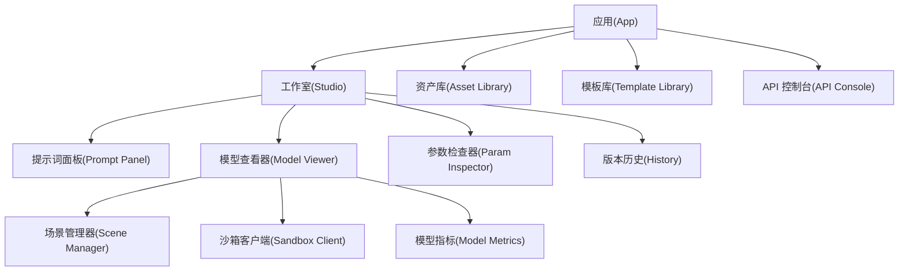
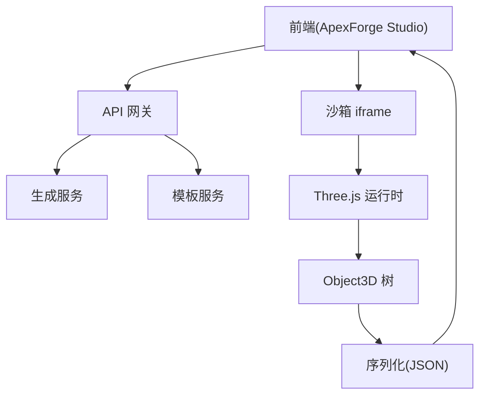
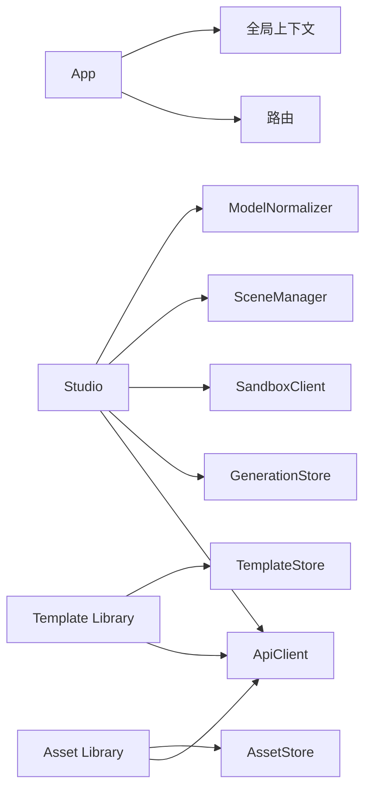
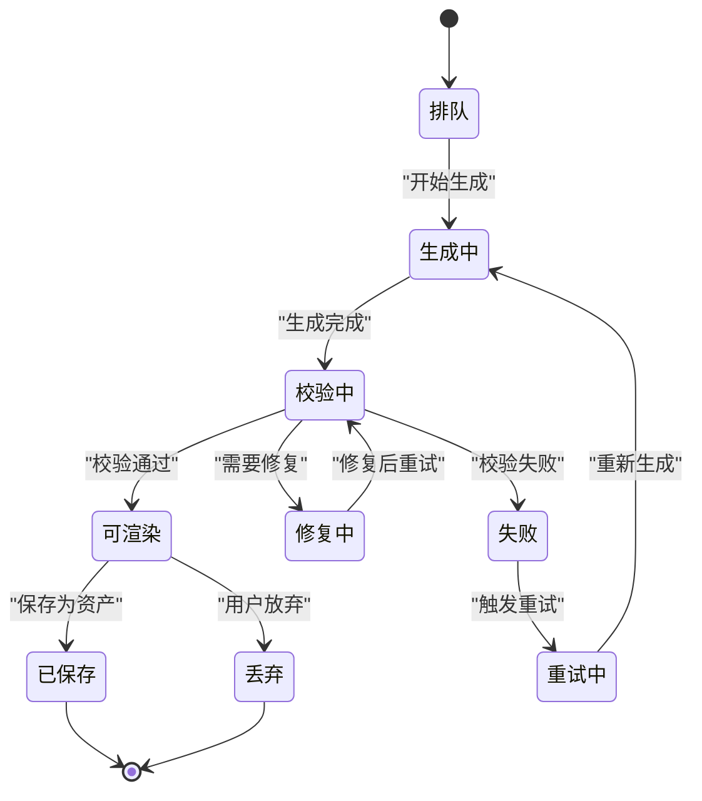

# React 应用架构

<cite>
**本文引用的文件**   
- [产品需求文档](file://prd.md)
- [产品技术设计文档](file://tech/product-technical-design.md)
</cite>

## 目录
1. [引言](#引言)
2. [项目结构](#项目结构)
3. [核心组件](#核心组件)
4. [架构总览](#架构总览)
5. [详细组件分析](#详细组件分析)
6. [依赖分析](#依赖分析)
7. [性能考虑](#性能考虑)
8. [故障排查指南](#故障排查指南)
9. [结论](#结论)
10. [附录](#附录)

## 引言
本文件面向 ApexForge 的 React 前端（ApexForge Studio）进行架构设计与实现说明，目标是在不直接展示源码的前提下，系统化阐述基于 React 18 + TypeScript 的应用结构设计、模块划分、组件层次与状态管理策略。文档覆盖 App、Studio、资产库、模板库等核心模块的职责与交互关系，并记录关键前端服务（ApiClient、GenerationStore、AssetStore、TemplateStore）的设计模式与接口契约；同时给出路由与导航组织思路、组件复用策略、Hooks 设计要点以及错误边界处理方案。文末提供可视化图示与可操作的排障建议，帮助读者快速理解并落地工程实践。

## 项目结构
从产品与技术设计可知，前端采用 SPA 形态，围绕“自然语言输入—生成任务—沙箱执行—Three.js 渲染”的主路径构建。整体模块划分为：
- 应用壳层：App（路由、全局状态、主题与权限）
- 工作室：Studio（Prompt 面板、模型查看器、参数检查器、版本历史）
- 资产库：Asset Library（项目/资产/版本浏览与管理）
- 模板库：Template Library（模板列表、详情、参数 Schema 预览与渲染）
- 辅助能力：API 控制台（可选）、监控与反馈入口



图表来源
- [产品技术设计文档:524-537](file://tech/product-technical-design.md#L524-L537)

章节来源
- [产品技术设计文档:524-537](file://tech/product-technical-design.md#L524-L537)

## 核心组件
本节聚焦前端核心服务与职责边界，明确其对外能力与协作方式。

- ApiClient
  - 职责：封装 REST/SSE/WebSocket 请求，统一鉴权、重试、超时与错误映射，暴露类型安全的调用方法。
  - 关键点：traceId 透传、事件流订阅、错误码到用户提示的映射。
- GenerationStore
  - 职责：管理生成任务生命周期与结果缓存，驱动 UI 状态更新。
  - 关键点：任务状态机（排队/生成中/校验/可渲染/失败/重试），与 SSE 事件联动。
- AssetStore
  - 职责：维护项目、资产与版本数据，支持分页、筛选与对比。
  - 关键点：本地缓存与远端同步、版本差异高亮。
- TemplateStore
  - 职责：管理模板列表、详情与参数 Schema，提供模板匹配候选集。
  - 关键点：Schema 校验、默认参数注入、示例 Prompt 展示。
- SceneManager
  - 职责：初始化 Three.js 场景、灯光、控制器与模型挂载，提供加载/清空/适配视角/截图/释放等方法。
  - 关键点：对象生命周期管理、内存泄漏防护、LOD 与实例化优化。
- SandboxClient
  - 职责：与 iframe 沙箱通信、超时控制、错误分类与回退。
  - 关键点：postMessage 协议、执行超时销毁、结果 JSON 校验。
- ModelNormalizer
  - 职责：模型居中、缩放、复杂度统计与降级提示。
  - 关键点：边界盒计算、顶点/面数估算、阈值告警。

章节来源
- [产品技术设计文档:539-571](file://tech/product-technical-design.md#L539-L571)

## 架构总览
前端在浏览器中与后端 API 网关、生成服务、模板服务交互，并通过隐藏 iframe 沙箱执行 AI 返回的 JS 代码，最终由 Three.js 渲染。



图表来源
- [产品技术设计文档:38-62](file://tech/product-technical-design.md#L38-L62)
- [产品技术设计文档:478-488](file://tech/product-technical-design.md#L478-L488)

## 详细组件分析

### 应用壳层 App
- 职责：路由配置、全局上下文（用户、空间、权限）、主题与国际化、错误边界与日志上报。
- 交互：根据当前空间/项目切换子模块（Studio/资产库/模板库）。
- 扩展点：插件式功能开关、按需加载页面与资源。

章节来源
- [产品技术设计文档:524-537](file://tech/product-technical-design.md#L524-L537)

### 工作室 Studio
- 职责：接收用户描述、发起生成任务、展示实时进度、承载模型查看器与参数面板、维护版本历史。
- 交互：
  - 通过 ApiClient 创建/查询任务、订阅 SSE 事件。
  - 将生成的代码或参数交给 SandboxClient 执行，并将结果交由 SceneManager 渲染。
  - 使用 ModelNormalizer 对模型做居中/缩放与复杂度评估。
- 关键流程（时序）：

```mermaid
sequenceDiagram
participant U as "用户"
participant FE as "前端(Studio)"
participant API as "API 网关"
participant GEN as "生成服务"
participant BOX as "沙箱 iframe"
participant SC as "场景管理器"
U->>FE : "输入描述并点击生成"
FE->>API : "POST /api/v1/generations"
API->>GEN : "创建任务"
GEN-->>API : "返回任务ID/状态"
API-->>FE : "任务已创建"
FE->>API : "GET /api/v1/generations/{taskId}/events"
API-->>FE : "SSE : generating/validating/renderable"
FE->>BOX : "postMessage execute(code, params)"
BOX-->>FE : "postMessage result(JSON)"
FE->>SC : "loadModel(object3D)"
SC-->>U : "展示模型"
```

图表来源
- [产品技术设计文档:361-390](file://tech/product-technical-design.md#L361-L390)
- [产品技术设计文档:498-506](file://tech/product-technical-design.md#L498-L506)

章节来源
- [产品技术设计文档:361-390](file://tech/product-technical-design.md#L361-L390)
- [产品技术设计文档:498-506](file://tech/product-technical-design.md#L498-L506)

### 资产库 Asset Library
- 职责：按项目维度浏览资产与版本，支持标签筛选、对比与导出。
- 交互：
  - 通过 AssetStore 拉取资产列表与版本信息。
  - 结合 ApiClient 获取缩略图、模型 JSON 与指标数据。
- 关键能力：
  - 版本时间线视图、变更摘要、一键回滚至指定版本。
  - 批量操作（归档、删除、导出）。

章节来源
- [产品技术设计文档:539-549](file://tech/product-technical-design.md#L539-L549)

### 模板库 Template Library
- 职责：展示模板清单与详情，提供参数 Schema 预览与默认值填充，支持在线渲染预览。
- 交互：
  - 通过 TemplateStore 获取模板元数据与参数 Schema。
  - 调用后端模板渲染接口或直接在前端以受控方式执行模板渲染函数（需遵循安全约束）。
- 关键能力：
  - 模板匹配候选集推荐、参数范围校验、示例 Prompt 引导。

章节来源
- [产品技术设计文档:539-549](file://tech/product-technical-design.md#L539-L549)

### 场景管理器 SceneManager
- 对外能力：
  - 初始化场景、加载/清空模型、自动适配视角、背景切换、截图、释放资源。
- 关键点：
  - 严格的生命周期管理，避免几何体/材质/纹理泄漏。
  - 与 ModelNormalizer 配合完成居中缩放与复杂度统计。

章节来源
- [产品技术设计文档:551-561](file://tech/product-technical-design.md#L551-L561)

### 沙箱客户端 SandboxClient
- 职责：与 iframe 通信、执行超时控制、错误分类与回退。
- 关键点：
  - postMessage 协议约定（executionId、code、params、timeoutMs）。
  - 执行结果仅接受结构化 JSON，禁止回传函数/DOM 引用。
  - 错误分类：超时、运行时报错、JSON 非法、复杂度过限、空模型等。

章节来源
- [产品技术设计文档:478-517](file://tech/product-technical-design.md#L478-L517)

### 模型归一化 ModelNormalizer
- 职责：模型居中、缩放、复杂度统计与降级提示。
- 关键点：
  - 边界盒计算、顶点/面数估算、阈值告警与降级策略。

章节来源
- [产品技术设计文档:547-548](file://tech/product-technical-design.md#L547-L548)

## 依赖分析
前端内部依赖关系如下：
- App 作为根容器，依赖路由与全局上下文。
- Studio 依赖 ApiClient、GenerationStore、SandboxClient、SceneManager、ModelNormalizer。
- Asset Library 依赖 ApiClient、AssetStore。
- Template Library 依赖 ApiClient、TemplateStore。
- 所有模块共享统一的错误处理与日志上报能力。



图表来源
- [产品技术设计文档:524-571](file://tech/product-technical-design.md#L524-L571)

章节来源
- [产品技术设计文档:524-571](file://tech/product-technical-design.md#L524-L571)

## 性能考虑
- 动态加载：按需加载 Three.js 与沙箱运行时，降低首屏体积。
- 异步解析：模型 JSON 解析放入 Worker，主线程专注渲染挂载。
- 渲染优化：重复几何体优先 InstancedMesh；不可见时暂停渲染循环。
- 内存管理：释放旧模型时遍历 dispose geometry/material/texture。
- 复杂度控制：加载前统计复杂度，超过阈值提示降级或切换模板模式。

章节来源
- [产品技术设计文档:563-571](file://tech/product-technical-design.md#L563-L571)

## 故障排查指南
- 常见错误分类与定位：
  - 沙箱超时：检查执行耗时、模型复杂度与超时阈值。
  - 运行时报错：核对生成代码是否命中黑名单 API、语法是否符合白名单。
  - 模型 JSON 非法：确认序列化/反序列化协议一致性与字段完整性。
  - 复杂度过限：减少几何体数量或启用 LOD/实例化。
  - 空模型：补充描述细节或选择更合适的模板。
- 排查步骤建议：
  - 查看 traceId 对应的前端日志与 SSE 事件流。
  - 检查 SandboxClient 的错误映射与重试策略。
  - 验证 SceneManager 的资源释放是否完整。
  - 使用 ModelNormalizer 输出复杂度指标，定位瓶颈。

章节来源
- [产品技术设计文档:508-517](file://tech/product-technical-design.md#L508-L517)

## 结论
本架构以 React 18 + TypeScript 为基础，围绕“Studio 工作区 + 资产/模板库”的模块化组织，结合 ApiClient、GenerationStore、AssetStore、TemplateStore 等前端服务，形成清晰的数据流与职责边界。通过 SceneManager 与 SandboxClient 的协同，确保 AI 生成代码的安全执行与高性能渲染。配合完善的错误分类、性能优化与可观测性策略，平台可在 MVP 阶段快速落地，并平滑演进为可扩展的企业级架构。

## 附录

### 路由设计与页面组织
- 顶层路由：/studio、/assets、/templates、/api-console（可选）
- Studio 子路由：/:projectId/:assetId（默认进入最新版本）
- 导航逻辑：
  - 未登录/无权限时重定向至登录或申请页。
  - 首次进入 Studio 时自动创建或选择最近项目。
  - 模板库与资产库支持跨空间跳转与上下文传递。

章节来源
- [产品技术设计文档:524-537](file://tech/product-technical-design.md#L524-L537)

### 组件复用策略与 Hooks 设计
- 组件复用：
  - 通用表单控件（颜色、滑块、下拉）封装为受控组件。
  - 列表/表格/分页/筛选组合为可配置 Table 组件。
  - 模型查看器抽象为 Viewer 容器，外部注入 SceneManager 与数据源。
- Hooks 设计：
  - useGenerationTask：封装任务创建、轮询/SSE 订阅、状态映射与错误处理。
  - useScene：封装 SceneManager 初始化、加载/清空/适配/截图/释放。
  - useSandbox：封装 postMessage 协议、超时控制与错误分类。
  - useAssets/useTemplates：封装 Store 的增删改查与缓存策略。

章节来源
- [产品技术设计文档:539-571](file://tech/product-technical-design.md#L539-L571)

### 错误边界与用户体验
- 错误边界：
  - 针对 3D 渲染区域设置独立错误边界，捕获异常并显示降级视图。
  - 全局错误边界收集未捕获异常，附带 traceId 上报。
- 用户体验：
  - 生成过程提供进度条与阶段性提示。
  - 失败时提供一键重试与替代方案（如切换到模板模式）。

章节来源
- [产品技术设计文档:508-517](file://tech/product-technical-design.md#L508-L517)

### 关键流程图（算法与策略）
- 生成链路状态机（简化版）：



图表来源
- [产品技术设计文档:342-357](file://tech/product-technical-design.md#L342-L357)