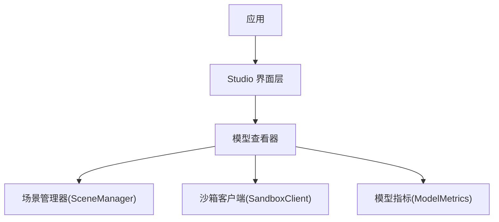
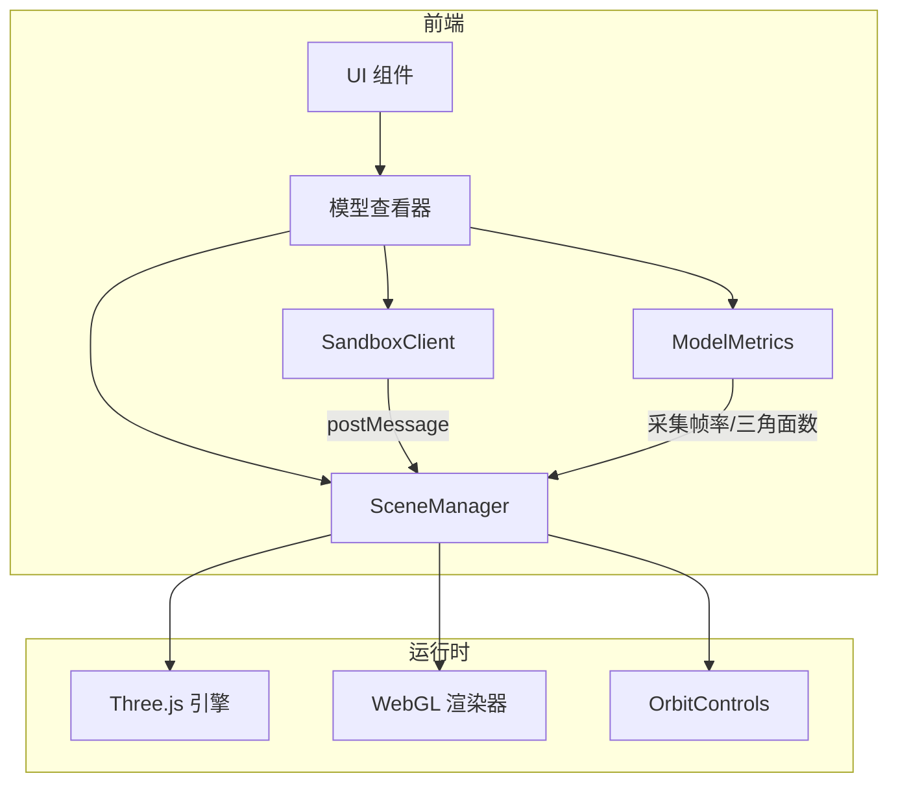
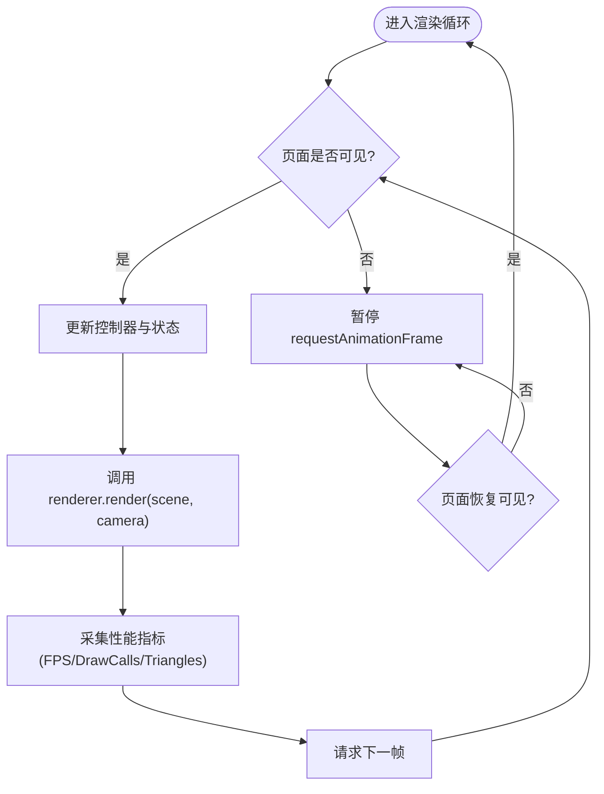
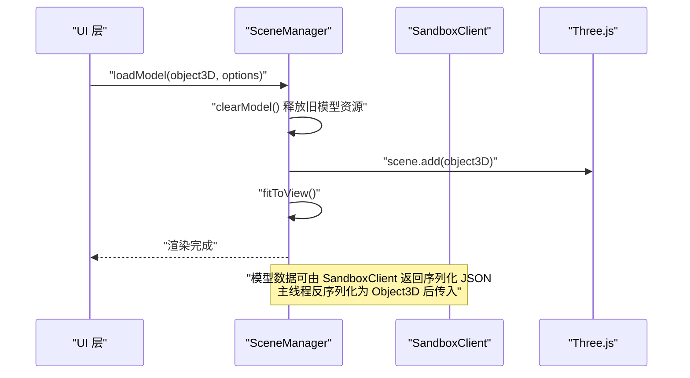
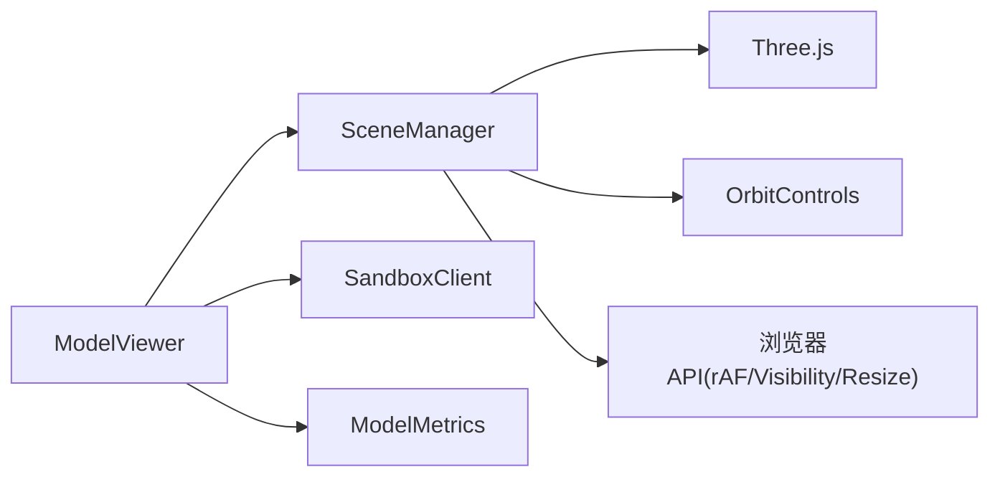

# SceneManager 场景管理

<cite>
**本文引用的文件**   
- [产品技术设计文档](file://tech/product-technical-design.md)
- [产品需求文档](file://prd.md)
</cite>

## 目录
1. [简介](#简介)
2. [项目结构](#项目结构)
3. [核心组件](#核心组件)
4. [架构总览](#架构总览)
5. [详细组件分析](#详细组件分析)
6. [依赖分析](#依赖分析)
7. [性能考虑](#性能考虑)
8. [故障排查指南](#故障排查指南)
9. [结论](#结论)
10. [附录](#附录)

## 简介
本文件聚焦于 ApexForge 前端的 SceneManager 模块，围绕单例模式、场景初始化流程、Three.js 核心对象配置、灯光系统（环境光、方向光、点光源等）、轨道控制器 OrbitControls 的配置与事件处理、渲染循环管理机制（requestAnimationFrame、页面可见性检测、性能指标收集）、相机配置、视口适配、背景切换与截图功能进行系统化说明。同时提供生命周期管理与资源释放策略、内存泄漏防护的实践建议，帮助读者在工程落地中构建稳定高效的 3D 场景管理器。

## 项目结构
从前端架构视角，SceneManager 隶属于 Model Viewer 子模块，负责 Three.js 场景的创建与维护，并与沙箱执行器、模型归一化工具协作完成模型的加载与展示。

图表来源
- [产品技术设计文档:524-537](file://tech/product-technical-design.md#L524-L537)

章节来源
- [产品技术设计文档:520-573](file://tech/product-technical-design.md#L520-L573)
- [产品需求文档:59-70](file://prd.md#L59-L70)

## 核心组件
- 单例实例：确保全局唯一场景上下文，避免重复初始化导致的资源浪费与状态不一致。
- 场景初始化：创建 Scene、WebGLRenderer、Camera、OrbitControls，并绑定 resize 与 visibility 监听。
- 灯光系统：环境光、方向光、点光源的组合，支持阴影开关与强度调节。
- 模型加载：通过 loadModel(object3D, options) 挂载到场景根节点，并触发 fitToView。
- 视图控制：fitToView 基于边界盒自动居中缩放；OrbitControls 提供旋转/平移/缩放交互。
- 背景与截图：setBackground(mode) 切换纯色或渐变背景；captureScreenshot() 输出 PNG/JPEG。
- 生命周期与释放：dispose() 遍历几何体、材质、纹理并释放 GPU 资源，防止内存泄漏。

章节来源
- [产品技术设计文档:551-561](file://tech/product-technical-design.md#L551-L561)
- [产品需求文档:67-70](file://prd.md#L67-L70)

## 架构总览
下图展示了 SceneManager 在整体前端架构中的位置及其与相关服务的交互关系。

图表来源
- [产品技术设计文档:524-537](file://tech/product-technical-design.md#L524-L537)
- [产品技术设计文档:539-549](file://tech/product-technical-design.md#L539-L549)

## 详细组件分析

### 单例模式设计与实现要点
- 设计目标：保证全局仅存在一个 SceneManager 实例，统一持有 Scene、Renderer、Camera、Controls 等资源句柄。
- 实现方式：使用静态属性或闭包保存实例引用，并提供 getInstance()/init(canvasElement) 入口。
- 注意事项：
  - 避免在 init 中重复创建 Renderer/Camera，必要时先 dispose 旧实例再重建。
  - 对外暴露方法需幂等，如多次调用 loadModel 应替换当前模型而非叠加。
  - 在页面卸载或路由切换时调用 dispose 释放资源。

章节来源
- [产品需求文档:67-70](file://prd.md#L67-L70)

### 场景初始化流程
- 输入参数：canvasElement（渲染画布）。
- 关键步骤：
  - 创建 WebGLRenderer，设置像素比、阴影贴图、抗锯齿等。
  - 创建 PerspectiveCamera，设置近远裁剪面与 FOV。
  - 创建 OrbitControls，绑定到 canvas，启用阻尼与约束。
  - 添加基础灯光（环境光、方向光、点光源），按需开启阴影。
  - 注册窗口 resize 事件以适配视口。
  - 启动渲染循环，结合页面可见性 API 暂停/恢复。
- 错误处理：捕获 WebGL 上下文丢失，尝试恢复或提示用户刷新。

章节来源
- [产品技术设计文档:551-561](file://tech/product-technical-design.md#L551-L561)
- [产品技术设计文档:563-571](file://tech/product-technical-design.md#L563-L571)

### Three.js 核心对象配置
- Renderer：
  - 设置 antialias、alpha、preserveDrawingBuffer（截图需要）。
  - 启用 shadowMap 与 shadowMapType（PCFSoftShadowMap）。
  - 设置输出编码与色调映射（sRGBEncoding、ACESFilmicToneMapping）。
- Camera：
  - PerspectiveCamera 的 near/far 根据场景尺度调整。
  - 初始位置与目标点便于后续 fitToView。
- Controls：
  - OrbitControls 的 enableDamping、min/max 距离、角度限制。
  - 事件节流与防抖，避免频繁更新导致掉帧。

章节来源
- [产品技术设计文档:551-561](file://tech/product-technical-design.md#L551-L561)

### 灯光系统设置
- 环境光：提供基础照明，降低纯黑区域。
- 方向光：模拟主光源，投射阴影，决定明暗对比。
- 点光源：局部补光，突出细节或高光。
- 可选：半球光用于天空/地面过渡色。
- 阴影优化：
  - 合理设置 light.shadow.mapSize。
  - 对复杂场景关闭不必要物体的 receiveShadow/castShadow。

章节来源
- [产品技术设计文档:551-561](file://tech/product-technical-design.md#L551-L561)

### 轨道控制器 OrbitControls 配置与事件处理
- 交互能力：旋转、平移、缩放。
- 配置项：
  - dampingFactor：平滑度。
  - minDistance/maxDistance：缩放范围。
  - enablePan/enableZoom/enableRotate：按需启停。
- 事件处理：
  - 监听 change 事件，记录用户操作轨迹（可选）。
  - 在 fitToView 后重置 controls.target 与 camera.position。

章节来源
- [产品技术设计文档:551-561](file://tech/product-technical-design.md#L551-L561)

### 渲染循环管理机制
- requestAnimationFrame：
  - 每帧更新 controls、渲染 scene。
  - 维护 FPS 统计与三角面数、绘制调用次数等指标。
- 页面可见性检测：
  - 监听 visibilitychange，不可见时暂停 rAF，可见时恢复。
- 性能监控指标：
  - FPS、draw calls、triangles、texture memory、shader compile 次数。
  - 将指标上报至 Metrics 服务或本地面板。

图表来源
- [产品技术设计文档:563-571](file://tech/product-technical-design.md#L563-L571)

章节来源
- [产品技术设计文档:563-571](file://tech/product-technical-design.md#L563-L571)

### 相机配置与视口适配
- 相机类型：PerspectiveCamera，FOV 与 aspect 随窗口尺寸变化。
- 视口适配：
  - 监听 window.resize，更新 camera.aspect 与 renderer.setSize。
  - 针对高 DPI 屏幕设置 pixelRatio。
- 自动适配视角：
  - 计算模型边界盒，设置 camera.position 与 controls.target，使模型完整显示。

章节来源
- [产品技术设计文档:551-561](file://tech/product-technical-design.md#L551-L561)

### 背景切换与截图功能
- 背景切换：
  - setBackground(mode) 支持纯色、渐变或纹理背景。
  - 注意清理旧背景资源，避免内存增长。
- 截图：
  - captureScreenshot() 调用 renderer.domElement.toDataURL 或 renderTarget 导出。
  - 若使用 renderTarget，需在完成后及时 dispose。

章节来源
- [产品技术设计文档:551-561](file://tech/product-technical-design.md#L551-L561)

### 模型加载与生命周期管理
- 加载流程：
  - loadModel(object3D, options) 将新模型添加到场景根节点。
  - 清空旧模型前，遍历其子对象并调用 dispose，释放 geometry/material/texture。
  - 加载完成后执行 fitToView，更新相机与控制器。
- 资源释放策略：
  - clearModel() 与 dispose() 配合，确保所有 GPU 资源被回收。
  - 对共享资源（材质/纹理）采用引用计数或集中管理，避免重复释放。
- 内存泄漏防护：
  - 禁止保留对已释放对象的引用。
  - 移除事件监听器与动画回调。
  - 在路由切换或页面卸载时主动 dispose。

图表来源
- [产品技术设计文档:551-561](file://tech/product-technical-design.md#L551-L561)
- [产品技术设计文档:498-506](file://tech/product-technical-design.md#L498-L506)

章节来源
- [产品技术设计文档:551-561](file://tech/product-technical-design.md#L551-L561)
- [产品技术设计文档:498-506](file://tech/product-technical-design.md#L498-L506)

### 代码示例路径（不直接展示源码）
- 场景初始化与渲染循环：参考 [产品技术设计文档:551-571](file://tech/product-technical-design.md#L551-L571)
- 模型加载与资源释放：参考 [产品技术设计文档:551-561](file://tech/product-technical-design.md#L551-L561)
- 沙箱执行与反序列化：参考 [产品技术设计文档:498-506](file://tech/product-technical-design.md#L498-L506)

## 依赖分析
- 内部依赖：
  - ModelViewer：调用 SceneManager 的公开接口。
  - SandboxClient：传递模型数据与执行结果。
  - ModelMetrics：采集渲染与模型复杂度指标。
- 外部依赖：
  - Three.js：Scene、Renderer、Camera、Object3D、Geometry/Material/Texture。
  - OrbitControls：交互控制。
  - 浏览器 API：requestAnimationFrame、visibilitychange、resize。

图表来源
- [产品技术设计文档:524-537](file://tech/product-technical-design.md#L524-L537)
- [产品技术设计文档:539-549](file://tech/product-technical-design.md#L539-L549)

章节来源
- [产品技术设计文档:520-573](file://tech/product-technical-design.md#L520-L573)

## 性能考虑
- 动态加载：按需引入 Three.js 与沙箱 runtime，减少首屏体积。
- Worker 解析：将模型 JSON 解析放入 Worker，主线程专注渲染。
- InstancedMesh：批量渲染重复元素，降低 draw calls。
- 复杂度阈值：加载前统计顶点/面数，超限提示降级。
- 资源释放：严格遍历 dispose geometry/material/texture，避免内存泄漏。
- 渲染节流：页面不可见时暂停 rAF，减少无效计算。

章节来源
- [产品技术设计文档:563-571](file://tech/product-technical-design.md#L563-L571)

## 故障排查指南
- 常见问题：
  - 模型未显示：检查 scene.add 是否成功、相机 far/near 是否合理、controls 是否锁定。
  - 卡顿或掉帧：观察 FPS/DrawCalls/Triangles，定位高开销材质或过多阴影。
  - 内存持续增长：确认 clearModel/dispose 是否覆盖所有子对象与共享资源。
  - 截图空白：确保 preserveDrawingBuffer 为 true 或使用 renderTarget 正确导出。
- 错误分类（与沙箱执行相关）：
  - SANDBOX_TIMEOUT：执行超时，终止渲染并销毁 iframe。
  - SANDBOX_RUNTIME_ERROR：运行时报错，提示重试。
  - MODEL_JSON_INVALID：返回结构非法，重新生成。
  - MODEL_TOO_COMPLEX：复杂度超限，建议降级。
  - MODEL_EMPTY：未生成有效对象，补充描述。

章节来源
- [产品技术设计文档:508-516](file://tech/product-technical-design.md#L508-L516)

## 结论
SceneManager 作为前端 3D 渲染的核心枢纽，通过单例模式统一管理场景生命周期，结合合理的灯光、控制器与渲染循环策略，保障模型加载、交互与展示的稳定性与性能。严格的资源释放与内存泄漏防护措施，以及完善的错误分类与监控体系，使其能够在复杂业务场景中持续可靠地工作。

## 附录
- 术语表：
  - 场景管理器：封装 Three.js 场景初始化、渲染、交互与资源管理的模块。
  - 沙箱客户端：负责与 iframe 通信、超时控制与错误映射的前端服务。
  - 模型指标：包含面数、顶点数、材质数量、纹理大小等质量与性能度量。
- 最佳实践清单：
  - 初始化只执行一次，避免重复创建 Renderer/Camera。
  - 每次加载新模型前先释放旧模型资源。
  - 使用 fitToView 确保模型始终完整可见。
  - 在页面卸载或路由切换时调用 dispose。
  - 对大模型优先使用 InstancedMesh 与 LOD。
  - 开启页面可见性检测，不可见时暂停渲染。