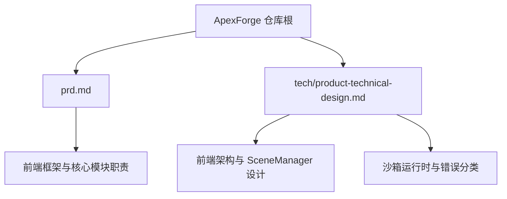
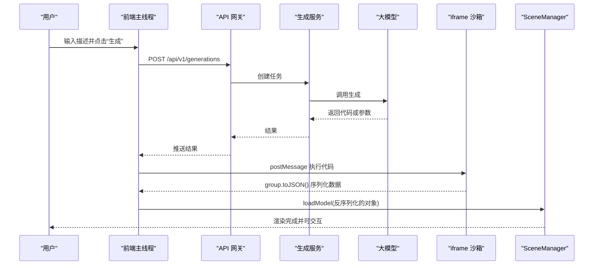
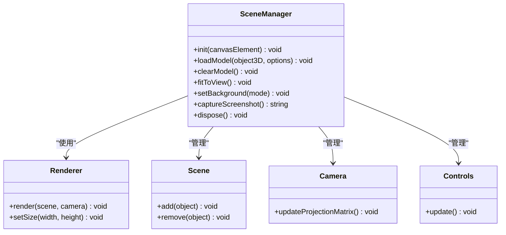
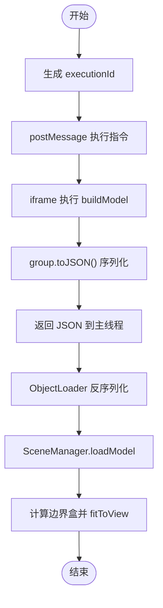
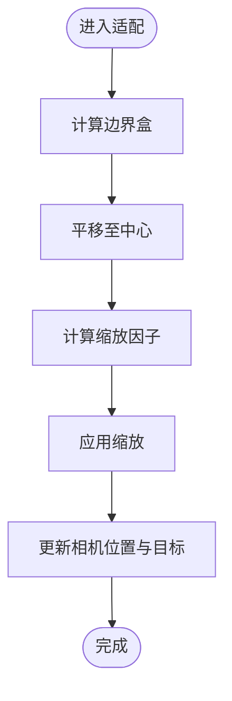
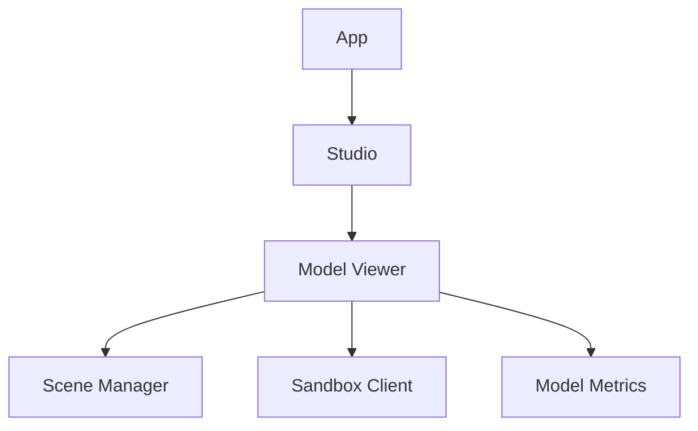

# Three.js 集成方案

<cite>
**本文引用的文件**   
- [产品需求文档](file://prd.md)
- [产品技术设计文档](file://tech/product-technical-design.md)
</cite>

## 目录
1. [引言](#引言)
2. [项目结构](#项目结构)
3. [核心组件](#核心组件)
4. [架构总览](#架构总览)
5. [详细组件分析](#详细组件分析)
6. [依赖关系分析](#依赖关系分析)
7. [性能考量](#性能考量)
8. [故障排查指南](#故障排查指南)
9. [结论](#结论)
10. [附录：最佳实践与示例路径](#附录最佳实践与示例路径)

## 引言
本文件面向 ApexForge 的 Three.js 前端集成，聚焦于 SceneManager 单例模式的设计与实现、模型加载流程（从沙箱执行到 ObjectLoader 反序列化）、模型居中/缩放适配与视角自动调整、材质与几何体管理、纹理处理优化策略，以及性能监控、内存泄漏防护和资源释放机制。文档同时提供可落地的代码片段路径指引，帮助读者快速定位并复用关键实现。

## 项目结构
仓库当前包含两份核心设计文档，用于定义平台目标、架构与前端模块职责，其中对 Three.js 集成相关的前端能力进行了明确约定：
- 产品需求文档：定义了前端框架、场景管理器、代码执行器、UI 组件库的职责与交互流程。
- 产品技术设计文档：细化了前端模块划分、SceneManager 对外能力、前端性能策略、iframe 沙箱执行流程与错误分类等。

图表来源
- [产品需求文档:59-71](file://prd.md#L59-L71)
- [产品技术设计文档:520-573](file://tech/product-technical-design.md#L520-L573)

章节来源
- [产品需求文档:59-71](file://prd.md#L59-L71)
- [产品技术设计文档:520-573](file://tech/product-technical-design.md#L520-L573)

## 核心组件
本节聚焦与 Three.js 集成直接相关的核心前端服务与能力：
- SceneManager：单例，负责场景初始化、灯光、后期处理、轨道控制、模型挂载与资源释放。
- SandboxClient：与 iframe 通信、超时控制、错误映射。
- ModelNormalizer：模型居中、缩放、复杂度统计。
- 渲染循环与性能策略：requestAnimationFrame、页面不可见时暂停、动态加载与 Worker 解析。

章节来源
- [产品需求文档:67-71](file://prd.md#L67-L71)
- [产品技术设计文档:539-571](file://tech/product-technical-design.md#L539-L571)

## 架构总览
下图展示了从用户输入到最终渲染的关键链路，包括服务端生成、前端沙箱执行与 SceneManager 加载展示。

图表来源
- [产品需求文档:126-140](file://prd.md#L126-L140)
- [产品技术设计文档:498-506](file://tech/product-technical-design.md#L498-L506)

## 详细组件分析

### SceneManager 单例设计与实现
- 单例模式：全局唯一实例，避免重复初始化场景、相机、控制器与渲染器。
- 初始化流程：绑定 canvas、设置背景、配置环境光与定向光、启用阴影、添加 OrbitControls、启动渲染循环。
- 模型加载：接收 Object3D（由 ObjectLoader 反序列化得到），计算边界盒，居中与缩放适配，更新相机视锥以 fitToView。
- 资源释放：遍历子节点，dispose geometry/material/texture，移除事件监听，停止渲染循环。

图表来源
- [产品技术设计文档:551-561](file://tech/product-technical-design.md#L551-L561)

章节来源
- [产品需求文档:67-71](file://prd.md#L67-L71)
- [产品技术设计文档:551-561](file://tech/product-technical-design.md#L551-L561)

### 模型加载流程：从沙箱执行到 ObjectLoader 反序列化
- 主线程生成 executionId，向 iframe 发送执行指令。
- iframe 在受限环境中执行 buildModel(params, THREE)，成功后调用 group.toJSON() 返回结构化 JSON。
- 主线程通过 THREE.ObjectLoader 反序列化 JSON 为 Object3D，再交由 SceneManager 加载。
- 加载后计算边界盒，进行居中与缩放适配，并自动调整相机视角。

图表来源
- [产品技术设计文档:498-506](file://tech/product-technical-design.md#L498-L506)
- [产品需求文档:105-117](file://prd.md#L105-L117)

章节来源
- [产品技术设计文档:498-506](file://tech/product-technical-design.md#L498-L506)
- [产品需求文档:105-117](file://prd.md#L105-L117)

### 模型居中、缩放适配与视角自动调整
- 居中：基于 Object3D 的边界盒中心点平移模型至原点。
- 缩放：根据边界盒最大尺寸与相机视锥匹配，统一缩放因子使模型完整可见。
- 视角：更新相机位置与目标点，确保模型位于视锥中央且距离合适。

[此图为概念流程图，不直接映射具体源码文件]

### 材质系统、几何体管理与纹理处理优化
- 材质：优先使用 MeshStandardMaterial/MeshPhysicalMaterial，减少自定义 Shader；共享材质实例以降低 GPU 状态切换。
- 几何体：合并静态网格、使用 InstancedMesh 批量渲染重复元素；限制顶点数量与面数，必要时采用 LOD。
- 纹理：压缩格式（如 KTX2/ASTC）、按需加载与缓存、及时 dispose 旧纹理；避免过大分辨率纹理。

章节来源
- [产品需求文档:155-165](file://prd.md#L155-L165)
- [产品技术设计文档:563-571](file://tech/product-technical-design.md#L563-L571)

### 性能监控指标收集、内存泄漏防护与资源释放
- 指标采集：记录帧率、Draw Calls、三角面数、纹理大小、内存占用峰值；在每次加载前后对比差异。
- 内存泄漏防护：严格 dispose geometry/material/texture；移除事件监听；销毁 iframe 并清理 Worker 上下文。
- 渲染循环：使用 requestAnimationFrame，页面不可见时暂停；按需降低渲染分辨率或关闭阴影。

章节来源
- [产品技术设计文档:563-571](file://tech/product-technical-design.md#L563-L571)

## 依赖关系分析
前端模块之间的依赖关系如下：

图表来源
- [产品技术设计文档:524-537](file://tech/product-technical-design.md#L524-L537)

章节来源
- [产品技术设计文档:524-537](file://tech/product-technical-design.md#L524-L537)

## 性能考量
- 首屏体积：动态加载 Three.js 与沙箱 runtime，按需引入模块。
- 反序列化：将模型 JSON 解析放入 Web Worker，主线程仅做挂载与渲染。
- 渲染优化：InstancedMesh 批量绘制、LOD 细节层级、合理阴影与抗锯齿开关。
- 网络与缓存：CDN 缓存静态资源，Gzip/Brotli 压缩，增量更新。

章节来源
- [产品需求文档:155-165](file://prd.md#L155-L165)
- [产品技术设计文档:563-571](file://tech/product-technical-design.md#L563-L571)

## 故障排查指南
常见错误分类与处理建议：
- 执行超时：终止渲染并提示用户简化模型或使用模板模式。
- 运行时报错：检查生成代码语法与白名单 API，支持重试。
- 模型 JSON 非法：校验返回结构，触发重新生成。
- 模型过于复杂：提示降级或选择更简洁的模板。
- 未生成有效对象：引导用户补充描述主体。

章节来源
- [产品技术设计文档:508-517](file://tech/product-technical-design.md#L508-L517)

## 结论
通过 SceneManager 单例统一管理场景生命周期，结合 iframe 沙箱安全执行与 ObjectLoader 反序列化，ApexForge 实现了从自然语言到可交互 Three.js 模型的端到端闭环。配合严格的性能与内存管理策略，可在浏览器端稳定高效地呈现 AI 生成的程序化模型。

## 附录：最佳实践与示例路径
以下给出可直接参考的代码片段路径，便于快速落地：
- SceneManager 初始化与对外能力定义
  - [产品技术设计文档:551-561](file://tech/product-technical-design.md#L551-L561)
- 前端性能策略与渲染循环控制
  - [产品技术设计文档:563-571](file://tech/product-technical-design.md#L563-L571)
- 沙箱执行流程与 ObjectLoader 反序列化
  - [产品技术设计文档:498-506](file://tech/product-technical-design.md#L498-L506)
- 错误分类与用户提示
  - [产品技术设计文档:508-517](file://tech/product-technical-design.md#L508-L517)
- 前端模块划分与服务职责
  - [产品技术设计文档:524-549](file://tech/product-technical-design.md#L524-L549)
- 整体生成链路时序
  - [产品需求文档:126-140](file://prd.md#L126-L140)
- 代码执行沙箱与安全增强
  - [产品需求文档:105-117](file://prd.md#L105-L117)