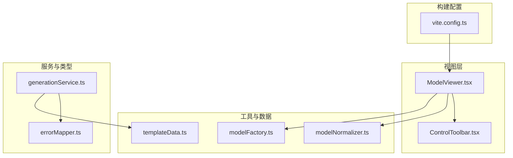
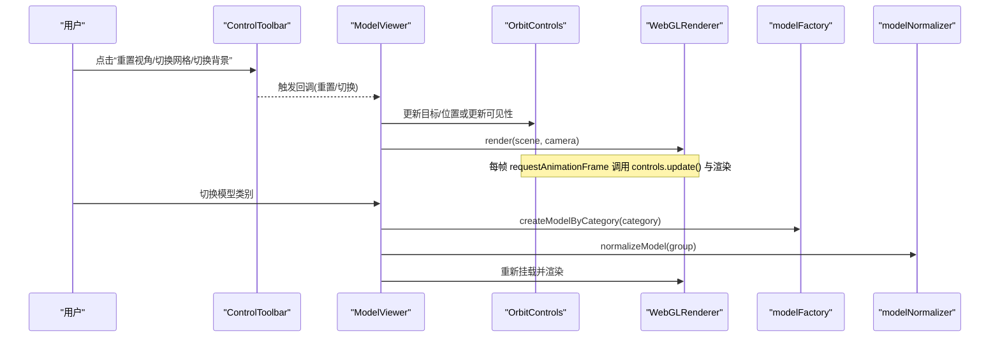
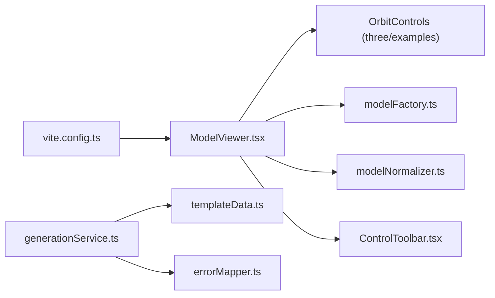

# 交互控制实现

<cite>
**本文引用的文件**   
- [ModelViewer.tsx](file://src/modules/viewer/components/ModelViewer.tsx)
- [ControlToolbar.tsx](file://src/modules/viewer/components/ControlToolbar.tsx)
- [modelFactory.ts](file://src/modules/viewer/utils/modelFactory.ts)
- [modelNormalizer.ts](file://src/modules/viewer/utils/modelNormalizer.ts)
- [generationService.ts](file://src/modules/studio/services/generationService.ts)
- [templateData.ts](file://src/modules/templates/templateData.ts)
- [errorMapper.ts](file://src/modules/sandbox/errorMapper.ts)
- [vite.config.ts](file://vite.config.ts)
- [product-technical-design.md](file://tech/product-technical-design.md)
- [prd.md](file://prd.md)
</cite>

## 目录
1. [引言](#引言)
2. [项目结构](#项目结构)
3. [核心组件](#核心组件)
4. [架构总览](#架构总览)
5. [详细组件分析](#详细组件分析)
6. [依赖分析](#依赖分析)
7. [性能考虑](#性能考虑)
8. [故障排查指南](#故障排查指南)
9. [结论](#结论)
10. [附录](#附录)

## 引言
本技术文档聚焦于 ApexForge 的 Three.js 交互控制实现，围绕 OrbitControls 的配置与扩展、射线拾取与高亮、拖拽与多对象选择、UI 控制面板联动、以及动画系统（过渡与缓动）进行系统化说明。同时结合产品与技术设计文档，给出可落地的自定义控制器开发范式、交互事件处理策略与用户体验优化建议。

## 项目结构
本项目采用 React + Vite 前端工程化方案，Three.js 渲染位于 viewer 模块中，模型工厂与归一化工具位于 utils，模板数据与服务层位于 studio 与 templates 模块，沙箱错误映射位于 sandbox 模块。

图表来源
- [ModelViewer.tsx:1-171](file://src/modules/viewer/components/ModelViewer.tsx#L1-L171)
- [ControlToolbar.tsx:1-26](file://src/modules/viewer/components/ControlToolbar.tsx#L1-L26)
- [modelFactory.ts:1-191](file://src/modules/viewer/utils/modelFactory.ts#L1-L191)
- [modelNormalizer.ts:1-14](file://src/modules/viewer/utils/modelNormalizer.ts#L1-L14)
- [generationService.ts:1-29](file://src/modules/studio/services/generationService.ts#L1-L29)
- [templateData.ts:1-54](file://src/modules/templates/templateData.ts#L1-L54)
- [errorMapper.ts:1-11](file://src/modules/sandbox/errorMapper.ts#L1-L11)
- [vite.config.ts:1-16](file://vite.config.ts#L1-L16)

章节来源
- [vite.config.ts:1-16](file://vite.config.ts#L1-L16)

## 核心组件
- ModelViewer：负责 Three.js 场景初始化、相机与渲染器设置、OrbitControls 启用阻尼、网格与地面、阴影贴图、窗口自适应与生命周期清理；提供重置视角、切换网格与背景等能力。
- ControlToolbar：提供“重置视角”“切换网格”“切换背景”三个按钮，通过回调驱动 ModelViewer 状态变化。
- modelFactory：按类别生成程序化模型（车、建筑、飞行器、家具、道具），并计算模型指标（面数、顶点、材质数量、质量分）。
- modelNormalizer：对模型执行包围盒居中与统一缩放，保证不同模型在视口中的视觉一致性。
- generationService：本地模拟生成流程，返回包含 traceId、指标与解释文本的结果，便于 UI 展示与后续联动。
- templateData：模板元数据（名称、分类、标签、默认提示词、复杂度），用于匹配与展示。
- errorMapper：将沙箱错误码映射为用户可读的错误信息。

章节来源
- [ModelViewer.tsx:1-171](file://src/modules/viewer/components/ModelViewer.tsx#L1-L171)
- [ControlToolbar.tsx:1-26](file://src/modules/viewer/components/ControlToolbar.tsx#L1-L26)
- [modelFactory.ts:1-191](file://src/modules/viewer/utils/modelFactory.ts#L1-L191)
- [modelNormalizer.ts:1-14](file://src/modules/viewer/utils/modelNormalizer.ts#L1-L14)
- [generationService.ts:1-29](file://src/modules/studio/services/generationService.ts#L1-L29)
- [templateData.ts:1-54](file://src/modules/templates/templateData.ts#L1-L54)
- [errorMapper.ts:1-11](file://src/modules/sandbox/errorMapper.ts#L1-L11)

## 架构总览
下图展示了从用户操作到渲染更新的完整链路，包括 OrbitControls 的交互更新、UI 控件与场景状态的绑定、以及模型加载与归一化的流程。

图表来源
- [ModelViewer.tsx:36-118](file://src/modules/viewer/components/ModelViewer.tsx#L36-L118)
- [ModelViewer.tsx:120-147](file://src/modules/viewer/components/ModelViewer.tsx#L120-L147)
- [ControlToolbar.tsx:12-26](file://src/modules/viewer/components/ControlToolbar.tsx#L12-L26)
- [modelFactory.ts:26-41](file://src/modules/viewer/utils/modelFactory.ts#L26-L41)
- [modelNormalizer.ts:3-13](file://src/modules/viewer/utils/modelNormalizer.ts#L3-L13)

## 详细组件分析

### OrbitControls 配置与手势识别
- 基础配置
  - 启用阻尼与阻尼系数，提升旋转/平移/缩放的顺滑度。
  - 每帧调用 update() 以应用阻尼效果。
- 手势识别
  - 鼠标左键拖拽：旋转
  - 滚轮：缩放
  - 右键拖拽：平移
  - 触摸设备：单指旋转、双指缩放、三指平移（由 OrbitControls 内部处理）
- 键盘快捷键支持
  - 当前未内置键盘监听，可在 ModelViewer 中增加 useEffect 监听 keydown，根据按键修改 controls.target/camera.position 或调用 resetCamera。
- 示例路径
  - 轨道控制初始化与阻尼：[ModelViewer.tsx:55-57](file://src/modules/viewer/components/ModelViewer.tsx#L55-L57)
  - 每帧更新与渲染循环：[ModelViewer.tsx:97-101](file://src/modules/viewer/components/ModelViewer.tsx#L97-L101)
  - 重置视角：[ModelViewer.tsx:149-153](file://src/modules/viewer/components/ModelViewer.tsx#L149-L153)

章节来源
- [ModelViewer.tsx:55-57](file://src/modules/viewer/components/ModelViewer.tsx#L55-L57)
- [ModelViewer.tsx:97-101](file://src/modules/viewer/components/ModelViewer.tsx#L97-L101)
- [ModelViewer.tsx:149-153](file://src/modules/viewer/components/ModelViewer.tsx#L149-L153)

### 射线检测与交互（拾取、悬停高亮、拖拽、多选）
- 现状
  - 当前代码未实现 Raycaster 拾取与高亮逻辑。
- 推荐实现要点
  - 拾取：在 mousedown/mouseup 事件中创建 Raycaster，遍历模型 Mesh 集合，记录 intersectedObjects。
  - 悬停高亮：在 mousemove 中更新 hoverObject，使用 Emissive 或临时 Material 属性实现高亮，离开时恢复。
  - 拖拽：在 pointerdown 后记录选中对象，pointermove 中根据屏幕位移转换为世界空间位移，更新对象位置。
  - 多选：按住 Shift/Ctrl 追加选中对象，维护 selectedSet；拖拽时批量移动选中集合。
  - 性能：对大型场景使用分组与层级剔除，必要时引入 InstancedMesh 或简化命中测试。
- 参考路径
  - 模型遍历与几何体访问：[modelFactory.ts:48-55](file://src/modules/viewer/utils/modelFactory.ts#L48-L55)
  - 场景与模型挂载点：[ModelViewer.tsx:120-135](file://src/modules/viewer/components/ModelViewer.tsx#L120-L135)

章节来源
- [modelFactory.ts:48-55](file://src/modules/viewer/utils/modelFactory.ts#L48-L55)
- [ModelViewer.tsx:120-135](file://src/modules/viewer/components/ModelViewer.tsx#L120-L135)

### 用户界面集成（控制面板、实时参数调整、属性编辑器联动）
- 控制面板
  - ControlToolbar 提供“重置视角”“切换网格”“切换背景”三个按钮，通过 props 回调驱动 ModelViewer 内部状态。
- 实时参数调整
  - 可通过新增面板（颜色、材质 roughness/metalness、灯光强度）直接修改 scene 中的 material/light 属性，无需重建模型。
- 属性编辑器联动
  - 当实现射线拾取后，可将选中对象的属性（位置、旋转、缩放、材质）暴露给侧边属性编辑器，双向绑定实时更新。
- 参考路径
  - 工具栏组件与回调：[ControlToolbar.tsx:12-26](file://src/modules/viewer/components/ControlToolbar.tsx#L12-L26)
  - 背景与网格切换：[ModelViewer.tsx:137-147](file://src/modules/viewer/components/ModelViewer.tsx#L137-L147)

章节来源
- [ControlToolbar.tsx:12-26](file://src/modules/viewer/components/ControlToolbar.tsx#L12-L26)
- [ModelViewer.tsx:137-147](file://src/modules/viewer/components/ModelViewer.tsx#L137-L147)

### 动画系统集成（过渡动画、缓动函数、动画状态机）
- 现状
  - 当前无显式动画系统，仅依赖 OrbitControls 的阻尼产生平滑感。
- 建议方案
  - 过渡动画：为相机位置/目标、模型变换添加基于时间的插值（如线性或 easeInOutQuad），在 requestAnimationFrame 中逐步推进。
  - 缓动函数：封装常用缓动（easeIn/easeOut/easeInOut），供相机过渡与 UI 反馈使用。
  - 动画状态机：定义 idle/transitioning/highlight/dragging 等状态，避免状态冲突与重复动画。
- 参考路径
  - 渲染循环与 controls.update：[ModelViewer.tsx:97-101](file://src/modules/viewer/components/ModelViewer.tsx#L97-L101)
  - 重置相机（可作为过渡起点）：[ModelViewer.tsx:149-153](file://src/modules/viewer/components/ModelViewer.tsx#L149-L153)

章节来源
- [ModelViewer.tsx:97-101](file://src/modules/viewer/components/ModelViewer.tsx#L97-L101)
- [ModelViewer.tsx:149-153](file://src/modules/viewer/components/ModelViewer.tsx#L149-L153)

### 自定义控制器开发（示例路径与步骤）
- 步骤
  - 在 ModelViewer 中注册 pointer 事件（pointerdown/pointermove/pointerup）。
  - 使用 Raycaster 获取命中对象，维护选中集合。
  - 在 pointermove 中计算 delta，将屏幕位移转为世界位移，更新选中对象位置。
  - 在 pointerup 中结束拖拽，释放临时高亮。
- 参考路径
  - 模型遍历与 Mesh 判定：[modelFactory.ts:48-55](file://src/modules/viewer/utils/modelFactory.ts#L48-L55)
  - 场景与模型挂载：[ModelViewer.tsx:120-135](file://src/modules/viewer/components/ModelViewer.tsx#L120-L135)

章节来源
- [modelFactory.ts:48-55](file://src/modules/viewer/utils/modelFactory.ts#L48-L55)
- [ModelViewer.tsx:120-135](file://src/modules/viewer/components/ModelViewer.tsx#L120-L135)

### 交互事件处理与用户体验优化
- 事件节流与防抖：对高频事件（mousemove/pointermove）做节流，降低主线程压力。
- 视觉反馈：悬停高亮、选中边框/发光、拖拽时的半透明预览。
- 无障碍：为工具栏按钮提供 aria-label，确保键盘可达性与读屏友好。
- 参考路径
  - 工具栏按钮与 aria-label：[ControlToolbar.tsx:15-23](file://src/modules/viewer/components/ControlToolbar.tsx#L15-L23)

章节来源
- [ControlToolbar.tsx:15-23](file://src/modules/viewer/components/ControlToolbar.tsx#L15-L23)

### 模型归一化与加载流程
- 归一化算法
  - 计算包围盒尺寸与中心，按最大轴缩放至固定尺寸，并将模型中心移至原点。
- 加载流程
  - 根据 category 生成模型 → 归一化 → 加入场景 → 渲染。
- 参考路径
  - 归一化实现：[modelNormalizer.ts:3-13](file://src/modules/viewer/utils/modelNormalizer.ts#L3-L13)
  - 模型创建与挂载：[modelFactory.ts:26-41](file://src/modules/viewer/utils/modelFactory.ts#L26-L41), [ModelViewer.tsx:131-135](file://src/modules/viewer/components/ModelViewer.tsx#L131-L135)

章节来源
- [modelNormalizer.ts:3-13](file://src/modules/viewer/utils/modelNormalizer.ts#L3-L13)
- [modelFactory.ts:26-41](file://src/modules/viewer/utils/modelFactory.ts#L26-L41)
- [ModelViewer.tsx:131-135](file://src/modules/viewer/components/ModelViewer.tsx#L131-L135)

### 生成服务与模板联动
- 本地生成模拟
  - 根据 category 选择模板，延迟模拟后端耗时，返回 traceId、指标与解释文本。
- 模板数据
  - 提供模板 id、名称、分类、标签、默认提示词与复杂度，便于 UI 展示与筛选。
- 参考路径
  - 生成服务：[generationService.ts:8-29](file://src/modules/studio/services/generationService.ts#L8-L29)
  - 模板数据：[templateData.ts:1-54](file://src/modules/templates/templateData.ts#L1-L54)

章节来源
- [generationService.ts:8-29](file://src/modules/studio/services/generationService.ts#L8-L29)
- [templateData.ts:1-54](file://src/modules/templates/templateData.ts#L1-L54)

### 沙箱错误映射
- 错误码映射
  - 将 SANDBOX_TIMEOUT、SANDBOX_RUNTIME_ERROR、MODEL_JSON_INVALID 等错误码映射为用户可读消息。
- 参考路径
  - 错误映射：[errorMapper.ts:1-11](file://src/modules/sandbox/errorMapper.ts#L1-L11)

章节来源
- [errorMapper.ts:1-11](file://src/modules/sandbox/errorMapper.ts#L1-L11)

## 依赖分析
- 模块耦合
  - ModelViewer 依赖 OrbitControls、modelFactory、modelNormalizer 与 ControlToolbar。
  - generationService 依赖 templateData 与错误映射。
- 外部依赖
  - Three.js 及其示例控件 OrbitControls。
  - React 与 Vite 构建配置。
- 潜在循环依赖
  - 当前未见循环引用，viewer 与 studio/templates 职责清晰。

图表来源
- [ModelViewer.tsx:1-171](file://src/modules/viewer/components/ModelViewer.tsx#L1-L171)
- [modelFactory.ts:1-191](file://src/modules/viewer/utils/modelFactory.ts#L1-L191)
- [modelNormalizer.ts:1-14](file://src/modules/viewer/utils/modelNormalizer.ts#L1-L14)
- [ControlToolbar.tsx:1-26](file://src/modules/viewer/components/ControlToolbar.tsx#L1-L26)
- [generationService.ts:1-29](file://src/modules/studio/services/generationService.ts#L1-L29)
- [templateData.ts:1-54](file://src/modules/templates/templateData.ts#L1-L54)
- [errorMapper.ts:1-11](file://src/modules/sandbox/errorMapper.ts#L1-L11)
- [vite.config.ts:1-16](file://vite.config.ts#L1-L16)

章节来源
- [vite.config.ts:1-16](file://vite.config.ts#L1-L16)

## 性能考虑
- 渲染循环
  - 使用 requestAnimationFrame 驱动渲染，页面不可见时可暂停以减少开销。
- 资源管理
  - 卸载时 dispose 控制器、几何体与材质，避免内存泄漏。
- 像素比限制
  - setPixelRatio 上限为 2，平衡清晰度与性能。
- 阴影与光照
  - 开启 PCFSoftShadowMap，合理设置光源数量与范围。
- 参考路径
  - 渲染循环与清理：[ModelViewer.tsx:97-117](file://src/modules/viewer/components/ModelViewer.tsx#L97-L117)
  - 像素比与阴影：[ModelViewer.tsx:48-53](file://src/modules/viewer/components/ModelViewer.tsx#L48-L53)

章节来源
- [ModelViewer.tsx:48-53](file://src/modules/viewer/components/ModelViewer.tsx#L48-L53)
- [ModelViewer.tsx:97-117](file://src/modules/viewer/components/ModelViewer.tsx#L97-L117)

## 故障排查指南
- 常见问题
  - 模型过大导致卡顿：检查模型面数与顶点数，使用归一化与 LOD。
  - 内存泄漏：确认卸载时 dispose 所有几何体与材质。
  - 沙箱执行失败：查看错误映射，定位超时或运行时错误。
- 排查步骤
  - 打开浏览器开发者工具，观察 WebGL 渲染统计与内存占用。
  - 在 ModelViewer 的生命周期钩子中打印关键状态，确认渲染循环是否正常。
  - 使用 generationService 返回的 traceId 追踪一次生成请求的全链路。
- 参考路径
  - 错误映射：[errorMapper.ts:1-11](file://src/modules/sandbox/errorMapper.ts#L1-L11)
  - 生成结果与 traceId：[generationService.ts:8-29](file://src/modules/studio/services/generationService.ts#L8-L29)

章节来源
- [errorMapper.ts:1-11](file://src/modules/sandbox/errorMapper.ts#L1-L11)
- [generationService.ts:8-29](file://src/modules/studio/services/generationService.ts#L8-L29)

## 结论
当前实现已具备稳定的 Three.js 场景与 OrbitControls 交互基础，配合模型工厂与归一化工具，实现了多类别模型的快速加载与一致化展示。下一步建议优先落地射线拾取与高亮、拖拽与多选、以及相机过渡动画，从而完善交互体验与可扩展性。同时结合模板与生成服务，形成从自然语言到可交互模型的闭环。

## 附录
- 产品与技术设计参考
  - 前端架构与 SceneManager 职责：[product-technical-design.md](file://tech/product-technical-design.md)
  - 沙箱运行时与错误分类：[product-technical-design.md](file://tech/product-technical-design.md)
  - 平台化部署与前后端分工：[prd.md](file://prd.md)

章节来源
- [product-technical-design.md](file://tech/product-technical-design.md)
- [prd.md](file://prd.md)