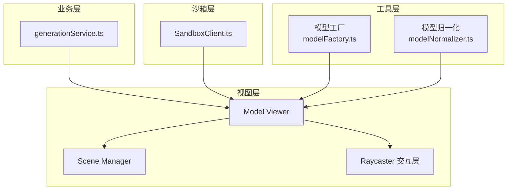
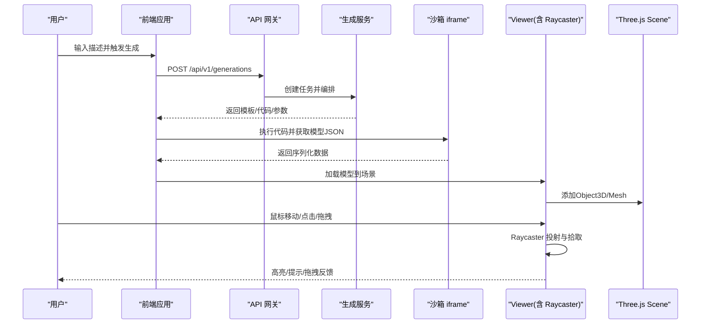
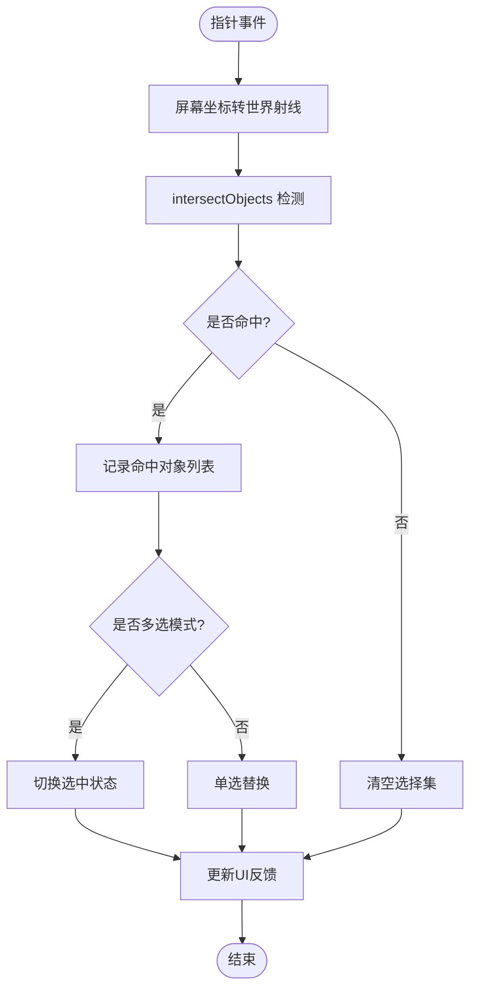
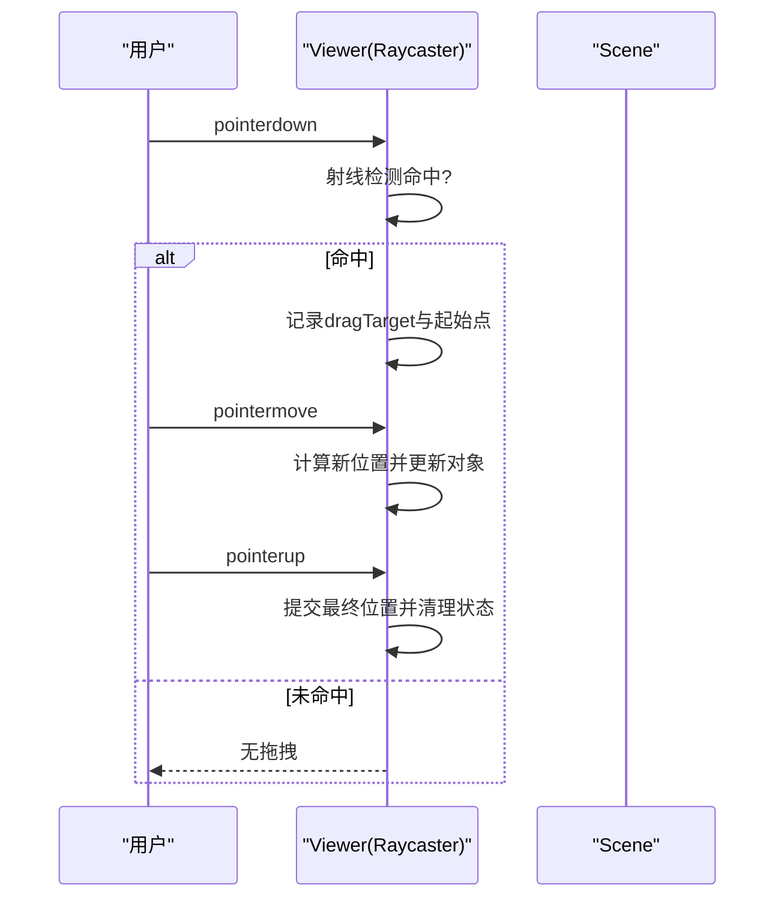
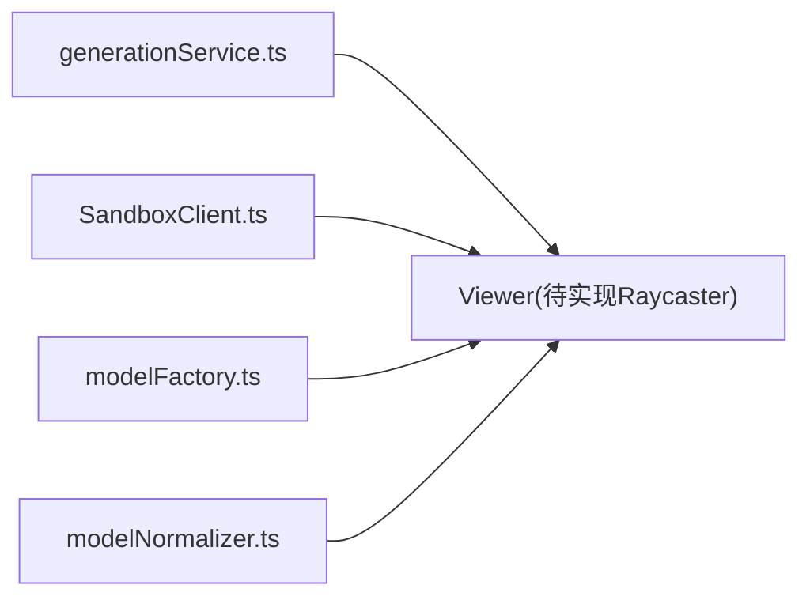

# 射线检测交互

<cite>
**本文引用的文件**   
- [产品技术设计文档](file://tech/product-technical-design.md)
- [产品需求文档](file://prd.md)
- [模型工厂](file://src/modules/viewer/utils/modelFactory.ts)
- [模型归一化](file://src/modules/viewer/utils/modelNormalizer.ts)
- [沙箱客户端](file://src/modules/sandbox/SandboxClient.ts)
- [生成服务（本地）](file://src/modules/studio/services/generationService.ts)
</cite>

## 目录
1. [引言](#引言)
2. [项目结构](#项目结构)
3. [核心组件](#核心组件)
4. [架构总览](#架构总览)
5. [详细组件分析](#详细组件分析)
6. [依赖关系分析](#依赖关系分析)
7. [性能考量](#性能考量)
8. [故障排查指南](#故障排查指南)
9. [结论](#结论)
10. [附录](#附录)

## 引言
本技术文档聚焦于 ApexForge 在 Three.js 场景中的“射线检测交互”能力，包括：
- THREE.Raycaster 的射线投射、交点计算、对象拾取与层级过滤
- 点击与悬停事件处理（含事件冒泡控制、多对象选择、选中状态管理）
- 拖拽操作实现（起始检测、实时位置更新、结束确认）
- 性能优化策略（频率控制、空间分割、批量检测）
- 复杂交互场景示例与用户反馈机制

说明：当前仓库未包含具体的 Raycaster 交互实现代码。本文基于现有模块的职责边界与渲染管线，给出可落地的设计与集成方案，并标注与现有文件的对应关系，便于后续在 Viewer/Studio 层接入。

## 项目结构
ApexForge 前端采用模块化组织，与射线检测相关的关键位置如下：
- 视图层（Viewer）：负责场景初始化、模型加载与渲染循环，是 Raycaster 的最佳挂载点
- 工具层（viewer/utils）：提供模型创建与归一化工具，影响可拾取对象的几何结构与变换
- 沙箱层（sandbox）：隔离执行 AI 生成的 Three.js 代码，返回序列化数据后由主线程加载到场景
- 业务层（studio/services）：模拟本地生成流程，产出模板化结果供 Viewer 展示

图表来源
- [模型工厂:1-192](file://src/modules/viewer/utils/modelFactory.ts#L1-L192)
- [模型归一化:1-15](file://src/modules/viewer/utils/modelNormalizer.ts#L1-L15)
- [沙箱客户端:1-19](file://src/modules/sandbox/SandboxClient.ts#L1-L19)
- [生成服务（本地）:1-30](file://src/modules/studio/services/generationService.ts#L1-L30)

章节来源
- [产品技术设计文档:520-571](file://tech/product-technical-design.md#L520-L571)
- [产品需求文档:59-70](file://prd.md#L59-L70)

## 核心组件
- 场景管理器（SceneManager）
  - 职责：初始化场景、灯光、控制器、模型挂载；对外暴露 loadModel/clearModel/fitToView 等能力
  - 与射线检测的关系：作为 Raycaster 的宿主环境，持有 scene、camera、renderer 以及可拾取对象集合
- 模型工厂（modelFactory.ts）
  - 职责：按类别创建程序化模型（车、建筑、飞行器、家具、道具），统一材质与阴影设置
  - 对交互的影响：决定 Mesh 数量、顶点规模、父子层级结构，直接影响拾取精度与性能
- 模型归一化（modelNormalizer.ts）
  - 职责：将模型居中、缩放至标准尺寸，保证交互一致性与 UI 适配
- 沙箱客户端（SandboxClient.ts）
  - 职责：在 iframe 中执行 AI 生成的 Three.js 代码，返回序列化 JSON，主线程反序列化为 Object3D 并加入场景
- 生成服务（generationService.ts）
  - 职责：本地模拟模板匹配与生成结果，为 Viewer 提供可展示的模型数据

章节来源
- [产品技术设计文档:551-571](file://tech/product-technical-design.md#L551-L571)
- [模型工厂:1-192](file://src/modules/viewer/utils/modelFactory.ts#L1-L192)
- [模型归一化:1-15](file://src/modules/viewer/utils/modelNormalizer.ts#L1-L15)
- [沙箱客户端:1-19](file://src/modules/sandbox/SandboxClient.ts#L1-L19)
- [生成服务（本地）:1-30](file://src/modules/studio/services/generationService.ts#L1-L30)

## 架构总览
下图展示了从用户输入到 3D 模型渲染与交互的整体链路，其中“Raycaster 交互层”位于 Viewer 内部，负责鼠标/触摸事件的射线检测与状态管理。

图表来源
- [产品技术设计文档:361-390](file://tech/product-technical-design.md#L361-L390)
- [产品需求文档:126-140](file://prd.md#L126-L140)

## 详细组件分析

### 射线检测基础（Raycaster 使用）
- 射线投射
  - 将屏幕坐标转换为世界坐标射线，调用 raycaster.intersectObjects(scene.children, recursive) 进行相交测试
  - 建议开启递归检测以支持嵌套 Group 下的 Mesh
- 交点计算
  - 从 intersect 结果中读取 point、faceIndex、object 等信息，用于定位与反馈
- 对象拾取
  - 通过 object.uuid 或自定义属性标识目标对象，避免仅依赖 DOM 层级
- 层级过滤
  - 使用可选参数只检测特定数组内的对象，或在遍历前根据标签/类型过滤，减少不必要的检测开销

注意：当前仓库未包含具体 Raycaster 实现代码，上述为推荐实践与集成要点。

### 点击与悬停事件处理
- 事件冒泡控制
  - 在 Canvas 容器上监听 pointermove/pointerdown/pointerup，避免事件穿透到下层 UI
  - 对于叠加 UI 控件，使用 stopPropagation 防止误触
- 多对象选择
  - 维护一个 Set 存储已选对象 uuid，支持 Shift/Ctrl 多选
  - 点击空白区域时清空选择集
- 选中状态管理
  - 为每个 Mesh 维护 selected/highlighted 标记，切换时恢复原材质或应用临时材质
  - 使用 onBeforeRender 或每帧更新时统一刷新高亮，避免频繁重建材质

[此图为概念流程图，不直接映射具体源码文件]

### 拖拽操作实现
- 拖拽起始检测
  - 在 pointerdown 时进行射线检测，若命中目标则记录 dragTarget 与初始世界坐标
  - 锁定拖拽平面（如地面平面或沿相机方向平面），避免 Z 轴漂移
- 实时位置更新
  - 在 pointermove 中重新投射射线，计算与拖拽平面的交点，更新目标对象位置
  - 保持对象相对父级变换的一致性，必要时使用局部坐标转换
- 拖拽结束确认
  - 在 pointerup 时提交最终位置，清除拖拽状态
  - 若发生碰撞或越界，回滚到上次有效位置

[此图为概念流程图，不直接映射具体源码文件]

### 与现有模块的集成点
- 模型加载与归一化
  - 从沙箱返回的 JSON 经 ObjectLoader 反序列化后，调用 normalizeModel 进行居中与缩放，确保交互体验一致
- 模型复杂度与指标
  - 使用 calculateMetrics 统计 meshes、vertices、materials 与评分，结合阈值限制与降级策略
- 生成流程
  - generationService 提供本地模板化结果，Viewer 据此加载默认模型，随后启用 Raycaster 交互

章节来源
- [模型工厂:43-59](file://src/modules/viewer/utils/modelFactory.ts#L43-L59)
- [模型归一化:1-15](file://src/modules/viewer/utils/modelNormalizer.ts#L1-L15)
- [沙箱客户端:1-19](file://src/modules/sandbox/SandboxClient.ts#L1-L19)
- [生成服务（本地）:1-30](file://src/modules/studio/services/generationService.ts#L1-L30)

### 复杂交互场景示例（设计说明）
- 场景：车辆部件编辑
  - 点击车轮：进入“旋转”模式，显示旋转手柄
  - 悬停车门：弹出颜色面板，支持即时预览
  - 拖拽车顶：沿 Y 轴拉伸，实时更新高度与体积指标
- 用户反馈机制
  - 命中高亮：临时材质或线框叠加
  - 数值反馈：实时显示面数、顶点数、材料数与质量评分
  - 错误提示：当检测到非法操作或越界时，给出明确提示与回退

[本节为概念性说明，不包含具体源码引用]

## 依赖关系分析
- 视图层依赖工具层
  - Viewer 使用 modelFactory 创建模型，使用 modelNormalizer 标准化模型
- 业务层驱动视图层
  - generationService 提供模板化结果，Viewer 加载并启用交互
- 沙箱层与视图层解耦
  - SandboxClient 仅负责执行与返回 JSON，主线程负责加载与交互

图表来源
- [生成服务（本地）:1-30](file://src/modules/studio/services/generationService.ts#L1-L30)
- [沙箱客户端:1-19](file://src/modules/sandbox/SandboxClient.ts#L1-L19)
- [模型工厂:1-192](file://src/modules/viewer/utils/modelFactory.ts#L1-L192)
- [模型归一化:1-15](file://src/modules/viewer/utils/modelNormalizer.ts#L1-L15)

章节来源
- [产品技术设计文档:520-571](file://tech/product-technical-design.md#L520-L571)
- [产品需求文档:59-70](file://prd.md#L59-L70)

## 性能考量
- 射线检测频率控制
  - 仅在 pointermove 时触发，且使用节流/防抖策略；在 idle 或页面不可见时暂停检测
- 空间分割优化
  - 对大型场景使用 BVH/四叉树/八叉树加速相交测试；对静态背景不参与检测
- 批量检测处理
  - 合并多次命中结果，避免每帧重复计算；对不可变对象缓存 intersect 结果
- 模型复杂度控制
  - 使用 calculateMetrics 评估 meshes/vertices/materials，超过阈值时提示降级或启用 LOD
- 渲染循环优化
  - 使用 requestAnimationFrame，页面不可见时暂停；释放旧模型 geometry/material/texture

章节来源
- [产品技术设计文档:563-571](file://tech/product-technical-design.md#L563-L571)
- [模型工厂:43-59](file://src/modules/viewer/utils/modelFactory.ts#L43-L59)

## 故障排查指南
- 沙箱执行失败
  - 现象：无法加载模型或报错
  - 排查：检查 SandboxClient 的错误映射与超时配置，确认返回 JSON 结构合法
- 模型未命中或拾取异常
  - 现象：悬停/点击无响应
  - 排查：确认 normalizeModel 后的变换矩阵正确；检查 intersectObjects 的递归参数与对象数组过滤
- 性能卡顿
  - 现象：拖动或悬停掉帧
  - 排查：降低检测频率；减少参与检测的对象数量；启用空间分割与 LOD

章节来源
- [沙箱客户端:1-19](file://src/modules/sandbox/SandboxClient.ts#L1-L19)
- [模型归一化:1-15](file://src/modules/viewer/utils/modelNormalizer.ts#L1-L15)

## 结论
ApexForge 的前端架构已具备承载 Raycaster 交互的基础设施：稳定的模型加载与归一化流程、清晰的模块边界与沙箱隔离。下一步应在 Viewer 层引入 Raycaster 交互组件，结合事件节流、空间分割与复杂度控制，实现高性能的点击、悬停与拖拽体验。同时，利用 calculateMetrics 与用户反馈闭环，持续优化交互流畅度与生成质量。

## 附录
- 术语
  - Raycaster：Three.js 提供的射线投射器，用于从相机出发进行相交测试
  - 对象拾取：通过相交结果识别被操作的 Object3D/Mesh
  - 空间分割：BVH/四叉树/八叉树等数据结构，用于加速相交检测
- 参考路径
  - 模型创建与指标：[模型工厂:1-192](file://src/modules/viewer/utils/modelFactory.ts#L1-L192)
  - 模型归一化：[模型归一化:1-15](file://src/modules/viewer/utils/modelNormalizer.ts#L1-L15)
  - 沙箱执行：[沙箱客户端:1-19](file://src/modules/sandbox/SandboxClient.ts#L1-L19)
  - 本地生成流程：[生成服务（本地）:1-30](file://src/modules/studio/services/generationService.ts#L1-L30)