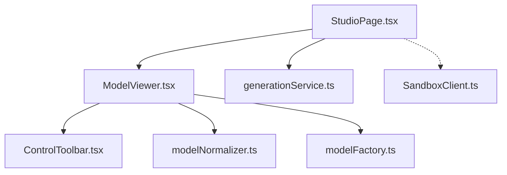
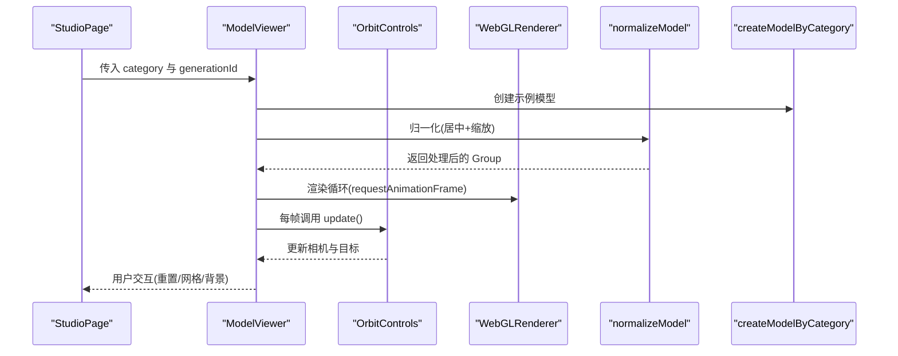
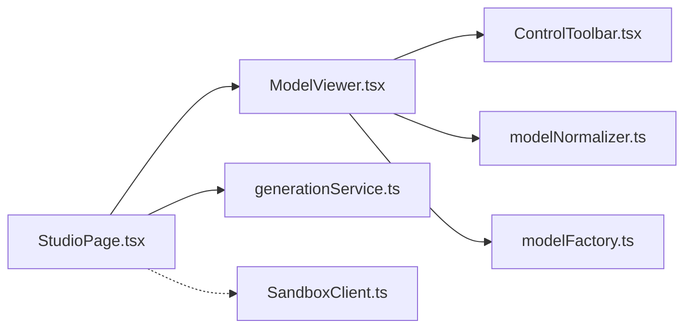

# 轨道控制器定制

<cite>
**本文引用的文件**   
- [ModelViewer.tsx](file://src/modules/viewer/components/ModelViewer.tsx)
- [ControlToolbar.tsx](file://src/modules/viewer/components/ControlToolbar.tsx)
- [modelNormalizer.ts](file://src/modules/viewer/utils/modelNormalizer.ts)
- [modelFactory.ts](file://src/modules/viewer/utils/modelFactory.ts)
- [StudioPage.tsx](file://src/modules/studio/pages/StudioPage.tsx)
- [generationService.ts](file://src/modules/studio/services/generationService.ts)
- [SandboxClient.ts](file://src/modules/sandbox/SandboxClient.ts)
</cite>

## 目录
1. [简介](#简介)
2. [项目结构](#项目结构)
3. [核心组件](#核心组件)
4. [架构总览](#架构总览)
5. [详细组件分析](#详细组件分析)
6. [依赖关系分析](#依赖关系分析)
7. [性能考量](#性能考量)
8. [故障排查指南](#故障排查指南)
9. [结论](#结论)
10. [附录：自定义控制器与高级交互示例路径](#附录自定义控制器与高级交互示例路径)

## 简介
本技术文档聚焦于 ApexForge 中基于 Three.js OrbitControls 的轨道控制器定制方案，围绕以下目标展开：
- 核心配置选项：旋转阻尼、缩放范围、平移限制、目标点锁定等。
- 手势识别实现：鼠标滚轮缩放、右键旋转、中键平移、触摸设备多点触控。
- 键盘快捷键绑定：WASD 移动、空格重置视角、数字键切换模式。
- 约束与限制机制：最小最大角度限制、边界碰撞检测、平滑过渡动画。
- 自定义控制器开发与高级交互实践：提供可落地的扩展思路与代码片段路径。

当前仓库已包含一个可直接运行的 3D 预览组件，其中已启用 OrbitControls 并开启阻尼效果；同时提供了模型归一化、工具栏控制与页面级状态管理。本文将在此基础上给出完整的定制方案与落地指引。

## 项目结构
与轨道控制器相关的核心文件位于 viewer 模块与 studio 页面层：
- ModelViewer：场景、相机、渲染器、OrbitControls 初始化与生命周期管理。
- ControlToolbar：重置视角、网格显示、背景切换等 UI 控制。
- modelNormalizer：模型居中与缩放归一化。
- modelFactory：按类别生成示例模型（用于演示）。
- StudioPage：集成 ModelViewer 与生成流程。
- generationService：本地模拟生成结果（MVP 阶段）。
- SandboxClient：沙箱执行客户端占位（后续接入 iframe 运行时）。

图表来源
- [StudioPage.tsx:140-155](file://src/modules/studio/pages/StudioPage.tsx#L140-L155)
- [ModelViewer.tsx:24-118](file://src/modules/viewer/components/ModelViewer.tsx#L24-L118)
- [ControlToolbar.tsx:12-26](file://src/modules/viewer/components/ControlToolbar.tsx#L12-L26)
- [modelNormalizer.ts:3-14](file://src/modules/viewer/utils/modelNormalizer.ts#L3-L14)
- [modelFactory.ts:26-41](file://src/modules/viewer/utils/modelFactory.ts#L26-L41)
- [generationService.ts:8-29](file://src/modules/studio/services/generationService.ts#L8-L29)
- [SandboxClient.ts:14-18](file://src/modules/sandbox/SandboxClient.ts#L14-L18)

章节来源
- [StudioPage.tsx:140-155](file://src/modules/studio/pages/StudioPage.tsx#L140-L155)
- [ModelViewer.tsx:24-118](file://src/modules/viewer/components/ModelViewer.tsx#L24-L118)
- [ControlToolbar.tsx:12-26](file://src/modules/viewer/components/ControlToolbar.tsx#L12-L26)
- [modelNormalizer.ts:3-14](file://src/modules/viewer/utils/modelNormalizer.ts#L3-L14)
- [modelFactory.ts:26-41](file://src/modules/viewer/utils/modelFactory.ts#L26-L41)
- [generationService.ts:8-29](file://src/modules/studio/services/generationService.ts#L8-L29)
- [SandboxClient.ts:14-18](file://src/modules/sandbox/SandboxClient.ts#L14-L18)

## 核心组件
- 轨道控制器实例化与基础配置
  - 在 ModelViewer 中创建 OrbitControls 实例，并启用阻尼与阻尼系数，以提供顺滑的旋转体验。
  - 参考路径：[ModelViewer.tsx:55-57](file://src/modules/viewer/components/ModelViewer.tsx#L55-L57)
- 视图重置
  - 通过工具栏按钮触发 resetCamera，设置相机位置与控制器目标点，并调用 update 刷新。
  - 参考路径：[ModelViewer.tsx:149-153](file://src/modules/viewer/components/ModelViewer.tsx#L149-L153)、[ControlToolbar.tsx:15-16](file://src/modules/viewer/components/ControlToolbar.tsx#L15-L16)
- 模型归一化
  - 使用 Box3 计算包围盒中心与尺寸，将模型居中并按最大轴缩放至合适大小，便于统一视角展示。
  - 参考路径：[modelNormalizer.ts:3-14](file://src/modules/viewer/utils/modelNormalizer.ts#L3-L14)
- 示例模型生成
  - 根据类别返回不同几何体组合，便于快速验证控制器行为。
  - 参考路径：[modelFactory.ts:26-41](file://src/modules/viewer/utils/modelFactory.ts#L26-L41)

章节来源
- [ModelViewer.tsx:55-57](file://src/modules/viewer/components/ModelViewer.tsx#L55-L57)
- [ModelViewer.tsx:149-153](file://src/modules/viewer/components/ModelViewer.tsx#L149-L153)
- [ControlToolbar.tsx:15-16](file://src/modules/viewer/components/ControlToolbar.tsx#L15-L16)
- [modelNormalizer.ts:3-14](file://src/modules/viewer/utils/modelNormalizer.ts#L3-L14)
- [modelFactory.ts:26-41](file://src/modules/viewer/utils/modelFactory.ts#L26-L41)

## 架构总览
下图展示了从页面到 3D 渲染的关键数据流与控制流，包括控制器更新循环与模型加载流程。

图表来源
- [StudioPage.tsx:140-155](file://src/modules/studio/pages/StudioPage.tsx#L140-L155)
- [ModelViewer.tsx:97-101](file://src/modules/viewer/components/ModelViewer.tsx#L97-L101)
- [modelNormalizer.ts:3-14](file://src/modules/viewer/utils/modelNormalizer.ts#L3-L14)
- [modelFactory.ts:26-41](file://src/modules/viewer/utils/modelFactory.ts#L26-L41)

## 详细组件分析

### 轨道控制器配置与默认行为
- 阻尼与平滑
  - 启用 enableDamping 与 dampingFactor，提升旋转惯性体验。
  - 参考路径：[ModelViewer.tsx:55-57](file://src/modules/viewer/components/ModelViewer.tsx#L55-L57)
- 默认输入映射
  - 左键拖拽旋转、滚轮缩放、中键拖拽平移（默认行为由 OrbitControls 提供）。
  - 参考路径：[ModelViewer.tsx:55-57](file://src/modules/viewer/components/ModelViewer.tsx#L55-L57)
- 目标点锁定
  - 通过 controls.target 控制旋转中心，resetCamera 中显式设置目标为原点。
  - 参考路径：[ModelViewer.tsx:149-153](file://src/modules/viewer/components/ModelViewer.tsx#L149-L153)

章节来源
- [ModelViewer.tsx:55-57](file://src/modules/viewer/components/ModelViewer.tsx#L55-L57)
- [ModelViewer.tsx:149-153](file://src/modules/viewer/components/ModelViewer.tsx#L149-L153)

### 手势识别与交互增强
- 鼠标滚轮缩放
  - 默认启用，可通过 zoomSpeed 调整灵敏度。
  - 建议扩展点：在 ModelViewer 初始化后设置 controls.zoomSpeed。
- 右键旋转
  - 默认启用，可通过 rotateSpeed 调整灵敏度。
  - 建议扩展点：在 ModelViewer 初始化后设置 controls.rotateSpeed。
- 中键平移
  - 默认启用，可通过 panSpeed 调整灵敏度。
  - 建议扩展点：在 ModelViewer 初始化后设置 controls.panSpeed。
- 触摸设备多点触控
  - OrbitControls 原生支持双指缩放与单指旋转/平移。
  - 建议扩展点：在移动端可结合 touchAction 与 pointer events 优化滚动穿透问题。

章节来源
- [ModelViewer.tsx:55-57](file://src/modules/viewer/components/ModelViewer.tsx#L55-L57)

### 键盘快捷键绑定
- WASD 移动
  - 可在窗口 keydown 事件中监听 W/A/S/D，修改 controls.target 或相机位置，实现“环绕”或“平移”效果。
  - 建议扩展点：在 ModelViewer 的 useEffect 中注册事件监听，并在清理函数中移除。
- 空格重置视角
  - 复用现有 resetCamera 逻辑，绑定空格键触发。
  - 参考路径：[ModelViewer.tsx:149-153](file://src/modules/viewer/components/ModelViewer.tsx#L149-L153)
- 数字键切换模式
  - 例如 1/2/3 切换不同的控制器模式（如纯旋转、仅缩放、锁定目标），通过状态机驱动 controls 属性开关。
  - 建议扩展点：在 StudioPage 维护 mode 状态，传递给 ModelViewer 作为 props。

章节来源
- [ModelViewer.tsx:149-153](file://src/modules/viewer/components/ModelViewer.tsx#L149-L153)

### 约束与限制机制
- 最小最大角度限制
  - 使用 minPolarAngle 与 maxPolarAngle 限制上下俯仰角，避免倒置视角。
  - 使用 minAzimuthAngle 与 maxAzimuthAngle 限制左右旋转范围。
  - 建议扩展点：在 ModelViewer 初始化后设置上述属性，并根据业务需求动态调整。
- 缩放范围限制
  - 使用 minDistance 与 maxDistance 限制最近/最远缩放距离。
  - 建议扩展点：根据模型尺寸动态计算合适的缩放范围。
- 平移限制
  - 使用 enablePan 控制是否允许平移；如需限制平移区域，可结合平面投影与边界判断进行拦截。
  - 建议扩展点：在 controls 的 onEnd 回调中校验新 target 是否在合法区域内。
- 边界碰撞检测
  - 对目标点或相机位置做边界检查，超出则回退或吸附到边界。
  - 建议扩展点：封装一个 clampTarget 函数，在每次交互结束时调用。
- 平滑过渡动画
  - 利用阻尼与 requestAnimationFrame 实现平滑过渡；也可在重置视角时使用缓动插值逐步更新相机与目标。
  - 建议扩展点：在 resetCamera 中使用线性插值或缓动曲线逐步更新。

章节来源
- [ModelViewer.tsx:55-57](file://src/modules/viewer/components/ModelViewer.tsx#L55-L57)
- [ModelViewer.tsx:149-153](file://src/modules/viewer/components/ModelViewer.tsx#L149-L153)

### 模型归一化与视角适配
- 归一化流程
  - 计算包围盒中心与尺寸，将模型平移到原点并按最大轴缩放至固定尺寸，确保不同模型在相同视角下呈现一致。
  - 参考路径：[modelNormalizer.ts:3-14](file://src/modules/viewer/utils/modelNormalizer.ts#L3-L14)
- 视角适配建议
  - 在归一化后，可根据模型尺寸动态调整相机距离与 FOV，以获得最佳观看体验。
  - 建议扩展点：在 normalizeModel 后增加 fitToView 步骤，自动设置相机位置。

章节来源
- [modelNormalizer.ts:3-14](file://src/modules/viewer/utils/modelNormalizer.ts#L3-L14)

### 工具栏与页面集成
- 工具栏功能
  - 重置视角、切换网格显示、切换黑白背景。
  - 参考路径：[ControlToolbar.tsx:12-26](file://src/modules/viewer/components/ControlToolbar.tsx#L12-L26)
- 页面集成
  - StudioPage 将 ModelViewer 嵌入主界面，并提供模板库与历史记录等上下文。
  - 参考路径：[StudioPage.tsx:140-155](file://src/modules/studio/pages/StudioPage.tsx#L140-L155)

章节来源
- [ControlToolbar.tsx:12-26](file://src/modules/viewer/components/ControlToolbar.tsx#L12-L26)
- [StudioPage.tsx:140-155](file://src/modules/studio/pages/StudioPage.tsx#L140-L155)

## 依赖关系分析
- 组件耦合
  - ModelViewer 依赖 OrbitControls、Three.js 渲染管线与模型工厂/归一化工具。
  - ControlToolbar 仅负责 UI 事件转发，低耦合。
  - StudioPage 聚合各子模块，承担状态管理与流程编排。
- 外部依赖
  - Three.js 与 OrbitControls 为关键外部依赖，版本需与示例保持一致。
- 潜在循环依赖
  - 当前结构无循环依赖风险，viewer 与 studio 职责清晰。

图表来源
- [StudioPage.tsx:140-155](file://src/modules/studio/pages/StudioPage.tsx#L140-L155)
- [ModelViewer.tsx:24-118](file://src/modules/viewer/components/ModelViewer.tsx#L24-L118)
- [ControlToolbar.tsx:12-26](file://src/modules/viewer/components/ControlToolbar.tsx#L12-L26)
- [modelNormalizer.ts:3-14](file://src/modules/viewer/utils/modelNormalizer.ts#L3-L14)
- [modelFactory.ts:26-41](file://src/modules/viewer/utils/modelFactory.ts#L26-L41)
- [generationService.ts:8-29](file://src/modules/studio/services/generationService.ts#L8-L29)
- [SandboxClient.ts:14-18](file://src/modules/sandbox/SandboxClient.ts#L14-L18)

章节来源
- [StudioPage.tsx:140-155](file://src/modules/studio/pages/StudioPage.tsx#L140-L155)
- [ModelViewer.tsx:24-118](file://src/modules/viewer/components/ModelViewer.tsx#L24-L118)
- [ControlToolbar.tsx:12-26](file://src/modules/viewer/components/ControlToolbar.tsx#L12-L26)
- [modelNormalizer.ts:3-14](file://src/modules/viewer/utils/modelNormalizer.ts#L3-L14)
- [modelFactory.ts:26-41](file://src/modules/viewer/utils/modelFactory.ts#L26-L41)
- [generationService.ts:8-29](file://src/modules/studio/services/generationService.ts#L8-L29)
- [SandboxClient.ts:14-18](file://src/modules/sandbox/SandboxClient.ts#L14-L18)

## 性能考量
- 渲染循环
  - 使用 requestAnimationFrame 驱动渲染，并在组件卸载时取消动画帧，避免内存泄漏。
  - 参考路径：[ModelViewer.tsx:97-101](file://src/modules/viewer/components/ModelViewer.tsx#L97-L101)、[ModelViewer.tsx:106-117](file://src/modules/viewer/components/ModelViewer.tsx#L106-L117)
- 资源释放
  - 在卸载时 dispose 控制器、渲染器与模型几何体/材质，防止 GPU 资源泄露。
  - 参考路径：[ModelViewer.tsx:106-117](file://src/modules/viewer/components/ModelViewer.tsx#L106-L117)
- 像素比与阴影
  - 设置 devicePixelRatio 上限与 PCFSoftShadowMap，平衡画质与性能。
  - 参考路径：[ModelViewer.tsx:48-52](file://src/modules/viewer/components/ModelViewer.tsx#L48-L52)

章节来源
- [ModelViewer.tsx:97-101](file://src/modules/viewer/components/ModelViewer.tsx#L97-L101)
- [ModelViewer.tsx:106-117](file://src/modules/viewer/components/ModelViewer.tsx#L106-L117)
- [ModelViewer.tsx:48-52](file://src/modules/viewer/components/ModelViewer.tsx#L48-L52)

## 故障排查指南
- 视角异常或无法旋转
  - 检查 OrbitControls 是否被正确挂载到 renderer.domElement，并确保在 animate 中调用 controls.update()。
  - 参考路径：[ModelViewer.tsx:55-57](file://src/modules/viewer/components/ModelViewer.tsx#L55-L57)、[ModelViewer.tsx:97-101](file://src/modules/viewer/components/ModelViewer.tsx#L97-L101)
- 重置视角无效
  - 确认 resetCamera 是否正确设置 camera.position 与 controls.target，并调用 update。
  - 参考路径：[ModelViewer.tsx:149-153](file://src/modules/viewer/components/ModelViewer.tsx#L149-L153)
- 模型过大或过小
  - 检查 normalizeModel 的缩放比例与 Box3 计算是否正确。
  - 参考路径：[modelNormalizer.ts:3-14](file://src/modules/viewer/utils/modelNormalizer.ts#L3-L14)
- 沙箱执行错误
  - SandboxClient 当前抛出运行时错误占位，待接入 iframe 运行时后完善错误映射与超时控制。
  - 参考路径：[SandboxClient.ts:14-18](file://src/modules/sandbox/SandboxClient.ts#L14-L18)

章节来源
- [ModelViewer.tsx:55-57](file://src/modules/viewer/components/ModelViewer.tsx#L55-L57)
- [ModelViewer.tsx:97-101](file://src/modules/viewer/components/ModelViewer.tsx#L97-L101)
- [ModelViewer.tsx:149-153](file://src/modules/viewer/components/ModelViewer.tsx#L149-L153)
- [modelNormalizer.ts:3-14](file://src/modules/viewer/utils/modelNormalizer.ts#L3-L14)
- [SandboxClient.ts:14-18](file://src/modules/sandbox/SandboxClient.ts#L14-L18)

## 结论
当前 MVP 已在 ModelViewer 中启用 OrbitControls 并具备基础的阻尼与重置能力。通过引入角度与缩放限制、平移边界检测、键盘快捷键与平滑过渡动画，可进一步提升用户体验与可控性。建议在后续迭代中：
- 将控制器配置参数化，支持运行时动态调整。
- 增加键盘与触摸的高级交互策略，适配多端设备。
- 完善沙箱执行与错误映射，保障 AI 代码的安全隔离与稳定运行。

## 附录：自定义控制器与高级交互示例路径
- 自定义控制器类
  - 新建自定义控制器类，继承或组合 OrbitControls，封装常用交互逻辑（如模式切换、边界检测、动画过渡）。
  - 参考路径：[ModelViewer.tsx:55-57](file://src/modules/viewer/components/ModelViewer.tsx#L55-L57)
- 键盘事件绑定
  - 在 ModelViewer 的 useEffect 中注册 keydown 监听，实现 WASD 移动与空格重置。
  - 参考路径：[ModelViewer.tsx:149-153](file://src/modules/viewer/components/ModelViewer.tsx#L149-L153)
- 模式切换状态机
  - 在 StudioPage 维护模式状态，传递至 ModelViewer 控制控制器行为。
  - 参考路径：[StudioPage.tsx:140-155](file://src/modules/studio/pages/StudioPage.tsx#L140-L155)
- 沙箱执行与错误映射
  - 完善 SandboxClient.execute 与 errorMapper，对接 iframe 运行时。
  - 参考路径：[SandboxClient.ts:14-18](file://src/modules/sandbox/SandboxClient.ts#L14-L18)

章节来源
- [ModelViewer.tsx:55-57](file://src/modules/viewer/components/ModelViewer.tsx#L55-L57)
- [ModelViewer.tsx:149-153](file://src/modules/viewer/components/ModelViewer.tsx#L149-L153)
- [StudioPage.tsx:140-155](file://src/modules/studio/pages/StudioPage.tsx#L140-L155)
- [SandboxClient.ts:14-18](file://src/modules/sandbox/SandboxClient.ts#L14-L18)