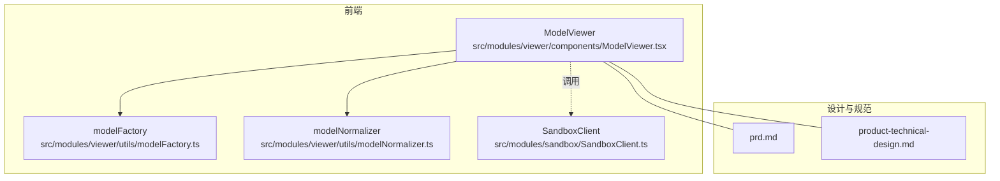
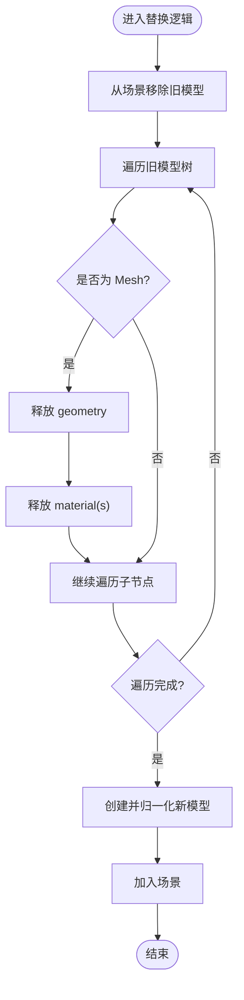
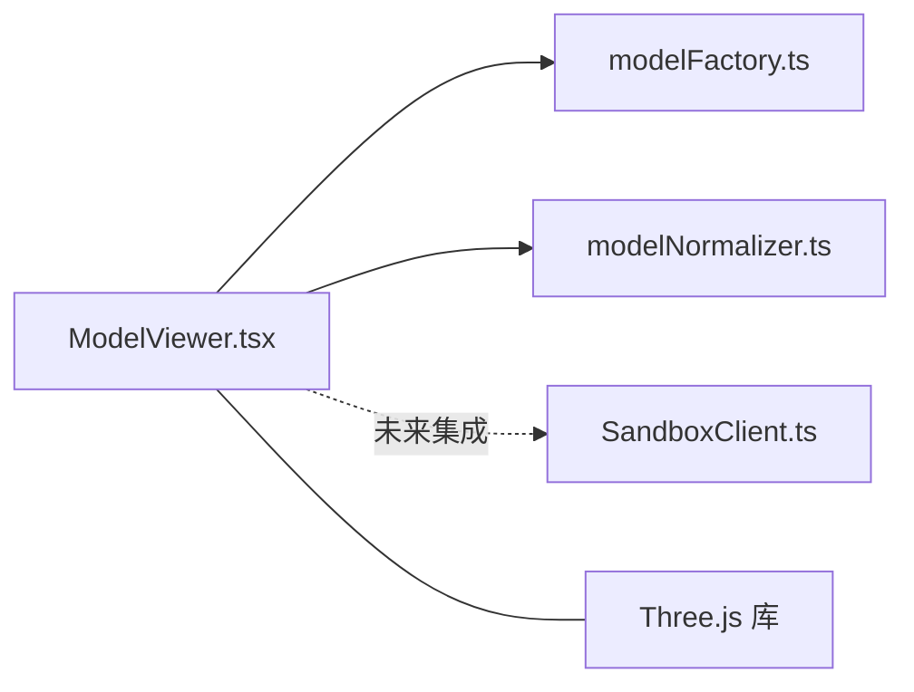

# 内存泄漏防护

<cite>
**本文引用的文件**   
- [ModelViewer.tsx](file://src/modules/viewer/components/ModelViewer.tsx)
- [modelFactory.ts](file://src/modules/viewer/utils/modelFactory.ts)
- [modelNormalizer.ts](file://src/modules/viewer/utils/modelNormalizer.ts)
- [SandboxClient.ts](file://src/modules/sandbox/SandboxClient.ts)
- [prd.md](file://prd.md)
- [product-technical-design.md](file://tech/product-technical-design.md)
</cite>

## 目录
1. [引言](#引言)
2. [项目结构](#项目结构)
3. [核心组件](#核心组件)
4. [架构总览](#架构总览)
5. [详细组件分析](#详细组件分析)
6. [依赖关系分析](#依赖关系分析)
7. [性能与内存优化](#性能与内存优化)
8. [故障排查指南](#故障排查指南)
9. [结论](#结论)
10. [附录](#附录)

## 引言
本技术文档聚焦于 ApexForge Three.js 前端的内存泄漏防护，围绕对象生命周期管理、资源释放策略、事件监听器清理、检测工具与方法、最佳实践以及大型模型处理优化展开。文档结合仓库中的实际代码与设计文档，给出可落地的实现建议与可视化图示，帮助读者在复杂交互与动态生成场景下稳定控制内存占用。

## 项目结构
本项目采用模块化前端组织方式，Three.js 渲染与模型加载集中在 viewer 模块，沙箱执行入口位于 sandbox 模块，产品与技术设计文档提供整体架构与流程说明。



图表来源
- [ModelViewer.tsx:1-171](file://src/modules/viewer/components/ModelViewer.tsx#L1-L171)
- [modelFactory.ts:1-192](file://src/modules/viewer/utils/modelFactory.ts#L1-L192)
- [modelNormalizer.ts:1-15](file://src/modules/viewer/utils/modelNormalizer.ts#L1-L15)
- [SandboxClient.ts:1-19](file://src/modules/sandbox/SandboxClient.ts#L1-L19)
- [prd.md:1-168](file://prd.md#L1-L168)
- [product-technical-design.md:1-800](file://tech/product-technical-design.md#L1-L800)

章节来源
- [prd.md:1-168](file://prd.md#L1-L168)
- [product-technical-design.md:1-800](file://tech/product-technical-design.md#L1-L800)

## 核心组件
- ModelViewer：负责 Three.js 场景初始化、渲染循环、控制器、网格与地面等常驻资源的创建与销毁；在卸载或替换模型时遍历并释放几何体与材质。
- modelFactory：按类别构建示例模型，封装基础几何体与材质创建，便于统一管理与复用。
- modelNormalizer：对生成的 Group 进行居中与缩放，确保展示一致性。
- SandboxClient：定义沙箱执行接口（当前为占位实现），用于后续 iframe/Worker 执行 AI 生成代码并返回序列化数据。

章节来源
- [ModelViewer.tsx:14-22](file://src/modules/viewer/components/ModelViewer.tsx#L14-L22)
- [ModelViewer.tsx:36-118](file://src/modules/viewer/components/ModelViewer.tsx#L36-L118)
- [modelFactory.ts:1-192](file://src/modules/viewer/utils/modelFactory.ts#L1-L192)
- [modelNormalizer.ts:1-15](file://src/modules/viewer/utils/modelNormalizer.ts#L1-L15)
- [SandboxClient.ts:1-19](file://src/modules/sandbox/SandboxClient.ts#L1-L19)

## 架构总览
从用户输入到模型渲染的端到端流程中，内存安全贯穿“生成—校验—沙箱执行—反序列化—挂载—显示”全链路。下图展示了关键阶段与资源生命周期管理的要点。

```mermaid
sequenceDiagram
participant U as "用户"
participant FE as "前端(Studio)"
participant API as "API 网关"
participant GEN as "生成服务"
participant BOX as "沙箱 iframe"
participant RT as "Three.js 运行时"
participant VIEW as "ModelViewer"
U->>FE : 输入描述
FE->>API : 提交生成请求
API->>GEN : 编排生成任务
GEN-->>FE : 返回代码/参数
FE->>BOX : postMessage 执行
BOX->>RT : 执行代码并序列化 group.toJSON()
RT-->>BOX : 返回 JSON
BOX-->>FE : 结果消息
FE->>VIEW : 反序列化并挂载
VIEW->>VIEW : 旧模型 dispose(geometry/material)
VIEW->>VIEW : 新模型加入场景
```

图表来源
- [prd.md:126-140](file://prd.md#L126-L140)
- [product-technical-design.md:478-507](file://tech/product-technical-design.md#L478-L507)
- [ModelViewer.tsx:120-135](file://src/modules/viewer/components/ModelViewer.tsx#L120-L135)

## 详细组件分析

### ModelViewer 组件与资源释放
- 生命周期管理
  - 初始化：创建 Scene、Camera、Renderer、OrbitControls、灯光、网格、地面等，并在 useEffect 清理函数中移除事件监听、取消动画帧、释放控制器与渲染器。
  - 模型替换：当 category/generationId 变化时，先移除旧模型并从场景中解绑，再遍历释放其 geometry 与 material，最后挂载新模型。
- 关键点
  - 使用递归遍历 Mesh 节点，确保所有子对象的几何体与材质被释放。
  - 避免重复引用与闭包持有导致 GC 无法回收。
  - 注意纹理与阴影贴图随材质释放而释放，无需单独维护。



图表来源
- [ModelViewer.tsx:120-135](file://src/modules/viewer/components/ModelViewer.tsx#L120-L135)
- [ModelViewer.tsx:14-22](file://src/modules/viewer/components/ModelViewer.tsx#L14-L22)

章节来源
- [ModelViewer.tsx:36-118](file://src/modules/viewer/components/ModelViewer.tsx#L36-L118)
- [ModelViewer.tsx:120-135](file://src/modules/viewer/components/ModelViewer.tsx#L120-L135)

### 模型工厂与指标统计
- 工厂方法
  - 按类别创建不同模型，内部通过统一的 box/cylinder/sphere 辅助函数创建 Mesh，并设置阴影属性。
- 指标统计
  - 遍历模型树统计 Mesh 数量、顶点数与材质种类，用于质量评分与复杂度评估。
- 内存影响
  - 合理控制分段段数与几何体数量，避免一次性创建过多高面数几何体。
  - 共享材质可减少内存占用，但需注意多实例时的状态隔离。

章节来源
- [modelFactory.ts:1-192](file://src/modules/viewer/utils/modelFactory.ts#L1-L192)

### 模型归一化
- 功能
  - 计算包围盒，将模型中心移至原点并按最大轴缩放至目标尺寸，保证在不同模型间一致的展示比例。
- 内存影响
  - 仅修改位置与缩放，不引入额外几何体或纹理，内存开销极低。

章节来源
- [modelNormalizer.ts:1-15](file://src/modules/viewer/utils/modelNormalizer.ts#L1-L15)

### 沙箱客户端接口
- 现状
  - 定义了 execute 接口与错误映射，当前为占位实现，抛出运行时错误。
- 扩展方向
  - 基于 iframe 或 Web Worker 执行 AI 生成代码，返回序列化后的 group JSON，主线程使用 ObjectLoader 反序列化并挂载。
  - 超时与异常需及时销毁沙箱上下文，避免残留引用。

章节来源
- [SandboxClient.ts:1-19](file://src/modules/sandbox/SandboxClient.ts#L1-L19)
- [prd.md:105-117](file://prd.md#L105-L117)
- [product-technical-design.md:478-507](file://tech/product-technical-design.md#L478-L507)

## 依赖关系分析
- 组件耦合
  - ModelViewer 依赖 modelFactory 与 modelNormalizer，形成“创建—归一化—挂载”的清晰管线。
  - SandboxClient 作为外部执行入口，未来将与 ModelViewer 集成，承担代码执行与结果传递职责。
- 外部依赖
  - Three.js 及其示例控件 OrbitControls。
  - React 生命周期与 ref 管理。



图表来源
- [ModelViewer.tsx:1-171](file://src/modules/viewer/components/ModelViewer.tsx#L1-L171)
- [modelFactory.ts:1-192](file://src/modules/viewer/utils/modelFactory.ts#L1-L192)
- [modelNormalizer.ts:1-15](file://src/modules/viewer/utils/modelNormalizer.ts#L1-L15)
- [SandboxClient.ts:1-19](file://src/modules/sandbox/SandboxClient.ts#L1-L19)

章节来源
- [ModelViewer.tsx:1-171](file://src/modules/viewer/components/ModelViewer.tsx#L1-L171)
- [modelFactory.ts:1-192](file://src/modules/viewer/utils/modelFactory.ts#L1-L192)
- [modelNormalizer.ts:1-15](file://src/modules/viewer/utils/modelNormalizer.ts#L1-L15)
- [SandboxClient.ts:1-19](file://src/modules/sandbox/SandboxClient.ts#L1-L19)

## 性能与内存优化
- 几何体 dispose() 时机
  - 在模型替换与组件卸载时，务必遍历所有 Mesh 并调用 geometry.dispose()。
  - 参考路径：[ModelViewer.tsx:14-22](file://src/modules/viewer/components/ModelViewer.tsx#L14-L22)
- 材质释放策略
  - 对每个 Mesh.material（数组或单例）逐一调用 dispose()，避免遗漏。
  - 参考路径：[ModelViewer.tsx:14-22](file://src/modules/viewer/components/ModelViewer.tsx#L14-L22)
- 纹理清理机制
  - 纹理通常由材质持有，释放材质即可触发纹理释放；若存在独立纹理缓存，需在业务层维护弱引用或显式清理。
- 事件监听器移除规范
  - 在组件卸载时移除 window.resize 监听，取消 requestAnimationFrame，释放控制器与渲染器。
  - 参考路径：[ModelViewer.tsx:103-118](file://src/modules/viewer/components/ModelViewer.tsx#L103-L118)
- 内存泄漏检测工具与方法
  - Heap Snapshot 分析：对比两次快照，关注未释放的 Geometry/Material/Texture 与 DOM 引用。
  - 内存增长监控：周期性采样 JS Heap Size 与 GPU 纹理内存，发现异常增长趋势。
  - 弱引用模式：对长生命周期对象集合使用 WeakMap/WeakRef，避免阻止 GC。
- 资源释放最佳实践
  - SceneManager.dispose() 完整流程：移除场景对象、释放控制器、释放渲染器、清理事件与动画帧、清空引用。
  - 循环引用避免：避免在回调或闭包中持有大对象引用；必要时显式置空。
  - 大对象池管理：对频繁创建销毁的对象（如临时 BufferGeometry）建立池化，减少分配抖动。
- 大型模型处理优化
  - 分块加载：按区域或层级分批加载，降低峰值内存。
  - 流式处理：边解析边挂载，避免一次性加载全部 JSON。
  - 虚拟内存管理：按需加载纹理与 LOD，远距使用低精度版本。
  - 垃圾回收优化：减少短生命周期大对象，合并小对象，避免频繁分配。

章节来源
- [ModelViewer.tsx:103-118](file://src/modules/viewer/components/ModelViewer.tsx#L103-L118)
- [prd.md:155-168](file://prd.md#L155-L168)
- [product-technical-design.md:563-571](file://tech/product-technical-design.md#L563-L571)

## 故障排查指南
- 常见问题定位
  - 内存持续增长：检查是否在替换模型后遗漏 dispose(geometry/material)。
  - 渲染卡顿：确认是否仍在运行旧的 requestAnimationFrame 或未移除事件监听。
  - 沙箱执行失败：核对错误映射与超时策略，确保销毁 iframe 并清理引用。
- 调试步骤
  - 使用浏览器开发者工具的 Memory 面板录制 Heap Snapshot，比较差异对象。
  - 在替换模型前后打印模型树深度与 Mesh 数量，验证释放是否生效。
  - 对关键路径添加日志，记录 dispose 调用次数与对象 ID。
- 参考实现路径
  - 模型替换与释放：[ModelViewer.tsx:120-135](file://src/modules/viewer/components/ModelViewer.tsx#L120-L135)
  - 组件卸载清理：[ModelViewer.tsx:103-118](file://src/modules/viewer/components/ModelViewer.tsx#L103-L118)
  - 沙箱错误映射：[SandboxClient.ts:1-19](file://src/modules/sandbox/SandboxClient.ts#L1-L19)

章节来源
- [ModelViewer.tsx:103-135](file://src/modules/viewer/components/ModelViewer.tsx#L103-L135)
- [SandboxClient.ts:1-19](file://src/modules/sandbox/SandboxClient.ts#L1-L19)

## 结论
通过对 ModelViewer、modelFactory、modelNormalizer 与 SandboxClient 的分析，可以明确 Three.js 对象的生命周期管理关键在于：在合适的时机调用 dispose()、彻底移除事件与动画帧、避免闭包与全局引用导致的循环引用。结合 Heap Snapshot 与内存监控，可在复杂交互与动态生成场景下有效识别与修复内存泄漏。遵循本文的最佳实践与优化策略，可显著提升平台稳定性与用户体验。

## 附录
- 相关设计参考
  - 沙箱执行流程与错误分类：[prd.md:105-117](file://prd.md#L105-L117)、[prd.md:508-517](file://prd.md#L508-L517)
  - 前端性能策略与资源释放要求：[product-technical-design.md:563-571](file://tech/product-technical-design.md#L563-L571)