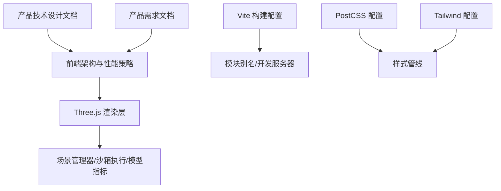
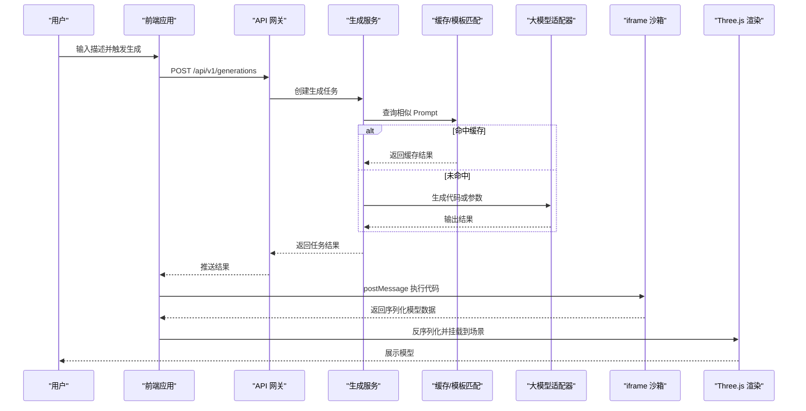
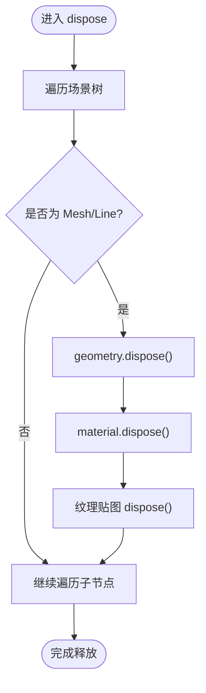
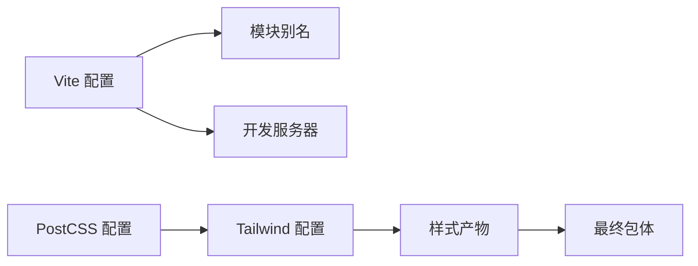

# 性能优化策略

<cite>
**本文引用的文件**   
- [产品技术设计文档](file://tech/product-technical-design.md)
- [产品需求文档](file://prd.md)
- [Vite 构建配置](file://vite.config.ts)
- [PostCSS 配置](file://postcss.config.js)
- [Tailwind 配置](file://tailwind.config.js)
</cite>

## 目录
1. [引言](#引言)
2. [项目结构](#项目结构)
3. [核心组件](#核心组件)
4. [架构总览](#架构总览)
5. [详细组件分析](#详细组件分析)
6. [依赖分析](#依赖分析)
7. [性能考量](#性能考量)
8. [故障排查指南](#故障排查指南)
9. [结论](#结论)
10. [附录](#附录)

## 引言
本文件面向 ApexForge 的 Three.js 前端渲染与性能优化，聚焦以下目标：
- 建立可落地的性能监控指标体系（FPS、内存使用统计、GPU 渲染时间测量）
- 完善内存泄漏防护机制（几何体 dispose、材质释放、纹理清理、事件监听器移除）
- 系统化落地渲染优化（视锥体剔除、遮挡剔除、批处理渲染、实例化渲染）
- 制定资源加载优化策略（懒加载、预加载、缓存机制、CDN 加速）
- 提供性能分析工具使用、瓶颈定位方法与优化效果验证的实践指引

说明：仓库当前以设计与规范为主，未包含具体实现代码。本文所有“示例”均以“代码片段路径”形式给出，便于在后续工程落地时直接对照实现。

## 项目结构
仓库目前包含产品与技术设计文档以及前端构建配置，尚未包含业务源码。关键结构与职责如下：
- 设计与规划：产品技术设计文档、产品需求文档
- 构建与样式：Vite、PostCSS、Tailwind 配置

图表来源
- [产品技术设计文档:520-573](file://tech/product-technical-design.md#L520-L573)
- [产品需求文档:59-70](file://prd.md#L59-L70)
- [Vite 构建配置:1-16](file://vite.config.ts#L1-L16)
- [PostCSS 配置:1-7](file://postcss.config.js#L1-L7)
- [Tailwind 配置:1-53](file://tailwind.config.js#L1-L53)

章节来源
- [产品技术设计文档:520-573](file://tech/product-technical-design.md#L520-L573)
- [产品需求文档:59-70](file://prd.md#L59-L70)
- [Vite 构建配置:1-16](file://vite.config.ts#L1-L16)
- [PostCSS 配置:1-7](file://postcss.config.js#L1-L7)
- [Tailwind 配置:1-53](file://tailwind.config.js#L1-L53)

## 核心组件
围绕 Three.js 渲染与性能优化的核心组件与职责：
- 场景管理器（SceneManager）
  - 负责场景初始化、灯光、控制器、模型挂载与销毁
  - 对外暴露 init/loadModel/clearModel/fitToView/setBackground/captureScreenshot/dispose 等能力
- 沙箱客户端（SandboxClient）
  - 与 iframe 通信、超时控制、错误映射
- 模型指标（ModelMetrics）
  - 复杂度统计、面数/顶点估算、质量评分相关指标采集
- 生成存储（GenerationStore）
  - 管理生成任务状态和结果，为性能回溯提供上下文

章节来源
- [产品技术设计文档:539-561](file://tech/product-technical-design.md#L539-L561)
- [产品需求文档:67-70](file://prd.md#L67-L70)

## 架构总览
从用户输入到渲染的全链路，涉及前端、沙箱、后端与模板/缓存系统。下图展示与性能相关的交互点：

图表来源
- [产品技术设计文档:362-390](file://tech/product-technical-design.md#L362-L390)
- [产品需求文档:126-139](file://prd.md#L126-L139)

## 详细组件分析

### 前端性能监控指标收集
目标：持续采集 FPS、内存使用统计、GPU 渲染时间，形成可视化面板与告警阈值。

- FPS 监控
  - 基于 requestAnimationFrame 帧计数，计算每秒帧率；页面不可见时暂停计时
  - 建议将 FPS 采样频率控制在 1s 一次，避免频繁写入 UI
  - 参考实现位置：[前端性能策略:563-571](file://tech/product-technical-design.md#L563-L571)

- 内存使用统计
  - 使用 Performance Memory API 获取 JS Heap 大小、DOM 节点数量、Canvas 纹理占用估算
  - 在模型切换、资源加载前后对比差值，识别异常增长
  - 参考实现位置：[SceneManager.dispose 能力:551-561](file://tech/product-technical-design.md#L551-L561)

- GPU 渲染时间测量
  - 使用 WebGL 扩展（如 EXT_disjoint_timer_query）测量单帧 GPU 耗时
  - 结合 CPU 侧渲染时间（renderer.render 前后时间戳），区分 CPU/GPU 瓶颈
  - 参考实现位置：[前端性能策略:563-571](file://tech/product-technical-design.md#L563-L571)

- 指标上报与可视化
  - 通过 SSE/WebSocket 上报至后端，或使用本地面板展示
  - 与生成任务 traceId 关联，便于问题回溯
  - 参考实现位置：[SSE 事件定义:734-756](file://tech/product-technical-design.md#L734-L756)

章节来源
- [产品技术设计文档:563-571](file://tech/product-technical-design.md#L563-L571)
- [产品技术设计文档:734-756](file://tech/product-technical-design.md#L734-L756)

### 内存泄漏防护机制
目标：确保旧模型与资源彻底释放，避免长期运行导致内存持续增长。

- 几何体 dispose
  - 遍历场景树，对每个 Mesh/Line 等的 geometry 调用 dispose
  - 参考实现位置：[SceneManager.dispose 能力:551-561](file://tech/product-technical-design.md#L551-L561)

- 材质释放
  - 对 material 及其 map、normalMap、emissiveMap 等纹理逐一 dispose
  - 参考实现位置：[前端性能策略:563-571](file://tech/product-technical-design.md#L563-L571)

- 纹理清理
  - 主动清理 Texture、DataTexture、CompressedTexture 等
  - 参考实现位置：[前端性能策略:563-571](file://tech/product-technical-design.md#L563-L571)

- 事件监听器移除
  - 移除 OrbitControls、自定义事件监听器，避免闭包引用导致 GC 失效
  - 建议在 clearModel 中统一解绑

- 生命周期与回收流程

图表来源
- [产品技术设计文档:551-571](file://tech/product-technical-design.md#L551-L571)

章节来源
- [产品技术设计文档:551-571](file://tech/product-technical-design.md#L551-L571)

### 渲染优化技术
目标：降低绘制调用、减少过绘、提升吞吐。

- 视锥体剔除
  - 启用 Three.js 默认 FrustumCulling，合理设置相机近远裁剪面
  - 对远距离物体使用 LOD 或多分辨率模型
  - 参考实现位置：[前端性能策略:563-571](file://tech/product-technical-design.md#L563-L571)、[性能优化:155-165](file://prd.md#L155-L165)

- 遮挡剔除
  - 使用 occlusion query 或分层场景，按深度排序减少透明物体过绘
  - 对静态背景采用离屏渲染或静态纹理

- 批处理渲染
  - 合并同材质网格，减少 draw call
  - 使用 InstancedMesh 批量渲染重复元素（如轮毂螺丝）
  - 参考实现位置：[性能优化:155-165](file://prd.md#L155-L165)

- 实例化渲染
  - 大量相同对象优先使用 InstancedMesh
  - 注意实例属性更新开销，必要时分批次更新

章节来源
- [产品技术设计文档:563-571](file://tech/product-technical-design.md#L563-L571)
- [产品需求文档:155-165](file://prd.md#L155-L165)

### 资源加载优化策略
目标：缩短首屏时间、降低带宽、提高复用率。

- 懒加载
  - 按需加载 Three.js 与沙箱 runtime，降低首屏体积
  - 参考实现位置：[前端性能策略:563-571](file://tech/product-technical-design.md#L563-L571)

- 预加载
  - 对常用模板与基础材质进行预取，提升首次渲染速度
  - 使用 Service Worker 缓存静态资源

- 缓存机制
  - 服务端缓存相同/相似 Prompt 的生成结果（相似度 > 0.95）
  - 模板模式下的参数化生成仅需 10～50ms，避免 LLM 调用
  - 参考实现位置：[性能优化:155-165](file://prd.md#L155-L165)

- CDN 加速
  - 静态资源 CDN 缓存，Gzip/Brotli 压缩，代码增量更新
  - 参考实现位置：[性能优化:155-165](file://prd.md#L155-L165)

章节来源
- [产品技术设计文档:563-571](file://tech/product-technical-design.md#L563-L571)
- [产品需求文档:155-165](file://prd.md#L155-L165)

### 性能分析工具使用与瓶颈定位
- 浏览器开发者工具
  - Performance 面板：记录主线程与渲染时间轴，定位长任务与掉帧
  - Memory 面板：Heap Snapshot 与 Allocation Timeline，查找泄漏源
  - Rendering 面板：开启 Overdraw、Layers，观察过绘与合成层级
- WebGL 调试
  - 使用 GPU 定时器扩展测量 GPU 耗时，结合 CPU 渲染时间判断瓶颈
- 指标关联
  - 将 FPS、内存、GPU 时间与 traceId 绑定，便于跨端回溯
- 参考实现位置
  - [前端性能策略:563-571](file://tech/product-technical-design.md#L563-L571)
  - [SSE 事件定义:734-756](file://tech/product-technical-design.md#L734-L756)

章节来源
- [产品技术设计文档:563-571](file://tech/product-technical-design.md#L563-L571)
- [产品技术设计文档:734-756](file://tech/product-technical-design.md#L734-L756)

### 优化效果验证方法
- 基线采集
  - 在未优化版本下采集 FPS、内存峰值、GPU 耗时、首屏时间
- 对比实验
  - 逐项启用优化（InstancedMesh、LOD、dispose 流程），记录指标变化
- 回归测试
  - 自动化脚本驱动典型场景，持续监控指标是否回退
- 参考实现位置
  - [前端性能策略:563-571](file://tech/product-technical-design.md#L563-L571)
  - [性能优化:155-165](file://prd.md#L155-L165)

章节来源
- [产品技术设计文档:563-571](file://tech/product-technical-design.md#L563-L571)
- [产品需求文档:155-165](file://prd.md#L155-L165)

## 依赖分析
前端构建与样式管线对性能的影响：
- Vite 构建配置
  - 模块别名与开发服务器端口，影响开发与打包效率
- PostCSS 与 Tailwind
  - 样式扫描范围与主题变量，影响 CSS 体积与解析时间

图表来源
- [Vite 构建配置:1-16](file://vite.config.ts#L1-L16)
- [PostCSS 配置:1-7](file://postcss.config.js#L1-L7)
- [Tailwind 配置:1-53](file://tailwind.config.js#L1-L53)

章节来源
- [Vite 构建配置:1-16](file://vite.config.ts#L1-L16)
- [PostCSS 配置:1-7](file://postcss.config.js#L1-L7)
- [Tailwind 配置:1-53](file://tailwind.config.js#L1-L53)

## 性能考量
- 渲染循环
  - 使用 requestAnimationFrame 控制渲染，页面不可见时暂停
  - 参考实现位置：[前端性能策略:563-571](file://tech/product-technical-design.md#L563-L571)
- 复杂度过载保护
  - 加载前统计复杂度，超过阈值提示降级或切换模板模式
  - 参考实现位置：[前端性能策略:563-571](file://tech/product-technical-design.md#L563-L571)
- 网络与缓存
  - 静态资源 CDN 缓存、压缩与增量更新
  - 参考实现位置：[性能优化:155-165](file://prd.md#L155-L165)

章节来源
- [产品技术设计文档:563-571](file://tech/product-technical-design.md#L563-L571)
- [产品需求文档:155-165](file://prd.md#L155-L165)

## 故障排查指南
- 常见错误分类与处理
  - 执行超时、运行时报错、模型 JSON 非法、模型过于复杂、空模型
  - 对应错误码与用户提示，便于快速定位
  - 参考实现位置：[错误分类:508-517](file://tech/product-technical-design.md#L508-L517)
- 全链路追踪
  - 每个请求带 traceId，日志记录端到端耗时
  - 参考实现位置：[SSE 事件定义:734-756](file://tech/product-technical-design.md#L734-L756)
- 前端卡顿与内存泄漏
  - 检查 dispose 流程是否完整、事件监听器是否移除
  - 使用 Memory 面板与 GPU 定时器定位瓶颈
  - 参考实现位置：[前端性能策略:563-571](file://tech/product-technical-design.md#L563-L571)

章节来源
- [产品技术设计文档:508-517](file://tech/product-technical-design.md#L508-L517)
- [产品技术设计文档:734-756](file://tech/product-technical-design.md#L734-L756)
- [产品技术设计文档:563-571](file://tech/product-technical-design.md#L563-L571)

## 结论
通过建立完善的性能监控指标、严格的内存泄漏防护、系统的渲染优化与资源加载策略，ApexForge 可在保证安全与可控的前提下，显著提升 Three.js 渲染性能与用户体验。建议在后续工程落地中，将本文所述策略纳入标准实现与回归测试，持续跟踪指标并迭代优化。

## 附录
- 代码片段路径（用于后续实现对照）
  - 场景管理器能力定义：[SceneManager 设计:551-561](file://tech/product-technical-design.md#L551-L561)
  - 前端性能策略要点：[前端性能策略:563-571](file://tech/product-technical-design.md#L563-L571)
  - 性能优化清单（前端/服务端/网络）：[性能优化:155-165](file://prd.md#L155-L165)
  - 错误分类与提示：[错误分类:508-517](file://tech/product-technical-design.md#L508-L517)
  - SSE 事件与 traceId 关联：[SSE 事件定义:734-756](file://tech/product-technical-design.md#L734-L756)