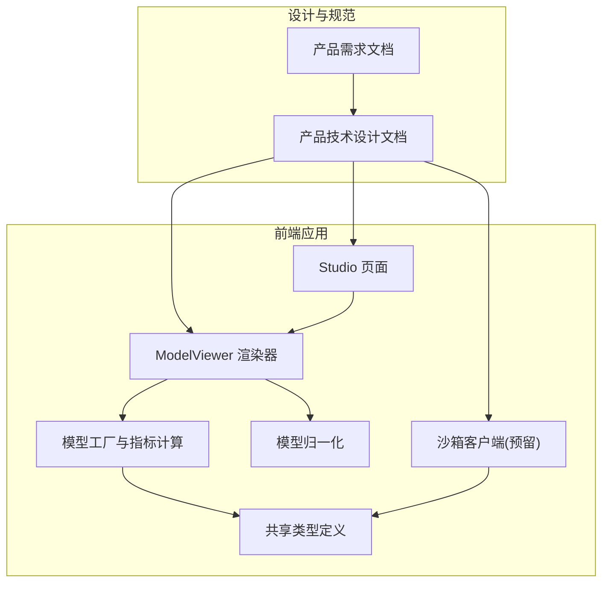
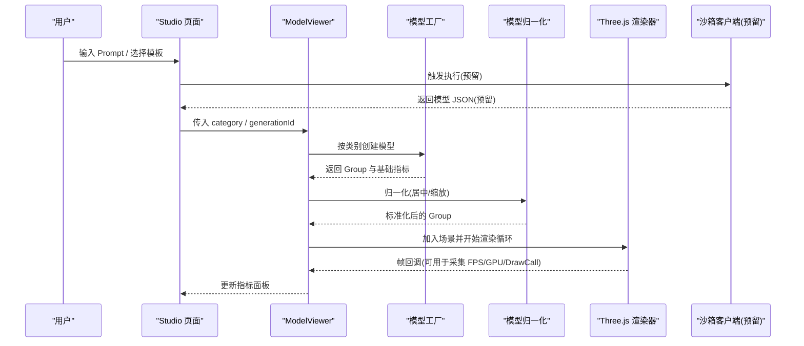
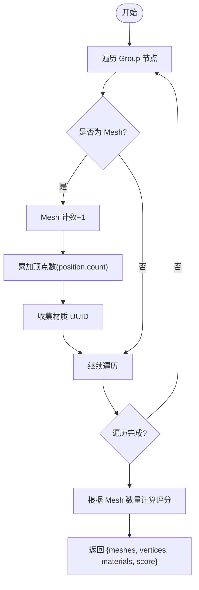
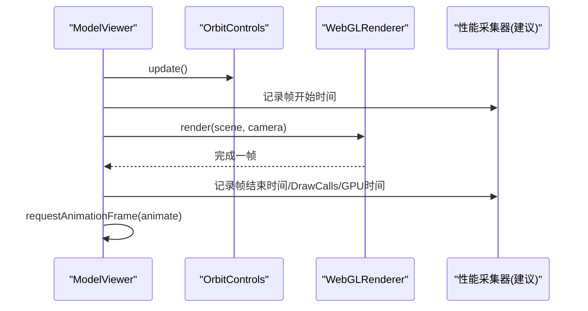
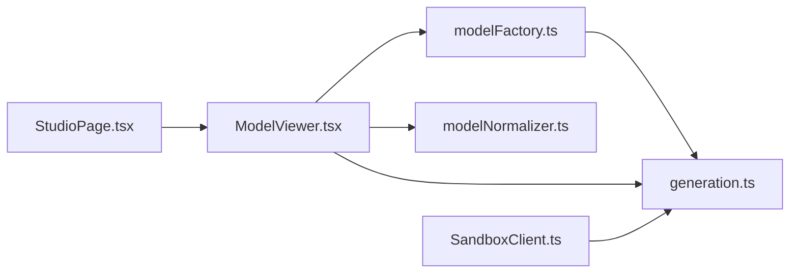

# 性能监控指标

<cite>
**本文引用的文件**   
- [prd.md](file://prd.md)
- [product-technical-design.md](file://tech/product-technical-design.md)
- [StudioPage.tsx](file://src/modules/studio/pages/StudioPage.tsx)
- [ModelViewer.tsx](file://src/modules/viewer/components/ModelViewer.tsx)
- [modelFactory.ts](file://src/modules/viewer/utils/modelFactory.ts)
- [modelNormalizer.ts](file://src/modules/viewer/utils/modelNormalizer.ts)
- [SandboxClient.ts](file://src/modules/sandbox/SandboxClient.ts)
- [generation.ts](file://src/shared/types/generation.ts)
</cite>

## 目录
1. [引言](#引言)
2. [项目结构](#项目结构)
3. [核心组件](#核心组件)
4. [架构总览](#架构总览)
5. [详细组件分析](#详细组件分析)
6. [依赖关系分析](#依赖关系分析)
7. [性能考量](#性能考量)
8. [故障排查指南](#故障排查指南)
9. [结论](#结论)
10. [附录](#附录)

## 引言
本技术文档聚焦于 ApexForge Three.js 前端性能监控指标体系，围绕 FPS 实时监控、内存使用统计、GPU 渲染时间测量、Draw Call 计数、几何体数量统计等关键维度，给出数据采集方案、工具集成与基准测试方法。同时结合现有代码中的模型质量指标（Mesh、Vertices、Materials、Score）与渲染管线，提供可落地的面板实现思路与自动化报告生成策略，帮助团队在“AI 生成 + 程序化模板”的混合模式下持续优化渲染性能与用户体验。

## 项目结构
本项目采用模块化组织：
- 产品与技术设计文档定义整体架构、安全与性能策略、沙箱执行流程与观测能力。
- 前端以 React + Three.js 为核心，包含 Studio 工作台、Viewer 渲染器、模板库与沙箱客户端。
- 共享类型定义贯穿前后端数据契约。

图表来源
- [prd.md:1-168](file://prd.md#L1-L168)
- [product-technical-design.md:34-100](file://tech/product-technical-design.md#L34-L100)
- [StudioPage.tsx:1-245](file://src/modules/studio/pages/StudioPage.tsx#L1-L245)
- [ModelViewer.tsx:1-171](file://src/modules/viewer/components/ModelViewer.tsx#L1-L171)
- [modelFactory.ts:1-192](file://src/modules/viewer/utils/modelFactory.ts#L1-L192)
- [modelNormalizer.ts:1-15](file://src/modules/viewer/utils/modelNormalizer.ts#L1-L15)
- [SandboxClient.ts:1-19](file://src/modules/sandbox/SandboxClient.ts#L1-L19)
- [generation.ts:1-29](file://src/shared/types/generation.ts#L1-L29)

章节来源
- [prd.md:1-168](file://prd.md#L1-L168)
- [product-technical-design.md:34-100](file://tech/product-technical-design.md#L34-L100)

## 核心组件
- 质量指标面板：展示 Mesh、Vertices、Materials、Score 四项指标，用于快速评估模型复杂度与渲染压力。
- 渲染器：基于 Three.js 的 WebGLRenderer，启用抗锯齿、阴影贴图与 OrbitControls，负责场景绘制循环。
- 模型工厂：按类别创建模型并计算基础指标（网格数、顶点数、材质数），并提供评分函数。
- 模型归一化：对模型进行居中与缩放，保证在不同设备上的可视一致性。
- 沙箱客户端：预留接口，后续用于隔离执行 AI 生成的代码并返回序列化模型数据。

章节来源
- [StudioPage.tsx:171-185](file://src/modules/studio/pages/StudioPage.tsx#L171-L185)
- [ModelViewer.tsx:36-118](file://src/modules/viewer/components/ModelViewer.tsx#L36-L118)
- [modelFactory.ts:43-59](file://src/modules/viewer/utils/modelFactory.ts#L43-L59)
- [modelNormalizer.ts:3-14](file://src/modules/viewer/utils/modelNormalizer.ts#L3-L14)
- [SandboxClient.ts:14-18](file://src/modules/sandbox/SandboxClient.ts#L14-L18)
- [generation.ts:5-10](file://src/shared/types/generation.ts#L5-L10)

## 架构总览
从“自然语言输入 → 模板/代码生成 → 沙箱执行 → 渲染预览 → 指标采集”的全链路中，性能监控贯穿以下环节：
- 生成阶段：记录任务耗时、校验结果与复杂度阈值。
- 执行阶段：沙箱内执行限时保护，避免阻塞主线程。
- 渲染阶段：实时采集 FPS、GPU 时间、Draw Call、几何体数量等指标。
- 展示阶段：将指标聚合到面板，支持导出与告警。

图表来源
- [StudioPage.tsx:41-65](file://src/modules/studio/pages/StudioPage.tsx#L41-L65)
- [ModelViewer.tsx:120-135](file://src/modules/viewer/components/ModelViewer.tsx#L120-L135)
- [modelFactory.ts:26-41](file://src/modules/viewer/utils/modelFactory.ts#L26-L41)
- [modelNormalizer.ts:3-14](file://src/modules/viewer/utils/modelNormalizer.ts#L3-L14)
- [SandboxClient.ts:14-18](file://src/modules/sandbox/SandboxClient.ts#L14-L18)

## 详细组件分析

### 指标采集与面板
- 当前已实现的基础指标：
  - Mesh 数量：遍历 Group 统计 THREE.Mesh 实例数。
  - Vertices 数量：累加每个 Mesh 的 position 属性 count。
  - Materials 数量：收集唯一 material uuid 的数量。
  - Score：基于 Mesh 数量的经验评分，范围限定在合理区间。
- 面板展示：
  - Studio 页面右侧“质量指标”卡片，以四宫格形式呈现上述指标。
- 扩展建议：
  - 增加 FPS 实时曲线、GPU 渲染时间、Draw Call 计数、纹理大小与显存占用。
  - 将指标写入统一上报通道，支持历史对比与阈值告警。

章节来源
- [modelFactory.ts:43-59](file://src/modules/viewer/utils/modelFactory.ts#L43-L59)
- [StudioPage.tsx:171-185](file://src/modules/studio/pages/StudioPage.tsx#L171-L185)
- [generation.ts:5-10](file://src/shared/types/generation.ts#L5-L10)

#### 指标计算流程图

图表来源
- [modelFactory.ts:43-59](file://src/modules/viewer/utils/modelFactory.ts#L43-L59)

### 渲染循环与性能采集点
- 渲染循环：
  - 使用 requestAnimationFrame 驱动渲染，每帧调用 renderer.render(scene, camera)。
  - 通过 controls.update() 保持交互平滑。
- 采集点建议：
  - FPS：基于帧间隔统计；或使用 PerformanceObserver 的 frame 类型事件。
  - GPU 时间：使用 WebGL 查询对象（如 EXT_disjoint_timer_query）或浏览器性能 API。
  - Draw Call：读取 renderer.info.render.calls。
  - 几何体数量：复用 calculateMetrics 的结果。
  - 内存：使用 performance.memory（若可用）或采样堆快照。

章节来源
- [ModelViewer.tsx:97-103](file://src/modules/viewer/components/ModelViewer.tsx#L97-L103)
- [modelFactory.ts:43-59](file://src/modules/viewer/utils/modelFactory.ts#L43-L59)

#### 渲染序列图（含采集点）

图表来源
- [ModelViewer.tsx:97-103](file://src/modules/viewer/components/ModelViewer.tsx#L97-L103)

### 模型归一化与尺寸控制
- 目标：确保不同模型在场景中居中且比例一致，避免过大/过小导致相机适配问题。
- 方法：计算包围盒，获取中心与最大轴长度，按固定目标尺寸缩放并平移至原点。

章节来源
- [modelNormalizer.ts:3-14](file://src/modules/viewer/utils/modelNormalizer.ts#L3-L14)

### 沙箱执行与错误映射（预留）
- 目的：隔离执行 AI 生成的代码，防止主线程被阻塞或访问受限资源。
- 现状：SandboxClient 提供 execute 接口占位，抛出映射后的错误码，便于后续接入 iframe 运行时。
- 建议：
  - 设置超时销毁机制。
  - 限制可访问 API 白名单。
  - 仅允许返回结构化 JSON 模型数据。

章节来源
- [SandboxClient.ts:14-18](file://src/modules/sandbox/SandboxClient.ts#L14-L18)

## 依赖关系分析
- 模块耦合：
  - Studio 页面依赖 ModelViewer 进行渲染展示，并通过状态管理传递 category 与 generationId。
  - ModelViewer 依赖 modelFactory 与 modelNormalizer 构建与标准化模型。
  - 所有指标相关类型集中在 shared/types/generation.ts，保证前后端一致性。
- 外部依赖：
  - Three.js 及其示例控件（OrbitControls）。
  - 可选：PerformanceObserver、WebGL 调试扩展。

图表来源
- [StudioPage.tsx:1-245](file://src/modules/studio/pages/StudioPage.tsx#L1-L245)
- [ModelViewer.tsx:1-171](file://src/modules/viewer/components/ModelViewer.tsx#L1-L171)
- [modelFactory.ts:1-192](file://src/modules/viewer/utils/modelFactory.ts#L1-L192)
- [modelNormalizer.ts:1-15](file://src/modules/viewer/utils/modelNormalizer.ts#L1-L15)
- [SandboxClient.ts:1-19](file://src/modules/sandbox/SandboxClient.ts#L1-L19)
- [generation.ts:1-29](file://src/shared/types/generation.ts#L1-L29)

章节来源
- [StudioPage.tsx:1-245](file://src/modules/studio/pages/StudioPage.tsx#L1-L245)
- [ModelViewer.tsx:1-171](file://src/modules/viewer/components/ModelViewer.tsx#L1-L171)
- [modelFactory.ts:1-192](file://src/modules/viewer/utils/modelFactory.ts#L1-L192)
- [modelNormalizer.ts:1-15](file://src/modules/viewer/utils/modelNormalizer.ts#L1-L15)
- [SandboxClient.ts:1-19](file://src/modules/sandbox/SandboxClient.ts#L1-L19)
- [generation.ts:1-29](file://src/shared/types/generation.ts#L1-L29)

## 性能考量
- 渲染路径优化：
  - 合理使用像素比，避免过高 devicePixelRatio 造成 GPU 压力。
  - 开启阴影贴图时注意阴影分辨率与数量，必要时降低 PCFSoft 强度或关闭非关键阴影。
  - 对重复元素优先使用 InstancedMesh 减少 Draw Call。
- 内存与资源释放：
  - 切换模型前务必 dispose geometry、material、texture，避免泄漏。
  - 大纹理按需加载与压缩，使用合适的 mipmaps。
- 指标阈值与降级：
  - 当 Mesh 数量或顶点数超过阈值时提示用户降级或切换到更简化的模板。
  - 低性能设备上自动降低像素比或关闭高级后处理。
- 后台不可见时暂停渲染：
  - 监听 visibilitychange，隐藏标签页时暂停 requestAnimationFrame，节省电量与 CPU/GPU。

章节来源
- [ModelViewer.tsx:48-53](file://src/modules/viewer/components/ModelViewer.tsx#L48-L53)
- [ModelViewer.tsx:106-117](file://src/modules/viewer/components/ModelViewer.tsx#L106-L117)
- [prd.md:155-164](file://prd.md#L155-L164)

## 故障排查指南
- 常见错误分类（沙箱与执行阶段）：
  - SANDBOX_TIMEOUT：执行超时，可能由于模型过于复杂或死循环。
  - SANDBOX_RUNTIME_ERROR：运行时报错，检查生成代码是否访问受限 API。
  - MODEL_JSON_INVALID：返回结构非法，需重新生成或修复模板。
  - MODEL_TOO_COMPLEX：复杂度超限，建议简化模型或切换模板。
  - MODEL_EMPTY：未生成有效对象，补充描述或调整参数。
- 定位步骤：
  - 查看 traceId 关联日志，确认生成链路各阶段耗时与失败原因。
  - 在浏览器开发者工具中打开 Memory Profiler 与 Performance 面板，录制渲染过程，关注长任务与掉帧。
  - 使用 WebGL 调试器检查 Draw Call、Shader 编译时间与纹理上传开销。
  - 针对异常模型，使用 Three.js Inspector 检查层级结构与材质引用。

章节来源
- [product-technical-design.md:508-517](file://tech/product-technical-design.md#L508-L517)

## 结论
当前项目已具备基础的模型复杂度指标与可视化面板，并在渲染层提供了稳定的 Three.js 渲染循环。为完善性能监控体系，建议在渲染循环中集成 FPS、GPU 时间、Draw Call 与内存采样，建立阈值告警与自动化报告能力，并结合 Chrome DevTools、Three.js Inspector 与 WebGL 调试器形成闭环诊断流程。通过模板优先与复杂度控制策略，可在保障生成灵活性的同时维持良好的跨设备渲染体验。

## 附录

### 性能监控指标清单与采集建议
- FPS 实时监控
  - 采集方式：基于 requestAnimationFrame 帧间隔或 PerformanceObserver frame 事件。
  - 展示：折线图与阈值线，低于阈值触发告警。
- 内存使用统计
  - 采集方式：performance.memory（若可用）、堆快照采样、纹理与几何体计数。
  - 展示：内存趋势与峰值，结合资源释放时机分析。
- GPU 渲染时间测量
  - 采集方式：EXT_disjoint_timer_query 或浏览器性能 API。
  - 展示：每帧 GPU 时间分布，识别热点帧。
- Draw Call 计数
  - 采集方式：renderer.info.render.calls。
  - 展示：逐帧 Draw Call 变化，配合 InstancedMesh 优化效果对比。
- 几何体数量统计
  - 采集方式：复用 calculateMetrics 的 meshes 与 vertices。
  - 展示：与 FPS/GPU 时间相关性分析。

### 性能分析工具集成指南
- Chrome DevTools Memory Profiler
  - 用途：定位内存泄漏、分析堆快照、观察垃圾回收行为。
  - 操作要点：录制生成与切换模型过程，比较前后堆差异。
- Three.js Inspector
  - 用途：检查场景层级、材质与纹理引用、几何体信息。
  - 操作要点：在浏览器控制台启用 inspector，逐步排查高开销对象。
- WebGL 调试器
  - 用途：捕获 WebGL 调用，分析 Draw Call、Shader 编译与纹理上传。
  - 操作要点：开启断点与统计视图，关注频繁重绘与冗余绘制。

### 性能基准测试方法
- 设备对比
  - 选取多类设备（桌面/笔记本/平板/手机），在同一场景下对比 FPS、GPU 时间、Draw Call 与内存占用。
- 模型复杂度与性能关系
  - 构造不同 Mesh 数量与顶点数的模型集合，绘制性能曲线，确定阈值与降级策略。
- 模板模式 vs 自由代码模式
  - 对比两种模式的平均耗时与稳定性，评估模板优先策略的收益。

### 代码示例路径（不直接展示代码内容）
- 质量指标面板实现参考：
  - [StudioPage.tsx:171-185](file://src/modules/studio/pages/StudioPage.tsx#L171-L185)
- 模型指标计算实现参考：
  - [modelFactory.ts:43-59](file://src/modules/viewer/utils/modelFactory.ts#L43-L59)
- 渲染循环与生命周期管理参考：
  - [ModelViewer.tsx:97-118](file://src/modules/viewer/components/ModelViewer.tsx#L97-L118)
- 模型归一化实现参考：
  - [modelNormalizer.ts:3-14](file://src/modules/viewer/utils/modelNormalizer.ts#L3-L14)
- 沙箱客户端预留接口参考：
  - [SandboxClient.ts:14-18](file://src/modules/sandbox/SandboxClient.ts#L14-L18)
- 指标类型定义参考：
  - [generation.ts:5-10](file://src/shared/types/generation.ts#L5-L10)