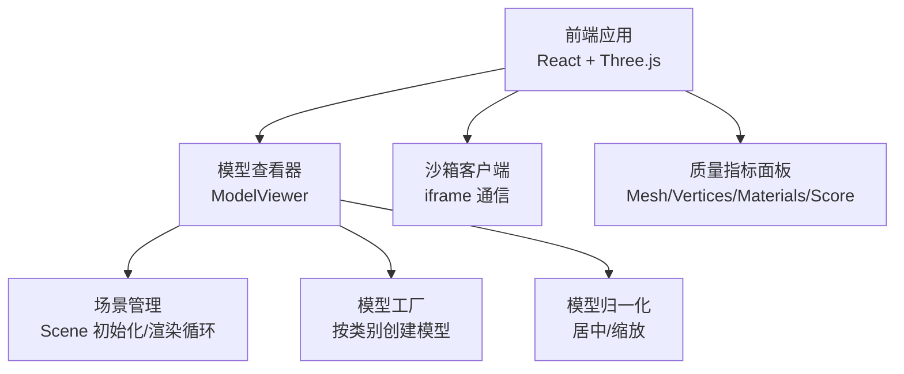
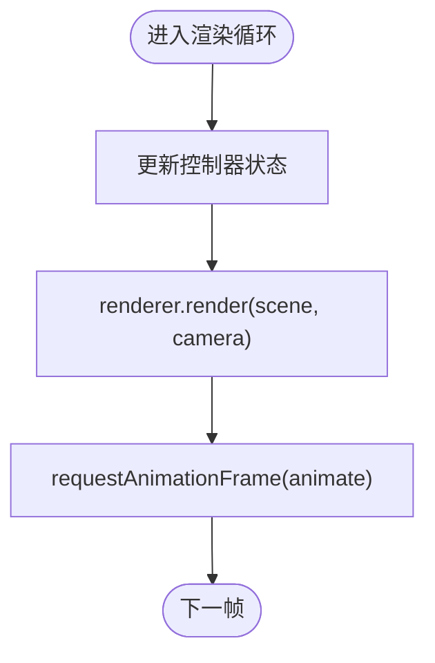
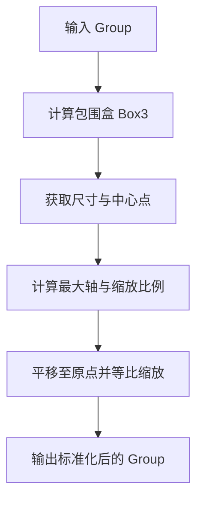
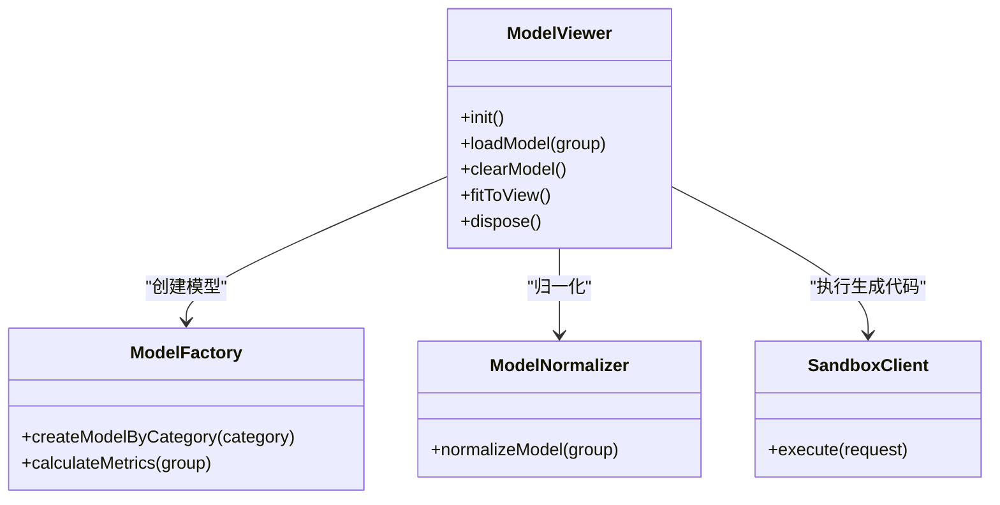

# 渲染性能优化

<cite>
**本文引用的文件**   
- [prd.md](file://prd.md)
- [product-technical-design.md](file://tech/product-technical-design.md)
- [ModelViewer.tsx](file://src/modules/viewer/components/ModelViewer.tsx)
- [modelFactory.ts](file://src/modules/viewer/utils/modelFactory.ts)
- [modelNormalizer.ts](file://src/modules/viewer/utils/modelNormalizer.ts)
- [SandboxClient.ts](file://src/modules/sandbox/SandboxClient.ts)
</cite>

## 目录
1. [引言](#引言)
2. [项目结构](#项目结构)
3. [核心组件](#核心组件)
4. [架构总览](#架构总览)
5. [详细组件分析](#详细组件分析)
6. [依赖关系分析](#依赖关系分析)
7. [性能考量与优化策略](#性能考量与优化策略)
8. [故障排查指南](#故障排查指南)
9. [结论](#结论)
10. [附录：代码示例路径](#附录代码示例路径)

## 引言
本技术文档聚焦于 ApexForge 在 Three.js 渲染管线上的性能优化，覆盖批处理渲染、Draw Call 减少、状态切换优化、渲染目标复用、几何体优化（顶点合并、索引优化、LOD、视锥剔除）、材质与纹理优化（压缩格式、Mipmap、材质共享、PBR 调优）、GPU 侧优化（着色器、Uniform 更新频率、实例化渲染、后处理），并提供可落地的分析与验证方法。文档同时结合仓库中的前端实现与设计文档，给出与现有代码对应的参考路径，便于读者快速定位与落地。

## 项目结构
本项目为 AI 驱动的实时 3D 模型生成平台，前端采用 React + Three.js，后端使用 NestJS，AI 生成服务负责将自然语言转换为可执行的 Three.js 代码或模板参数，并在 iframe 沙箱中执行，最终由浏览器端渲染。



图表来源
- [ModelViewer.tsx:36-118](file://src/modules/viewer/components/ModelViewer.tsx#L36-L118)
- [modelFactory.ts:26-41](file://src/modules/viewer/utils/modelFactory.ts#L26-L41)
- [modelNormalizer.ts:3-14](file://src/modules/viewer/utils/modelNormalizer.ts#L3-L14)
- [StudioPage.tsx:171-185](file://src/modules/studio/pages/StudioPage.tsx#L171-L185)

章节来源
- [prd.md:1-168](file://prd.md#L1-L168)
- [product-technical-design.md:520-573](file://tech/product-technical-design.md#L520-L573)

## 核心组件
- 模型查看器（ModelViewer）：负责 Three.js 场景、相机、渲染器、控制器、灯光、网格与地面的初始化，以及动画循环与资源释放。
- 模型工厂（modelFactory）：按类别构建基础几何体并组合成 Group，提供复杂度统计（meshes、vertices、materials）。
- 模型归一化（modelNormalizer）：计算包围盒，对模型进行居中与等比缩放，保证展示一致性。
- 沙箱客户端（SandboxClient）：定义与 iframe 的交互接口与错误映射，用于安全执行 AI 生成的代码。

章节来源
- [ModelViewer.tsx:36-118](file://src/modules/viewer/components/ModelViewer.tsx#L36-L118)
- [modelFactory.ts:43-59](file://src/modules/viewer/utils/modelFactory.ts#L43-L59)
- [modelNormalizer.ts:3-14](file://src/modules/viewer/utils/modelNormalizer.ts#L3-L14)
- [SandboxClient.ts:14-18](file://src/modules/sandbox/SandboxClient.ts#L14-L18)

## 架构总览
从用户输入到渲染展示的完整链路如下：

```mermaid
sequenceDiagram
participant U as "用户"
participant FE as "前端应用"
participant API as "API 网关"
participant GEN as "生成服务"
participant LLM as "大模型适配器"
participant VAL as "校验器"
participant BOX as "沙箱 iframe"
participant RENDER as "Three.js 渲染器"
U->>FE : 输入描述并点击“生成”
FE->>API : POST /api/v1/generations
API->>GEN : 创建任务
GEN->>LLM : 生成代码或参数
LLM-->>GEN : 返回结果
GEN->>VAL : 安全与复杂度校验
VAL-->>GEN : 报告与评分
GEN-->>API : 返回可渲染结果
API-->>FE : 推送结果
FE->>BOX : 发送执行指令code, params
BOX-->>FE : 返回序列化模型数据
FE->>RENDER : 加载并渲染模型
```

图表来源
- [product-technical-design.md:362-390](file://tech/product-technical-design.md#L362-L390)
- [prd.md:126-140](file://prd.md#L126-L140)

## 详细组件分析

### 渲染管线与 Draw Call 控制
- 渲染器配置：启用抗锯齿、像素比限制、阴影贴图与软阴影类型，合理设置背景色与地面接收阴影，有助于提升视觉质量与性能平衡。
- 渲染循环：使用 requestAnimationFrame 驱动，避免不必要的重绘；页面不可见时建议暂停循环以降低开销。
- 资源释放：卸载旧模型时遍历 Mesh，调用 geometry.dispose() 与 material.dispose()，防止内存泄漏与 GPU 资源占用。



图表来源
- [ModelViewer.tsx:97-101](file://src/modules/viewer/components/ModelViewer.tsx#L97-L101)
- [ModelViewer.tsx:106-117](file://src/modules/viewer/components/ModelViewer.tsx#L106-L117)

章节来源
- [ModelViewer.tsx:48-53](file://src/modules/viewer/components/ModelViewer.tsx#L48-L53)
- [ModelViewer.tsx:97-101](file://src/modules/viewer/components/ModelViewer.tsx#L97-L101)
- [ModelViewer.tsx:106-117](file://src/modules/viewer/components/ModelViewer.tsx#L106-L117)

### 批处理渲染与实例化
- 重复几何体优先使用 InstancedMesh，可将多个相同几何体的绘制合并为单次 Draw Call，显著降低 CPU-GPU 同步开销。
- 对于轮毂螺丝、螺栓等小部件，建议使用实例化渲染；当前示例以独立 Mesh 构建，后续可按需迁移至 InstancedMesh。

章节来源
- [prd.md:155-164](file://prd.md#L155-L164)
- [modelFactory.ts:83-95](file://src/modules/viewer/utils/modelFactory.ts#L83-L95)

### 状态切换优化
- 材质与几何体变更会触发状态切换，应尽量批量修改属性，减少中间态导致的额外状态绑定。
- 通过共享材质对象（同一 color/metalness/roughness 组合）减少材质切换次数，从而降低 Draw Call 数量。

章节来源
- [modelFactory.ts:4-6](file://src/modules/viewer/utils/modelFactory.ts#L4-L6)
- [modelFactory.ts:61-98](file://src/modules/viewer/utils/modelFactory.ts#L61-L98)

### 渲染目标复用
- 单场景多视图可通过共享 Scene/Camera/Renderer 的不同 Viewport 实现，避免重复创建 WebGL 上下文。
- 截图功能可复用当前渲染目标，减少额外渲染通道开销。

章节来源
- [product-technical-design.md:551-561](file://tech/product-technical-design.md#L551-L561)

### 几何体优化
- 顶点合并与索引优化：对相邻且法线一致的平面进行合并可减少顶点数与索引长度，提高缓存命中率。
- LOD 层次细节：根据距离选择不同面数的几何体，远距离使用低精度版本，近距离使用高精度版本。
- 视锥体剔除：Three.js 默认启用 Frustum Culling，确保仅渲染可见区域；配合合理的相机近远裁剪面，避免无效计算。

章节来源
- [prd.md:155-164](file://prd.md#L155-L164)
- [modelFactory.ts:14-24](file://src/modules/viewer/utils/modelFactory.ts#L14-L24)

### 材质与纹理优化
- 纹理压缩格式：优先使用适合 Web 的压缩格式（如 KTX2/Basis、WebP），减少带宽与显存占用。
- Mipmap 生成：为纹理开启 Mipmap，改善缩略与斜视角下的采样质量与性能。
- 材质共享机制：相同外观的材质应复用同一对象，避免重复创建与状态切换。
- PBR 材质调优：合理设置 metalness/roughness，避免过度复杂的混合材质；必要时使用简化材质替代高成本材质。

章节来源
- [modelFactory.ts:4-6](file://src/modules/viewer/utils/modelFactory.ts#L4-L6)
- [prd.md:155-164](file://prd.md#L155-L164)

### GPU 性能优化
- 着色器代码优化：减少分支与复杂运算，尽量使用预计算值；避免每帧动态编译或替换 Shader。
- Uniform 更新频率控制：将低频更新的 Uniform 放入统一缓冲区，减少每帧上传开销。
- 实例化渲染应用：大量重复物体使用 InstancedMesh，降低 CPU 提交与 GPU 状态切换。
- 后处理效果优化：按需启用后处理通道，合并 Pass，避免过多全屏渲染。

章节来源
- [prd.md:155-164](file://prd.md#L155-L164)
- [product-technical-design.md:563-571](file://tech/product-technical-design.md#L563-L571)

### 模型归一化流程


图表来源
- [modelNormalizer.ts:3-14](file://src/modules/viewer/utils/modelNormalizer.ts#L3-L14)

章节来源
- [modelNormalizer.ts:3-14](file://src/modules/viewer/utils/modelNormalizer.ts#L3-L14)

### 模型复杂度统计与可视化
- 统计项：Mesh 数量、顶点总数、材质种类数、综合评分。
- 用途：在 Studio 界面展示质量指标，辅助用户理解模型复杂度与潜在性能影响。

章节来源
- [modelFactory.ts:43-59](file://src/modules/viewer/utils/modelFactory.ts#L43-L59)
- [StudioPage.tsx:171-185](file://src/modules/studio/pages/StudioPage.tsx#L171-L185)

## 依赖关系分析
- ModelViewer 依赖 Three.js 核心库与 OrbitControls，负责场景生命周期管理与渲染循环。
- modelFactory 提供按类别的模型构建能力，并暴露复杂度统计函数。
- modelNormalizer 提供模型归一化工具，确保展示一致性与相机适配。
- SandboxClient 定义与 iframe 的交互契约，错误映射用于统一错误提示。



图表来源
- [ModelViewer.tsx:36-118](file://src/modules/viewer/components/ModelViewer.tsx#L36-L118)
- [modelFactory.ts:26-59](file://src/modules/viewer/utils/modelFactory.ts#L26-L59)
- [modelNormalizer.ts:3-14](file://src/modules/viewer/utils/modelNormalizer.ts#L3-L14)
- [SandboxClient.ts:14-18](file://src/modules/sandbox/SandboxClient.ts#L14-L18)

章节来源
- [ModelViewer.tsx:36-118](file://src/modules/viewer/components/ModelViewer.tsx#L36-L118)
- [modelFactory.ts:26-59](file://src/modules/viewer/utils/modelFactory.ts#L26-L59)
- [modelNormalizer.ts:3-14](file://src/modules/viewer/utils/modelNormalizer.ts#L3-L14)
- [SandboxClient.ts:14-18](file://src/modules/sandbox/SandboxClient.ts#L14-L18)

## 性能考量与优化策略

### 渲染管线优化
- 批处理渲染：将相同材质与几何体的绘制合并，减少状态切换与 Draw Call。
- 状态切换优化：批量修改属性，避免频繁切换材质与几何体。
- 渲染目标复用：多视图共享渲染目标，减少上下文切换。

章节来源
- [prd.md:155-164](file://prd.md#L155-L164)
- [product-technical-design.md:563-571](file://tech/product-technical-design.md#L563-L571)

### 几何体优化
- 顶点合并算法：对共面且法线一致的网格进行合并，减少顶点与索引。
- 索引优化：使用紧凑索引布局，提升缓存命中。
- LOD 实现：根据距离选择不同精度的几何体。
- 视锥剔除：利用 Three.js 默认剔除逻辑，合理设置相机裁剪面。

章节来源
- [prd.md:155-164](file://prd.md#L155-L164)

### 材质与纹理优化
- 纹理压缩：KTX2/Basis/WebP 等格式降低带宽与显存占用。
- Mipmap 策略：为纹理生成多级分辨率，改善采样质量与性能。
- 材质共享：复用相同外观的材质对象，减少状态切换。
- PBR 调优：合理设置金属度与粗糙度，避免过度复杂材质。

章节来源
- [modelFactory.ts:4-6](file://src/modules/viewer/utils/modelFactory.ts#L4-L6)
- [prd.md:155-164](file://prd.md#L155-L164)

### GPU 优化
- 着色器优化：减少分支与复杂运算，使用预计算值。
- Uniform 更新频率：低频更新合并上传，减少每帧开销。
- 实例化渲染：InstancedMesh 批量绘制重复物体。
- 后处理优化：合并 Pass，按需启用。

章节来源
- [prd.md:155-164](file://prd.md#L155-L164)
- [product-technical-design.md:563-571](file://tech/product-technical-design.md#L563-L571)

### 实时分析与验证
- 指标采集：统计 Mesh 数量、顶点总数、材质种类数与评分，用于评估模型复杂度。
- 可视化展示：在 Studio 界面展示质量指标，辅助用户决策。
- 对比实验：在启用/禁用某些优化前后对比帧率与 Draw Call 数量，验证优化效果。

章节来源
- [modelFactory.ts:43-59](file://src/modules/viewer/utils/modelFactory.ts#L43-L59)
- [StudioPage.tsx:171-185](file://src/modules/studio/pages/StudioPage.tsx#L171-L185)

## 故障排查指南
- 沙箱运行时错误：当 iframe 执行失败时，通过错误映射返回统一错误码与提示，便于定位问题。
- 超时与销毁：若执行超时，自动销毁 iframe 并返回错误，避免主线程阻塞。
- 模型为空或过于复杂：提示用户调整描述或使用模板模式，降低复杂度。

章节来源
- [SandboxClient.ts:14-18](file://src/modules/sandbox/SandboxClient.ts#L14-L18)
- [product-technical-design.md:508-517](file://tech/product-technical-design.md#L508-L517)

## 结论
通过对渲染管线、几何体、材质与纹理、GPU 层面的系统性优化，ApexForge 可在浏览器端实现高性能的实时 3D 模型展示。结合复杂度统计与可视化指标，开发者可快速定位瓶颈并验证优化效果。未来可进一步引入 InstancedMesh、LOD、纹理压缩与后处理优化，持续提升用户体验与平台可扩展性。

## 附录：代码示例路径
- 渲染器初始化与阴影配置：[ModelViewer.tsx:48-53](file://src/modules/viewer/components/ModelViewer.tsx#L48-L53)
- 渲染循环与资源释放：[ModelViewer.tsx:97-117](file://src/modules/viewer/components/ModelViewer.tsx#L97-L117)
- 模型工厂与复杂度统计：[modelFactory.ts:26-59](file://src/modules/viewer/utils/modelFactory.ts#L26-L59)
- 模型归一化流程：[modelNormalizer.ts:3-14](file://src/modules/viewer/utils/modelNormalizer.ts#L3-L14)
- 沙箱客户端接口与错误映射：[SandboxClient.ts:14-18](file://src/modules/sandbox/SandboxClient.ts#L14-L18)
- 前端性能策略与 SceneManager 设计：[product-technical-design.md:551-571](file://tech/product-technical-design.md#L551-L571)
- 整体生成时序与沙箱执行流程：[product-technical-design.md:362-390](file://tech/product-technical-design.md#L362-L390)