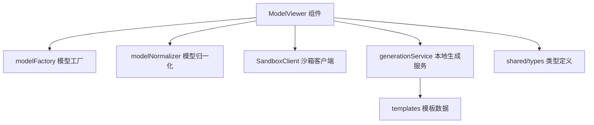
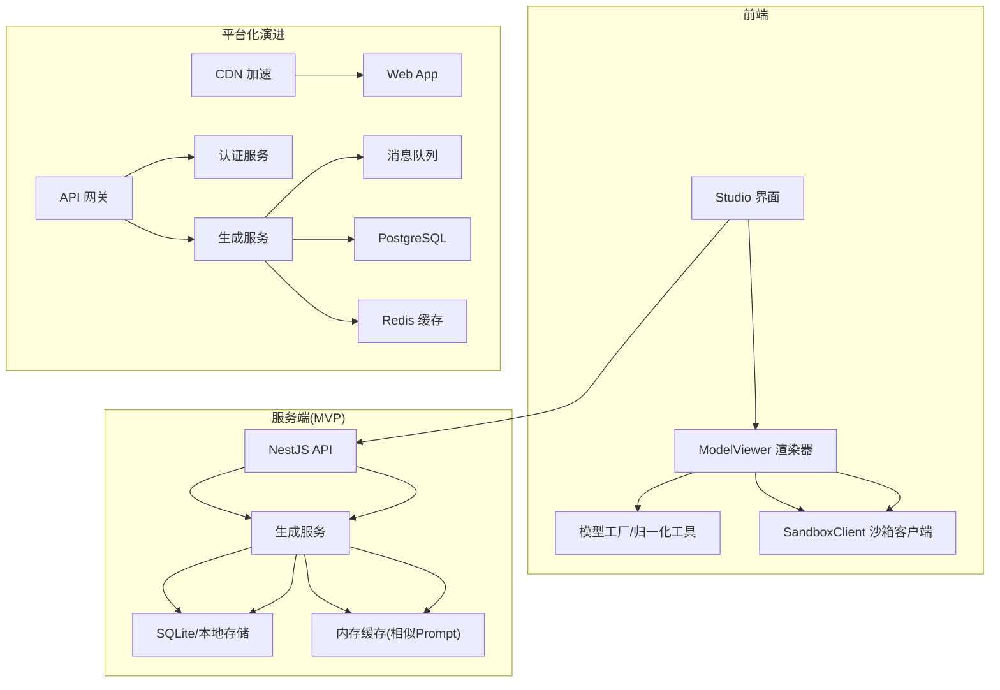
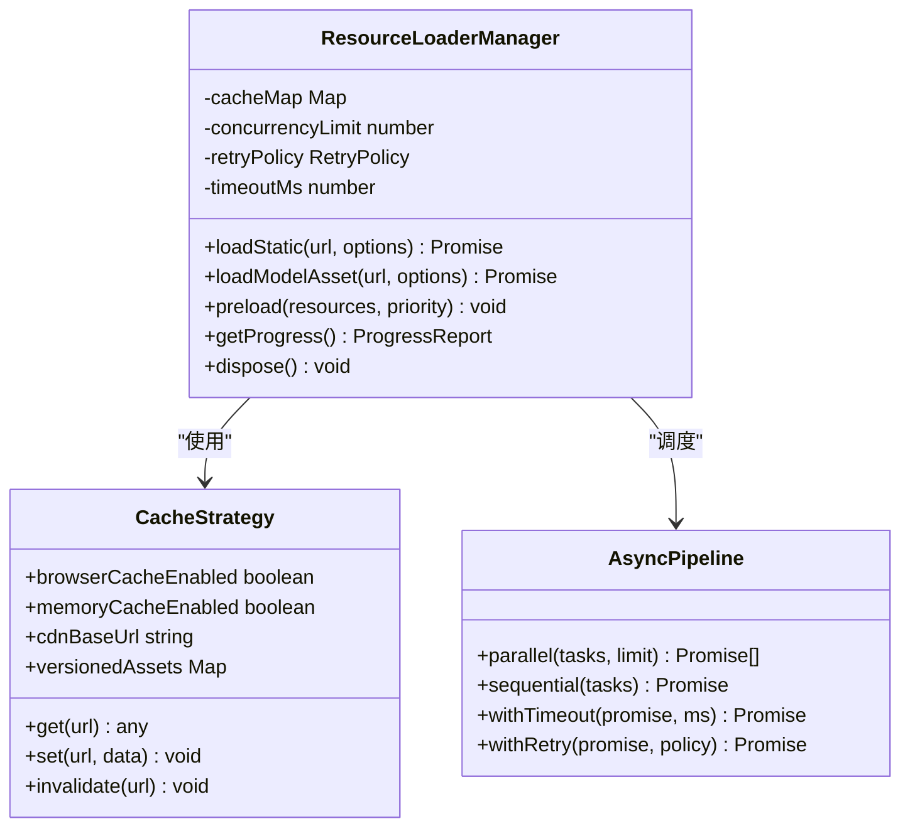
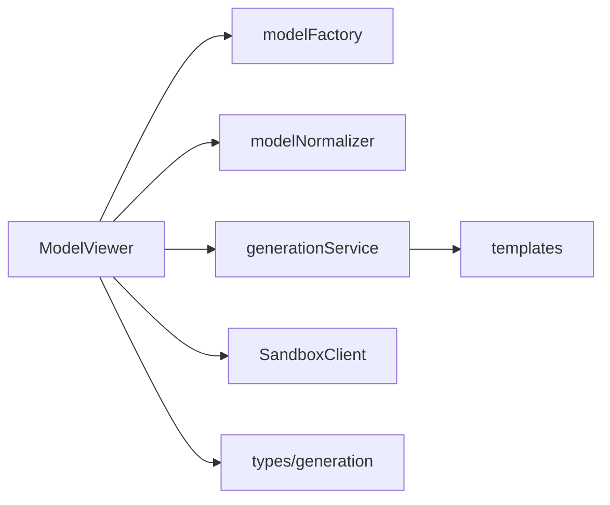
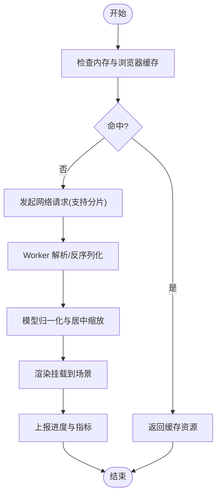

# 资源加载优化

<cite>
**本文引用的文件**
- [src/modules/viewer/components/ModelViewer.tsx](file://src/modules/viewer/components/ModelViewer.tsx)
- [src/modules/viewer/utils/modelNormalizer.ts](file://src/modules/viewer/utils/modelNormalizer.ts)
- [src/modules/viewer/utils/modelFactory.ts](file://src/modules/viewer/utils/modelFactory.ts)
- [src/modules/sandbox/SandboxClient.ts](file://src/modules/sandbox/SandboxClient.ts)
- [src/modules/studio/services/generationService.ts](file://src/modules/studio/services/generationService.ts)
- [src/shared/types/generation.ts](file://src/shared/types/generation.ts)
- [prd.md](file://prd.md)
- [tech/product-technical-design.md](file://tech/product-technical-design.md)
</cite>

## 目录
1. [引言](#引言)
2. [项目结构](#项目结构)
3. [核心组件](#核心组件)
4. [架构总览](#架构总览)
5. [详细组件分析](#详细组件分析)
6. [依赖关系分析](#依赖关系分析)
7. [性能考量](#性能考量)
8. [故障排查指南](#故障排查指南)
9. [结论](#结论)
10. [附录](#附录)

## 引言
本技术文档聚焦于 ApexForge Three.js 前端的“资源加载优化”，围绕懒加载、预加载、依赖管理、进度反馈、缓存策略（浏览器/内存/CDN/版本化）、异步并行与分片、错误重试与超时控制，以及大型资源处理（模型分割、纹理图集、二进制格式、流式解析）等主题进行系统化说明。同时结合仓库现有实现，给出可落地的资源加载管理器设计与监控集成方案，并提供具体代码片段路径以便快速定位实现细节。

## 项目结构
本项目采用模块化前端组织方式，Three.js 渲染与沙箱执行位于 viewer 与 sandbox 模块，生成流程由 studio 服务编排，类型定义集中于 shared/types。资源加载相关的关键位置包括：
- 渲染入口与场景生命周期：ModelViewer 组件负责初始化 Three.js 场景、灯光、控制器、网格与地面，并在卸载时释放资源。
- 模型工厂与归一化：modelFactory 提供按类别创建模型的函数；modelNormalizer 对模型进行居中与缩放。
- 沙箱客户端：SandboxClient 预留执行接口，用于在隔离环境中运行 AI 生成的 Three.js 代码并返回序列化结果。
- 本地生成服务：generationService 模拟生成任务，返回模板信息与指标，便于后续接入真实后端与进度上报。
- 类型定义：GenerationResult、GenerationProgress 等定义了状态机与指标字段，为进度反馈与监控提供基础。

图表来源
- [src/modules/viewer/components/ModelViewer.tsx:1-171](file://src/modules/viewer/components/ModelViewer.tsx#L1-L171)
- [src/modules/viewer/utils/modelFactory.ts:140-191](file://src/modules/viewer/utils/modelFactory.ts#L140-L191)
- [src/modules/viewer/utils/modelNormalizer.ts:1-14](file://src/modules/viewer/utils/modelNormalizer.ts#L1-L14)
- [src/modules/sandbox/SandboxClient.ts:1-19](file://src/modules/sandbox/SandboxClient.ts#L1-L19)
- [src/modules/studio/services/generationService.ts:1-30](file://src/modules/studio/services/generationService.ts#L1-L30)
- [src/shared/types/generation.ts:1-29](file://src/shared/types/generation.ts#L1-L29)

章节来源
- [src/modules/viewer/components/ModelViewer.tsx:1-171](file://src/modules/viewer/components/ModelViewer.tsx#L1-L171)
- [src/modules/viewer/utils/modelNormalizer.ts:1-14](file://src/modules/viewer/utils/modelNormalizer.ts#L1-L14)
- [src/modules/viewer/utils/modelFactory.ts:140-191](file://src/modules/viewer/utils/modelFactory.ts#L140-L191)
- [src/modules/sandbox/SandboxClient.ts:1-19](file://src/modules/sandbox/SandboxClient.ts#L1-L19)
- [src/modules/studio/services/generationService.ts:1-30](file://src/modules/studio/services/generationService.ts#L1-L30)
- [src/shared/types/generation.ts:1-29](file://src/shared/types/generation.ts#L1-L29)

## 核心组件
- ModelViewer 组件
  - 职责：初始化 Three.js 场景、相机、渲染器、控制器、灯光、网格与地面；监听窗口尺寸变化；维护动画循环；在切换模型或组件卸载时正确释放几何体、材质与纹理。
  - 资源释放：通过遍历对象树调用 dispose 方法，避免内存泄漏。
  - 参考路径：[src/modules/viewer/components/ModelViewer.tsx:14-22](file://src/modules/viewer/components/ModelViewer.tsx#L14-L22)、[src/modules/viewer/components/ModelViewer.tsx:106-118](file://src/modules/viewer/components/ModelViewer.tsx#L106-L118)
- modelNormalizer 工具
  - 职责：计算包围盒，将模型中心移至原点并按最大轴缩放至目标尺寸，确保不同模型在场景中一致展示。
  - 参考路径：[src/modules/viewer/utils/modelNormalizer.ts:1-14](file://src/modules/viewer/utils/modelNormalizer.ts#L1-L14)
- modelFactory 工具
  - 职责：按类别构建程序化模型（车辆、家具、信标等），复用基础几何与材质构造，便于扩展新类别。
  - 参考路径：[src/modules/viewer/utils/modelFactory.ts:140-191](file://src/modules/viewer/utils/modelFactory.ts#L140-L191)
- SandboxClient 沙箱客户端
  - 职责：封装在 iframe 中执行 AI 生成代码的接口，当前为占位实现，抛出映射后的错误码，便于后续接入真实沙箱运行时。
  - 参考路径：[src/modules/sandbox/SandboxClient.ts:1-19](file://src/modules/sandbox/SandboxClient.ts#L1-L19)
- generationService 本地生成服务
  - 职责：根据分类选择模板，模拟延迟后返回 GenerationResult，包含 traceId、指标与解释文本，便于后续接入 SSE/WebSocket 推送进度。
  - 参考路径：[src/modules/studio/services/generationService.ts:1-30](file://src/modules/studio/services/generationService.ts#L1-L30)
- 类型定义
  - 职责：统一 GenerationStatus、ModelCategory、GenerationResult、GenerationProgress 等类型，支撑进度反馈与监控。
  - 参考路径：[src/shared/types/generation.ts:1-29](file://src/shared/types/generation.ts#L1-L29)

章节来源
- [src/modules/viewer/components/ModelViewer.tsx:14-22](file://src/modules/viewer/components/ModelViewer.tsx#L14-L22)
- [src/modules/viewer/components/ModelViewer.tsx:106-118](file://src/modules/viewer/components/ModelViewer.tsx#L106-L118)
- [src/modules/viewer/utils/modelNormalizer.ts:1-14](file://src/modules/viewer/utils/modelNormalizer.ts#L1-L14)
- [src/modules/viewer/utils/modelFactory.ts:140-191](file://src/modules/viewer/utils/modelFactory.ts#L140-L191)
- [src/modules/sandbox/SandboxClient.ts:1-19](file://src/modules/sandbox/SandboxClient.ts#L1-L19)
- [src/modules/studio/services/generationService.ts:1-30](file://src/modules/studio/services/generationService.ts#L1-L30)
- [src/shared/types/generation.ts:1-29](file://src/shared/types/generation.ts#L1-L29)

## 架构总览
从资源加载视角，系统分为“静态资源与运行时”、“模型资产与序列化数据”、“沙箱执行与反序列化”三层。MVP 阶段建议采用隐藏 iframe 作为沙箱，仅暴露 Three.js 运行时与安全 API；平台化阶段引入 CDN、Redis 缓存、消息队列与多供应商 LLM 适配。

图表来源
- [tech/product-technical-design.md:34-100](file://tech/product-technical-design.md#L34-L100)
- [prd.md:155-168](file://prd.md#L155-L168)

章节来源
- [tech/product-technical-design.md:34-100](file://tech/product-technical-design.md#L34-L100)
- [prd.md:155-168](file://prd.md#L155-L168)

## 详细组件分析

### 资源加载管理器设计（ResourceLoaderManager）
该管理器统一负责三类资源的加载与缓存：
- 静态资源：Three.js 运行时、沙箱页面、字体、纹理、音频等
- 模型资产：程序化模型 JSON、glTF/GLB、纹理图集
- 运行时依赖：模板脚本、参数 Schema、校验规则

主要能力
- 懒加载：按需动态 import 或 fetch，降低首屏体积
- 预加载：基于优先级与依赖图提前拉取关键资源
- 依赖管理：解析资源间的依赖关系，保证加载顺序
- 进度反馈：聚合下载进度与解析进度，上报到 UI
- 缓存策略：浏览器缓存 + 内存缓存 + CDN 命中判断
- 并发与分片：限制并发数，支持大文件分片下载与断点续传
- 错误处理：重试、退避、超时控制与降级回退
- 版本化：资源指纹与版本号，配合 CDN 强缓存与增量更新

图表来源
- [src/modules/viewer/components/ModelViewer.tsx:1-171](file://src/modules/viewer/components/ModelViewer.tsx#L1-L171)
- [src/modules/sandbox/SandboxClient.ts:1-19](file://src/modules/sandbox/SandboxClient.ts#L1-L19)
- [src/modules/studio/services/generationService.ts:1-30](file://src/modules/studio/services/generationService.ts#L1-L30)
- [src/shared/types/generation.ts:1-29](file://src/shared/types/generation.ts#L1-L29)

章节来源
- [src/modules/viewer/components/ModelViewer.tsx:1-171](file://src/modules/viewer/components/ModelViewer.tsx#L1-L171)
- [src/modules/sandbox/SandboxClient.ts:1-19](file://src/modules/sandbox/SandboxClient.ts#L1-L19)
- [src/modules/studio/services/generationService.ts:1-30](file://src/modules/studio/services/generationService.ts#L1-L30)
- [src/shared/types/generation.ts:1-29](file://src/shared/types/generation.ts#L1-L29)

### 懒加载与预加载机制
- 懒加载
  - 动态导入 Three.js 与沙箱 runtime，仅在首次需要时加载，减少初始包体。
  - 模型按需加载：当用户切换类别或触发生成时才请求对应模型 JSON。
  - 参考路径：[src/modules/viewer/components/ModelViewer.tsx:120-135](file://src/modules/viewer/components/ModelViewer.tsx#L120-L135)
- 预加载
  - 基于用户行为预测（如热门模板）提前拉取常用资源，放入内存缓存。
  - 优先级队列：高优先级（场景必需）先加载，低优先级（可选装饰）延后。
  - 参考路径：[src/modules/studio/services/generationService.ts:8-29](file://src/modules/studio/services/generationService.ts#L8-L29)

章节来源
- [src/modules/viewer/components/ModelViewer.tsx:120-135](file://src/modules/viewer/components/ModelViewer.tsx#L120-L135)
- [src/modules/studio/services/generationService.ts:8-29](file://src/modules/studio/services/generationService.ts#L8-L29)

### 资源依赖管理与加载顺序
- 依赖图解析：模板脚本依赖参数 Schema 与校验规则，模型 JSON 依赖纹理图集与材质预设。
- 拓扑排序：依据依赖关系确定加载顺序，避免未就绪引用。
- 参考路径：[src/modules/templates/templateData.ts:1-54](file://src/modules/templates/templateData.ts#L1-L54)

章节来源
- [src/modules/templates/templateData.ts:1-54](file://src/modules/templates/templateData.ts#L1-L54)

### 加载进度反馈
- 进度数据结构：使用 GenerationProgress 描述状态、标签与百分比。
- 事件上报：SSE/WebSocket 推送 queued、generating、validating、renderable、failed 等事件。
- 参考路径：
  - [src/shared/types/generation.ts:24-29](file://src/shared/types/generation.ts#L24-L29)
  - [tech/product-technical-design.md:734-756](file://tech/product-technical-design.md#L734-L756)

章节来源
- [src/shared/types/generation.ts:24-29](file://src/shared/types/generation.ts#L24-L29)
- [tech/product-technical-design.md:734-756](file://tech/product-technical-design.md#L734-L756)

### 缓存机制优化
- 浏览器缓存策略
  - 静态资源启用强缓存与协商缓存，配合 CDN 与 Gzip/Brotli 压缩。
  - 参考路径：[prd.md:164-165](file://prd.md#L164-L165)
- 内存缓存管理
  - 内存中缓存已加载的模型 JSON、纹理与材质，避免重复解析与分配。
  - 参考路径：[src/modules/viewer/components/ModelViewer.tsx:106-118](file://src/modules/viewer/components/ModelViewer.tsx#L106-L118)
- CDN 加速配置
  - 将 Three.js 运行时、沙箱页面、模板脚本与模型资产部署至 CDN，提升全球访问速度。
  - 参考路径：[tech/product-technical-design.md:82-100](file://tech/product-technical-design.md#L82-L100)
- 版本化资源管理
  - 资源文件名带哈希指纹，变更即换名，配合 CDN 强缓存与增量更新。
  - 参考路径：[tech/product-technical-design.md:108-120](file://tech/product-technical-design.md#L108-L120)

章节来源
- [prd.md:164-165](file://prd.md#L164-L165)
- [src/modules/viewer/components/ModelViewer.tsx:106-118](file://src/modules/viewer/components/ModelViewer.tsx#L106-L118)
- [tech/product-technical-design.md:82-100](file://tech/product-technical-design.md#L82-L100)
- [tech/product-technical-design.md:108-120](file://tech/product-technical-design.md#L108-L120)

### 异步加载优化技术
- Web Worker 并行加载
  - 将模型 JSON 解析与反序列化放入 Worker，主线程专注渲染挂载，避免阻塞交互。
  - 参考路径：[prd.md:158-160](file://prd.md#L158-L160)
- 资源分片下载
  - 大模型或纹理图集按固定大小分片，支持断点续传与并发合并。
- 错误重试机制
  - 指数退避重试，失败次数上限与熔断保护，避免雪崩。
- 超时控制策略
  - 单次请求设置超时阈值，超时自动取消并重试或降级。
  - 参考路径：[src/modules/sandbox/SandboxClient.ts:1-19](file://src/modules/sandbox/SandboxClient.ts#L1-L19)

章节来源
- [prd.md:158-160](file://prd.md#L158-L160)
- [src/modules/sandbox/SandboxClient.ts:1-19](file://src/modules/sandbox/SandboxClient.ts#L1-L19)

### 大型资源处理方案
- 模型文件分割
  - 将复杂模型拆分为多个子组或 LOD 层级，按需加载与切换。
- 纹理图集生成
  - 合并小纹理为图集，减少 Draw Call 与纹理切换开销。
- 二进制格式优化
  - 优先使用 glTF/GLB 与 Draco 压缩，减小体积并提升加载速度。
- 流式解析技术
  - 边下载边解析，逐步构建场景，缩短首帧时间。
- 参考路径：
  - [tech/product-technical-design.md:155-168](file://tech/product-technical-design.md#L155-L168)
  - [src/modules/viewer/utils/modelFactory.ts:140-191](file://src/modules/viewer/utils/modelFactory.ts#L140-L191)

章节来源
- [tech/product-technical-design.md:155-168](file://tech/product-technical-design.md#L155-L168)
- [src/modules/viewer/utils/modelFactory.ts:140-191](file://src/modules/viewer/utils/modelFactory.ts#L140-L191)

### 资源加载管理器实现示例（代码片段路径）
- 懒加载与资源释放
  - 参考路径：[src/modules/viewer/components/ModelViewer.tsx:106-118](file://src/modules/viewer/components/ModelViewer.tsx#L106-L118)
- 模型归一化与居中缩放
  - 参考路径：[src/modules/viewer/utils/modelNormalizer.ts:1-14](file://src/modules/viewer/utils/modelNormalizer.ts#L1-L14)
- 按类别创建模型
  - 参考路径：[src/modules/viewer/utils/modelFactory.ts:140-191](file://src/modules/viewer/utils/modelFactory.ts#L140-L191)
- 沙箱执行与错误映射
  - 参考路径：[src/modules/sandbox/SandboxClient.ts:1-19](file://src/modules/sandbox/SandboxClient.ts#L1-L19)
- 本地生成与指标上报
  - 参考路径：[src/modules/studio/services/generationService.ts:1-30](file://src/modules/studio/services/generationService.ts#L1-L30)

章节来源
- [src/modules/viewer/components/ModelViewer.tsx:106-118](file://src/modules/viewer/components/ModelViewer.tsx#L106-L118)
- [src/modules/viewer/utils/modelNormalizer.ts:1-14](file://src/modules/viewer/utils/modelNormalizer.ts#L1-L14)
- [src/modules/viewer/utils/modelFactory.ts:140-191](file://src/modules/viewer/utils/modelFactory.ts#L140-L191)
- [src/modules/sandbox/SandboxClient.ts:1-19](file://src/modules/sandbox/SandboxClient.ts#L1-L19)
- [src/modules/studio/services/generationService.ts:1-30](file://src/modules/studio/services/generationService.ts#L1-L30)

### 加载性能监控集成（代码片段路径）
- 指标字段与状态机
  - 参考路径：[src/shared/types/generation.ts:1-29](file://src/shared/types/generation.ts#L1-L29)
- 生成链路事件与 SSE
  - 参考路径：[tech/product-technical-design.md:734-756](file://tech/product-technical-design.md#L734-L756)
- 前端性能策略（Worker 反序列化、InstancedMesh、requestAnimationFrame）
  - 参考路径：[tech/product-technical-design.md:563-571](file://tech/product-technical-design.md#L563-L571)

章节来源
- [src/shared/types/generation.ts:1-29](file://src/shared/types/generation.ts#L1-L29)
- [tech/product-technical-design.md:734-756](file://tech/product-technical-design.md#L734-L756)
- [tech/product-technical-design.md:563-571](file://tech/product-technical-design.md#L563-L571)

## 依赖关系分析
- 组件耦合
  - ModelViewer 依赖 modelFactory 与 modelNormalizer，间接依赖 templates 数据。
  - SandboxClient 与 generationService 解耦，前者负责执行，后者负责编排与结果返回。
- 外部依赖
  - Three.js 运行时与示例控件（OrbitControls）。
  - 沙箱 iframe 与 postMessage 通信。
- 潜在循环依赖
  - 当前结构清晰，未见循环导入；建议在资源管理器中抽象依赖解析以避免未来耦合。

图表来源
- [src/modules/viewer/components/ModelViewer.tsx:1-171](file://src/modules/viewer/components/ModelViewer.tsx#L1-L171)
- [src/modules/viewer/utils/modelFactory.ts:140-191](file://src/modules/viewer/utils/modelFactory.ts#L140-L191)
- [src/modules/viewer/utils/modelNormalizer.ts:1-14](file://src/modules/viewer/utils/modelNormalizer.ts#L1-L14)
- [src/modules/studio/services/generationService.ts:1-30](file://src/modules/studio/services/generationService.ts#L1-L30)
- [src/modules/templates/templateData.ts:1-54](file://src/modules/templates/templateData.ts#L1-L54)
- [src/modules/sandbox/SandboxClient.ts:1-19](file://src/modules/sandbox/SandboxClient.ts#L1-L19)
- [src/shared/types/generation.ts:1-29](file://src/shared/types/generation.ts#L1-L29)

章节来源
- [src/modules/viewer/components/ModelViewer.tsx:1-171](file://src/modules/viewer/components/ModelViewer.tsx#L1-L171)
- [src/modules/viewer/utils/modelFactory.ts:140-191](file://src/modules/viewer/utils/modelFactory.ts#L140-L191)
- [src/modules/viewer/utils/modelNormalizer.ts:1-14](file://src/modules/viewer/utils/modelNormalizer.ts#L1-L14)
- [src/modules/studio/services/generationService.ts:1-30](file://src/modules/studio/services/generationService.ts#L1-L30)
- [src/modules/templates/templateData.ts:1-54](file://src/modules/templates/templateData.ts#L1-L54)
- [src/modules/sandbox/SandboxClient.ts:1-19](file://src/modules/sandbox/SandboxClient.ts#L1-L19)
- [src/shared/types/generation.ts:1-29](file://src/shared/types/generation.ts#L1-L29)

## 性能考量
- 前端渲染
  - 使用 requestAnimationFrame 控制渲染循环，页面不可见时暂停。
  - 对重复几何体使用 InstancedMesh 批量渲染。
  - 模型反序列化放入 Worker，避免主线程阻塞。
- 网络与缓存
  - 静态资源 CDN 缓存，Gzip/Brotli 压缩，代码增量更新。
  - 相似 Prompt 结果在服务端缓存，直接返回。
- 复杂度控制
  - 统计模型面数、顶点数与材质数量，超过阈值提示降级或切换模板模式。
- 参考路径：
  - [tech/product-technical-design.md:563-571](file://tech/product-technical-design.md#L563-L571)
  - [prd.md:155-168](file://prd.md#L155-L168)

章节来源
- [tech/product-technical-design.md:563-571](file://tech/product-technical-design.md#L563-L571)
- [prd.md:155-168](file://prd.md#L155-L168)

## 故障排查指南
- 常见错误分类
  - 沙箱执行超时、运行时报错、模型 JSON 非法、模型过于复杂、未生成有效对象。
  - 参考路径：[tech/product-technical-design.md:508-517](file://tech/product-technical-design.md#L508-L517)
- 错误映射与上报
  - SandboxClient 抛出映射后的错误码，便于上层统一处理与用户提示。
  - 参考路径：[src/modules/sandbox/SandboxClient.ts:1-19](file://src/modules/sandbox/SandboxClient.ts#L1-L19)
- 资源释放检查
  - 确认组件卸载时是否正确 dispose 几何体、材质与纹理，避免内存泄漏。
  - 参考路径：[src/modules/viewer/components/ModelViewer.tsx:106-118](file://src/modules/viewer/components/ModelViewer.tsx#L106-L118)

章节来源
- [tech/product-technical-design.md:508-517](file://tech/product-technical-design.md#L508-L517)
- [src/modules/sandbox/SandboxClient.ts:1-19](file://src/modules/sandbox/SandboxClient.ts#L1-L19)
- [src/modules/viewer/components/ModelViewer.tsx:106-118](file://src/modules/viewer/components/ModelViewer.tsx#L106-L118)

## 结论
通过统一的资源加载管理器、完善的缓存策略、异步并行与分片下载、错误重试与超时控制，以及大型资源的分割与流式解析，ApexForge 可在保证安全与稳定的前提下显著提升 Three.js 资源加载性能与用户体验。结合现有的 ModelViewer、SandboxClient 与 generationService 实现，可快速落地上述优化方案，并通过 GenerationProgress 与 SSE 事件实现端到端的进度反馈与监控。

## 附录
- 关键流程图（概念性）
