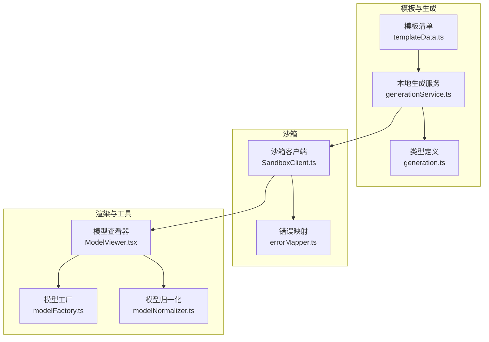
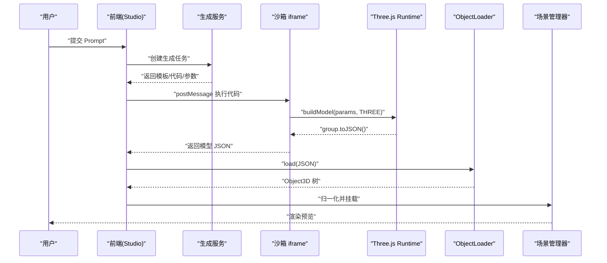
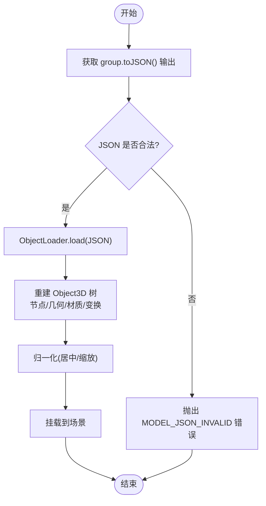
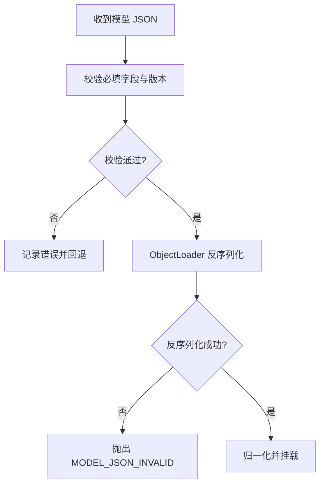
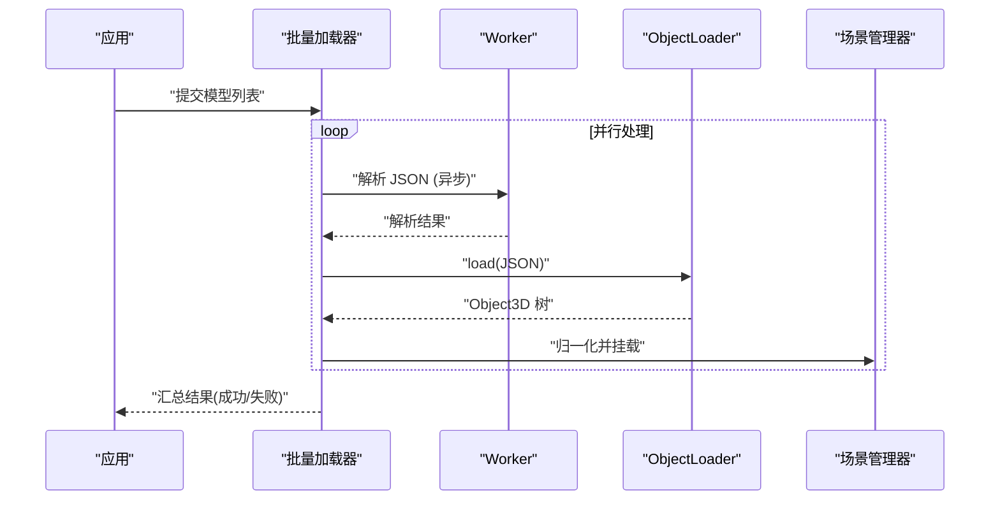
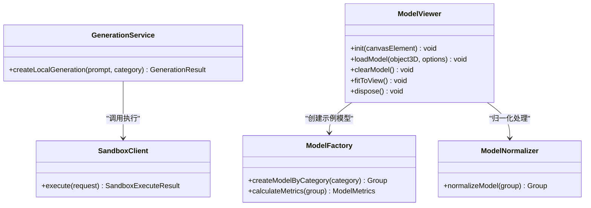
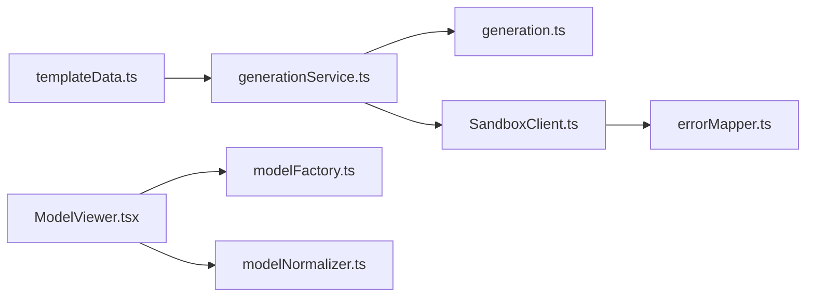

# ObjectLoader 集成

<cite>
**本文引用的文件**   
- [product-technical-design.md](file://tech/product-technical-design.md)
- [prd.md](file://prd.md)
- [SandboxClient.ts](file://src/modules/sandbox/SandboxClient.ts)
- [errorMapper.ts](file://src/modules/sandbox/errorMapper.ts)
- [generationService.ts](file://src/modules/studio/services/generationService.ts)
- [templateData.ts](file://src/modules/templates/templateData.ts)
- [ModelViewer.tsx](file://src/modules/viewer/components/ModelViewer.tsx)
- [modelFactory.ts](file://src/modules/viewer/utils/modelFactory.ts)
- [modelNormalizer.ts](file://src/modules/viewer/utils/modelNormalizer.ts)
- [generation.ts](file://src/shared/types/generation.ts)
- [validators.ts](file://src/shared/utils/validators.ts)
</cite>

## 目录
1. [引言](#引言)
2. [项目结构](#项目结构)
3. [核心组件](#核心组件)
4. [架构总览](#架构总览)
5. [详细组件分析](#详细组件分析)
6. [依赖关系分析](#依赖关系分析)
7. [性能考量](#性能考量)
8. [故障排查指南](#故障排查指南)
9. [结论](#结论)
10. [附录](#附录)

## 引言
本技术文档聚焦于 ApexForge 中基于 Three.js ObjectLoader 的模型加载与反序列化集成方案，覆盖 JSON 数据格式要求、反序列化流程、Object3D 树重建机制，以及自定义 Loader 扩展（材质、纹理、几何体）的设计与实现要点。同时给出数据验证与错误处理策略、批量加载与异步处理的最佳实践，并结合仓库现有代码与产品技术设计进行落地说明。

## 项目结构
本项目采用模块化前端架构，围绕“模板优先 + 沙箱执行 + 渲染预览”的核心路径组织：
- 模板与生成编排：模板清单、本地生成模拟、状态与指标类型定义
- 沙箱客户端：统一执行接口与错误映射
- 渲染器与工具：场景初始化、模型工厂、归一化与度量统计
- 设计与规范：整体架构、iframe 沙箱执行流程、错误分类等

图表来源
- [templateData.ts:1-54](file://src/modules/templates/templateData.ts#L1-L54)
- [generationService.ts:1-29](file://src/modules/studio/services/generationService.ts#L1-L29)
- [generation.ts:1-29](file://src/shared/types/generation.ts#L1-L29)
- [SandboxClient.ts:1-19](file://src/modules/sandbox/SandboxClient.ts#L1-L19)
- [errorMapper.ts:1-11](file://src/modules/sandbox/errorMapper.ts#L1-L11)
- [ModelViewer.tsx:1-170](file://src/modules/viewer/components/ModelViewer.tsx#L1-L170)
- [modelFactory.ts:1-191](file://src/modules/viewer/utils/modelFactory.ts#L1-L191)
- [modelNormalizer.ts:1-14](file://src/modules/viewer/utils/modelNormalizer.ts#L1-L14)

章节来源
- [templateData.ts:1-54](file://src/modules/templates/templateData.ts#L1-L54)
- [generationService.ts:1-29](file://src/modules/studio/services/generationService.ts#L1-L29)
- [generation.ts:1-29](file://src/shared/types/generation.ts#L1-L29)
- [SandboxClient.ts:1-19](file://src/modules/sandbox/SandboxClient.ts#L1-L19)
- [errorMapper.ts:1-11](file://src/modules/sandbox/errorMapper.ts#L1-L11)
- [ModelViewer.tsx:1-170](file://src/modules/viewer/components/ModelViewer.tsx#L1-L170)
- [modelFactory.ts:1-191](file://src/modules/viewer/utils/modelFactory.ts#L1-L191)
- [modelNormalizer.ts:1-14](file://src/modules/viewer/utils/modelNormalizer.ts#L1-L14)

## 核心组件
- 模板清单与选择：提供类别到模板的映射与默认提示词，支撑“模板优先”的生成路径。
- 本地生成服务：根据类别选择模板并返回可渲染结果（含 traceId、指标等）。
- 沙箱客户端：封装执行请求与结果，统一错误映射。
- 模型查看器：初始化 Three.js 场景、灯光、控制器，管理模型挂载与资源释放。
- 模型工厂：按类别构建示例模型，用于演示与回归测试。
- 模型归一化：计算边界盒、居中与缩放，确保展示一致性。
- 类型与校验：统一的生成状态、指标、类别定义；输入长度与空值校验。

章节来源
- [templateData.ts:1-54](file://src/modules/templates/templateData.ts#L1-L54)
- [generationService.ts:1-29](file://src/modules/studio/services/generationService.ts#L1-L29)
- [SandboxClient.ts:1-19](file://src/modules/sandbox/SandboxClient.ts#L1-L19)
- [errorMapper.ts:1-11](file://src/modules/sandbox/errorMapper.ts#L1-L11)
- [ModelViewer.tsx:1-170](file://src/modules/viewer/components/ModelViewer.tsx#L1-L170)
- [modelFactory.ts:1-191](file://src/modules/viewer/utils/modelFactory.ts#L1-L191)
- [modelNormalizer.ts:1-14](file://src/modules/viewer/utils/modelNormalizer.ts#L1-L14)
- [generation.ts:1-29](file://src/shared/types/generation.ts#L1-L29)
- [validators.ts:1-14](file://src/shared/utils/validators.ts#L1-L14)

## 架构总览
从用户输入到模型渲染的整体链路如下：
- 用户在 Studio 输入描述，触发本地或远程生成任务
- 服务端/本地服务选择模板或生成代码，返回结构化结果
- 主线程通过 iframe 沙箱执行代码，得到 group.toJSON() 的 JSON
- 主线程使用 THREE.ObjectLoader 反序列化为 Object3D 树
- 归一化后挂载至场景，完成渲染

图表来源
- [prd.md:105-117](file://prd.md#L105-L117)
- [product-technical-design.md:498-506](file://tech/product-technical-design.md#L498-L506)

## 详细组件分析

### 反序列化与 Object3D 树重建
- 数据源：由沙箱内执行生成的 group.toJSON() 输出，遵循 Three.js 标准序列化格式。
- 反序列化入口：主线程调用 THREE.ObjectLoader.load(JSON)，将 JSON 解析为完整的 Object3D 树。
- 树重建机制：
  - 节点层级：JSON 中的 children 数组对应 Object3D 的层级关系
  - 几何体：geometry 字段包含顶点、法线、UV、索引等属性
  - 材质：material 字段包含颜色、贴图引用、物理属性等
  - 变换：position、rotation、scale 等属性在反序列化时应用
- 后续处理：对根 Group 做边界盒计算、居中与缩放，再添加到场景中

图表来源
- [product-technical-design.md:498-506](file://tech/product-technical-design.md#L498-L506)
- [modelNormalizer.ts:1-14](file://src/modules/viewer/utils/modelNormalizer.ts#L1-L14)

章节来源
- [product-technical-design.md:498-506](file://tech/product-technical-design.md#L498-L506)
- [modelNormalizer.ts:1-14](file://src/modules/viewer/utils/modelNormalizer.ts#L1-L14)

### 自定义 Loader 扩展方法
为适配业务需求，可在 ObjectLoader 基础上扩展三类加载器：

- 材质加载器
  - 目标：支持自定义材质类型或额外属性（如 PBR 参数、发光强度、各向异性）
  - 实现要点：
    - 继承 THREE.MaterialLoader 或重写 ObjectLoader 的材质解析回调
    - 在 parseMaterial 阶段识别自定义 type 字段，实例化对应材质类
    - 将自定义属性映射到材质实例，保留兼容性
  - 参考位置：ObjectLoader 材质解析逻辑（概念性，未直接映射到具体文件）

- 纹理加载器
  - 目标：支持多来源纹理（本地缓存、CDN、Blob URL），并提供失败回退
  - 实现要点：
    - 继承 THREE.TextureLoader 或注入 loaderManager
    - 在 loadTexture 前检查缓存，命中则直接复用
    - 失败时降级为纯色材质或占位纹理
  - 参考位置：ObjectLoader 纹理加载逻辑（概念性，未直接映射到具体文件）

- 几何体加载器
  - 目标：支持程序化几何体的增量更新与 LOD 切换
  - 实现要点：
    - 在 parseGeometry 阶段识别自定义 geometryType
    - 根据参数动态构建几何体，避免重复分配内存
    - 对复杂几何体启用合并或 InstancedMesh 优化
  - 参考位置：ObjectLoader 几何体解析逻辑（概念性，未直接映射到具体文件）

注意：以上扩展为通用设计建议，便于在后续版本中按需接入。当前仓库以标准 ObjectLoader 为主。

### 数据验证与错误处理策略
- 输入校验
  - Prompt 长度与空值校验，防止无效请求进入生成链路
- 沙箱执行错误
  - 超时、运行时错误、返回 JSON 非法三类错误码，统一映射为用户可读消息
- 模型复杂度与有效性
  - 若模型为空或过于复杂，提示降级或重试
- 版本兼容性与缺失字段
  - 建议在 JSON 中携带 version 字段，ObjectLoader 解析前进行最小版本检查
  - 对缺失字段提供默认值或回退策略，保证向后兼容

图表来源
- [errorMapper.ts:1-11](file://src/modules/sandbox/errorMapper.ts#L1-L11)
- [product-technical-design.md:508-517](file://tech/product-technical-design.md#L508-L517)
- [validators.ts:1-14](file://src/shared/utils/validators.ts#L1-L14)

章节来源
- [errorMapper.ts:1-11](file://src/modules/sandbox/errorMapper.ts#L1-L11)
- [product-technical-design.md:508-517](file://tech/product-technical-design.md#L508-L517)
- [validators.ts:1-14](file://src/shared/utils/validators.ts#L1-L14)

### 批量加载与异步处理最佳实践
- 批量加载
  - 使用 Promise.allSettled 并行加载多个模型 JSON，分别捕获成功与失败
  - 对每个模型独立归一化与挂载，避免单点失败影响整体
- 异步处理
  - 将 JSON 解析放入 Worker，主线程仅负责渲染挂载
  - 使用 requestAnimationFrame 控制渲染循环，页面不可见时暂停
- 错误恢复
  - 对单个模型失败进行隔离与重试（指数退避）
  - 失败模型显示占位或降级材质，保持 UI 可用

[此图为概念流程图，不直接映射到具体源码文件]

### 代码级可视化：对象关系与职责

图表来源
- [SandboxClient.ts:1-19](file://src/modules/sandbox/SandboxClient.ts#L1-L19)
- [generationService.ts:1-29](file://src/modules/studio/services/generationService.ts#L1-L29)
- [ModelViewer.tsx:1-170](file://src/modules/viewer/components/ModelViewer.tsx#L1-L170)
- [modelFactory.ts:1-191](file://src/modules/viewer/utils/modelFactory.ts#L1-L191)
- [modelNormalizer.ts:1-14](file://src/modules/viewer/utils/modelNormalizer.ts#L1-L14)

章节来源
- [SandboxClient.ts:1-19](file://src/modules/sandbox/SandboxClient.ts#L1-L19)
- [generationService.ts:1-29](file://src/modules/studio/services/generationService.ts#L1-L29)
- [ModelViewer.tsx:1-170](file://src/modules/viewer/components/ModelViewer.tsx#L1-L170)
- [modelFactory.ts:1-191](file://src/modules/viewer/utils/modelFactory.ts#L1-L191)
- [modelNormalizer.ts:1-14](file://src/modules/viewer/utils/modelNormalizer.ts#L1-L14)

## 依赖关系分析
- 模块耦合
  - 生成服务依赖模板清单与类型定义
  - 沙箱客户端依赖错误映射
  - 模型查看器依赖模型工厂与归一化工具
- 外部依赖
  - Three.js 核心库与 ObjectLoader
  - OrbitControls 用于交互控制
- 潜在风险
  - 若 ObjectLoader 升级导致 JSON 字段变更，需增加版本兼容层
  - 大量纹理与几何体可能导致内存压力，需配合 dispose 与缓存策略

图表来源
- [templateData.ts:1-54](file://src/modules/templates/templateData.ts#L1-L54)
- [generationService.ts:1-29](file://src/modules/studio/services/generationService.ts#L1-L29)
- [generation.ts:1-29](file://src/shared/types/generation.ts#L1-L29)
- [SandboxClient.ts:1-19](file://src/modules/sandbox/SandboxClient.ts#L1-L19)
- [errorMapper.ts:1-11](file://src/modules/sandbox/errorMapper.ts#L1-L11)
- [ModelViewer.tsx:1-170](file://src/modules/viewer/components/ModelViewer.tsx#L1-L170)
- [modelFactory.ts:1-191](file://src/modules/viewer/utils/modelFactory.ts#L1-L191)
- [modelNormalizer.ts:1-14](file://src/modules/viewer/utils/modelNormalizer.ts#L1-L14)

章节来源
- [templateData.ts:1-54](file://src/modules/templates/templateData.ts#L1-L54)
- [generationService.ts:1-29](file://src/modules/studio/services/generationService.ts#L1-L29)
- [generation.ts:1-29](file://src/shared/types/generation.ts#L1-L29)
- [SandboxClient.ts:1-19](file://src/modules/sandbox/SandboxClient.ts#L1-L19)
- [errorMapper.ts:1-11](file://src/modules/sandbox/errorMapper.ts#L1-L11)
- [ModelViewer.tsx:1-170](file://src/modules/viewer/components/ModelViewer.tsx#L1-L170)
- [modelFactory.ts:1-191](file://src/modules/viewer/utils/modelFactory.ts#L1-L191)
- [modelNormalizer.ts:1-14](file://src/modules/viewer/utils/modelNormalizer.ts#L1-L14)

## 性能考量
- 反序列化与渲染分离：将 JSON 解析放入 Worker，主线程专注渲染
- 资源释放：卸载旧模型时遍历 dispose geometry、material、texture
- 实例化与 LOD：对重复元素使用 InstancedMesh，远距离使用低面数模型
- 渲染循环：使用 requestAnimationFrame，页面不可见时暂停
- 复杂度阈值：加载前统计 meshes、vertices、materials，超过阈值提示降级

章节来源
- [prd.md:155-164](file://prd.md#L155-L164)
- [modelFactory.ts:43-59](file://src/modules/viewer/utils/modelFactory.ts#L43-L59)
- [ModelViewer.tsx:106-118](file://src/modules/viewer/components/ModelViewer.tsx#L106-L118)

## 故障排查指南
- 常见错误码与提示
  - SANDBOX_TIMEOUT：执行超时，已安全终止
  - SANDBOX_RUNTIME_ERROR：运行时报错，可重试或降低复杂度
  - MODEL_JSON_INVALID：数据结构无效，无法加载到场景
- 定位步骤
  - 检查 iframe 执行日志与 postMessage 内容
  - 验证 group.toJSON() 输出的结构与字段完整性
  - 确认 ObjectLoader 版本与 JSON schema 的兼容性
- 恢复策略
  - 对失败模型进行隔离与重试（指数退避）
  - 使用占位材质或简化模型回退，保持 UI 可用

章节来源
- [errorMapper.ts:1-11](file://src/modules/sandbox/errorMapper.ts#L1-L11)
- [product-technical-design.md:508-517](file://tech/product-technical-design.md#L508-L517)

## 结论
ApexForge 的 ObjectLoader 集成以“模板优先 + 沙箱执行 + 标准化 JSON”为核心，结合归一化与度量统计，实现了稳定可控的 3D 模型生成与预览。通过扩展材质、纹理、几何体加载器，可进一步增强平台能力；配合批量加载、异步处理与完善的错误恢复策略，可满足企业级场景的性能与稳定性要求。

## 附录
- 关键流程参考
  - iframe 配置与执行流程：详见产品设计文档
  - 错误分类与用户提示：详见错误映射与产品设计文档
  - 模型归一化与度量：详见工具函数与工厂实现

章节来源
- [prd.md:105-117](file://prd.md#L105-L117)
- [product-technical-design.md:490-517](file://tech/product-technical-design.md#L490-L517)
- [modelNormalizer.ts:1-14](file://src/modules/viewer/utils/modelNormalizer.ts#L1-L14)
- [modelFactory.ts:43-59](file://src/modules/viewer/utils/modelFactory.ts#L43-L59)