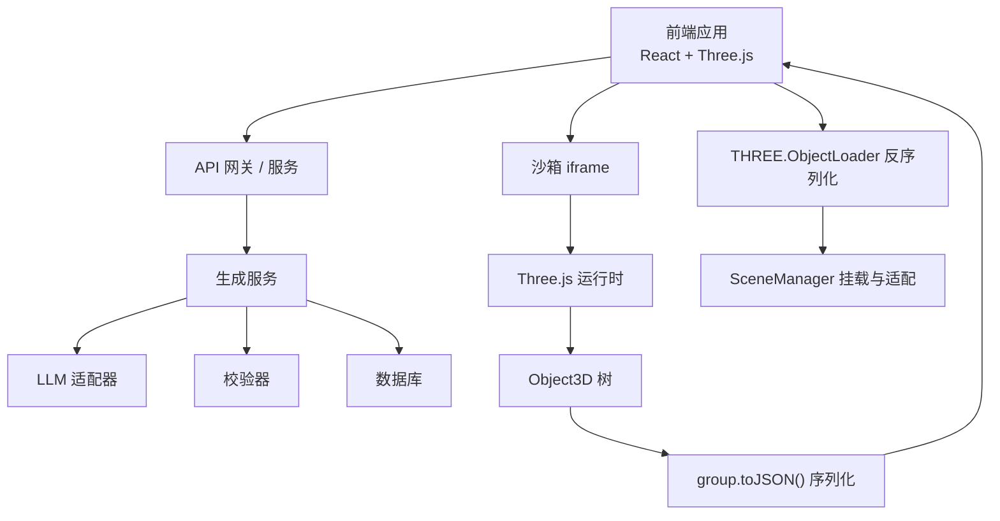
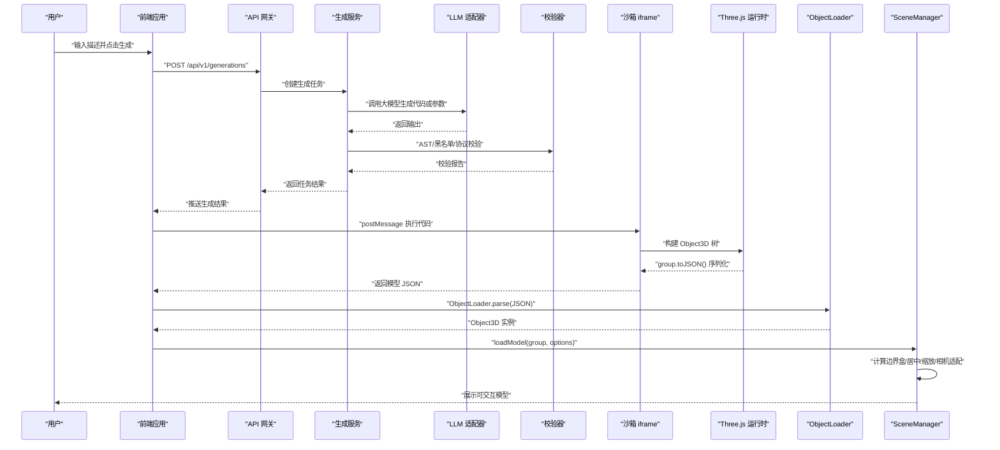
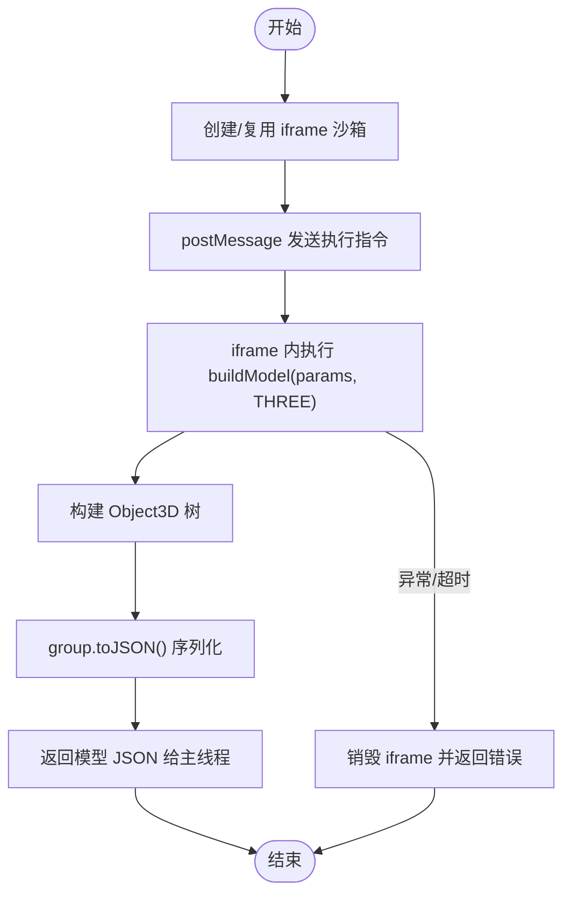
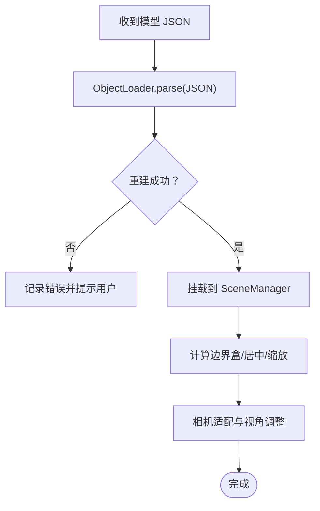
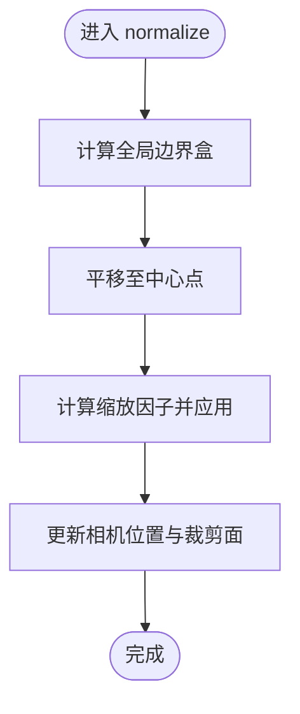
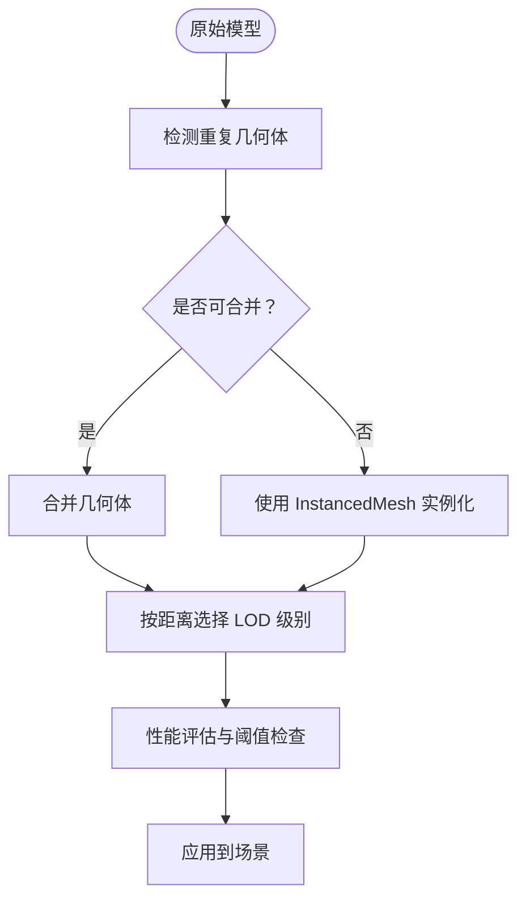
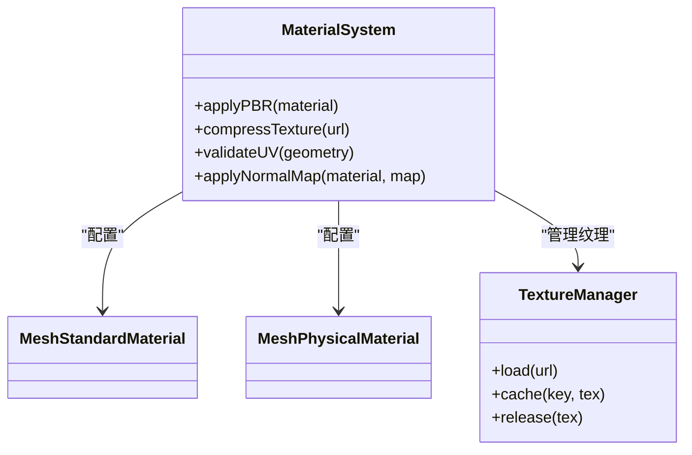
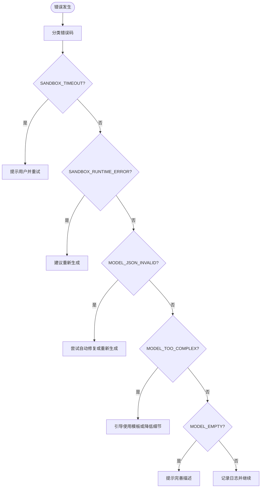
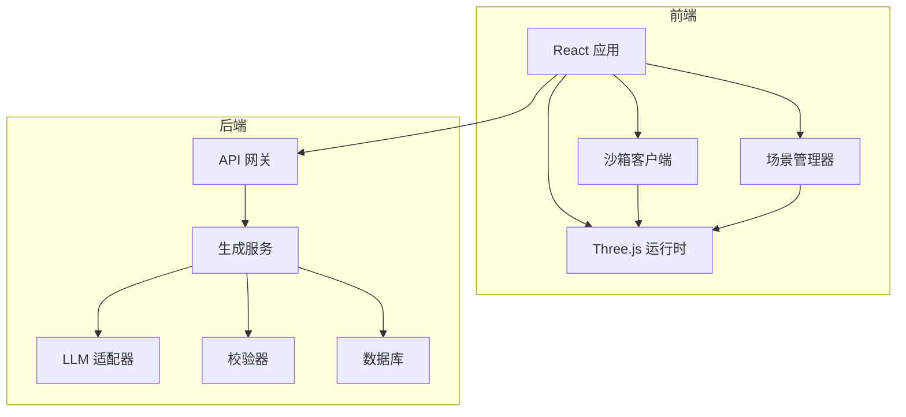

# 模型加载与渲染

<cite>
**本文引用的文件**   
- [prd.md](file://prd.md)
- [product-technical-design.md](file://tech/product-technical-design.md)
</cite>

## 目录
1. [引言](#引言)
2. [项目结构](#项目结构)
3. [核心组件](#核心组件)
4. [架构总览](#架构总览)
5. [详细组件分析](#详细组件分析)
6. [依赖关系分析](#依赖关系分析)
7. [性能考量](#性能考量)
8. [故障排查指南](#故障排查指南)
9. [结论](#结论)
10. [附录](#附录)

## 引言
本技术文档聚焦于 ApexForge 的“模型加载与渲染”子系统，围绕从沙箱执行结果到 Three.js ObjectLoader 反序列化的完整链路展开。内容涵盖 JSON 数据格式验证、Object3D 树重建、材质与纹理映射、模型居中与边界盒计算、自动缩放适配与视角调整、几何体优化策略（重复几何体合并、InstancedMesh、LOD）、PBR 材质配置、纹理压缩与 UV/法线贴图处理，并给出错误处理、性能监控与内存管理的最佳实践路径。

## 项目结构
当前仓库包含产品需求与技术设计文档，用于定义系统目标、架构、模块职责与关键流程。前端采用 React + Three.js，后端为 NestJS；AI 生成代码在 iframe 沙箱中执行，返回序列化模型数据后由主线程使用 ObjectLoader 反序列化并挂载至场景。

图表来源
- [prd.md:105-117](file://prd.md#L105-L117)
- [product-technical-design.md:472-518](file://tech/product-technical-design.md#L472-L518)

章节来源
- [prd.md:1-168](file://prd.md#L1-L168)
- [product-technical-design.md:1-1149](file://tech/product-technical-design.md#L1-L1149)

## 核心组件
- 沙箱客户端（SandboxClient）：负责创建与管理 iframe 沙箱、发送执行指令、接收序列化结果、超时控制与错误映射。
- 场景管理器（SceneManager）：初始化场景、灯光、控制器；提供 loadModel、clearModel、fitToView、dispose 等能力。
- 模型归一化器（ModelNormalizer）：计算边界盒、居中、自动缩放、复杂度统计。
- 资源释放器（ResourceDisposer）：遍历并释放 geometry、material、texture，避免内存泄漏。
- 质量评分器（QualityScorer）：基于面数、顶点数、材质数量、可渲染性等指标进行评分。
- 模板与参数系统（Template & Params）：通过模板匹配与参数化渲染降低生成成本与风险。

章节来源
- [prd.md:59-71](file://prd.md#L59-L71)
- [prd.md:105-117](file://prd.md#L105-L117)
- [product-technical-design.md:539-571](file://tech/product-technical-design.md#L539-L571)
- [product-technical-design.md:807-841](file://tech/product-technical-design.md#L807-L841)

## 架构总览
下图展示一次完整的“生成—沙箱—反序列化—渲染”端到端流程，包括服务端生成、安全校验、前端沙箱执行与 ObjectLoader 反序列化。

图表来源
- [prd.md:126-140](file://prd.md#L126-L140)
- [product-technical-design.md:359-391](file://tech/product-technical-design.md#L359-L391)
- [product-technical-design.md:472-518](file://tech/product-technical-design.md#L472-L518)

## 详细组件分析

### 沙箱执行与 JSON 序列化
- 执行入口：主线程向 iframe 发送执行指令，包含 executionId、code、params、timeoutMs。
- 执行环境：iframe 仅暴露 THREE、安全构建函数与 params，禁止网络与 DOM 访问。
- 序列化：成功后调用 group.toJSON()，返回结构化 JSON，不允许回传函数或 DOM 引用。
- 超时销毁：若未在规定时间内返回，销毁 iframe 并返回错误码。

图表来源
- [product-technical-design.md:498-518](file://tech/product-technical-design.md#L498-L518)

章节来源
- [prd.md:105-117](file://prd.md#L105-L117)
- [product-technical-design.md:472-518](file://tech/product-technical-design.md#L472-L518)

### ObjectLoader 反序列化与 Object3D 树重建
- 反序列化：主线程使用 THREE.ObjectLoader 解析 JSON，重建几何体、材质、纹理与层级关系。
- 树结构：按 JSON 中的 children 数组重建父子关系，恢复 position、rotation、scale 等变换。
- 材质与纹理：根据 JSON 中的 material 与 texture 字段重建 PBR 材质与贴图引用。
- 错误处理：对非法 JSON、缺失必要字段、纹理 URL 不可达等情况进行捕获与提示。

图表来源
- [prd.md:105-117](file://prd.md#L105-L117)
- [product-technical-design.md:498-518](file://tech/product-technical-design.md#L498-L518)

章节来源
- [prd.md:105-117](file://prd.md#L105-L117)
- [product-technical-design.md:472-518](file://tech/product-technical-design.md#L472-L518)

### 模型居中算法、边界盒计算、自动缩放与视角调整
- 边界盒：遍历所有 Mesh/Group，计算世界坐标下的包围盒。
- 居中：将包围盒中心平移至原点，保持比例不变。
- 自动缩放：根据目标视口尺寸与模型最大维度计算缩放因子，使模型充满可视区域。
- 视角调整：更新相机位置与近/远裁剪面，确保模型完整可见且透视合理。

图表来源
- [product-technical-design.md:498-518](file://tech/product-technical-design.md#L498-L518)

章节来源
- [product-technical-design.md:498-518](file://tech/product-technical-design.md#L498-L518)

### 几何体优化策略
- 重复几何体合并：识别相同 Geometry 并合并绘制调用，减少 draw call。
- InstancedMesh：对重复元素（如轮毂螺丝、铆钉）使用实例化渲染，提升批量绘制性能。
- LOD 层次细节：根据距离切换不同面数的模型版本，远距离使用低面数模型。
- 复杂度阈值：加载前统计 Mesh/顶点/材质数量，超过阈值提示降级或拆分。

图表来源
- [prd.md:155-165](file://prd.md#L155-L165)
- [product-technical-design.md:563-571](file://tech/product-technical-design.md#L563-L571)

章节来源
- [prd.md:155-165](file://prd.md#L155-L165)
- [product-technical-design.md:563-571](file://tech/product-technical-design.md#L563-L571)

### 材质系统与 PBR 配置
- 材质类型：限定使用 MeshStandardMaterial 或 MeshPhysicalMaterial，确保 PBR 一致性。
- 纹理压缩：优先使用压缩纹理格式（如 KTX2/Basis），减少带宽与显存占用。
- UV 映射：确保 UV 坐标范围合理，避免拉伸与接缝问题。
- 法线贴图：支持切线空间法线贴图，增强表面细节表现。
- 反射与粗糙度：合理设置 metalness、roughness、clearcoat 等属性以匹配真实材质。

图表来源
- [prd.md:85-93](file://prd.md#L85-L93)
- [product-technical-design.md:563-571](file://tech/product-technical-design.md#L563-L571)

章节来源
- [prd.md:85-93](file://prd.md#L85-L93)
- [product-technical-design.md:563-571](file://tech/product-technical-design.md#L563-L571)

### 错误处理、性能监控与内存管理最佳实践
- 错误分类与提示：
  - SANDBOX_TIMEOUT：执行超时，终止渲染并提示用户重试或简化模型。
  - SANDBOX_RUNTIME_ERROR：运行时报错，建议重新生成。
  - MODEL_JSON_INVALID：返回结构非法，触发自动修复或重新生成。
  - MODEL_TOO_COMPLEX：复杂度超限，引导使用模板模式或降低细节。
  - MODEL_EMPTY：未生成有效对象，提示补充描述。
- 性能监控：
  - 记录 traceId、耗时、状态、失败原因、复杂度统计。
  - 对 LLM 延迟、校验失败率、沙箱超时率设置告警规则。
- 内存管理：
  - 旧模型释放时必须遍历 dispose geometry、material、texture。
  - 大模型解析移至 Worker，主线程只做渲染挂载。
  - 页面不可见时暂停渲染循环，减少 CPU/GPU 占用。

图表来源
- [product-technical-design.md:508-518](file://tech/product-technical-design.md#L508-L518)
- [product-technical-design.md:868-908](file://tech/product-technical-design.md#L868-L908)
- [product-technical-design.md:563-571](file://tech/product-technical-design.md#L563-L571)

章节来源
- [product-technical-design.md:508-518](file://tech/product-technical-design.md#L508-L518)
- [product-technical-design.md:868-908](file://tech/product-technical-design.md#L868-L908)
- [product-technical-design.md:563-571](file://tech/product-technical-design.md#L563-L571)

## 依赖关系分析
- 前端依赖：React 组件、Three.js 渲染引擎、沙箱通信、ObjectLoader、SceneManager。
- 后端依赖：NestJS 服务、LLM 适配器、校验器、数据库、缓存与队列。
- 外部集成：CDN 静态资源、对象存储（截图/导出）、消息队列（异步任务）。

图表来源
- [product-technical-design.md:34-101](file://tech/product-technical-design.md#L34-L101)
- [product-technical-design.md:574-630](file://tech/product-technical-design.md#L574-L630)

章节来源
- [product-technical-design.md:34-101](file://tech/product-technical-design.md#L34-L101)
- [product-technical-design.md:574-630](file://tech/product-technical-design.md#L574-L630)

## 性能考量
- 前端优化：
  - 动态加载 Three.js 与沙箱 runtime，降低首屏体积。
  - 模型 JSON 解析放入 Worker，主线程专注渲染。
  - 使用 InstancedMesh 与 LOD 降低绘制压力。
  - 释放旧模型资源，避免内存泄漏。
- 后端优化：
  - 相似 Prompt 缓存与模板模式跳过 LLM 调用。
  - 生成任务异步化，避免长连接占用。
  - 热门模板与 Schema 缓存至 Redis。
- 数据库优化：
  - 针对常用查询字段建立索引。
  - 大字段迁移至对象存储，仅保存 URL 与摘要。
  - 历史任务按时间归档。

章节来源
- [prd.md:155-165](file://prd.md#L155-L165)
- [product-technical-design.md:933-958](file://tech/product-technical-design.md#L933-L958)

## 故障排查指南
- 常见问题定位：
  - 沙箱超时：检查模型复杂度与执行时间，必要时启用模板模式或降低细节。
  - 运行时报错：查看 AST 校验报告与黑名单命中项，修正生成代码。
  - JSON 无效：确认 group.toJSON() 输出结构与必要字段完整性。
  - 纹理不可达：校验纹理 URL 与跨域策略，优先使用压缩纹理。
- 监控与告警：
  - 记录 traceId、耗时、状态、失败原因与复杂度统计。
  - 对 LLM 延迟、校验失败率、沙箱超时率设置阈值告警。
- 内存泄漏排查：
  - 确认 dispose 调用覆盖 geometry、material、texture。
  - 页面不可见时暂停渲染循环，减少资源占用。

章节来源
- [product-technical-design.md:508-518](file://tech/product-technical-design.md#L508-L518)
- [product-technical-design.md:868-908](file://tech/product-technical-design.md#L868-L908)
- [product-technical-design.md:563-571](file://tech/product-technical-design.md#L563-L571)

## 结论
ApexForge 的模型加载与渲染体系以“代码即模型”为核心范式，结合 iframe 沙箱隔离与 ObjectLoader 反序列化，实现了高安全性与高性能的实时 3D 展示。通过严格的 JSON 验证、稳健的 Object3D 树重建、完善的材质与纹理处理、以及全面的居中/缩放/视角适配与几何体优化策略，平台能够在保证稳定性的同时提供灵活的创作体验。配合质量评分、监控告警与内存管理最佳实践，系统具备企业级可扩展性与可维护性。

## 附录
- 参考接口与事件：
  - 创建生成任务、查询任务、保存资产、模板渲染等接口定义与 SSE 事件类型详见设计文档。
- 模板与参数：
  - 模板分层、参数 Schema、默认值与校验规则有助于提高生成稳定性与效率。

章节来源
- [product-technical-design.md:632-757](file://tech/product-technical-design.md#L632-L757)
- [product-technical-design.md:760-804](file://tech/product-technical-design.md#L760-L804)