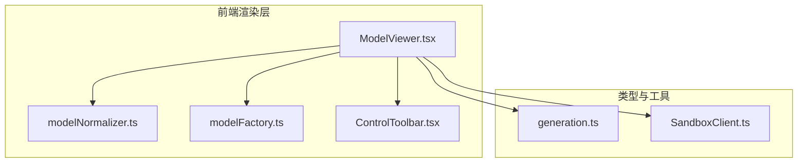
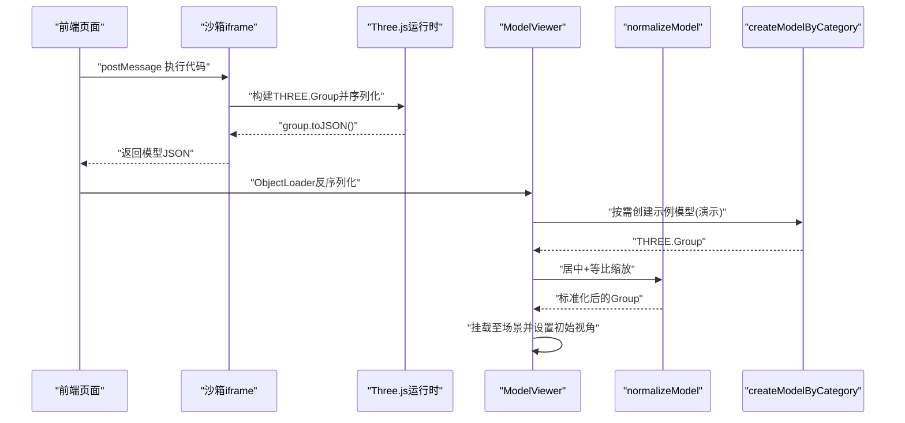
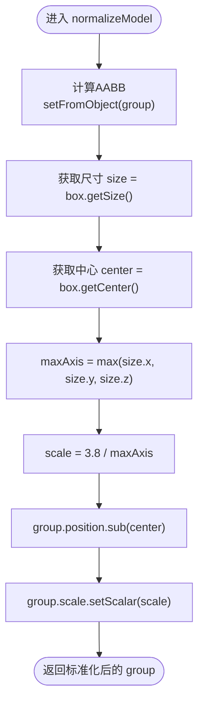
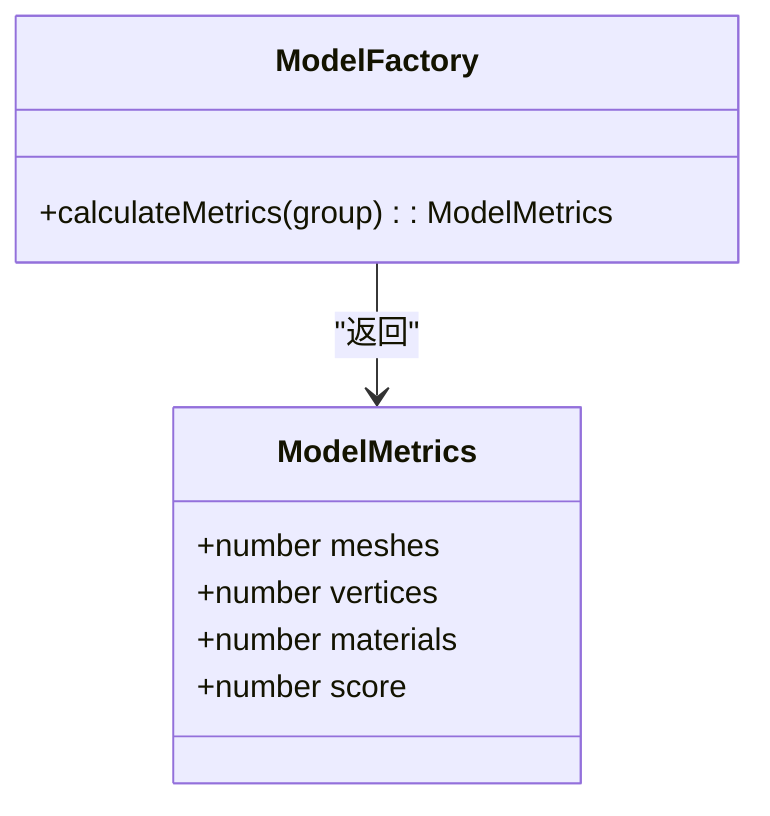
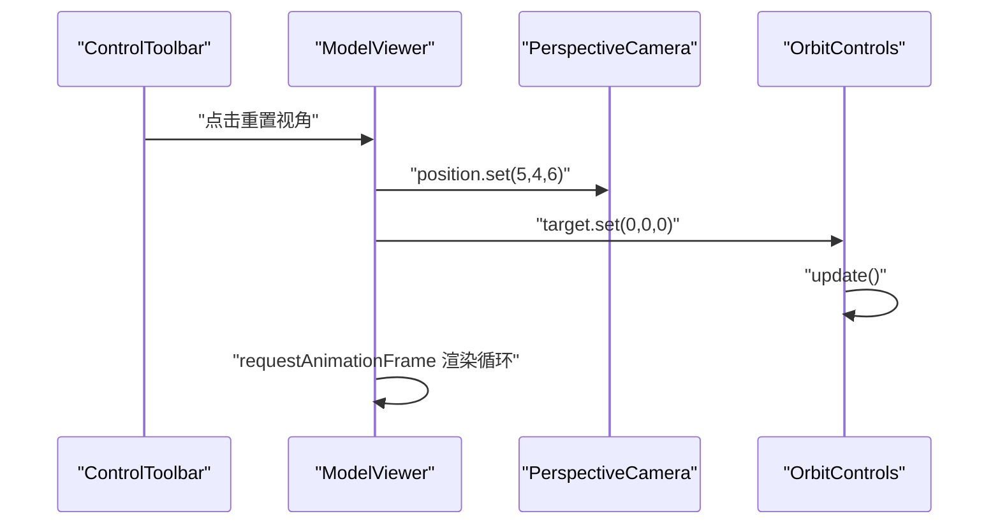
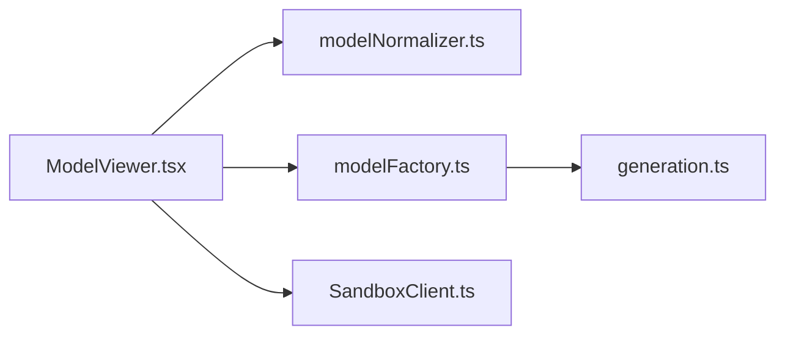

# 模型标准化处理

<cite>
**本文引用的文件**
- [src/modules/viewer/utils/modelNormalizer.ts](file://src/modules/viewer/utils/modelNormalizer.ts)
- [src/modules/viewer/components/ModelViewer.tsx](file://src/modules/viewer/components/ModelViewer.tsx)
- [src/modules/viewer/utils/modelFactory.ts](file://src/modules/viewer/utils/modelFactory.ts)
- [src/shared/types/generation.ts](file://src/shared/types/generation.ts)
- [src/modules/sandbox/SandboxClient.ts](file://src/modules/sandbox/SandboxClient.ts)
- [tech/product-technical-design.md](file://tech/product-technical-design.md)
- [prd.md](file://prd.md)
</cite>

## 目录
1. [引言](#引言)
2. [项目结构](#项目结构)
3. [核心组件](#核心组件)
4. [架构总览](#架构总览)
5. [详细组件分析](#详细组件分析)
6. [依赖关系分析](#依赖关系分析)
7. [性能考量](#性能考量)
8. [故障排查指南](#故障排查指南)
9. [结论](#结论)
10. [附录](#附录)

## 引言
本技术文档聚焦于 ApexForge 的“模型标准化处理”能力，围绕以下目标展开：
- 模型居中算法：边界盒计算、质心定位、坐标变换矩阵应用
- 自动缩放适配：尺寸归一化、比例保持、视图框适配
- 模型复杂度统计：顶点数量、面片数量、材质类型分析
- 视角自动调整策略：相机位置计算、观察角度优化、视锥体裁剪
- 具体流程与优化技巧：以不同模型类别为例，展示标准化处理路径与性能优化建议

## 项目结构
与模型标准化直接相关的代码位于前端渲染模块中，主要包含：
- 模型工厂：按类别生成示例模型（用于演示标准化流程）
- 模型归一化工具：实现居中与等比缩放
- 模型查看器：场景初始化、相机控制、加载与重置视角
- 类型定义：模型指标数据结构
- 沙箱客户端：执行 AI 生成的 Three.js 代码并返回序列化结果（占位实现）

图表来源
- [src/modules/viewer/components/ModelViewer.tsx:1-171](file://src/modules/viewer/components/ModelViewer.tsx#L1-L171)
- [src/modules/viewer/utils/modelNormalizer.ts:1-15](file://src/modules/viewer/utils/modelNormalizer.ts#L1-L15)
- [src/modules/viewer/utils/modelFactory.ts:1-192](file://src/modules/viewer/utils/modelFactory.ts#L1-L192)
- [src/shared/types/generation.ts:1-29](file://src/shared/types/generation.ts#L1-L29)
- [src/modules/sandbox/SandboxClient.ts:1-19](file://src/modules/sandbox/SandboxClient.ts#L1-L19)

章节来源
- [src/modules/viewer/components/ModelViewer.tsx:1-171](file://src/modules/viewer/components/ModelViewer.tsx#L1-L171)
- [src/modules/viewer/utils/modelNormalizer.ts:1-15](file://src/modules/viewer/utils/modelNormalizer.ts#L1-L15)
- [src/modules/viewer/utils/modelFactory.ts:1-192](file://src/modules/viewer/utils/modelFactory.ts#L1-L192)
- [src/shared/types/generation.ts:1-29](file://src/shared/types/generation.ts#L1-L29)
- [src/modules/sandbox/SandboxClient.ts:1-19](file://src/modules/sandbox/SandboxClient.ts#L1-L19)

## 核心组件
- 模型归一化器：负责将任意 THREE.Group 进行居中与等比缩放，使其在默认视口内具有统一尺度。
- 模型工厂：提供多类别示例模型，便于验证标准化效果与复杂度统计。
- 模型查看器：管理场景、相机、控制器、网格与地面，并在加载模型后调用归一化器；提供重置视角功能。
- 复杂度统计：遍历 Mesh 集合，统计网格数、顶点数与材质种类，并给出综合评分。
- 沙箱客户端：封装执行 AI 生成代码的接口（当前为占位实现），用于后续接入真实 iframe/Worker 执行环境。

章节来源
- [src/modules/viewer/utils/modelNormalizer.ts:1-15](file://src/modules/viewer/utils/modelNormalizer.ts#L1-L15)
- [src/modules/viewer/utils/modelFactory.ts:43-59](file://src/modules/viewer/utils/modelFactory.ts#L43-L59)
- [src/modules/viewer/components/ModelViewer.tsx:120-135](file://src/modules/viewer/components/ModelViewer.tsx#L120-L135)
- [src/shared/types/generation.ts:5-10](file://src/shared/types/generation.ts#L5-L10)
- [src/modules/sandbox/SandboxClient.ts:14-18](file://src/modules/sandbox/SandboxClient.ts#L14-L18)

## 架构总览
下图展示了从“生成代码”到“标准化显示”的关键数据流与控制流。MVP 阶段采用 iframe 隔离执行，主线程仅做反序列化与标准化处理。

图表来源
- [tech/product-technical-design.md:478-506](file://tech/product-technical-design.md#L478-L506)
- [src/modules/viewer/components/ModelViewer.tsx:120-135](file://src/modules/viewer/components/ModelViewer.tsx#L120-L135)
- [src/modules/viewer/utils/modelNormalizer.ts:3-13](file://src/modules/viewer/utils/modelNormalizer.ts#L3-L13)
- [src/modules/viewer/utils/modelFactory.ts:26-41](file://src/modules/viewer/utils/modelFactory.ts#L26-L41)

## 详细组件分析

### 模型居中算法
- 边界盒计算：对输入 Group 计算 AABB（Axis-Aligned Bounding Box）。
- 质心定位：获取边界盒中心点作为平移目标。
- 坐标变换：先平移使质心对齐原点，再根据最大轴长度进行等比缩放，确保模型在默认视口内大小一致。

图表来源
- [src/modules/viewer/utils/modelNormalizer.ts:3-13](file://src/modules/viewer/utils/modelNormalizer.ts#L3-L13)

章节来源
- [src/modules/viewer/utils/modelNormalizer.ts:3-13](file://src/modules/viewer/utils/modelNormalizer.ts#L3-L13)

### 自动缩放适配逻辑
- 尺寸归一化：通过最大轴长度确定统一缩放因子，避免长宽不一导致的视觉差异。
- 比例保持：使用 setScalar 保证各轴向等比缩放，不破坏原始几何比例。
- 视图框适配：结合默认相机 FOV 与近远裁剪面，配合固定缩放因子，使模型在常见屏幕尺寸下均能完整可见。

章节来源
- [src/modules/viewer/utils/modelNormalizer.ts:7-11](file://src/modules/viewer/utils/modelNormalizer.ts#L7-L11)
- [src/modules/viewer/components/ModelViewer.tsx:45-52](file://src/modules/viewer/components/ModelViewer.tsx#L45-L52)

### 模型复杂度统计方法
- 顶点数量：遍历所有 Mesh，累加 geometry.attributes.position.count。
- 面片数量：统计 Mesh 实例数量作为近似面片计数。
- 材质类型分析：收集每个 Mesh 的材质 UUID，去重后得到材质种类数量。
- 综合评分：基于 Mesh 数量估算性能分数，范围限定在合理区间。

图表来源
- [src/shared/types/generation.ts:5-10](file://src/shared/types/generation.ts#L5-L10)
- [src/modules/viewer/utils/modelFactory.ts:43-59](file://src/modules/viewer/utils/modelFactory.ts#L43-L59)

章节来源
- [src/modules/viewer/utils/modelFactory.ts:43-59](file://src/modules/viewer/utils/modelFactory.ts#L43-L59)
- [src/shared/types/generation.ts:5-10](file://src/shared/types/generation.ts#L5-L10)

### 视角自动调整策略
- 相机位置计算：默认透视相机 FOV=45°，近裁剪面 0.1，远裁剪面 100，初始位置 (5,4,6)。
- 观察角度优化：提供重置视角按钮，将相机目标设为原点，恢复默认观察角度。
- 视锥体裁剪：通过更新 aspect 与投影矩阵，适配窗口尺寸变化，确保模型不被错误裁剪。

图表来源
- [src/modules/viewer/components/ModelViewer.tsx:149-153](file://src/modules/viewer/components/ModelViewer.tsx#L149-L153)
- [src/modules/viewer/components/ModelViewer.tsx:97-101](file://src/modules/viewer/components/ModelViewer.tsx#L97-L101)
- [src/modules/viewer/components/ControlToolbar.tsx:12-26](file://src/modules/viewer/components/ControlToolbar.tsx#L12-L26)

章节来源
- [src/modules/viewer/components/ModelViewer.tsx:45-52](file://src/modules/viewer/components/ModelViewer.tsx#L45-L52)
- [src/modules/viewer/components/ModelViewer.tsx:149-153](file://src/modules/viewer/components/ModelViewer.tsx#L149-L153)
- [src/modules/viewer/components/ControlToolbar.tsx:12-26](file://src/modules/viewer/components/ControlToolbar.tsx#L12-L26)

### 不同模型的标准化处理流程示例
- 车辆模型：由工厂函数创建车体、座舱、机翼与车轮，随后归一化器将其居中并缩放至统一尺度。
- 建筑模型：多层方块叠加形成塔楼结构，归一化后整体高度与宽度符合默认视口。
- 飞行器模型：球体主体与四向旋翼组合，归一化后保持对称性与比例。
- 家具模型：座椅、靠背与四条腿组合，归一化后重心稳定且比例协调。
- 道具模型：底座、柱体与顶盖组合，归一化后呈现标准展示姿态。

章节来源
- [src/modules/viewer/utils/modelFactory.ts:61-98](file://src/modules/viewer/utils/modelFactory.ts#L61-L98)
- [src/modules/viewer/utils/modelFactory.ts:100-116](file://src/modules/viewer/utils/modelFactory.ts#L100-L116)
- [src/modules/viewer/utils/modelFactory.ts:118-146](file://src/modules/viewer/utils/modelFactory.ts#L118-L146)
- [src/modules/viewer/utils/modelFactory.ts:148-171](file://src/modules/viewer/utils/modelFactory.ts#L148-L171)
- [src/modules/viewer/utils/modelFactory.ts:173-191](file://src/modules/viewer/utils/modelFactory.ts#L173-L191)
- [src/modules/viewer/components/ModelViewer.tsx:131-134](file://src/modules/viewer/components/ModelViewer.tsx#L131-L134)

## 依赖关系分析
- ModelViewer 依赖 modelNormalizer 与 modelFactory，完成“加载-归一化-渲染”的主流程。
- modelFactory 依赖 shared types 中的 ModelMetrics 与 ModelCategory，输出结构化指标。
- SandboxClient 提供执行接口占位，未来可替换为 iframe/Worker 方案。

图表来源
- [src/modules/viewer/components/ModelViewer.tsx:1-171](file://src/modules/viewer/components/ModelViewer.tsx#L1-L171)
- [src/modules/viewer/utils/modelNormalizer.ts:1-15](file://src/modules/viewer/utils/modelNormalizer.ts#L1-L15)
- [src/modules/viewer/utils/modelFactory.ts:1-192](file://src/modules/viewer/utils/modelFactory.ts#L1-L192)
- [src/shared/types/generation.ts:1-29](file://src/shared/types/generation.ts#L1-L29)
- [src/modules/sandbox/SandboxClient.ts:1-19](file://src/modules/sandbox/SandboxClient.ts#L1-L19)

章节来源
- [src/modules/viewer/components/ModelViewer.tsx:1-171](file://src/modules/viewer/components/ModelViewer.tsx#L1-L171)
- [src/modules/viewer/utils/modelNormalizer.ts:1-15](file://src/modules/viewer/utils/modelNormalizer.ts#L1-L15)
- [src/modules/viewer/utils/modelFactory.ts:1-192](file://src/modules/viewer/utils/modelFactory.ts#L1-L192)
- [src/shared/types/generation.ts:1-29](file://src/shared/types/generation.ts#L1-L29)
- [src/modules/sandbox/SandboxClient.ts:1-19](file://src/modules/sandbox/SandboxClient.ts#L1-L19)

## 性能考量
- 资源释放：卸载旧模型时遍历 dispose geometry 与 material，避免内存泄漏。
- 像素比限制：setPixelRatio 上限为 2，降低高分屏渲染压力。
- 阴影与抗锯齿：启用 PCFSoftShadowMap 与 antialias，平衡质量与性能。
- 复杂度过载提示：当 Mesh 数量过多时，可通过 metrics.score 提示用户降级或切换模板模式。
- 渲染循环：使用 requestAnimationFrame，页面不可见时可暂停以提升能效。

章节来源
- [src/modules/viewer/components/ModelViewer.tsx:106-117](file://src/modules/viewer/components/ModelViewer.tsx#L106-L117)
- [src/modules/viewer/components/ModelViewer.tsx:48-52](file://src/modules/viewer/components/ModelViewer.tsx#L48-L52)
- [src/modules/viewer/utils/modelFactory.ts:57-58](file://src/modules/viewer/utils/modelFactory.ts#L57-L58)

## 故障排查指南
- 执行超时：若 iframe 执行时间过长，应销毁并重建沙箱，避免阻塞主线程。
- 运行时报错：捕获并映射错误码，提示用户重试或回退到模板模式。
- 模型 JSON 无效：校验返回结构，失败则触发重新生成。
- 模型过于复杂：依据 metrics 指标提示用户简化描述或选择更轻量的模板。
- 空模型：未生成有效对象时，引导用户补充关键描述。

章节来源
- [tech/product-technical-design.md:508-516](file://tech/product-technical-design.md#L508-L516)
- [src/modules/sandbox/SandboxClient.ts:14-18](file://src/modules/sandbox/SandboxClient.ts#L14-L18)

## 结论
ApexForge 的模型标准化处理通过“边界盒居中 + 等比缩放”实现了跨类别一致的展示效果；结合默认相机参数与交互控件，提供了稳定的视角体验。复杂度统计为性能评估与用户反馈提供了量化依据。未来可在现有基础上扩展自适应视锥体裁剪、LOD 与实例化渲染，进一步提升大规模模型的展示性能。

## 附录
- 设计原则与安全策略参考：详见产品技术设计与 PRD 文档中的安全与性能章节。
- 模板与参数化系统：通过模板匹配与参数化生成，减少自由生成带来的复杂度风险。

章节来源
- [tech/product-technical-design.md:21-31](file://tech/product-technical-design.md#L21-L31)
- [tech/product-technical-design.md:428-470](file://tech/product-technical-design.md#L428-L470)
- [tech/product-technical-design.md:563-571](file://tech/product-technical-design.md#L563-L571)
- [prd.md:155-164](file://prd.md#L155-L164)