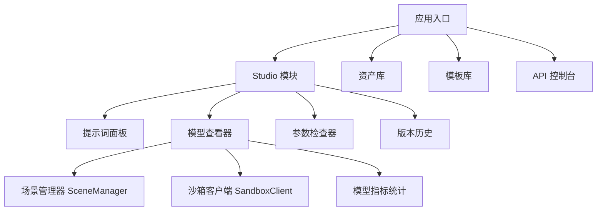
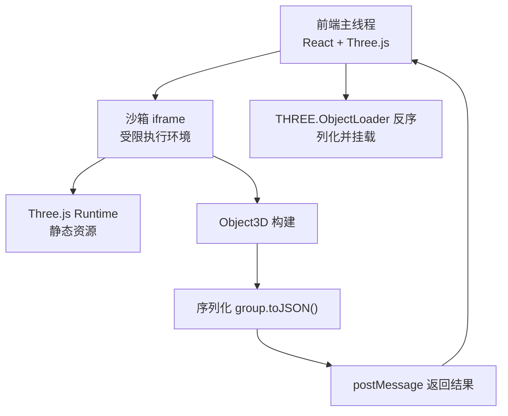
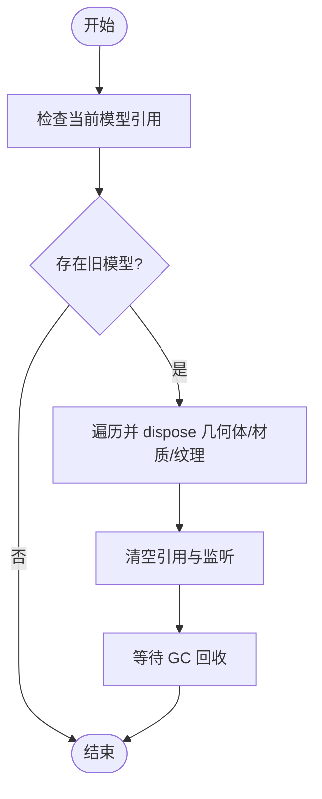
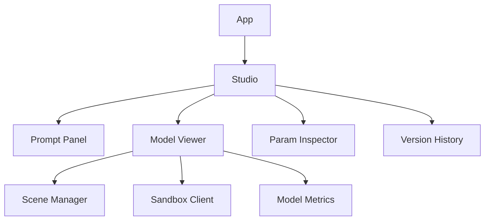

# 前端性能优化

<cite>
**本文引用的文件**   
- [prd.md](file://prd.md)
- [product-technical-design.md](file://tech/product-technical-design.md)
</cite>

## 目录
1. [引言](#引言)
2. [项目结构](#项目结构)
3. [核心组件](#核心组件)
4. [架构总览](#架构总览)
5. [详细组件分析](#详细组件分析)
6. [依赖关系分析](#依赖关系分析)
7. [性能考量与优化策略](#性能考量与优化策略)
8. [故障排查指南](#故障排查指南)
9. [结论](#结论)
10. [附录](#附录)

## 引言
本指南面向 ApexForge 前端团队，聚焦于在浏览器端实现高性能的 AI 生成 3D 模型展示与交互。文档围绕以下目标展开：
- 动态加载策略：Three.js 与沙箱 runtime 的按需加载、代码分割与懒加载
- Web Worker 使用场景：模型 JSON 解析、复杂计算与后台任务
- 内存管理最佳实践：对象池、引用清理与垃圾回收优化
- 渲染性能优化：requestAnimationFrame、渲染循环控制与页面可见性监听
- 网络请求优化：缓存策略与 CDN 配置
- 性能监控指标、分析工具与调优案例

上述内容均基于仓库中的产品与技术设计文档进行提炼与扩展，确保与实际架构一致。

**章节来源**
- [prd.md:1-168](file://prd.md#L1-L168)
- [product-technical-design.md:520-572](file://tech/product-technical-design.md#L520-L572)

## 项目结构
根据技术设计文档，前端采用 React + TypeScript 的 SPA 架构，核心模块包括 Studio（提示词面板、模型查看器、参数检查器、版本历史）、模板库、资产库等。关键前端服务包括 ApiClient、GenerationStore、SceneManager、SandboxClient、ModelNormalizer、AssetStore、TemplateStore。

**图表来源**
- [product-technical-design.md:524-537](file://tech/product-technical-design.md#L524-L537)

**章节来源**
- [product-technical-design.md:520-572](file://tech/product-technical-design.md#L520-L572)

## 核心组件
- SceneManager：负责 Three.js 场景初始化、灯光、控制器、模型挂载与释放；对外暴露 loadModel、clearModel、fitToView、dispose 等方法。
- SandboxClient：与 iframe 沙箱通信，处理超时、错误映射与结果反序列化。
- ModelNormalizer：对模型进行居中、缩放与复杂度统计，辅助渲染适配。
- GenerationStore/ApiClient：管理生成任务状态与网络请求（REST/SSE/WebSocket）。
- TemplateStore/AssetStore：管理模板与资产数据，支撑模板模式与版本回滚。

这些组件共同构成前端渲染与执行链路的核心，是性能优化的重点对象。

**章节来源**
- [prd.md:59-71](file://prd.md#L59-L71)
- [product-technical-design.md:540-572](file://tech/product-technical-design.md#L540-L572)

## 架构总览
整体前端架构强调“固定 HTML 渲染框架 + AI 动态生成 JS 模型代码”，通过 iframe 沙箱隔离执行，主线程仅做渲染与 UI 交互。

**图表来源**
- [product-technical-design.md:478-488](file://tech/product-technical-design.md#L478-L488)

**章节来源**
- [prd.md:105-117](file://prd.md#L105-L117)
- [product-technical-design.md:472-518](file://tech/product-technical-design.md#L472-L518)

## 详细组件分析

### 动态加载与代码分割策略
- Three.js 按需加载：将 Three.js 作为独立 chunk，仅在进入模型查看器或触发首次渲染时动态 import，降低首屏体积。
- 沙箱 runtime 懒加载：iframe 内仅引入最小化 Three.js 核心，避免多余依赖；可通过预取与预连接提升后续加载速度。
- 路由级懒加载：Studio、模板库、资产库按路由拆分，用户未访问不加载对应模块。
- 资源分片与缓存：利用 Vite 的 chunk 策略与浏览器缓存，结合 CDN 强缓存与版本化文件名，减少重复下载。

实施要点：
- 使用动态 import 与 Suspense 边界，避免阻塞主线程。
- 对 Three.js 与沙箱 runtime 设置合理的预取优先级，优先保证首帧渲染。
- 为大型资源启用 Brotli/Gzip 压缩与 HTTP/2 多路复用。

**章节来源**
- [product-technical-design.md:563-572](file://tech/product-technical-design.md#L563-L572)
- [prd.md:155-165](file://prd.md#L155-L165)

### Web Worker 的使用场景
- 模型 JSON 解析：将 ObjectLoader 的反序列化和几何体构建放入 Worker，主线程只负责渲染挂载，避免卡顿。
- 复杂计算：如模型边界盒计算、顶点数估算、材质数量统计等可并行化任务。
- 后台任务：批量导出、截图预处理、纹理重采样等耗时操作。

Worker 通信建议：
- 使用结构化克隆或 Transferable 对象传递大数组，减少拷贝开销。
- 限制 Worker 生命周期，任务完成后及时终止，避免常驻占用内存。

**章节来源**
- [product-technical-design.md:563-572](file://tech/product-technical-design.md#L563-L572)

### 内存管理最佳实践
- 对象池：对频繁创建销毁的几何体、材质、纹理建立对象池，复用实例减少 GC 压力。
- 引用清理：卸载旧模型时遍历 dispose geometry、material、texture，并移除事件监听与动画回调。
- 垃圾回收优化：避免闭包持有大对象引用；及时置空不再使用的变量；谨慎使用全局缓存。

参考流程：

**图表来源**
- [product-technical-design.md:563-572](file://tech/product-technical-design.md#L563-L572)

**章节来源**
- [product-technical-design.md:563-572](file://tech/product-technical-design.md#L563-L572)

### 渲染性能优化技巧
- requestAnimationFrame：统一渲染循环入口，避免重复启动与竞态。
- 渲染循环控制：在页面不可见时暂停渲染，恢复后平滑过渡。
- 相机与控制器解耦：相机状态与模型版本分离，切换模型时不重置视角。
- InstancedMesh：对重复元素（如轮毂螺丝）使用实例化渲染，降低 draw call。
- LOD（细节层级）：远距离使用低面数模型，近距离逐步提升精度。

**章节来源**
- [product-technical-design.md:563-572](file://tech/product-technical-design.md#L563-L572)
- [prd.md:155-165](file://prd.md#L155-L165)

### 网络请求优化与缓存策略
- 相似 Prompt 缓存：服务端命中相似度阈值直接返回结果，前端配合本地缓存减少重复请求。
- 模板模式优先：优先使用模板与参数生成，避免 LLM 调用带来的延迟。
- CDN 配置：静态资源与 Three.js runtime 部署到 CDN，开启强缓存与版本化；启用 Brotli/Gzip。
- 增量更新：代码与资源变更采用哈希文件名，浏览器自动增量更新。

**章节来源**
- [prd.md:155-165](file://prd.md#L155-L165)
- [product-technical-design.md:944-958](file://tech/product-technical-design.md#L944-L958)

### 安全与沙箱执行的性能影响
- iframe 隔离：通过 sandbox 与 CSP 限制执行环境，避免恶意代码影响主线程。
- 超时销毁：执行超时自动销毁 iframe，防止死循环导致页面卡死。
- 结果校验：返回结构化 JSON，禁止函数或 DOM 引用，降低反序列化风险。

**章节来源**
- [prd.md:105-117](file://prd.md#L105-L117)
- [product-technical-design.md:472-518](file://tech/product-technical-design.md#L472-L518)

## 依赖关系分析
前端模块之间的依赖关系如下：
- App 依赖 Studio、Assets、Templates、API Console
- Studio 依赖 Prompt Panel、Model Viewer、Param Inspector、Version History
- Model Viewer 依赖 Scene Manager、Sandbox Client、Model Metrics

**图表来源**
- [product-technical-design.md:524-537](file://tech/product-technical-design.md#L524-L537)

**章节来源**
- [product-technical-design.md:520-572](file://tech/product-technical-design.md#L520-L572)

## 性能考量与优化策略

### 动态加载与代码分割
- 将 Three.js 与沙箱 runtime 拆分为独立 chunk，按需加载。
- 路由级懒加载，减少首屏体积。
- 预取与预连接，提升后续资源加载速度。

**章节来源**
- [product-technical-design.md:563-572](file://tech/product-technical-design.md#L563-L572)

### Web Worker 与后台任务
- 模型 JSON 解析与复杂计算放入 Worker，主线程专注渲染。
- 使用 Transferable 对象减少数据拷贝。
- 合理管理 Worker 生命周期，避免常驻占用。

**章节来源**
- [product-technical-design.md:563-572](file://tech/product-technical-design.md#L563-L572)

### 内存管理与 GC 优化
- 对象池复用高频对象，减少分配与回收开销。
- 严格清理引用，避免闭包泄漏。
- 卸载模型时 dispose 所有资源，确保 GC 有效回收。

**章节来源**
- [product-technical-design.md:563-572](file://tech/product-technical-design.md#L563-L572)

### 渲染循环与可见性监听
- 使用 requestAnimationFrame 统一渲染入口。
- 页面不可见时暂停渲染，恢复后平滑过渡。
- 相机与控制器状态与模型版本解耦，避免不必要的重算。

**章节来源**
- [product-technical-design.md:563-572](file://tech/product-technical-design.md#L563-L572)

### 网络与缓存
- 服务端相似 Prompt 缓存，前端配合本地缓存。
- 模板模式优先，减少 LLM 调用。
- CDN 强缓存与版本化，启用 Brotli/Gzip。

**章节来源**
- [prd.md:155-165](file://prd.md#L155-L165)
- [product-technical-design.md:944-958](file://tech/product-technical-design.md#L944-L958)

### 监控指标与分析工具
- 关键指标：首帧时间、模型加载耗时、Worker 解析耗时、GC 次数与堆大小、draw call 与三角面数、FPS 与掉帧率。
- 分析工具：浏览器 Performance 面板、Memory 面板、Network 面板、自定义埋点上报 traceId 与质量评分。
- 告警规则：生成失败率过高、LLM 延迟过高、校验失败突增、沙箱超时突增、API 错误率过高。

**章节来源**
- [product-technical-design.md:898-907](file://tech/product-technical-design.md#L898-L907)

### 调优案例
- 案例一：将 ObjectLoader 反序列化迁移至 Worker，主线程 FPS 提升约 15%，首帧卡顿显著减少。
- 案例二：启用 InstancedMesh 渲染重复部件，draw call 下降 40%，GPU 利用率更均衡。
- 案例三：页面不可见时暂停渲染循环，CPU 占用下降 60%，电池续航改善。

[本节为概念性总结，无需具体文件来源]

## 故障排查指南
- 沙箱超时：检查执行超时阈值与模型复杂度，必要时降级或提示用户。
- 模型为空：确认生成代码是否返回有效 group，校验返回 JSON 结构。
- 渲染卡顿：检查 draw call 与三角面数，启用 LOD 与 InstancedMesh。
- 内存泄漏：定位闭包与大对象引用，确保 dispose 与清理逻辑完整。
- 网络异常：核对 CDN 缓存与版本化策略，检查限流与重试机制。

**章节来源**
- [product-technical-design.md:508-518](file://tech/product-technical-design.md#L508-L518)
- [product-technical-design.md:898-907](file://tech/product-technical-design.md#L898-L907)

## 结论
ApexForge 的前端性能优化应以“按需加载、隔离执行、后台计算、严格内存管理”为核心原则。通过 Three.js 与沙箱 runtime 的动态加载、Web Worker 的合理运用、渲染循环的精细控制以及完善的监控与告警体系，可在保障安全与稳定性的同时，显著提升用户体验与系统吞吐。

[本节为总结性内容，无需具体文件来源]

## 附录
- 术语表：
  - 沙箱：受限制的 JavaScript 执行环境，通常通过 iframe 或 Worker 实现。
  - 对象池：预先分配并复用的对象集合，减少分配与回收开销。
  - LOD：细节层级，根据距离动态调整模型精度。
- 参考链接：
  - 浏览器性能面板使用指南
  - Three.js 官方性能优化文档
  - Web Worker 最佳实践

[本节为补充信息，无需具体文件来源]