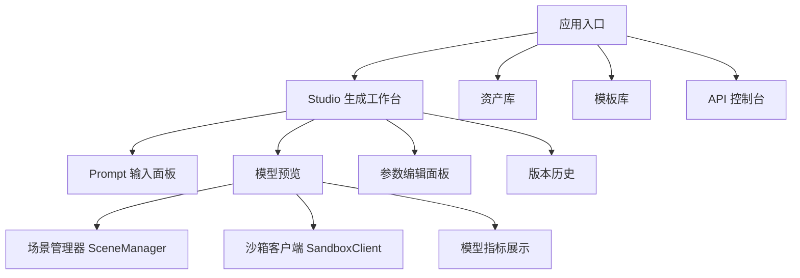
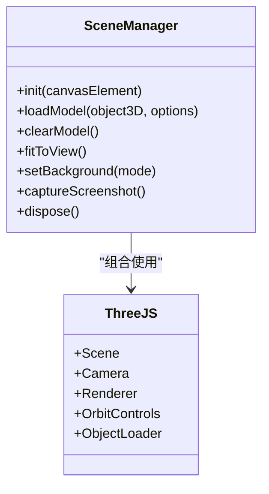
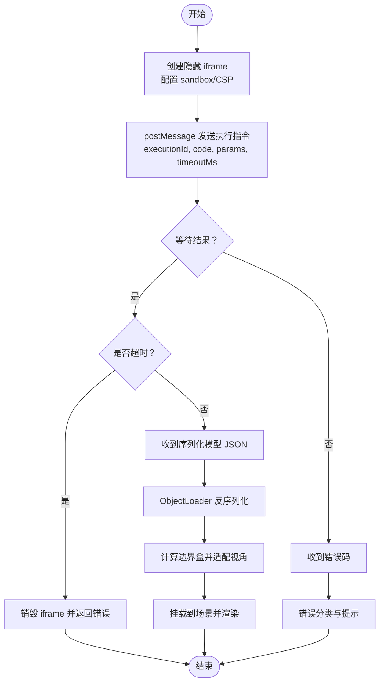
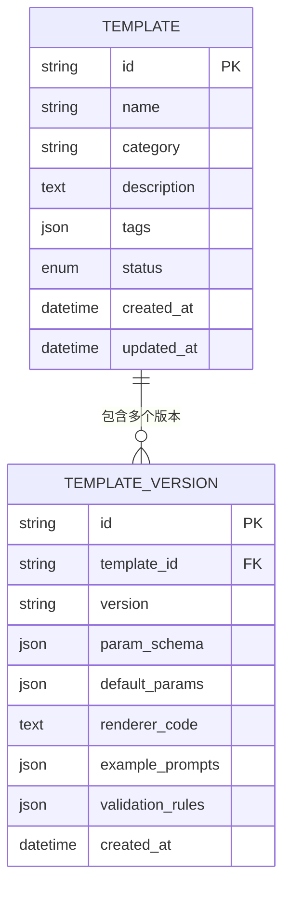
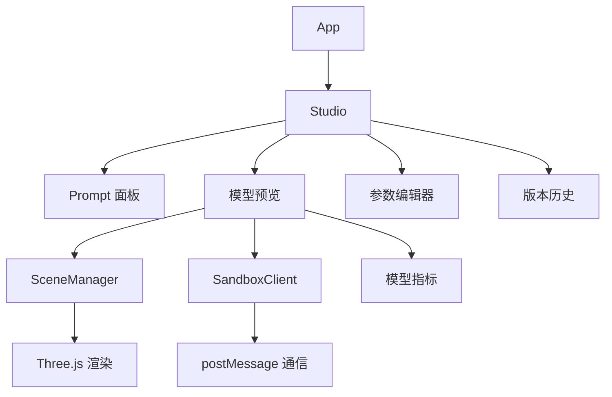

# 前端架构设计

<cite>
**本文引用的文件**   
- [prd.md](file://prd.md)
- [product-technical-design.md](file://tech/product-technical-design.md)
</cite>

## 目录
1. [引言](#引言)
2. [项目结构](#项目结构)
3. [核心组件](#核心组件)
4. [架构总览](#架构总览)
5. [详细组件分析](#详细组件分析)
6. [依赖关系分析](#依赖关系分析)
7. [性能考虑](#性能考虑)
8. [故障排查指南](#故障排查指南)
9. [结论](#结论)
10. [附录](#附录)

## 引言
本文件面向 ApexForge 前端（ApexForge Studio）的架构设计与实现要点，聚焦于基于 React 18 + TypeScript 的前端应用架构、Three.js 集成方案、沙箱执行环境设计以及关键前端服务的职责与接口约定。文档同时给出性能优化策略与可观测性建议，帮助工程团队在 MVP 到平台化阶段稳定落地并持续演进。

## 项目结构
从产品与技术设计文档可知，前端采用 React SPA 形态，围绕“生成工作台”、“模型预览”、“模板库”、“资产库”等模块组织能力；渲染层以 Three.js 为核心，配合沙箱 iframe 隔离执行 AI 生成的代码。整体信息架构如下：



图表来源
- [product-technical-design.md:524-537](file://tech/product-technical-design.md#L524-L537)

章节来源
- [product-technical-design.md:520-571](file://tech/product-technical-design.md#L520-L571)

## 核心组件
本节梳理前端关键服务与职责，明确对外能力边界与交互契约，便于后续扩展与维护。

- ApiClient
  - 职责：封装 REST/SSE/WebSocket 请求，统一鉴权、重试、错误映射与 traceId 透传。
  - 关键点：支持 SSE 事件流订阅，用于生成任务状态推送；提供通用错误处理与降级策略。
- GenerationStore
  - 职责：管理生成任务生命周期、状态机流转与结果缓存；为 UI 提供响应式数据源。
  - 关键点：与 SSE 事件联动更新本地状态；失败时触发重试或回退逻辑。
- SceneManager
  - 职责：初始化 Three.js 场景、灯光、控制器与后期处理；提供加载/清空/适配视角/截图/释放资源等方法。
  - 关键点：单例模式，集中管理场景实例与模型挂载点；负责 dispose 几何体、材质与纹理，避免内存泄漏。
- SandboxClient
  - 职责：与 iframe 沙箱通信、超时控制、错误分类与映射；将序列化模型数据交由主线程反序列化与渲染。
  - 关键点：postMessage 协议定义、执行 ID 追踪、iframe 销毁与重建策略。
- ModelNormalizer
  - 职责：对模型进行居中、缩放、复杂度统计与边界盒计算；输出渲染前标准化数据。
  - 关键点：根据顶点数、Mesh 数量等指标提示用户降级或切换模板模式。
- AssetStore / TemplateStore
  - 职责：分别管理项目/资产/版本与模板列表/详情/参数 Schema 的本地缓存与同步。
  - 关键点：与后端版本化体系对齐，支持快速恢复与对比。

章节来源
- [product-technical-design.md:539-571](file://tech/product-technical-design.md#L539-L571)

## 架构总览
前端与后端、AI 服务、沙箱运行时的交互流程如下：

```mermaid
sequenceDiagram
participant FE as "前端(React)"
participant API as "API 网关"
participant GEN as "生成服务"
participant LLM as "LLM 适配器"
participant VAL as "校验器"
participant BOX as "沙箱 iframe"
participant RENDER as "Three.js 渲染"
FE->>API : "POST /api/v1/generations"
API->>GEN : "创建生成任务"
GEN->>LLM : "构建 Prompt 并调用模型"
LLM-->>GEN : "返回代码或参数"
GEN->>VAL : "安全校验与质量评分"
VAL-->>GEN : "校验报告"
GEN-->>API : "返回生成结果"
API-->>FE : "SSE 事件/最终结果"
FE->>BOX : "postMessage 执行代码"
BOX-->>FE : "返回序列化模型 JSON"
FE->>RENDER : "ObjectLoader 反序列化并挂载"
```

图表来源
- [product-technical-design.md:361-390](file://tech/product-technical-design.md#L361-L390)

章节来源
- [product-technical-design.md:359-390](file://tech/product-technical-design.md#L359-L390)

## 详细组件分析

### 场景管理器（SceneManager）
- 设计要点
  - 单例模式，全局唯一场景实例，避免重复初始化导致资源浪费。
  - 对外暴露 init/loadModel/clearModel/fitToView/setBackground/captureScreenshot/dispose 等能力。
  - 负责 OrbitControls、光照、背景网格、相机初始位置与自动适配。
- 数据流
  - 接收 SandboxClient 返回的序列化模型 JSON，使用 ObjectLoader 反序列化为 Object3D 树。
  - 计算边界盒并执行 fitToView，确保模型居中且比例合适。
- 错误处理
  - 捕获反序列化异常，记录错误码并提示用户重试或回退。
- 性能优化
  - 旧模型卸载时遍历 dispose geometry/material/texture。
  - 页面不可见时暂停渲染循环，减少 CPU/GPU 占用。



图表来源
- [product-technical-design.md:551-561](file://tech/product-technical-design.md#L551-L561)

章节来源
- [product-technical-design.md:551-571](file://tech/product-technical-design.md#L551-L571)

### 沙箱执行环境（iframe 隔离）
- 设计要点
  - 隐藏 iframe 作为完全隔离的执行环境，仅允许脚本执行，禁止网络、DOM 访问与顶级导航。
  - 通过 postMessage 传递执行指令与参数，iframe 内执行 buildModel(params, THREE)，成功后调用 group.toJSON() 返回结构化 JSON。
  - 主线程使用 ObjectLoader 反序列化并挂载到当前场景。
- 执行流程
  - 主线程生成 executionId，发送执行消息；iframe 包装代码并执行；成功则返回 JSON；失败则返回错误码。
  - 设置超时时间，若未返回则销毁 iframe 并清理资源。
- 错误分类
  - 超时、运行时错误、模型 JSON 非法、模型过于复杂、未生成有效对象等，均映射为用户可理解提示。



图表来源
- [product-technical-design.md:478-517](file://tech/product-technical-design.md#L478-L517)

章节来源
- [product-technical-design.md:472-517](file://tech/product-technical-design.md#L472-L517)

### 关键前端服务接口设计
- ApiClient
  - 方法：createGenerationTask、getGenerationTask、subscribeEvents、uploadAsset、exportAsset。
  - 特性：统一错误结构、traceId 透传、SSE 事件订阅、重试与降级。
- GenerationStore
  - 状态：taskId、status、mode、templateId、params、code、validationReport、qualityScore。
  - 行为：发起任务、监听事件、更新状态、失败重试、结果缓存。
- SandboxClient
  - 方法：execute(code, params, timeoutMs)、onMessage(callback)、destroy()。
  - 协议：{ type: 'execute', executionId, code, params, timeoutMs }；返回 { executionId, result: json | error }。
- ModelNormalizer
  - 方法：normalize(group)、computeMetrics(group)、centerAndScale(group)。
  - 输出：标准化后的 Object3D、复杂度指标（几何体数量、顶点估算、材质数量）。

章节来源
- [product-technical-design.md:539-571](file://tech/product-technical-design.md#L539-L571)

### 模板系统与参数化生成
- 模板结构
  - templateId、version、category、paramSchema、defaultParams、renderer。
- 分层策略
  - Skeleton（骨架）、Style Variant（风格变体）、Detail Pack（细节包）、Material Preset（材质预设）、Param Schema（参数 Schema）。
- 匹配策略
  - 类别识别与关键词抽取，标签与向量检索候选模板，优先命中模板模式以提升稳定性与速度。



图表来源
- [product-technical-design.md:270-296](file://tech/product-technical-design.md#L270-L296)

章节来源
- [product-technical-design.md:760-800](file://tech/product-technical-design.md#L760-L800)

## 依赖关系分析
前端模块之间的依赖关系如下：



图表来源
- [product-technical-design.md:524-537](file://tech/product-technical-design.md#L524-L537)

章节来源
- [product-technical-design.md:520-571](file://tech/product-technical-design.md#L520-L571)

## 性能考虑
- 动态加载
  - Three.js 与沙箱 runtime 按需加载，降低首屏体积。
- Worker 使用
  - 模型 JSON 解析放入 Web Worker，主线程专注渲染挂载。
- 渲染优化
  - 重复几何体使用 InstancedMesh；LOD 远距离低面数模型；requestAnimationFrame 控制渲染循环，页面不可见时暂停。
- 内存管理
  - 释放旧模型时遍历 dispose geometry/material/texture；避免引用泄露。
- 复杂度阈值
  - 加载前统计复杂度，超过阈值提示用户降级或切换模板模式。

章节来源
- [product-technical-design.md:563-571](file://tech/product-technical-design.md#L563-L571)

## 故障排查指南
- 常见错误码与定位
  - SANDBOX_TIMEOUT：执行超时，检查代码复杂度与超时配置。
  - SANDBOX_RUNTIME_ERROR：运行时报错，查看 iframe 日志与错误堆栈。
  - MODEL_JSON_INVALID：返回结构非法，核对序列化协议与 ObjectLoader 兼容性。
  - MODEL_TOO_COMPLEX：复杂度超限，引导用户选择模板模式或降低细节。
  - MODEL_EMPTY：未生成有效对象，提示补充描述或更换类别。
- 排查步骤
  - 确认 SSE 事件链路是否正常，traceId 贯穿全链路。
  - 检查 CSP 与 sandbox 配置，确保仅允许必要权限。
  - 验证 ObjectLoader 反序列化过程，关注材质与纹理路径。
  - 监控帧率与内存占用，必要时启用降级策略。

章节来源
- [product-technical-design.md:508-517](file://tech/product-technical-design.md#L508-L517)

## 结论
ApexForge 前端以 React 18 + TypeScript 为基础，结合 Three.js 与 iframe 沙箱，构建了安全可控、可扩展的程序化 3D 模型生成与预览体系。通过 SceneManager 单例、SandboxClient 通信协议、ModelNormalizer 标准化与 GenerationStore 状态管理，实现了从自然语言到可交互模型的完整闭环。配合动态加载、Worker 解析、InstancedMesh 与 LOD 等性能策略，可在保证用户体验的同时支撑平台化演进。

## 附录
- 生成任务状态机
  - queued → generating → validating → renderable/saved/discarded/failed/retrying/repairing
- 安全策略
  - 黑名单 API、AST 白名单、CSP、sandbox、超时销毁、结果校验
- 模板系统
  - 分层模板、参数 Schema、默认参数、渲染函数、版本管理

章节来源
- [product-technical-design.md:342-357](file://tech/product-technical-design.md#L342-L357)
- [product-technical-design.md:428-470](file://tech/product-technical-design.md#L428-L470)
- [product-technical-design.md:760-800](file://tech/product-technical-design.md#L760-L800)