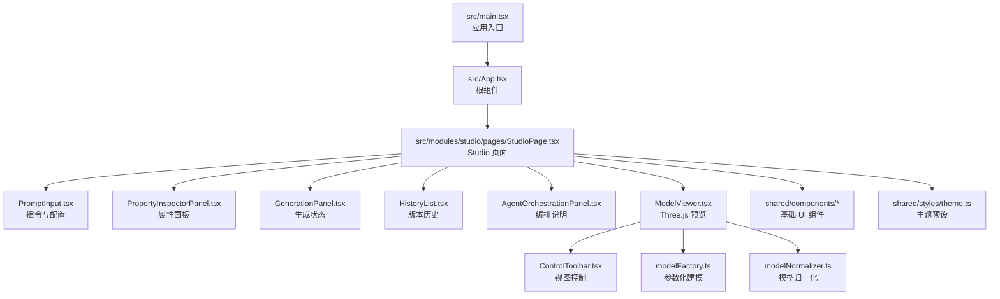
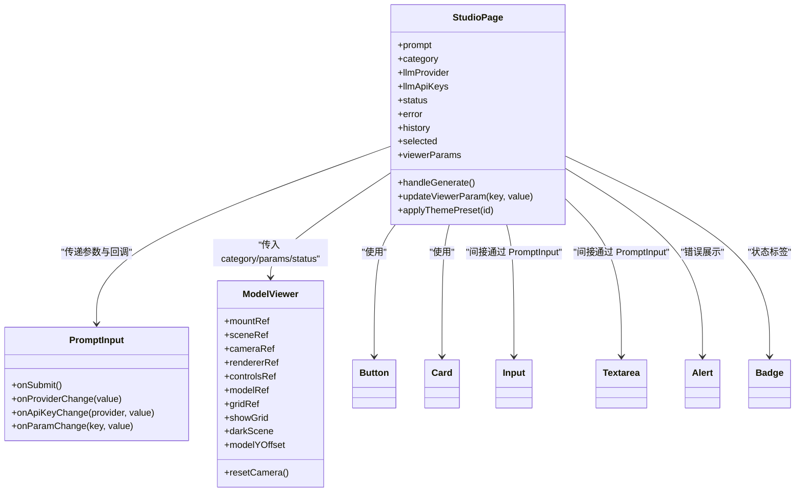
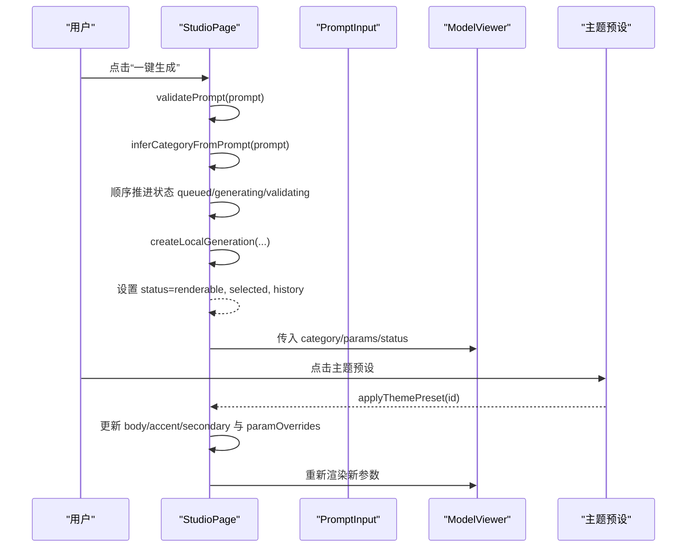
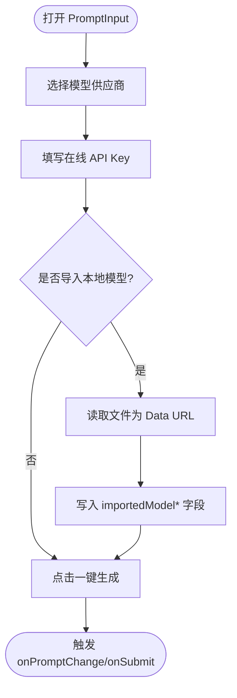
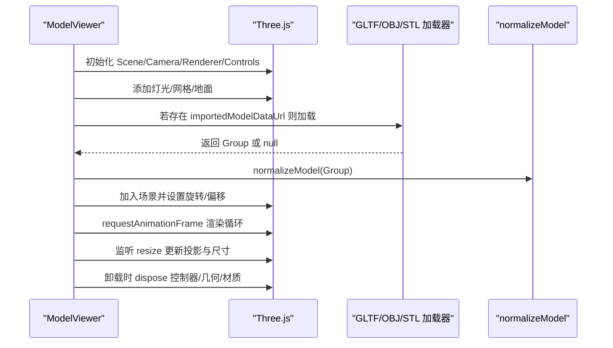
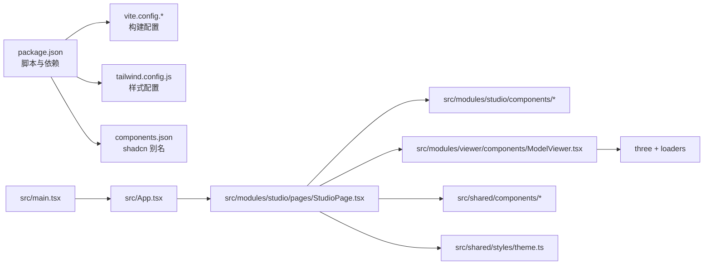

# 前端组件库

<cite>
**本文引用的文件**   
- [README.md](file://README.md)
- [package.json](file://package.json)
- [components.json](file://components.json)
- [src/main.tsx](file://src/main.tsx)
- [src/App.tsx](file://src/App.tsx)
- [src/modules/studio/pages/StudioPage.tsx](file://src/modules/studio/pages/StudioPage.tsx)
- [src/modules/studio/components/PromptInput.tsx](file://src/modules/studio/components/PromptInput.tsx)
- [src/modules/viewer/components/ModelViewer.tsx](file://src/modules/viewer/components/ModelViewer.tsx)
- [src/shared/styles/theme.ts](file://src/shared/styles/theme.ts)
- [src/shared/components/Button.tsx](file://src/shared/components/Button.tsx)
- [src/shared/components/Card.tsx](file://src/shared/components/Card.tsx)
- [src/shared/components/Input.tsx](file://src/shared/components/Input.tsx)
- [src/shared/components/Alert.tsx](file://src/shared/components/Alert.tsx)
- [src/shared/components/Badge.tsx](file://src/shared/components/Badge.tsx)
- [src/shared/components/Textarea.tsx](file://src/shared/components/Textarea.tsx)
</cite>

## 目录
1. [简介](#简介)
2. [项目结构](#项目结构)
3. [核心组件](#核心组件)
4. [架构总览](#架构总览)
5. [详细组件分析](#详细组件分析)
6. [依赖关系分析](#依赖关系分析)
7. [性能考量](#性能考量)
8. [故障排查指南](#故障排查指南)
9. [结论](#结论)
10. [附录](#附录)

## 简介
本仓库为 ApexForge 的前端部分，聚焦于“AI 驱动的实时 3D CAD / 参数化建模工作台”。前端基于 React 18 + TypeScript + Vite 构建，使用 TailwindCSS 与 shadcn/ui 风格组件体系，结合 Three.js 实现模型预览、导入与参数化渲染。整体以 Studio 页面为中心，串联 Prompt 输入、生成编排、属性编辑与 3D 预览四大区域，形成从自然语言到可交互 3D 原型的闭环体验。

## 项目结构
前端代码位于 src 目录下，采用按功能域划分的组织方式：
- modules/studio：Studio 工作台页面与业务组件（Prompt 输入、历史记录、生成面板、属性面板等）
- modules/viewer：Three.js 预览与工具（场景初始化、导入加载、控制栏、归一化与工厂）
- shared：共享 UI 组件、样式主题、类型与工具函数
- 根入口：main.tsx 挂载应用，App.tsx 注入主页面

图示来源
- [src/main.tsx:1-11](file://src/main.tsx#L1-L11)
- [src/App.tsx:1-6](file://src/App.tsx#L1-L6)
- [src/modules/studio/pages/StudioPage.tsx:1-445](file://src/modules/studio/pages/StudioPage.tsx#L1-L445)
- [src/modules/studio/components/PromptInput.tsx:1-173](file://src/modules/studio/components/PromptInput.tsx#L1-L173)
- [src/modules/viewer/components/ModelViewer.tsx:1-307](file://src/modules/viewer/components/ModelViewer.tsx#L1-L307)
- [src/shared/styles/theme.ts:1-59](file://src/shared/styles/theme.ts#L1-L59)

章节来源
- [README.md:182-203](file://README.md#L182-L203)
- [package.json:1-65](file://package.json#L1-L65)
- [components.json:1-21](file://components.json#L1-L21)

## 核心组件
- StudioPage：页面级状态中枢，管理提示词、模型供应商、在线 API Key、生成状态、历史记录、主题与参数覆盖，并驱动 ModelViewer 渲染。
- PromptInput：提供多模型选择、在线 API Key 配置、本地 3D 模型导入与提交按钮。
- ModelViewer：Three.js 场景生命周期管理、导入模型加载、网格/背景切换、相机重置与垂直偏移控制。
- 共享 UI 组件：Button、Card、Input、Textarea、Alert、Badge 等，统一风格与交互规范。
- 主题系统：modelThemePresets 提供多套颜色预设，一键应用到模型参数与选中结果。

章节来源
- [src/modules/studio/pages/StudioPage.tsx:33-190](file://src/modules/studio/pages/StudioPage.tsx#L33-L190)
- [src/modules/studio/components/PromptInput.tsx:76-173](file://src/modules/studio/components/PromptInput.tsx#L76-L173)
- [src/modules/viewer/components/ModelViewer.tsx:82-243](file://src/modules/viewer/components/ModelViewer.tsx#L82-L243)
- [src/shared/styles/theme.ts:12-59](file://src/shared/styles/theme.ts#L12-L59)
- [src/shared/components/Button.tsx:1-45](file://src/shared/components/Button.tsx#L1-L45)
- [src/shared/components/Card.tsx:1-40](file://src/shared/components/Card.tsx#L1-L40)
- [src/shared/components/Input.tsx:1-18](file://src/shared/components/Input.tsx#L1-L18)
- [src/shared/components/Textarea.tsx:1-17](file://src/shared/components/Textarea.tsx#L1-L17)
- [src/shared/components/Alert.tsx:1-21](file://src/shared/components/Alert.tsx#L1-L21)
- [src/shared/components/Badge.tsx:1-28](file://src/shared/components/Badge.tsx#L1-L28)

## 架构总览
前端以 StudioPage 为协调者，组合多个子组件完成用户交互与数据流；ModelViewer 负责 Three.js 渲染管线与资源管理；共享组件与主题贯穿全栈界面一致性。

图示来源
- [src/modules/studio/pages/StudioPage.tsx:33-190](file://src/modules/studio/pages/StudioPage.tsx#L33-L190)
- [src/modules/studio/components/PromptInput.tsx:76-173](file://src/modules/studio/components/PromptInput.tsx#L76-L173)
- [src/modules/viewer/components/ModelViewer.tsx:82-243](file://src/modules/viewer/components/ModelViewer.tsx#L82-L243)
- [src/shared/components/Button.tsx:1-45](file://src/shared/components/Button.tsx#L1-L45)
- [src/shared/components/Card.tsx:1-40](file://src/shared/components/Card.tsx#L1-L40)
- [src/shared/components/Input.tsx:1-18](file://src/shared/components/Input.tsx#L1-L18)
- [src/shared/components/Textarea.tsx:1-17](file://src/shared/components/Textarea.tsx#L1-L17)
- [src/shared/components/Alert.tsx:1-21](file://src/shared/components/Alert.tsx#L1-L21)
- [src/shared/components/Badge.tsx:1-28](file://src/shared/components/Badge.tsx#L1-L28)

## 详细组件分析

### StudioPage 页面
职责与流程
- 维护全局状态：提示词、类别、模型供应商、在线 API Key、生成状态、错误信息、历史记录、当前选中结果、主题色与参数覆盖。
- 生成流程：校验提示词 -> 推断类别 -> 顺序推进状态 -> 调用本地生成服务 -> 更新选中项与历史 -> 设置可渲染状态。
- 主题与参数：支持一键应用主题预设，同步更新 viewerParams 与 selected.generatedParams。
- 布局：左侧控制面板（PromptInput、GenerationPanel、HistoryList），中间预览区（ModelViewer），右侧属性与编排面板（PropertyInspectorPanel、AgentOrchestrationPanel）。

关键数据流
- viewerParams 由 selected.generatedParams 与 paramOverrides 合并而来，颜色字段会回写至 bodyColor/accentColor/secondaryColor 状态。
- updateViewerParam 同时更新 paramOverrides 与 selected.generatedParams，保证属性面板与选中结果一致。

图示来源
- [src/modules/studio/pages/StudioPage.tsx:163-190](file://src/modules/studio/pages/StudioPage.tsx#L163-L190)
- [src/modules/studio/pages/StudioPage.tsx:86-115](file://src/modules/studio/pages/StudioPage.tsx#L86-L115)
- [src/modules/studio/pages/StudioPage.tsx:117-146](file://src/modules/studio/pages/StudioPage.tsx#L117-L146)
- [src/modules/studio/pages/StudioPage.tsx:55-82](file://src/modules/studio/pages/StudioPage.tsx#L55-L82)
- [src/modules/studio/components/PromptInput.tsx:141-145](file://src/modules/studio/components/PromptInput.tsx#L141-L145)
- [src/modules/viewer/components/ModelViewer.tsx:228-243](file://src/modules/viewer/components/ModelViewer.tsx#L228-L243)

章节来源
- [src/modules/studio/pages/StudioPage.tsx:33-190](file://src/modules/studio/pages/StudioPage.tsx#L33-L190)
- [src/modules/studio/pages/StudioPage.tsx:199-405](file://src/modules/studio/pages/StudioPage.tsx#L199-L405)

### PromptInput 组件
职责与特性
- 提供多模型供应商下拉选择（DeepSeek/Kimi/千问），带选中态与禁用态。
- 在线 API Key 配置：保存至浏览器 localStorage，并在生成时随请求携带。
- 本地 3D 模型导入：支持 GLB/GLTF/OBJ/STL，读取为 Data URL 后写入 params.importedModelDataUrl 等字段，供 ModelViewer 优先加载。
- 提交按钮：在 isGenerating 状态下禁用，避免重复提交。

图示来源
- [src/modules/studio/components/PromptInput.tsx:27-74](file://src/modules/studio/components/PromptInput.tsx#L27-L74)
- [src/modules/studio/components/PromptInput.tsx:149-169](file://src/modules/studio/components/PromptInput.tsx#L149-L169)
- [src/modules/studio/components/PromptInput.tsx:141-145](file://src/modules/studio/components/PromptInput.tsx#L141-L145)

章节来源
- [src/modules/studio/components/PromptInput.tsx:1-173](file://src/modules/studio/components/PromptInput.tsx#L1-L173)

### ModelViewer 组件
职责与特性
- 场景初始化：创建 Scene/Camera/WebGLRenderer/OrbitControls，配置阴影、色调映射、像素比与输出色彩空间。
- 灯光与地面：环境光、半球光、三点布光与地面平面，提升真实感。
- 网格与背景：可切换网格显示与明暗背景。
- 模型加载：优先加载导入模型（GLB/GLTF/OBJ/STL），失败则回退到参数化模型；加载后执行归一化与旋转、位置调整。
- 生命周期：监听窗口 resize，动画循环渲染，卸载时释放控制器、几何体与材质。

图示来源
- [src/modules/viewer/components/ModelViewer.tsx:95-199](file://src/modules/viewer/components/ModelViewer.tsx#L95-L199)
- [src/modules/viewer/components/ModelViewer.tsx:201-243](file://src/modules/viewer/components/ModelViewer.tsx#L201-L243)
- [src/modules/viewer/components/ModelViewer.tsx:245-261](file://src/modules/viewer/components/ModelViewer.tsx#L245-L261)
- [src/modules/viewer/components/ModelViewer.tsx:263-268](file://src/modules/viewer/components/ModelViewer.tsx#L263-L268)

章节来源
- [src/modules/viewer/components/ModelViewer.tsx:1-307](file://src/modules/viewer/components/ModelViewer.tsx#L1-L307)

### 共享 UI 组件
- Button：基于 class-variance-authority 的变体与尺寸控制，支持 asChild 透传。
- Card/CardHeader/CardTitle/CardDescription/CardContent：卡片容器与语义化分区。
- Input/Textarea：受控输入控件，统一焦点环与禁用态。
- Alert：错误/提示消息展示。
- Badge：轻量标签，支持 tone 变体。

章节来源
- [src/shared/components/Button.tsx:1-45](file://src/shared/components/Button.tsx#L1-L45)
- [src/shared/components/Card.tsx:1-40](file://src/shared/components/Card.tsx#L1-L40)
- [src/shared/components/Input.tsx:1-18](file://src/shared/components/Input.tsx#L1-L18)
- [src/shared/components/Textarea.tsx:1-17](file://src/shared/components/Textarea.tsx#L1-L17)
- [src/shared/components/Alert.tsx:1-21](file://src/shared/components/Alert.tsx#L1-L21)
- [src/shared/components/Badge.tsx:1-28](file://src/shared/components/Badge.tsx#L1-L28)

### 主题与预设
- modelThemePresets 提供多套颜色方案，包含 bodyColor/accentColor/secondaryColor。
- StudioPage 中 applyThemePreset 将预设颜色同步到 viewerParams 与 selected.generatedParams，确保渲染即时生效。

章节来源
- [src/shared/styles/theme.ts:12-59](file://src/shared/styles/theme.ts#L12-L59)
- [src/modules/studio/pages/StudioPage.tsx:86-115](file://src/modules/studio/pages/StudioPage.tsx#L86-L115)

## 依赖关系分析
- 运行时依赖：React、ReactDOM、three、lucide-react、class-variance-authority、clsx、tailwind-merge 等。
- 构建与开发：Vite、TypeScript、TailwindCSS、ESLint、concurrently（并行启动 web/api）。
- 组件库集成：shadcn/ui 风格，通过 components.json 定义别名与路径映射。

图示来源
- [package.json:1-65](file://package.json#L1-L65)
- [components.json:1-21](file://components.json#L1-L21)
- [src/main.tsx:1-11](file://src/main.tsx#L1-L11)
- [src/App.tsx:1-6](file://src/App.tsx#L1-L6)
- [src/modules/studio/pages/StudioPage.tsx:1-445](file://src/modules/studio/pages/StudioPage.tsx#L1-L445)
- [src/modules/viewer/components/ModelViewer.tsx:1-307](file://src/modules/viewer/components/ModelViewer.tsx#L1-L307)

章节来源
- [package.json:1-65](file://package.json#L1-L65)
- [components.json:1-21](file://components.json#L1-L21)

## 性能考量
- 渲染优化：WebGLRenderer 启用抗锯齿、PCFSoftShadowMap、ACESFilmicToneMapping，合理设置像素比与输出色彩空间，兼顾画质与性能。
- 资源管理：卸载时主动 dispose 控制器、几何体与材质，避免内存泄漏；模型替换前移除旧对象并释放资源。
- 交互流畅：OrbitControls 开启阻尼与屏幕空间平移，减少卡顿；resize 事件仅更新必要矩阵与尺寸。
- 构建与热更：Vite 提供快速热更新，配合 concurrently 并行启动前后端，提升开发效率。

[本节为通用指导，不直接分析具体文件]

## 故障排查指南
- 生成失败提示：当提示词校验失败或后端调用异常时，StudioPage 会将 error 状态置位并显示错误信息。
- 模型导入异常：若导入模型解析失败，ModelViewer 会回退到参数化模型，避免空白场景。
- 在线 API Key：确认浏览器 localStorage 中已保存对应 provider 的 key；未填写时将回退服务端环境变量。
- 视图异常：可通过 ControlToolbar 重置相机、切换网格与背景，检查模型 Y 轴偏移是否导致遮挡。

章节来源
- [src/modules/studio/pages/StudioPage.tsx:163-190](file://src/modules/studio/pages/StudioPage.tsx#L163-L190)
- [src/modules/studio/pages/StudioPage.tsx:20-27](file://src/modules/studio/pages/StudioPage.tsx#L20-L27)
- [src/modules/studio/components/PromptInput.tsx:149-169](file://src/modules/studio/components/PromptInput.tsx#L149-L169)
- [src/modules/viewer/components/ModelViewer.tsx:228-243](file://src/modules/viewer/components/ModelViewer.tsx#L228-L243)

## 结论
该前端组件库围绕 StudioPage 构建了高内聚、低耦合的工作台架构：以共享 UI 组件保障界面一致性，以 ModelViewer 承载复杂 3D 渲染逻辑，以 PromptInput 打通用户意图与参数化建模。通过主题预设与属性面板，用户可以快速迭代模型外观与细节，形成从自然语言到可交互 3D 原型的高效闭环。

## 附录
- 快速开始与命令参考见 README 与 package.json 脚本。
- 开发者文档位于 tech/doc 目录，涵盖架构、前端、后端与渲染专题。

章节来源
- [README.md:121-180](file://README.md#L121-L180)
- [package.json:6-18](file://package.json#L6-L18)