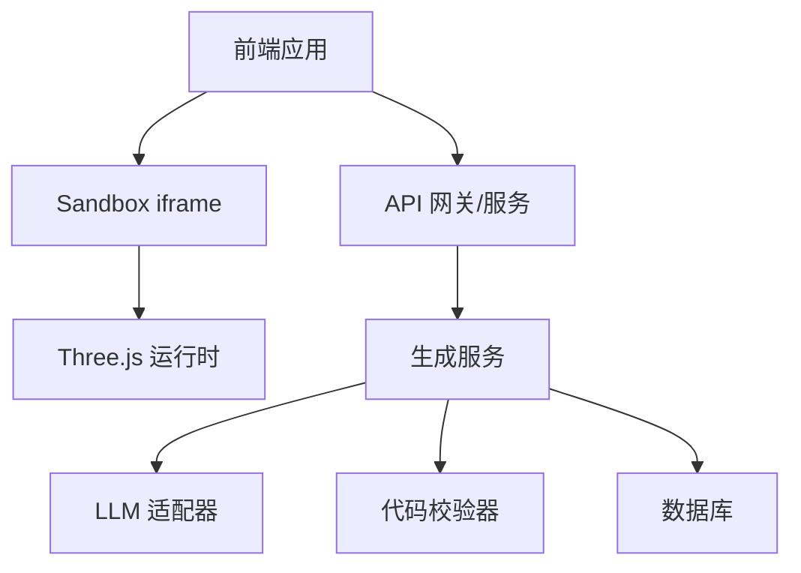
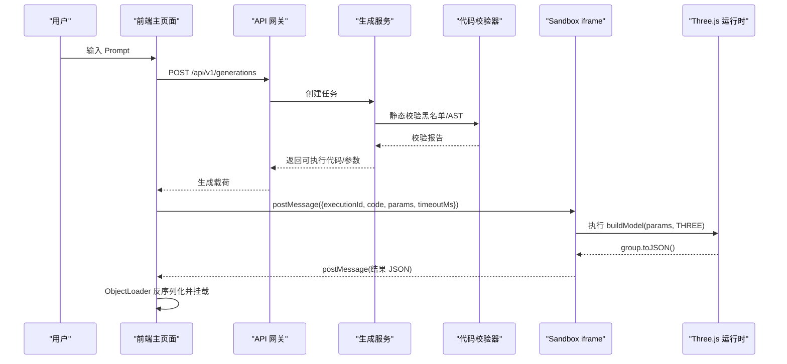
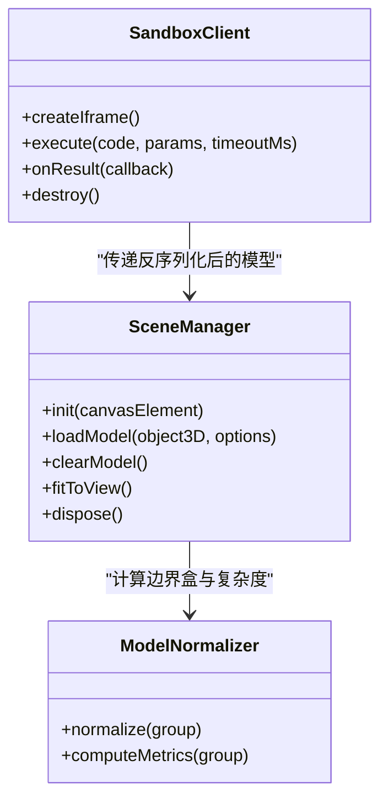
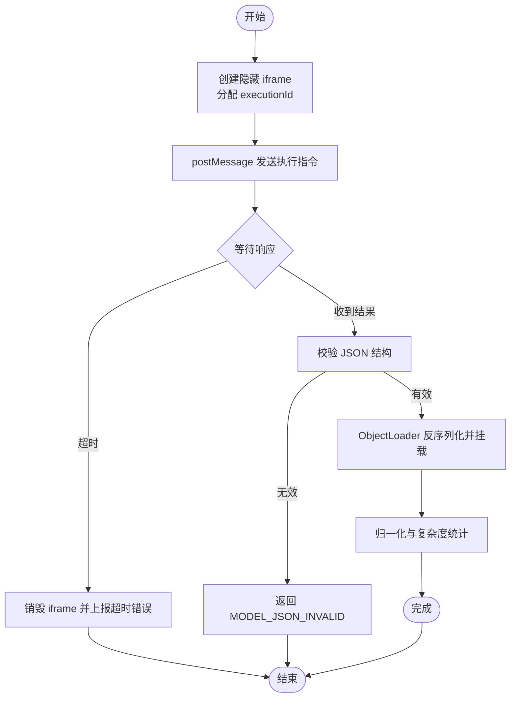
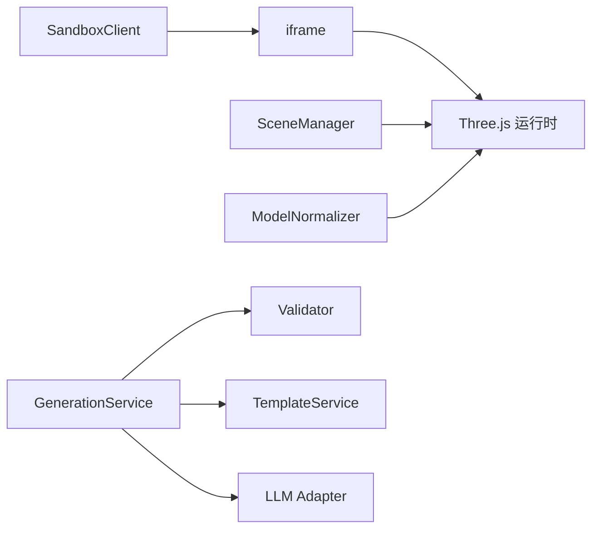

# iframe 隔离机制

<cite>
**本文引用的文件**
- [产品技术设计文档](file://tech/product-technical-design.md)
- [产品需求文档](file://prd.md)
</cite>

## 目录
1. [引言](#引言)
2. [项目结构](#项目结构)
3. [核心组件](#核心组件)
4. [架构总览](#架构总览)
5. [详细组件分析](#详细组件分析)
6. [依赖关系分析](#依赖关系分析)
7. [性能考虑](#性能考虑)
8. [故障排查指南](#故障排查指南)
9. [结论](#结论)
10. [附录：实现要点与示例路径](#附录实现要点与示例路径)

## 引言
本文件聚焦于 ApexForge 的 iframe 隔离机制，围绕以下目标展开：
- 说明 iframe sandbox 属性配置策略（如 allow-scripts、allow-same-origin 等）
- 描述 CSP（内容安全策略）设置方法，限制脚本来源与资源加载
- 解释同源访问限制实施方案，防止跨域数据泄露
- 记录 iframe 生命周期管理（创建、销毁、资源清理）
- 提供具体代码示例路径，展示初始化、配置与安全策略设置
- 给出浏览器兼容性考虑与性能优化建议

## 项目结构
ApexForge 采用前后端分离架构。前端负责渲染与沙箱执行，后端负责生成编排与安全校验。MVP 阶段使用单体后端加模块化结构，平台化后演进为微服务。

图表来源
- [产品技术设计文档:38-76](file://tech/product-technical-design.md#L38-L76)
- [产品需求文档:33-53](file://prd.md#L33-L53)

章节来源
- [产品技术设计文档:34-100](file://tech/product-technical-design.md#L34-L100)
- [产品需求文档:33-53](file://prd.md#L33-L53)

## 核心组件
- 沙箱客户端（SandboxClient）：负责与 iframe 通信、超时控制、错误映射与结果反序列化
- 场景管理器（SceneManager）：负责 Three.js 场景初始化、模型加载、视角适配与资源释放
- 模板与参数系统：通过模板模式减少自由代码生成风险，提高稳定性
- 代码校验器（服务端）：黑名单、AST 白名单、复杂度限制
- 质量评分体系：可渲染性、匹配度、结构完整性、性能表现、可编辑性

章节来源
- [产品技术设计文档:520-571](file://tech/product-technical-design.md#L520-L571)
- [产品技术设计文档:428-470](file://tech/product-technical-design.md#L428-L470)
- [产品技术设计文档:807-840](file://tech/product-technical-design.md#L807-L840)
- [产品需求文档:59-123](file://prd.md#L59-L123)

## 架构总览
下图展示了从用户输入到 iframe 执行并返回模型的完整流程，以及关键的安全边界。

图表来源
- [产品技术设计文档:361-390](file://tech/product-technical-design.md#L361-L390)
- [产品技术设计文档:478-506](file://tech/product-technical-design.md#L478-L506)

章节来源
- [产品技术设计文档:361-390](file://tech/product-technical-design.md#L361-L390)
- [产品技术设计文档:478-506](file://tech/product-technical-design.md#L478-L506)

## 详细组件分析

### iframe 沙箱配置策略
- sandbox 属性最小权限原则
  - 仅允许脚本执行：allow-scripts
  - 禁止同源访问：不添加 allow-same-origin，避免跨域读取父页面 DOM、存储与网络上下文
  - 禁止表单、弹窗与顶级导航：不添加 allow-forms、allow-popups、allow-top-navigation
- CSP 限制
  - 仅允许加载预构建的 Three.js 运行时与必要资源
  - 禁止内联脚本与动态 import
  - 严格限制外部域名白名单
- 同源访问限制
  - 不启用 allow-same-origin，确保 iframe 无法直接访问父页面 window/document
  - 所有通信仅通过 postMessage，并进行 origin 校验与消息格式校验

章节来源
- [产品技术设计文档:490-496](file://tech/product-technical-design.md#L490-L496)
- [产品需求文档:114-116](file://prd.md#L114-L116)

### CSP 设置方法与资源加载限制
- 在 iframe 页面中设置 Content-Security-Policy 响应头或 meta 标签
- 允许的脚本来源限定为受信任 CDN 或本地打包产物
- 禁用 eval、Function、动态导入与内联脚本
- 对图片、字体等资源同样进行域名白名单限制

章节来源
- [产品需求文档:114-116](file://prd.md#L114-L116)

### 同源访问限制实施方案
- 不启用 allow-same-origin，使 iframe 处于匿名源
- 父页面与子页面仅通过 postMessage 通信，且校验 message.origin
- 禁止 iframe 发起网络请求（无 fetch/XMLHttpRequest/WebSocket 权限）
- 禁止访问 localStorage/sessionStorage 与 document.cookie

章节来源
- [产品技术设计文档:490-496](file://tech/product-technical-design.md#L490-L496)
- [产品需求文档:114-116](file://prd.md#L114-L116)

### iframe 生命周期管理
- 创建
  - 按需创建隐藏 iframe，src 指向仅包含 Three.js 的静态页面
  - 分配 executionId，建立一次性监听通道
- 执行
  - 发送 { executionId, code, params, timeoutMs }
  - iframe 包装代码并执行 buildModel(params, THREE)
  - 成功后调用 group.toJSON() 序列化
- 销毁与清理
  - 成功或失败均移除事件监听，立即销毁 iframe 节点
  - 主线程侧释放旧模型 geometry/material/texture，避免内存泄漏
  - 超时未返回则主动销毁并上报错误码

章节来源
- [产品技术设计文档:498-506](file://tech/product-technical-design.md#L498-L506)
- [产品技术设计文档:563-571](file://tech/product-technical-design.md#L563-L571)
- [产品需求文档:107-112](file://prd.md#L107-L112)

### 执行流程与错误分类
- 执行流程
  - 主页面生成 executionId
  - 向 iframe 发送执行指令
  - iframe 执行并返回结构化 JSON
  - 主页面反序列化并自动居中缩放
  - 异常或超时时销毁 iframe 并返回错误
- 错误分类
  - SANDBOX_TIMEOUT：执行超时
  - SANDBOX_RUNTIME_ERROR：运行时报错
  - MODEL_JSON_INVALID：返回结构非法
  - MODEL_TOO_COMPLEX：模型复杂度超限
  - MODEL_EMPTY：未生成有效对象

章节来源
- [产品技术设计文档:498-506](file://tech/product-technical-design.md#L498-L506)
- [产品技术设计文档:508-517](file://tech/product-technical-design.md#L508-L517)

### 安全增强与校验分层
- 输出协议校验：JSON 结构与字段约束
- 文本黑名单：快速阻断危险 API 与关键字
- AST 白名单：限制语法、API 与复杂度
- 运行时沙箱：iframe 完全隔离
- 超时销毁：防止死循环与阻塞
- 结果校验：检查模型 JSON 与复杂度指标

章节来源
- [产品技术设计文档:428-470](file://tech/product-technical-design.md#L428-L470)

### 类图：前端关键组件

图表来源
- [产品技术设计文档:520-571](file://tech/product-technical-design.md#L520-L571)

章节来源
- [产品技术设计文档:520-571](file://tech/product-technical-design.md#L520-L571)

### 流程图：沙箱执行与清理

图表来源
- [产品技术设计文档:498-506](file://tech/product-technical-design.md#L498-L506)
- [产品技术设计文档:508-517](file://tech/product-technical-design.md#L508-L517)

章节来源
- [产品技术设计文档:498-506](file://tech/product-technical-design.md#L498-L506)
- [产品技术设计文档:508-517](file://tech/product-technical-design.md#L508-L517)

## 依赖关系分析
- 前端模块依赖
  - SandboxClient 依赖 postMessage 通信与 iframe 生命周期管理
  - SceneManager 依赖 Three.js 与 ObjectLoader
  - ModelNormalizer 依赖几何体与材质 API
- 后端模块依赖
  - GenerationService 依赖 Validator、TemplateService、LLMAdapter
  - Validator 依赖 AST 解析与规则引擎
- 外部依赖
  - Three.js 运行时（CDN 或本地打包）
  - LLM 供应商（DeepSeek、Qwen 等）

图表来源
- [产品技术设计文档:594-610](file://tech/product-technical-design.md#L594-L610)
- [产品技术设计文档:520-571](file://tech/product-technical-design.md#L520-L571)

章节来源
- [产品技术设计文档:594-610](file://tech/product-technical-design.md#L594-L610)
- [产品技术设计文档:520-571](file://tech/product-technical-design.md#L520-L571)

## 性能考虑
- 动态加载 Three.js 与沙箱 runtime，降低首屏体积
- 模型 JSON 解析放入 Worker，主线程只做渲染挂载
- 重复几何体优先使用 InstancedMesh
- 加载前统计复杂度，超过阈值提示降级
- 释放旧模型时遍历 dispose geometry、material、texture
- 使用 requestAnimationFrame 控制渲染循环，页面不可见时暂停

章节来源
- [产品技术设计文档:563-571](file://tech/product-technical-design.md#L563-L571)
- [产品技术设计文档:935-942](file://tech/product-technical-design.md#L935-L942)

## 故障排查指南
- 常见错误码与处理
  - SANDBOX_TIMEOUT：检查执行耗时与复杂度上限，必要时增加超时或降级模板
  - SANDBOX_RUNTIME_ERROR：查看生成代码是否触发黑名单或 AST 规则
  - MODEL_JSON_INVALID：确认 group.toJSON() 返回结构是否符合预期
  - MODEL_TOO_COMPLEX：限制 Mesh/顶点数量，使用 LOD 或简化几何体
  - MODEL_EMPTY：补充 Prompt 细节或切换模板模式
- 日志与追踪
  - 每个生成请求携带 traceId，贯穿前端、API、生成服务、校验与沙箱执行
  - 记录耗时、状态、错误码与质量分，便于定位问题

章节来源
- [产品技术设计文档:508-517](file://tech/product-technical-design.md#L508-L517)
- [产品技术设计文档:870-907](file://tech/product-technical-design.md#L870-L907)

## 结论
ApexForge 的 iframe 隔离机制以“最小权限”为核心，结合 CSP 与同源限制，确保 AI 生成的代码在受限环境中安全执行。通过严格的校验分层与生命周期管理，系统在保障安全的同时兼顾了性能与可观测性。后续可在模板模式与参数化方面持续优化，进一步提升生成成功率与用户体验。

## 附录：实现要点与示例路径
- iframe 初始化与配置
  - 参考路径：[产品技术设计文档:490-496](file://tech/product-technical-design.md#L490-L496)、[产品需求文档:107-112](file://prd.md#L107-L112)
- CSP 设置与资源白名单
  - 参考路径：[产品需求文档:114-116](file://prd.md#L114-L116)
- 同源访问限制与 postMessage 通信
  - 参考路径：[产品技术设计文档:490-496](file://tech/product-technical-design.md#L490-L496)
- 执行流程与错误分类
  - 参考路径：[产品技术设计文档:498-506](file://tech/product-technical-design.md#L498-L506)、[产品技术设计文档:508-517](file://tech/product-technical-design.md#L508-L517)
- 生命周期管理与资源清理
  - 参考路径：[产品技术设计文档:563-571](file://tech/product-technical-design.md#L563-L571)
- 前端组件职责与接口
  - 参考路径：[产品技术设计文档:520-571](file://tech/product-technical-design.md#L520-L571)
- 安全校验分层与黑名单/白名单策略
  - 参考路径：[产品技术设计文档:428-470](file://tech/product-technical-design.md#L428-L470)
- 质量评分与可观测性
  - 参考路径：[产品技术设计文档:807-840](file://tech/product-technical-design.md#L807-L840)、[产品技术设计文档:870-907](file://tech/product-technical-design.md#L870-L907)