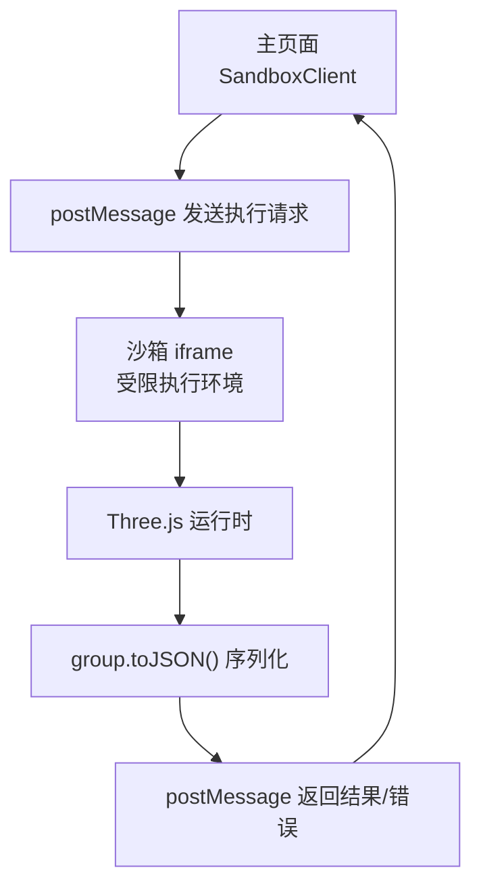
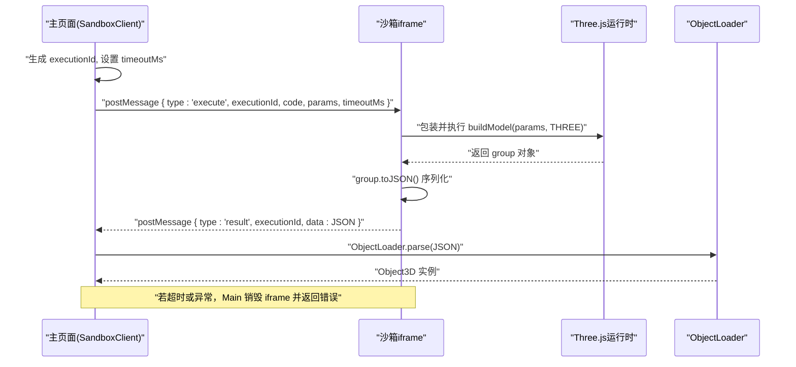
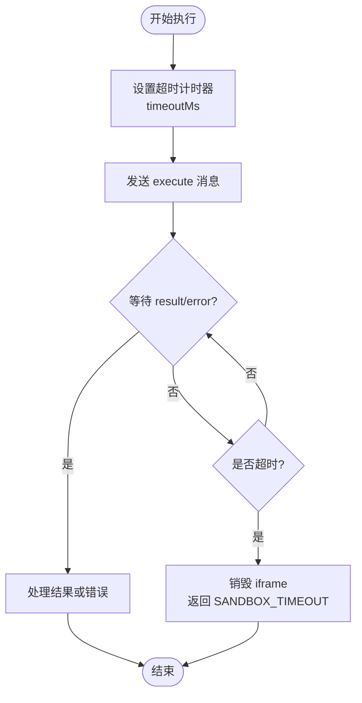
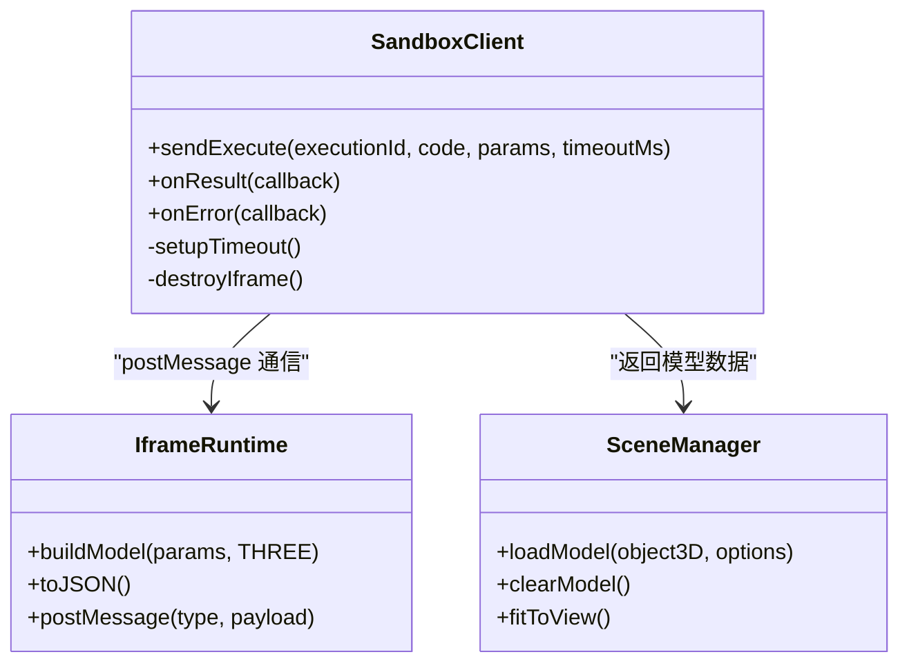

# postMessage 通信协议

<cite>
**本文引用的文件**
- [产品技术设计文档](file://tech/product-technical-design.md)
- [产品需求文档](file://prd.md)
</cite>

## 目录
1. [引言](#引言)
2. [项目结构](#项目结构)
3. [核心组件](#核心组件)
4. [架构总览](#架构总览)
5. [详细组件分析](#详细组件分析)
6. [依赖关系分析](#依赖关系分析)
7. [性能考量](#性能考量)
8. [故障排查指南](#故障排查指南)
9. [结论](#结论)
10. [附录](#附录)

## 引言
本设计文档聚焦于 ApexForge 在浏览器端通过 postMessage 与沙箱 iframe 的通信协议，覆盖以下关键主题：
- 消息格式定义：执行请求、结果返回、错误处理的消息结构
- 超时控制机制：执行时间限制、心跳检测、自动终止
- 错误映射策略：将运行时错误转换为标准化错误码和用户友好提示
- 序列化与反序列化：确保数据传输安全与可验证
- 并发控制、消息队列与重试机制：保障高并发下的稳定性与用户体验
- 具体示例路径：展示消息发送、接收与处理的参考实现位置

## 项目结构
ApexForge 采用前后端分离架构。前端负责用户交互与模型渲染，后端负责 AI 生成编排与安全校验；客户端侧通过隐藏 iframe 作为沙箱运行环境，使用 postMessage 在主页面与沙箱之间传递执行指令与结果。

图表来源
- [产品技术设计文档: 472-518:472-518](file://tech/product-technical-design.md#L472-L518)

章节来源
- [产品技术设计文档: 472-518:472-518](file://tech/product-technical-design.md#L472-L518)
- [产品需求文档: 105-117:105-117](file://prd.md#L105-L117)

## 核心组件
- SandboxClient（主线程）
  - 职责：创建并管理 iframe，封装 postMessage 发送/接收逻辑，维护执行上下文（executionId）、超时计时器、重试策略、错误映射与结果回调。
- 沙箱 iframe（受控执行环境）
  - 职责：仅暴露安全的 THREE API 与构建函数，执行传入代码，调用 group.toJSON() 序列化结果并通过 postMessage 回传。
- SceneManager（主线程）
  - 职责：加载模型、居中缩放、释放资源、截图等，消费 SandboxClient 返回的结构化数据。

章节来源
- [产品技术设计文档: 520-571:520-571](file://tech/product-technical-design.md#L520-L571)
- [产品需求文档: 59-70:59-70](file://prd.md#L59-L70)

## 架构总览
下图展示了从主页面发起执行到沙箱返回结果的完整流程，包括超时控制与错误分类。

图表来源
- [产品技术设计文档: 472-518:472-518](file://tech/product-technical-design.md#L472-L518)

章节来源
- [产品技术设计文档: 472-518:472-518](file://tech/product-technical-design.md#L472-L518)

## 详细组件分析

### 消息格式定义
为保证跨上下文传输的安全性与一致性，所有 postMessage 载荷需遵循统一结构，包含类型标识、执行上下文 ID、负载数据与可选元信息。

- 执行请求（主页面 -> 沙箱）
  - 字段说明
    - type: 固定为 "execute"
    - executionId: 唯一执行标识，用于匹配请求与响应
    - code: 待执行的 Three.js 构建代码字符串
    - params: 参数对象，供构建函数使用
    - timeoutMs: 最大允许执行时长（毫秒）
    - traceId: 可选，链路追踪 ID
  - 约束
    - code 必须通过服务端 AST 白名单校验后再下发
    - params 需符合模板 Schema 或约定结构
    - timeoutMs 由 SandboxClient 根据套餐与复杂度动态计算

- 结果返回（沙箱 -> 主页面）
  - 字段说明
    - type: 固定为 "result"
    - executionId: 与请求一致
    - data: 结构化 JSON（来自 group.toJSON()）
    - metrics: 可选，模型指标（面数、顶点数、材质数量等）
    - traceId: 可选，链路追踪 ID
  - 约束
    - 仅允许返回纯 JSON 数据，禁止函数、DOM 引用或外部对象
    - 数据大小应受上限保护，避免内存压力

- 错误处理（任一方向）
  - 字段说明
    - type: 固定为 "error"
    - executionId: 与请求一致
    - code: 标准化错误码（见“错误映射策略”）
    - message: 用户友好提示
    - details: 可选，调试信息（脱敏后）
    - traceId: 可选，链路追踪 ID
  - 约束
    - 错误码需与前端错误映射表保持一致
    - 敏感信息不得透传到用户界面

章节来源
- [产品技术设计文档: 472-518:472-518](file://tech/product-technical-design.md#L472-L518)
- [产品技术设计文档: 508-517:508-517](file://tech/product-technical-design.md#L508-L517)

### 超时控制机制
为确保沙箱内代码不会阻塞主线程或耗尽资源，SandboxClient 实施严格的超时控制与自动终止策略。

- 执行时间限制
  - 每次执行前设置 timeoutMs，并在主线程启动定时器
  - 若超时未收到 result 或 error，则判定为 SANDBOX_TIMEOUT
- 心跳检测（可选增强）
  - 在长耗时任务中，iframe 可周期性发送心跳消息（type:"heartbeat", executionId）
  - 主线程据此刷新预期完成时间，避免误判
- 自动终止
  - 超时触发后，立即销毁 iframe 并清理相关资源
  - 记录错误码与日志，支持重试或降级策略

图表来源
- [产品技术设计文档: 472-518:472-518](file://tech/product-technical-design.md#L472-L518)

章节来源
- [产品技术设计文档: 472-518:472-518](file://tech/product-technical-design.md#L472-L518)

### 错误映射策略
将运行时错误转换为标准化错误码与用户友好提示，便于统一处理与反馈。

- 错误码与提示
  - SANDBOX_TIMEOUT：执行超时，提示“模型过于复杂，已终止渲染”
  - SANDBOX_RUNTIME_ERROR：运行时报错，提示“生成代码存在执行问题，可重试”
  - MODEL_JSON_INVALID：返回结构非法，提示“模型数据无效，系统将重新生成”
  - MODEL_TOO_COMPLEX：模型复杂度超限，提示“请降低细节或使用模板模式”
  - MODEL_EMPTY：未生成有效对象，提示“描述过于模糊，请补充模型主体”
- 映射规则
  - 主线程对收到的 error 消息按 code 进行映射，显示 message
  - details 仅用于内部诊断，不直接展示给用户
  - 结合 traceId 定位问题

章节来源
- [产品技术设计文档: 508-517:508-517](file://tech/product-technical-design.md#L508-L517)

### 序列化与反序列化过程
为确保数据传输安全，采用严格的结构化 JSON 序列化和校验流程。

- 序列化（沙箱）
  - 执行成功后调用 group.toJSON() 生成标准 JSON
  - 附加可选 metrics 指标，便于后续复杂度评估
- 反序列化（主线程）
  - 使用 ObjectLoader.parse(JSON) 重建 Object3D 实例
  - 校验数据结构完整性与复杂度阈值
- 安全性
  - 仅允许返回纯 JSON，禁止函数、引用或外部对象
  - 对 JSON 大小与深度进行限制，防止内存溢出

章节来源
- [产品技术设计文档: 472-518:472-518](file://tech/product-technical-design.md#L472-L518)

### 并发控制、消息队列与重试机制
在高并发场景下，需对执行通道、消息队列与重试策略进行合理设计。

- 并发控制
  - 基于 executionId 隔离不同执行上下文
  - 限制同时活跃的 iframe 数量，避免资源争用
- 消息队列
  - 当并发达到上限时，新请求进入本地队列
  - 空闲时按 FIFO 顺序派发执行
- 重试机制
  - 对可重试错误（如 SANDBOX_RUNTIME_ERROR）进行有限次重试
  - 重试间隔采用指数退避，避免雪崩
  - 失败次数超过阈值则降级为模板模式或提示用户调整描述

章节来源
- [产品技术设计文档: 520-571:520-571](file://tech/product-technical-design.md#L520-L571)
- [产品需求文档: 126-140:126-140](file://prd.md#L126-L140)

### 代码示例路径
以下为关键实现位置的参考路径，便于快速定位与对照：
- 执行流程与错误分类
  - [产品技术设计文档: 472-518:472-518](file://tech/product-technical-design.md#L472-L518)
- 前端服务与模块划分
  - [产品技术设计文档: 520-571:520-571](file://tech/product-technical-design.md#L520-L571)
- 端到端数据流与交互
  - [产品需求文档: 126-140:126-140](file://prd.md#L126-L140)

## 依赖关系分析
postMessage 通信协议涉及的组件及其依赖如下：

图表来源
- [产品技术设计文档: 520-571:520-571](file://tech/product-technical-design.md#L520-L571)
- [产品技术设计文档: 472-518:472-518](file://tech/product-technical-design.md#L472-L518)

章节来源
- [产品技术设计文档: 520-571:520-571](file://tech/product-technical-design.md#L520-L571)
- [产品技术设计文档: 472-518:472-518](file://tech/product-technical-design.md#L472-L518)

## 性能考量
- 前端优化
  - 按需加载 Three.js 与沙箱 runtime，减少首屏体积
  - 大模型解析移至 Worker，主线程专注渲染挂载
  - 旧模型释放 geometry、material、texture，避免内存泄漏
- 网络与缓存
  - 静态资源 CDN 缓存与压缩
  - 相似 Prompt 结果复用，降低重复生成开销
- 执行效率
  - 模板模式优先，跳过 LLM 生成，提升响应速度
  - 复杂度阈值前置检查，避免低效执行

章节来源
- [产品技术设计文档: 933-960:933-960](file://tech/product-technical-design.md#L933-L960)
- [产品需求文档: 155-168:155-168](file://prd.md#L155-L168)

## 故障排查指南
- 常见问题定位
  - 执行超时：检查 timeoutMs 配置与模型复杂度，必要时启用重试或降级
  - 运行时报错：查看 details 中的堆栈摘要，确认黑名单与 AST 白名单规则
  - 模型结构非法：校验 JSON 结构与 ObjectLoader 兼容性
- 监控与告警
  - 记录 traceId、errorCode、qualityScore 等关键字段
  - 针对沙箱超时突增、校验失败率翻倍等设定告警阈值

章节来源
- [产品技术设计文档: 868-908:868-908](file://tech/product-technical-design.md#L868-L908)
- [产品技术设计文档: 508-517:508-517](file://tech/product-technical-design.md#L508-L517)

## 结论
通过统一的 postMessage 协议、严格的超时控制与错误映射策略，ApexForge 能够在保证安全性的前提下提供稳定高效的 3D 模型生成体验。配合并发控制、消息队列与重试机制，系统可在高并发场景下保持良好性能与可用性。

## 附录
- 术语
  - executionId：单次执行唯一标识
  - traceId：全链路追踪 ID
  - ObjectLoader：Three.js 提供的 JSON 反序列化工具
- 参考实现路径
  - 执行流程与错误分类
    - [产品技术设计文档: 472-518:472-518](file://tech/product-technical-design.md#L472-L518)
  - 前端服务与模块划分
    - [产品技术设计文档: 520-571:520-571](file://tech/product-technical-design.md#L520-L571)
  - 端到端数据流与交互
    - [产品需求文档: 126-140:126-140](file://prd.md#L126-L140)