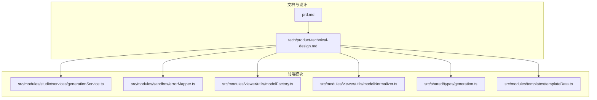
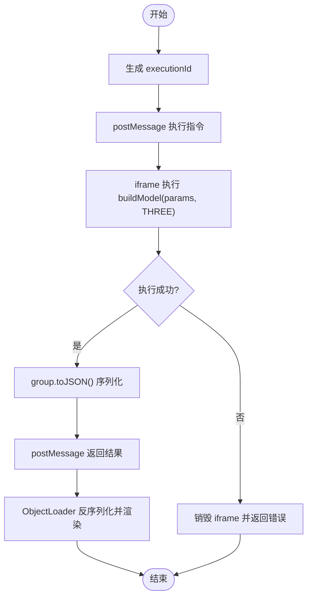
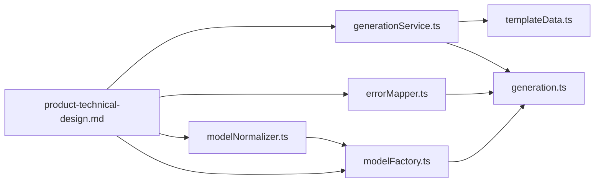

# 安全策略配置

<cite>
**本文引用的文件**   
- [prd.md](file://prd.md)
- [product-technical-design.md](file://tech/product-technical-design.md)
- [generationService.ts](file://src/modules/studio/services/generationService.ts)
- [errorMapper.ts](file://src/modules/sandbox/errorMapper.ts)
- [modelFactory.ts](file://src/modules/viewer/utils/modelFactory.ts)
- [modelNormalizer.ts](file://src/modules/viewer/utils/modelNormalizer.ts)
- [generation.ts](file://src/shared/types/generation.ts)
- [templateData.ts](file://src/modules/templates/templateData.ts)
</cite>

## 目录
1. [引言](#引言)
2. [项目结构](#项目结构)
3. [核心组件](#核心组件)
4. [架构总览](#架构总览)
5. [详细组件分析](#详细组件分析)
6. [依赖关系分析](#依赖关系分析)
7. [性能与容量规划](#性能与容量规划)
8. [故障排查指南](#故障排查指南)
9. [结论](#结论)
10. [附录：配置示例与验证工具](#附录配置示例与验证工具)

## 引言
本文件面向 ApexForge 的安全策略配置，聚焦以下目标：
- 白名单 API 列表的设计原则与维护策略（Three.js 安全 API 集合、自定义工具函数注册）
- 危险行为检测规则（语法分析、API 调用链追踪、行为模式识别）
- 安全策略的动态更新机制（热重载、版本管理）
- 不同环境下的策略差异（开发、测试、生产）
- 配置文件示例与策略验证工具
- 安全审计、合规检查与漏洞扫描的集成方案

## 项目结构
本项目为设计与原型阶段，包含产品需求与技术设计文档以及前端模块的最小实现。与安全策略相关的代码集中在沙箱错误映射、生成服务、模型工厂与归一化等位置；策略定义与规范在技术设计文档中明确。



图示来源
- [prd.md:126-154](file://prd.md#L126-L154)
- [product-technical-design.md:428-519](file://tech/product-technical-design.md#L428-L519)

章节来源
- [prd.md:126-154](file://prd.md#L126-L154)
- [product-technical-design.md:428-519](file://tech/product-technical-design.md#L428-L519)

## 核心组件
- 校验分层与黑名单/白名单策略：在服务端进行输出协议校验、文本黑名单、AST 白名单；客户端通过 iframe 沙箱执行并限制超时销毁与结果校验。
- 沙箱运行时：隐藏或可控 iframe 隔离执行，仅暴露 Three.js 与必要构建函数，postMessage 通信，返回结构化 JSON。
- 模板与参数化：优先使用模板与参数生成，降低自由代码生成的风险面。
- 质量评分与可观测性：记录 traceId、耗时、状态、失败原因与复杂度指标，支撑持续优化。

章节来源
- [product-technical-design.md:428-519](file://tech/product-technical-design.md#L428-L519)
- [prd.md:143-154](file://prd.md#L143-L154)

## 架构总览
下图展示从用户输入到沙箱执行的端到端流程，以及安全校验在各层的位置。

```mermaid
sequenceDiagram
participant U as "用户"
participant FE as "前端 Studio"
participant API as "API 网关"
participant GEN as "生成服务"
participant VAL as "校验器(服务端)"
participant BOX as "沙箱 iframe"
participant RND as "Three.js 渲染"
U->>FE : 输入描述
FE->>API : POST /api/v1/generations
API->>GEN : 创建任务
GEN->>VAL : 协议/黑名单/AST 校验
VAL-->>GEN : 校验报告
GEN-->>API : 返回结果
API-->>FE : 推送结果
FE->>BOX : postMessage 执行
BOX->>RND : 构建模型对象
RND-->>BOX : group.toJSON()
BOX-->>FE : 返回序列化数据
FE->>FE : ObjectLoader 加载并渲染
```

图示来源
- [product-technical-design.md:362-391](file://tech/product-technical-design.md#L362-L391)
- [prd.md:126-140](file://prd.md#L126-L140)

## 详细组件分析

### 白名单 API 列表设计与维护策略
- 设计原则
  - 最小权限：仅允许 Three.js 基础几何体、材质、Mesh/Line 构造器及安全的变换方法。
  - 显式声明：全局变量仅限 THREE、Math、params 与已注册的安全工具函数。
  - 可度量：对代码长度、AST 深度、循环层数、Mesh 数量、顶点估算等进行上限控制。
- 维护策略
  - 变更需经回归集验证，确保不破坏既有模板与资产。
  - 新增 API 需评估安全风险与性能影响，纳入灰度发布与回滚预案。
  - 定期审查黑名单与白名单，结合告警与误报率调整阈值。

章节来源
- [product-technical-design.md:452-469](file://tech/product-technical-design.md#L452-L469)

### 危险行为检测规则
- 语法分析与 AST 白名单
  - 禁止动态执行、网络访问、DOM 访问、动态加载、原型污染与计算风险。
  - 限制最大代码长度、AST 深度、循环层数、Mesh 数量与顶点估算。
- API 调用链追踪
  - 以 traceId 贯穿请求链路，记录各阶段耗时与状态，便于定位问题。
- 行为模式识别
  - 基于正则与 AST 的模式匹配，识别高风险调用序列与异常结构。
  - 结合质量评分与用户反馈，持续优化规则与阈值。

章节来源
- [product-technical-design.md:441-469](file://tech/product-technical-design.md#L441-L469)
- [product-technical-design.md:870-907](file://tech/product-technical-design.md#L870-L907)

### 安全策略的动态更新机制
- 热重载
  - 建议将黑名单/白名单与模板元数据置于可热更新的配置中心，支持在线刷新与灰度生效。
- 版本管理
  - Prompt、模板与校验规则均版本化，支持快速回滚与对比分析。
  - 每次生成记录保存 promptVersion，用于质量回归与问题回溯。

章节来源
- [product-technical-design.md:419-425](file://tech/product-technical-design.md#L419-L425)

### 不同环境下的安全策略差异
- 开发环境
  - 放宽部分限制以便调试，但保留关键黑名单与沙箱隔离。
  - 开启更详细的日志与告警。
- 测试环境
  - 严格遵循生产阈值，运行自动化安全测试与回归集。
- 生产环境
  - 启用全量校验、限流、配额与审计，严格执行超时销毁与结果校验。

章节来源
- [prd.md:143-154](file://prd.md#L143-L154)
- [product-technical-design.md:898-907](file://tech/product-technical-design.md#L898-L907)

### 沙箱执行与错误处理
- 执行流程
  - 主线程生成 executionId，向 iframe 发送执行指令，iframe 包装并执行 buildModel(params, THREE)。
  - 成功后调用 group.toJSON()，主线程反序列化并自动居中缩放。
  - 超时或异常则销毁 iframe 并返回错误。
- 错误分类与映射
  - 统一错误码与用户提示，便于前端展示与运维监控。



图示来源
- [product-technical-design.md:498-507](file://tech/product-technical-design.md#L498-L507)

章节来源
- [product-technical-design.md:498-517](file://tech/product-technical-design.md#L498-L517)
- [errorMapper.ts:1-12](file://src/modules/sandbox/errorMapper.ts#L1-L12)

### 模板系统与参数化约束
- 模板优先：优先选择模板与参数生成，减少自由代码的风险面。
- 参数 Schema：定义参数类型、范围与默认值，提升稳定性与可编辑性。
- 模板匹配：基于类别与标签检索候选模板，置信度不足时切换 Hybrid 或 Code Mode。

章节来源
- [product-technical-design.md:797-804](file://tech/product-technical-design.md#L797-L804)
- [templateData.ts:1-54](file://src/modules/templates/templateData.ts#L1-L54)

### 模型工厂与归一化
- 模型工厂按类别创建基础几何体组合，设置阴影与材质，保证一致性。
- 归一化计算边界盒并自动居中缩放，提升展示体验。

章节来源
- [modelFactory.ts:1-192](file://src/modules/viewer/utils/modelFactory.ts#L1-L192)
- [modelNormalizer.ts:1-15](file://src/modules/viewer/utils/modelNormalizer.ts#L1-L15)

## 依赖关系分析
- generationService 依赖模板数据与类型定义，负责本地生成模拟与 traceId 生成。
- errorMapper 提供沙箱错误码到用户消息的映射。
- modelFactory 与 modelNormalizer 提供模型构建与归一化能力。
- 技术设计文档定义了校验分层、黑名单/白名单、沙箱与可观测性等策略。



图示来源
- [generationService.ts:1-30](file://src/modules/studio/services/generationService.ts#L1-L30)
- [errorMapper.ts:1-12](file://src/modules/sandbox/errorMapper.ts#L1-L12)
- [modelFactory.ts:1-192](file://src/modules/viewer/utils/modelFactory.ts#L1-L192)
- [modelNormalizer.ts:1-15](file://src/modules/viewer/utils/modelNormalizer.ts#L1-L15)
- [generation.ts:1-29](file://src/shared/types/generation.ts#L1-L29)
- [templateData.ts:1-54](file://src/modules/templates/templateData.ts#L1-L54)
- [product-technical-design.md:428-519](file://tech/product-technical-design.md#L428-L519)

章节来源
- [generationService.ts:1-30](file://src/modules/studio/services/generationService.ts#L1-L30)
- [errorMapper.ts:1-12](file://src/modules/sandbox/errorMapper.ts#L1-L12)
- [modelFactory.ts:1-192](file://src/modules/viewer/utils/modelFactory.ts#L1-L192)
- [modelNormalizer.ts:1-15](file://src/modules/viewer/utils/modelNormalizer.ts#L1-L15)
- [generation.ts:1-29](file://src/shared/types/generation.ts#L1-L29)
- [templateData.ts:1-54](file://src/modules/templates/templateData.ts#L1-L54)
- [product-technical-design.md:428-519](file://tech/product-technical-design.md#L428-L519)

## 性能与容量规划
- 前端
  - 动态加载 Three.js 与沙箱 runtime，Worker 解析大模型 JSON，避免主线程阻塞。
  - 使用 InstancedMesh 批量渲染重复元素，LOD 与复杂度阈值控制。
- 后端
  - 相似 Prompt 缓存、模板模式跳过 LLM、队列化异步生成与供应商熔断。
- 数据库
  - 合理索引与归档策略，大字段迁移至对象存储。

章节来源
- [product-technical-design.md:933-958](file://tech/product-technical-design.md#L933-L958)

## 故障排查指南
- 常见错误码与提示
  - SANDBOX_TIMEOUT：模型执行超时，已安全终止。
  - SANDBOX_RUNTIME_ERROR：生成代码执行失败，请重试或降低复杂度。
  - MODEL_JSON_INVALID：模型数据结构无效，无法加载到场景。
- 排查步骤
  - 根据 traceId 定位链路日志，查看各阶段耗时与状态。
  - 检查校验报告与质量评分，确认是否命中黑名单或超出复杂度阈值。
  - 复核模板与参数 Schema，必要时回滚到上一稳定版本。

章节来源
- [errorMapper.ts:1-12](file://src/modules/sandbox/errorMapper.ts#L1-L12)
- [product-technical-design.md:870-907](file://tech/product-technical-design.md#L870-L907)

## 结论
ApexForge 的安全策略以“模板优先、严格校验、强隔离”为核心，通过多层校验与沙箱隔离保障 AI 生成代码的安全性。配合版本管理与可观测性体系，可在持续演进中保持高可用与低风险。

## 附录：配置示例与验证工具

### 配置项清单（建议）
- 黑名单 API 列表：动态执行、网络访问、DOM 访问、动态加载、原型污染、计算风险。
- AST 白名单策略：允许的语法与构造器、受限的全局变量、复杂度上限。
- 沙箱运行时：sandbox 属性、CSP 脚本来源、超时时间、执行上下文白名单。
- 模板与参数：模板 ID、版本、参数 Schema、默认参数、渲染函数。
- 可观测性：traceId、日志字段、告警阈值。

章节来源
- [product-technical-design.md:441-469](file://tech/product-technical-design.md#L441-L469)
- [product-technical-design.md:490-507](file://tech/product-technical-design.md#L490-L507)
- [product-technical-design.md:882-907](file://tech/product-technical-design.md#L882-L907)

### 策略验证工具（建议）
- 单元测试
  - Validator 黑名单与 AST 白名单用例集。
  - SandboxClient 超时与错误映射用例。
- 集成测试
  - 从创建任务到保存资产的完整链路。
  - 模板模式与代码模式分别覆盖。
- 安全测试
  - 恶意代码样本集、沙箱逃逸尝试、动态 import/fetch/WebSocket/DOM 阻断测试。
  - 无限循环与复杂几何体压力测试。
- 质量回归测试
  - 固定 Prompt 集与质量分基线，变更前后对比成功率与耗时。

章节来源
- [product-technical-design.md:1040-1075](file://tech/product-technical-design.md#L1040-L1075)

### 安全审计、合规检查与漏洞扫描集成（建议）
- 审计日志
  - 记录用户操作、模板与策略变更、生成任务与校验报告。
- 合规检查
  - Prompt 敏感词过滤、输出模型品牌与违规符号检测。
- 漏洞扫描
  - 依赖库漏洞扫描、CI 流水线集成、告警与修复闭环。

章节来源
- [prd.md:143-154](file://prd.md#L143-L154)
- [product-technical-design.md:910-931](file://tech/product-technical-design.md#L910-L931)